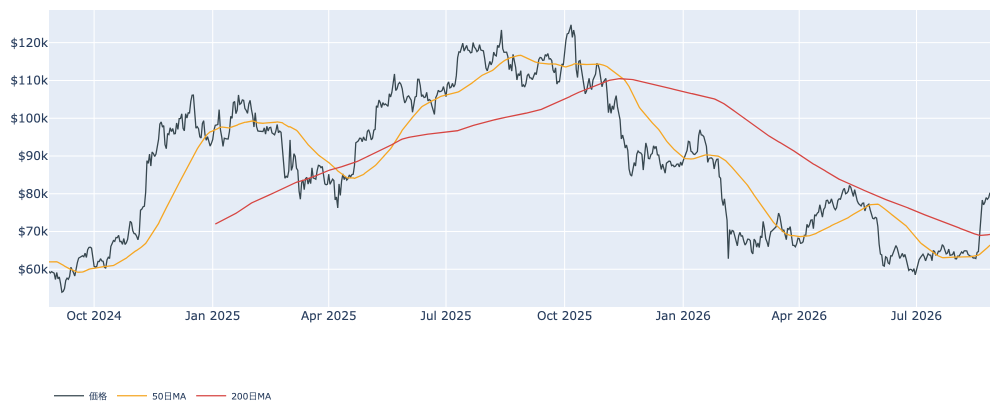
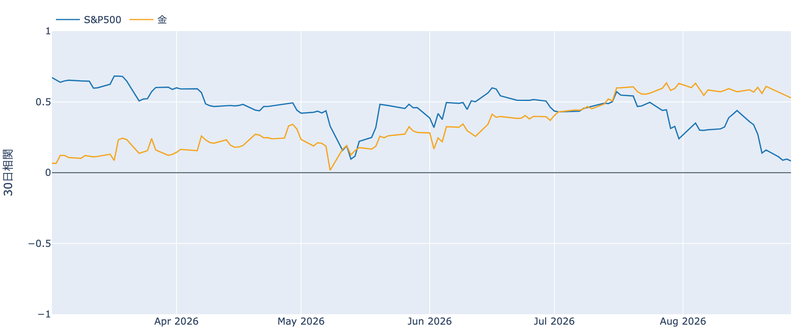
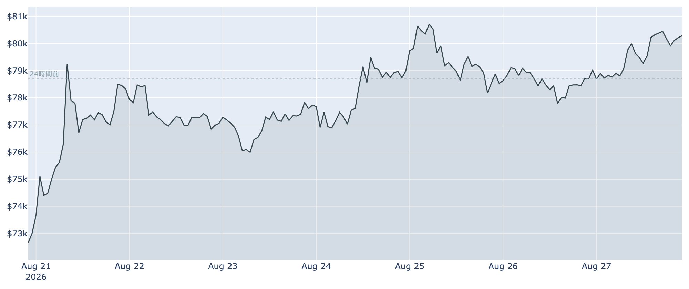
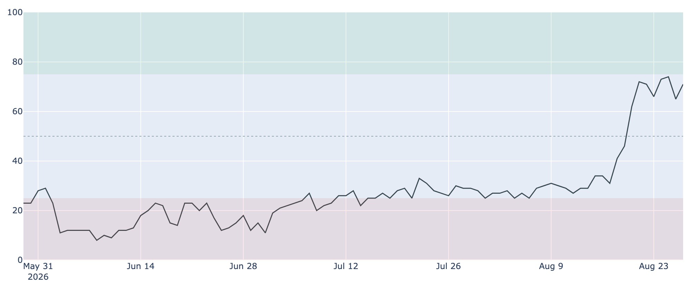
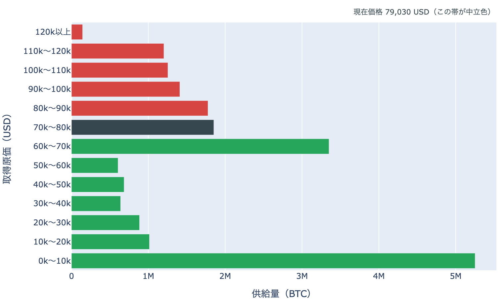
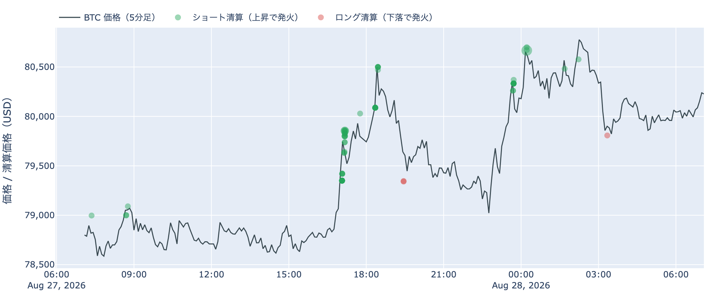
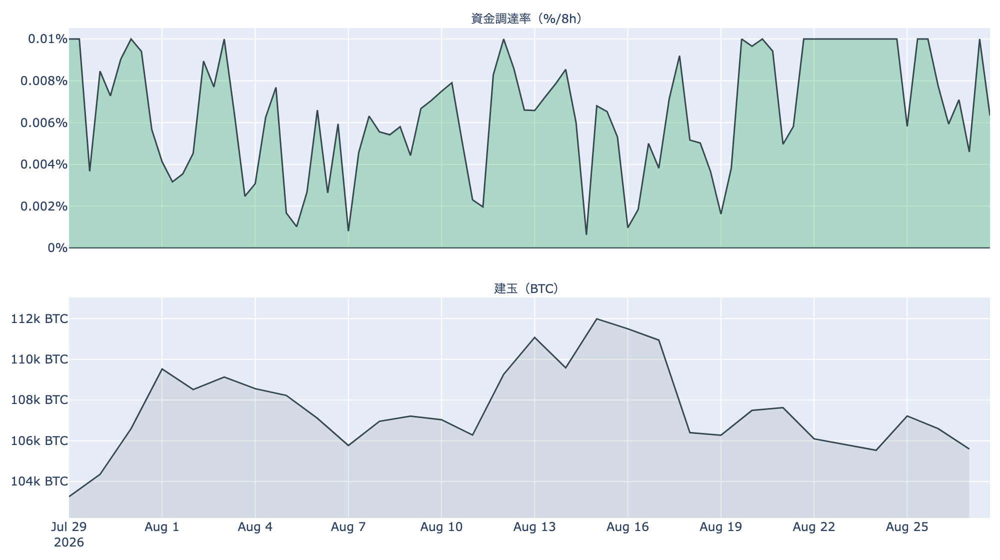
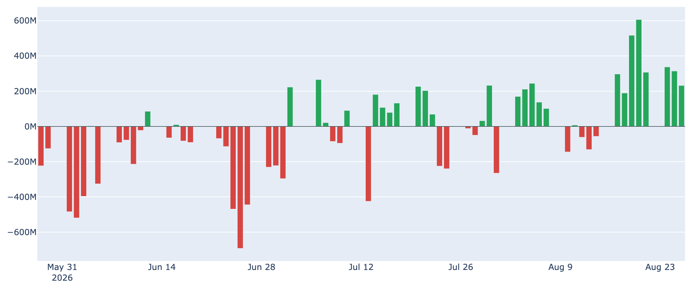
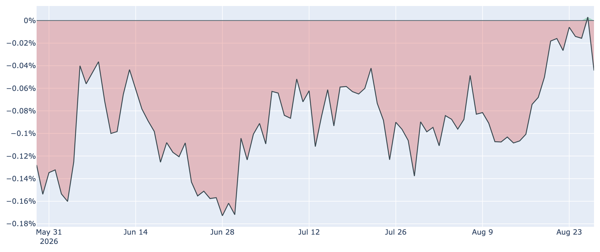

# 膠着は上へ割れた ― $80,000台に乗せ、今夜は新FRB議長の初講演

**2026年8月28日**

6日間続いた$77,000〜$79,000台の持ち合いを、上に抜けました。8月28日7時5分時点の実勢価格は約$80,281で、24時間では+2.0%（レンジ$78,552〜$80,836）。1週間で+10.0%、1か月では+25.7%です。取得原価の分布でも価格の居場所が$80,000台の帯へ一段上がり、焼けたポジションの向きは1日でまたショート側へ戻りました。そして今夜、日本時間23時にウォーシュFRB議長が就任後初の基調講演に立ちます。

（数値は8月28日7時5分（日本時間）時点までに取得した各種データに基づきます。価格と取引所プレミアムはその時点の実勢、市場心理は8月27日の確定値、オンチェーン指標は8月26日、ETF資金フローは8月26日、株・金などの終値は8月27日時点です。なお、オンチェーンの保有・年齢の指標には、ETF・取引所が預かっている分も含まれています。）

## 1. 全体像：リスクオン寄りの並びのなかで、BTCが上に動いた

* **水準**: 8月28日7時5分時点で約$80,281。直近の確定日足終値は8月26日（UTC）の約$79,026で、持ち合い上限をわずかに切り上げて確定しています。50日移動平均（約$66,400）も200日移動平均（約$69,200）も大きく上回りますが、50日線自体はまだ200日線の下で、移動平均の並び（デッドクロス圏）は変わっていません。過去2年のレンジでの位置は下から44%ほどです。
* **外部環境**（すべて8月27日の終値）: S&P500は7,731で+0.7%、金は4,654.80ドルで+1.2%（5営業日では+3.1%）、VIX（＝株式市場の恐怖指数）は14.51へ-4.6%、ドル指数は99.12でほぼ横ばい。WTI原油は83.54ドルで+1.6%と、前日までの下げから反発しました。銘柄の並びは1営業日で**リスクオン寄り**で、株高・金高のなかをBTCも上に動いた形です。これは値動きの並びであって、原因の説明ではありません。
* **どこと一緒に動いているか**: BTCとの30日相関（8月27日終値ベース）は株（S&P500）+0.08に対して金+0.53。株との連動は取得できる約11か月のなかで最も薄い水準まで下がり、金と並んで動く形が続いています。
* こうした「株から離れて金と揃う」並びについて、レイ・ダリオ氏が8月21日の論考で示した見方と符合を指摘する読み方もあります。同氏は、政府債務の需給不均衡が終盤に入ると長期金利の上昇と、とくに金に対する通貨の下落が進み、**政府が発行しないマネー――金とビットコイン――が相対的に良い成績を出す**と見ています。これは観測ではなく**予測**で、時期についても本人が「3年、プラスマイナス2年。ただしこれは外れる予想だと思う」と留保を付けています。また同氏が主役に置くのは**金（資産の10〜15%）**で、ビットコインは「少し」という位置づけです。相関の並びが同じ絵を描いているというところまでで、これが原因だとは言えません。

## 2. データの解説：注目すべき5つのポイント

### ① 6日目の持ち合いを上に抜け、心理は強欲圏に戻った

* **上放れ**: 日足終値は8月22日から$77,054→$77,729→$78,982→$78,527と$79,000の下に収まってきましたが、8月26日に$79,026とわずかに上限を超え、8月28日朝の実勢は約$80,281。24時間レンジの上限$80,836は、8月25日に付けた直近高値$81,265まであと0.5%の位置です。
* **市場心理**: Fear & Greed（＝市場心理の指数）は8月27日に71と「強欲」圏です。前日の65から戻し、1週間前（8月20日）は62、30日前は29でした。恐怖から強欲への転換が定着した1週間です。

### ② 価格の帯が$80,000台へ変わった

8月26日時点の取得原価の分布（この日の終値約$79,030で束ねたもの）に、いまの価格を重ねます（分布は数日遅れ、価格は実勢です）。

* **帯またぎ**: 価格の居場所が$70,000〜$80,000の帯から**$80,000〜$90,000の帯（約178万BTC・全供給の8.8%）へ1帯上がりました**。通過した帯を含めて約363万BTC・全供給の18%の上へ抜けたことになり、価格より上に残る供給は28.8%から**20.0%**へ縮みました。30日前（約$63,800）からは2帯・全供給の約35%分を通過しています。
* **ただし乗ったばかり**: いまの位置は帯の下端から3%で、**下端の$80,000まではわずか-0.3%**。境界の上に立ったところです。上端の$90,000までは+12.1%あり、その先で最も厚いのは$90,000〜$100,000の約141万BTC（7.0%）。さらに$100,000〜$110,000に約125万BTC、$110,000〜$120,000に約120万BTCと、厚さの揃った層が続きます。すぐ下は$70,000〜$80,000に約185万BTC、その下の$60,000〜$70,000に約335万BTCです。
* この分布は、それぞれのコインが**最後に動いたときの価格**で束ねたものです。誰が持っているかは分からず、自分のウォレット間の移動や取引所への入出金でも価格は付け替わるため、そのまま「その値段で買った人の量」とは読めません。

### ③ 焼けた向きは1日でショート側へ戻り、建玉は増えていない

* **向きの再反転**: Hyperliquidの約定履歴から観測できた直近24時間の強制清算は、金額ベースで**99.5%がショート（売り建て）側**でした。前日は約86%がロング側だったので、焼ける向きが1日でまた入れ替わっています。焼けた価格帯は79,000ドル台に57%、80,000ドル台に43%。8月27日17時台（日本時間）の1時間に全体の51%が集中しており、**持ち合い上限を上抜ける局面は、売り建ての清算を伴いました**。清算と値動きは同時刻に起きるため、どちらが先かはこのデータでは決まりません。被清算アドレスは68件で、前日の16件から増えています。

* **建玉は減ったまま**: 建玉（＝先物の未決済残高）は108,928 BTC（約83億ドル、8月27日UTC）で、7日間では-1.8%。**価格が1週間で10%上がるあいだ、先物の残高はむしろ小さくなっています。**新規のレバレッジが積み上がって押し上げた形ではない、という並びです。
* **買い持ちのコスト**: 資金調達率（＝先物の買い持ちが払う金利）は直近8時間で+0.0090%（年率換算 約+9.8%）と、33日あまり連続のプラスです。この銘柄の上限（±0.3%／8時間）には遠く、過熱と呼べる水準ではありません。年率から同じ期間で置ける短期金利（13週Tビル、3.68%）を引いた上乗せは**約+4.0ポイント**で、直近34日の平均（約+3.1ポイント）並み。これは「確実に取れる利回り」ではなく、置いておくだけの金利に対する上乗せ、という意味の数字です。

### ④ ETFは8営業日連続の流入、現物のプレミアムは110日ぶりに浮上した

* **流入の継続**: 米国スポットETFの純流入は8月26日に+約2.3億ドルで、**8月17日から8営業日連続の流入**。直近7営業日の合計は+約25億ドルです。8月26日の内訳はIBITが+約2.0億ドルと全体の9割弱を占め、流入の集中は続いています。
* **現物側にも変化**: 取引所プレミアム（＝米国とそれ以外の価格差）は、**8月26日に+0.003%と、およそ110日ぶりにプラス圏で確定しました**。8月28日朝の実勢は-0.04%と小幅なマイナスに戻っていますが、5月以降ずっと下に張り付いてきた指標がゼロ近辺の攻防に移っています。ETFの創出という経路だけが買っていた形から、現物の米国需要が水面まで顔を出したところです。

### ⑤ 長期側で動いた量は23万BTC台、損益は1割れのまま

* **量**: 長期保有層のネットポジション変化（＝長期側で数えられる供給の増減、過去30日）は8月26日時点で**約-23.5万BTC**。前日の約-25.0万BTCからわずかに縮みましたが、1週間前（約-15.4万BTC）より深く、30日前は+15.7万BTCのプラス圏でした。過去4年の分布では下から18%に入る大きさで、**預かり分の混入を差し引いても、この規模と方向は変わりません。**
* **中身**: LTH-SOPR（＝長期勢の損益）は0.94と1を割ったままです。長期側で動いたコインは、平均すると損失側で動いています。量の減少と利益確定の向きが揃っていないため、この日の材料でも「量が減っている」という事実までにとどめます。
* **短期側は含み益が厚い**: 短期保有者のRealized Price（＝平均取得原価）は約$69,500で、実勢価格はこれを15%ほど上回ります。短期勢SOPR（＝短期勢の損益）は1.011と、過去4年で上から9%の位置。利益を確定しながら上がる、上昇局面の並びが続いています。
* **市場全体**: MVRV Z-Score（＝市場全体の含み益）は0.88で、1週間前の0.56、30日前の0.37から切り上がりました。それでも天井圏の目安（6〜7）には遠い位置です。

（補足：ハッシュレートは964.4 EH/sと30日間で+9.6%、次回の難易度調整は+0.9%の見込み。Puell Multiple（＝マイナー収入の平年比）は1.01と、昨年秋以来おおむね1を割り込んできた水準から365日平均の水準に戻りました。メンプールは約43ブロック分の滞留で、最速の推奨手数料は3 sat/vBと閑散なままです。）

## 3. 相場転換を見極めるための「3つの分岐点」

1. **$80,000に日足終値で定着できるか**: 取得原価の分布で見ると、いまの価格は$80,000〜$90,000の帯の下端からわずか0.3%上に立ったばかりです。ここを保てば、上端の$90,000（+12.1%）とその先の約141万BTCの帯が次の関門になります。割り込めば元の持ち合いへ戻る形です。建玉が増えないまま上へ抜けるなら現物の買いが引き継いだ形、建玉が急増しながら上げるなら再びレバレッジ主導、という読み分けは有効なままです。
2. **今夜のウォーシュFRB議長の初講演**: ジャクソンホール会議で、日本時間28日23時に就任後初の基調講演があります。今年のテーマは「金融イノベーション」で、決済や金融技術への言及も予想されています。9月16日のFOMCに向けて市場は3分の1程度の利上げ確率を織り込んでおり、7月のPCE（個人消費支出物価指数）は前年比3.7%と2%目標を大きく上回ったままです。今回の上げの起点が金利低下だったことを踏まえると、講演で金利観がタカ派側へ振れれば上げの前提が薄くなります。米10年債利回りは8月27日時点で4.67%です。
3. **米国の現物需要がプラス圏に定着するか**: 取引所プレミアムは110日ぶりのプラスを付けたあと、ゼロ近辺で往復しています。ETFの流入が続くなかでこちらもプラス側に定着すれば、米国の買いが2つの経路で揃うことになります。逆にマイナス圏へ深く戻るなら、この上昇の買い手は引き続きETF1本ということになります。

## 総括

6日間の膠着は上に割れました。持ち合い上限の突破は売り建ての清算を伴い、価格の居場所は取得原価の分布で$80,000台の帯へ1帯上がりましたが、帯の下端から0.3%というきわどい位置でもあります。買いの中身は、ETFの8営業日連続の流入に、110日ぶりにプラス圏へ顔を出した現物プレミアムが加わりかけている一方、先物の建玉は1週間で減っており、レバレッジが押し上げた形ではありません。オンチェーンでは長期側から動く量が23万BTC台と大きいまま、動いた分の損益は1を割っています。**上に乗ったばかりの価格が、今夜の新議長の初講演を最初の試金石として迎える**、というのが8月28日時点の姿です。

---

*本稿は情報提供を目的としたものであり、投資助言ではありません。将来の価格動向を保証・示唆するものではなく、投資判断は各自の責任において行ってください。*
