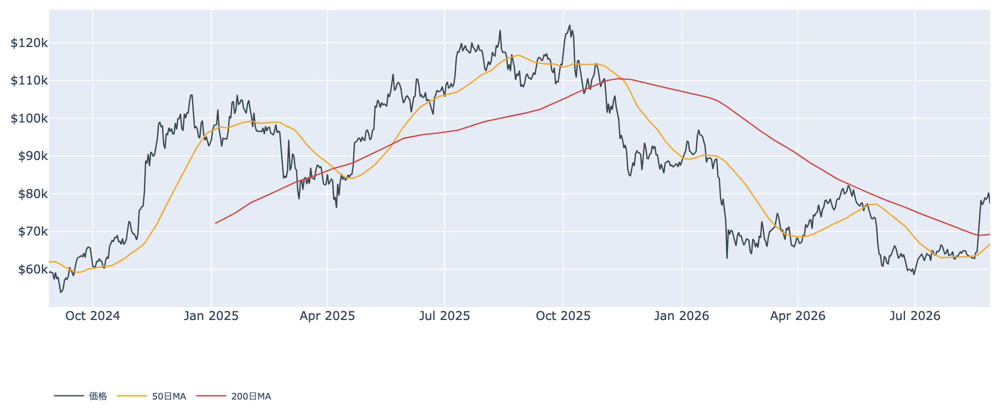
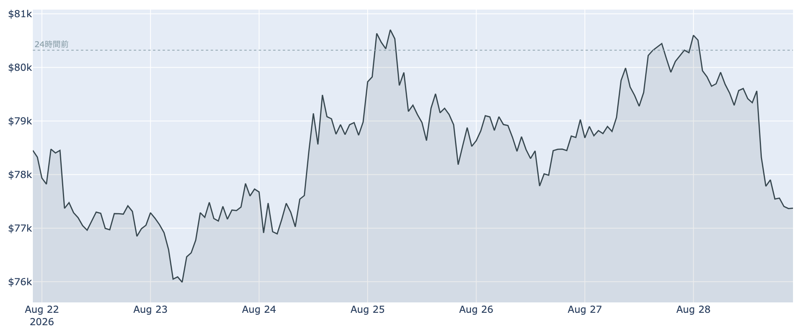
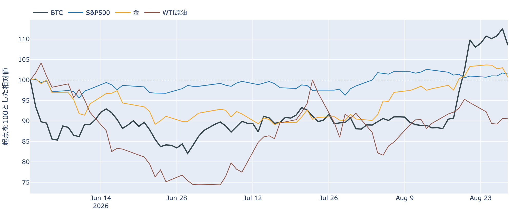
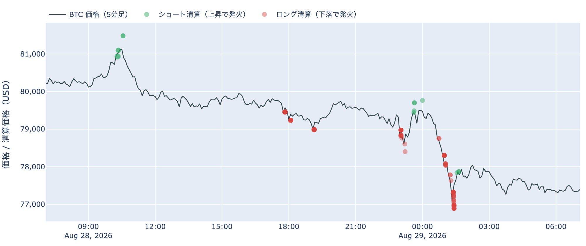
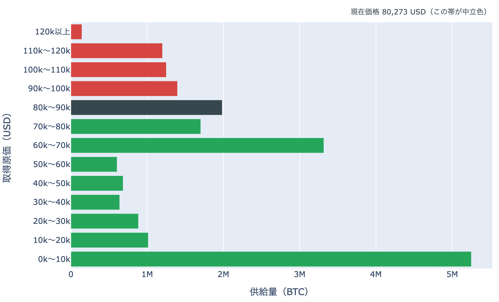
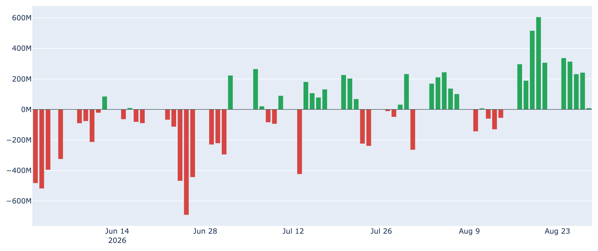
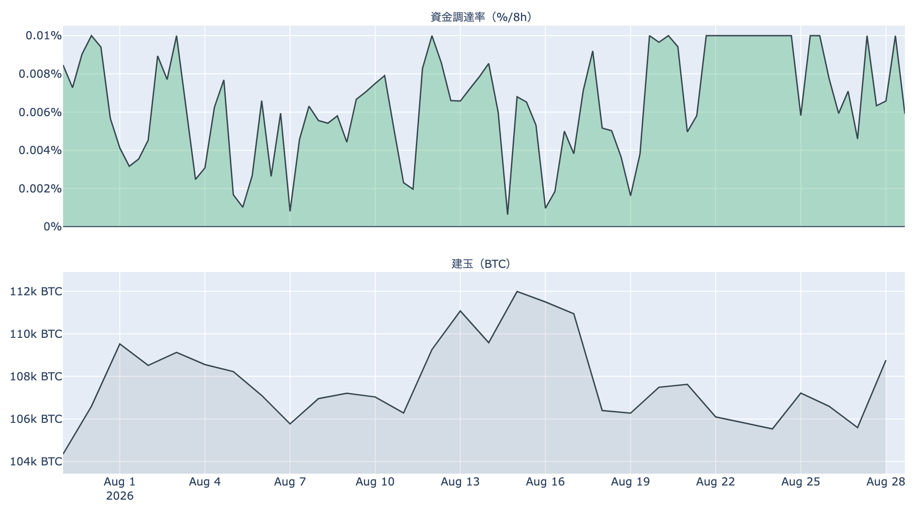

# $80,000台を一夜で明け渡した ― 利上げ観測の急浮上と、9日目に細ったETFの買い

**2026年8月29日**

前日に乗せたばかりの$80,000台から、24時間で押し戻されました。8月29日7時5分時点の実勢価格は約$77,378で、24時間では-3.7%（レンジ約$76,800〜$81,500）。1週間では-1.2%、1か月ではまだ+21.1%です。日本時間28日夜のウォーシュFRB議長の初講演を挟んで、株・金・BTCが揃って下を向き、焼けたポジションの向きはロング側に偏りました。

（数値は8月29日7時5分（日本時間）時点までに取得した各種データに基づきます。価格と取引所プレミアムはその時点の実勢、市場心理は8月28日の確定値、オンチェーン指標は8月27日、ETF資金フローは8月28日、株・金などの終値は8月28日時点です。なお、オンチェーンの保有・年齢の指標には、ETF・取引所が預かっている分も含まれています。）

## 1. 全体像：上げの前提だった金利観が、一晩で入れ替わった

* **水準**: 8月29日7時5分時点で約$77,378。直近の確定日足終値は8月27日（UTC）の約$80,275で、そこから約3%下にいます。50日移動平均（約$66,700）も200日移動平均（約$69,300）も大きく上回っていますが、50日線自体はまだ200日線の下で、移動平均の並び（デッドクロス圏）は変わりません。過去2年のレンジでの位置は下から40%ほどです。
* **この24時間の形**: 高値$81,480から安値$76,846まで、値幅は約6%。8月中旬から8月27日にかけての+24%の上げに対する、初めてのまとまった押しです。

* **外部環境**（すべて8月28日の終値）: S&P500は7,711.76で-0.3%、金は4,504.10ドルで-2.3%（5営業日では-2.6%）、ドル指数は99.68で+0.5%、米10年債利回りは4.72%へ+1.0%。VIX（＝株式市場の恐怖指数）は14.43で-0.6%、WTI原油は83.44ドルでほぼ横ばいでした。銘柄の並びは1営業日では**まちまち**（5営業日ではリスクオン寄り）ですが、金が2%を超えて下げ、ドルと長期金利が上がるなかで、BTCも下げた形です。これは値動きの並びであって、原因の説明ではありません。

* **材料**: 日本時間28日夜、ウォーシュFRB議長がジャクソンホールで就任後初の基調講演を行い、インフレは依然として高すぎるとして、今後数か月のうちに利上げが必要になりうるとの認識を示しました。夏場の物価指標が予想より良かったことについても「基調が意味のある改善を見せたとは言えない」と述べています。これを受けて9月16日のFOMCに向けた市場の織り込みは、講演前の3割前後から**利上げ5〜6割**へ跳ね上がりました（CMEのFedWatchで約56%）。フォワードガイダンス（＝政策の先行き示唆）を出さない姿勢は変えていません。
* **効き方の下地**: 1年以上動いていない供給は8月27日時点で62.5%（3か月前から+1.9pt）。全体の6割強が長く動かないままなので、同じ規模の売り買いでも価格が動きやすい下地は続いています。

## 2. データの解説：注目すべき5つのポイント

### ① 押しはロング側の清算を伴った

* **向き**: 直近24時間にHyperliquid（＝オンチェーンの無期限先物取引所）で実際に焼けた記録のうち、**約77%がロングの清算**でした。前日までの上げ局面ではショート側が焼けていたので、1日で向きが反転しています。
* **場所と時間**: 焼けたポジションが最も集中した価格帯は**$78,000台（全体の35%）**で、$77,000台（24%）、$79,000台（18%）と続きます。時間では日本時間29日1時台に全体の3分の1が集中しました。被清算アドレスは198件で、最大の1件でも全体の9%と、特定の1者に偏った形ではありません。
* ここで拾えているのはHyperliquid1取引所の、さらにごく一部です（市場全体の清算額の1%に満たない）。金額の大きさではなく、**どこで・どの向きが焼けたか**を見るための材料です。また清算と値動きは同時刻に起きるため、どちらが先かはこのデータでは決まりません。

### ② 取得原価の分布では、価格の居場所が1日で1つ下の帯へ

* **帯またぎ**: 8月27日時点の分布に今の価格を重ねると、価格の居場所は$80,000〜$90,000の帯から**$70,000〜$80,000の帯へ1つ下がりました**。通過した帯に含まれる供給は368万BTC（全供給の18.4%）です。
* **上下配分**: 価格より上にある帯の合計は、1日前の19.9%から**29.8%**へ増えました（下の帯は61.7%、価格をまたぐ帯が8.5%）。
* **境界までの距離**: いる帯の下端$70,000まで-9.5%、上端$80,000まで+3.4%。上に戻る側では$80,000〜$90,000に198万BTC（9.9%）、その上にも$90,000〜$100,000に140万BTC（7.0%）、$100,000〜$110,000に125万BTC（6.2%）、$110,000〜$120,000に120万BTC（6.0%）と積み上がっています。下側では$60,000〜$70,000が331万BTC（16.5%）と厚い帯です。
* この分布は、それぞれのコインが**最後に動いたときの価格**で束ねたものです。誰が持っているかは分からず、自分のウォレット間の移動や取引所への入出金でも価格は付け替わるため、そのまま「その値段で買った人の量」とは読めません。

### ③ ETFの買いは9営業日目にほぼ止まった

* **日次**: 8月28日の米国スポットBitcoin ETFの純流入は**+9.3百万ドル**。流入自体は8月17日から9営業日続いていますが、金額は前日の+242.3百万ドルから2桁小さくなりました。この日プラスを計上したファンドは1本だけです。
* **週次**: 直近7営業日の合計はなお+2,049.5百万ドルで、8月17日以降の流入基調そのものはまだ崩れていません。上場来の累計は+549億ドルです。
* 大きく買われた週の最終日に流入がほぼ止まった、という並びで、価格の押しと同じ日に起きています。

### ④ 先物は強気の傾きのまま、規模も減っていない

* **資金調達率**: 直近8時間で**+0.0100%（年率換算 約+11.0%）**。ロング側がショート側に払う状態が100回連続（約33.3日）続いており、直近30日レンジの上限にあります。ただしこの銘柄の上限（8時間あたり±0.3%）にはまだ遠く、過熱と呼べる水準ではありません。
* **置いておくだけの金利に対する上乗せ**: この年率から短期金利（13週物Tビル、8月28日時点で3.73%）を引いた超過は**+4.48pt**。直近34日の平均+3.32ptより高い側にありますが、レンジの外には出ていません。現物の保管や証拠金の追加が要るので、確実に取れる利回りではありません。
* **建玉**: 106,385BTC（約87億ドル、8月28日UTC時点）で、1週間で+1.1%。価格が6%動いた日ですが、建玉は減っていません。投げによる強制的な手仕舞いが規模を削るところまでは行っていない形です。

### ⑤ 長期側から動く量は25万BTC台へ拡大、動いた分は損失側

* **長期保有層のネットポジション変化**（＝長期側で数えられる供給の増減、過去30日）は8月27日時点で**約-25.4万BTC**。1週間前（約-18.8万BTC）からさらに減少幅が広がり、30日前（約+16.0万BTC）からは符号が反転しています。**預かり分の混入を差し引いても、この規模と方向は変わりません**。
* **長期勢SOPR**（＝長期勢の損益）は約0.95と1を下回ったまま。動いた長期側のコインは、最後に動いたときの価格を下回る水準で動いています。量は「減った」方向、損益は「利益確定ではない」方向で、2本が同じ絵を指してはいません。
* **短期勢**は逆の位置にいます。短期保有者の平均取得単価は約$69,800で、いまの価格はこれを約11%上回ります。短期勢SOPR（＝短期勢の損益）も約1.01で、8月19日以降に入った層はまだ含み益の側です。
* **市場心理**はFear & Greed 指数が73（8月28日）で「強欲」。1週間前（72）からほぼ変わらず、30日前の29（恐怖）からは大きく振れた水準に留まっています。

## 3. 相場転換を見極めるための「3つの分岐点」

1. **$80,000を取り戻せるか、$70,000台の下半分へ入るか**: 取得原価の分布では、いる帯の上端$80,000まで+3.4%、下端$70,000まで-9.5%。上へ戻る側には$80,000〜$90,000の198万BTCとその上の帯が控え、下側は$60,000〜$70,000の331万BTCが次の厚い帯です。分布の形の話であって売り注文の実体ではありませんが、価格が通過する量の目安にはなります。建玉が減らないまま下げが続くならレバレッジの整理はこれからで、建玉が急減しながら下げるなら投げが先に出た形、という読み分けは有効です。
2. **9月16日のFOMCまでの織り込みの動き**: 講演1本で利上げ確率が3割前後から5〜6割へ動いた以上、これから出る物価・雇用の指標ごとに同じ幅で振れる可能性があります。米10年債利回りは8月28日時点で4.72%。今回の上げの起点が金利低下だったことを踏まえると、金利観がさらにタカ派側へ寄るかどうかが上値の前提を左右します。
3. **米国の現物需要が戻るか**: 取引所プレミアム（＝米国と海外の価格差）は8月26日・27日にプラス圏へ顔を出したあと、8月28日は-0.03%へ戻りました。ETFの流入がほぼ止まったのも同じ日で、米国側の買いを示す2つの経路が同時に細っています。ここが揃って戻るのか、片方だけの回復に留まるのかが次の材料です。

## 総括

上げの前提が金利観だったことが、下げ方ではっきりしました。$80,000台に乗った翌日に、FRB議長の講演を挟んで利上げの織り込みが倍近くに増え、金とドルと長期金利が動いたその日に、BTCも6%の値幅で押し戻されています。中身を見ると、焼けたのは前日までと逆のロング側で、価格の居場所は取得原価の分布で1つ下の帯へ降り、価格より上に積まれた供給の割合は20%から30%へ増えました。一方で先物の建玉は減らず、資金調達率は強気の傾きのまま、ETFの流入も9営業日続いてはいます。**上げの材料だった金利観が入れ替わり、需給の側はまだ壊れていない**——これが8月29日時点の姿です。

---

*本稿は情報提供を目的としたものであり、投資助言ではありません。将来の価格動向を保証・示唆するものではなく、投資判断は各自の責任において行ってください。*
