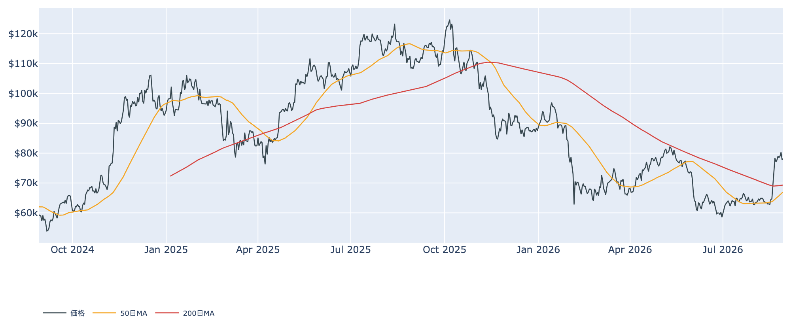
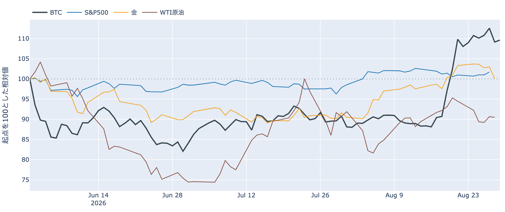
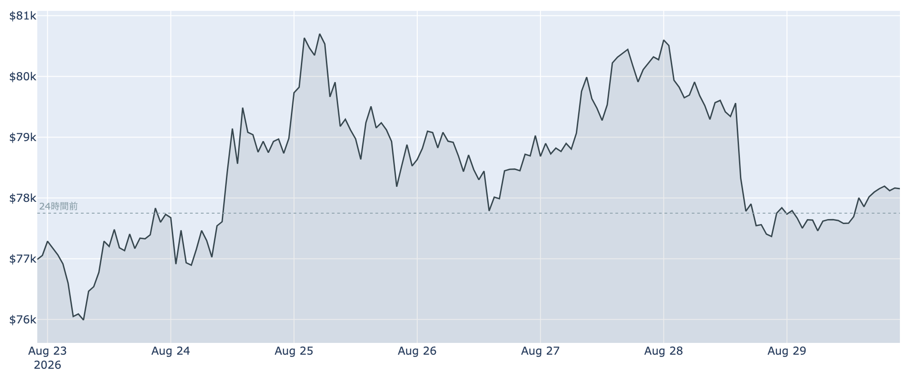
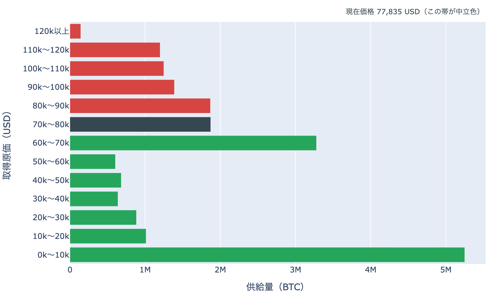
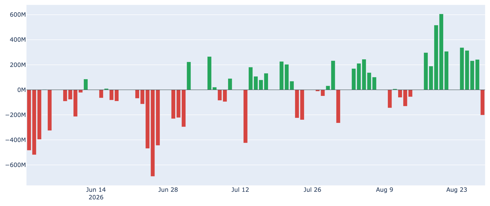
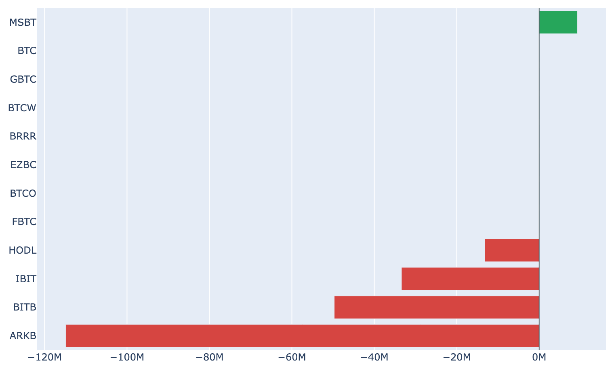
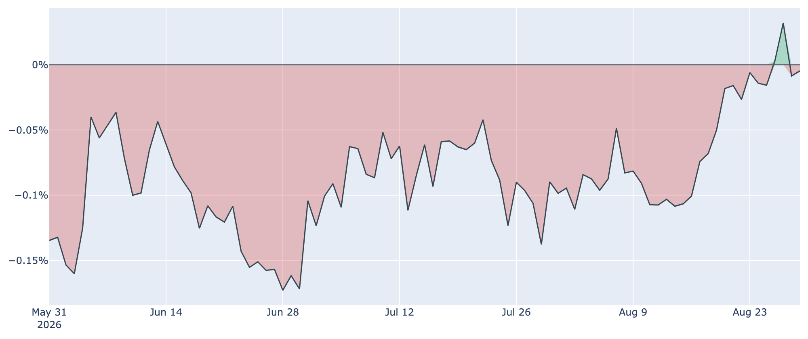
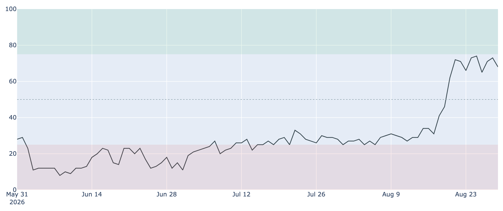

# 押しの翌日は0.5%の戻り ― ETFの連続流入は9日で途切れ、$80,000まで2.3%

**2026年8月30日**

前日に6%の値幅で押し戻されたあと、この24時間はほとんど動いていません。8月30日7時5分時点の実勢価格は約$78,173で、24時間では+0.53%（レンジ$77,349〜$78,334）。1週間では+1.5%、1か月では+20.8%です。値動きが止まっている一方で、集計の揃ったETF資金フローは9営業日続いた流入が流出に転じ、取得原価の分布では価格が$80,000の帯境界のすぐ下で止まっています。

（数値は8月30日7時5分（日本時間）時点までに取得した各種データに基づきます。価格と取引所プレミアムはその時点の実勢、市場心理は8月29日の確定値、オンチェーン指標は8月28日、ETF資金フローは8月28日、株・金などの終値は8月27日〜28日時点です。なお、オンチェーンの保有・年齢の指標には、ETF・取引所が預かっている分も含まれています。）

## 1. 全体像：金が3%近く下げるなかで、BTCは動かなかった

* **水準**: 8月30日7時5分時点で約$78,173。直近の確定日足終値は8月28日（UTC）の約$77,839です。50日移動平均（約$67,000）も200日移動平均（約$69,311）も大きく上回りますが、50日線自体はまだ200日線の下で、移動平均の並び（デッドクロス圏）は変わっていません。過去2年のレンジでの位置は下から41%ほどです。
* **外部環境**: 金は8月28日終値で4,478.10ドルと1営業日で**-2.85%**、5営業日でも-3.16%と大きく下げました。WTI原油は同じ8月28日で83.40ドル（1営業日-0.16%、5営業日-4.20%）。株・金利・ドルは8月27日の終値までしか揃っておらず、S&P500は7,730.99で+0.72%、VIX（＝株式市場の恐怖指数）は14.51で-4.6%、ドル指数は99.16でほぼ横ばい、米10年債利回りは4.67%でした。銘柄の並びによる地合いの目安は、8月26日→27日では**リスクオン寄り**です。
* 金が2%を超えて下げた8月28日から週末にかけて、BTCは$78,000台を保っています。これは値動きの並びであって、原因の説明ではありません。BTCとの30日相関は**金+0.58／S&P500+0.08**で、株とは連動が薄く金と揃う形が続いています。

* **材料**: 8月28日のウォーシュFRB議長の初講演（ジャクソンホール）を受けて、9月15〜16日のFOMCに向けた利上げの織り込みは講演前の3割前後から**5〜6割台**へ跳ね上がったままです。米株は8月28日の金曜を下げて引け、長期金利は上昇しました。今回の上げの起点が金利低下だったことを踏まえると、金利観がこの位置で固まるかどうかが上値の前提になります。
* **レバレッジの傾き**: 無期限先物の資金調達率は8時間あたり**+0.0080%（年率換算 約+8.8%）**で、ロング側がショート側に払う状態が100回連続（約33.3日）続いています。30日レンジ（0.0001〜0.0100%）の上寄りで、この上限の率（年率+10.95%）から短期金利（13週物Tビル、8月27日時点で3.68%）を引いた上乗せは**+7.27pt**と、直近34日でいちばん大きい側です（平均+3.44pt）。ただし現物の保管や証拠金の追加が要るので、確実に取れる利回りではありません。建玉は107,662BTC（約82億ドル、8月29日UTC時点）で1週間-0.5%と、前日の下げを挟んでもほとんど減っていません。
* **効き方の下地**: 1年以上動いていない供給は8月28日時点で62.5%（3か月前から+1.8pt）。全体の6割強が長く動かないままなので、同じ規模の売り買いでも価格が動きやすい下地は続いています。

## 2. データの解説：注目すべき5つのポイント

### ① 押しの翌日は、上にも下にも動かない24時間

* **値幅**: 24時間のレンジは$77,349〜$78,334で、幅は約1.3%。前日の約6%から一気に縮みました。1週間で見ると$75,538〜$81,480（約7.9%）で、8月19日からの急騰と8月29日の押しが両端にあります。
* **短期勢の位置**: 短期保有者（保有155日未満）の平均取得単価は8月28日時点で約**$69,986**。いまの価格はこれを約12%上回っており、8月中旬以降に入った層はまだ含み益の側です。短期勢SOPR（＝短期勢の損益）は約1.003、全体のSOPR（＝動いたコインの損益）も約1.003で、動いたコインはわずかに利益の側にあります。
* **水準感**: MVRV Z-Score（＝市場全体の含み益）は8月28日時点で0.84。1週間前（0.86）とほぼ同じで、30日前の0.37からは上がっていますが、過去4年のなかでは下から42%ほどの位置です。

### ② 取得原価の分布では、$80,000の境界まで2.3%

* **位置**: 8月28日時点の分布にいまの価格を重ねると、価格は**$70,000〜$80,000**の帯（187万BTC・全供給の9.3%）の下端から82%のところにいます。上端$80,000までは**+2.3%**、下端$70,000までは-10.5%です。
* **帯またぎ**: 1日前・1週間前とも同じ帯の中で、上下の配分は動いていません。一方30日前（$64,722・$60,000〜$70,000の帯）からは上へ1帯移動しており、通過した帯に含まれる供給は**515万BTC（全供給の25.7%）**。価格より上にある帯の合計は、この1か月で38.5%から**29.1%**へ減りました。
* **上と下**: 価格より上でいちばん厚いのは$80,000〜$90,000の187万BTC（9.3%）ですが、その上にも$90,000〜$100,000に139万BTC（6.9%）、$100,000〜$110,000に125万BTC（6.2%）、$110,000〜$120,000に120万BTC（6.0%）と積み上がっています。下側で近い厚い帯は$60,000〜$70,000の328万BTC（16.3%）です。
* この分布は、それぞれのコインが**最後に動いたときの価格**で束ねたものです。誰が持っているかは分からず、自分のウォレット間の移動や取引所への入出金でも価格は付け替わるため、そのまま「その値段で買った人の量」とは読めません。

### ③ 長期側から動いた量は27万BTC台へ、動いた分は損失側のまま

* **量**: 長期保有層のネットポジション変化（＝長期側で数えられる供給の増減、過去30日）は8月28日時点で約**-27.2万BTC**。1週間前（約-21.2万BTC）からさらに減少幅が広がり、30日前（約+18.1万BTC）からは符号が反転しています。**預かり分の混入を差し引いても、この規模と方向は変わりません。**
* **損益**: 長期勢SOPR（＝長期勢の損益）は約0.994で、1を下回ったままです（1週間前は約1.006）。動いた長期側のコインは、最後に動いたときの価格を下回る水準で動いています。量は「減った」方向、損益は「利益確定ではない」方向で、2本は同じ絵を指していません。
* いまのところ書けるのは、長期側で数えられる供給がこの1か月で27万BTC強動いた、という事実までです。

### ④ ETFの9営業日連続の流入は、流出で途切れた

* **日次**: 8月28日の米国スポットBitcoin ETFは、集計が揃った時点で**-201.9百万ドルの流出**でした。前日までの速報段階では小幅なプラスでしたが、最終的には8月17日から続いていた9営業日の流入が途切れた形です。
* **週次**: それでも直近7営業日の合計は**+1,838.3百万ドル**で、8月中旬からの流入基調そのものはまだ残っています。上場来の累計は+547億ドルです。
* **ファンド別**: この日プラスだったのはMSBT（+9.3百万ドル）の1本だけで、ARKB -114.9、BITB -49.7、IBIT -33.4、HODL -13.2と流出が広く出ました。8月中旬からの流入を主導していたIBITも売り側です。

### ⑤ 米国の現物需要はゼロ近辺へ、市場心理は「強欲」で高止まり

* **取引所プレミアム**（＝米国と海外の価格差）は8月29日時点で**-0.005%**と、実質ゼロの水準です。マイナス圏に戻ってからはまだ2日で、1週間前（-0.027%）、30日前（-0.090%）と比べるとディスカウントは着実に縮んできました。過去300日のなかでは上から2割ほどの高い位置にあります。8月下旬まで100日を超えて続いていた「米国勢の買いが相対的に弱い」状態は、いったん解消に近づいています。
* **市場心理**はFear & Greed 指数が**68**（8月29日）で「強欲」。1週間前の71からは3ポイント下げましたが、30日前の28（恐怖）からは大きく振れた位置に留まったままです。価格が前日に3%以上押しても、心理の側はまだ崩れていません。

## 3. 相場転換を見極めるための「3つの分岐点」

1. **$80,000を取り戻せるか、$70,000台の下半分へ入るか**: 取得原価の分布では、いる帯の上端$80,000まで+2.3%、下端$70,000まで-10.5%。上へ戻る側には$80,000〜$90,000の187万BTCが控え、さらにその上の3本にも合わせて384万BTCが積まれています。下側は$60,000〜$70,000の328万BTCが次の厚い帯です。分布の形の話であって売り注文の実体ではありませんが、価格が通過する量の目安にはなります。
2. **9月15〜16日に集中する日程**: FOMCの利上げ織り込みは5〜6割台で高止まりしています。同じ週には、上院で60票に届かず9月へ持ち越された暗号資産の市場規制法案（Digital Asset Market Clarity Act）の採決機会も控えます（議会の復帰は9月14日）。金利と規制の日程が同じ週に重なるため、それまでの物価・雇用の指標ごとに織り込みが振れる余地があります。
3. **米国側の需要2経路が揃って戻るか**: 取引所プレミアムはゼロ近辺まで回復した一方、ETFの流入は9営業日目で途切れました。片方だけの回復に留まるのか、両方が揃って戻るのかが次の材料です。あわせて先物の建玉（約82億ドル）が減らないまま推移するかどうかも、レバレッジの整理が済んでいるかの目安になります。

## 総括

前日の6%の押しに対して、この24時間は1.3%の値幅で止まりました。外側では金が3%近く下げ、利上げの織り込みが5〜6割台で高止まりするなか、BTCは$78,000台を保っています。中身を見ると、資金調達率は強気の傾きのまま建玉も減らず、短期勢は平均取得単価を12%上回る含み益の側、市場心理も「強欲」に留まっています。一方でETFの連続流入は9営業日で途切れ、長期側で数えられる供給は1か月で27万BTC強減りました。**上げの勢いは止まったが、需給の側はまだ崩れていない**——そして価格は、取得原価の分布でいちばん厚い上側の帯に入る手前、$80,000まで2.3%のところで止まっています。

---

*本稿は情報提供を目的としたものであり、投資助言ではありません。将来の価格動向を保証・示唆するものではなく、投資判断は各自の責任において行ってください。*
