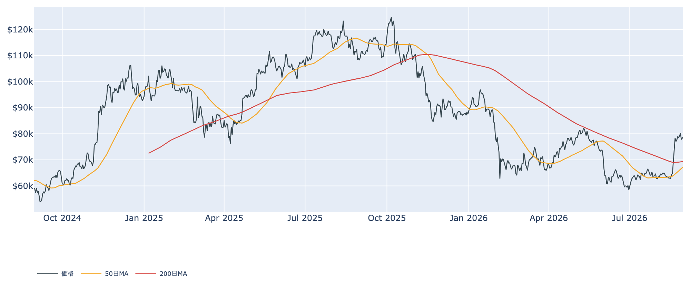
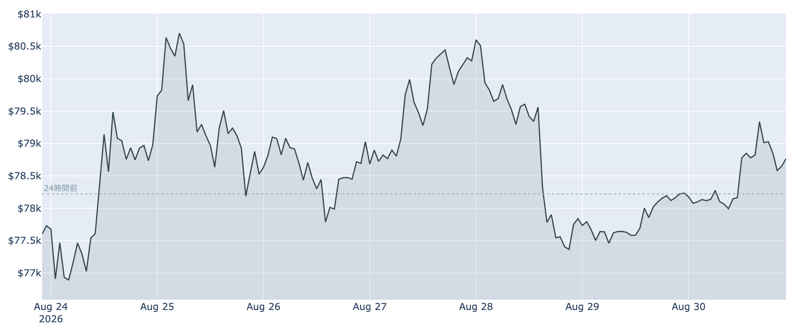
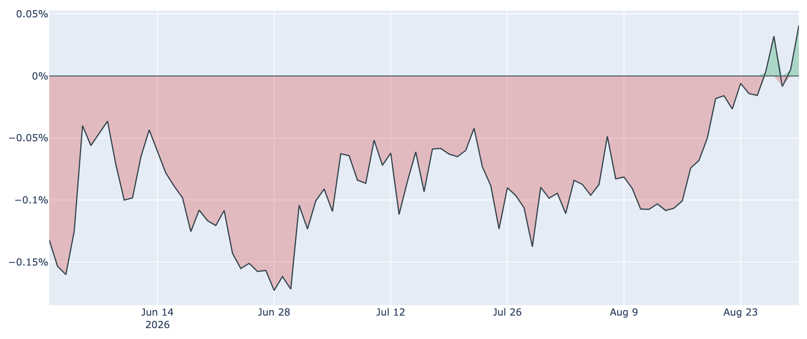
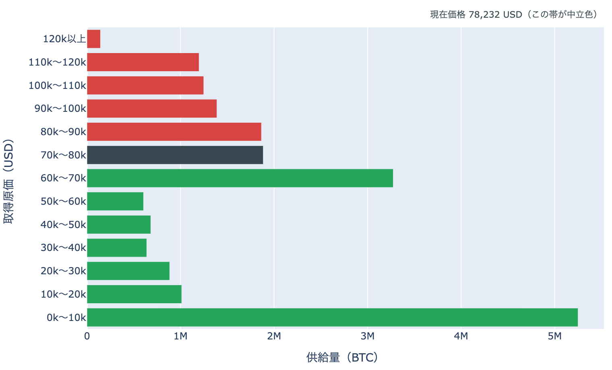

# 静かな週明け、米国の買いはプレミアムに現れた ― $80,000まで1.6%、金曜には米雇用統計

**2026年8月31日**

週末の2日間、価格はほとんど動きませんでした。8月31日7時5分時点の実勢価格は約$78,730で、24時間では+0.67%（レンジ$77,945〜$79,395）。1週間では+1.3%、1か月では+25.3%です。価格が止まっている裏で、Coinbase Premium（＝米国とそれ以外の価格差）が約300日の観測で上から1%強という高さのプラス圏に入り、長期側で数えられる供給の減少は1か月で26万BTCへ広がりました。$80,000の帯境界までは+1.6%です。

（数値は8月31日7時5分（日本時間）時点までに取得した各種データに基づきます。価格と取引所プレミアムはその時点の実勢、市場心理は8月30日の確定値、オンチェーン指標は8月29日、ETF資金フローは8月28日、株・金など外部環境の終値は銘柄により8月27日〜30日時点です。なお、オンチェーンの保有・年齢の指標には、ETF・取引所が預かっている分も含まれています。）

## 1. 全体像：利上げ観測が5割台で高止まりするなか、$78,000台を保って週明けへ

* **水準**: 8月31日7時5分時点で約$78,730。直近の確定日足終値は8月29日（UTC）の約$78,234です。50日移動平均（約$67,300）も200日移動平均（約$69,400）も大きく上回っていますが、50日線自体はまだ200日線の下にあり、移動平均の並び（デッドクロス圏）は変わっていません。過去2年のレンジでの位置は下から43%ほどです。
* **外部環境**: 8月28日のウォーシュFRB議長の講演（ジャクソンホール）を受けて跳ね上がった9月15〜16日のFOMCでの利上げの織り込みは、金利先物ベースで**5割台半ば**のまま週末を越えました。株・金利は8月27日の終値が最新で、S&P500は7,730.99（+0.72%）、VIX（＝株式市場の恐怖指数）は14.51、米10年債利回りは4.67%。金は8月28日終値で4,529.90ドル（1営業日-1.73%、5営業日-2.04%）、WTI原油は83.40ドル（-0.16%）でした。銘柄の並びによる地合いの目安は、8月26日→27日では**リスクオン寄り**です。
* **BTCとの30日相関**は金+0.56／S&P500+0.08。株との連動が薄く、金と揃って動く形が続いています。
* **効き方の下地**: 1年以上動いていない供給は8月29日時点で62.6%（3か月前から+1.9pt）。全体の6割強が長く動かないままなので、同じ規模の売り買いでも価格が動きやすい下地は続いています。

## 2. データの解説：注目すべき5つのポイント

### ① 週末の値幅は1%台、心理は「強欲」のまま

* **値幅**: 24時間のレンジは$77,945〜$79,395で、幅は約1.9%。8月28日の押し以降、3日続けて狭いレンジに収まっています。1週間で見ると$76,652〜$81,480で、上端は8月27日に付けた高値です。
* **短期勢の位置**: 短期保有者（保有155日未満）の平均取得単価は8月29日時点で約**$70,000**。いまの価格はこれを約12%上回っており、8月中旬以降に入った層は含み益の側のままです。MVRV Z-Score（＝市場全体の含み益）は0.85で、30日前の0.40からは上がりましたが、過去4年のなかでは下から42%ほどの位置です。
* **市場心理**: Fear & Greed 指数（＝市場心理の指数）は**69**（8月30日）で「強欲」。1週間前の66から3ポイント上がり、30日前の25（恐怖）から振れた位置に留まっています。価格が止まっても心理の側は崩れていません。

### ② 米国の買いが、プレミアムの形で現れた

* **水準**: Coinbase Premium は8月30日時点で**+0.04%**。約300日の観測のなかで上から1%強という高い位置です。プラス圏は2日連続で、8月26日以降の5日間では4日がプラスでした。
* **経緯**: 1週間前は-0.006%、30日前は-0.099%。6月から8月下旬まで途切れなく続いた「米国勢の買いが相対的に弱い」ディスカウント状態は、ゼロ近辺での足踏みを挟んで、プラス側へ切り替わりつつあります。
* まだ2日連続の段階で、定着したとまでは言えません。ただ、価格が動かなかった週末に水準を切り上げたのはこの指標です。

### ③ 長期側で数えられる供給は1か月で26万BTC減、動いた分は原価割れ

* **量**: 長期保有層のネットポジション変化（＝長期側で数えられる供給の増減、過去30日）は8月29日時点で約**-26.0万BTC**。1週間前（約-23.5万BTC）から減少幅が広がり、30日前（約+16.6万BTC）からは符号が反転しています。**預かり分の混入を差し引いても、この規模と方向は変わりません。**
* **損益**: 長期勢SOPR（＝長期勢の損益）は8月29日時点で約0.89と、8月24日から1を下回る日が続いています。動いた長期側のコインは、最後に動いたときの価格を下回る水準で動いています。
* 量は「減った」方向、損益は「利益確定ではない」方向で、2本は同じ絵を指していません。いま書けるのは、長期側で数えられる供給がこの1か月で26万BTC動いた、という事実までです。

### ④ 先物の強気の傾きは33日連続、傾きの大きさは上限から一歩引いた

* **資金調達率**（＝先物の買い持ちが払う金利）は直近8時間で**+0.0081%（年率換算 約+8.9%）**。プラスは100回連続（8時間ごとなので約33日）ですが、率そのものは30日レンジの上限（+0.0100%）からやや下がりました。この銘柄の仕組み上の上限（±0.3%/8時間）には遠く、過熱と呼べる水準ではありません。
* **建玉**（＝先物の未決済残高）は106,902BTC（約84億ドル、8月30日UTC時点）で、1週間で+1.8%。8月28日の押しを挟んでも減っておらず、レバレッジの残高は維持されています。
* **上乗せ**: 資金調達率の年率から短期金利（13週物Tビル、8月27日時点で3.68%）を引いた上乗せは**+5.6pt**。直近34日の平均（+3.7pt）より上で、プラスだった日は94%です。ただし現物の保管や証拠金の追加が要るので、確実に取れる利回りではありません。

### ⑤ 取得原価の分布では、$80,000の境界まで1.6%

* **位置**: 8月29日時点の分布にいまの価格を重ねると、価格は**$70,000〜$80,000**の帯（188万BTC・全供給の9.4%）の下端から87%のところにいます。上端$80,000までは**+1.6%**、下端$70,000までは-11.1%です。
* **帯またぎ**: 1日前・1週間前とも同じ帯の中で、上下の配分は動いていません。30日前（$62,826・$60,000〜$70,000の帯）からは上へ1帯移動しており、通過した帯に含まれる供給は**516万BTC（全供給の25.7%）**。価格より上にある帯の合計は、この1か月で38.5%から**29.1%**へ減りました。
* **上と下**: 価格より上でいちばん厚いのは$80,000〜$90,000の186万BTC（9.3%）で、その上にも$90,000〜$100,000に139万BTC、$100,000〜$110,000に125万BTC、$110,000〜$120,000に120万BTCと積み上がっています。下側で近い厚い帯は$60,000〜$70,000の327万BTC（16.3%）です。
* この分布は、それぞれのコインが**最後に動いたときの価格**で束ねたものです。誰が持っているかは分からず、自分のウォレット間の移動や取引所への入出金でも価格は付け替わるため、そのまま「その値段で買った人の量」とは読めません。

## 3. 相場転換を見極めるための「3つの分岐点」

1. **$80,000を上抜けて保てるか**: 8月27日に一度$80,275の終値を付けましたが、翌日には明け渡しました。いまはその境界まで+1.6%。上抜けた先には$80,000〜$90,000の186万BTCを筆頭に、$120,000までの4本に合わせて570万BTC分の帯が控えます。分布の形の話であって売り注文の実体ではありませんが、価格が通過していく量の目安になります。
2. **金曜の米雇用統計と、9月中旬の日程**: 9月4日（金）に8月分の米雇用統計が出ます（日本時間同日21時30分）。9月FOMCの利上げ織り込みが5割台で高止まりしているため、この指標で織り込みが振れる余地があります。さらに9月15〜16日のFOMCと同じ週には、9月へ持ち越された暗号資産の市場規制法案の採決機会も控えます（議会の復帰は9月14日）。
3. **米国側の需要2経路が揃うか**: プレミアムはプラス圏に入りましたが、ETF資金フローは集計の揃った8月28日分が-201.9百万ドルで、9営業日続いた流入が途切れたところです。直近7営業日の合計はまだ+18.4億ドルの流入超なので、週明けの集計でプラスに戻れば「プレミアム＋ETF」の2経路が揃います。片方だけに留まるかどうかが次の材料です。

## 総括

週末の価格はほとんど動きませんでしたが、需要側の絵は少し変わりました。Coinbase Premium は約300日で上から1%強の高さのプラス圏に入り、市場心理は「強欲」のまま、先物の強気の傾きも33日連続で続いています。一方で、長期側で数えられる供給は1か月で26万BTC減り、その動いた分は原価割れの側にあります。外部環境では利上げの織り込みが5割台で高止まりし、金曜の米雇用統計がその次の振れ材料です。価格は、取得原価の分布で上側いちばん手前の厚い帯まで**+1.6%**——この境界を上抜けて保てるかどうかが、週内のいちばん分かりやすい目印です。

---

*本稿は情報提供を目的としたものであり、投資助言ではありません。将来の価格動向を保証・示唆するものではなく、投資判断は各自の責任において行ってください。*
