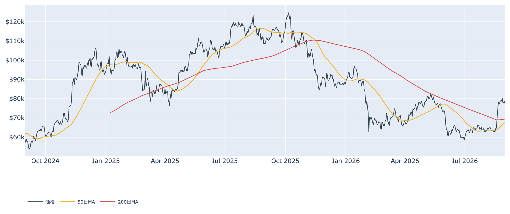
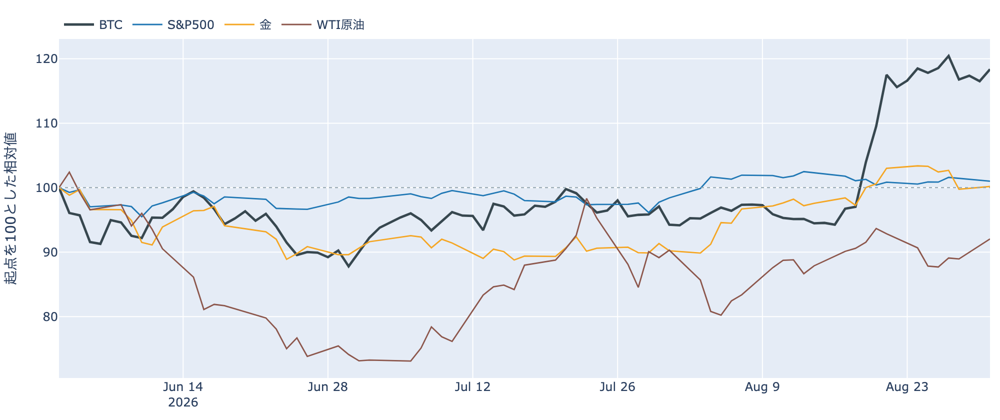
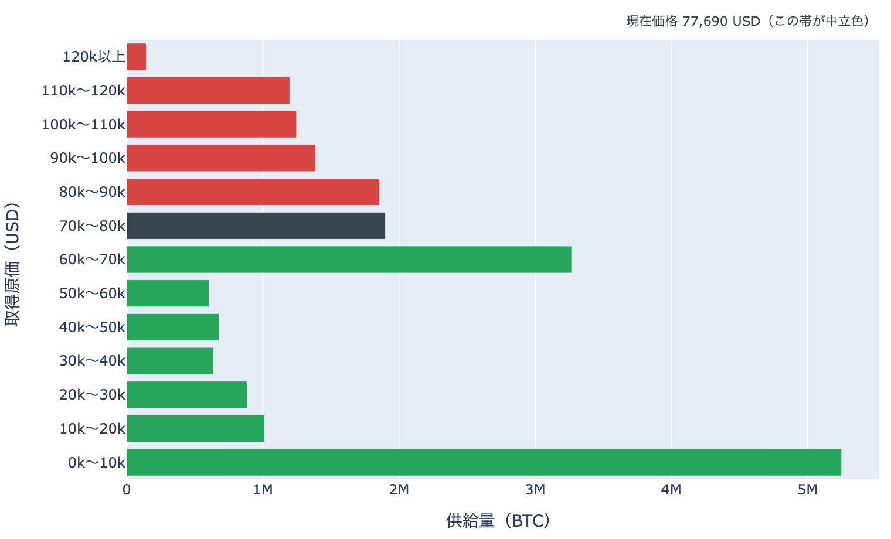
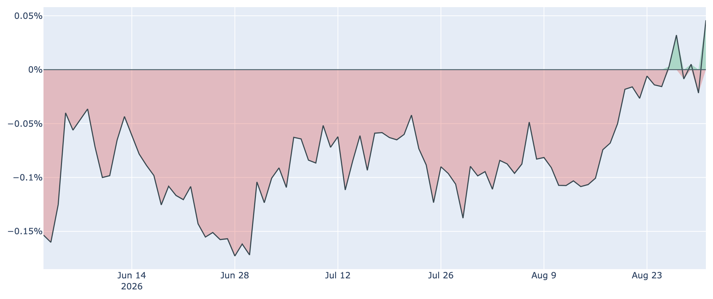
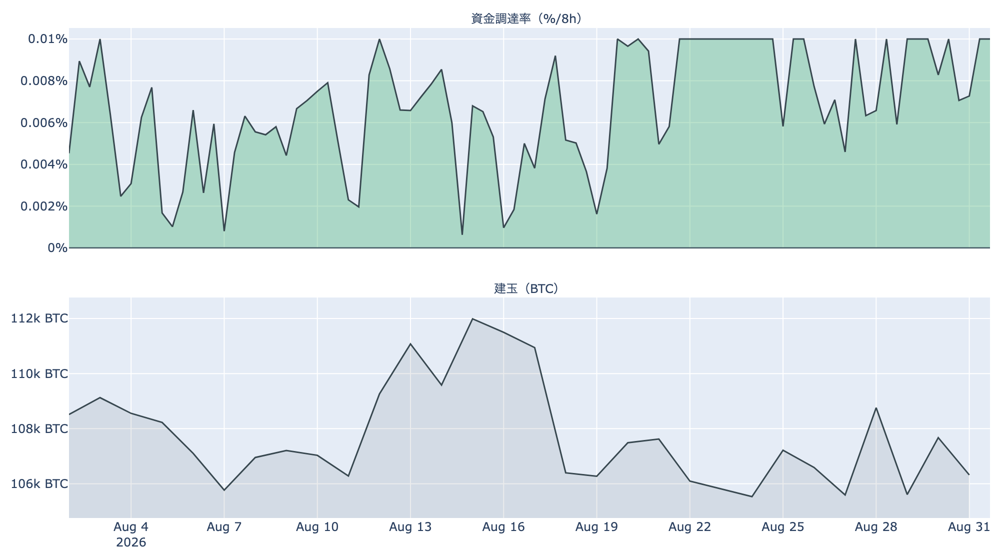
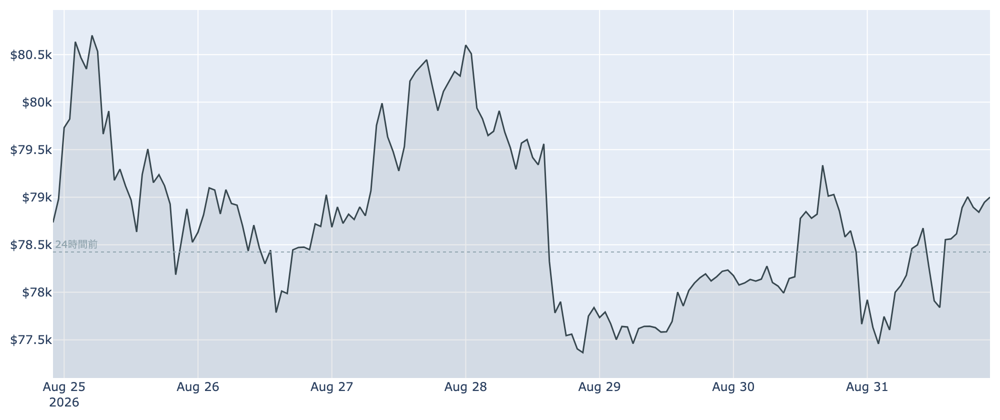

# 原油が3%上げた日に、BTCは$78,900台で静か ― 長期側の売りは細り、$80,000まで1.4%

**2026年9月1日**

9月最初の取引日を、ビットコインは$78,900近辺で迎えました。9月1日7時5分（日本時間）時点の実勢価格は約$78,897で、24時間では+0.63%（レンジ$77,000〜$79,257）。1週間ではほぼ変わらず（-0.1%）、1か月では+25.7%です。8月30日（日）の中東での応酬を受けて原油が3%を超えて上げ、米株が小幅安となった一方、ビットコインの側は静かなまま。中身のデータでは、長期側で数えられる供給の減り方が1週間前より細り、動いた分は利益確定の側へ戻りました。

（数値は9月1日7時5分（日本時間）時点までに取得した各種データに基づきます。価格と取引所プレミアムはその時点の実勢、市場心理は8月31日の確定値、オンチェーン指標は8月30日、ETF資金フローは8月28日、株・金・原油など外部環境の終値は8月31日時点です。なお、オンチェーンの保有・年齢の指標には、ETF・取引所が預かっている分も含まれています。）

## 1. 全体像：外部環境が動いた日に、価格は動かなかった

* **水準**: 9月1日7時5分時点で約$78,897。直近の確定日足終値は8月30日（UTC）の約$77,665です。50日移動平均（約$67,600）も200日移動平均（約$69,400）も大きく上回っていますが、50日線自体はまだ200日線の下にあり、移動平均の並び（デッドクロス圏）は変わっていません。過去2年のレンジでの位置は下から43%ほどです。
* **外部環境**: 8月30日（日）に米軍がホルムズ海峡へ機雷を投入しようとしていたイラン側の発射装置を攻撃し、イラン革命防衛隊はヨルダンとUAEの米軍基地を狙ったと発表しました。数週間続いた小康が崩れた形です。8月31日の終値は、WTI原油が86.31ドル（1営業日+3.49%、5営業日+1.53%）、S&P500が7,686.14（-0.58%）、VIX（＝株式市場の恐怖指数）が14.92（+2.83%）、金が4,497.30ドル（+0.43%、5営業日では-3.09%）、米10年債利回りが4.76%、ドル指数が99.41。銘柄の並びによる地合いの目安は8月27日→31日で**まちまち**、5営業日では**リスクオン寄り**です。エネルギー供給への懸念はリスク資産全体の重しになりうる材料ですが、この日ビットコインは同じ方向へは動きませんでした。

* **BTCとの30日相関**は金**+0.59**／S&P500**+0.10**。株との連動が薄く、金と揃って動く形が続いています。
* **効き方の下地**: 1年以上動いていない供給は8月30日時点で**62.7%**（3か月前から+2.0pt）。全体の6割強が長く動かないままなので、同じ規模の売り買いでも価格が動きやすい下地は続いています。

## 2. データの解説：注目すべき5つのポイント

### ① この1か月で、価格は供給の4分の1を通過した

* **通過した量**: 8月30日時点の分布に、いまの価格を重ねると、価格は$70,000〜$80,000の帯にいます。30日前（約$62,764）は1つ下の帯にいたので、この1か月で**上へ1帯**移動し、通過した帯を含む供給は約**517万BTC（全供給の25.7%）**。価格より上にある帯の割合は**38.5%から29.1%へ**下がりました。
* **境界までの距離**: いる帯の中では下端から89%の位置で、**上端$80,000までは+1.4%**、下端$70,000までは-11.3%です。
* **上に積まれている量**: すぐ上の$80,000〜$90,000が約**186万BTC（9.3%）**で、価格より上ではここが最も厚い帯。その先も$90,000〜$100,000が6.9%、$100,000〜$110,000が6.2%と続きます。すぐ下は$60,000〜$70,000の約327万BTC（16.3%）です。
* この分布は、それぞれのコインが**最後に動いたときの価格**で束ねたものです。誰が持っているかは分からず、自分のウォレット間の移動や取引所への入出金でも価格は付け替わるため、そのまま「その値段で買った人の量」とは読めません。

### ② 長期側の減少は1週間前より細り、動いた分は利益確定へ戻った

* **量**: 長期保有層のネットポジション変化（＝長期側で数えられる供給の増減、過去30日）は8月30日時点で約**-20.7万BTC**。1週間前（約-23.8万BTC）から減少幅は**縮み**、30日前（約+12.1万BTC）からは符号が反転したままです。**預かり分の混入を差し引いても、この規模と方向は変わりません。**
* **損益**: 長期勢SOPR（＝長期勢の損益）は約**1.18**で、1週間前の1.15からさらに上がりました。30日前は0.99と1割れでしたから、動いた長期側のコインは**原価割れの放出から利益確定へ入れ替わっています**。
* 量は減少、損益は1超え。独立した2本が同じ向きに揃ったので、この日は**分配**と書ける並びです。ただし減り方そのものは弱まっており、8月中旬までの勢いは残っていません。

### ③ 米国の買いが、観測300日で上から1%台の高さに出た

* **水準**: Coinbase Premium（＝米国とそれ以外の価格差）は8月31日時点で**+0.046%**。約300日の観測のなかで上から1%台という高い位置です。
* **経緯**: 1週間前は-0.014%、30日前は-0.095%。直近5日では3日がプラスで、6月から8月下旬まで続いた「米国勢の買いが相対的に弱い」状態からの切り替わりが進んでいます。
* まだプラス圏に入った日が飛び飛びの段階で、定着したとは言えません。ただ価格が横ばいのなかで水準を切り上げたのは、この指標です。

### ④ 買い持ち側が33日払い続け、それでも建玉は増えていない

* **率**: 資金調達率（＝先物の買い持ちが払う金利）は8時間あたり**+0.0096%（年率換算 約+10.5%）**。プラスは100回連続（8時間ごと＝約33日）で、買い持ち側が払い続ける状態が1か月以上続いています。この銘柄の上限（±0.3%／8時間）には遠く、過熱と呼ぶ水準ではありません。
* **上乗せ分**: 短期金利（13週Tビル 3.73%）を引いた超過は**+6.22pt**。直近34日の平均+3.59ptより高い側ですが、最大の+7.27ptには届きません。これは置いておくだけの金利に対する上乗せであって、確実に取れる利回りではありません。
* **規模**: 建玉（＝先物の未決済残高）は107,471BTC（8月31日UTCで約82.6億ドル）で、7日変化は**+0.7%**とほぼ横ばい。1か月で+25.7%動いた価格に対して、先物の残高は積み上がっていません。上げの主役は先物のレバレッジではなかった、と読める並びです。

### ⑤ 値幅は3%以内、心理は「強欲」のまま1週間で11pt下がった

* **値幅**: 24時間のレンジは$77,000〜$79,257で幅は約2.9%。1週間では$76,846〜$81,480（幅約6%）で、上端は8月27日に付けた高値です。その後は$80,000を挟んだ往復が続いています。
* **市場心理**: Fear & Greed 指数（＝市場心理の指数）は**62**（8月31日）で「強欲」。1週間前の73から**11pt低下**しましたが、30日前の27（恐怖）からは大きく上の位置です。高値を更新できないまま、熱だけが少し引いた形です。
* **短期勢の位置**: 短期保有者（保有155日未満）の平均取得単価は8月30日時点で約**$70,050**。いまの価格はこれを約13%上回っており、直近に入った層は含み益の側にいます。MVRV Z-Score（＝市場全体の含み益）は0.83で、過去4年のなかでは下から42%ほどです。

## 3. 相場転換を見極めるための「3つの分岐点」

1. **$80,000の帯境界を上抜けて定着するか**: いまの価格からは+1.4%。8月27日に$81,480まで届いたあと押し戻されており、この1週間はこの境界の手前での往復が続いています。上には最後に動いた価格が$80,000〜$90,000のコインが186万BTC、さらに上の$90,000〜$110,000にも13%分が積まれています。下側の目安は短期勢の平均取得単価$70,050で、いまの価格からは-11%ほどの距離です。
2. **ETFの資金が9月に戻るか**: 8月17日から27日まで9営業日続いた純流入（合計で約+30億ドル）は、**8月28日の-201.9M USD**で途切れました。直近7営業日でみればなお+18.4億ドルの流入超です。8月31日以降の数字はまだ出ておらず、単発の流出だったのか流れが変わったのかは、9月最初の数日で決まります。
3. **外部環境の日程**: 9月4日（金）に米雇用統計、9月15〜16日にFOMCが控えます。8月28日のウォーシュFRB議長の講演を受けて、9月会合での**利上げ**の織り込みは金利先物ベースで5割台と、据え置きとほぼ五分に並んだままです。同じ9月15日には、米上院で暗号資産の市場構造法案（CLARITY法案）の手続き投票が予定されています。中東は8月30日の応酬後の推移次第で、原油とリスク資産全体の空気が動きうる状況です。

## 総括

外部環境が動いた日に、ビットコインは動きませんでした。株との連動は薄いまま、金と揃う形が続いています。中身のデータでは、長期側の供給の減り方が1週間前より細り、動いた分は利益確定側へ戻り、米国勢の買いはプレミアムの高さに現れました。一方で先物の建玉は1か月ほぼ横ばいで、レバレッジは積み上がっていません。この1か月で価格は全供給の4分の1を通過し、次の関門である$80,000までは+1.4%。**外部環境の日程が重なる9月中旬までは、この境界の攻防が焦点**という段階です。

---

*本稿は情報提供を目的としたものであり、投資助言ではありません。将来の価格動向を保証・示唆するものではなく、投資判断は各自の責任において行ってください。*
