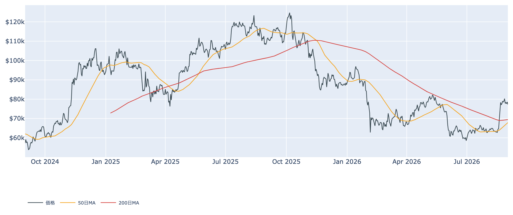
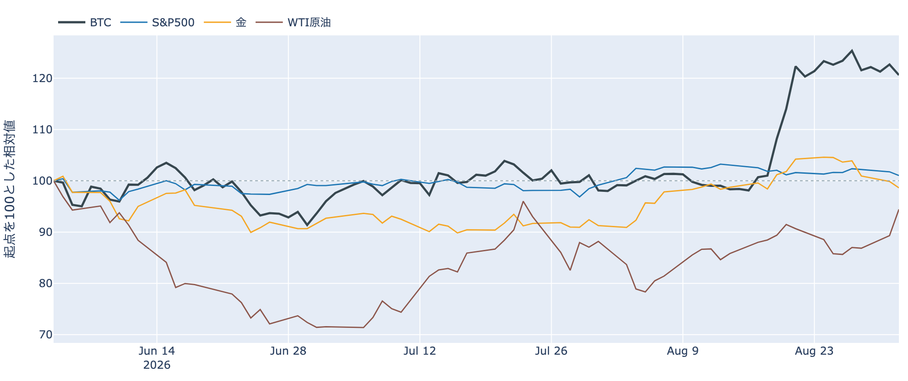
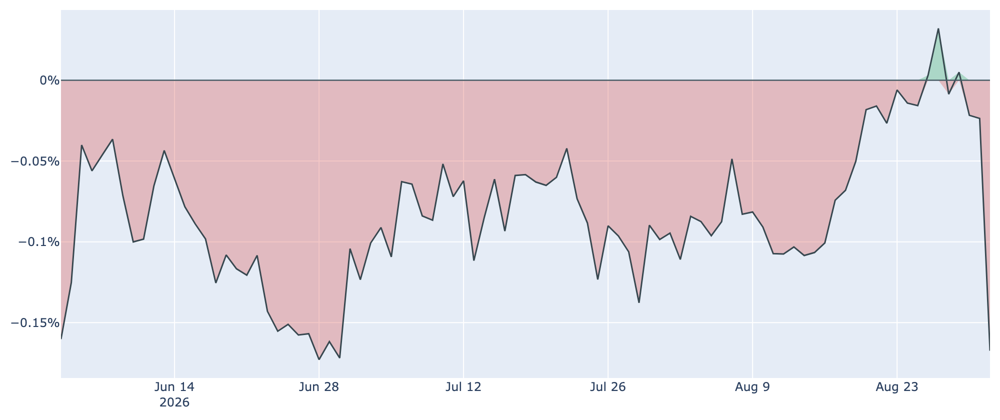
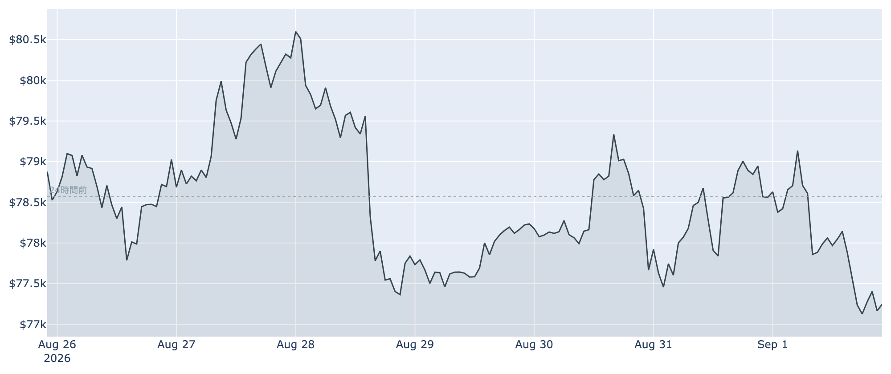
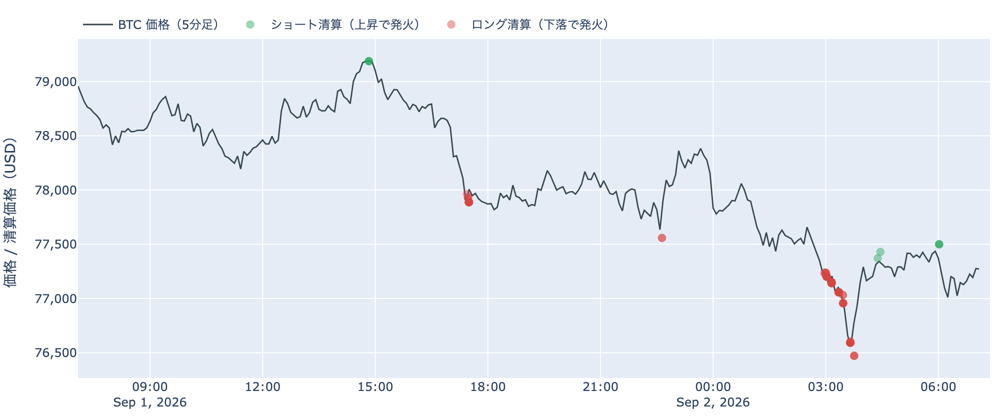
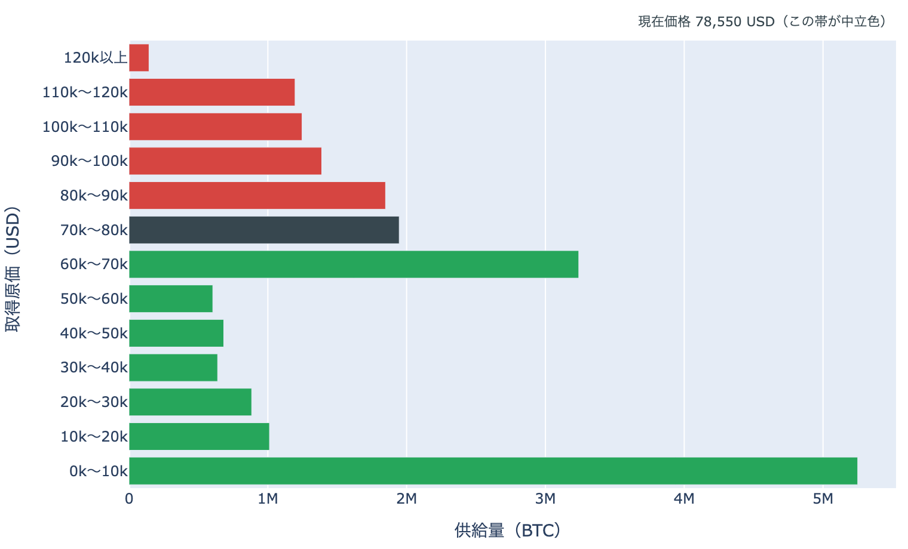
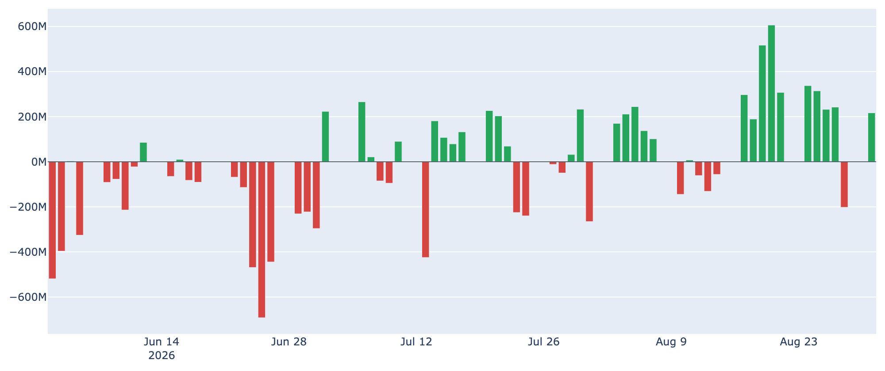

# 米国勢の買いが1日で引いた ― $77,000台への押しはロングの清算を伴い、$80,000まで3.6%

**2026年9月2日**

9月2日7時5分（日本時間）時点の実勢価格は約$77,240で、24時間では-1.71%。レンジは$76,366〜$79,195と値幅3.7%で、**1週間の安値をこの24時間のうちに更新**しました。1週間では-1.64%、1か月では+21.6%です。外側では原油が1日で5%を超えて上げ、$90台に乗せました。中身のデータで最も動いたのは価格ではなく、米国の現物需要を映す指標のほうです。

（数値は9月2日7時5分（日本時間）時点までに取得した各種データに基づきます。価格と取引所プレミアムはその時点の実勢、市場心理は9月1日の確定値、オンチェーン指標とETF資金フローは8月31日時点、株・金・原油など外部環境の終値は9月1日時点です。なお、オンチェーンの保有・年齢の指標には、ETF・取引所が預かっている分も含まれています。）

## 1. 全体像：外部環境はエネルギー一色、BTCは静かに下値を試した

* **水準**: 9月2日7時5分時点で約$77,240。直近の確定日足終値は8月31日（UTC）の約$78,563です。50日移動平均（約$67,900）も200日移動平均（約$69,500）も大きく上回っていますが、50日線自体はまだ200日線の下にあり、移動平均の並び（デッドクロス圏）は変わっていません。過去2年のレンジでの位置は下から40%ほどです。
* **外部環境**: ホルムズ海峡での米国とイランの応酬が再燃し、9月1日のWTI原油終値は90.68ドル（1営業日**+5.74%**、5営業日**+10.10%**）と$90台に乗せました。国際エネルギー機関は8月に2026年の世界供給見通しを引き下げています。同じ9月1日の終値は、S&P500が7,631.47（-0.71%）、VIX（＝株式市場の恐怖指数）が16.34（+9.52%）、金が4,375.70ドル（-1.25%、5営業日では**-5.66%**）、米10年債利回りが4.80%、ドル指数（＝主要通貨に対するドルの強さ）が99.67（+0.24%）。銘柄の並びによる地合いの目安は8月31日→9月1日で**まちまち**、5営業日でも**まちまち**です。エネルギー供給への懸念はリスク資産全体の重しになりうる材料ですが、この日はっきり上げたのは原油だけで、避難資産とされる金はむしろ5日で5%以上下げています。

* **BTCとの30日相関**は金**+0.58**／S&P500**+0.15**。株との連動が薄く金と揃う形は続いていますが、その金が下げるなかでBTCも押した、という並びでした。
* **効き方の下地**: 1年以上動いていない供給は8月31日時点で**62.7%**（3か月前から+2.0pt）。全体の6割強が長く動かないままなので、同じ規模の売り買いでも価格が動きやすい下地は続いています。

## 2. データの解説：注目すべき5つのポイント

### ① 米国の買いが、観測300日で最も薄い側へ落ちた

* **水準**: Coinbase Premium（＝米国とそれ以外の価格差）は9月1日時点で**-0.167%**。約300日の観測のなかで**下から3%以内**という、この期間でほぼ最も低い位置です。
* **落ち方**: 8月31日は-0.024%、1週間前（8月25日）は-0.016%、30日前（8月2日）は-0.111%。8月下旬にはプラス圏へ顔を出す日もあった水準が、**1営業日で1か月前より深いところまで沈みました**。マイナス圏は3日連続です。
* 8月19日からの上げの局面では、この指標はマイナス幅を縮めながら価格に先行して切り上がっていました。今回はその逆向きの動きが、価格の-1.7%より大きな幅で出ています。

### ② 下値を試した24時間は、ロング側の清算を伴った

* **向き**: Hyperliquidの約定履歴から観測できた直近24時間の強制清算は、金額ベースで**9割超がロング（買い建て）側**でした（ショート側は8.3%）。上値を追った側ではなく、押し目で振り落とされた側です。
* **位置と時間**: 焼けた価格帯は**77,000ドル台に77%**、76,000ドル台に17%、79,000ドル台に6%。9月2日2時台（日本時間）の1時間だけで全体の**50%**が集中しました。被清算アドレスは80件で、うち最大1件が全体の**45%**を占めています。清算と値動きは同時刻に起きるため、どちらが先かはこのデータでは決まりません。押しは清算を伴った、というところまでです。
* **市場心理**: Fear & Greed 指数（＝市場心理の指数）は**69**（9月1日）で「強欲」。1週間前の74からは下げていますが、30日前の27（恐怖）からは大きく上の位置で、値動きの押しほどには熱が下がっていません。

### ③ 長期側の減りは細ったが、動いた分は原価割れのまま

* **量**: 長期保有層のネットポジション変化（＝長期側で数えられる供給の増減、過去30日）は8月31日時点で約**-16.5万BTC**。1週間前（約-24.3万BTC）から減少幅は**3分の1ほど縮み**ました。30日前は約+9.6万BTCでしたから、符号が反転した状態は続いています。**預かり分の混入を差し引いても、この規模と方向は変わりません。**
* **損益**: 長期勢SOPR（＝長期勢の損益）は約**0.977**で1割れ。1週間前の0.991からさらに下がりました。動いた長期側のコインは、平均すると**原価を割ったまま**動いています。
* 量は減少、損益は1割れ。**2本が逆を向いているので、この日は「分配」とは書けません。**書けるのは「長期側から動く量は細り、動いた分は利益確定になっていない」というところまでです。
* 全体のSOPR（＝動いたコインの損益）は約1.006、短期勢SOPRも約1.006で、どちらも1をわずかに上回る水準にとどまっています。

### ④ 価格は$80,000の帯境界の手前、下端までは9%以上

* **位置**: 8月31日時点の分布に、いまの価格を重ねると、価格は$70,000〜$80,000の帯（約**195万BTC**、全供給の9.7%）にいます。帯の中では下端から72%の位置で、**上端$80,000までは+3.6%**、下端$70,000までは-9.4%です。1日前も1週間前も同じ帯の中にあり、帯またぎは起きていません。
* **この1か月で通過した量**: 30日前（約$63,500）は1つ下の帯にいたので、この1か月で**上へ1帯**移動し、通過した帯を含む供給は約**519万BTC（全供給の25.8%）**。価格より上にある帯の割合は**38.7%から29.0%へ**下がりました。
* **上に積まれている量**: すぐ上の$80,000〜$90,000が約**185万BTC（9.2%）**で、価格より上ではここが最も厚い帯。その先も$90,000〜$100,000が6.9%、$100,000〜$110,000が6.2%、$110,000〜$120,000が6.0%と続きます。すぐ下は$60,000〜$70,000の約324万BTC（16.1%）です。
* この分布は、それぞれのコインが**最後に動いたときの価格**で束ねたものです。誰が持っているかは分からず、自分のウォレット間の移動や取引所への入出金でも価格は付け替わるため、そのまま「その値段で買った人の量」とは読めません。

### ⑤ ETFは流入継続、先物の傾きも規模も動いていない

* **ETF**: 8月31日の米国スポットETFの純流出入は**+216.7M USD**で、直近7営業日の合計は**+1,448.7M USD**の流入超です。ただしこの日の内訳はIBITが+205.9Mと**全体の95%**を占め、マイナスだったのはHODLの-13.4Mだけ。買いが1本に寄る形が続いています。
* **先物の傾き**: 資金調達率（＝先物の買い持ちが払う金利）は8時間あたり**+0.0076%（年率換算 約+8.3%）**。プラスは100回連続（8時間ごと＝約33日）で、この銘柄の上限（±0.3%／8時間）には遠く、過熱と呼ぶ水準ではありません。
* **上乗せ分**: 短期金利（13週Tビル 3.77%）を引いた超過は**+4.38pt**で、直近34日の平均+3.73ptとほぼ並びです。これは置いておくだけの金利に対する上乗せであって、確実に取れる利回りではありません。
* **規模**: 建玉（＝先物の未決済残高）は108,860BTC（9月1日UTCで約84.8億ドル）で、7日変化は**+0.7%**。1か月で+21.6%動いた価格に対して、先物の残高は積み上がっていません。ETFの現物側は入っている一方で、先物側からは新しい燃料が入っていない、という並びです。

## 3. 相場転換を見極めるための「3つの分岐点」

1. **$80,000の帯境界に届くか、$70,000台の下端を試すか**: いまの価格から上端までは+3.6%、下端までは-9.4%と、位置は上寄りです。上には最後に動いた価格が$80,000〜$90,000のコインが185万BTC、さらに上の$90,000〜$120,000にも19%分が積まれています。下側の目安は短期保有者（保有155日未満）の平均取得単価で、8月31日時点で約**$70,213**。いまの価格はこれを約10%上回っており、ここを割ると直近に入った層が含み損側へ回ります。
2. **ETFとプレミアムの向きが揃うか**: 8月31日のETFは流入継続でしたが、9月1日にプレミアムは観測300日で最も低い側へ沈みました。現物の需要を映す2つの指標が、いま反対を向いています。どちらが正しかったかは、9月最初の数営業日のETFの数字で分かります。
3. **外部環境の日程**: 9月4日（金）に米雇用統計、9月15〜16日にFOMCが控えます。8月28日のウォーシュFRB議長のジャクソンホール講演を受けて、9月会合での**利上げ**の織り込みは金利先物ベースで6割前後まで上がりました。同じ9月15日には米上院で暗号資産の市場構造法案（CLARITY法案）の手続き投票が予定されており、ここで討論打ち切りに必要な票が集まらなければ、年内の成立は難しくなります。中東は米国とイランの応酬が再燃した直後で、原油とリスク資産全体の空気が動きうる状況です。

## 総括

外側では原油が$90台へ跳ね、金は5日で5%以上下げました。そのなかでビットコインは静かに1週間の安値を更新し、押しはロング側の清算を伴いました。中身のデータで最も動いたのは価格ではなく米国勢の買いで、取引所プレミアムは1営業日で観測300日の最も低い側まで沈んでいます。一方で8月31日のETFは流入が続いており、現物の需要を映す2つの指標が反対を向いた状態です。長期側から動く量は1週間前より細ったものの、動いた分は原価割れのままで、買い集めに転じたとは言えません。先物は率も建玉も動いていません。**$80,000まで+3.6%、$70,000台の下端まで-9.4%という上寄りの位置で、9月4日の雇用統計を待っている段階**、というのが9月2日時点の姿です。

---

*本稿は情報提供を目的としたものであり、投資助言ではありません。将来の価格動向を保証・示唆するものではなく、投資判断は各自の責任において行ってください。*
