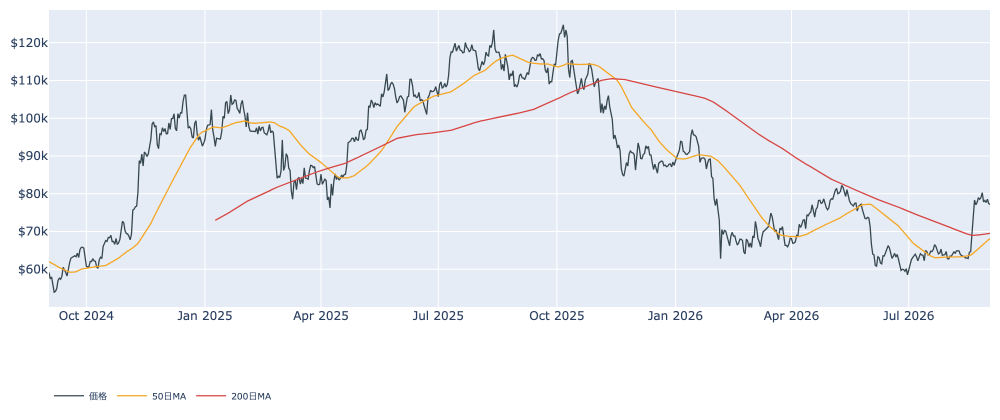
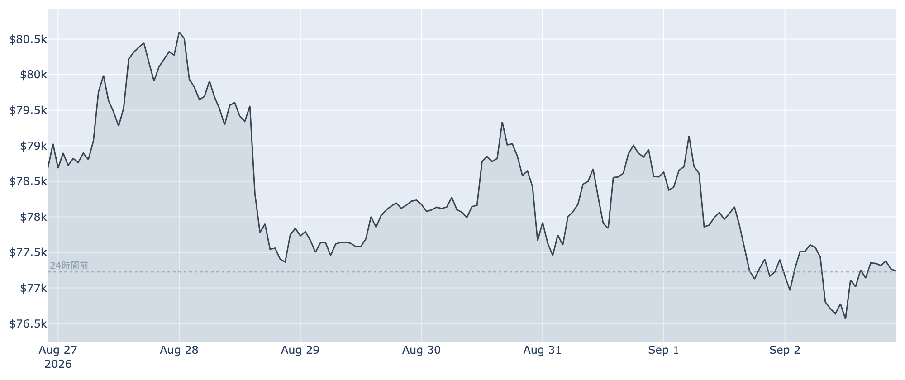
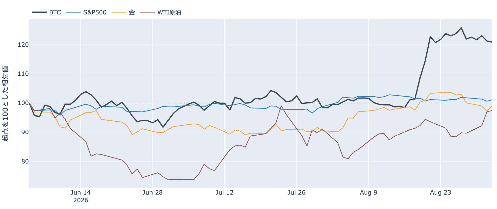
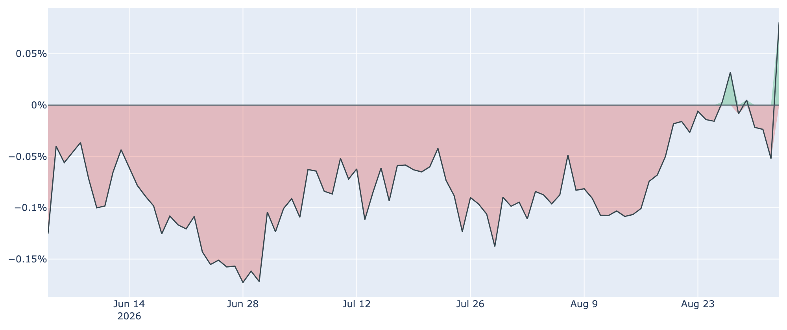
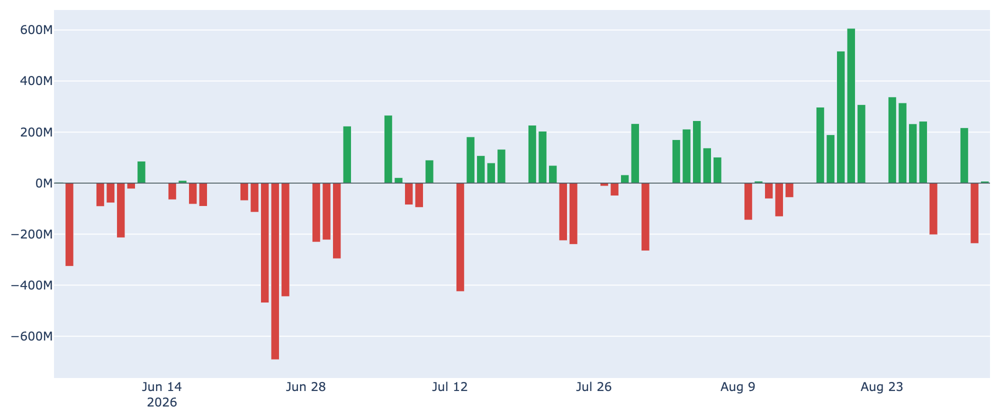
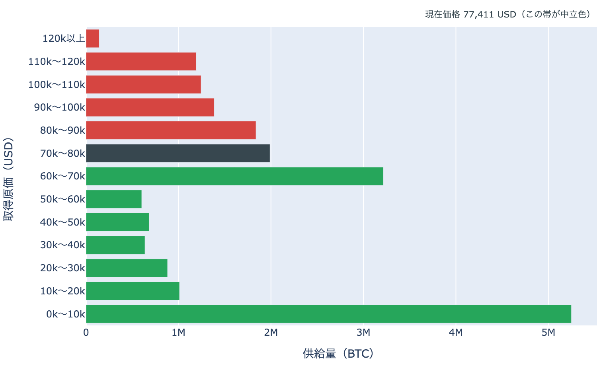
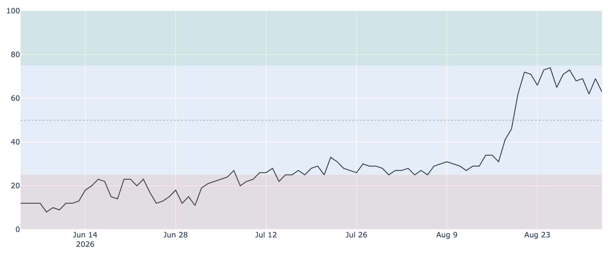

# 値動きの無い一日に、米国側だけが振り切れた ― プレミアムは観測300日で最も高く、雇用統計は明日

**2026年9月3日**

9月3日7時5分（日本時間）時点の実勢価格は約$77,155で、24時間では**-0.11%**。レンジは$76,219〜$77,750と値幅2.0%で、前日に続いて$77,000台での小動きにとどまりました。1週間では-2.4%、1か月では+21.6%です。外側では米国がホルムズ海峡近くのイラン標的を空爆し、エネルギーの供給不安が続いています。そのなかで、中身のデータでただ一つ大きく振れたのが米国の現物需要を映す指標でした。

（数値は9月3日7時5分（日本時間）時点までに取得した各種データに基づきます。価格と取引所プレミアムはその時点の実勢、市場心理は9月2日の確定値、オンチェーン指標は9月1日時点、ETF資金フローは9月2日時点、株・金・原油など外部環境の終値は9月2日時点です。なお、オンチェーンの保有・年齢の指標には、ETF・取引所が預かっている分も含まれています。）

## 1. 全体像：外側は緊張が続き、BTCは$77,000台で動かなかった

* **水準**: 9月3日7時5分時点で約$77,155。直近の確定日足終値は9月1日（UTC）の約$77,399です。50日移動平均（約$68,100）も200日移動平均（約$69,500）も大きく上回っていますが、50日線自体はまだ200日線の下にあり、移動平均の並び（デッドクロス圏）は変わっていません。過去2年のレンジでの位置は下から40%ほどです。

* **この1週間**: 8月27日に約$80,275（確定終値）を付けたあと、8月28日から6営業日は$77,000〜$78,600の幅で横ばいが続いています。1週間の安値$76,219は9月2日に付けたもので、そこからは戻したものの上値も追えていません。
* **外部環境**: 9月2日、米国がホルムズ海峡近くのイラン標的への空爆を実施したと発表し、イラン側は報復を表明しました。ホルムズ海峡の通航隻数は前週から大きく減っていると伝えられています。同じ9月2日のWTI原油終値は90.63ドル（1営業日**+0.45%**、5営業日**+10.22%**）で、前日の急伸のあとは高値圏で横ばいです。同じ9月2日の終値は、S&P500が7,666.60（+0.46%）、VIX（＝株式市場の恐怖指数）が15.20（-6.98%）、金が4,434.30ドル（**+1.98%**、5営業日では-3.56%）、米10年債利回りが4.80%、ドル指数（＝主要通貨に対するドルの強さ）が99.56（-0.11%）。銘柄の並びによる地合いの目安は9月1日→9月2日で**リスクオン寄り**、5営業日では**まちまち**です。エネルギー供給への懸念はリスク資産全体の重しになりうる材料ですが、この日は株が上げ、恐怖指数も下げています。

* **BTCとの30日相関**は金**+0.59**／S&P500**+0.12**。株との連動が薄く金と揃う形は前日から変わっていません。株も金も上げた9月2日に、BTCだけが動かなかった、という並びでした。
* **効き方の下地**: 1年以上動いていない供給は9月1日時点で**62.7%**（3か月前から+1.4pt）。全体の6割強が長く動かないままなので、同じ規模の売り買いでも価格が動きやすい下地は続いています。

## 2. データの解説：注目すべき5つのポイント

### ① 米国とそれ以外の価格差が、観測300日で最も高い側へ振れた

* **水準**: Coinbase Premium（＝米国とそれ以外の価格差）は9月2日付の最新値（＝9月3日7時5分時点の実勢）で**+0.081%**。約300日の観測のなかで**最も高い値**です。プラス圏は1日連続、つまりこの日からです。
* **振れ幅**: 前日（9月1日）は-0.052%、1週間前（8月26日）は+0.003%、30日前（8月3日）は-0.084%。**1営業日で0.13pt跳ねた**ことになります。プラス圏に顔を出す日はこの1週間で何度かありましたが（8月27日の+0.032%が直近の最大）、今回はそれを倍以上上回りました。
* この間、価格は24時間で-0.11%とほぼ動いていません。**値動きが止まっているなかで、米国側の買いだけが動いた**という形です。

### ② ETFは9月2日ほぼ横ばい、それでも7営業日では流入超

* **直近**: 9月2日の米国スポットETFの純流出入は**+7.3M USD**で、集計上はほぼ横ばい。内訳に出ているのはMSBTの+7.3Mだけです。前日の9月1日は-236.5Mでした。
* **均し**: 直近7営業日の合計は**+574.4M USD**の流入超。8月17日から27日にかけては連日3桁の流入が続いていましたが、8月28日以降はプラスとマイナスが交互に出る形に変わっています。
* 現物の需要を映す2つの指標のうち、プレミアムは大きく上に振れ、ETFは横ばい。**方向は逆ではないものの、勢いの差は残っています。**

### ③ 長期側から動く量は4営業日連続で細った

* **量**: 長期保有層のネットポジション変化（＝長期勢の保有量の増減、過去30日）は9月1日時点で約**-14.9万BTC**。8月28日の約-27.2万BTCをピークに**4営業日連続で減少幅が縮み**、ピークのほぼ半分まで戻しました。1週間前（8月25日）は約-25.0万BTCです。30日前は約+6.9万BTCでしたから、符号が反転した状態そのものは続いています。**預かり分の混入を差し引いても、この規模と方向は変わりません。**
* **損益**: 長期勢SOPR（＝長期勢の損益）は約**0.965**で1割れ。1週間前の0.989からむしろ下がっており、動いた長期側のコインは平均すると**原価を割ったまま**動いています。
* 量は細り、損益は1割れのまま。**2本が逆を向いているので、この日も「分配」とは書けません。**書けるのは「長期側から動く量は細り続けているが、動いた分は利益確定になっていない」というところまでです。
* 全体のSOPR（＝動いたコインの損益）は約1.001、短期勢SOPR（＝短期勢の損益）も約1.002で、どちらも1をわずかに上回るだけの水準です。

### ④ 価格は$70,000〜$80,000帯の上寄り、上端まで+3.7%

* **位置**: 9月1日時点の分布に、いまの価格を重ねると、価格は$70,000〜$80,000の帯（約**199万BTC**、全供給の9.9%）にいます。帯の中では下端から72%の位置で、**上端$80,000までは+3.7%**、下端$70,000までは-9.3%。1日前も1週間前も同じ帯の中にあり、帯またぎは起きていません。
* **この1か月で通過した量**: 30日前（約$63,500）は1つ下の帯にいたので、この1か月で**上へ1帯**移動し、通過した帯を含む供給は約**521万BTC（全供給の25.9%）**。価格より上にある帯の割合は**38.8%から28.9%へ**下がりました。
* **上に積まれている量**: すぐ上の$80,000〜$90,000が約**184万BTC（9.2%）**で、価格より上ではここが最も厚い帯。その先も$90,000〜$100,000が6.9%、$100,000〜$110,000が6.2%、$110,000〜$120,000が5.9%、$120,000以上が0.7%と続きます。すぐ下は$60,000〜$70,000の約322万BTC（16.0%）です。
* この分布は、それぞれのコインが**最後に動いたときの価格**で束ねたものです。誰が持っているかは分からず、自分のウォレット間の移動や取引所への入出金でも価格は付け替わるため、そのまま「その値段で買った人の量」とは読めません。

### ⑤ 市場心理は「強欲」のまま、先物の傾きは1か月で薄い側へ

* **心理**: Fear & Greed 指数（＝市場心理の指数）は9月2日の確定値で**63**の「強欲」。1週間前の65からほぼ横ばいで、30日前の28（恐怖）からは大きく上の位置にあります。価格が6営業日横ばいのあいだも、熱そのものは下がっていません。
* **先物の傾き**: 資金調達率（＝先物の買い持ちが払う金利）は8時間あたり**+0.0044%（年率換算 約+4.8%）**。直近30日のレンジ（0.0006%〜0.0100%、平均0.0067%）では**低い側**で、8月末の水準からは半分近くまで薄くなりました。プラスは100回連続（8時間ごと＝約33日）ですが、この銘柄の上限（±0.3%／8時間）には遠く、過熱と呼ぶ水準ではありません。
* **上乗せ分**: 短期金利（13週Tビル 3.77%）を引いた超過は**+3.46pt**で、直近34日の平均+3.57ptとほぼ並びです。これは置いておくだけの金利に対する上乗せであって、確実に取れる利回りではありません。
* **規模**: 建玉（＝先物の未決済残高）は108,027BTC（9月2日UTCで約83.8億ドル）、7日変化は+1.6%。傾きは薄くなった一方で、残高そのものは減っていません。

## 3. 相場転換を見極めるための「3つの分岐点」

1. **$80,000の帯境界に届くか、$70,000台の下端を試すか**: いまの価格から上端までは+3.7%、下端までは-9.3%と、位置は上寄りのままです。上には最後に動いた価格が$80,000〜$90,000のコインが184万BTC、さらに上の$90,000〜$120,000にも19%分が積まれています。下側の目安は短期保有者（保有155日未満）の平均取得単価で、9月1日時点で約**$70,292**。いまの価格はこれを約10%上回っており、ここを割ると直近に入った層が含み損側へ回ります。
2. **米国側の反転が続くか、1日で消えるか**: 9月2日のプレミアムは観測300日で最も高い値でしたが、プラス圏はまだ1日だけで、ETFの数字は同じ日に横ばいでした。8月末にもプラス圏へ顔を出しては1日で戻る動きが繰り返されています。この振れが数営業日続き、ETFの流入がそこに揃うかどうかが、$80,000へ向かえるかの分かれ目になります。
3. **外部環境の日程**: 9月4日（金）に米雇用統計（8月分）、9月15〜16日にFOMCが控えます。8月28日のウォーシュFRB議長のジャクソンホール講演を受けて、9月会合での**利上げ**の織り込みは金利先物ベースで6割前後まで上がった一方、予測市場では5割弱と見方が割れており、雇用統計はその最後の材料になります。同じ9月15日には米上院で暗号資産の市場構造法案（CLARITY法案）の討論打ち切り投票が予定されており、可決には60票が必要です。中東は9月2日に米国がホルムズ海峡近くのイラン標的を空爆し、イランが報復を表明した直後で、原油とリスク資産全体の空気が動きうる状況です。

## 総括

価格は6営業日続けて$77,000〜$78,600の幅を出ず、9月3日7時5分時点でも約$77,155と24時間でほぼ動きませんでした。そのなかで振れたのは米国側で、取引所プレミアムは観測300日で最も高い+0.081%まで跳ねています。ただしプラス圏はまだ1日、同じ日のETFは横ばいで、需要が本当に戻ったと言うには材料が足りません。オンチェーンでは、長期側から動く量が4営業日連続で細り、8月末のピークからほぼ半分まで戻した一方、動いた分は原価を割ったままで、買い集めに転じたとは読めない状態が続いています。先物は傾きが1か月で薄い側へ寄り、建玉は横ばい。外側では米国とイランの応酬が続き、原油は$90台に残っています。**$80,000まで+3.7%、$70,000台の下端まで-9.3%という上寄りの位置のまま、明日の雇用統計を待っている段階**、というのが9月3日時点の姿です。

---

*本稿は情報提供を目的としたものであり、投資助言ではありません。将来の価格動向を保証・示唆するものではなく、投資判断は各自の責任において行ってください。*
