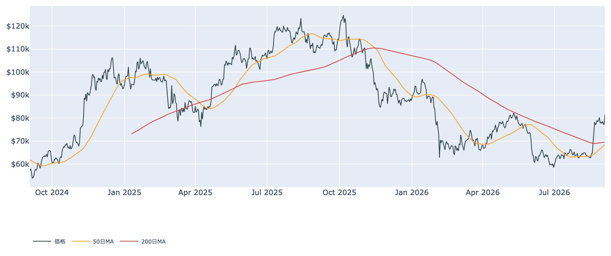
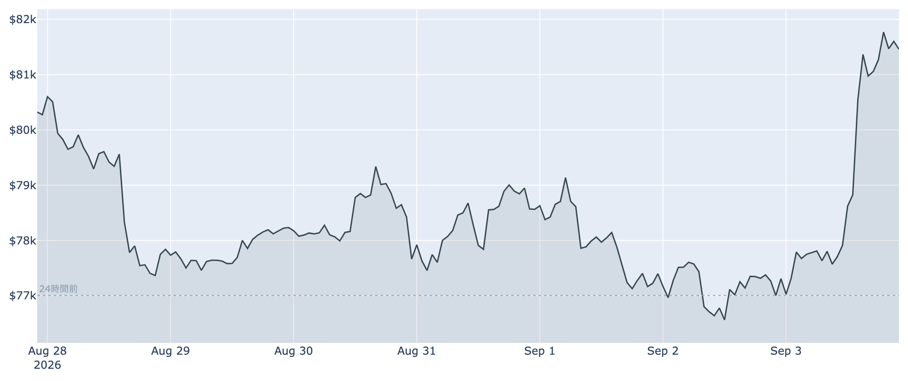
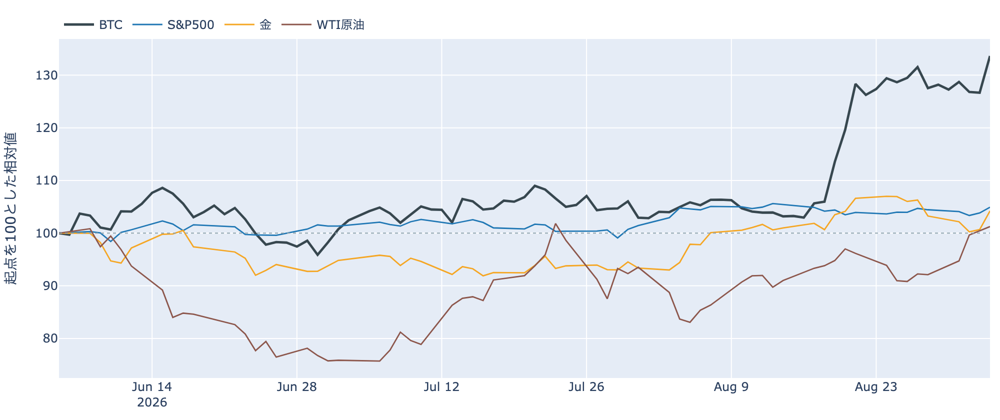
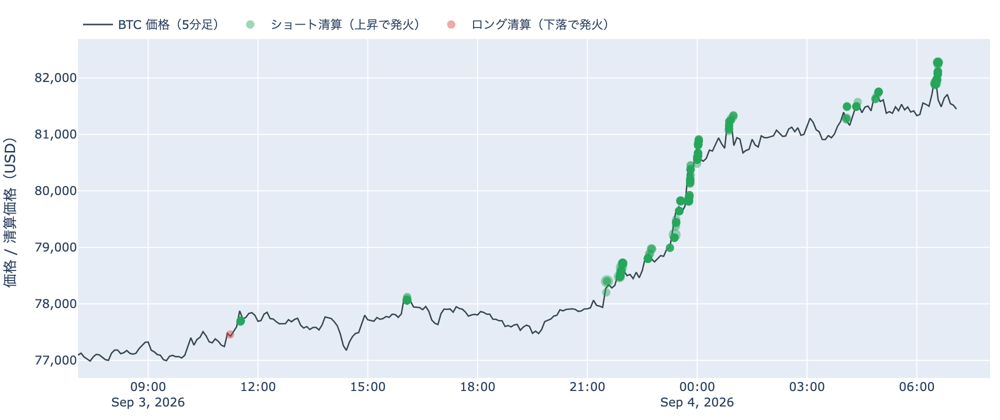
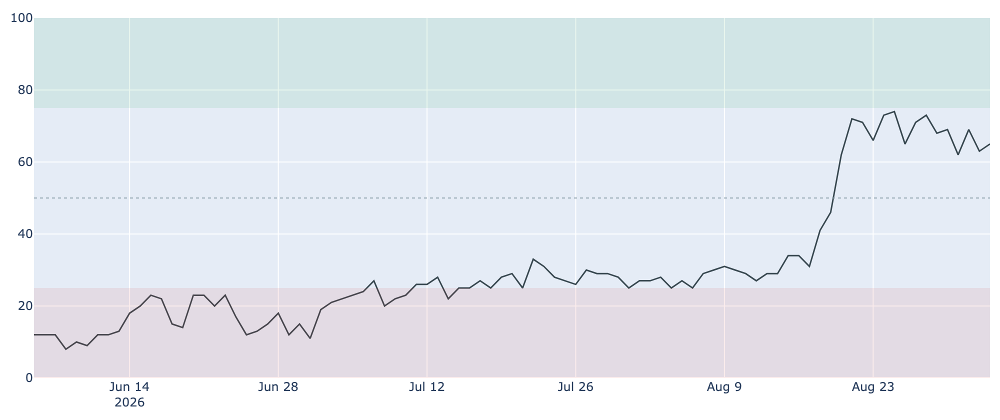
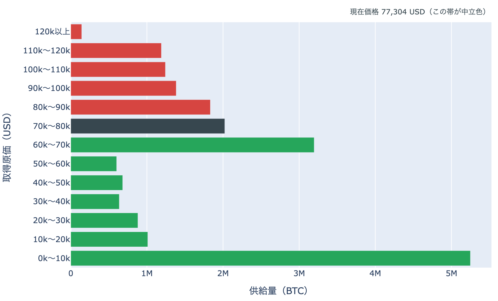
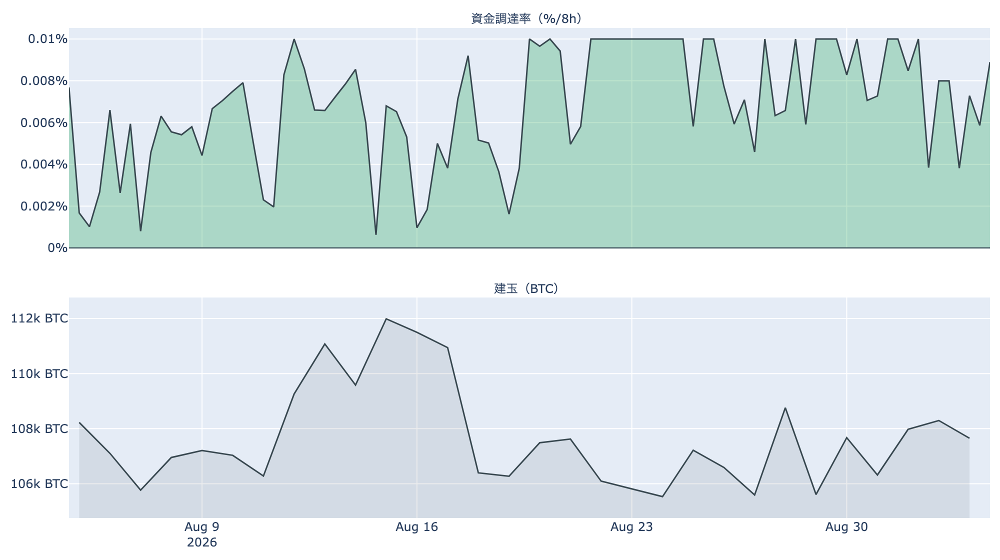
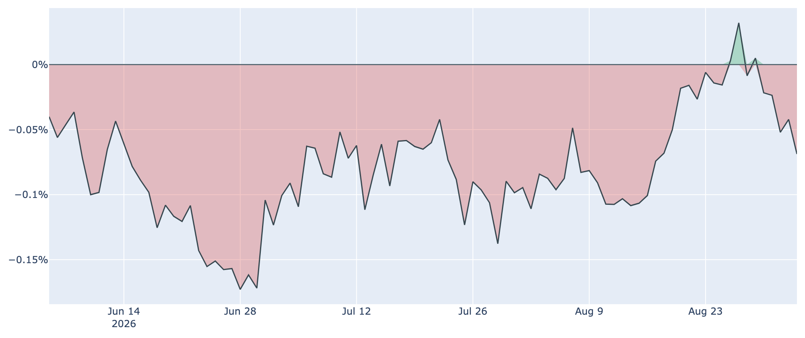
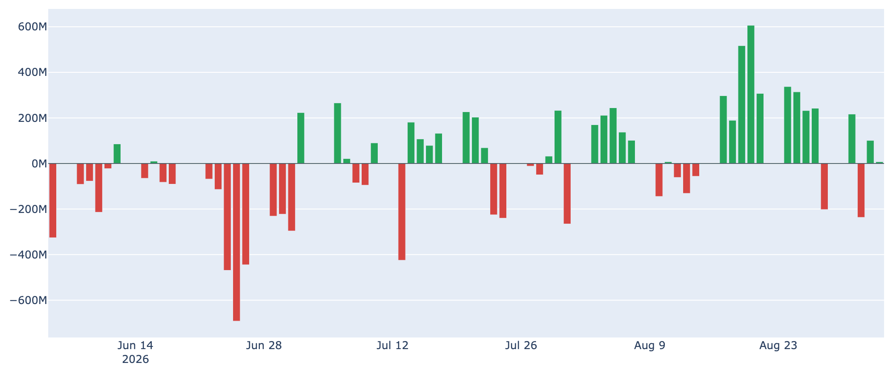

# 6営業日の横ばいを上へ抜けた ― $81,500台への+5.9%は、ショート側の清算を伴った

**2026年9月4日**

9月4日7時5分（日本時間）時点の実勢価格は約$81,569で、24時間では**+5.93%**。レンジは$76,929〜$82,283と値幅7.0%で、8月28日から6営業日続いた$77,000〜$78,600の横ばいを上へ抜けました。1週間では+1.61%、1か月では+27.35%です。外側では、FRB理事の据え置き寄りの発言を受けて米株が上げ、金が1日で3.5%上昇しました。中身のデータで見ると、この上げは売り持ちの強制的な手仕舞い（清算）を伴っており、しかも米国側の需要はまだ乗っていません。

（数値は9月4日7時5分（日本時間）時点までに取得した各種データに基づきます。価格と取引所プレミアムはその時点の実勢、市場心理は9月3日の確定値、オンチェーン指標は9月2日時点、ETF資金フローは9月3日時点、株・金・原油など外部環境の終値は9月3日時点です。なお、オンチェーンの保有・年齢の指標には、ETF・取引所が預かっている分も含まれています。）

## 1. 全体像：外部環境が緩んだ日に、BTCは6日ぶんの横ばいを一気に消化した

* **水準**: 9月4日7時5分時点で約$81,569。直近の確定日足終値は9月2日（UTC）の約$77,307です。この実勢価格は、取得できる直近90日の日足終値のどれよりも高く（それまでの最高は8月27日の約$80,275）、50日移動平均（約$68,500）も200日移動平均（約$69,600）も大きく上回っています。ただし50日線自体はまだ200日線の下にあり、移動平均の並び（デッドクロス圏）は変わっていません。過去2年のレンジでの位置は下から45%ほどです。

* **この24時間**: 安値$76,929から高値$82,283まで、1日のうちに7.0%の幅を動きました。1週間の高値・安値の両方がこの24時間の中にあります。
* **外部環境**: 9月3日、FRBのウォーラー理事が「今後のインフレ指標に驚きがなければ金利据え置きを支持する」と述べ、9月会合での利上げ観測が後退しました。同じ9月3日の終値は、S&P500が7,747.71（**+1.06%**）、VIX（＝株式市場の恐怖指数）が14.32（-5.79%）、金が4,520.30ドル（**+3.53%**、5営業日では-1.94%）、米10年債利回りが4.76%、ドル指数（＝主要通貨に対するドルの強さ）が99.00（-0.56%）。WTI原油は91.67ドル（+0.73%）で、5営業日では+9.75%と高値圏に残っています。銘柄の並びによる地合いの目安は9月2日→9月3日、5営業日ともに**リスクオン寄り**です。米国とイランの応酬は一服したと伝えられており、原油の1日の上げ幅も小さくなっています。

* **BTCとの30日相関**は金**+0.66**／S&P500**+0.13**。株が上げ金も上げた9月3日に、BTCはそのどちらよりも大きく動きました。株・金・原油が揃って上を向いたなかでの上昇であり、BTCだけが独立して動いた日ではありません。
* **効き方の下地**: 1年以上動いていない供給は9月2日時点で**62.8%**（3か月前から+1.5pt）。全体の6割強が長く動かないままなので、同じ規模の売り買いでも価格が動きやすい下地は続いています。

## 2. データの解説：注目すべき5つのポイント

### ① 上げは清算を伴い、焼けたのはすべてショート側だった

* **向き**: この24時間にHyperliquid（オンチェーンの取引所）で観測できた強制清算は、**100%がショート（売り持ち）側**。ロング側の清算は記録されていません。ショートの清算は価格が上がると発火するので、上げに追随して発火した形です。**清算と値動きは同時刻に起きるため、どちらが原因かはこのデータでは決まりません**——書けるのは「この上げは清算を伴った」までです。
* **位置**: 焼けた価格帯は$78,000台が3分の1で最も多く、以下$81,000台が約2割、$80,000台と$79,000台がそれぞれ約16%。**$78,000から$82,000まで、階段状に上げながら順に発火していった**分布です。
* **時間と散らばり**: 被清算アドレスは420件で、最も集中した1時間は9月4日6時台（全体の27%）。最大の1件も全体の27%で、半分には届きません。**特定の1者が飛んだのではなく、多数の売り持ちが上げの過程で順に外された**という形です。

* **心理**: Fear & Greed 指数（＝市場心理の指数）は9月3日の確定値で**65**の「強欲」。1週間前の71からは6pt下がっており、30日前の25（恐怖）からは大きく上です。**1か月で+27%上げたわりに、心理の側は先週より冷えたまま**この上げを迎えました。

### ② 価格が$80,000の帯を上へ抜けた ― 通過した供給は全体の約2割

* **帯またぎ**: 9月2日時点の分布に、いまの価格を重ねると、価格は**$80,000〜$90,000の帯**（約**183万BTC**、全供給の9.1%）にいます。1日前は1つ下の$70,000〜$80,000の帯にいたので、**この1日で上へ1帯移動**。通過した帯を含む供給は約**386万BTC（全供給の19.2%）**で、価格より上にある帯の割合は**28.9%から19.7%へ**下がりました。1か月で見れば上へ2帯、通過した供給は約705万BTC（35.1%）です。
* **帯の中の位置**: いまは帯の下端から16%の位置。**上端$90,000までは+10.3%**、下端$80,000までは**-1.9%**しかありません。抜けたばかりの境界がすぐ足元にあります。
* **上に積まれている量**: すぐ上の$90,000〜$100,000が約**139万BTC（6.9%）**で、価格より上ではここが最も厚い帯。その先も$100,000〜$110,000が6.2%、$110,000〜$120,000が5.9%、$120,000以上が0.7%と続きます。すぐ下は$70,000〜$80,000の約202万BTC（10.1%）、その下が$60,000〜$70,000の約320万BTC（15.9%）です。
* この分布は、それぞれのコインが**最後に動いたときの価格**で束ねたものです。誰が持っているかは分からず、自分のウォレット間の移動や取引所への入出金でも価格は付け替わるため、そのまま「その値段で買った人の量」とは読めません。

### ③ 価格は5.9%上げたが、先物の残高は1週間で+1.9%しか増えていない

* **規模**: 建玉（＝先物の未決済残高）は111,302BTC（9月3日UTCで約83.2億ドル）、7日変化は**+1.9%**。価格の上げ幅に対して、残高の増え方は小さいままです。**新しい買い持ちが大量に積み上がったというより、前からの売り持ちが外れた側の動き**と整合します（①の清算が全部ショートだったことと同じ向き）。
* **傾き**: 資金調達率（＝先物の買い持ちが払う金利）は8時間あたり**+0.0078%（年率換算 約+8.5%）**。直近30日のレンジ（0.0006%〜0.0100%、平均0.0068%）では平均よりやや上ですが、この銘柄の上限（±0.3%／8時間）には遠く、過熱と呼ぶ水準ではありません。プラスは100回連続（8時間ごと＝約33日）続いています。
* **上乗せ分**: 短期金利（13週Tビル 3.74%）を引いた超過は**+4.31pt**で、直近34日の平均+3.61ptよりやや厚い程度。これは置いておくだけの金利に対する上乗せであって、確実に取れる利回りではありません。

### ④ 米国側は、この上げに乗っていない

* **価格差**: Coinbase Premium（＝米国とそれ以外の価格差）は9月3日付の最新値（＝9月4日7時5分時点の実勢）で**-0.069%**。マイナス圏は**5日連続**で、1週間前（8月27日）の+0.032%からは下向きです。前日9月2日の値も-0.042%に落ち着いており、**8月末に一時プラス側へ振れた動きは続きませんでした。**
* **タイミング**: 価格が24時間で5.9%上げた局面で、米国とそれ以外の価格差はむしろマイナス幅を広げています。**今回の上げは、米国の現物側から押し上げられた形にはなっていません。**

* **ETF**: 9月3日の米国スポットETFの純流出入は**+7.7M USD**で、集計上はほぼ横ばい。内訳に出ているのはMSBTの+7.7Mだけです。9月1日は-236.5M、9月2日は+101.1Mと、日ごとに向きが変わる状態が続いています。
* **均し**: 直近7営業日の合計は**+361.6M USD**の流入超。方向としてはプラスですが、8月中旬から下旬にかけて連日3桁の流入が並んだ頃の勢いには戻っていません。

### ⑤ 長期側から動く量は5営業日連続で細り、動いた分は原価割れのまま

* **量**: 長期保有層のネットポジション変化（＝長期勢の保有量の増減、過去30日）は9月2日時点で約**-10.5万BTC**。8月28日の約-27.2万BTCをピークに**5営業日連続で減少幅が縮み**、ピークの4割弱まで戻しました。1週間前（8月26日）は約-23.5万BTCです。30日前は約+0.7万BTCでしたから、符号が反転した状態そのものは続いています。**預かり分の混入を差し引いても、この規模と方向は変わりません。**
* **損益**: 長期勢SOPR（＝長期勢の損益）は約**0.956**で1割れ。8月31日の0.977から3営業日続けて下がっており、動いた長期側のコインは平均すると**原価を割ったまま**動いています。
* 量は細り、損益は1割れのまま。**2本が逆を向いているので、この日も「分配」とは書けません。**書けるのは「長期側から動く量は細り続けているが、動いた分は利益確定になっていない」というところまでです。
* 全体のSOPR（＝動いたコインの損益）は約1.002、短期勢SOPR（＝短期勢の損益）も約1.002で、どちらも1をわずかに上回るだけ。**24時間で5.9%上げた日としては、利確の傾きはほとんど出ていません**（オンチェーンの数字は9月2日時点なので、この上げの分はまだ入っていません）。

## 3. 相場転換を見極めるための「3つの分岐点」

1. **$80,000の境界を守れるか、$90,000まで詰められるか**: いまの価格から下端$80,000までは-1.9%、上端$90,000までは+10.3%。抜けたばかりの境界がすぐ下にあり、ここを割り戻すと1日で通過した約386万BTC（全供給の19.2%）ぶんの帯へ逆戻りします。上へ向かう場合、最後に動いた価格が$90,000〜$100,000のコインが139万BTC、$100,000〜$120,000にも12%分が積まれています。下側のもう一段の目安は短期保有者（保有155日未満）の平均取得単価で、9月2日時点で約**$70,384**。いまの価格はこれを約16%上回っています。
2. **米国側が遅れて追いつくか**: 取引所プレミアムは5日連続のマイナス、ETFは9月3日でほぼ横ばい。**上げの当日に米国の現物需要が出ていない**という組み合わせは、上げが続くかどうかを測る材料になります。プレミアムがプラス圏へ戻り、ETFの流入が数営業日そこに揃うかどうかが見どころです。
3. **外部環境の日程**: 本日9月4日21時30分（日本時間）に米8月雇用統計が発表されます（非農業部門雇用者数は5.5〜5.8万人増の予想、8月のADP雇用統計は3.8万人増と予想を下回りました）。ウォーラー理事の据え置き寄りの発言で9月会合の利上げ観測は後退しており、この統計がその見方を裏づけるか覆すかが次の材料です。9月15〜16日にはFOMC、同じ9月15日には米上院でCLARITY法案（暗号資産の市場構造法案）の討論打ち切り投票が予定されており、可決には60票が必要です。中東は応酬が一服したと伝えられていますが、原油は5営業日で+9.75%と高値圏に残っています。

## 総括

6営業日続いた$77,000〜$78,600の横ばいは、9月3日から4日にかけて上へ抜けました。9月4日7時5分時点で約$81,569、24時間で+5.9%、値幅は7.0%です。この上げはHyperliquidで観測できた清算を伴っており、焼けたのは**すべてショート側**、$78,000台から$82,000台まで階段状に発火しています。一方で先物の建玉は1週間で+1.9%しか増えておらず、新しい買い持ちが積み上がったというより売り持ちが外れた側の動きに見えます。米国側の指標は上げに乗っておらず、取引所プレミアムは5日連続のマイナス、ETFは9月3日でほぼ横ばい。オンチェーンでは、長期側から動く量が5営業日連続で細ってピークの4割弱まで戻った一方、動いた分は原価を割ったままです。価格は9月2日時点の分布で$80,000〜$90,000の帯へ1日で移り、**下端$80,000まで-1.9%、上端$90,000まで+10.3%という帯の入口に立ったまま、今夜の雇用統計を迎える**、というのが9月4日時点の姿です。

---

*本稿は情報提供を目的としたものであり、投資助言ではありません。将来の価格動向を保証・示唆するものではなく、投資判断は各自の責任において行ってください。*
