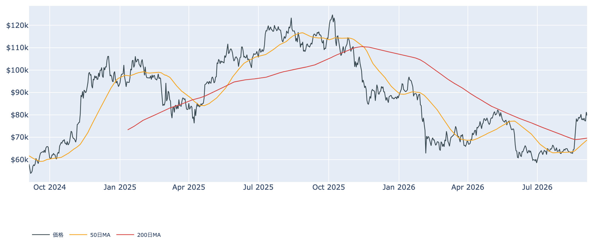
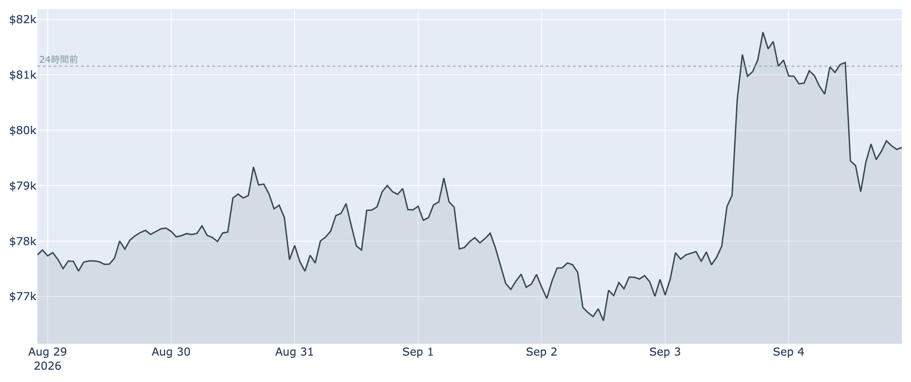
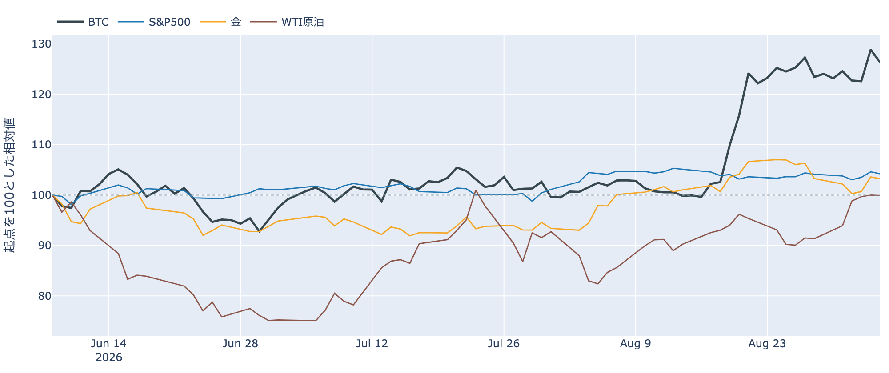
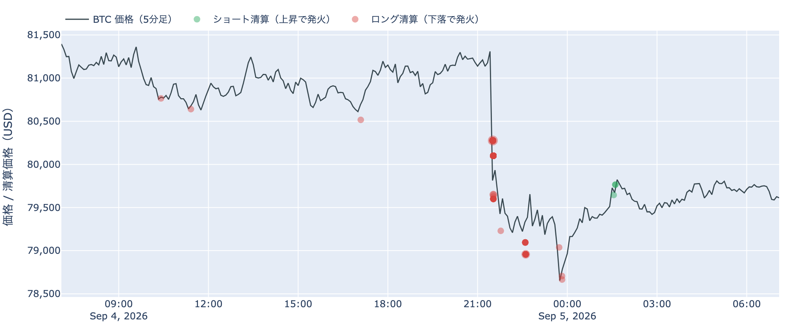
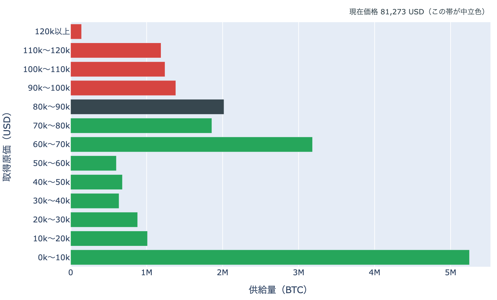
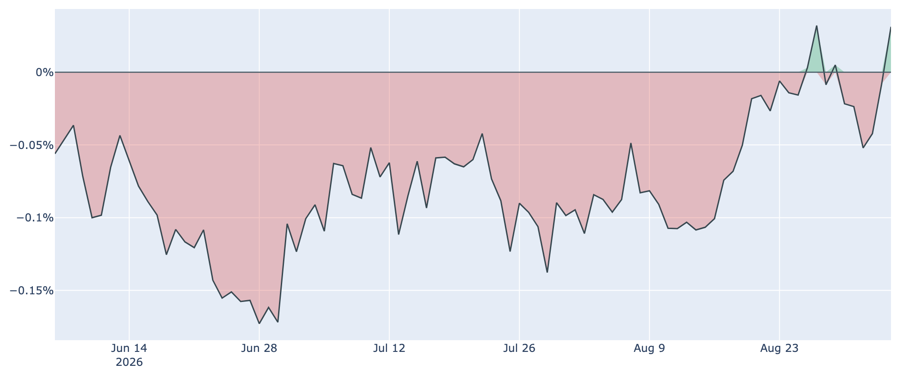
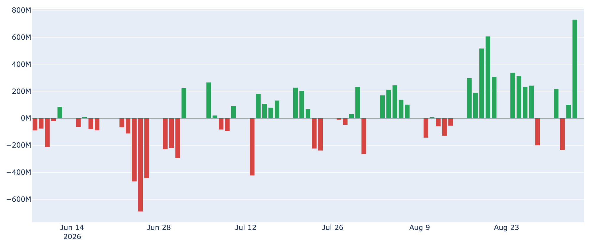
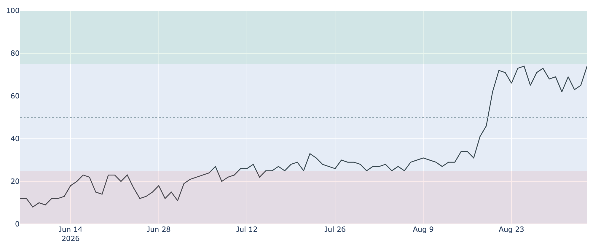
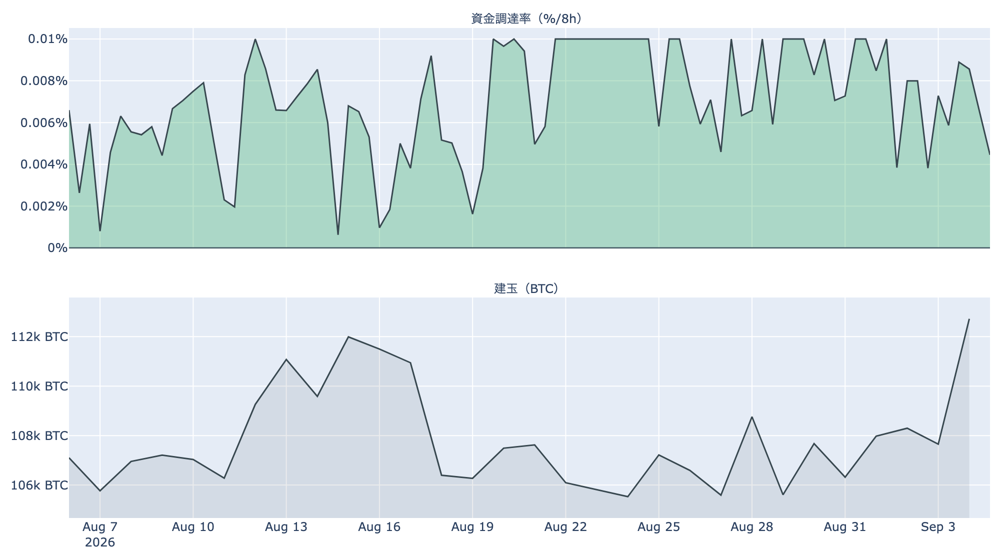

# 雇用統計の時間に$80,000を割り戻した ― 反落はロング側の清算を伴い、米国の買いは逆にプラスへ

**2026年9月5日**

9月5日7時5分（日本時間）時点の実勢価格は約$79,690で、24時間では**-1.81%**。レンジは$78,626〜$81,438です。前日に$81,000台へ乗せた動きは1日で戻され、$80,000の境界のすぐ内側に戻ってきました。1週間では+2.38%、1か月では+23.35%と、上げ幅そのものは残っています。外側では、9月4日発表の米8月雇用統計が予想の3倍の伸びとなり、9月会合での利上げ観測が再び浮上しました。中身のデータで見ると、この押しは買い持ちの強制的な手仕舞い（清算）を伴った一方、米国の現物側の需要はむしろ前日にプラスへ転じています。

（数値は9月5日7時5分（日本時間）時点までに取得した各種データに基づきます。価格と取引所プレミアムはその時点の実勢、市場心理は9月4日の確定値、オンチェーン指標は9月3日時点、ETF資金フローは9月4日時点、株・金・原油など外部環境の終値は9月4日時点です。なお、オンチェーンの保有・年齢の指標には、ETF・取引所が預かっている分も含まれています。）

## 1. 全体像：上へ抜けた翌日に、同じ境界の内側へ戻された

* **水準**: 9月5日7時5分時点で約$79,690。直近の確定日足終値は9月3日（UTC）の約$81,264です。50日移動平均（約$68,800）も200日移動平均（約$69,600）も大きく上回っていますが、50日線自体はまだ200日線の下にあり、移動平均の並び（デッドクロス圏）は変わっていません。過去2年のレンジでの位置は下から43%ほどです。

* **この24時間**: 高値$81,438から安値$78,626まで、値幅3.6%。1週間のレンジは$76,219〜$82,283で、その上端は9月4日に付けたものです。上抜けの勢いは1日で止まりました。
* **外部環境**: 9月4日発表の米8月雇用統計は、非農業部門雇用者数が**16.2万人増**と市場予想（約5.3万人増）を大きく上回り、失業率は4.1%で横ばい。7月分も-2.3万人から+2.1万人へ上方修正されました。労働市場の底堅さが確認されたことで、9月15〜16日のFOMCでの利上げ観測が再び意識されています。同じ9月4日の終値は、S&P500が7,718.60（-0.38%）、VIX（＝株式市場の恐怖指数）が14.53（+1.47%）、金が4,477.20ドル（-0.32%）、米10年債利回りが4.78%、ドル指数（＝主要通貨に対するドルの強さ）が99.16（+0.16%）。銘柄の並びによる地合いの目安は9月3日→9月4日で**リスクオフ寄り**、5営業日では**まちまち**です。
* **円**: ドル円は9月4日終値で156.22、1営業日で**-1.70%の円高**です。日銀が9月17〜18日の会合で利上げに動くとの見方が強まったことが背景と報じられており、同じ日に米株もBTCも下げています。**円キャリー（＝低金利の円で借りて運用する取引）の巻き戻しが警戒されうる場面**ですが、為替が動く理由は他にもあり、これだけで結びつけることはできません。
* **エネルギー**: WTI原油は9月4日終値で91.22ドル（-0.09%）ですが、5営業日では**+9.38%**と高値圏に残っています。米国がイランへの攻撃を再開し、ホルムズ海峡の通航船数が減ったと報じられており、供給側の警戒が続いています。OPEC+は日曜の会合で10月の生産方針を据え置く見通しです。

* **BTCとの30日相関**は金**+0.66**／S&P500**+0.14**。株が小幅安、金も小幅安だった9月4日に、BTCはそのどちらよりも大きく下げました。**株・金と横並びの動きというより、BTC側の値幅が突出した日**です。
* **効き方の下地**: 1年以上動いていない供給は9月3日時点で**62.8%**（3か月前から+1.5pt）。全体の6割強が長く動かないままなので、同じ規模の売り買いでも価格が動きやすい下地は続いています。

## 2. データの解説：注目すべき5つのポイント

### ① 押しはロング側の清算を伴い、その8割近くが21時台に集中した

* **向き**: この24時間にHyperliquid（オンチェーンの取引所）で観測できた強制清算は、**99.8%がロング（買い持ち）側**。ショート側はほとんど記録されていません。ロングの清算は価格が下がると発火するので、下げに追随して発火した形です。前日は逆に100%がショート側でしたから、**1日で向きが完全に裏返っています**。
* **位置**: 焼けた価格帯は**$80,000台が68%**で圧倒的に多く、以下$78,000台が18%、$79,000台が14%。**$80,000の境界を割っていく過程に集中**しており、その下の$78,000台まで届いています。
* **時間と散らばり**: 被清算アドレスは259件で、最も集中した1時間は**9月4日21時台（日本時間）で全体の77%**。最大の1件は全体の19%で、半分には遠く届きません。**特定の1者が飛んだのではなく、多数の買い持ちが同じ1時間に外された**という形です。米雇用統計の発表は同じ21時30分でした。
* **清算と値動きは同時刻に起きるため、どちらが原因かはこのデータでは決まりません**——書けるのは「この押しは清算を伴った」までです。

### ② 価格は$80,000の帯から1日で下へ ― 通過した供給は全体の約2割

* **帯またぎ**: 9月3日時点の分布に、いまの価格を重ねると、価格は**$70,000〜$80,000の帯**（約**186万BTC**、全供給の9.3%）にいます。1日前は1つ上の$80,000〜$90,000の帯にいたので、**この1日で下へ1帯移動**。通過した帯を含む供給は約**388万BTC（全供給の19.3%）**で、価格より上にある帯の割合は**19.7%から29.8%へ**戻りました。1週間前（約$77,839）は同じ帯の中で、上下配分は動いていません。1か月で見れば1つ下の帯からの上昇が続いている形です。
* **帯の中の位置**: いまは帯の**下端から97%**、つまり上端のすぐ内側です。**上端$80,000までは+0.4%**しかなく、下端$70,000までは-12.2%。**上の境界には手が届くが、下は遠い**という位置関係になっています。
* **上に積まれている量**: すぐ上の$80,000〜$90,000が約**202万BTC（10.1%）**で、価格より上ではここが最も厚い帯。その先も$90,000〜$100,000が6.9%、$100,000〜$110,000が6.2%、$110,000〜$120,000が5.9%、$120,000以上が0.7%と続きます。すぐ下は$60,000〜$70,000の約**318万BTC（15.9%）**で、こちらは12%以上離れています。
* この分布は、それぞれのコインが**最後に動いたときの価格**で束ねたものです。誰が持っているかは分からず、自分のウォレット間の移動や取引所への入出金でも価格は付け替わるため、そのまま「その値段で買った人の量」とは読めません。

### ③ 米国側の買いは、押した日に逆さまの動きをした

* **価格差**: Coinbase Premium（＝米国とそれ以外の価格差）は9月4日付の最新値（＝9月5日7時5分時点の実勢）で**+0.031%**。**プラス圏へ転じたのはこの1日**で、1週間前（8月28日）の-0.009%、30日前の-0.096%からは着実な上向きです。観測できる300営業日の中では上から5%以内の水準にあたります。
* **タイミング**: 価格が24時間で1.8%下げた局面で、米国とそれ以外の価格差はむしろプラスへ振れています。**押した側と、米国の現物側が逆を向いた1日**でした。

* **ETF**: 9月3日の米国スポットETFの純流出入は**+730.8M USD**で、**取得できる直近90日で最大の1日流入**です（次点は8月20日の+606.3M）。9月4日分は集計上ほぼゼロで、内訳に出ているのはMSBTの+0.0Mだけでした。
* **均し**: 直近7営業日の合計は**+852.5M USD**の流入超。9月1日の-236.5Mを挟みつつ、週単位ではプラスに戻しています。

### ④ 長期側は「量は細り、動いた分は利確」に揃った

* **量**: 長期保有層のネットポジション変化（＝長期勢の保有量の増減、過去30日）は9月3日時点で約**-8.4万BTC**。1週間前（8月27日）の約-25.4万BTCから**減少幅は3分の1**まで縮みました。30日前は約-2.4万BTCですから、符号が反転した状態そのものは続いています。**預かり分の混入を差し引いても、この規模と方向は変わりません。**
* **損益**: 長期勢SOPR（＝長期勢の損益）は約**1.029**。1週間前の0.947から1を上抜けており、動いた長期側のコインは平均して**原価より上で動いた**ことになります。
* 量の減少と、動いた分が利益側に乗ったこと。**この2本が同じ向きで揃ったので、この日は「分配」と書ける並び**です。ただし規模は前週の3分の1まで細っており、**勢いを増しながらの分配ではありません**。
* 全体のSOPR（＝動いたコインの損益）は約**1.011**、短期勢SOPR（＝短期勢の損益）も約**1.010**。どちらも4年の中では上位（それぞれ70%・90%の位置）で、**市場全体として利確側に傾いた状態**が続いています。MVRV Z-Score（＝市場全体の含み益）は約0.95で、4年レンジの下から43%と中庸のままです。

### ⑤ 心理は「強欲」の上限近くまで上がったが、先物の傾きはむしろ緩んだ

* **心理**: Fear & Greed 指数（＝市場心理の指数）は9月4日の確定値で**74**の「強欲」。前日の65から**1日で9pt上げ**、2018年以降の分布では上から10%程度の位置に入りました。30日前は27の「恐怖」でしたから、1か月で心理は大きく入れ替わっています。

* **傾き**: 資金調達率（＝先物の買い持ちが払う金利）は8時間あたり**+0.0040%（年率換算 約+4.4%）**。直近30日のレンジ（0.0006%〜0.0100%、平均0.0068%）では**平均を下回る側**で、前日の水準からは半分近くまで落ちています。プラス自体は100回連続（8時間ごと＝約33日）続いていますが、この銘柄の上限（±0.3%／8時間）には遠く、過熱と呼べる水準ではありません。
* **上乗せ分**: ならしの年率+7.12%から短期金利（13週Tビル 3.76%）を引いた超過は**+3.36pt**で、直近34日の平均+3.72ptよりやや薄い程度です。これは置いておくだけの金利に対する上乗せであって、確実に取れる利回りではありません。
* **規模**: 建玉（＝先物の未決済残高）は107,777BTC（9月4日UTCで約91.6億ドル）、7日変化は+3.6%。**心理指数は上を向き、レバレッジの傾きは緩む**という食い違いが出ています。

## 3. 相場転換を見極めるための「3つの分岐点」

1. **$80,000を取り戻せるか、$70,000まで距離を保てるか**: いまの価格から上端$80,000までは+0.4%、下端$70,000までは-12.2%。**上の境界は目の前で、下の境界は遠い**という帯の位置です。上へ抜け直せば、9月3日から4日にかけて通過した約388万BTC（全供給の19.3%）ぶんの帯へ戻ることになり、その上には$80,000〜$90,000の約202万BTC（10.1%）が最も厚い帯として控えています。下側のもう一段の目安は短期保有者（保有155日未満）の平均取得単価で、9月3日時点で約**$70,665**。いまの価格はこれを約13%上回っています。
2. **米国側の買いが続くか**: 取引所プレミアムは9月4日にプラスへ転じたばかりで、まだ1日です。ETFは9月3日に直近90日で最大の流入を記録した一方、9月4日分はほぼゼロ。**単発だったのか、数営業日そこに揃うのか**が、押し目が拾われるかどうかを測る材料になります。
3. **外部環境の日程**: 9月15〜16日のFOMCは、8月雇用統計の上振れで利上げ観測が再浮上し、市場の見方は割れた状態です。翌9月17〜18日には日銀の会合があり、利上げ観測から円が急伸しています。**同じ週に日米の中央銀行が並ぶ**構図で、リスク資産全体の空気が動きやすい日程です。加えて9月15日には米上院でCLARITY法案（暗号資産の市場構造法案）の討論打ち切り投票が予定されており、前へ進めるには60票が必要です。中東は米国のイランへの攻撃が再開したと伝えられ、原油は5営業日で+9.38%と高値圏に残っています。

## 総括

前日に$81,000台へ乗せた動きは1日で戻され、9月5日7時5分時点の実勢価格は約$79,690、24時間で-1.81%です。この押しはHyperliquidで観測できた清算を伴っており、焼けたのは**99.8%がロング側**、しかもその77%が9月4日21時台（日本時間）の1時間に集中し、価格帯では$80,000台に7割近くが偏っていました。前日の清算がすべてショート側だったことと合わせると、**同じ境界を挟んで両方向のレバレッジが2日で順に外された**格好です。一方で米国側の指標は逆を向き、取引所プレミアムはこの日プラスへ転じ、ETFは9月3日に直近90日で最大の流入を記録しました。オンチェーンでは、長期側から動く量が前週の3分の1まで細り、動いた分は原価より上へ乗って、**「分配」と書ける並びが揃っています**。価格は9月3日時点の分布で$70,000〜$80,000の帯へ1日で戻り、**上端$80,000まで+0.4%という境界のすぐ内側で、日米の中央銀行が並ぶ再来週を待つ**、というのが9月5日時点の姿です。

---

*本稿は情報提供を目的としたものであり、投資助言ではありません。将来の価格動向を保証・示唆するものではなく、投資判断は各自の責任において行ってください。*
