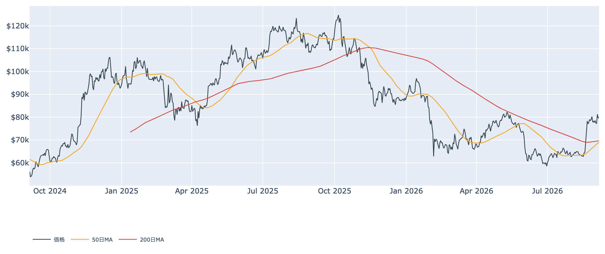
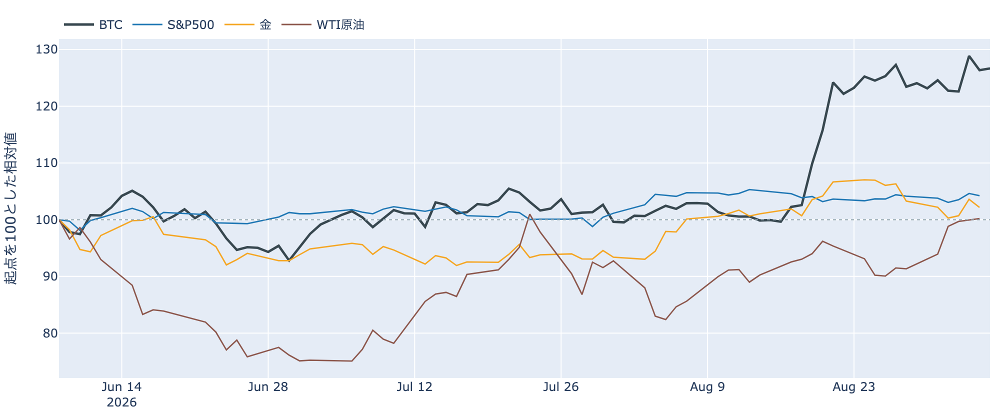
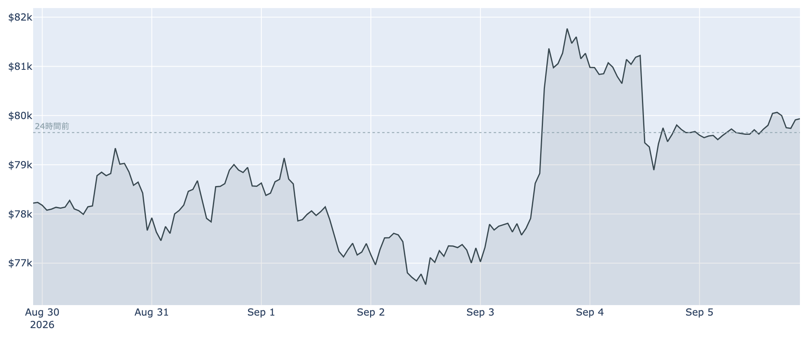
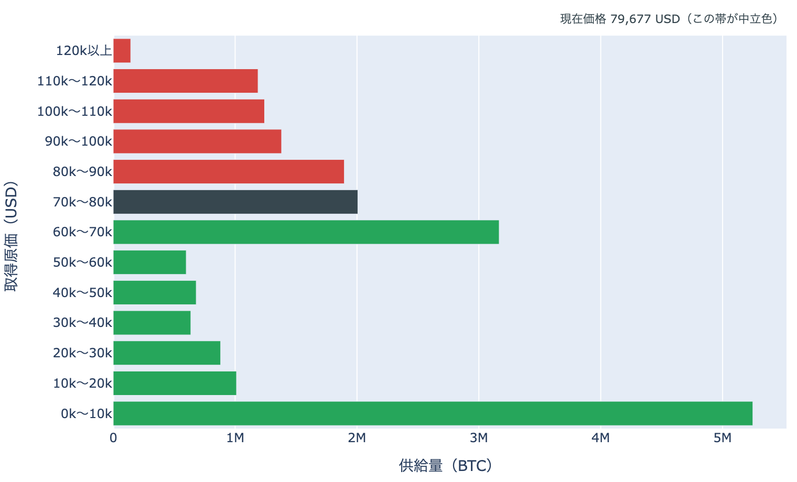
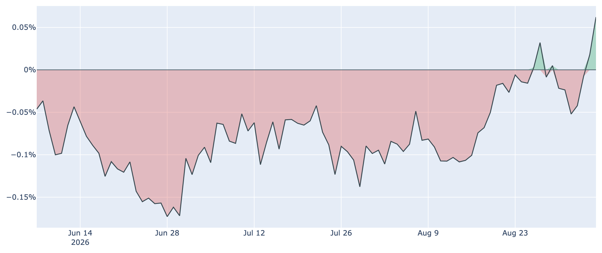
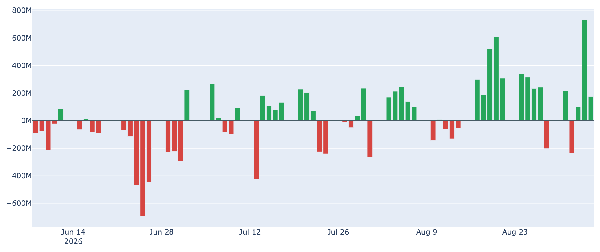
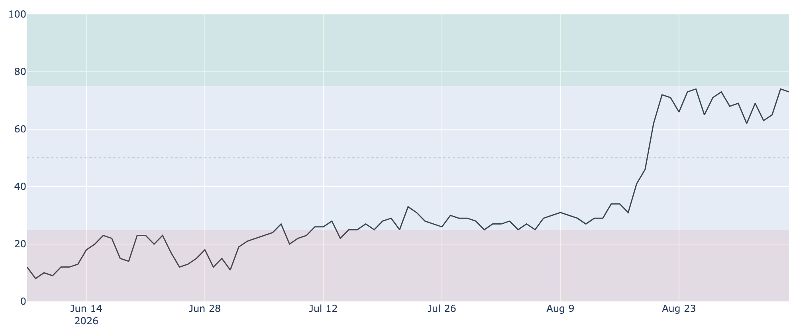
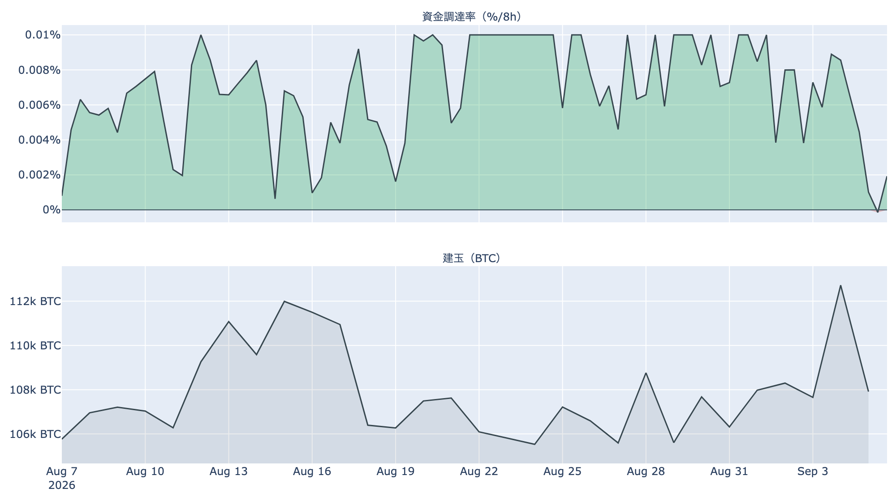
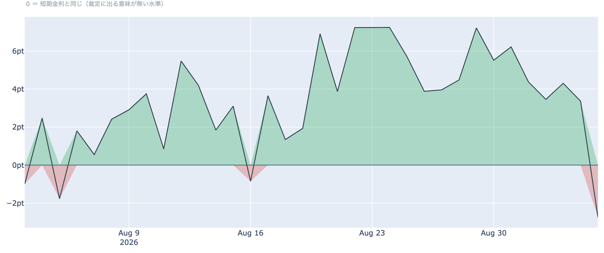

# $80,000まで0.2%、週末の値幅は1%未満 ― 先物の上乗せは短期金利を割り込み、米国の買いは記録圏に2日

**2026年9月6日**

9月6日7時5分（日本時間）時点の実勢価格は約$79,875で、24時間では**+0.28%**。レンジは$79,459〜$80,201と、値幅は1%に届きませんでした。木曜に$82,000台まで上へ抜け、金曜に$80,000を割り戻したあと、週末はその境界の200ドル手前に張り付いています。1週間では+2.10%、1か月では+24.29%です。中身のデータで見ると、静かな値動きの裏で先物の傾きはほぼゼロまで緩み、米国の現物側の需要は逆に観測できる範囲でほぼ最高の水準にあります。

（数値は9月6日7時5分（日本時間）時点までに取得した各種データに基づきます。価格と取引所プレミアムはその時点の実勢、市場心理は9月5日の確定値、オンチェーン指標は9月4日時点、ETF資金フローは9月4日時点、株・金・原油など外部環境の終値は9月4日時点です。なお、オンチェーンの保有・年齢の指標には、ETF・取引所が預かっている分も含まれています。）

## 1. 全体像：境界の手前で止まった週末

* **水準**: 9月6日7時5分時点で約$79,875。直近の確定日足終値は9月4日（UTC）の約$79,675です。50日移動平均（約$69,100）も200日移動平均（約$69,700）も1万ドル以上、上にいます。ただし50日線はまだ200日線の下にあり、並びはデッドクロス圏のまま。**2本の差は約$600（0.9%）まで縮んでおり**、いまの水準が続けば数日のうちに並びが入れ替わる位置です。過去2年のレンジでの位置は下から43%ほどです。
* **1週間**: レンジは$76,219〜$82,283。9月3日の上抜けと9月4日の反落を経て、週末はその中央よりやや上で止まっています。
* **外部環境**: 9月4日の終値は、S&P500が7,718.60（-0.38%）、金が4,429.80ドル（**-1.38%**）、WTI原油が91.48ドル（+0.20%、5営業日では**+9.69%**）、VIX（＝株式市場の恐怖指数）が14.53、米10年債利回りが4.78%、ドル指数（＝主要通貨に対するドルの強さ）が99.16。銘柄の並びによる地合いの目安は9月3日→9月4日で**リスクオフ寄り**、5営業日では**まちまち**です。8月の米雇用統計が予想を大きく上回ったことで、9月15〜16日のFOMCでの利上げの織り込みは6割前後まで上がったと報じられています。
* **円**: ドル円は9月4日終値で156.22、1営業日で**-1.70%の円高**。同じ日に米株もBTCも下げており、円キャリー（＝低金利の円で借りて運用する取引）の巻き戻しが警戒されうる場面です。ただし為替が動く理由は他にもあり、これだけで結びつけることはできません。日銀は9月17〜18日の会合で利上げに動くとの見方が強まっています。
* **エネルギー**: 原油は1週間で約1割の上昇です。米国のイランへの攻撃が今週再開し、ホルムズ海峡の通航は年内に正常化しないとの見方が海運大手から出ています。OPEC+は9月6日（日）の会合で10月の生産方針を据え置く見通しです。

* **BTCとの30日相関**は金**+0.67**／S&P500**+0.14**。金が1.4%下げた9月4日にBTCも1.8%下げており、**株よりも金と並んで動く形**が続いています。
* **効き方の下地**: 1年以上動いていない供給は9月4日時点で**62.9%**（3か月前から+1.6pt）。全体の6割強が長く動かないままなので、同じ規模の売り買いでも価格が動きやすい下地は変わっていません。

## 2. データの解説：注目すべき5つのポイント

### ① 値幅1%未満の週末 ― 清算はほぼ観測されなかった

* **値幅**: この24時間のレンジは$79,459〜$80,201で、高値と安値の差は**0.9%**。前日の3.6%、前々日の5%超から一気に縮み、1週間でいちばん静かな1日でした。
* **境界との距離**: 高値の$80,201は$80,000をわずかに上回ったものの、そこで止まっています。**上へ抜け切れず、下へも崩れない**という位置です。
* **清算**: この24時間にHyperliquid（オンチェーンの取引所）で観測できた強制清算は**わずか3件**。前日はロング側、前々日はショート側と両方向のレバレッジが順に外されましたが、週末は焼けるものがほとんど残っていない静けさです。

### ② 価格は帯の上端に張り付いたまま ― $80,000まで+0.2%

* **帯の中の位置**: 9月4日時点の分布に、いまの価格を重ねると、価格は**$70,000〜$80,000の帯**（約**201万BTC**、全供給の10.0%）の**下端から99%**、つまり上端にほぼ接しています。**上端$80,000までは+0.2%、下端$70,000までは-12.4%**。1日前も1週間前も同じ帯の中で、上下配分は動いていません。
* **1か月の通過量**: 30日前（約$64,267）は1つ下の$60,000〜$70,000の帯にいました。そこから**上へ1帯移動**し、通過した帯を含む供給は約**517万BTC（全供給の25.8%）**。価格より上にある帯の割合は**39.1%から29.1%へ**減っています。
* **上に積まれている量**: すぐ上の$80,000〜$90,000が約**190万BTC（9.4%）**で、価格より上ではここが最も厚い帯。その先も$90,000〜$100,000が6.9%、$100,000〜$110,000が6.2%、$110,000〜$120,000が5.9%、$120,000以上が0.7%と続き、上側の合計が29.1%です。すぐ下は$60,000〜$70,000の約**317万BTC（15.8%）**で、こちらは12%以上離れています。
* この分布は、それぞれのコインが**最後に動いたときの価格**で束ねたものです。誰が持っているかは分からず、自分のウォレット間の移動や取引所への入出金でも価格は付け替わるため、そのまま「その値段で買った人の量」とは読めません。

### ③ 米国側の買いは2日続けて記録圏 ― ETFは週間で約8億ドルの流入

* **価格差**: Coinbase Premium（＝米国とそれ以外の価格差）は9月5日付の最新値（＝9月6日7時5分時点の実勢）で**+0.062%**。プラス圏は**2日連続**で、観測できる300営業日の中では**上から2番目**の水準です。1週間前（8月29日）の+0.005%、30日前の-0.088%からの上向きが、金曜の反落をまたいでも途切れていません。
* **並び**: 価格が$80,000の下で止まっている間も、米国とそれ以外の価格差は広がり続けました。**値動きは静かで、米国側の買いだけが強い**という組み合わせです。

* **ETF**: 9月4日の米国スポットETFの純流出入は**+174.6M USD**。内訳はIBITが+117.4M、FBTCが+57.2Mで、残りのファンドはゼロでした。前日9月3日の+730.8Mに続く2日連続の流入です。
* **均し**: 9月1日から4日までの4営業日の合計は**約+770M USD**、直近7営業日では**+1,027.1M USD**の流入超。9月1日の-236.5Mを挟みつつ、週単位ではしっかりプラスに戻しています。

### ④ 長期側の「分配」の並びは1日で崩れた ― 動いた分は原価割れに

* **量**: 長期保有層のネットポジション変化（＝長期勢の保有量の増減、過去30日）は9月4日時点で約**-8.5万BTC**。1週間前（8月28日）の約-27.2万BTCから減少幅は3分の1以下まで縮みましたが、**前日の約-8.4万BTCからは縮小が止まりました**。30日前は約-3.7万BTCで、マイナスの状態そのものは続いています。**預かり分の混入を差し引いても、この規模と方向は変わりません。**
* **損益**: 長期勢SOPR（＝長期勢の損益）は約**0.955**。前日の1.029から**1を割り込み**、9月4日に動いた長期側のコインは平均して**原価より下で動いた**ことになります。1週間前は0.994、30日前は0.834でした。
* 前日は「量の減少」と「動いた分の利益」が同じ向きに揃っていましたが、**この日は損益側が逆を向いた**ので、解釈の言葉は使えません。書けるのは「長期側で数えられる供給は1か月で8.5万BTCあまり減り、9月4日に動いた分は損失側だった」という事実までです。
* 全体のSOPR（＝動いたコインの損益）は約**1.002**、短期勢SOPR（＝短期勢の損益）は約**1.003**。どちらも1週間前とほぼ同じで、**市場全体としては薄い利確側**に留まっています。MVRV Z-Score（＝市場全体の含み益）は約0.89で、1週間前の0.84から小幅に上がりましたが、4年レンジの下から43%と中庸です。
* **原価の目安**: 短期保有者（保有155日未満）の平均取得単価は9月4日時点で約**$70,795**。いまの価格はこれを約13%上回っています。長期保有者の平均取得単価は約$49,328で、4年の中ではほぼ上限の水準です。

### ⑤ 心理は「強欲」に留まる一方、先物の上乗せは短期金利を下回った

* **心理**: Fear & Greed 指数（＝市場心理の指数）は9月5日の確定値で**73**の「強欲」。前日の74からほぼ横ばいで、1週間前の68、30日前の25からの高い水準を保っています。2018年以降の分布では上から13%程度の位置です。

* **傾き**: 資金調達率（＝先物の買い持ちが払う金利）は8時間あたり**+0.0050%（年率換算 約+5.5%）**。ただし**直前の回はゼロをわずかに割り込み**、8月初旬から100回以上続いていたプラスの連続が途切れました。30日のレンジ（-0.0002%〜0.0100%、平均0.0066%）の中では平均を下回る側にあります。

* **上乗せ分**: ならしの年率は**+1.02%**まで落ち、短期金利（13週Tビル 3.76%）を引いた超過は**-2.74pt**。直近34日の平均+3.38ptに対して**この期間で最も低く**、プラスだった日が88%を占める中でマイナスに沈みました。**先物の買い持ちに払われる金利が、ただ金を置いておく金利を下回った**状態です。これは置いておくだけの金利に対する上乗せの話であって、確実に取れる利回りではありません。
* **規模**: 建玉（＝先物の未決済残高）は106,239BTC（9月5日UTCで約85.9億ドル）、7日変化は+2.2%。規模は保ったまま傾きだけが抜けており、**心理指数は強欲に留まり、レバレッジの傾きはほぼゼロ**という食い違いが続いています。

## 3. 相場転換を見極めるための「3つの分岐点」

1. **$80,000を上へ抜けるか、$70,000台の下端まで距離を保てるか**: いまの価格から上端$80,000までは+0.2%、下端$70,000までは-12.4%。上へ抜ければ、価格より上で最も厚い$80,000〜$90,000の約190万BTC（9.4%）の帯に入ります。下側のもう一段の目安は短期保有者の平均取得単価の約$70,795で、いまの価格はこれを約13%上回っています。移動平均では50日線と200日線の差が約$600まで縮んでおり、**並びが入れ替わるかどうか**も今週の材料です。
2. **米国側の買いが週明けも続くか**: 取引所プレミアムは2日連続で観測範囲の最高圏、ETFは4営業日で約+770M USDの流入です。週末は取引所プレミアムだけが動き、ETFの次の数字は9月8日（月）分から出ます。**先物の傾きが抜けた状態で現物側の買いが続くなら、レバレッジに頼らない上昇の形**になりますが、まだ2日です。
3. **外部環境の日程**: 9月6日（日）のOPEC+会合は10月の生産据え置きが見込まれ、ホルムズ海峡の通航は年内に正常化しないとの見方が出ています。9月15〜16日のFOMCは利上げの織り込みが6割前後まで上がり、直前の週には物価統計が控えます。同じ9月15日には米上院でCLARITY法案（暗号資産の市場構造法案）の討論打ち切り投票が予定されており、前へ進めるには60票が必要です。翌9月17〜18日には日銀の会合があり、総裁が利上げを示唆したと報じられています。**同じ週に米国の金融政策・暗号資産法案・日本の金融政策が並ぶ**日程です。

## 総括

9月6日7時5分時点の実勢価格は約$79,875、24時間で+0.28%、値幅は1%未満です。木曜の上抜けと金曜の反落を経て、週末は$80,000の200ドル手前で止まりました。9月4日時点の分布では$70,000〜$80,000の帯の上端にほぼ接しており、上へ抜ければ約190万BTCの帯、下端までは12%あまりの距離です。中身では、先物の資金調達率が約33日ぶりにゼロを割り込み、短期金利を引いた上乗せは34日で最も低い**-2.74pt**へ沈みました。一方で取引所プレミアムは2日続けて観測範囲の最高圏、ETFは4営業日で約8億ドルの流入と、**米国の現物側だけが強い**形です。オンチェーンでは、前日に揃った長期側の「分配」の並びが1日で崩れ、9月4日に動いた長期のコインは平均して原価を下回っていました。**レバレッジの傾きが抜け、現物の買いが残ったまま、境界の手前で日米の中央銀行が並ぶ再来週を待つ**、というのが9月6日時点の姿です。

---

*本稿は情報提供を目的としたものであり、投資助言ではありません。将来の価格動向を保証・示唆するものではなく、投資判断は各自の責任において行ってください。*
