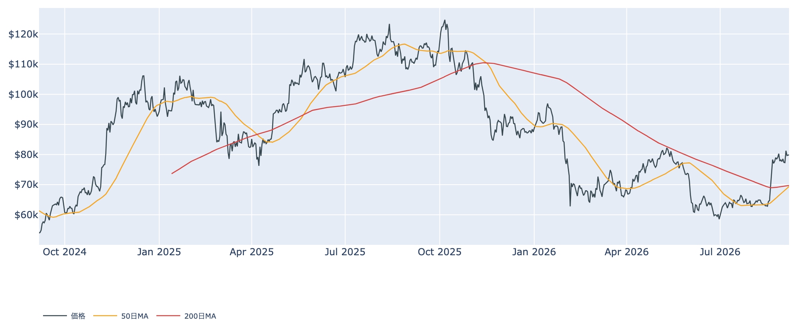
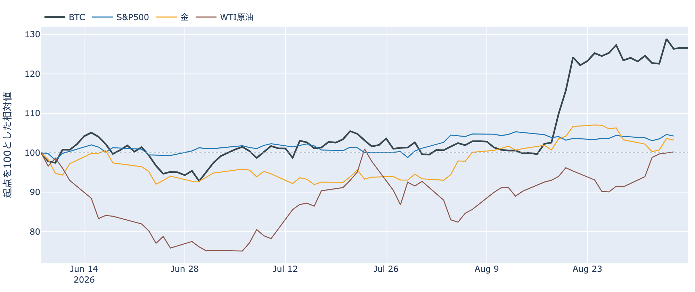
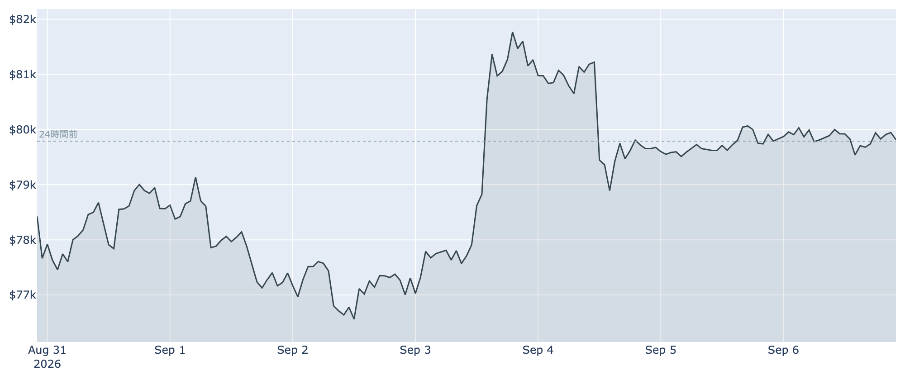
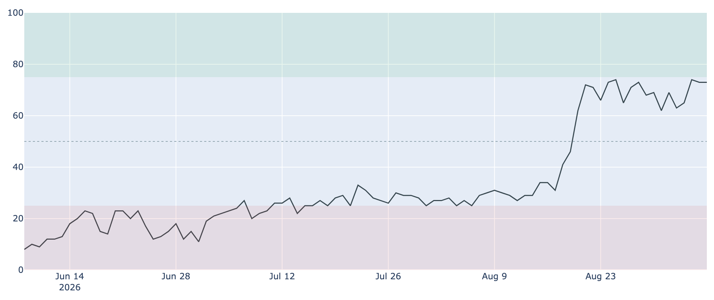
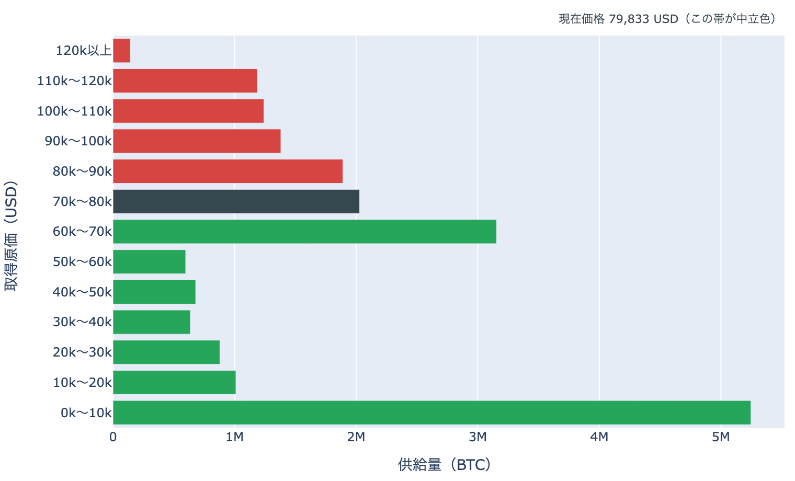
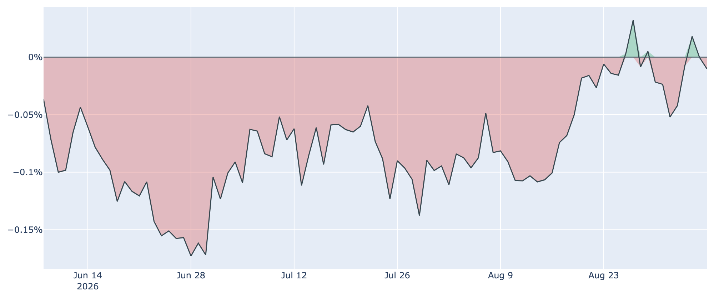
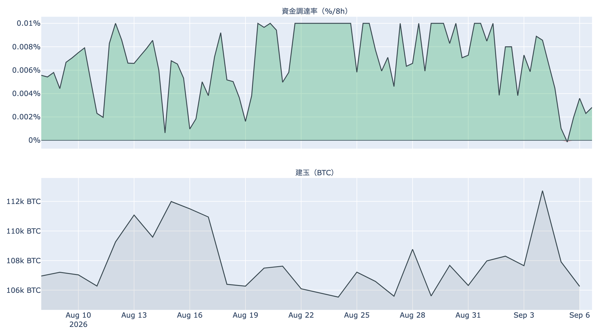

# 長期側で動いた分は原価の約1.4倍 ― $80,000の境界で3日目、外はホルムズ海峡が再燃

**2026年9月7日**

9月7日7時5分（日本時間）時点の実勢価格は約$79,830で、24時間では**+0.06%**。レンジは$79,250〜$80,122と、値幅は1.1%に収まりました。木曜に$82,000台へ抜け、金曜に$80,000を割り戻して以降、週末は境界の200ドル手前で3日目です。1週間では+2.79%、1か月では+23.02%。値動きが止まっている一方で、オンチェーンでは9月5日に**長く動かなかったコインが平均して原価の1.4倍近い水準で動く**という、この2週間で目立つ並びが出ています。

（数値は9月7日7時5分（日本時間）時点までに取得した各種データに基づきます。価格と取引所プレミアムはその時点の実勢、市場心理は9月6日の確定値、オンチェーン指標は9月5日時点、ETF資金フローは9月4日時点、株・金・原油など外部環境の終値は9月4日時点です。なお、オンチェーンの保有・年齢の指標には、ETF・取引所が預かっている分も含まれています。）

## 1. 全体像：値動きは止まり、材料は外へ移った

* **水準**: 9月7日7時5分時点で約$79,830。直近の確定日足終値は9月5日（UTC）の約$79,832です。50日移動平均（約$69,400）も200日移動平均（約$69,800）も1万ドル以上、下にあります。ただし50日線はまだ200日線の下で、並びはデッドクロス圏のまま。**2本の差は約$360（0.5%）**とさらに縮み、いまの水準が続けば数日で入れ替わる位置です。過去2年のレンジでの位置は下から43%ほど。
* **1週間**: レンジは$76,219〜$82,283。9月3日の上抜けと9月4日の反落で振れたあとは、その中央よりやや上で横ばいです。
* **外部環境**: 9月4日の終値は、S&P500が7,718.60（-0.38%）、金が4,476.60ドル（-0.34%）、WTI原油が91.48ドル（+0.20%、5営業日では**+9.69%**）、VIX（＝株式市場の恐怖指数）が14.53、米10年債利回りが4.78%、ドル指数（＝主要通貨に対するドルの強さ）が99.16。銘柄の並びによる地合いの目安は9月3日→9月4日で**リスクオフ寄り**、5営業日では**まちまち**です。
* **エネルギー・地政学**: 原油の1割高の背景には、この48時間の動きがあります。9月5日に米中央軍がオマーン湾でイランのタンカーを攻撃したと発表し、イランは9月6日にホルムズ海峡の外側へ制限区域を設けると表明しました。**海峡をめぐる緊張が再燃した局面**で、エネルギー供給への懸念はリスク資産全体の重しになりうる状況です。

* **BTCとの30日相関**は金**+0.66**／S&P500**+0.14**。株よりも金と並んで動く形が続いています。ただしここにあるのは値動きの並びであって、原因ではありません。
* **効き方の下地**: 1年以上動いていない供給は9月5日時点で**62.9%**（3か月前から+1.6pt、1年前から+2.0pt）。全体の6割強が長く動かないままなので、同じ規模の売り買いでも価格が動きやすい下地は変わっていません。

## 2. データの解説：注目すべき5つのポイント

### ① 3日続けて$80,000の下 ― 値幅1.1%、心理は「強欲」のまま

* **値幅**: この24時間のレンジは$79,250〜$80,122で、高値と安値の差は**1.1%**。前日の0.9%に続き、週末は2日続けて1%前後の狭さでした。高値は$80,000をわずかに上回りましたが、そこで止まっています。
* **清算**: この24時間にHyperliquid（オンチェーンの取引所）で観測できた強制清算は**2件だけ**で、そのうち1件が全体の97%を占めました。向きはすべてショート側、9月6日14時台の$79,000台に集中しています。**市場が焼けたのではなく、大口が1つ飛んだ**という形で、焼けるものがほとんど残っていない静けさです。

* **心理**: Fear & Greed 指数（＝市場心理の指数）は9月6日の確定値で**73**の「強欲」。3日続けて73〜74で動かず、1週間前の69、30日前の29からの高い水準を保っています。2018年以降の分布では上から13%程度の位置です。**値動きが止まっても、心理だけは高いところに留まっている**状態です。

### ② 長期側の「分配」の並びが戻った ― 動いた分は原価の約1.4倍

* **量**: 長期保有層のネットポジション変化（＝長期勢の保有量の増減、過去30日）は9月5日時点で約**-9.4万BTC**。1週間前（8月29日）の約-26.0万BTCから3分の1近くまで細りましたが、9月3日の約-8.4万BTCを底に**2日続けてわずかに広がりました**。30日前は約-4.9万BTCです。**預かり分の混入を差し引いても、この規模と方向は変わりません。**
* **損益**: 長期勢SOPR（＝長期勢の損益）は約**1.382**。前日の0.955から1を大きく上回り、**8月22日以来の高さ**です。9月5日に動いた長期側のコインは、平均して原価の1.4倍近い水準で動いたことになります。1週間前は0.886、30日前は1.026でした。
* **並び**: 「長期側で数えられる供給が減っている」と「動いた分は利益側」が同じ向きに揃った日で、**分配**と呼べる並びです。前日はこの2本が逆を向いていたので、1日で戻った形になります。ただし量そのものは1週間前の3分の1近くまで細っており、**規模の小さい分配**である点は押さえておく必要があります。
* **市場全体**: SOPR（＝動いたコインの損益）は約**1.007**、短期勢SOPR（＝短期勢の損益）は約**1.002**。どちらも1週間前とほぼ同じで、全体としては薄い利確側に留まっています。MVRV Z-Score（＝市場全体の含み益）は約0.90で、4年レンジの下から43%と中庸です。

### ③ 取得原価の分布：帯の上端まで0.2%、1か月で全供給の4分の1を通過

* **帯の中の位置**: 9月5日時点の分布に、いまの価格を重ねると、価格は**$70,000〜$80,000の帯**（約**203万BTC**、全供給の10.1%）の**下端から98%**の位置にあります。**上端$80,000までは+0.2%、下端$70,000までは-12.3%**。
* **動いていないのは分布のほう**: 1日前も1週間前（約$77,665）も同じ帯の中で、**この1週間、価格より上の帯の割合は29.1%から動いていません**。境界に張り付いているのは価格の側で、分布は日々ほとんど動きません。
* **1か月の通過量**: 30日前（約$64,892）は1つ下の$60,000〜$70,000の帯にいました。そこから**上へ1帯移動**し、通過した帯を含む供給は約**518万BTC（全供給の25.8%）**。価格より上にある帯の割合は**39.2%から29.1%へ**減りました。
* **上下に積まれている量**: すぐ上の$80,000〜$90,000が約**189万BTC（9.4%）**で、価格より上ではここが最も厚い帯。その先も$90,000〜$100,000が6.9%、$100,000〜$110,000が6.2%、$110,000〜$120,000が5.9%、$120,000以上が0.7%と続き、上側の合計が29.1%です。すぐ下は$60,000〜$70,000の約**315万BTC（15.7%）**ですが、こちらは12%以上離れています。
* この分布は、それぞれのコインが**最後に動いたときの価格**で束ねたものです。誰が持っているかは分からず、自分のウォレット間の移動や取引所への入出金でも価格は付け替わるため、そのまま「その値段で買った人の量」とは読めません。

### ④ 米国側の買いはマイナス圏に2日 ― ETFは7営業日で10億ドル超

* **価格差**: Coinbase Premium（＝米国とそれ以外の価格差）は9月6日付の最新値（＝9月7日7時5分時点の実勢）で**-0.010%**。マイナス圏は**2日連続**で、9月4日の+0.018%から2日かけて下げてきました。ただし水準そのものは観測できる300営業日の中で**上から4分の1**あたりで、1週間前の-0.022%、30日前の-0.049%、6〜7月の-0.10%前後と比べれば高い側にいます。**勢いは鈍ったが、水準はまだ戻っていない**という位置です。

* **ETF**: 9月4日の米国スポットETFの純流出入は**+174.6M USD**。内訳はIBITが+117.4M、FBTCが+57.2Mで、残りのファンドはゼロでした。前日9月3日の+730.8Mからは大きく減速しています。
* **均し**: 直近7営業日の合計は**+1,027.1M USD**で、週単位では10億ドルを超える流入超。上場来の累計は約+557億ドルです。週末は市場が閉じているため、次の数字は9月8日（月）分から出ます。

### ⑤ 先物：傾きは平均並みに戻り、それでも短期金利への上乗せは消えたまま

* **傾き**: 資金調達率（＝先物の買い持ちが払う金利）は8時間あたり**+0.0065%（年率換算 約+7.2%）**で、プラスは4回連続（約1.3日）。前日にゼロを割り込んだあと買い持ち側が払う形に戻り、30日のレンジ（-0.0002%〜0.0100%）のちょうど平均の水準です。
* **上乗せ分**: ならしの年率から短期金利（13週Tビル 3.76%）を引いた超過は**-0.58pt**。前日の落ち込みからは戻したものの、依然としてマイナス側です。直近34日は平均+3.46pt・プラスだった日が88%を占めるので、**この2日は例外的な位置**にあります。先物の買い持ちに払われる金利が、ただ金を置いておく金利に届いていない状態です。これは置いておくだけの金利に対する上乗せの話であって、確実に取れる利回りではありません。
* **規模**: 建玉（＝先物の未決済残高）は106,071BTC（9月6日UTCで約84.8億ドル）、7日変化は**-1.3%**。価格が1週間で+2.8%上げるあいだ、先物の残高はむしろ減っています。**レバレッジを積み増して上げた形ではない**、というのがこの1週間の姿です。

## 3. 相場転換を見極めるための「3つの分岐点」

1. **$80,000を上へ抜けるか、それとも境界の下で持たせるか**: 上端$80,000までは+0.2%、下端$70,000までは-12.3%。上へ抜ければ、価格より上で最も厚い$80,000〜$90,000の約189万BTC（9.4%）の帯に入ります。下側のもう一段の目安は短期保有者の平均取得単価で、9月5日時点の約**$70,860**（いまの価格はこれを約12.7%上回っています）。移動平均では50日線と200日線の差が約$360（0.5%）まで縮んでおり、**並びが入れ替わるか**も今週の材料です。
2. **現物側の買いが週明けも続くか**: 取引所プレミアムは2日連続でマイナス、ETFは直近7営業日で10億ドル超の流入です。先物の残高は1週間で減り、短期金利への上乗せも消えているので、**上値を試すなら現物側が単独で担う**必要があります。まずは9月8日（月）のETFの数字が最初の答え合わせになります。
3. **外部環境の日程**: 9月11日に米CPI、9月15〜16日にFOMCが控えます。8月の米雇用統計が予想を上回ったことで、9月会合での利上げの織り込みは5〜6割程度まで上がったと報じられています。同じ9月15日には米上院でCLARITY法案（暗号資産の市場構造法案）の討論打ち切り投票が予定されており、前へ進めるには60票が必要です。翌9月17〜18日には日銀の会合。ホルムズ海峡をめぐる応酬は9月5〜6日に一段進み、原油の値動きが**同じ週に並ぶ日程**へどう乗るかが焦点です。

## 総括

9月7日7時5分時点の実勢価格は約$79,830、24時間で+0.06%、値幅は1.1%です。週末は2日続けて$80,000の境界の手前で止まり、値動きからは材料が読み取れない状態でした。中身のデータでは、9月5日に長期側で動いたコインが平均して原価の1.4倍近い水準で動き、量の減少と合わせて**分配と呼べる並び**が1日で戻っています。ただし規模は1週間前の3分の1近くまで細く、市場全体のSOPRは1.007と薄い利確側のまま。現物側では取引所プレミアムが2日続けてマイナスに落ち、ETFは9月4日までの7営業日で10億ドル超の流入。先物は残高が1週間で減り、短期金利への上乗せも消えたままです。**レバレッジではなく現物が支える形のまま、境界の手前で米国の物価・金融政策・暗号資産法案が並ぶ週を待っている**、というのが9月7日時点の姿です。

---

*本稿は情報提供を目的としたものであり、投資助言ではありません。将来の価格動向を保証・示唆するものではなく、投資判断は各自の責任において行ってください。*
