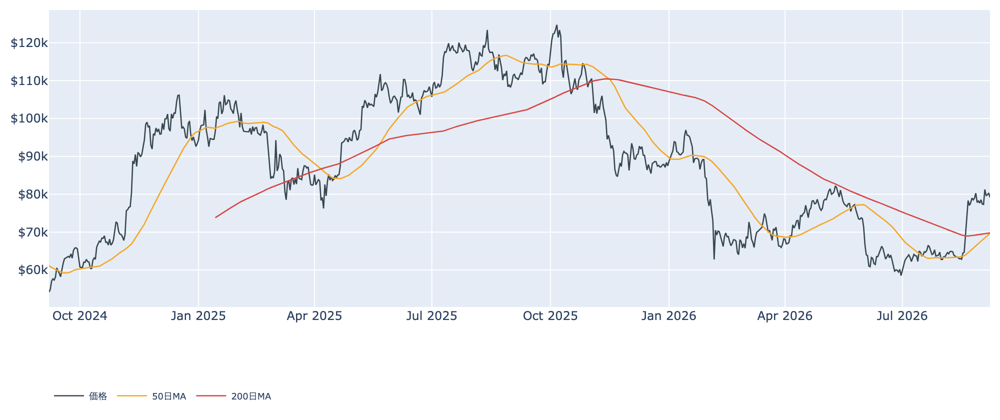
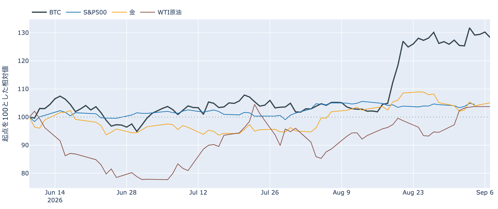
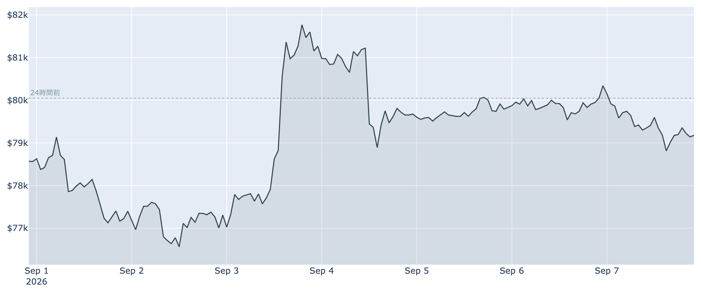
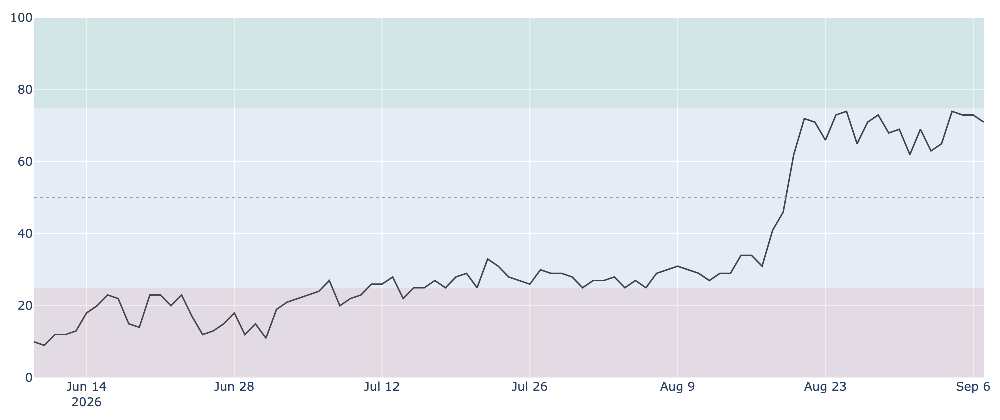
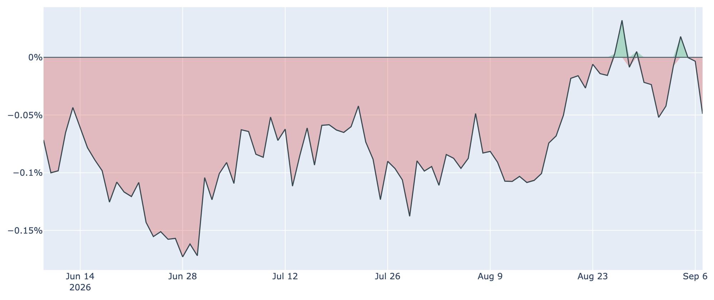
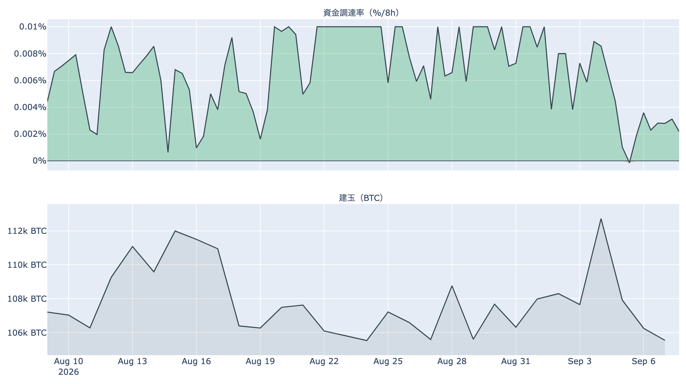
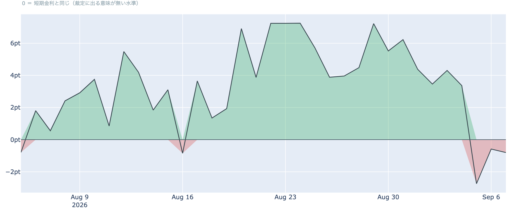
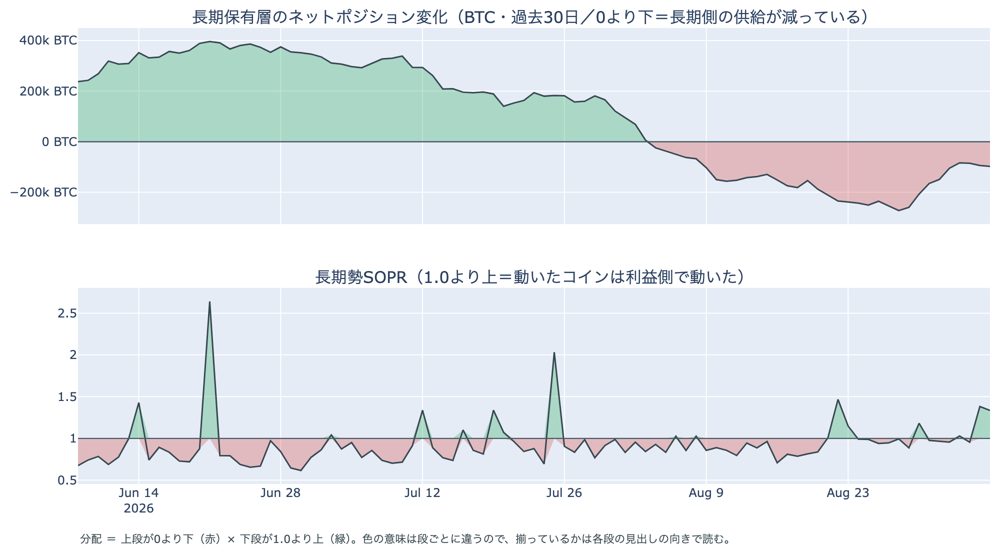
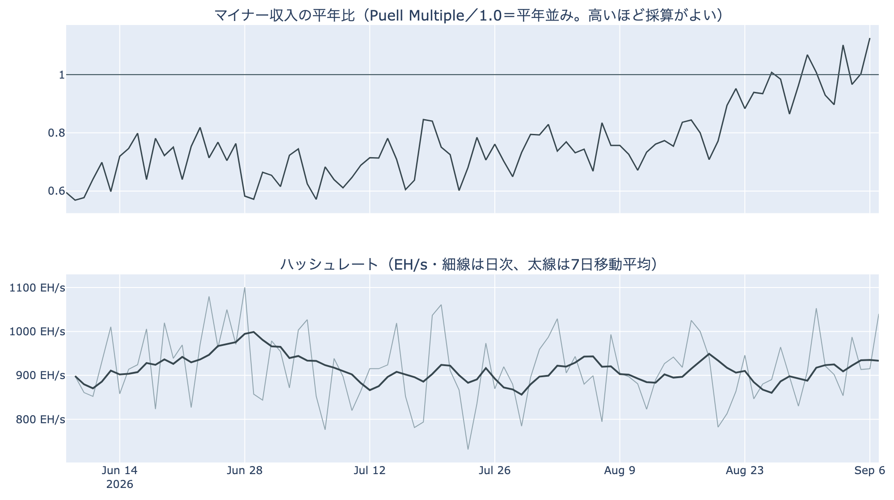

# 終値1本だけ$80,000に乗せて割り戻した ― 米国の買いは1週間で最も弱く、50日線は200日線まで$123

**2026年9月8日**

9月8日7時5分（日本時間）時点の実勢価格は約$79,170で、24時間では**-1.09%**。レンジは$78,666〜$80,564です。9月6日（UTC）の確定日足終値は約$80,339と、9月3日以来はじめて$80,000を上回る終値を付けましたが、翌日には割り戻しました。中身のデータでは、米国側の買いが1週間で最も弱い水準へ落ち、先物側の上乗せは3日続けてマイナス。一方で長期側の「分配」の並びは2日目に入り、50日移動平均は200日移動平均まで$123に迫っています。

（数値は9月8日7時5分（日本時間）時点までに取得した各種データに基づきます。価格と取引所プレミアムはその時点の実勢、市場心理は9月7日の確定値、オンチェーン指標は9月6日時点、ETF資金フローは9月4日時点です。外部環境の終値は金・原油・VIX・ドル円が9月7日、S&P500と米金利が9月4日時点（9月7日は米国がレイバーデーで休場）。なお、オンチェーンの保有・年齢の指標には、ETF・取引所が預かっている分も含まれています。）

## 1. 全体像：境界を一度またいで戻り、材料は外で動いた

* **水準**: 9月8日7時5分時点で約$79,170。9月6日（UTC）の確定終値$80,339からは約1.5%下で、$80,000の境界の下へ戻っています。50日移動平均（約$69,700）と200日移動平均（約$69,800）はどちらも1万ドル近く下。並びはまだデッドクロス圏ですが、**2本の差は約$123（0.2%）**まで縮み（前日は約$360）、いまの水準が続けば数日以内に入れ替わる位置です。過去2年のレンジでの位置は下から43%ほど。
* **1週間**: レンジは$76,219〜$82,283で、7日前比は+0.77%、30日前比は+21.97%。9月3日の上抜けと9月4日の反落のあと、レンジの中央よりやや上で横ばいが続いています。
* **外部環境**: 9月7日は米国市場が休場で、株の終値は9月4日のS&P500 7,718.60（-0.38%）のまま。その間に動いたのは金とボラティリティで、9月7日の金は4,476.60ドル（**+1.06%**）、VIX（＝株式市場の恐怖指数）は15.30（**+5.30%**）。WTI原油は91.48ドルで5営業日では**+6.67%**、ドル指数（＝主要通貨に対するドルの強さ）は99.18、ドル円は154.30（9月4日→7日で-0.87%の円高。巻き戻しが騒がれる1%には届いていません）。米10年債利回りは9月4日時点で4.78%。銘柄の並びによる地合いの目安は9月3日→4日で**リスクオフ寄り**、5営業日では**まちまち**です。
* **エネルギー・地政学**: 9月7日、イランの最高安全保障評議会がホルムズ海峡の外側に「排除区域」を設け、許可のない船舶を止めると表明しました。原油の国際指標ブレントは同日一時$97と約7週間ぶりの高値（前週比+8%）、海峡の通過は1日およそ10隻と5月以来の低さと報じられています。エネルギー供給への懸念が続く局面で、リスク資産全体の重しになりうる状況です。

* **BTCとの30日相関**は金**+0.66**／S&P500**+0.14**で前日から変わらず、株よりも金と並ぶ形のままです。ここにあるのは値動きの並びであって、原因ではありません。
* **効き方の下地**: 1年以上動いていない供給は9月6日時点で**63.0%**（3か月前から+1.7pt、1年前から+2.0pt）。全体の6割強が長く動かないままなので、同じ規模の売り買いでも価格が動きやすい下地は変わっていません。

## 2. データの解説：注目すべき5つのポイント

### ① 終値1本だけ$80,000の上、割り戻す前にショート側が焼けた

* **値幅**: この24時間のレンジは$78,666〜$80,564で、高値と安値の差は**2.4%**。週末2日は1%前後だったので、値幅は倍以上に広がりました。高値$80,564で$80,000の上に出たあと、取得時刻には$79,170まで戻っています。
* **清算**: この24時間にHyperliquid（オンチェーンの取引所）で観測できた強制清算は**65件**。向きは**ショート側が7割**で、**$80,000台に7割が集中**し、時間帯も9月7日8時台に7割が固まっています。ただし最大の1件が全体の63%を占めており、**市場が焼けたのではなく、大口が1つ飛んだ**形です。境界を上へ抜けた時間帯はショート側の清算を伴った、というところまでが言えることです。

* **心理**: Fear & Greed 指数（＝市場心理の指数）は9月7日の確定値で**71**の「強欲」。73〜74で止まっていた3日間からわずかに下げましたが、1週間前の62、30日前の30と比べれば高い位置のままです。**価格が境界を往復しても、心理は動いていません。**

### ② 米国側の買いは1週間で最も弱く、ETFは休場で数字が止まる

* **価格差**: Coinbase Premium（＝米国とそれ以外の価格差）は9月7日付の最新値（＝9月8日7時5分時点の実勢）で**-0.049%**。マイナス圏は**3日連続**で、前日の-0.003%から一段下げ、**9月1日の-0.052%以来の弱さ**です。1週間前の-0.024%の倍、30日前の-0.083%よりは浅い水準で、観測できる300営業日の中ではちょうど中位にあたります。9月4日に+0.018%まで戻していた米国側の買いが、3日で引いた形です。

* **ETF**: 9月4日の米国スポットETFの純流出入は**+174.6M USD**（IBIT +117.4M、FBTC +57.2M、他はゼロ）。直近7営業日の合計は**+1,027.1M USD**で、週単位では10億ドル超の流入超が続いています。9月7日は休場のため数字はここで止まっており、**次に出るのは9月8日（月）分**です。上場来の累計は約+557億ドル。

### ③ 先物：上乗せは3日続けてマイナス、傾きは30日平均を割った

* **傾き**: 資金調達率（＝先物の買い持ちが払う金利）は8時間あたり**+0.0044%（年率換算 約+4.8%）**で、プラスは7回連続（約2.3日）。前日の+0.0065%からは下がり、30日平均の0.0065%を割っています。上限（±0.3%/8h）には遠く、過熱の形ではありません。

* **上乗せ分**: ならしの年率（+2.95%）から短期金利（13週Tビル 3.76%）を引いた超過は**-0.80pt**。前日の-0.58ptからさらに下げ、**マイナスは3日目**です。直近34日の平均は+3.33pt、プラスだった日が85%を占めるので、いまは例外的な位置が続いていることになります。先物の買い持ちに払われる金利が、ただ金を置いておく金利に3日続けて届いていない状態です。これは置いておくだけの金利に対する上乗せの話であって、確実に取れる利回りではありません。
* **規模**: 建玉（＝先物の未決済残高）は107,012BTC（9月7日UTCで約84.8億ドル）で、7日変化は**-0.7%**。境界の往復のあいだも先物の残高は増えておらず、**レバレッジを積み増した動きではない**点は先週から変わっていません。

### ④ 長期側の「分配」の並びは2日目、減少幅は3日続けて広がった

* **量**: 長期保有層のネットポジション変化（＝長期勢の保有量の増減、過去30日）は9月6日時点で約**-9.8万BTC**。9月3日の約-8.4万BTCを底に、**3日続けて減少幅が広がりました**（-8.5万→-9.4万→-9.8万BTC）。1週間前の約-20.7万BTCの半分弱、30日前は約-6.3万BTCです。**預かり分の混入を差し引いても、この規模と方向は変わりません。**
* **損益**: 長期勢SOPR（＝長期勢の損益）は約**1.335**。前日の1.382に続いて**2日続けて1.3を上回り**、9月5〜6日に動いた長期側のコインは平均して原価の1.3〜1.4倍の水準で動きました。1週間前は1.182、30日前は0.856です。
* **並び**: 「長期側で数えられる供給が減っている」と「動いた分は利益側」が2日続けて同じ向きに揃っており、**分配**と呼べる並びです。ただし量は1週間前の半分弱で、**規模の小さい分配が続いている**という読みが正確です。
* **市場全体**: SOPR（＝動いたコインの損益）は約**1.006**、短期勢SOPR（＝短期勢の損益）は約**1.003**で、どちらも薄い利確側。MVRV Z-Score（＝市場全体の含み益）は約0.91と、1週間前の0.83、30日前の0.41から上がり続けていますが、4年レンジの位置は下から43%と中庸です。

上段が0より下、下段が1.0より上に出た期間が「分配」と呼べる並びです。7月末に上段が0を割ってから、その状態が続いています。

### ⑤ マイナー：収入は平年比を上回り、設備はほぼ横ばい

* **収入**: Puell Multiple（＝マイナー収入の平年比）は9月6日時点で約**1.13**。30日前の0.83から価格の上昇に沿って戻し、8月末の1前後から一段上がりました。
* **設備**: ハッシュレートは7日移動平均で約**933 EH/s**、30日前（約921 EH/s）と比べて**+1.4%**とほぼ横ばいです。日次の推定値は前後10%ほど振れる（直近90日で731〜1,100 EH/s）ので、水準も変化率も7日平均で見ています。次回の難易度調整は**+2.0%前後**の見込みで、直近の採掘ペースはやや速まっています。**採算は改善していますが、設備が目立って戻ったとまでは言えません。** マイナー側からの売り圧が強まる局面ではない、という読みは変わりません。推奨手数料は1〜2 sat/vBと閑散のまま。

## 3. 相場転換を見極めるための「3つの分岐点」

1. **$80,000の上で終値を重ねられるか**: 9月6日（UTC）に1本だけ上に出た終値は、翌日には割り戻しました。9月6日時点の取得原価の分布で見ると、すぐ上の$80,000〜$90,000にはおよそ197万BTC（全供給の9.8%）、いまいる$70,000〜$80,000にもほぼ同じ約196万BTC（9.8%）が積まれています。下側の目安は短期保有者の平均取得単価で、9月6日時点の約**$70,900**（いまの価格はこれを約11.6%上回っています）。移動平均では50日線と200日線の差が約$123まで縮んでおり、**今週のうちに並びが入れ替わるか**も材料です。
2. **現物側の買いが戻るか**: 取引所プレミアムは3日連続のマイナスで1週間で最も弱く、先物の上乗せも3日続けてマイナス。**レバレッジも米国側の現物も勢いを落としたなかで、ETFが10億ドル超の週間流入を保てるか**が焦点で、休場明けの9月8日（月）分が最初の答え合わせになります。
3. **外部環境の日程**: 9月11日に米CPI、9月15〜16日にFOMCが控え、9月会合での利上げの織り込みは5〜6割程度と報じられています。同じ9月15日には米上院でCLARITY法案（暗号資産の市場構造法案）の討論打ち切り投票が予定されており、前へ進めるには60票が必要です。9月17〜18日は日銀の会合。ホルムズ海峡では9月7日にイランが排除区域の設定を表明し、ブレントが一時$97を付けました。**原油と米国の物価・金融政策が同じ週に並ぶ**日程です。

## 総括

9月8日7時5分時点の実勢価格は約$79,170、24時間で-1.09%。9月6日（UTC）に終値1本だけ$80,000の上に出ましたが、翌日には割り戻し、上に抜けた時間帯はショート側の清算を伴いました。中身のデータでは、米国側の買いが3日で引いて1週間で最も弱い水準へ落ち、先物の上乗せは3日続けてマイナス。長期側では減少幅が3日続けて広がり、動いた分は2日続けて原価の1.3倍超で、**規模の小さい分配が続いています**。一方でETFは9月4日までの7営業日で10億ドル超の流入、マイナーの収入は平年比を上回り、50日線は200日線まで$123。**境界を一度またいで戻したところで、外では原油と物価・金融政策の日程が重なる週に入った**、というのが9月8日時点の姿です。

---

*本稿は情報提供を目的としたものであり、投資助言ではありません。将来の価格動向を保証・示唆するものではなく、投資判断は各自の責任において行ってください。*
