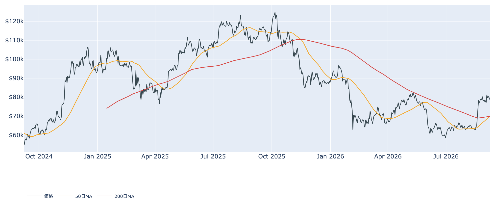
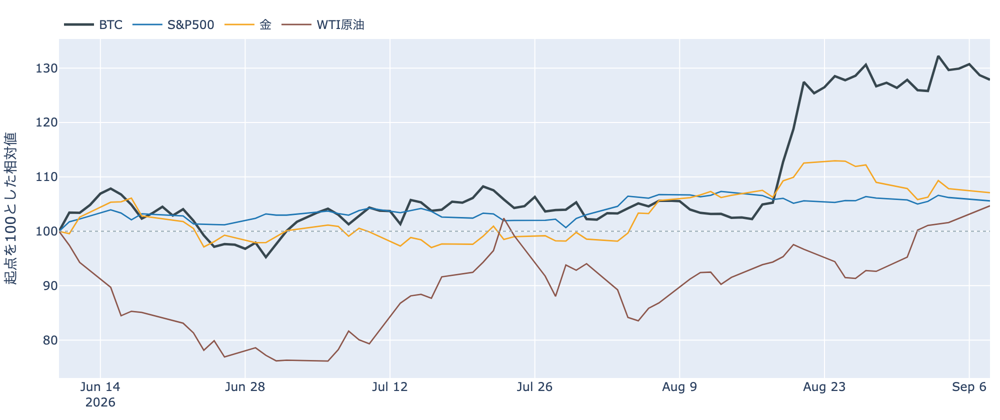
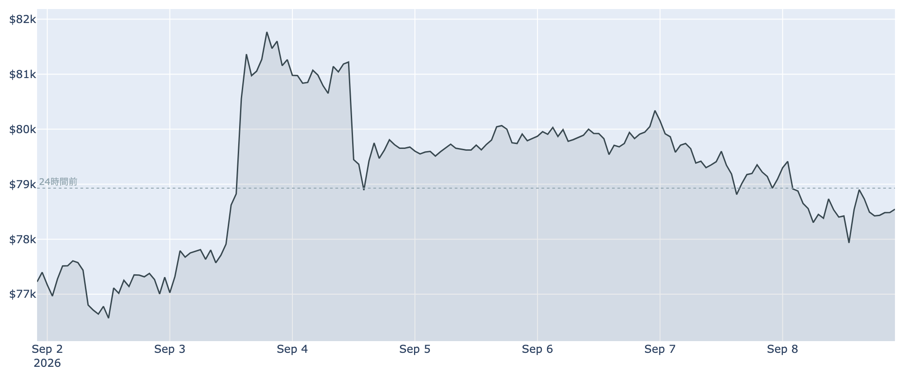
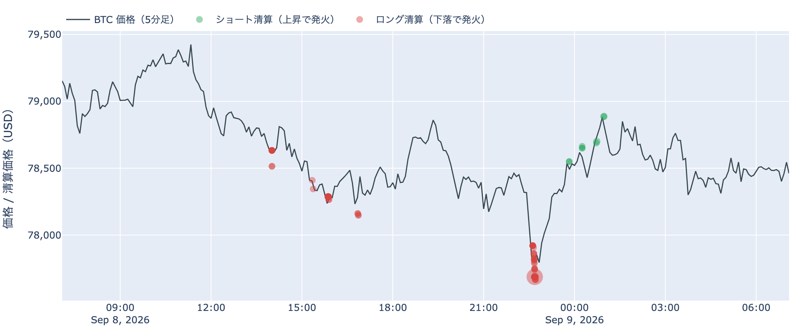
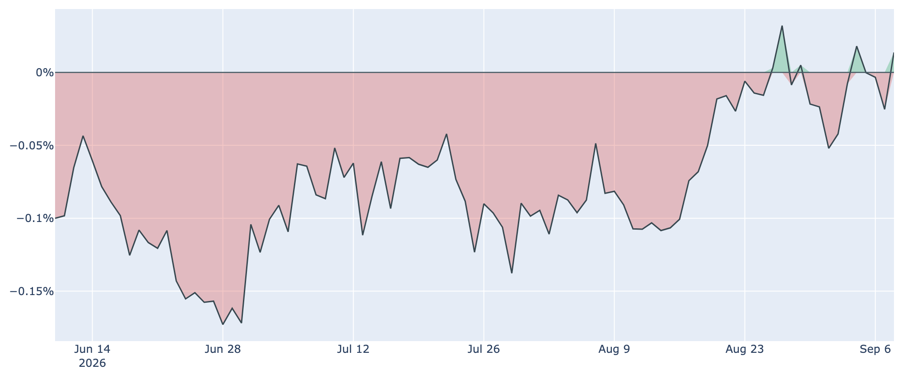
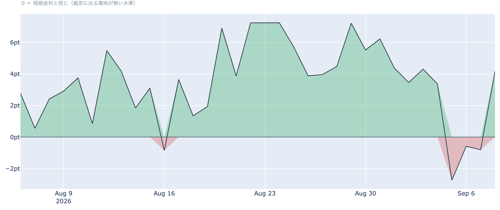
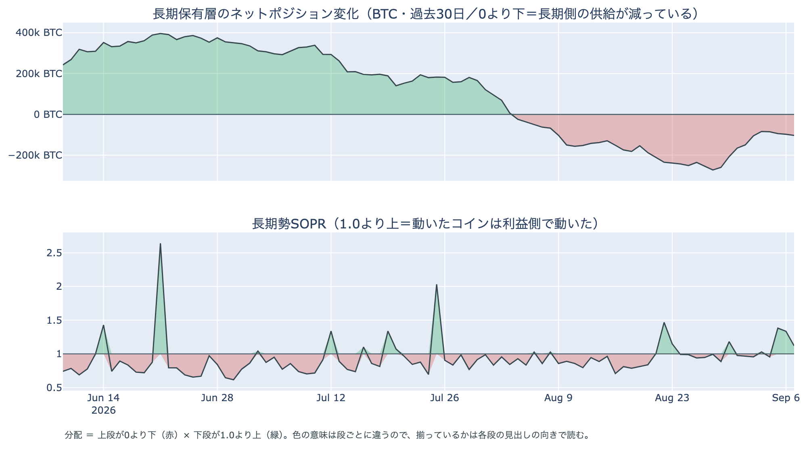
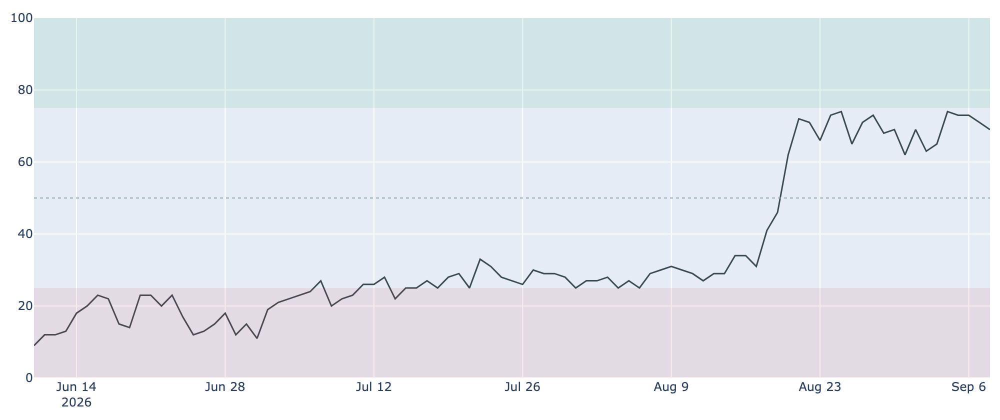

# 50日線が200日線を上へ抜けた ― 米国の買いは4日ぶりプラス、先物の上乗せも短期金利の上へ

**2026年9月9日**

9月9日7時5分（日本時間）時点の実勢価格は約$78,576で、24時間では**-0.46%**。レンジは$77,589〜$79,477です。価格そのものは4営業日じりじりと切り下げていますが、この日のデータで**50日移動平均が200日移動平均を上へ抜けました**（差は約$91）。中身のデータでは、米国側の買いが4日ぶりにプラス圏へ戻り、先物の上乗せも4日ぶりに短期金利を上回りました。長期側の「分配」の並びは3日目に入っています。

（数値は9月9日7時5分（日本時間）時点までに取得した各種データに基づきます。価格と取引所プレミアムはその時点の実勢、市場心理は9月8日の確定値、オンチェーン指標は9月7日時点、ETF資金フローは9月4日時点です。外部環境の終値は金・原油・株・金利・ドル円とも9月8日時点。なお、オンチェーンの保有・年齢の指標には、ETF・取引所が預かっている分も含まれています。）

## 1. 全体像：遅行指標の並びが入れ替わった日に、原油と円が動いた

* **水準**: 9月9日7時5分時点で約$78,576。9月7日（UTC）の確定日足終値$79,092からは約0.7%下です。50日移動平均は約$69,959、200日移動平均は約$69,868で、**50日線が200日線を$91（0.1%）上回りゴールデンクロス圏に入りました**（前日は$123下）。ただし移動平均は過去の値に基づく遅行指標で、価格はすでに50日線を**約12%**上回る位置にあります。過去2年のレンジでの位置は下から42%ほど。
* **1週間**: レンジは$76,219〜$82,283で、7日前比は**+1.52%**、30日前比は**+21.17%**。9月3日の$81,000台を高値に、そこから4営業日は$78,000〜$80,000台での切り下げが続いています。
* **外部環境**: 9月8日の終値で、WTI原油は94.25ドル（**+3.03%**、5営業日では**+9.90%**）、金は4,400.00ドル（-0.67%）、S&P500は7,673.52（-0.58%）、VIX（＝株式市場の恐怖指数）は15.72（+2.75%）、ドル指数（＝主要通貨に対するドルの強さ）は98.84（-0.32%）、米10年債利回りは4.81%。銘柄の並びによる地合いの目安は9月4日→8日で**まちまち**、5営業日でも**まちまち**です。
* **エネルギー・地政学**: 9月8日、イランと連携するフーシ派がサウジアラビアのエネルギー施設を複数攻撃したと報じられ、国際指標ブレントは一時**$98**と7週間ぶりの高値を付けました。週末には米軍がホルムズ海峡でイラン関連のタンカーを攻撃しており、イランはオマーンとの海峡管理の合意が近いとも表明しています。海峡の通過量は日量700万バレル規模と伝えられ供給自体は続いていますが、**原油高が続く局面はリスク資産全体の重しになりうる**状況です。
* **円**: ドル円は153.83で、9月7日→8日は**-1.52%の円高**。7か月ぶりの円高水準で、9月17〜18日の日銀会合での利上げは市場の織り込みで9割超と報じられています。同じ日に株もBTCも下げているため、**低金利の円で調達した資金の巻き戻しが警戒される場面**です。ただし為替が動く理由は他にもあり、これだけで断定はできません。

* **BTCとの30日相関**は金**+0.68**／S&P500**+0.16**。株よりも金と並ぶ形が続いています。ここにあるのは値動きの並びであって、原因ではありません。

## 2. データの解説：注目すべき5つのポイント

### ① 24時間は0.5%弱の下げ、$77,000台への押しはロング側の清算を伴った

* **値幅**: この24時間のレンジは$77,589〜$79,477で、高値と安値の差は**2.4%**。前日と同じ幅で、$80,000には一度も触れていません。
* **清算**: この24時間にHyperliquid（オンチェーンの取引所）で観測できた強制清算は**129件**。向きは**ロング側が9割超**で、**$77,000台に8割**、時間帯も**9月8日22時台（日本時間）に8割**が固まっています。ただし最大の1件が全体の**55%**を占めており、**市場が焼けたのではなく、大口が1つ飛んだ**形です。安値を付けた時間帯はロング側の清算を伴った、というところまでが言えることです。

### ② 米国側の買いが4日ぶりにプラス圏へ戻った

* **価格差**: Coinbase Premium（＝米国とそれ以外の価格差）は9月8日付の最新値（＝9月9日7時5分時点の実勢）で**+0.014%**。3日続いたマイナスから反転し、**プラスは9月4日以来**です。1週間前は-0.052%、30日前は-0.083%で、観測できる300営業日の中では**上位13%**にあたる高さ。米国側の買いが引いた3日間が、いったん止まった形です。

* **ETF**: 米国スポットETFの純流出入は**9月4日の+174.6M USD**（IBIT +117.4M、FBTC +57.2M、他はゼロ）で止まったままです。直近7営業日の合計は**+1,027.1M USD**、上場来の累計は約+557億ドル。9月3日の+730.8Mを含む週単位では10億ドル規模の流入超が続いており、**次の数字が出れば、現物側の需要が続いているかの答え合わせになります**。

### ③ 先物：上乗せが4日ぶりに短期金利の上へ戻った

* **上乗せ分**: 9月8日を通してならした資金調達率の年率（+7.94%）から短期金利（13週Tビル 3.78%）を引いた超過は**+4.16pt**。前日の-0.80ptからプラスへ戻り、**3日続いたマイナスが終わりました**。直近34日の平均は+3.50pt、プラスだった日が88%なので、いまはむしろ平常の側に戻った位置です。これは置いておくだけの金利に対する上乗せの話であって、確実に取れる利回りではありません。
* **傾き**: 資金調達率（＝先物の買い持ちが払う金利）は直近の8時間分では**+0.0024%（年率換算 約+2.7%）**まで下がっていますが、プラスは**10回連続**（8時間ごと＝約3.3日）。30日平均の+0.0066%は下回っており、上限（±0.3%/8h）には遠く、過熱の形ではありません。
* **規模**: 建玉（＝先物の未決済残高）は106,617BTC（9月8日UTCで約84.5億ドル）で、7日変化は**-1.0%**。上乗せがプラスへ戻ったこの日も残高は増えておらず、**レバレッジを積み増した動きではない**点は先週から変わっていません。

### ④ 長期側の「分配」の並びは3日目、減少幅は4日続けて広がった

* **量**: 長期保有層のネットポジション変化（＝長期勢の保有量の増減、過去30日）は9月7日時点で約**-10.3万BTC**。9月3日の約-8.4万BTCを底に、**4日続けて減少幅が広がりました**。1週間前は約-16.5万BTC、30日前は約-6.7万BTCです。**預かり分の混入を差し引いても、この規模と方向は変わりません。**
* **損益**: 長期勢SOPR（＝長期勢の損益）は約**1.121**で、**3日続けて1を上回りました**。9月7日に動いた長期側のコインは平均して原価の約1.1倍の水準で動いており、前日の1.335からは利幅が薄くなっています。1週間前は0.977、30日前は1.027。
* **並び**: 「長期側で数えられる供給が減っている」と「動いた分は利益側」が3日続けて同じ向きに揃っており、**分配**と呼べる並びです。ただし減少幅は1週間前の6割強で、**規模の小さい分配が続いている**という読みは変わりません。

上段が0より下、下段が1.0より上に出た期間が「分配」と呼べる並びです。量は減り、動いた分は利益側、という向きが7月末から続いています。

### ⑤ 心理は4日で5pt後退、市場全体の損益はほぼ横ばい

* **心理**: Fear & Greed 指数（＝市場心理の指数）は9月8日の確定値で**69**の「強欲」。9月4日の74から**4日で5pt**下げました。1週間前も69、30日前は31なので、月単位では高い位置のままですが、**上抜けを試した週の勢いは心理の側から先に引いています**。
* **損益**: SOPR（＝動いたコインの損益）は約**1.001**、短期勢SOPR（＝短期勢の損益）は約**1.000**で、動いたコインはほぼ損益ゼロの水準です。MVRV Z-Score（＝市場全体の含み益）は約**0.87**で、前日の0.91からわずかに下げ、4年レンジでの位置は下から4割ほど。**買い戻しでも投げでもない、静かな水準**が続いています。

## 3. 相場転換を見極めるための「3つの分岐点」

1. **$80,000の境界と、入れ替わった移動平均が定着するか**: 9月7日時点の取得原価の分布で見ると、いまいる$70,000〜$80,000にはおよそ203万BTC（全供給の10.1%）、すぐ上の$80,000〜$90,000に約191万BTC（9.5%）、さらにその上の$90,000〜$100,000にも約138万BTC（6.9%）が積まれています。下側の目安は短期保有者の平均取得単価で、9月7日時点の約**$70,948**（いまの価格はこれを約10.8%上回っています）。**50日線と200日線の並びは入れ替わりましたが、差はまだ$91**で、価格が数日下げれば戻りうる幅です。
2. **現物と先物の買いが2日目に入るか**: 米国側のプレミアムも先物の上乗せも、プラスへ戻ってまだ1日です。**どちらも1日で終わるのか、続くのか**が今週の焦点で、9月4日で止まっているETFの数字が最初の材料になります。
3. **外部環境の日程**: 9月11日に米CPI、9月15〜16日にFOMCが控え、9月会合での利上げの織り込みは6割半ばと報じられています。同じ**9月15日には米上院でCLARITY法案（暗号資産の市場構造法案）の討論打ち切り投票**があり、前へ進めるには60票が必要です。9月17〜18日は日銀の会合で、利上げの織り込みは9割超。**米国の物価・金融政策と日本の利上げが同じ週に並び、そこへ中東発の原油高が重なる**日程です。

## 総括

9月9日7時5分時点の実勢価格は約$78,576、24時間で-0.46%。$77,000台への押しはロング側の清算を伴いましたが、その大半は1つの口座によるものでした。この日のデータで**50日線が200日線を上へ抜け、遅行指標の並びが入れ替わっています**。中身では、米国側の買いが4日ぶりにプラス圏へ戻り、先物の上乗せも4日ぶりに短期金利を上回りました。一方で建玉は増えず、心理は4日で5pt後退し、長期側では減少幅が4日続けて広がって「分配」の並びが3日目に入っています。**買い直しの兆しと、細く続く分配とが同じ週に並んだところへ、物価・金融政策・原油の日程が重なる**、というのが9月9日時点の姿です。

---

*本稿は情報提供を目的としたものであり、投資助言ではありません。将来の価格動向を保証・示唆するものではなく、投資判断は各自の責任において行ってください。*
