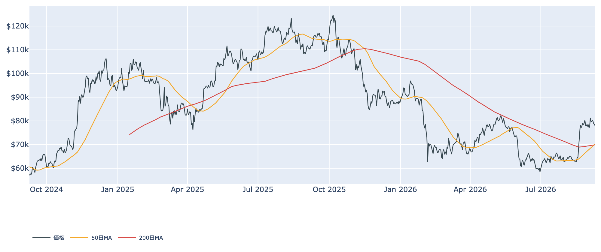
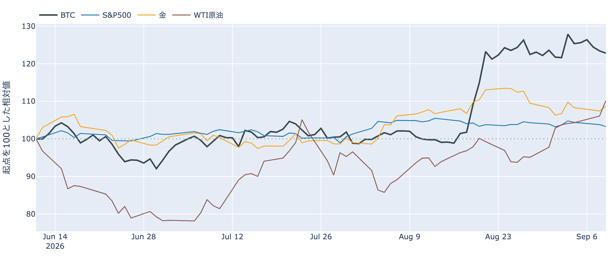
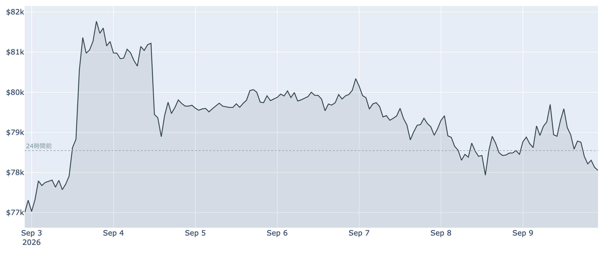
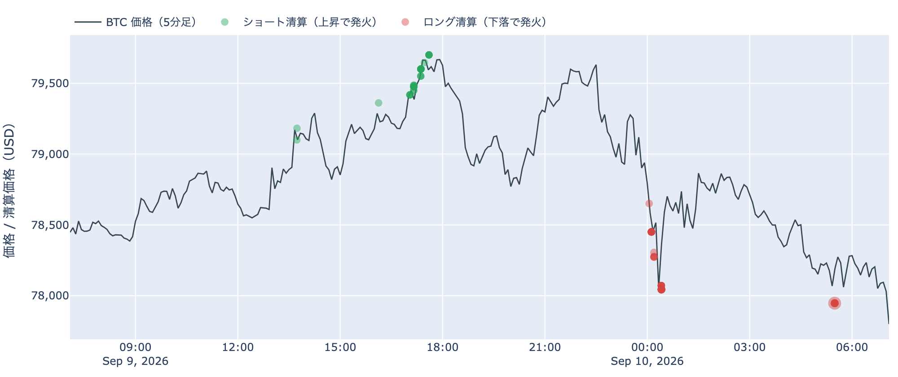
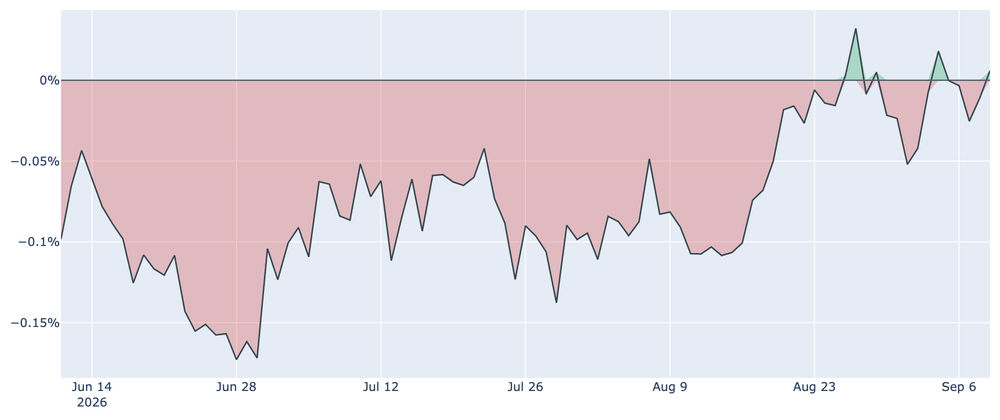
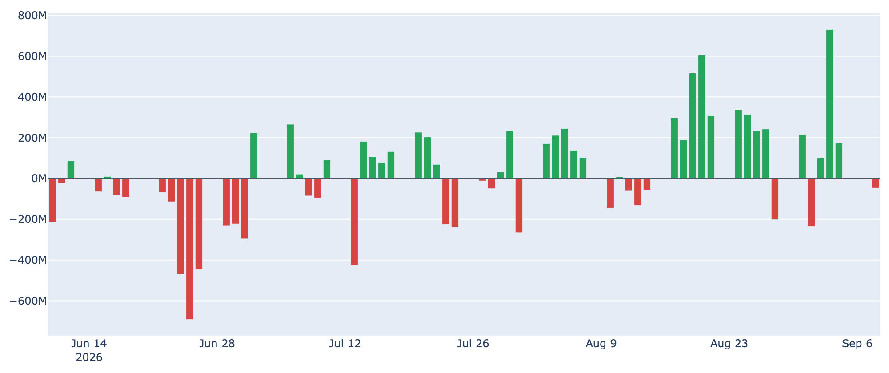
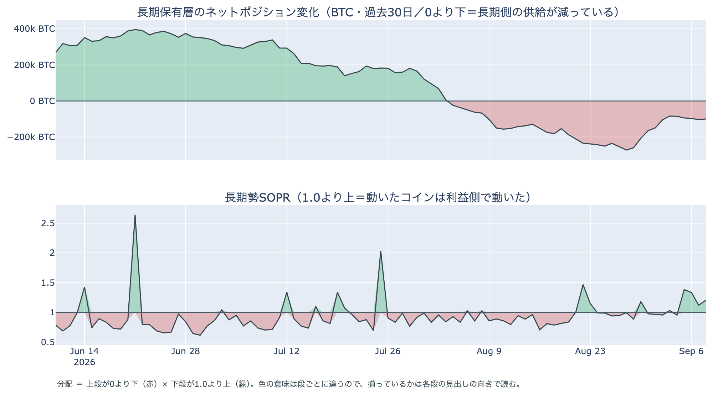
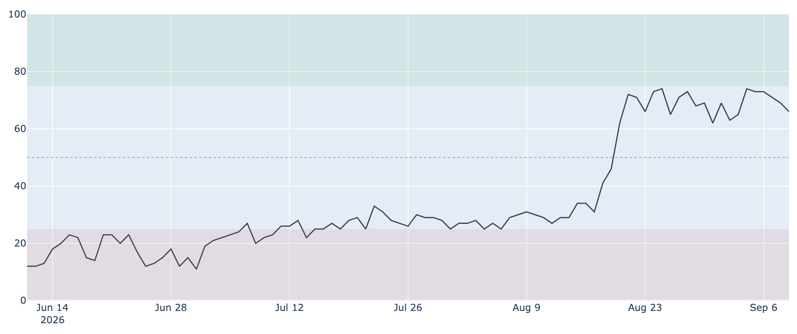

# ブレント原油が$100に乗せた日、BTCは値幅2.4%の小動き ― 長期側の減少幅は5日ぶりに縮み、心理は5日続けて後退

**2026年9月10日**

9月10日7時5分（日本時間）時点の実勢価格は約$78,062で、24時間では**-0.63%**。レンジは$77,916〜$79,753です。中東で新しい攻撃が続き原油が7週間ぶりの高値を付けた日に、BTCは$78,000台で足踏みしました。中身のデータでは、4日続けて広がっていた長期側の減少幅がいったん縮み、心理は5日続けて後退。先物の上乗せは2日続けて短期金利の上にあり、建玉は増えていません。

（数値は9月10日7時5分（日本時間）時点までに取得した各種データに基づきます。価格と取引所プレミアムはその時点の実勢、市場心理は9月9日の確定値、オンチェーン指標は9月8日時点、ETF資金フローは9月8日時点です。外部環境の終値は金・原油・株・金利・ドル円とも9月9日時点。なお、オンチェーンの保有・年齢の指標には、ETF・取引所が預かっている分も含まれています。）

## 1. 全体像：原油と金が上がり株が下げた日に、BTCは$78,000台で横ばい

* **水準**: 9月10日7時5分時点で約$78,062。9月8日（UTC）の確定日足終値$78,447からは約0.5%下です。50日移動平均は約$70,187、200日移動平均は約$69,918で、**50日線が200日線を上回って2日目**（差は約$269と、前日の$91から開きました）。価格は50日線を約11%上回る位置にあり、過去2年のレンジでの位置は下から40%ほど。
* **1週間**: レンジは$76,929〜$82,283で、7日前比は**+0.98%**、30日前比は**+22.14%**。9月3日の$81,000台を高値に、$78,000〜$80,000台での足踏みが1週間続いています。
* **外部環境**: 9月9日の終値で、WTI原油は96.67ドル（**+3.91%**、5営業日では**+7.15%**）、金は4,447.20ドル（**+1.21%**）、S&P500は7,636.36（**-0.48%**、3日続落）、VIX（＝株式市場の恐怖指数）は16.46（+4.71%）、ドル指数（＝主要通貨に対するドルの強さ）は98.77（-0.07%）、米10年債利回りは4.84%。銘柄の並びによる地合いの目安は9月8日→9日で**リスクオフ寄り**、5営業日では**まちまち**です。
* **エネルギー・地政学**: 米軍がイランのタンカーを追加で攻撃し、イランと連携するフーシ派によるサウジアラビアの石油施設への攻撃も続いていると報じられ、国際指標のブレント原油は**7月以来はじめて$100を上回りました**。ホルムズ海峡の通航は事実上止まり、サウジは紅海側の港へ原油を迂回させていると伝えられています。**原油高が続く局面はリスク資産全体の重しになりうる**状況で、株は3日続けて下げました。
* **BTCとの30日相関**は金**+0.67**／S&P500**+0.18**。株・原油・金がそれぞれ動いた9月9日に、BTCは1%未満の下げで、株よりも金と並ぶ形が続いています。ここにあるのは値動きの並びであって、原因ではありません。

## 2. データの解説：注目すべき5つのポイント

### ① 値幅2.4%の小動き、早朝5時台の押しはロング側の清算を伴った

* **値幅**: この24時間のレンジは$77,916〜$79,753で、高値と安値の差は**2.4%**。3日続けてほぼ同じ幅で、$80,000には触れていません。
* **清算**: この24時間にHyperliquid（オンチェーンの取引所）で観測できた強制清算は**144件**。向きは**ロング側が約8割**で、価格帯は**$77,000台に6割**、時間帯は**9月10日5時台（日本時間）に6割**が集まっています。最大の1件は全体の44%で、前日のような「大口が1つ飛んだ」形ではなく、安値を付けた時間帯にロング側の清算が固まった、というところまでが言えることです。

### ② 米国側の買いはプラス圏ぎりぎり、ETFは4営業日ぶりの流出

* **価格差**: Coinbase Premium（＝米国とそれ以外の価格差）は9月9日付の最新値（＝9月10日7時5分時点の実勢）で**+0.006%**。前日9月8日は確定値で-0.011%と小幅なマイナスに終わっており、**プラスとマイナスの境目を行き来しています**。1週間前は-0.042%、30日前は-0.091%で、観測できる300営業日の中では上位16%の高さ。米国側が売り込んではいないが、押し上げてもいない水準です。

* **ETF**: 米国スポットETFの純流出入は**9月8日に-46.6M USD**で、9月1日以来4営業日ぶりの流出超です。GBTC（-65.5M）とFBTC（-17.1M）の解約を、BITB（+14.5M）・IBIT（+10.7M）・ARKB（+8.1M）の流入が打ち消しきれませんでした。ただし直近7営業日の合計は**+738.2M USD**で、9月3日の+730.8Mを含む週単位の流入超は残っています。**単日の小さな流出であって、流れが変わったと言える規模ではありません。**

### ③ 先物：上乗せは2日続けて短期金利の上、建玉は増えない

* **傾き**: 資金調達率（＝先物の買い持ちが払う金利）は直近の8時間分で**+0.0049%（年率換算 約+5.4%）**。プラスは**13回連続**（8時間ごと＝約4.3日）で、30日平均の+0.0067%は下回っています。上限（±0.3%/8h）には遠く、過熱の形ではありません。
* **上乗せ分**: 9月9日を通してならした資金調達率の年率（+6.83%）から短期金利（13週Tビル 3.80%）を引いた超過は**+3.02pt**。前日の+4.16ptから縮みましたが、**2日続けてプラス**です。直近34日の平均は+3.59pt、プラスだった日が88%なので、平常の範囲に戻った位置。これは置いておくだけの金利に対する上乗せの話であって、確実に取れる利回りではありません。
* **規模**: 建玉（＝先物の未決済残高）は105,216BTC（9月9日UTCで約83.6億ドル）で、7日変化は**-1.5%**。上乗せがプラスに戻っても残高は減っており、**レバレッジを積み増した動きではない**点は変わりません。

### ④ 長期側の減少幅は5日ぶりに縮み、「分配」の並びは4日目

* **量**: 長期保有層のネットポジション変化（＝長期勢の保有量の増減、過去30日）は9月8日時点で約**-10.0万BTC**。9月4日から4日続けて広がっていた減少幅が、9月7日の約-10.3万BTCから**わずかに縮みました**（縮んだのは9月3日以来）。1週間前は約-14.9万BTC、30日前は約-10.2万BTCです。**預かり分の混入を差し引いても、この規模と方向は変わりません。**
* **損益**: 長期勢SOPR（＝長期勢の損益）は約**1.205**で、**4日続けて1を上回りました**。9月8日に動いた長期側のコインは平均して原価の約1.2倍の水準で動いており、前日の1.121より利幅は厚くなっています。1週間前は0.965、30日前は0.857。
* **並び**: 「長期側で数えられる供給が減っている」と「動いた分は利益側」が4日続けて同じ向きに揃っており、**分配**と呼べる並びです。ただし減少幅は8月末のピーク（約-27万BTC）の4割弱で、**規模の小さい分配が、広がるでもなく止まるでもなく続いている**というのが9月8日時点の姿です。

上段が0より下、下段が1.0より上に出た期間が「分配」と呼べる並びです。量は減り、動いた分は利益側、という向きが続いています。

### ⑤ 心理は5日続けて後退、動いたコインの損益はほぼゼロ

* **心理**: Fear & Greed 指数（＝市場心理の指数）は9月9日の確定値で**66**の「強欲」。9月4日の74から**5日続けて下げ、合計8pt**の後退です。1週間前は63、30日前は30なので月単位では高い位置のままですが、価格が$78,000〜$80,000台で足踏みするあいだに、**心理の側が先に冷めています**。
* **損益**: SOPR（＝動いたコインの損益）は約**1.003**、短期勢SOPR（＝短期勢の損益）は約**1.002**で、動いたコインはほぼ損益ゼロの水準。MVRV Z-Score（＝市場全体の含み益）は約**0.85**で、前日の0.87からわずかに下げ、4年レンジでの位置は下から4割ほど。**買い戻しでも投げでもない静かな水準**が続いています。

## 3. 相場転換を見極めるための「3つの分岐点」

1. **$80,000の境界と、短期勢の原価$71,000**: 9月8日時点の取得原価の分布で見ると、いまいる$70,000〜$80,000にはおよそ206万BTC（全供給の10.3%）、すぐ上の$80,000〜$90,000に約190万BTC（9.5%）、さらに上の$90,000〜$100,000にも約138万BTC（6.9%）が最後に動いた供給として積まれています。上端の$80,000までは+2.5%。下側の目安は短期保有者の平均取得単価で、9月8日時点の約**$70,995**（いまの価格はこれを約10%上回っています）。**50日線と200日線の差は$269まで開きましたが**、まだ数日の下げで戻りうる幅です。
2. **需要側の数字が1日で終わるか**: 米国側のプレミアムはプラス圏ぎりぎり、ETFは4営業日ぶりの小さな流出、先物の上乗せはプラス2日目。**どれも「流れが変わった」と言える規模ではなく、次の数字で続くかどうかが決まる**段階です。ETFは9月9日分が次の材料になります。
3. **外部環境の日程**: 明日9月11日に米CPI（8月分。市場予想は前年比3.4%）、9月15〜16日にFOMCが控え、9月会合での利上げの織り込みは6割前後と報じられています。**9月15日には米上院でCLARITY法案（暗号資産の市場構造法案）の討論打ち切り投票**があり、前へ進めるには60票が必要です。9月17〜18日は日銀の会合。そこへ**ブレント$100を超えた原油と、続く中東の攻撃**が重なる日程です。

## 総括

9月10日7時5分時点の実勢価格は約$78,062、24時間で-0.63%。ブレント原油が7月以来の$100を超え、金が上がり株が3日続落した日に、BTCは値幅2.4%の小動きでした。中身では、長期側の減少幅が5日ぶりに縮んだものの「分配」の並びは4日目に入り、心理は5日続けて後退。米国側の買いはプラス圏ぎりぎりで、ETFは4営業日ぶりに小さく流出し、先物の上乗せは2日続けて短期金利の上にありますが建玉は減っています。**値動きも需給も小さな動きに留まったところへ、明日の物価指標と来週の金融政策・法案の日程が近づいている**、というのが9月10日時点の姿です。

---

*本稿は情報提供を目的としたものであり、投資助言ではありません。将来の価格動向を保証・示唆するものではなく、投資判断は各自の責任において行ってください。*
