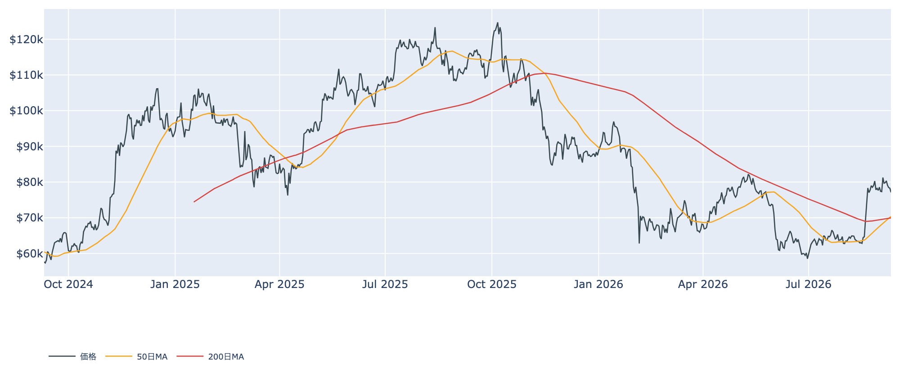
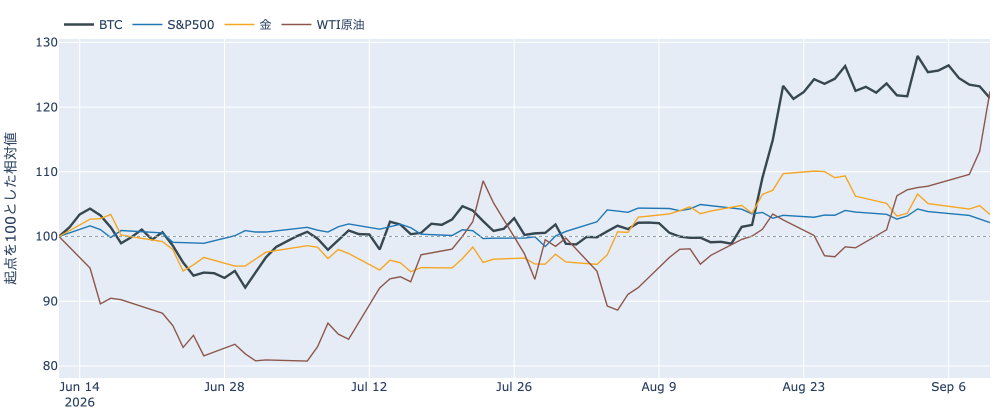
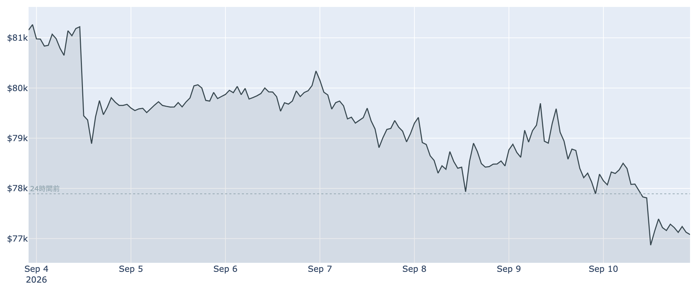
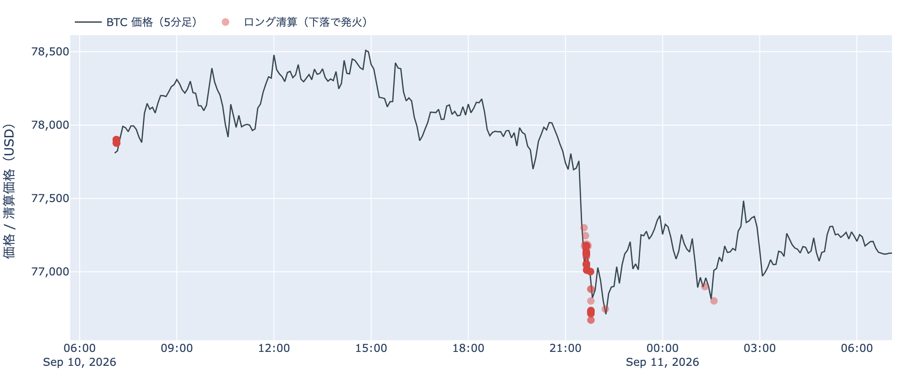
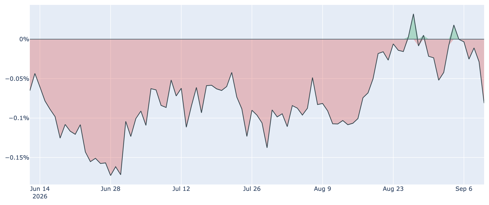
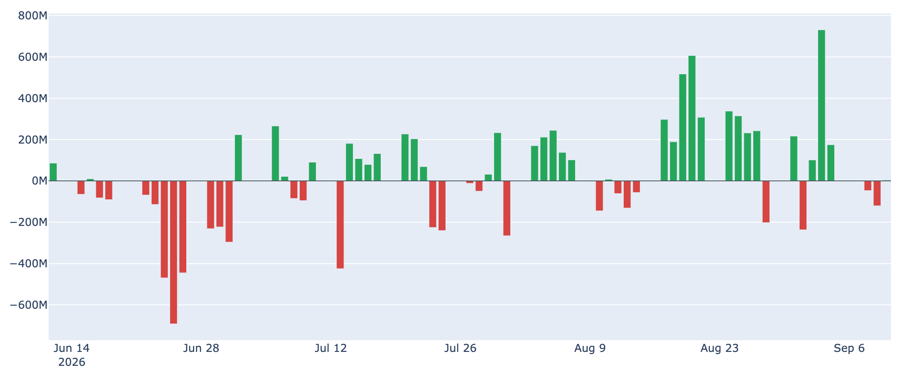
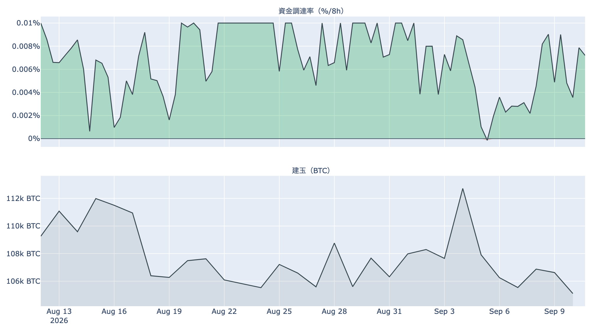
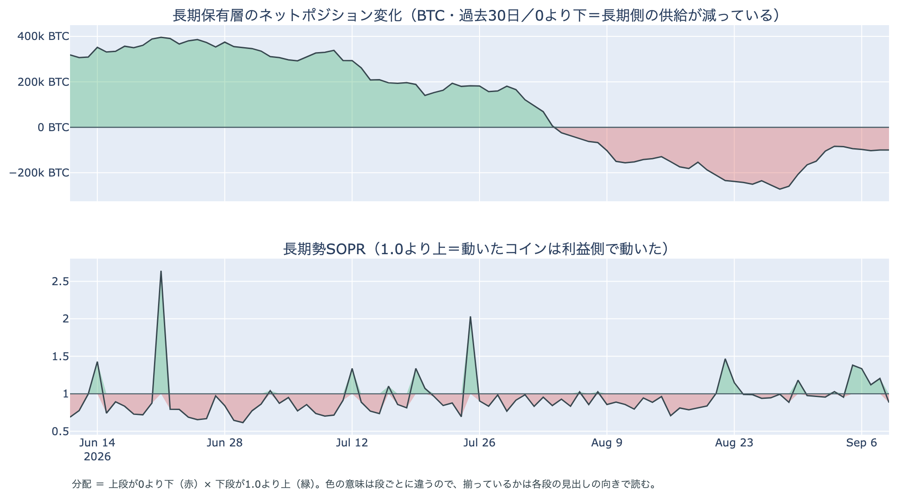
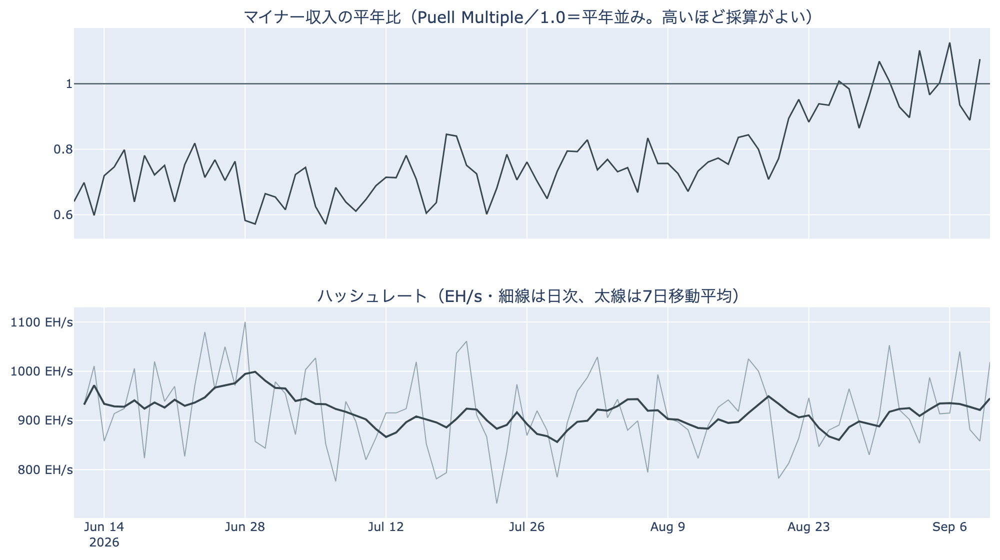

# 週の安値$76,600まで押して7日前比-5% ― 長期側で動いた分は原価割れに転じ、米国の買いは3週間半ぶりの弱さ

**2026年9月11日**

9月11日7時5分（日本時間）時点の実勢価格は約$77,119で、24時間では**-0.98%**。レンジは$76,630〜$78,554です。原油が1日で8%上げ、株が4日続落し、金も下げた日に、BTCは9月3日の$81,000台から1週間で約5%押した安値圏にいます。中身のデータでは、4日続いていた「長期側の減少×利益側で動く」並びが途切れ、9月9日に動いた長期側のコインは平均して原価割れ。米国とそれ以外の価格差は約3週間半ぶりのマイナス幅に沈み、ETFは2営業日続けて流出しました。

（数値は9月11日7時5分（日本時間）時点までに取得した各種データに基づきます。価格と取引所プレミアムはその時点の実勢、市場心理は9月10日の確定値、オンチェーン指標は9月9日時点、ETF資金フローは9月10日分まで（10日分は集計途中）です。外部環境の終値は金・原油・株・金利・ドル円とも9月10日時点。なお、オンチェーンの保有・年齢の指標には、ETF・取引所が預かっている分も含まれています。）

## 1. 全体像：原油が1日で8%高、株は4日続落、BTCは週の安値圏

* **水準**: 9月11日7時5分時点で約$77,119。9月9日（UTC）の確定日足終値$78,284からは約1.5%下です。50日移動平均は約$70,412、200日移動平均は約$69,967で、**50日線が200日線を上回って3日目**（差は約$445と、前日の$269からさらに開きました）。価格は50日線を約9.5%上回る位置にあり、過去2年のレンジでの位置は下から4割弱。
* **1週間**: レンジは$76,630〜$81,438で、7日前比は**-5.10%**、30日前比は**+21.39%**。9月3日の$81,000台を高値に、$78,000〜$80,000台での足踏みが1週間続いたあと、この24時間で下に抜けました。安値の$76,630は、8月21日に$78,000台へ乗せて以降の確定終値の最低（8月22日の$77,054）を下回る水準です。
* **外部環境**: 9月10日の終値で、WTI原油は103.93ドル（**+8.20%**、5営業日では**+14.20%**）、金は4,358.50ドル（**-1.30%**）、S&P500は7,591.70（**-0.58%**、4日続落）、VIX（＝株式市場の恐怖指数）は17.84（+8.38%、5営業日で+24.58%）、ドル指数（＝主要通貨に対するドルの強さ）は99.08（+0.31%）、米10年債利回りは**4.94%**（前日の4.84%から上昇）。原油とVIXと金利が上がり、株と金が下げた並びで、銘柄の並びによる地合いの目安は9月9日→10日で**まちまち**です。
* **エネルギー・地政学**: イラン革命防衛隊の海軍が、週前半の米軍によるイランのタンカー5隻への攻撃に対する報復として、米海軍の艦船2隻・タンカー8隻・その他10隻を標的にしたと発表し、ホルムズ海峡を通るタンカーは1日およそ10隻まで減っていると報じられています。フーシ派がイエメンの港を掌握したとも伝えられ、米国とイランの衝突は7か月目に入りました。**原油高と金利上昇が同時に進む局面はリスク資産全体の重しになりうる**状況です。
* **BTCとの30日相関**は金**+0.69**／S&P500**+0.19**で前日から変わっていません。9月10日は金が下げ株も下げた日で、BTCは1%弱の下げ。ここにあるのは値動きの並びであって、原因ではありません。

## 2. データの解説：注目すべき5つのポイント

### ① 1週間の足踏みを下に抜け、9月10日21時台の押しはロング側の清算が9割集中

* **値幅**: この24時間のレンジは$76,630〜$78,554で、高値と安値の差は**2.5%**。幅は前日までの3日間とほぼ同じですが、位置が1段下がり、1週間続いた$78,000〜$80,000台の足踏みから下へ出ました。
* **清算**: この24時間にHyperliquid（オンチェーンの取引所）で観測できた強制清算は**307件**で、**向きはすべてロング側**。価格帯は**$77,000台に9割**、時間帯は**9月10日21時台（日本時間）に9割**が集まっています。最大の1件は全体の15%で、大口が1つ飛んだ形ではなく、**下げた1時間に多数のロングが焼けた**という並びです。清算と値動きは同時刻に起きるので、どちらが先かはこのデータでは言えません。
* **心理**: Fear & Greed 指数（＝市場心理の指数）は9月10日の確定値で**69**の「強欲」。5日続いた後退が止まり、前日の66から3pt戻しました。1週間前は65、30日前は29です。

### ② 米国側の買いは3週間半ぶりの弱さ、ETFは2営業日続けて流出

* **価格差**: Coinbase Premium（＝米国とそれ以外の価格差）は9月10日付の最新値（＝9月11日7時5分時点の実勢）で**-0.081%**。マイナスは**6日連続**で、幅は8月16日以来の大きさです。1週間前は-0.008%、30日前は-0.107%。8月下旬から9月上旬にかけてゼロ近辺で推移していた米国側の買いが、この2日ではっきりマイナスに振れました。

* **ETF**: 米国スポットETFの純流出入は**9月9日に-120.2M USD**で、9月8日の-46.6Mに続く2営業日連続の流出超（2日合計で約-167M）。9月10日分は集計が終わっておらず、判明しているのは1本のみ（+4.0M）で、まだ判断材料になりません。直近7営業日の合計は**+607.2M USD**と前日の+738.2Mから縮みましたが、9月3日の+730.8Mを含む週単位の流入超はまだ残っています。**単日の規模は小さいものの、価格差と流れの向きが2日そろってマイナス側**にあるのが9月10日時点の姿です。

### ③ 先物：上乗せは3日続けて短期金利の上、建玉は価格が下げた日に増えた

* **傾き**: 資金調達率（＝先物の買い持ちが払う金利）は直近の8時間分で**+0.0059%（年率換算 約+6.5%）**。プラスは**16回連続**（8時間ごと＝約5.3日）で、30日平均の+0.0067%は下回っています。上限（±0.3%/8h）には遠く、過熱の形ではありません。
* **上乗せ分**: 9月10日を通してならした資金調達率の年率（+6.80%）から短期金利（13週Tビル 3.85%）を引いた超過は**+2.95pt**で、**3日続けてプラス**（前日+3.02pt、前々日+4.16pt）。直近34日の平均+3.58ptをわずかに下回る平常の位置です。これは置いておくだけの金利に対する上乗せの話であって、確実に取れる利回りではありません。
* **規模**: 建玉（＝先物の未決済残高）は107,310BTC（9月10日UTCで約82.3億ドル）で、7日変化は**-2.4%**。ただし前日の105,216BTCからは**約2%増え**ています。価格が1%下げた日に残高が増えた並びで、先物側で新しいポジションが積まれたことまでは言えますが、その向きは率がプラスのままなので判別できません。

### ④ 長期側の減少は横ばい、動いた分は「原価の0.88倍」に転じて並びが途切れた

* **量**: 長期保有層のネットポジション変化（＝長期勢の保有量の増減、過去30日）は9月9日時点で約**-10.0万BTC**。前日とほぼ同じで、1週間前の約-10.5万BTC、30日前の約-15.0万BTCからは縮んだ位置に留まっています。**預かり分の混入を差し引いても、この規模と方向は変わりません。**
* **損益**: 長期勢SOPR（＝長期勢の損益）は約**0.88**で、前日の1.205から**1を割り込みました**。9月8日まで4日続けて利益側で動いていた長期側のコインが、9月9日は平均して原価の0.88倍、つまり**含み損の状態で動いた**ことになります。1週間前は0.956、30日前は0.889。長期側（取得から155日以上）には、2025年11月〜2026年1月に$90,000〜$100,000台で最後に動いたコインが入り始めており、それらが動けば原価割れとして数えられます。
* **並び**: 「長期側が減っている」と「動いた分は利益側」が9月5日から4日そろっていた形は、9月9日で途切れました。減少幅が横ばいのまま、動いた中身が利益側から損失側に入れ替わった、というのが9月9日時点の事実です。長期側の平均取得単価は約$49,300で、価格はその1.6倍にあります。

上段は0より下のまま、下段は9月9日に1.0を割りました。「量は減り、動いた分は損失側」という組み合わせで、9月5〜8日の並びとは下段の向きが違います。

### ⑤ マイナー：収入は平年並みに戻り、設備は7日平均で1か月前より6%増

* **収入**: Puell Multiple（＝マイナー収入の平年比）は9月9日時点で約**1.08**。8月上旬の0.73から価格の上昇に沿って戻し、8月26日以降は**1.0を挟んで上下する**水準です（1週間前は0.90、30日前は0.73）。過去1年の平均並みの収入が出ている位置で、採算悪化で設備を止める局面ではなくなっています。
* **設備**: ハッシュレートは7日移動平均で約**945 EH/s**。1週間前の約909 EH/sから**+3.9%**、30日前の約893 EH/sから**+5.8%**です。日次の推定値は1日で10%前後振れる（9月8日881→9日858→10日1,019）ので、7日平均でこの伸びが見えていることに意味があります。直近90日の7日平均のレンジは856〜999 EH/sで、いまはその上寄り。
* **難易度**: 次回の難易度調整は現時点で**+2.85%**の見込み（エポック進捗37%）。収入が平年並みに戻り、設備が7日平均で増え、難易度が上向く、という順序がそろっています。

## 3. 相場転換を見極めるための「3つの分岐点」

1. **$76,600の安値と、短期勢の原価$71,000**: 9月9日時点の取得原価の分布に9月11日朝の価格を重ねると、いまいる$70,000〜$80,000には約210万BTC（全供給の10.5%）が最後に動いた供給として積まれており、下端の$70,000までは-9.2%、上端の$80,000までは+3.7%です。すぐ下の$60,000〜$70,000は約311万BTC（15.5%）と、価格に近い帯では最も厚い層。下側の目安は短期保有者の平均取得単価で、9月9日時点の約**$71,083**（いまの価格はこれを約8.5%上回っています）。この24時間の安値$76,630を割るか、$78,000台の足踏みに戻るかが最初の分かれ目です。
2. **米国側の数字が3日目も続くか**: 価格差は6日連続マイナスで幅が広がり、ETFは2営業日続けて流出。どちらも規模は小さく、**次の1〜2営業日で反転すれば単なる押し目、続けば8月後半からの流入局面の一区切り**になります。ETFは9月10日分の集計の確定と9月11日分が次の材料です。あわせて、長期勢SOPRが1の下に留まるか（原価割れのコインが動き続けるか）も、長期側の中身を見る目安になります。
3. **外部環境の日程**: 今夜21時30分（日本時間）に米CPI（8月分。市場予想は前年比3.4%、前月比+0.4%）、9月15〜16日にFOMCが控え、9月会合での0.25%利上げの織り込みは6割前後、据え置きとの見方で割れていると報じられています。**9月15日には米上院でCLARITY法案（暗号資産の市場構造法案）の討論打ち切り投票**があり、前へ進めるには60票が必要です（共和党は53議席）。9月17〜18日は日銀の会合。そこへ**WTIが1日で8%上げて$100を超え、米10年債利回りが4.9%台に乗った**状況が重なります。原油高と金利上昇は、今夜の物価指標と来週の金融政策の両方に効きうる材料です。

## 総括

9月11日7時5分時点の実勢価格は約$77,119、24時間で-0.98%、7日前比で-5.10%。原油が1日で8%上げ、株が4日続落し、金と米国債もそろって売られた日に、BTCは1週間続いた$78,000〜$80,000台の足踏みを下に抜けました。中身では、9月10日21時台の押しがロング側の清算を伴い、米国側の価格差は3週間半ぶりのマイナス幅、ETFは2営業日続けて流出。4日続いていた長期側の「減少×利益側」の並びは、動いた分が原価の0.88倍に転じて途切れました。一方で先物の上乗せは3日続けてプラス、マイナーの収入は平年並みに戻り設備も7日平均で伸びており、**需要側の数字が2日そろって弱まったところへ、今夜の物価指標と来週の金融政策・法案の日程が近づいている**、というのが9月11日時点の姿です。

---

*本稿は情報提供を目的としたものであり、投資助言ではありません。将来の価格動向を保証・示唆するものではなく、投資判断は各自の責任において行ってください。*
