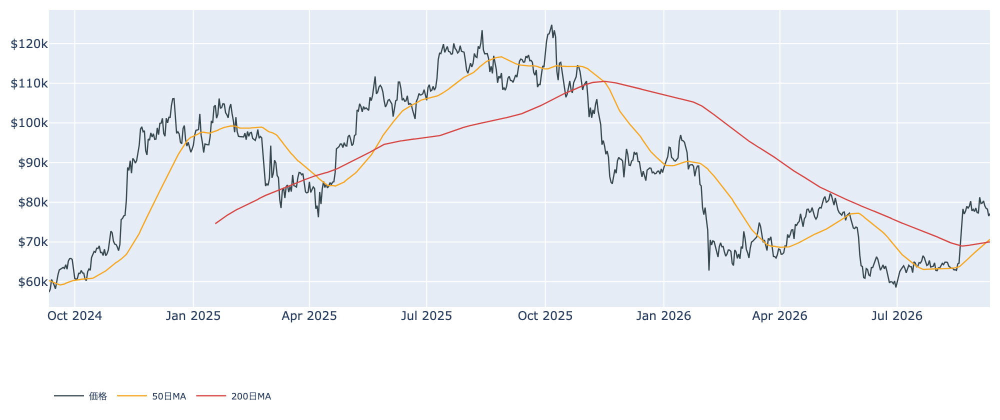
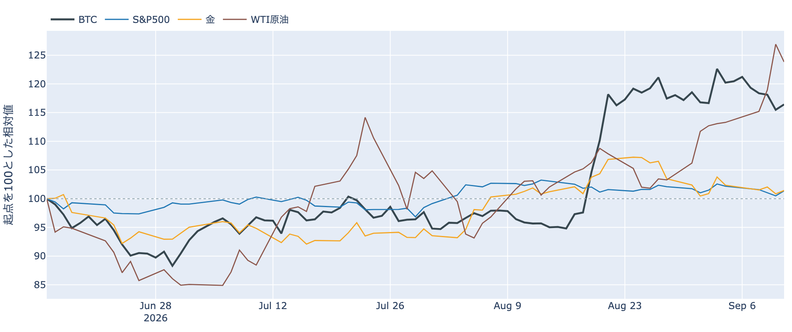
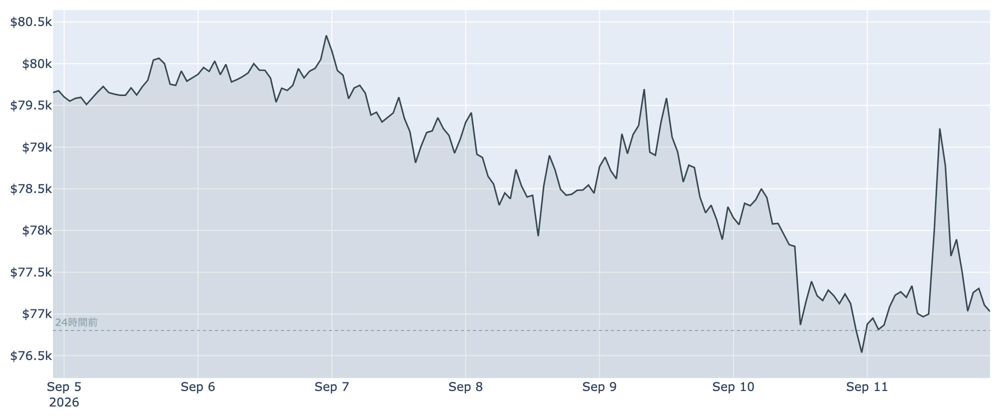
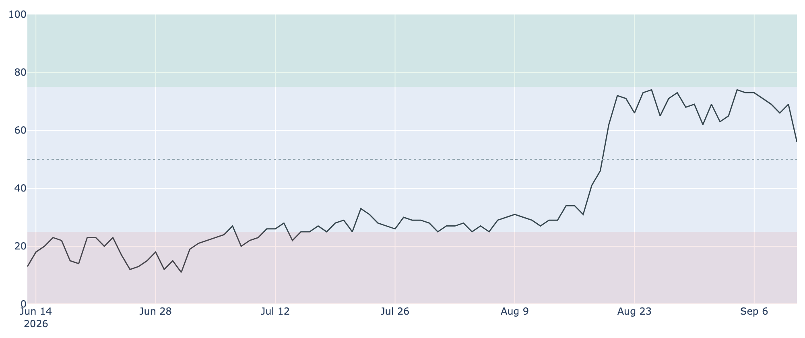
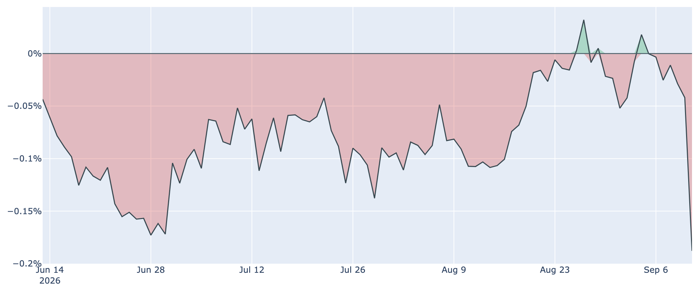
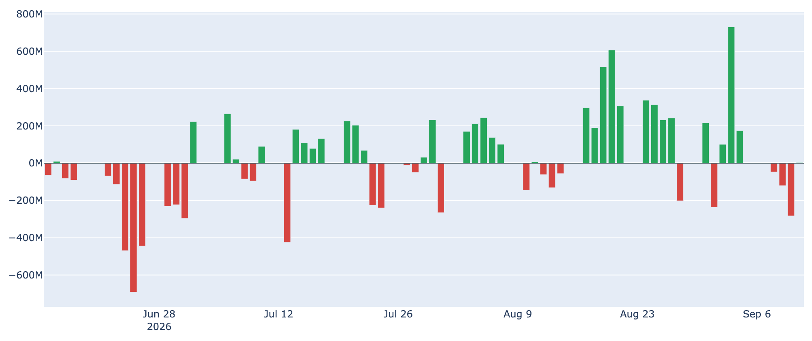
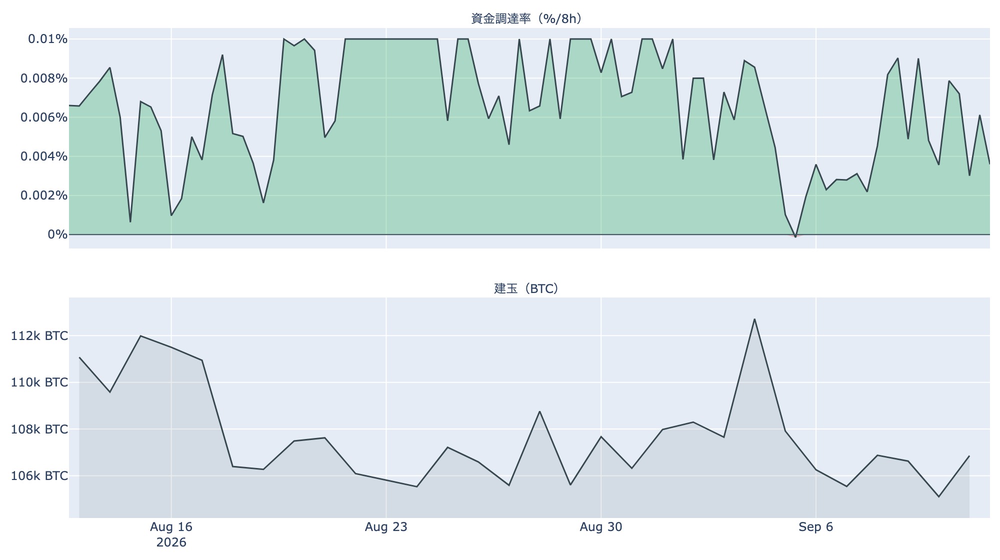
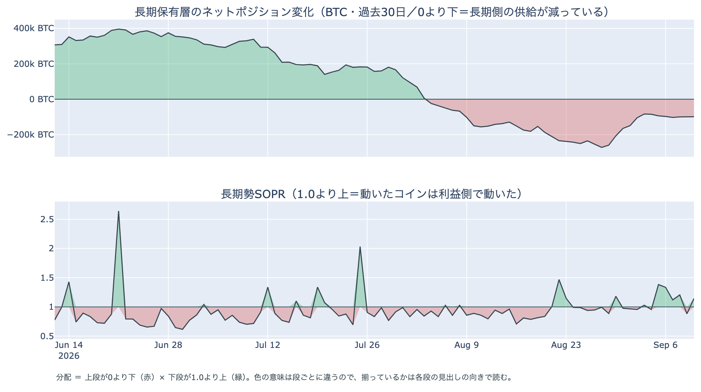

# 物価指標をはさんで$79,800と$76,000を往復 ― 大口ロング1件の清算を伴い、米国の買いは10か月で最も弱い水準へ

**2026年9月12日**

9月12日7時5分（日本時間）時点の実勢価格は約$77,159で、24時間では**+0.46%**。ただしレンジは$76,030〜$79,852と**幅5.0%**で、米国の物価指標が出た9月11日21時台（日本時間）に$79,800近くまで跳ねたあと、数時間で$76,000台まで往復しました。その1時間にロング側の大口清算が1件集中しています。中身のデータでは、米国とそれ以外の価格差が約10か月の集計で最も弱い水準に沈み、ETFは3営業日続けて流出幅を広げ、市場心理は1日で13pt後退。一方で長期側は「減少×利益側で動く」並びに1日で戻りました。

（数値は9月12日7時5分（日本時間）時点までに取得した各種データに基づきます。価格と取引所プレミアムはその時点の実勢、市場心理は9月11日の確定値、オンチェーン指標は9月10日時点、ETF資金フローは9月11日分まで（11日分は集計途中）です。外部環境の終値は金・原油・株・金利・ドル円とも9月11日時点。なお、オンチェーンの保有・年齢の指標には、ETF・取引所が預かっている分も含まれています。）

## 1. 全体像：物価指標の直後に5%の往復、株は反発し原油は$100を割る

* **水準**: 9月12日7時5分時点で約$77,159。9月10日（UTC）の確定日足終値$76,537からは約0.8%上です。50日移動平均は約$70,643、200日移動平均は約$70,027で、**50日線が200日線を上回って4日目**（差は約$616と、前日の$445からさらに開きました）。価格は50日線を約9%上回る位置で、過去2年のレンジでの位置は下から4割弱。
* **1週間**: レンジは$76,030〜$80,564で、7日前比は**-3.16%**、30日前比は**+21.68%**。9月3日の$81,000台を高値に、$78,000〜$80,000台の足踏みが1週間続いたあと、9月10日から$77,000前後へ1段下がった位置にいます。この24時間の安値$76,030は、8月21日に$78,000台へ乗せて以降で最も低い水準です。
* **米CPI**: 9月11日21時30分（日本時間）に出た8月の米消費者物価は前月比+0.4%、前年比3.4%と予想どおりで、コアは前月比+0.3%と予想をやや上回りました。ガソリンが1か月で3.9%上がり、上昇分の3分の1超を占めています。市場では**来週の利上げの織り込みがさらに進み、0.25%利上げの確率は6割半ば**と報じられています。
* **外部環境**: 9月11日の終値で、S&P500は7,656.98（**+0.86%**、5日続落を止めて反発）、VIX（＝株式市場の恐怖指数）は15.84（**-11.21%**）、WTI原油は99.99ドル（**-2.43%**。前日に8%上げた分の一部を戻し$100を割る。5営業日では+9.52%）、金は4,390.00ドル（+0.58%）、米10年債利回りは**4.97%**（前日の4.94%からさらに上昇）、ドル指数（＝主要通貨に対するドルの強さ）は99.10で横ばい。株が戻りVIXが下げた一方で金利は上がり続けた並びで、銘柄の並びによる地合いの目安は9月10日→11日で**まちまち**です。
* **エネルギー**: ホルムズ海峡では前日にイランが米艦船とタンカーを標的にしたと発表した状況が続いており、原油は1日下げても$100近辺に留まっています。**原油高と金利上昇が並走する局面はリスク資産全体の重しになりうる**状況で、9月11日はその中で株が反発しBTCが往復した、という並びです。
* **BTCとの30日相関**は金**+0.69**／S&P500**+0.20**で前日からほぼ変わっていません。ここにあるのは値動きの並びであって、原因ではありません。

## 2. データの解説：注目すべき5つのポイント

### ① 21時台に$79,800まで跳ねて$76,000台へ、ロング側の大口1件の清算を伴った

* **値幅**: この24時間のレンジは$76,030〜$79,852で、高値と安値の差は**5.0%**。前日までの3日間（2.5%前後）の2倍の幅です。9月11日21時台（日本時間）に一気に$79,800近くまで上げ、そのあと数時間で$76,000台まで戻る「往復」の形で、24時間の変化は+0.46%と小さいのに途中の振れは1週間で最大でした。
* **清算**: この24時間にHyperliquid（オンチェーンの取引所）で観測できた強制清算は**1,715件**で、**向きは99%がロング側**。時間帯は**9月11日21時台に全体の100%**、価格帯は**$75,000〜$76,000台に99%**が集まっています。ただし**最大の1件が全体の99%**を占めており、多数のロングが焼けたのではなく、**大口のロングが1つ飛んだ**というのがこの日の形です。清算と値動きは同時刻に起きるので、どちらが先かはこのデータでは言えません。
* **並び**: 上に跳ねたあと下に往復し、その往復の底で大口1件が焼けた、という順序です。往復のあとは$77,000前後に戻っており、9月10日から続く水準の中に収まっています。

### ② 市場心理は1日で13pt後退、「強欲」の下端へ

* **水準**: Fear & Greed 指数（＝市場心理の指数）は9月11日の確定値で**56**の「強欲」。前日の69から**-13pt**で、直近90日で最も大きい1日の後退です（8月19日→20日の+16ptの逆向きにあたります）。1週間前は74、30日前は27。
* **位置**: 「強欲」の区分（56〜75）の下端に来ており、あと1pt下がれば「中立」に入ります。8月20日に「強欲」へ入って以来、初めてこの区分の境目まで下がりました。

### ③ 米国側の買いは10か月の集計で最も弱い圏、ETFは3営業日続けて流出幅を広げた

* **価格差**: Coinbase Premium（＝米国とそれ以外の価格差）は9月11日付の最新値（＝9月12日7時5分時点の実勢）で**-0.188%**。マイナスは**7日連続**で、幅は前日の-0.042%から1日で4倍以上に広がりました。直近90日では最も低く（6月28日の-0.173%を下回る）、2025年11月からの約300日の集計でも**下から1%の位置**（最低は-0.229%）です。1週間前は+0.018%、30日前は-0.108%。
* **ETF**: 米国スポットETFの純流出入は**9月10日に-282.7M USD**で、9月8日-46.6M、9月9日-120.2Mに続く**3営業日連続の流出超**（3日合計で約-450M）。単日の流出幅は7月13日（-424.7M）以来の大きさで、**日を追って広がっています**。9月11日分は集計途中で1本（+3.8M）しか判明しておらず、まだ判断材料になりません。直近7営業日の合計は**+560.8M USD**で、9月3日の+730.8Mがまだ支えている形です。
* **並び**: 価格差の弱さとETFの流出が、9月10日・11日と**2日そろって幅を広げた**のがこの日の姿です。

### ④ 先物：建玉は1日で4%減り、上乗せは短期金利をかろうじて上回る水準に縮んだ

* **傾き**: 資金調達率（＝先物の買い持ちが払う金利）は直近の8時間分で**+0.0028%（年率換算 約+3.1%）**。プラスは**19回連続**（8時間ごと＝約6.3日）ですが、30日平均の+0.0067%の半分以下に下がりました。上限（±0.3%/8h）には遠く、過熱の形ではありません。
* **上乗せ分**: 9月11日を通してならした資金調達率の年率（+4.64%）から短期金利（13週Tビル 3.91%）を引いた超過は**+0.73pt**。前日の+2.95ptから1日で縮み、直近34日の平均+3.56ptを大きく下回ります。プラスは保っているものの、置いておくだけの金利に対する上乗せはほぼ消えかけている位置です（確実に取れる利回りの話ではありません）。
* **規模**: 建玉（＝先物の未決済残高）は103,303BTC（9月11日UTCで約81.8億ドル）で、7日変化は**-5.2%**。前日の107,310BTCからは**約4%減り**ました。5%の往復と大口1件の清算があった日に残高が減った並びで、**先物側のポジションが1日で目に見えて薄くなった**ことまでは言えます。

### ⑤ 長期側は「減少×利益側」の並びに1日で戻った

* **量**: 長期保有層のネットポジション変化（＝長期勢の保有量の増減、過去30日）は9月10日時点で約**-9.9万BTC**。前日の約-10.0万BTCとほぼ同じで、1週間前の約-8.4万BTCからは減少幅がやや広がり、30日前の約-15.6万BTCからは縮んだ位置です。**預かり分の混入を差し引いても、この規模と方向は変わりません。**
* **損益**: 長期勢SOPR（＝長期勢の損益）は約**1.14**で、9月9日の0.88（原価割れ）から**1日で1の上に戻りました**。9月10日に動いた長期側のコインは平均して原価の1.14倍、つまり利益側で動いています。1週間前は1.03、30日前は0.86。
* **並び**: 「長期側が減っている」と「動いた分は利益側」の2本が再びそろったので、9月10日時点は**分配の並び**と言えます。9月9日の原価割れは1日で途切れ、9月5〜8日の形に戻りました。長期側の平均取得単価は約$49,300で、価格はその1.6倍にあります。

上段は0より下のまま、下段は9月10日に1.0の上へ戻りました。「量は減り、動いた分は利益側」という組み合わせです。

## 3. 相場転換を見極めるための「3つの分岐点」

1. **$76,000の安値と、短期勢の原価$71,100**: 9月10日時点の取得原価の分布に9月12日朝の価格を重ねると、いまいる$70,000〜$80,000には約214万BTC（全供給の10.6%）が最後に動いた供給として積まれており、上端の$80,000までは+3.7%、下端の$70,000までは-9.3%です。下側の目安は短期保有者の平均取得単価で、9月10日時点の約**$71,106**（いまの価格はこれを約8.5%上回っています）。この24時間の安値$76,030を終値で割るか、$78,000台の足踏みへ戻るかが最初の分かれ目です。なお、SOPR（＝動いたコインの損益）は9月10日時点で約1.00と、市場全体で動いたコインはほぼ原価どおり。MVRV Z-Score（＝市場全体の含み益）は約0.79で、1週間前の0.95から下がっています。
2. **米国側の3つの数字が来週も続くか**: 価格差は約10か月で最も弱い圏、ETFは3営業日続けて流出幅が拡大、先物の上乗せは短期金利すれすれ。**3つとも「買いの勢いが抜けた」向きにそろった**のが9月11日時点です。週末をはさみ、9月14日（月）以降のETF集計と価格差が反転するかどうかが、8月後半からの流入局面が続いているかを測る材料になります。市場心理が「中立」（55以下）に入るかも、同じ向きの目安です。
3. **外部環境の日程が3つ重なる週**: 9月15日（月）14時15分（米東部時間）に**米上院でCLARITY法案（暗号資産の市場構造法案）の討論打ち切り投票**があり、前へ進めるには60票が必要です（共和党は53議席で、民主党・無所属から7票以上が要ります）。9月15〜16日はFOMCで、物価指標のあと**0.25%利上げの織り込みは6割半ば**と報じられています。9月17〜18日は日銀の会合。そこへ**原油が$100近辺、米10年債利回りが4.97%**という状況が重なります。法案の採決は「通るかどうか」を予想せず、結果が出た翌朝に何が決まったかを書きます。

## 総括

9月12日7時5分時点の実勢価格は約$77,159、24時間で+0.46%、7日前比で-3.16%。数字の上では小動きですが、米国の物価指標をはさんで$79,800と$76,000を往復する5%の振れがあり、その底でロング側の大口1件の清算を伴いました。中身では、米国とそれ以外の価格差が約10か月の集計で最も弱い圏に沈み、ETFは3営業日続けて流出幅を広げ、先物の上乗せは短期金利すれすれまで縮み、市場心理は1日で13pt後退。長期側は原価割れが1日で途切れて「減少×利益側」の分配の並びに戻りました。**買いの勢いを測る数字が3つそろって抜けたところへ、法案の採決と利上げの判断が来週前半に重なる**、というのが9月12日時点の姿です。

---

*本稿は情報提供を目的としたものであり、投資助言ではありません。将来の価格動向を保証・示唆するものではなく、投資判断は各自の責任において行ってください。*
