# 清算ゼロの土曜、上下0.6%で足踏み ― 減ったロングはそのまま残り、オプションの備えは10月の満期にだけ置かれている

**2026年9月13日**

土曜日はほとんど動かなかった日です。24時間の値幅は$77,050〜$77,495で、上下0.6%。前の晩に5%の往復があり、そのとき証拠金で買い持ち（ロング）にしていた人の一部が清算（＝証拠金不足で強制的に閉じられた取引）されましたが、土曜日はロングの量がそれ以上減らず、清算もゼロでした。証券市場は週末で閉まっていて、ビットコインを大きく張っている人たちも動いていません。市場参加者は、前の晩の往復を「流れが変わった」ではなく「一時的な押し」と見ています。オプションでは、9月25日の満期までは「荒れない」側の値付けが並び、価格が下がったときの備えは10月2日以降の満期にだけ置かれています。週明けには法案の手続き投票・米国の利上げ判断・日銀の会合が3日続けて並びます。

（数値は9月13日7時5分（日本時間）までのデータに基づきます。価格・先物・オプションはその時点の値、市場心理は9月12日の確定値、オンチェーン（＝ブロックチェーン上の記録）は9月11日時点、ETF資金フローは9月11日分までです。証券市場の終値は9月11日時点で、週末のため更新がありません。オンチェーンの長期保有者の数値には、ETFや取引所が預かっている分も含まれます。オプションはDeribit（BTCオプションの大半を占める取引所）の全銘柄です。）

## 1. 何が起きたか

**図1-1 価格の推移（1時間足・直近7日）**

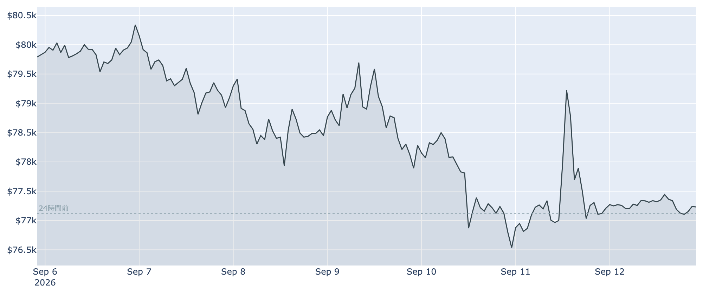

*図の見方: 1時間ごとの価格。金曜の夜に大きく上下した山谷のあと、土曜は線がほぼ平らです。点線は24時間前の水準。*

この1週間でいちばん静かな24時間でした。金曜の夜に集中した清算は、土曜日には1件も出ていません。

* 朝7時5分の時点で約$77,258。24時間で+0.2%、値幅は0.6%。前の晩の往復（幅5%）の8分の1。
* 1週間前と比べると−3.2%、1か月前と比べると+21.8%。
* Hyperliquid（＝オンチェーンの先物取引所）で見える清算は、この24時間で0件。

**図1-2 価格と50日・200日移動平均**

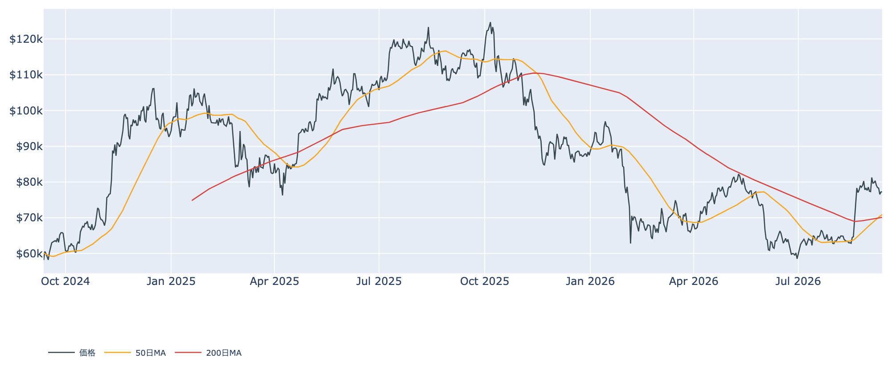

*図の見方: 2本の平均線の上下関係が「並び」で、50日線が上なら上向きです。*

前の晩の5%往復でも、50日線が200日線の上にある並びは崩れていません。差はまだ1.2%で、定着したとは言えない段階です。

* 並びは50日線が200日線の上で5日目。差は約$815（1.2%）。
* 価格は50日線の約9%上。

証券市場は週末で休みです。金曜9月11日の終値は、S&P500が+0.9%、原油は−2.4%でちょうど$100、金は横ばいの$4,366、米10年債利回りは4.97%でした。

## 2. なぜ動いたか：ビットコイン自身の需給か、外部環境か

**図2-1 ビットコインと株・金・原油の相対推移（起点＝100）**

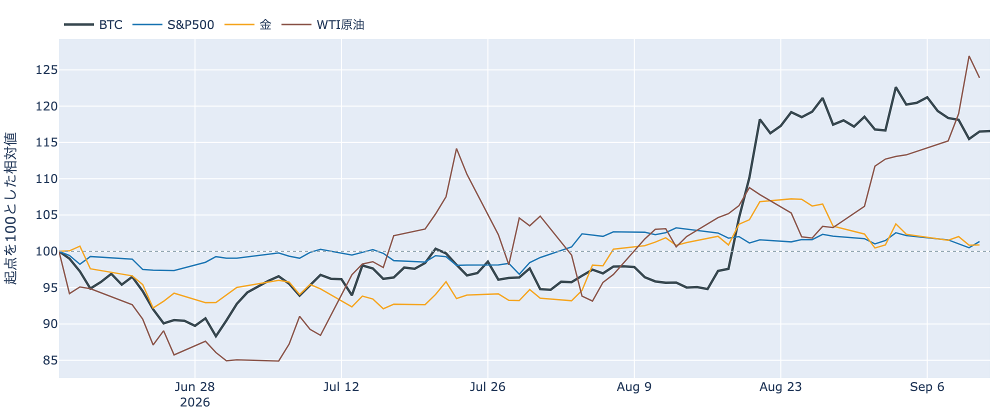

*図の見方: 同じ起点から何%動いたかで重ねたもの。線が同じ向きなら「一緒に動いた」、ビットコインだけ別の向きなら「自身の理由で動いた」と読みます。*

土曜日に価格が動かなかった理由は2つです。

1. 証券市場が閉まっていて、原油と金利からの影響が止まっていた。この1週間の下げは、原油高と金利上昇のなかで金と同じ向きに起きていたので、それが止まればビットコインも止まる。
2. 前の晩の清算のあと、ロングもショートも増えず、手仕舞いも出なかった。建玉は減り止まり、資金調達率はプラスのまま。

前日は「価格は物価統計をはさんで$79,800と$76,000を往復し、その底でロング側の大口清算1件を伴った」と説明しました。買い手が引いていたのなら、清算のあとも価格は戻らず、資金調達率はマイナスに沈むはずです。どちらも起きていないので、前日の往復は「一時的な押し」で、流れが変わったのではありません。

| この5営業日の動き（9月3日→9月11日） | 変化 |
|---|---:|
| ビットコイン（1週間前比） | −3.2% |
| 金 | −2.8% |
| 米国株（S&P500） | −1.2% |
| 原油 | +9.6% |

* 証券市場が閉まっている24時間で、ビットコインも0.6%しか動かなかった。
* この1週間、ビットコインは金と同じくらい下げ、株はその3分の1、原油は上げた。過去30日の値動きの相関は、金と+0.69、S&P500と+0.20で、金と一緒に動く日が多い。
* 建玉（＝先物の未決済残高。証拠金で張っている人の量）は103,218BTC。1週間では−4.2%だが、この24時間ではほぼ変わらず。
* 資金調達率（＝ロングが払う金利。プラス＝ロングがショートより多い）はプラスのまま。1日をならした年率は+5.69%で、短期金利（13週Tビル 3.91%）を引いた上乗せは+1.78pt。前日に短期金利すれすれまで縮んだ上乗せが、戻った。

この説明が違うなら、つまり「一巡した」のではなく「静かに手仕舞いが続いている」のなら、週明けに証券市場が開いたあとも建玉が減り続け、資金調達率がマイナスに沈みます。その形が出たら、この説明は取り下げます。

原油の金曜の−2.4%は、ホルムズ海峡の航行をめぐるイランと湾岸諸国の外相会合が9月14日にオマーンで開かれる、という報道と同時に起きました。原油はまだ$100の水準で、リスク資産全体の重しになりうる状況は変わっていません。

## 3. 市場参加者はいまどう見ているか

### ① アメリカの買い手は「手を止めている」が続き、「逃げた」わけではない

**図①-1 Coinbase Premium（アメリカとそれ以外の価格差・直近90日）**

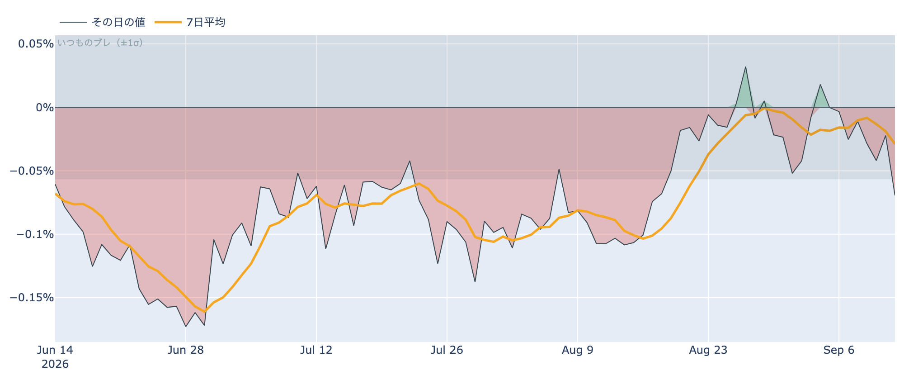

*図の見方: プラス＝アメリカで買いが強い。太線が1週間平均、細線がその日の値。薄い帯は「いつものブレの範囲」です。*

アメリカの買い手は弱いままですが、さらに引いてはいません。前日は「アメリカとそれ以外の価格差が約10か月の集計で最も弱い水準に沈んだ」と説明しました。金曜の値はいつものブレの内側に戻り、1週間平均の下向きもわずかなので、「弱い」は続いていても「引き続けている」とは言えません。

* Coinbase Premium（＝アメリカとそれ以外の価格差）は1週間平均で−0.03%。先週の−0.02%からわずかに下向き。8月中旬は−0.10%だった。
* その日の値は−0.07%で、いつものブレの範囲内。

**図①-2 ETFの日ごとの資金の出入り（直近90日）**

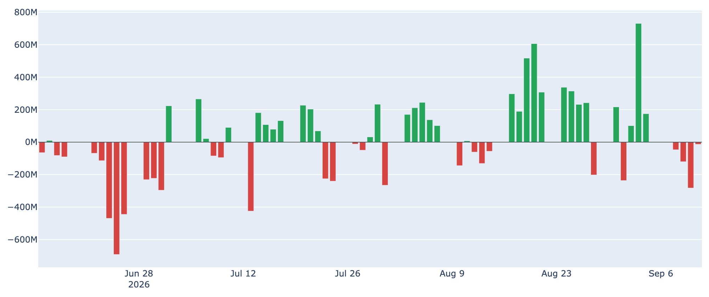

*図の見方: 入ったお金と出たお金の差。上に伸びれば入り超、下に伸びれば出超。*

ETFからの流出は4営業日続いていますが、最終日に急に縮みました。1週間の合計ではまだ入り超で、アメリカの買い手は手を止めているが、逃げてはいない、が今朝の読みです。

| ETFの日ごとの出入り | 億ドル |
|---|---:|
| 9月8日 | −0.5 |
| 9月9日 | −1.2 |
| 9月10日 | −2.8 |
| 9月11日 | −0.1 |
| 直近7営業日の合計 | +5.4 |

**図①-3 Fear & Greed（市場心理の指数・直近90日）**

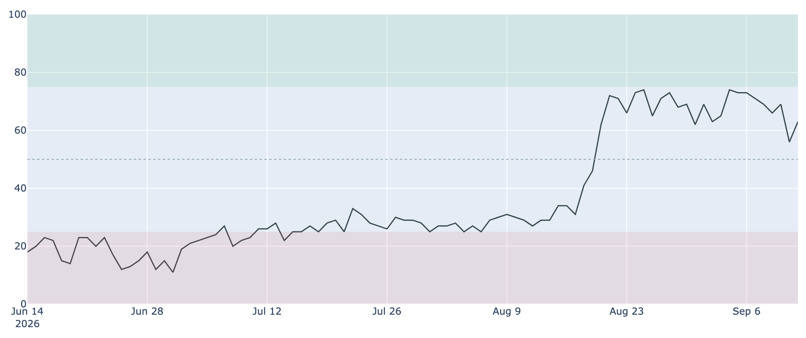

*図の見方: 0〜100で、50より上が「強欲」、下が「恐怖」。*

市場心理は前の晩の往復で冷めることなく、「強欲」側に戻っています。価格の下げを怖がっている人は多くありません。

* Fear & Greed（＝市場心理の指数）は63の「強欲」。前日の56から7pt戻した。1週間前は73、1か月前は29。

### ② 長期保有者の分配は続いているが、量は1週間変わっていない

**図②-1 長期保有者の保有量の30日変化とSOPR（直近60日）**

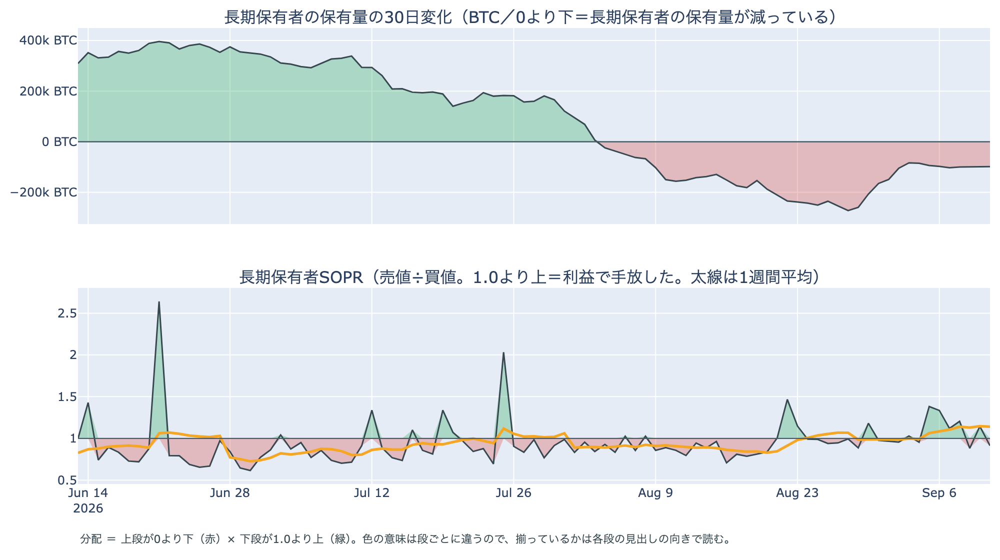

*図の見方: 上段は、長期保有者（＝155日以上動かしていないコインの持ち主）の保有量が30日でどれだけ増減したか。マイナス＝手放している。下段は長期保有者SOPR（＝長期保有者が動かしたコインの売値÷買値。1より上なら利益で手放した）。どちらも太線の1週間平均で読みます。*

長期保有者は、利益の出ているコインを少しずつ手放し続けています。保有量の30日変化がマイナスで、動いたコインが利益側という2つがそろっているので、これは分配（＝長期保有者からの放出）です。ただし勢いは落ち着いていて、この1週間は量が変わっていません。土曜日の静けさは、長期保有者が動いていない結果でもあります。ビットコイン自身の需給の土台は、前日と変わっていません。ETFや取引所が預かっている分を差し引いても、この規模と向きは変わりません。

| 9月11日時点 | 1週間平均 | 前の週の平均 |
|---|---:|---:|
| 長期保有者SOPR（1より上＝利益で手放した） | 1.14 | 0.99 |
| 長期保有者の保有量の30日変化（万BTC） | −9.9 | −15.1 |

* 減り方は前の週の3分の2に縮み、1か月前（−15.2万BTC）と比べても3分の2。この1週間は−8.4万〜−10.3万BTCの幅に収まっている。
* 長期保有者SOPRは1週間平均で1.14。動かしたコインは平均して買値より14%高く手放された。
* 1年以上動いていないコインは全体の63.1%で、3か月で1.6pt増えた。売りに出てくるコインが少ない下地は続いている。

今日は、コインが最後に動いた価格の分布に大きな変化がなく、長く眠っていたコインが動いた記録もありません。マイナーの収入は平年並み（Puell Multiple（＝マイナー収入の平年比）が1週間平均で1.00）で、売りを急ぐ状況ではありません。

### ③ 先物：減ったロングは、そのまま残っている

**図③-1 資金調達率と建玉（直近30日）**

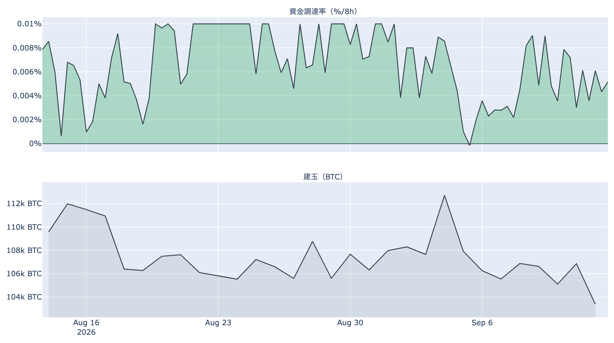

*図の見方: 上段は資金調達率（8時間ごと）。プラスが続く＝ロングがショートより多い。下段は建玉で、証拠金で張っている人の量。*

前の晩の清算で1段減ったロング（証拠金の買い持ち）が、そこから手仕舞いもせず、積み増しもせず、そのまま残っています。ロングに傾いてはいますが、過熱ではありません。前日に短期金利すれすれまで縮んだ上乗せが+1.78ptへ戻ったので、ロングを張る人が土曜日に減ったわけではありません。

* 資金調達率はプラスが22回連続（約7日）。ロングがショートより多い状態が続いている。
* 短期金利を引いた上乗せは+1.78pt。直近34日の平均+3.44ptより小さく、上限（8時間あたり±0.3%）にはほど遠い。
* 建玉は103,218BTC。9月3日の急騰のときに積まれた分が消えた水準に、1日とどまっている。

### ④ オプション：9月25日までは「荒れない」の値付けで、備えは10月2日以降の満期だけ

オプションには2種類あります。コール（＝決めた価格で買う権利）とプット（＝決めた価格で売る権利）で、価格が上がればコールの価値が上がり、価格が下がればプットの価値が上がります。プットは「価格が下がったときの保険」として買われます。

**図④-1 満期ごとのIV（年率%）**

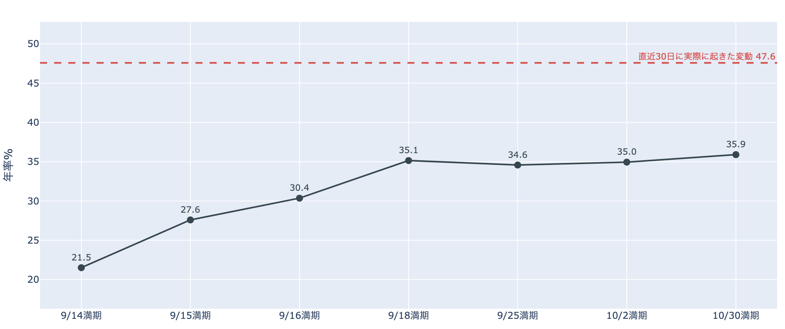

*図の見方: IV（＝オプション価格から逆算した、この先の値動きの幅の予想）を満期ごとに並べたもの。点線は実現ボラティリティ（＝直近30日に実際に起きた値動きの幅）。IVが点線より下なら、市場はこの先の値動きを過去の値動きより小さいと見ています。*

市場はこの先の値動きを、過去の値動きより小さいと見ています。守りを固めている状態ではなく、怖がってもいません。来週の会合の日だけ身構えている、ということもありません。

* IVは全体で36.9。実現ボラティリティ47.6より10.6pt低い。過去1年で下から16%の位置で、恐怖の水準ではない。
* 満期ごとに見ても、手前が低く先が高い平常の形。FOMC（＝米国の金利を決める会合）の結果が出る9月17日早朝をまたぐ満期だけが跳ねていることはない。

**図④-2 満期ごとのプットとコールの差**

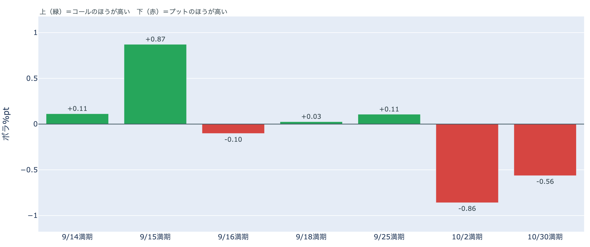

*図の見方: 満期ごとに、プットとコールのどちらが高く売れているか。ゼロより上ならコールのほうが高く、下ならプットのほうが高い。*

参加者は「9月25日の大きな満期までは荒れない」と値付けし、価格が下がったときの備えを10月2日以降の満期に置いています。9月15日の満期ではコールがはっきり高く、法案の手続き投票の日に「価格が上がる」に賭けている人がいる形です。

| 満期 | どちらが高いか |
|---|---|
| 9月14日 | コールがわずかに高い |
| 9月15日 | コールがはっきり高い |
| 9月16日 | プットがわずかに高い |
| 9月18日 | ほぼ差なし |
| 9月25日 | コールがわずかに高い |
| 10月2日 | プットが高い |
| 10月30日 | プットが高い |

* プットがはっきり高いのは10月2日と10月30日の2つの満期だけ。FOMCと日銀の会合をまたぐ9月18日の満期には、備えの値段が付いていない。

**図④-3 9月25日満期の持ち高（権利の価格ごと）**

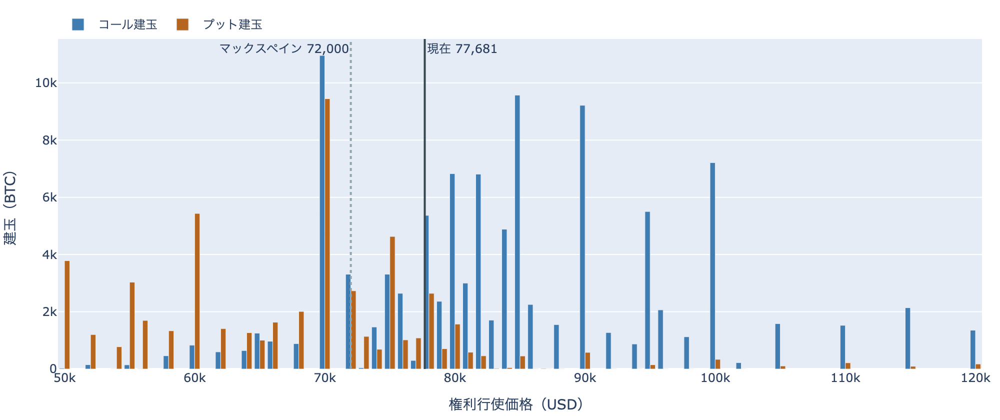

*図の見方: 青＝コール、橙＝プット。現値より上にコールが、下にプットが積まれるのが普通です。*

「価格が上がる」に賭けた人たちは降りていません。この賭けが報われるには、9月25日までに、オプションの持ち高が集まっている$75,000〜$80,000の帯の上端$80,000を超える必要があります。

| 9月25日満期のオプション（価格は$77,000台後半） | 量（万BTC） | 意味 |
|---|---:|---|
| いまより高い価格のコール | 約9.4 | 「価格が上がる」に賭けた分 |
| いまより安い価格のプット | 約5.4 | 「価格が下がる」への備え |
| うち、いまより15%以上高い価格のコール | 約4.9 | 大きな上げへの賭け |
| うち、いまより15%以上安い価格のプット | 約3.2 | 大きな下げへの備え |

* 9月25日満期の持ち高は全部で185,020BTCと、全満期の45%。コールがプットの1.9倍。
* 持ち高が集まっている価格は$78,000、$80,000、$75,000の帯。いまの価格はその帯の中。

## 4. 価格に影響しうる直近のイベント

予測ではなく、「次に市場が反応しうる材料」の案内です。オプション市場が備えを置いているのは10月2日以降の満期で、来週の会合3つと9月25日の区間には、今朝の時点で備えの値段が付いていません。

| 日付 | イベント | 何に効くか |
|---|---|---|
| 9/14（月） | ETFの集計と証券市場の取引が再開 | アメリカの買い手が「手を止めている」ままかどうかの最初の数値 |
| 9/14（月） | ホルムズ海峡の航行をめぐるイランと湾岸諸国の外相会合（オマーン） | 原油 |
| 9/15（火）〜16（水） | FOMC。0.25%利上げが多数派の見方。結果は日本時間17日早朝 | 金利 |
| 9/16（水）3:15 日本時間 | 米上院でCLARITY法案（＝暗号資産の市場構造法案）を審議に進めるかの手続き投票。60票が必要 | 9月15日満期でコールが高いのはこの日 |
| 9/17（木）〜18（金） | 日銀の会合。0.25%利上げの見方が優勢 | 円 |
| 9/25（金）17:00 | オプションの大きな満期（約18.5万BTC、全満期の45%） | 「価格が上がる」に賭けた人たちの期限 |

## まとめ：土曜日の動きは何だったか

土曜日は、証券市場が止まり、ビットコインを張っている人たちも止まった日でした。ロングの量は減り止まり、清算はゼロ、長期保有者は前日と同じ姿。ビットコイン自身の需給は変わっていません。前日の5%往復は「一時的な押し」で、買い手が引いたのではないことが、土曜日の数値で裏づけられました。アメリカの買い手は「手を止めている」が続き、「逃げた」とは言えません。オプションの参加者は9月25日の満期までを「荒れない」側に値付けし、コールの持ち高もそのまま残しています。備えを置いているのは10月2日以降の満期だけです。需給が変わっていない日は、何もしなくてよい日です。週明けに動くのは証券市場と外部環境のほうで、それを移動平均の並び・アメリカの買い・ETF・市場心理の同じ物差しで見ます。

---

*本稿は情報提供を目的としたものであり、投資助言ではありません。将来の価格動向を保証・示唆するものではなく、投資判断は各自の責任において行ってください。*
