# 週明けを前にロングがわずかに積み直された ― 値幅1.3%の日曜、9月25日のプットは再び高くなり、備えは FOMC のあとの満期すべてに並んだ

**2026年9月14日**

日曜日も、ほとんど動かなかった日です。24時間の値幅は$76,457〜$77,425で、上下1.3%。金曜の夜に5%の往復があり、そのとき証拠金で買い持ち（ロング）にしていた人の一部が清算（＝証拠金不足で強制的に閉じられた取引）されましたが、週末2日目はロングの量が減るどころか、わずかに増えました。証券市場は閉まったままで、ビットコイン自身の需給は前日と同じ姿です。前日から変わったことは一つで、**9月25日満期のプットが再びコールより高くなり、価格が下がったときの備えが、FOMCの結果が出たあとの満期すべてに並びました**。今週は法案の手続き投票・米国の利上げ判断・日銀の会合が3日続きます。

（数値は9月14日7時5分（日本時間）までのデータに基づきます。価格・先物・オプションはその時点の値、市場心理は9月13日の確定値、オンチェーン（＝ブロックチェーン上の記録）は9月12日時点、ETF資金フローは9月11日分までです。証券市場の終値は9月11日時点で、週末のため更新がありません。オンチェーンの長期保有者の数値には、ETFや取引所が預かっている分も含まれます。オプションはDeribit（BTCオプションの大半を占める取引所）の全銘柄です。）

## 1. 何が起きたか

**図1-1 価格の推移（1時間足・直近7日）**

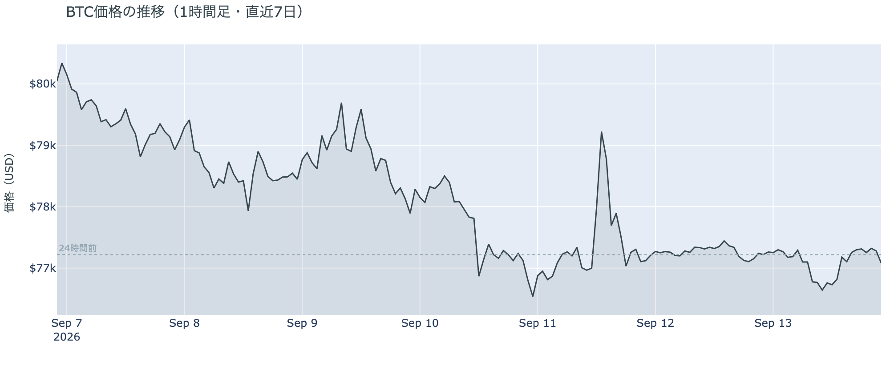

*図の見方: 1時間ごとの価格。金曜の夜に大きく上下した山谷のあと、土曜と日曜は線がほぼ平らです。*

* 24時間で−0.2%、値幅は1.3%。金曜の夜の往復（幅5%）の4分の1。日曜のうちに$76,500近くまで下げ、その後元の水準へ戻った。
* 1週間前と比べると−4.1%、1か月前と比べると+22.4%。
* Hyperliquid（＝オンチェーンの先物取引所）で見える清算は、この24時間で6件。ほぼ全部がロング側で、13日の18時台に76,000ドル台で集中し、最大の1件が全体の半分強。

朝7時5分の時点で約$77,057。週末2日目も静かな24時間で、清算は大口が1つ飛んだだけです。金曜の夜のように多数が続けて清算される形は出ていません。

**図1-2 価格と50日・200日移動平均**

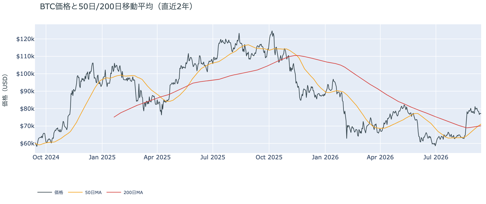

*図の見方: 2本の平均線の上下関係を見ます。50日線が200日線の上にあるのがゴールデンクロスです。*

* 50日線が200日線を上抜けてから6日目。差は約$1,025（1.5%）で、前日の$815からさらに開いた。
* 価格は50日線の約8%上。

金曜の夜の5%往復と週末2日の足踏みを経ても、ゴールデンクロス（＝50日線が200日線を上抜けること）の状態は崩れていません。差は日ごとに開いていて、価格が50日線を大きく上回ったまま止まっているためです。

証券市場は週末で休みです。金曜9月11日の終値は、S&P500が+0.9%、原油は−2.4%でちょうど$100、米10年債利回りは4.97%でした。

## 2. なぜ動いたか：ビットコイン自身の需給か、外部環境か

**図2-1 ビットコインと株・金・原油の相対推移（起点＝100）**

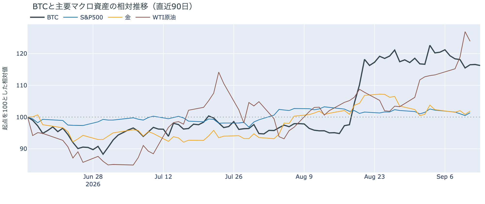

*図の見方: 同じ起点から何%動いたかで重ねたもの。線が同じ向きなら「一緒に動いた」、ビットコインだけ別の向きなら「自身の理由で動いた」と読みます。*

| この5営業日の動き（ビットコインは7日間） | 変化 |
|---|---:|
| ビットコイン | −4.1% |
| 金 | −1.8% |
| 米国株（S&P500） | −1.2% |
| 原油 | +9.6% |

* 証券市場が閉まっている48時間で、ビットコインは土曜0.6%、日曜1.3%しか動かなかった。
* 建玉は104,582BTC。前日の103,218BTCから1.3%増え、金曜の清算のあと初めて増えた。1週間では−2.8%。
* 資金調達率はプラスが25回連続（約8日）。上乗せは+2.16ptで、前日の+1.78ptより広がったが、直近30日の平均+3.58ptより小さい。

日曜日に価格が動かなかった理由は2つです。

1. 証券市場が閉まっていて、原油と金利からの影響が止まっていた。この1週間の下げはビットコイン・金・株がそろって下げ、原油だけが上げた並置で起きていたので、証券市場が止まればビットコインも止まる。
2. 金曜の清算で減ったロングが、日曜にわずかに積み直された。建玉（＝先物の未決済残高。証拠金で張っている人の量）は減り止まりから増加に転じ、資金調達率（＝ロングが払う金利。プラス＝ロングがショートより多い）はプラスのまま。1日をならした年率は+6.07%で、短期金利（13週Tビル 3.91%）を引いた上乗せは+2.16pt。

前日は「金曜の5%往復は一時的な押しで、買い手が引いたのではない」と説明しました。買い手が引いていたのなら、週末に建玉は減り続け、資金調達率はマイナスに沈むはずです。日曜は建玉が増え、資金調達率はプラスのままなので、前日の説明は今日の数値と合っています。市場の多数は、FOMC・日銀・法案の手続き投票が3日続く週を前に、ロングを少しだけ戻して待っています。

外部環境では、木曜にイラクからのドローン攻撃を受けてサウジアラビアが東西パイプライン（ホルムズ海峡を通らずに原油を出す経路）を止め、原油は1週間で約1割上げました。今日9月14日にはオマーンのサラーラで、ホルムズ海峡の航行をめぐるイランと湾岸6か国の外相会合が開かれます。原油は$100の水準にあり、リスク資産全体の重しになりうる状況は変わっていません。

## 3. 市場参加者はいまどう見ているか

### ① アメリカの買い手は「手を止めている」が続き、「逃げた」わけではない

**図①-1 Coinbase Premium（アメリカとそれ以外の価格差・直近90日）**

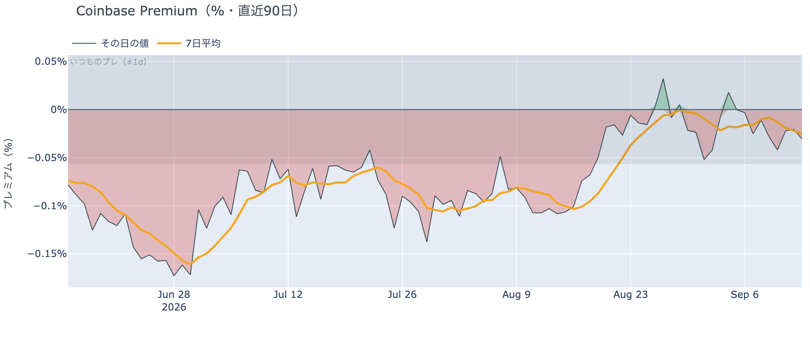

*図の見方: プラス＝アメリカで買いが強い。太線が1週間平均、細線がその日の値。薄い帯は「いつものブレの範囲」です。*

* 1週間平均は−0.026%。先週の−0.016%からわずかに下向き。8月中旬は−0.10%。
* その日の値は−0.030%で、いつものブレの範囲内。金曜に付けた−0.19%（いつものブレの3倍）の日から2日続けて帯の内側。

Coinbase Premium（＝アメリカとそれ以外の価格差）は、金曜に一度だけ大きくマイナスへ振れたあと、週末は落ち着いています。1週間平均はマイナスで、アメリカの買い手は先週より少し弱いままですが、8月中旬の水準まで戻ったわけではありません。

**図①-2 ETFの日ごとの資金の出入り（直近90日）**

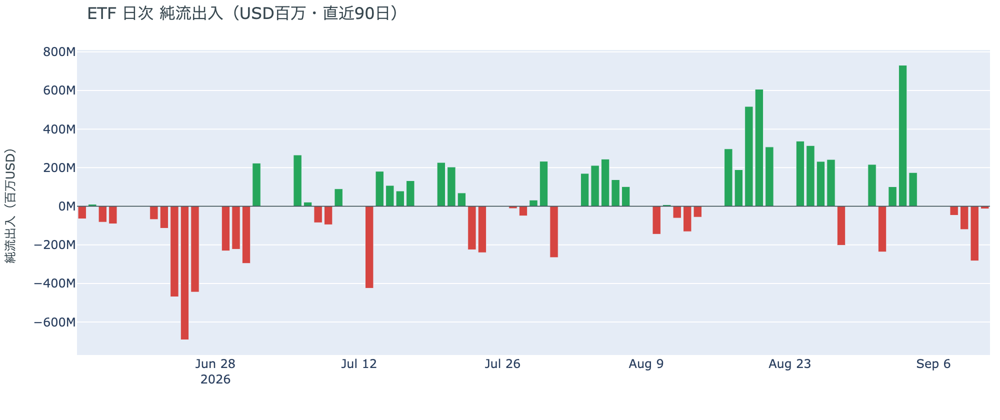

*図の見方: 入ったお金と出たお金の差。上に伸びれば入り超、下に伸びれば出超。*

| ETFの日ごとの出入り | 億ドル |
|---|---:|
| 9月8日 | −0.5 |
| 9月9日 | −1.2 |
| 9月10日 | −2.8 |
| 9月11日 | −0.1 |
| 直近7営業日の合計 | +5.4 |

ETFからの流出は4営業日続いていますが、最終日は前日の20分の1に縮みました。1週間の合計では入り超のままで、アメリカの買い手は手を止めているが、逃げてはいない、が今朝の読みです。週明けの集計で、この形が続くかどうかの最初の数値が出ます。

**図①-3 Fear & Greed（市場心理の指数・直近90日）**

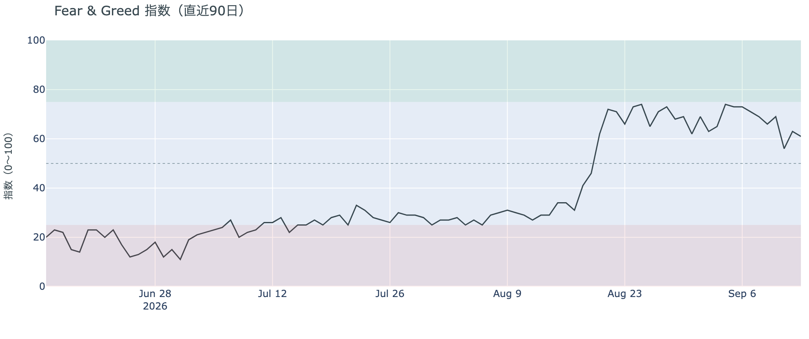

*図の見方: 0〜100で、50より上が「強欲」、下が「恐怖」。*

* 前日の63から2pt下がった。1週間前は73、1か月前は29。

市場心理は61の「強欲」で、金曜の夜の往復のあとも「恐怖」側には戻っていません。1週間で12pt下がったのは、週初めの$80,000台から$77,000台へ下げた分が心理に映ったもので、価格の下げを怖がっている人は多くありません。

### ② 長期保有者の売りは続いているが、勢いは2週間前より落ちている

**図②-1 長期保有者の保有量の30日変化とSOPR（直近60日）**

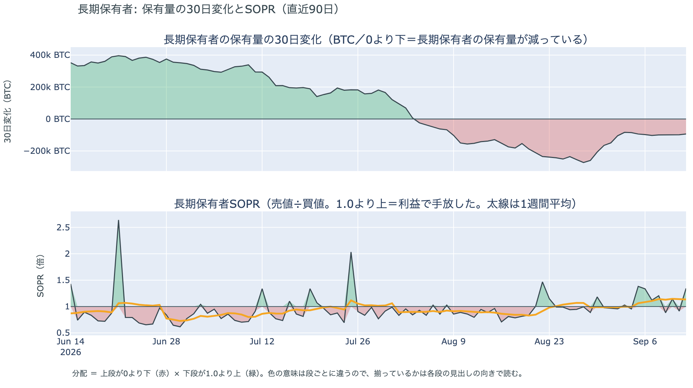

*図の見方: 上段は、長期保有者の保有量が30日でどれだけ増減したか。マイナス＝手放している。下段は長期保有者SOPRで、1より上なら利益で手放した。どちらも太線の1週間平均で読みます。*

| 9月12日時点 | 1週間平均 | 前の週の平均 |
|---|---:|---:|
| 長期保有者SOPR（1より上＝利益で手放した） | 1.14 | 1.06 |
| 長期保有者の保有量の30日変化（万BTC） | −9.9 | −12.7 |

* 減り方は前の週の8割弱、1か月前（−14.2万BTC）の7割。8月末（−27万BTC前後）の4割弱。
* 1年以上動いていないコインは全体の63.1%で、3か月で1.7pt増えた。売りに出てくるコインが少ない状態は続いている。

長期保有者（＝155日以上動かしていないコインの持ち主）は、利益の出ているコインを少しずつ手放し続けています。長期保有者SOPR（＝長期保有者が動かしたコインの売値÷買値）で見ると、動かしたコインは平均して買値より14%高く手放されました。保有量が減り、動いた分が利益側という2つがそろっているので、これは分配（＝長期保有者からの放出）です。ただし勢いは2週間前より落ちていて、この1週間で量は増えていません。週末の静けさは、長期保有者が急いでいない結果でもあります。**ビットコイン自身の需給の土台は、前日と変わっていません。** ETFや取引所が預かっている分を差し引いても、この規模と向きは変わりません。

今日は、コインが最後に動いた価格の分布に大きな変化がなく、長く眠っていたコインが動いた記録もありません。マイナーの収入は平年並み（Puell Multiple（＝マイナー収入の平年比）が1週間平均で1.00）で、売りを急ぐ状況ではありません。

### ③ 先物：減ったロングが、週明けを前にわずかに積み直された

**図③-1 資金調達率と建玉（直近30日）**

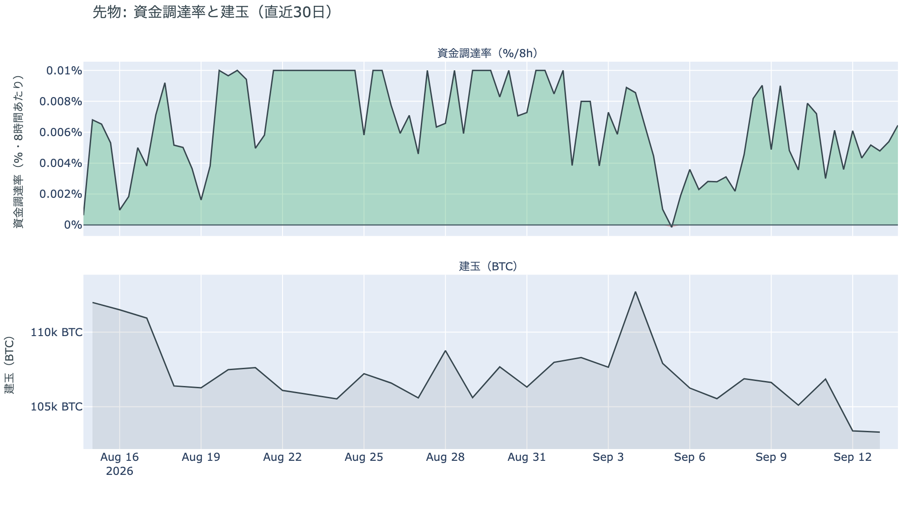

*図の見方: 上段は資金調達率（8時間ごと）。プラスが続く＝ロングがショートより多い。下段は建玉。*

* 資金調達率はプラスが25回連続（約8日）。ロングがショートより多い状態が続いている。
* 上乗せは+2.16pt。直近30日の平均+3.58ptより小さく、上限（8時間あたり±0.3%）にはほど遠い。
* 建玉は104,582BTC。金曜の清算で減った水準に1日とどまったあと、日曜に1.3%増えた。9月3日の急騰のときに積まれた分が消える前の水準には戻っていない。

金曜の夜の清算で1段減ったロング（証拠金の買い持ち）が、日曜にわずかに積み直されました。積み直した量は減った分の一部で、資金調達率の上乗せも30日平均より小さいままです。ロングに傾いてはいますが、過熱ではありません。FOMC・日銀・法案の手続き投票が3日続く週を前に、大きく張り直した人はいません。

### ④ オプション：9月25日のプットは再び高くなり、備えは FOMC のあとの満期すべてに並んだ

オプションには2種類あります。コール（＝決めた価格で買う権利）とプット（＝決めた価格で売る権利）で、価格が上がればコールの価値が上がり、価格が下がればプットの価値が上がります。プットは「価格が下がったときの保険」として買われます。

**図④-1 満期ごとのIV（年率%）**

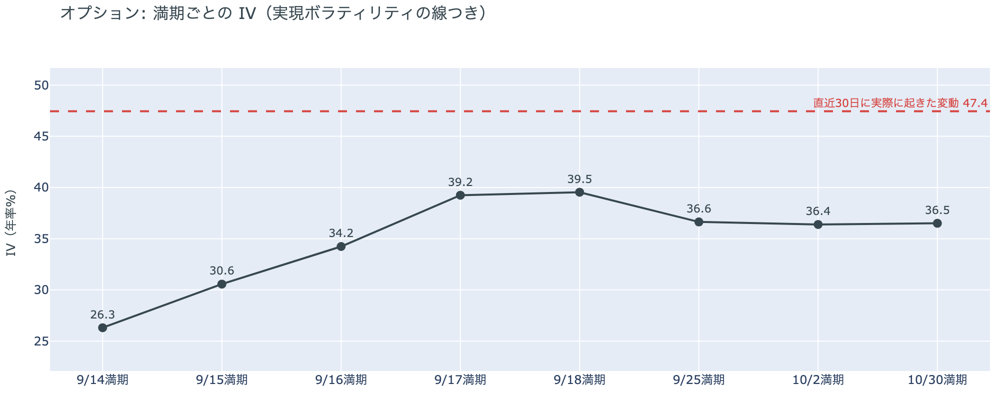

*図の見方: IVを満期ごとに並べたもの。点線は実現ボラティリティ。IVが点線より下なら、市場はこの先の値動きを過去の値動きより小さいと見ています。*

* IVは全体で38.1。実現ボラティリティ47.4より9.4pt低い。過去1年で見ると下から24%の位置。
* 満期ごとに見ると、手前が低く先が高い平常の形。FOMC と日銀の結果が出る9月17日と18日の満期が39台で、その先の9月25日の36.6よりわずかに高い。

IV（＝オプション価格から逆算した、この先の値動きの幅の予想）は実現ボラティリティ（＝直近30日に実際に起きた値動きの幅）より低く、市場はこの先の値動きを、過去の値動きより小さいと見ています。守りを固めている状態ではなく、怖がってもいません。FOMC と日銀の結果が出る17日と18日の満期だけ少し高いのは、参加者がその直後の値動きにだけ上乗せを付けているためで、その先の満期にはその上乗せが乗っていません。

**図④-2 満期ごとのプットとコールの差**

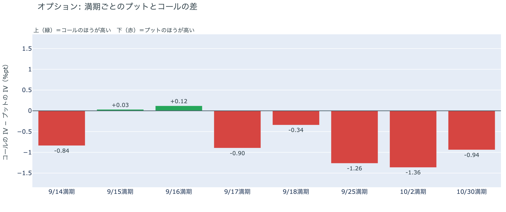

*図の見方: 満期ごとに、プットとコールのどちらが高く売れているか。ゼロより上ならコールのほうが高く、下ならプットのほうが高い。*

| 満期 | どちらが高いか |
|---|---|
| 9月14日（本日） | プットがわずかに高い |
| 9月15日 | ほぼ差なし（コールがわずかに高い） |
| 9月16日 | ほぼ差なし（コールがわずかに高い） |
| 9月17日 | プットが高い |
| 9月18日 | プットが高い |
| 9月25日 | プットが高い（前日はほぼ差なし） |
| 10月2日 | プットが高い |
| 10月30日 | プットが高い |

* 前日に「コールがはっきり高い」だった9月15日は、ほぼ差なしまで縮んだ。
* プットのほうが高くなる最初の満期は9月17日で、FOMCの結果が出る日と重なる。

前日は「9月25日満期でプットが高かった値付けは、物価統計の夜に一晩だけ乗った上乗せだった」と説明しました。日曜に9月25日のプットは再びコールより高くなり、持ち高（図④-3）は変わっていないので、この説明は取り下げます。上乗せは一晩ではなく、FOMC の結果が出る9月17日から先の満期すべてに並んでいます。参加者は、法案の投票とFOMCの結果までの2日間は荒れないと値付けし、備えを FOMC のあとの満期に置き直しました。9月15日でコールが高かった分も縮んだので、法案の投票に「価格が上がる」を賭ける動きは弱まっています。

**図④-3 9月25日満期の持ち高（権利の価格ごと）**

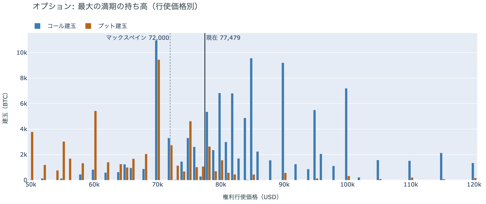

*図の見方: 青＝コール、橙＝プット。現値より上にコールが、下にプットが積まれるのが普通です。*

| 9月25日満期のオプション（価格は約$77,000） | 量（万BTC） | 意味 |
|---|---:|---|
| コール（決めた価格で買う権利） | 約9.4 | 「価格が上がる」に賭けた分 |
| プット（決めた価格で売る権利） | 約5.5 | 「価格が下がる」への保険 |
| うち、いまより15%以上高い価格のコール | 約4.9 | 大きな上げへの賭け |
| うち、いまより15%以上安い価格のプット | 約3.0 | 大きな下げへの保険 |

* 9月25日満期の持ち高は全部で185,134BTCと、全満期の45%。コールがプットの1.7倍で、前日とほぼ同じ形。
* 持ち高が集まっている価格は、多い順に$78,000、$80,000、$75,000。

「価格が上がる」に賭けた人たちは降りていません。プットの値段が上がった日曜も、持ち高の形は前日と変わらず、備えを買い足したのではなく値付けだけが動いた1日でした。この賭けが報われるには、9月25日までに、オプションの持ち高が集まっている$75,000〜$80,000の帯の上端$80,000を超える必要があります。いまの価格はその帯の中にあります。

## 4. 価格に影響しうる直近のイベント

予測ではなく、「次に市場が反応しうる材料」の案内です。オプション市場が備えを置いているのは9月17日以降の満期で、法案の投票とFOMCの結果までの2日間には、今朝の時点で備えの値段が付いていません。

| 日付 | イベント | 何に効くか |
|---|---|---|
| 9/14（月） | ホルムズ海峡の航行をめぐるイランと湾岸6か国の外相会合（オマーン・サラーラ）。米国抜きで暫定合意を協議 | 原油。サウジの東西パイプラインは木曜の攻撃以来止まったまま |
| 9/15（火）〜16（水） | FOMC（＝米国の金利を決める会合）。0.25%利上げの織り込みは6〜9割。結果は日本時間17日早朝 | 金利。オプションの備えはこの結果の直後の満期から始まる |
| 9/16（水）3:15 日本時間 | 米上院でCLARITY法案（＝暗号資産の市場構造法案）を審議に進めるかの手続き投票。60票が必要 | 規制。否決なら年内の審議は止まると報じられている |
| 9/17（木）〜18（金） | 日銀の会合。0.25%の利上げを見込む予想が大勢 | 円 |
| 9/25（金）17:00 | オプションの大きな満期（約18.5万BTC、全満期の45%） | 「価格が上がる」に賭けた人たちの期限 |

## まとめ：日曜日の動きは何だったか

日曜日は、証券市場が止まったまま、ビットコインを張っている人たちがロングを少しだけ戻した日でした。建玉は金曜の清算で減った水準から1.3%増え、清算は大口が1つ飛んだだけ、長期保有者は前日と同じ姿。ビットコイン自身の需給は変わっていません。変わったのは一つ、**9月25日満期のプットが再びコールより高くなり、備えが FOMC の結果が出る17日から先の満期すべてに並んだ**こと。前日の「一晩だけの上乗せ」という説明は取り下げ、参加者は「FOMC までの2日間は荒れない、そのあとは備える」と値付けし直したと読みます。コールの持ち高はそのまま残り、アメリカの買い手は「手を止めている」が続き、「逃げた」とは言えません。今週動くのは外部環境のほうで、法案の投票・FOMC・日銀の3つの結果を、移動平均のクロス・アメリカの買い・ETF・市場心理の同じ物差しで見ます。

---

*本稿は情報提供を目的としたものであり、投資助言ではありません。将来の価格動向を保証・示唆するものではなく、投資判断は各自の責任において行ってください。*
