# 利上げ判断を2日後に控え、株と金が下げた月曜にビットコインは+2.7% ― ショートの清算を伴って$79,600まで戻し、9月25日のプットは再びコールより安くなった

**2026年9月15日**

月曜日は、証券市場と反対の向きに動いた日です。株と金が下げ、原油が上げた夜に、ビットコインは24時間で+2.7%と、先週金曜の下げをほぼ取り返しました。上げたのは新しい買い手が入ったからではなく、売り持ち（ショート）にしていた人が清算（＝証拠金不足で強制的に閉じられた取引）され、その買い戻しで価格が押し上げられたためです。建玉は増えておらず、ビットコイン自身の需給の土台は前日と同じ姿です。変わったことは一つで、**前日に「会合のあとの満期すべて」に並んでいたプットの値段が、価格が上がると9月25日の満期まで剥がれ、備えが残るのは再び10月2日以降の満期だけ**になりました。今夜から3日続けて、法案の手続き投票・米国の利上げ判断・日銀の会合の結果が出ます。

（数値は9月15日7時5分（日本時間）までのデータに基づきます。価格・先物・オプションはその時点の値、市場心理は9月14日の確定値、オンチェーン（＝ブロックチェーン上の記録）は9月13日時点、ETF資金フローは9月11日分までで、週明け9月14日分はまだ集計されていません。証券市場の終値は9月14日時点です。オンチェーンの長期保有者の数値には、ETFや取引所が預かっている分も含まれます。オプションはDeribit（BTCオプションの大半を占める取引所）の全銘柄です。）

## 1. 何が起きたか

**図1-1 価格の推移（1時間足・直近7日）**

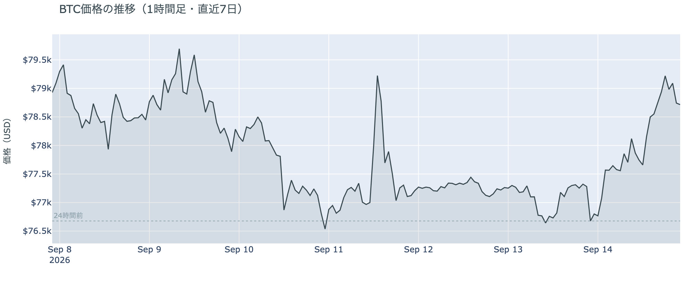

*図の見方: 1時間ごとの価格。金曜の夜の山谷と週末の平らな線のあと、月曜の昼から線が右上がりになっています。*

* 朝7時5分の時点で約$78,716。24時間で+2.7%、値幅は$76,347〜$79,591の4.2%。週末2日分の値幅（0.6%と1.3%）を合わせた倍以上。
* 1週間前と比べると−0.5%、1か月前と比べると+24.9%。金曜の下げは月曜でほぼ埋まった。
* 上げは日本時間14日の昼から15日の明け方5時まで段階的に続き、一気に跳ねた形ではない。

月曜の上げは、金曜の5%往復の下げた側を、1日でほぼ取り返す動きでした。米国の証券市場が開いて株と金が下げていた時間帯にも上げ続けていて、株や金の値動きに引かれた形ではありません。

**図1-2 価格と50日・200日移動平均**

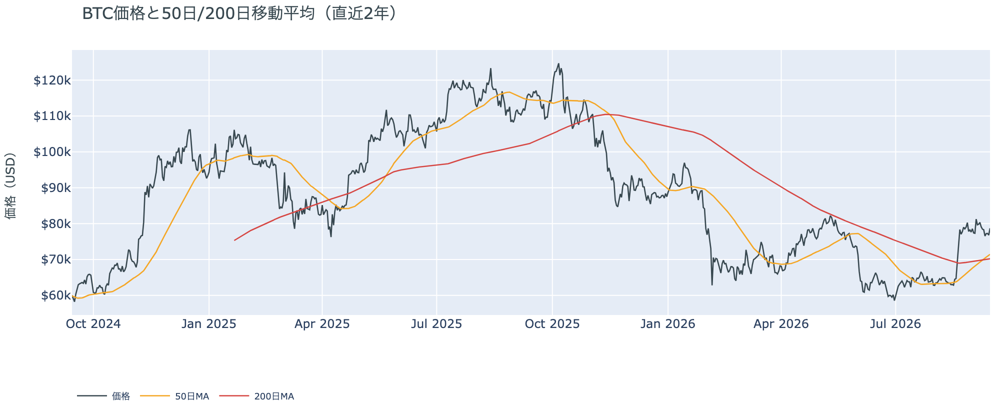

*図の見方: 2本の平均線の上下関係が「並び」で、50日線が上なら上向きです。*

* 並びは上向きで7日目。50日線が200日線の上にあり、差は約$1,232（1.8%）で、前日の$1,025からさらに開いた。
* 価格は50日線の約10%上。

金曜の5%往復と週末の足踏み、月曜の反発を経て、50日線が200日線の上にある並びは崩れていません。差は日ごとに開いていて、価格が50日線を1割上回ったまま推移しているためです。

**図1-3 価格と清算（直近24時間）**

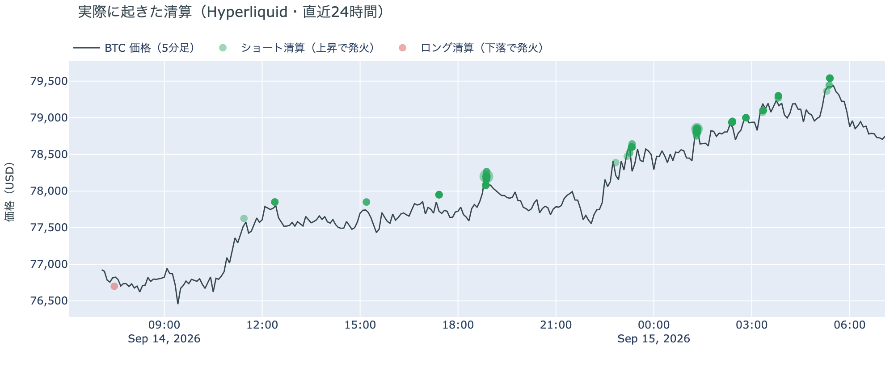

*図の見方: 価格の推移に、清算が起きた時刻を点で重ねたもの。緑がショートの清算、赤がロングの清算で、点が固まっている時間帯に清算が集中しています。*

* Hyperliquid（＝オンチェーンの先物取引所）で見える清算は、この24時間で184件。98%がショート側。
* 14日の18時台に全体の36%が集中し、価格帯は78,000ドル台が8割。その後も15日の明け方まで、上げの段ごとに発火が続いた。最大の1件は全体の22%で、大口1件ではなく多数に分かれている。

月曜の上げはショートの清算を伴っていました。金曜の夜に焼けたのがロングだったのに対し、月曜に焼けたのはショートで、しかも1件の大口ではなく多数のアドレスです。価格が$78,000を上抜けた時間帯を皮切りに、下げに賭けていた人たちが上げの段ごとに買い戻しを迫られた形です。

証券市場は週明けに反対の向きでした。9月14日の終値は、S&P500が−0.5%、金は−1.6%、原油は+1.8%で$101.89、米10年債利回りは4.96%。VIX（＝株式市場の恐怖指数）は+8%でした。

## 2. なぜ動いたか：ビットコイン自身の需給か、外部環境か

**図2-1 ビットコインと株・金・原油の相対推移（起点＝100）**

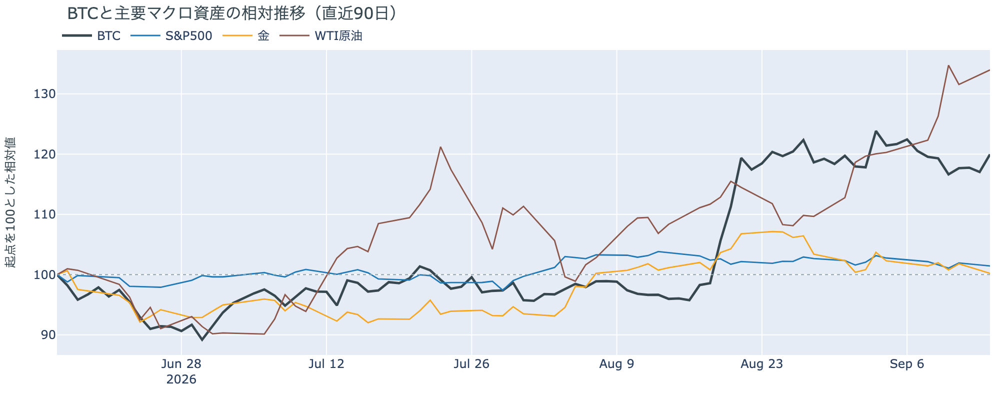

*図の見方: 同じ起点から何%動いたかで重ねたもの。線が同じ向きなら「一緒に動いた」、ビットコインだけ別の向きなら「自身の理由で動いた」と読みます。*

| この5営業日の動き（ビットコインは7日間） | 変化 |
|---|---:|
| ビットコイン | −0.5% |
| 金 | −2.0% |
| 米国株（S&P500） | −1.3% |
| 原油 | +11.4% |

* 月曜9月14日は、株と金が下げ、VIXが上がり、原油が上がった。証券市場は「守り」の並びで、ビットコインはその逆の+2.7%。
* 建玉は104,483BTC。前日の104,582BTCとほぼ同じで、1週間では−0.6%。上げたのに増えていない。
* 資金調達率はプラスが28回連続（約9日）。上乗せは前日の+2.16ptから広がった。

月曜日にビットコインが上げた理由は、ビットコイン自身の需給にあります。理由は2つです。

1. ショートの清算を伴う買い戻しで価格が押し上げられた。建玉（＝先物の未決済残高。証拠金で張っている人の量）は増えておらず、新しいロング（買い持ち）が積まれたのではなく、ショートが閉じられて減った分をロングの積み直しが埋めた形。資金調達率（＝ロングが払う金利。プラス＝ロングがショートより多い）は上がり、1日をならした年率は+7.09%で、短期金利（13週Tビル 3.93%）を引いた上乗せは+3.15pt。ロング側への傾きが強まった。
2. 証券市場は反対の向きだった。株と金が下げ、原油が上げた「守り」の並びのなかで、ビットコインだけが上げた。外部環境に押されたのなら、株や金と同じ向きに動くはずで、そうなっていない。

この説明が違うなら、つまりショートの買い戻しではなく新しい買い手が入っていたのなら、建玉が増え、9月14日分のETFの出入りが入り超で出ます。建玉は今朝の時点で横ばいで、ETFの9月14日分はまだ数値がありません。

外部環境では、週末に中東で新しい動きがありました。日曜にホルムズ海峡で商船が攻撃されて1人が死亡し、木曜の攻撃で止まったサウジアラビアの東西パイプライン（ホルムズ海峡を通らずに原油を出す経路）は止まったままです。9月14日にオマーンのサラーラで予定されていたイランと湾岸6か国の外相会合は、サウジアラビアの要請で延期され、次の日程は決まっていません。原油は$100を超えた水準で高止まりしていて、リスク資産全体の重しになりうる状況は続いています。

## 3. 市場参加者はいまどう見ているか

### ① アメリカの買い手は「手を止めている」が続き、月曜の上げを主導したわけではない

**図①-1 Coinbase Premium（アメリカとそれ以外の価格差・直近90日）**

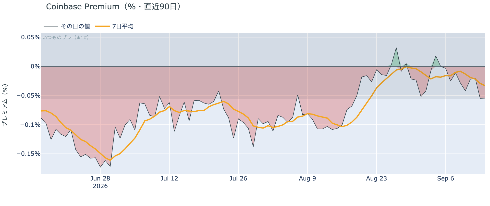

*図の見方: プラス＝アメリカで買いが強い。太線が1週間平均、細線がその日の値。薄い帯は「いつものブレの範囲」です。*

* 1週間平均は−0.033%。先週の−0.016%から下向きで、8月中旬の−0.10%よりは浅い。
* その日の値は−0.055%で、いつものブレの範囲内。金曜に付けた−0.19%の日から3日続けて帯の内側。

Coinbase Premium（＝アメリカとそれ以外の価格差）は月曜もマイナスで、上げた日にアメリカ側の買いが強まった形は出ていません。1週間平均は先週より少し弱く、アメリカの買い手は月曜の上げを主導していません。買い戻しが上げの中心だったという読みと合っています。

**図①-2 ETFの日ごとの資金の出入り（直近90日）**

*図の見方: 入ったお金と出たお金の差。上に伸びれば入り超、下に伸びれば出超。*

| ETFの日ごとの出入り | 億ドル |
|---|---:|
| 9月8日 | −0.5 |
| 9月9日 | −1.2 |
| 9月10日 | −2.8 |
| 9月11日 | −0.1 |
| 直近7営業日の合計 | +5.4 |

ETFの数値は9月11日分までで、週明け9月14日分はまだ出ていません。確定している範囲では流出が4営業日続き、最終日に縮んだ形のまま。1週間の合計では入り超で、アメリカの買い手は手を止めているが、逃げてはいない、という読みは前日から変わりません。

**図①-3 Fear & Greed（市場心理の指数・直近90日）**

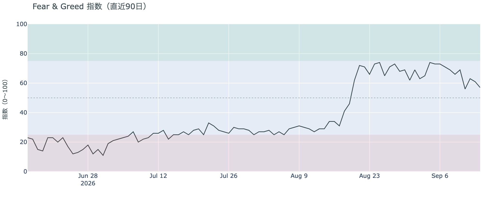

*図の見方: 0〜100で、50より上が「強欲」、下が「恐怖」。*

* 前日の61から4pt下がった。1週間前は71、1か月前は34。

市場心理は57の「強欲」で、1週間で14pt下がりましたが「恐怖」側には入っていません。下がった分は、週初めの$80,000台から金曜の$76,000台へ下げた値動きが映ったもので、月曜の反発はまだ数値に入っていません。価格の下げを怖がっている人は多くありません。

### ② 長期保有者の分配は続いているが、量は1か月で3割縮んだ

**図②-1 長期保有者の保有量の30日変化とSOPR（直近60日）**

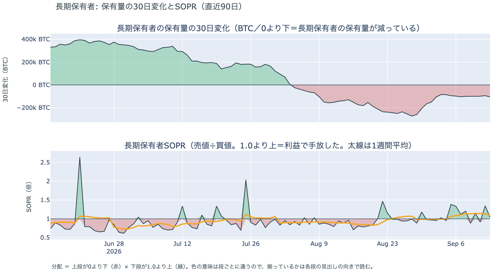

*図の見方: 上段は、長期保有者の保有量が30日でどれだけ増減したか。マイナス＝手放している。下段は長期保有者SOPRで、1より上なら利益で手放した。どちらも太線の1週間平均で読みます。*

| 9月13日時点 | 1週間平均 | 前の週の平均 |
|---|---:|---:|
| 長期保有者SOPR（1より上＝利益で手放した） | 1.09 | 1.09 |
| 長期保有者の保有量の30日変化（万BTC） | −10.0 | −11.1 |

* 減り方は1か月前（−13.8万BTC）の7割、8月末（−27万BTC前後）の4割弱。この1週間は−10万BTC前後で横ばい。
* 1年以上動いていないコインは全体の63.1%で、3か月で1.7pt増えた。売りに出てくるコインが少ない状態は続いている。

長期保有者（＝155日以上動かしていないコインの持ち主）は、利益の出ているコインを少しずつ手放し続けています。長期保有者SOPR（＝長期保有者が動かしたコインの売値÷買値）で見ると、動かしたコインは平均して買値より9%高く手放されました。保有量が減り、動いた分が利益側という2つがそろっているので、これは分配（＝長期保有者からの放出）です。ただし量は1か月で3割縮み、この1週間は横ばいです。月曜の上げに長期保有者の売りが厚く乗った形は、9月13日時点の数値には出ていません。**ビットコイン自身の需給の土台は、前日と変わっていません。** ETFや取引所が預かっている分を差し引いても、この規模と向きは変わりません。

今日は、コインが最後に動いた価格の分布に大きな変化がなく、長く眠っていたコインが動いた記録もありません。マイナーの収入は平年並み（Puell Multiple（＝マイナー収入の平年比）が1週間平均で0.98）で、売りを急ぐ状況ではありません。

### ③ 先物：ショートが閉じられた分をロングが埋め、建玉は増えていない

**図③-1 資金調達率と建玉（直近30日）**

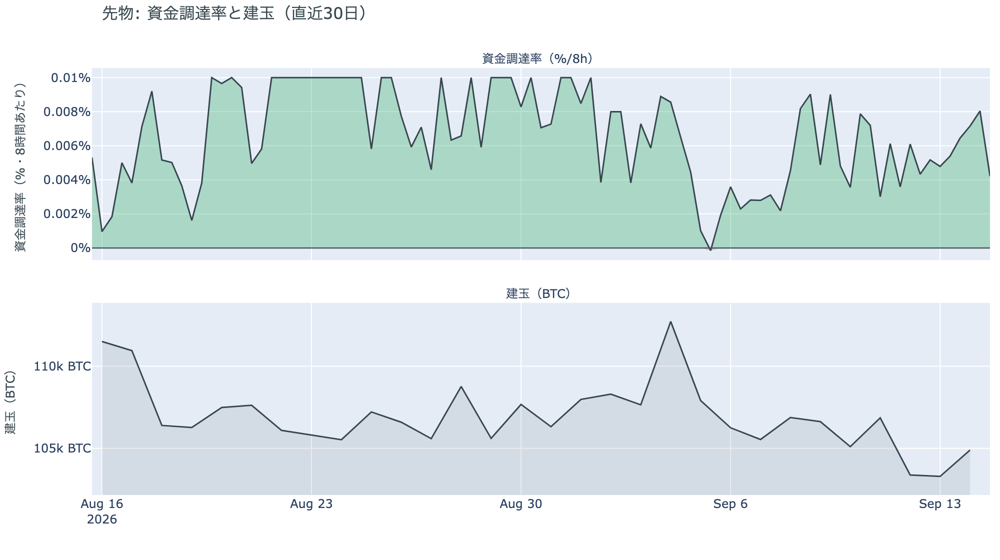

*図の見方: 上段は資金調達率（8時間ごと）。プラスが続く＝ロングがショートより多い。下段は建玉。*

* 資金調達率はプラスが28回連続。ロングがショートより多い状態が9日続いている。
* 上乗せは直近1か月の平均+3.46ptとほぼ同じ水準に戻った。上限（8時間あたり±0.3%）にはほど遠い。
* 建玉は104,483BTC。金曜の清算で減った水準から日曜に1.3%増えたあと、月曜は横ばい。9月3日の急騰のときに積まれた分が消える前の水準には戻っていない。

月曜にショートが清算されて減った分を、ロングの積み直しが同じ量だけ埋めました。建玉が横ばいで資金調達率の上乗せだけが広がったのは、この入れ替わりの結果です。前日は「会合が3つ並ぶ週を前に、ロングを少しだけ戻して待っている」と説明しました。月曜も建玉は増えておらず、大きく張り直した人はいないので、前日の説明は今日の数値と合っています。ロングへの傾きは1週間前より強まりましたが、過熱ではありません。

### ④ オプション：プットの値段は価格に追随して剥がれ、備えは再び10月2日以降の満期だけ

オプションには2種類あります。コール（＝決めた価格で買う権利）とプット（＝決めた価格で売る権利）で、価格が上がればコールの価値が上がり、価格が下がればプットの価値が上がります。プットは「価格が下がったときの保険」として買われます。

**図④-1 満期ごとのIV（年率%）**

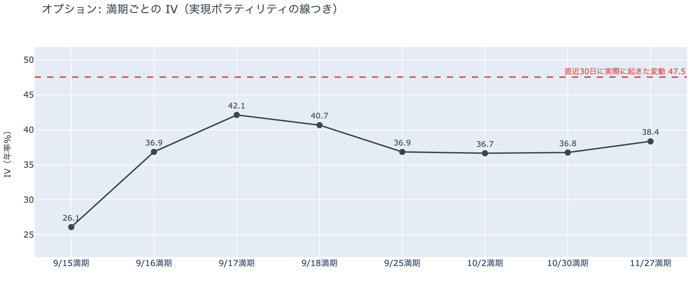

*図の見方: IVを満期ごとに並べたもの。点線は実現ボラティリティ。IVが点線より下なら、市場はこの先の値動きを過去の値動きより小さいと見ています。*

* IVは全体で38.9。実現ボラティリティ47.5より8.7pt低い。過去1年で見ると下から26%の位置。
* 満期ごとに見ると、FOMCの結果が出る9月17日の満期が42.1で一番高く、翌18日が40.7。その先の9月25日は36.9で、10月以降と同じ水準。

IV（＝オプション価格から逆算した、この先の値動きの幅の予想）は実現ボラティリティ（＝直近30日に実際に起きた値動きの幅）より低く、市場はこの先の値動きを、過去の値動きより小さいと見ています。守りを固めている状態ではなく、怖がってもいません。FOMC（＝米国の金利を決める会合）の結果が出る17日の満期だけが一段高いのは、参加者が会合の直後の値動きにだけ値段を付けているためで、その先の満期には乗っていません。17日の満期は前日の39台から42まで上がり、参加者が会合の直後の値動きに見る幅は1日で広がりました。

**図④-2 満期ごとのプットとコールの差**

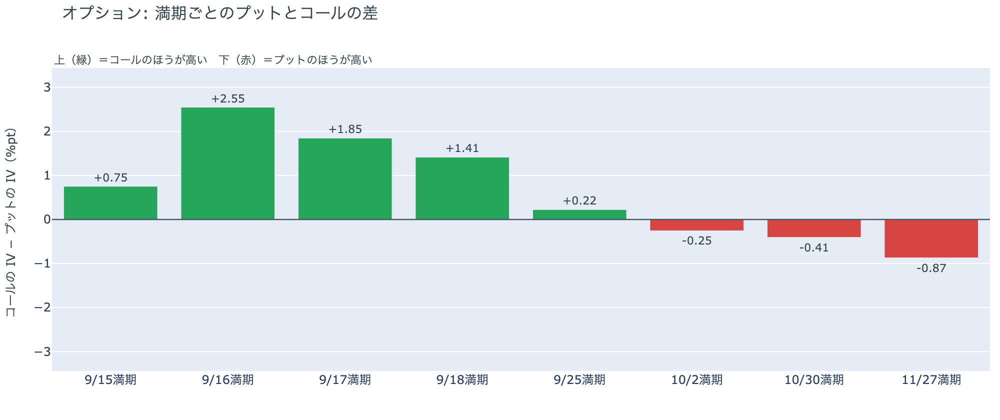

*図の見方: 満期ごとに、プットとコールのどちらが高く売れているか。ゼロより上ならコールのほうが高く、下ならプットのほうが高い。*

| 満期 | どちらが高いか |
|---|---|
| 9月15日 | コールが高い |
| 9月16日 | コールがはっきり高い |
| 9月17日 | コールが高い（前日はプットが高かった） |
| 9月18日 | コールが高い（前日はプットが高かった） |
| 9月25日 | ほぼ差なし（コールがわずかに高い。前日はプットが高かった） |
| 10月2日 | プットが高い |
| 10月30日 | プットが高い |
| 11月27日 | プットが高い |

* プットのほうが高くなる最初の満期は10月2日。土曜の形に戻った。
* 法案の投票をまたぐ9月16日の満期でコールがはっきり高い。

前日は「9月25日満期のプットが再びコールより高くなり、備えが会合の結果が出る17日から先の満期すべてに並んだ」と説明しました。月曜に価格が2.7%上がると、17日・18日・25日の満期はコールのほうが高い側に戻り、持ち高（図④-3）は変わっていません。プットの値段は、金曜と日曜の下げた日に付き、月曜の上げた日に剥がれています。持ち高が動かないまま値付けだけが日替わりで動いているので、「備えを買い足した」ではなく「プットの値段が価格の上下に追随している」と説明し直します。会合の前から備えを置き続けている参加者は、10月2日以降の満期にだけいます。9月16日でコールがはっきり高いのは、法案の投票に「価格が上がる」を賭けている人がいる形で、前日に縮んだ分が戻りました。

**図④-3 9月25日満期の持ち高（権利の価格ごと）**

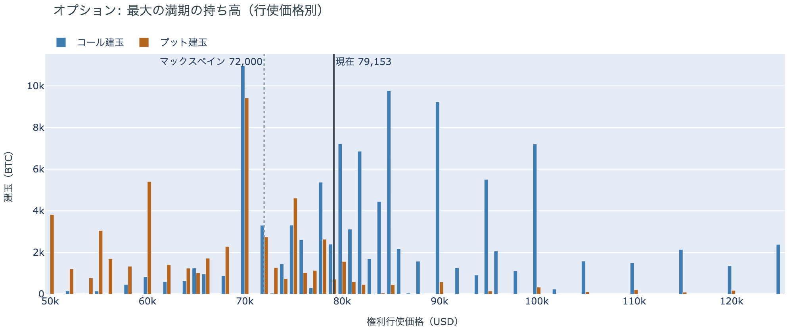

*図の見方: 青＝コール、橙＝プット。現値より上にコールが、下にプットが積まれるのが普通です。*

| 9月25日満期のオプション（価格は約$79,000） | 量（万BTC） | 意味 |
|---|---:|---|
| いまより高い価格のコール（決めた価格で買う権利） | 約8.6 | 「価格が上がる」に賭けた分 |
| いまより安い価格のプット（決めた価格で売る権利） | 約5.8 | 「価格が下がる」への保険 |
| うち、いまより15%以上高い価格のコール | 約4.0 | 大きな上げへの賭け |
| うち、いまより15%以上安い価格のプット | 約3.2 | 大きな下げへの保険 |

* 9月25日満期の持ち高は全部で185,908BTCと、全満期の44%。前日の185,134BTCとほぼ同じ。コールがプットの1.9倍。
* 持ち高が集まっている価格は、多い順に$80,000、$78,000、$82,000。価格が上がった分、帯の中心が$2,000上に移った。

「価格が上がる」に賭けた人たちは降りていません。月曜に価格が$78,000を上抜けたことで、その行使価格のコールは「いまより安い」側に回り、表の上の行が前日より小さく見えますが、持ち高の総量は変わっていません。この賭けが報われるには、9月25日までに、オプションの持ち高が集まっている$78,000〜$82,000の帯の中心$80,000を超える必要があります。いまの価格はその帯の中にあり、$80,000まで1.6%です。9月13日時点の分布で見ると、$80,000〜$90,000でコインが最後に動いた供給は全体の9%で、このすぐ上の帯が価格より上では一番厚い帯です。

## 4. 価格に影響しうる直近のイベント

予測ではなく、「次に市場が反応しうる材料」の案内です。オプション市場が備えを置いているのは10月2日以降の満期で、今夜から3日続く法案の投票・FOMC・日銀の3つの結果と9月25日の満期までの区間には、今朝の時点で備えの値段が付いていません。17日の満期だけがIVで一段高く、FOMCの結果の直後だけに値段が乗っています。

| 日付 | イベント | 何に効くか |
|---|---|---|
| 9/15（火） | 週明け9月14日分のETFの出入りが集計される | アメリカの買い手が月曜の上げに加わったかどうかの最初の数値。建玉が横ばいのままなら、上げは買い戻しによる一時的なもの |
| 9/16（水）3:15 日本時間 | 米上院でCLARITY法案（＝暗号資産の市場構造法案）を審議に進めるかの手続き投票。60票が必要で、共和党53議席に民主党から7人以上の賛成が要る。日曜夜に倫理条項を足した修正文が公表された | 規制。否決なら年内の審議は止まると報じられている。9月16日満期でコールがはっきり高いのはこの日 |
| 9/17（木）3:00 日本時間 | FOMCの結果。0.25%利上げの織り込みは8割超（現在の政策金利は3.50〜3.75%） | 金利。IVが一段高いのはこの満期だけ |
| 9/18（金） | 日銀の会合の結果。0.25%の利上げ（1.25%へ）を見込む予想がほぼ全員 | 円 |
| 日程未定 | ホルムズ海峡の航行をめぐるイランと湾岸6か国の外相会合（9月14日の予定をサウジアラビアの要請で延期） | 原油。東西パイプラインは木曜の攻撃以来止まったまま |
| 9/25（金）17:00 | オプションの大きな満期（約18.6万BTC、全満期の44%） | 「価格が上がる」に賭けた人たちの期限 |

## まとめ：月曜日の動きは何だったか

月曜日は、証券市場が「守り」に動いた夜に、ビットコインだけが逆の向きに動いた日でした。上げの中心はショートの清算を伴う買い戻しで、建玉は増えず、アメリカの買い手は手を止めたまま、長期保有者は1週間横ばい。ビットコイン自身の需給は変わっていません。変わったのは一つ、**前日に会合のあとの満期すべてに並んでいたプットの値段が、上げた日に9月25日の満期まで剥がれ、備えが10月2日以降の満期にだけ残った**こと。持ち高が動かないまま値付けだけが日替わりで動いているので、参加者は備えを買い足したのではなく、価格の上下に合わせてプットの値段を付け直しているだけです。コールの持ち高はそのまま残り、「価格が上がる」に賭けた人たちは降りていません。需給が変わっていない日は、何もしなくてよい日です。今夜から3日続く法案の投票・FOMC・日銀の結果を、移動平均の並び・アメリカの買い・ETF・市場心理の同じ物差しで見ます。

---

*本稿は情報提供を目的としたものであり、投資助言ではありません。将来の価格動向を保証・示唆するものではなく、投資判断は各自の責任において行ってください。*
