# 上院で法案が否決された夜に−4%、清算されたのはロング ― 建玉は減らずに増え、プットは再び FOMC のあとの満期すべてで高くなった

**2026年9月16日**

火曜日は、外部環境に押された日です。ただし押したのは株や金にも効く出来事ではなく、ビットコインだけに効く出来事——米上院で暗号資産の市場構造法案が手続き投票で否決されたこと——で、株と金は0.5%も動いていません。ビットコインは24時間で−4%。FOMC の結果を翌日に控えて日中にじりじり下げ、否決が伝わった日本時間16日の3時台に$74,900まで一段下げました。清算（＝証拠金不足で強制的に閉じられた取引）されたのは買い持ち（ロング）で、それでも建玉は減るどころか増えています。下げた日にプットの値段は再び高くなり、**備えは FOMC の結果が出る17日から先の満期すべてに並びました**。持ち高は動いていません。

（数値は9月16日7時5分（日本時間）までのデータに基づきます。価格・先物・オプションはその時点の値、市場心理は9月15日の確定値、オンチェーン（＝ブロックチェーン上の記録）は9月14日時点、ETF資金フローは9月14日分まで確定し、15日分は集計途中です。証券市場の終値は9月15日時点です。オンチェーンの長期保有者の数値には、ETFや取引所が預かっている分も含まれます。オプションはDeribit（BTCオプションの大半を占める取引所）の全銘柄です。）

## 1. 何が起きたか

**図1-1 価格の推移（1時間足・直近7日）**

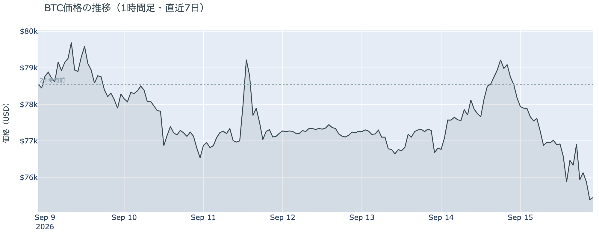

*図の見方: 1時間ごとの価格。月曜の右上がりの線が火曜の朝を頂点に折れ、火曜は一日かけて右下がり、16日の未明に一段深い谷があります。*

* 朝7時5分の時点で約$75,444。24時間で−4.0%、値幅は$74,888〜$78,564の4.9%。月曜の反発（+2.7%）を1日で消した。
* 1週間前と比べると−3.8%、1か月前と比べると+20.1%。
* 下げは2段。日本時間15日の朝5時の$79,600を頂点に日中じりじり下げて夜11時に$75,900、そのあと16日の3時台に$74,888まで一段下げて、$75,400前後で朝を迎えた。

火曜の下げは、月曜の反発を1日で消し、先週金曜の安値も下回りました。日中の下げにはきっかけになる一つの出来事がなく、FOMC の結果を待つ時間帯にじりじり下げた形です。16日3時台の一段の下げは、米上院の手続き投票の否決が伝わった時刻と重なります。

**図1-2 価格と50日・200日移動平均**

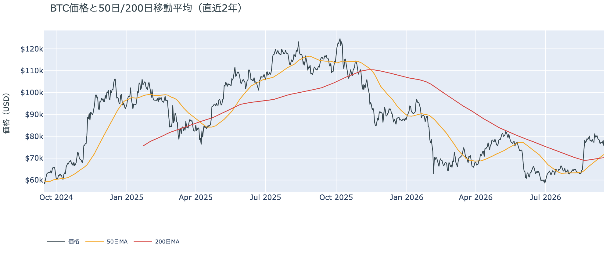

*図の見方: 2本の平均線の上下関係を見ます。50日線が200日線の上にあるのがゴールデンクロスです。*

* 50日線が200日線を上抜けてから8日目。差は約$1,411（2.0%）で、前日の$1,232からさらに開いた。
* 価格は50日線の約5%上。前日は約10%上だった。

火曜の下げでも、ゴールデンクロス（＝50日線が200日線を上抜けること）の状態は崩れていません。差は日ごとに開き続けています。ただ価格と50日線の距離は1日で半分に縮み、50日線$71,649までは5%です。

**図1-3 価格と清算（直近24時間）**

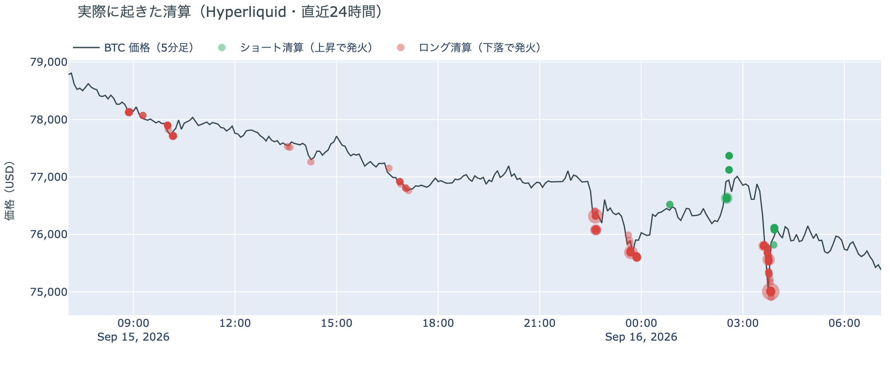

*図の見方: 価格の推移に、清算が起きた時刻を点で重ねたもの。緑がショートの清算、赤がロングの清算で、点が固まっている時間帯に清算が集中しています。*

* Hyperliquid（＝オンチェーンの先物取引所）で見える清算は、この24時間で587件。8割がロング側。
* 16日の3時台に全体の半分が集中し、価格帯は75,000ドル台が6割。最大の1件は全体の27%で、大口1件ではなく多数に分かれている。

火曜の下げはロングの清算を伴っていました。月曜に清算されたのがショートだったのに対し、火曜に清算されたのはロングで、1件の大口ではなく多数のアドレスです。集中したのは法案の否決が伝わった16日3時台の一段の下げで、$75,000台で証拠金のロングが閉じられました。

証券市場は小幅でした。9月15日の終値は、S&P500が−0.5%、金は−0.4%、原油は+4.0%で$105.48、米10年債利回りは5.00%でした。

## 2. なぜ動いたか：ビットコイン自身の需給か、外部環境か

**図2-1 ビットコインと株・金・原油の相対推移（起点＝100）**

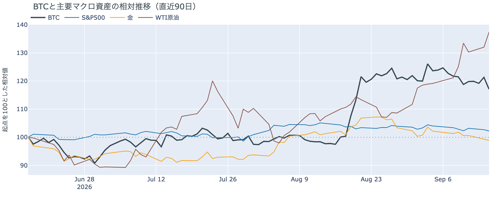

*図の見方: 同じ起点から何%動いたかで重ねたもの。線が同じ向きなら「一緒に動いた」、ビットコインだけ別の向きなら「自身の理由で動いた」と読みます。*

| この5営業日の動き（ビットコインは7日間） | 変化 |
|---|---:|
| ビットコイン | −3.8% |
| 金 | −2.4% |
| 米国株（S&P500） | −1.1% |
| 原油 | +13.4% |

* 火曜9月15日は、株と金がともに0.5%未満の下げで、原油は+4.0%。証券市場の動きは「まちまち」。
* 建玉は108,096BTC。前日の104,483BTCから+3.5%で、1日の増え方は9月3日の急騰の日以来で一番大きい。1週間では−3.1%。
* 資金調達率はプラスが31回連続。1日をならした年率は+7.14%で、短期金利（＝ドルを米国の短期国債で持つだけで受け取れる金利。13週Tビル 3.96%）を引いた上乗せは+3.18pt。前日の+3.15ptと変わらない。

火曜日にビットコインが下げた理由は、外部環境にあります。ただし押したのは、株や金にも効く出来事ではなく、ビットコインだけに効く出来事です。下げは2段に分かれ、理由もそれぞれ違います。

1. 日中のじりじりした下げ（約3%）は、株と金と同じ向きでした。FOMC（＝米国の金利を決める会合）の利上げが9割織り込まれた状態で証券市場が守りに動いた流れに並んだものです。ただし株と金の下げは0.5%未満で、ビットコインの下げ幅はその数倍。共通の出来事に押されただけなら、ここまで差は開きません。
2. 16日3時台の一段の下げは、米上院の手続き投票の否決と同じ時刻に起きました。CLARITY法案（＝暗号資産の市場構造法案）は審議入りに60票が要るところ賛成49で届かず、年内の審議は止まると報じられています。規制の見通しが変わる出来事で、ビットコインだけに効き、S&P500はその日を−0.5%で終えていて同じ形の下げは出ていません。

需給の側から見ても、流れが変わった形ではありません。ロングの清算を伴いながら建玉（＝先物の未決済残高。証拠金で張っている人の量）は増えていて、投げ（＝損失を確定させる売り）が広がって建玉が減る形とは逆です。資金調達率（＝ロングが払う金利。プラス＝ロングがショートより多い）はプラスのまま、上乗せも前日と変わっていないので、ロングがまとめて降りたのでもありません。

この説明が違うなら、つまり否決に押された一段の下げではなく需給の流れそのものが変わったのなら、建玉が増えたまま資金調達率がマイナスに沈み、ETFが出超に戻ります。今朝の時点では資金調達率はプラスのまま、確定している9月14日分のETFは入り超です。

外部環境では、原油が火曜に4%上げて4か月ぶりの高値を付けました。サウジアラビアで新たな攻撃が報じられ、先週の攻撃で止まった東西パイプライン（ホルムズ海峡を通らずに原油を出す経路）は止まったまま、延期されたイランと湾岸6か国の外相会合の次の日程も決まっていません。原油は$105の水準で、リスク資産全体の重しになりうる状況は続いています。

## 3. 市場参加者はいまどう見ているか

### ① アメリカの買い手は月曜に少し買い戻したが、「手を止めている」の範囲

**図①-1 Coinbase Premium（アメリカとそれ以外の価格差・直近90日）**

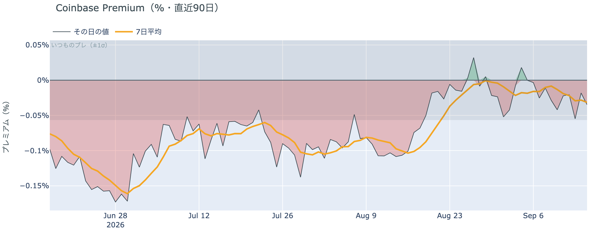

*図の見方: プラス＝アメリカで買いが強い。太線が1週間平均、細線がその日の値。薄い帯は「いつものブレの範囲」です。*

* 1週間平均は−0.032%。先週の−0.010%から下向きで、8月中旬の−0.10%よりは浅い。
* その日の値は−0.035%で、いつものブレの範囲内。金曜に付けた−0.19%の日から4日続けて帯の内側。

Coinbase Premium（＝アメリカとそれ以外の価格差）はマイナスが続き、1週間平均は先週より弱くなっています。火曜の下げの中でアメリカ側の買いが強まった形は出ていません。ただ8月中旬の水準までは離れていて、アメリカの買い手が逃げた形でもありません。

**図①-2 ETFの日ごとの資金の出入り（直近90日）**

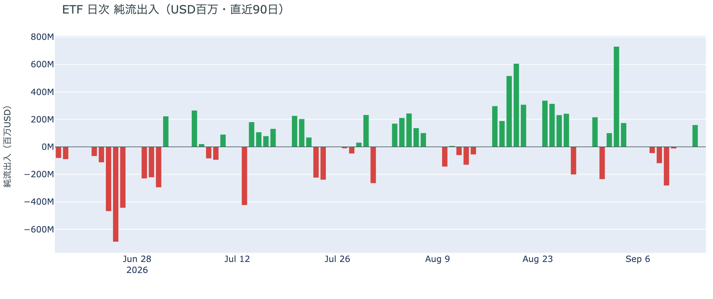

*図の見方: 入ったお金と出たお金の差。上に伸びれば入り超、下に伸びれば出超。*

| ETFの日ごとの出入り | 億ドル |
|---|---:|
| 9月9日 | −1.2 |
| 9月10日 | −2.8 |
| 9月11日 | −0.1 |
| 9月14日 | +1.6 |
| 9月15日 | 集計途中 |
| 直近7営業日の合計 | −1.3 |

月曜9月14日分は入り超で、5営業日ぶりに買いが戻りました。前日は「月曜の上げは買い戻しによるもので、新しい買い手が入っていたのなら建玉が増え、9月14日分のETFが入り超で出る」と説明しました。ETFは入り超で出ましたが、量は前週4営業日の流出の3分の1で、月曜の建玉は横ばいでした。アメリカの買い手は月曜に少し買い戻したが、上げを主導した規模ではなく、前日の説明はそのまま置きます。1週間の合計が出超に転じたのは、9月初めの大きな入り超が1週間の窓から抜けたためで、この1週間に新しい流出が出たのではありません。

**図①-3 Fear & Greed（市場心理の指数・直近90日）**

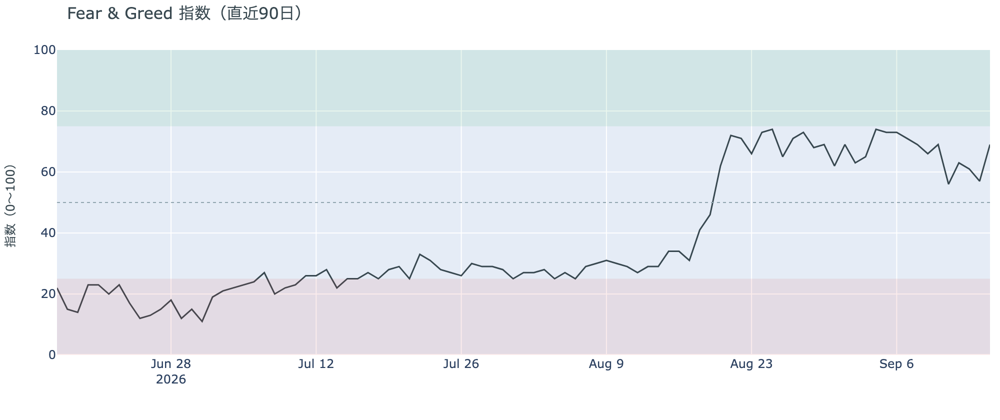

*図の見方: 0〜100で、50より上が「強欲」、下が「恐怖」。*

* 前日の57から12pt上がった。1週間前は69、1か月前は34。

市場心理は69の「強欲」で、月曜の反発を映して1日で大きく戻しました。これは9月15日の確定値で、火曜の下げはまだ数値に入っていません。火曜の朝の時点では、価格の下げを怖がっている人は多くありませんでした。

### ② 長期保有者の分配は続いているが、量は2週間横ばい

**図②-1 長期保有者の保有量の30日変化とSOPR（直近60日）**

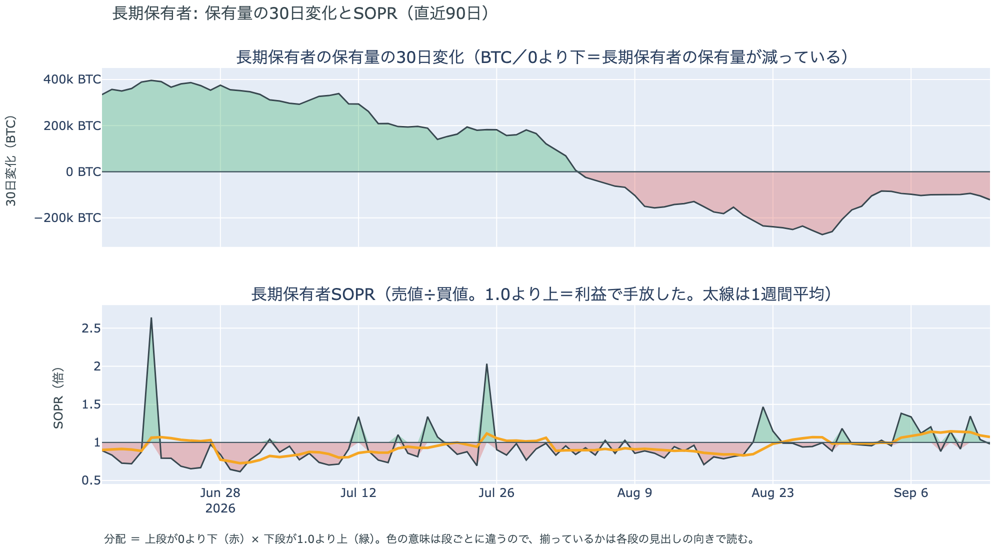

*図の見方: 上段は、長期保有者の保有量が30日でどれだけ増減したか。マイナス＝手放している。下段は長期保有者SOPRで、1より上なら利益で手放した。どちらも太線の1週間平均で読みます。*

| 9月14日時点 | 1週間平均 | 前の週の平均 |
|---|---:|---:|
| 長期保有者SOPR（1より上＝利益で手放した） | 1.07 | 1.11 |
| 長期保有者の保有量の30日変化（万BTC） | −10.2 | −10.2 |

* 減り方は1か月前（−12.9万BTC）の8割、8月末（−27万BTC前後）の4割弱。2週間続けて−10万BTC前後。
* 1年以上動いていないコインは全体の63.1%で、3か月で1.7pt増えた。売りに出てくるコインが少ない状態は続いている。

長期保有者（＝155日以上動かしていないコインの持ち主）は、利益の出ているコインを少しずつ手放し続けています。長期保有者SOPR（＝長期保有者が動かしたコインの売値÷買値）で見ると、動いたコインは平均して買値より7%高く手放されました。保有量が減り、動いた分が利益側という2つがそろっているので、これは分配（＝長期保有者からの放出）です。ただし量は2週間横ばいで、利益の幅は先週より縮んでいます。9月14日時点の数値なので、火曜の下げに長期保有者がどう動いたかはまだ出ていません。**ビットコイン自身の需給の土台は、前日と変わっていません。** ETFや取引所が預かっている分を差し引いても、この規模と向きは変わりません。

今日は、コインが最後に動いた価格の分布に大きな変化がなく、長く眠っていたコインが動いた記録もありません。マイナーの収入は平年並み（Puell Multiple（＝マイナー収入の平年比）が1週間平均で0.99）で、売りを急ぐ状況ではありません。

### ③ 先物：ロングが清算されても建玉は減らず、下げの中で新しく張った人がいる

**図③-1 資金調達率と建玉（直近30日）**

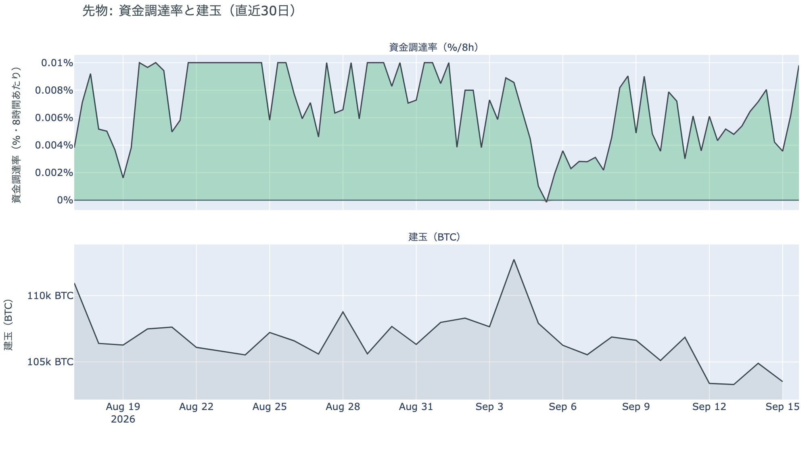

*図の見方: 上段は資金調達率（8時間ごと）。プラスが続く＝ロングがショートより多い。下段は建玉。*

* 資金調達率はプラスが31回連続。ロングがショートより多い状態が10日続いている。
* 上乗せは直近1か月の平均+3.47ptとほぼ同じ水準。上限（8時間あたり±0.3%）にはほど遠い。
* 建玉は108,096BTC。9月3日の急騰のときに積まれた分が消える前の水準（10.7万〜10.8万BTC）に1日で戻った。

前日まで3日続いた「建玉は横ばい」が、火曜に崩れました。ロングが清算されて減ったはずの建玉が、その分を埋めてなお前日より増えています。価格が下げながら建玉が増える組み合わせは、下げに賭ける売り持ち（ショート）が新しく張られるときの形です。一方で資金調達率はプラスのまま、上乗せも前日と変わっていないので、ロングがまとめて降りたのではありません。前日は「大きく張り直した人はいない」と説明しましたが、火曜はその形ではなく、下げを見て新しく張った人が入りました。残ったロングと新しいショートが、FOMC の結果を待つ夜に向かい合っています。

### ④ オプション：下げた日にプットは再び FOMC のあとの満期すべてで高くなり、持ち高は動いていない

オプションには2種類あります。コール（＝決めた価格で買う権利）とプット（＝決めた価格で売る権利）で、価格が上がればコールの価値が上がり、価格が下がればプットの価値が上がります。プットは「価格が下がったときの保険」として買われます。

**図④-1 満期ごとのIV（年率%）**

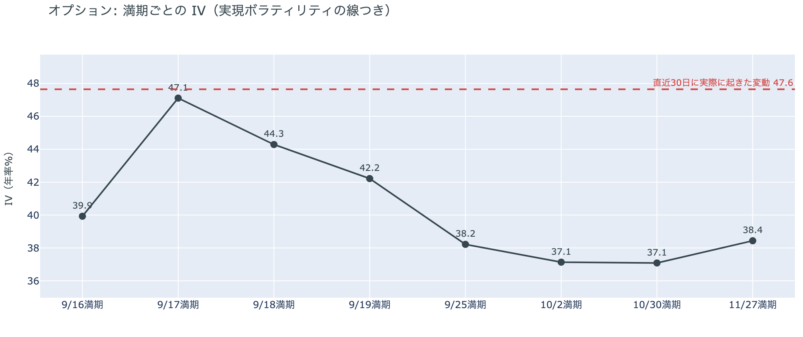

*図の見方: IVを満期ごとに並べたもの。点線は実現ボラティリティ。IVが点線より下なら、市場はこの先の値動きを過去の値動きより小さいと見ています。*

* IVは全体で38.6。実現ボラティリティ47.6より9.1pt低い。過去1年で見ると下から32%の位置。
* 満期ごとに見ると、FOMCの結果が出る9月17日の満期が47.1で一番高く、前日の42.1から5pt上がった。翌18日は44.3、19日は42.2。9月25日は38.2で、10月以降と同じ水準。

IV（＝オプション価格から逆算した、この先の値動きの幅の予想）は実現ボラティリティ（＝直近30日に実際に起きた値動きの幅）より低く、市場はこの先の値動きを、過去の値動きより小さいと見ています。守りを固めている状態ではなく、怖がってもいません。ただし FOMC の結果が出る17日の満期だけは別で、参加者が FOMC の直後に見る値動きの幅は、火曜の下げでさらに広がりました。18日・19日に満期が来るオプションの権利料（＝オプションを買う人が払う金額）にも上乗せが乗り、9月25日から先の満期には乗っていません。

**図④-2 満期ごとのプットとコールの差**

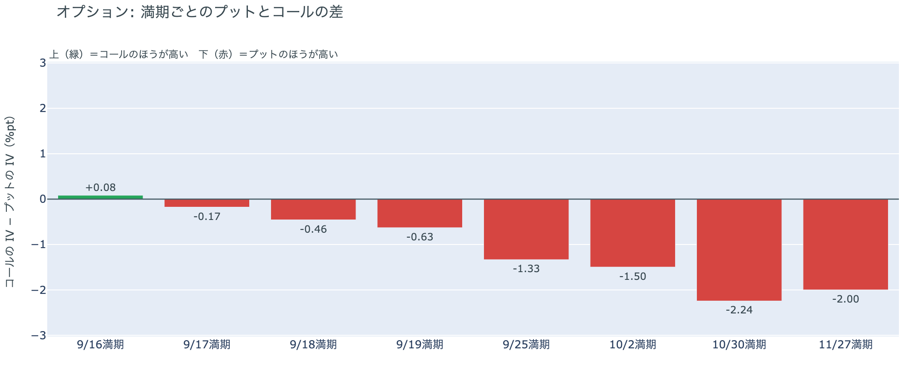

*図の見方: 満期ごとに、プットとコールのどちらが高く売れているか。ゼロより上ならコールのほうが高く、下ならプットのほうが高い。*

| 満期 | どちらが高いか |
|---|---|
| 9月16日 | コールがわずかに高い |
| 9月17日 | プットが高い（前日はコールが高かった） |
| 9月18日 | プットが高い（前日はコールが高かった） |
| 9月19日 | プットが高い |
| 9月25日 | プットが高い（前日はほぼ差なし） |
| 10月2日 | プットが高い |
| 10月30日 | プットが高い |
| 11月27日 | プットが高い |

* プットのほうが高くなる最初の満期は9月17日。日曜の形に戻った。

前日は「プットの値段は価格の上下に追随していて、持ち高は動いていない」と説明しました。火曜に価格が4%下げると、17日・18日・25日の満期は再びプットのほうが高くなり、持ち高（図④-3）は変わっていません。金曜と日曜の下げた日にプットが高くなり、月曜の上げた日に剥がれ、火曜の下げた日にまた高くなったので、前日の説明は今日の数値と合っています。参加者は備えを買い足したのではなく、価格に合わせてプットの値段を付け直しています。備えの値段が並んでいるのは、FOMC の結果が出る17日から先の満期すべてです。

**図④-3 9月25日満期の持ち高（権利の価格ごと）**

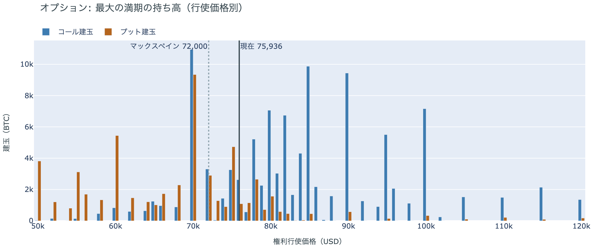

*図の見方: 青＝コール、橙＝プット。現値より上にコールが、下にプットが積まれるのが普通です。*

| 9月25日満期のオプション（価格は約$75,900） | 量（万BTC） | 意味 |
|---|---:|---|
| いまより高い価格のコール（決めた価格で買う権利） | 約9.7 | 「価格が上がる」に賭けた分 |
| いまより安い価格のプット（決めた価格で売る権利） | 約5.3 | 「価格が下がる」への保険 |
| うち、いまより15%以上高い価格のコール | 約5.1 | 大きな上げへの賭け |
| うち、いまより15%以上安い価格のプット | 約2.9 | 大きな下げへの保険 |

* 9月25日満期の持ち高は全部で186,169BTCと、全満期の43%。前日の185,908BTCとほぼ同じ。コールがプットの1.9倍で、前日と同じ。
* 持ち高が集まっている価格は、多い順に$75,000、$78,000、$76,000、$80,000。帯の中心が前日の$80,000から下に移った。

「価格が上がる」に賭けた人たちは降りていません。火曜に価格が$78,000を割ったことで、その行使価格のコールが「いまより高い」側に戻り、表の上の行が前日より大きく見えますが、持ち高の総量は変わっていません。この賭けが報われるには、9月25日までに、オプションの持ち高が集まっている$75,000〜$80,000の帯の上端$80,000を超える必要があります。いまの価格はその帯の下端にあり、$80,000まで6%です。9月14日時点の分布で見ると、$80,000〜$90,000でコインが最後に動いた供給は全体の9%で、価格より上では一番厚い帯です。

## 4. 価格に影響しうる直近のイベント

予測ではなく、「次に市場が反応しうる材料」の案内です。オプション市場が備えを置いているのは FOMC の結果が出る17日から先の満期すべてで、IVが一段高いのは17日の満期です。法案は上院の手続き投票で否決され、年内の審議は止まると報じられているので、規制の次の材料は当局の個別の決定に移ります。

| 日付 | イベント | 何に効くか |
|---|---|---|
| 9/17（木）3:00 日本時間 | FOMCの結果。0.25%利上げの織り込みは9割（現在の政策金利は3.50〜3.75%） | 金利。IVが一段高いのはこの満期 |
| 9/18（金） | 日銀の会合の結果。0.25%の利上げ（1.25%へ）を見込む予想がほぼ全員 | 円 |
| 日程未定 | ホルムズ海峡の航行をめぐるイランと湾岸6か国の外相会合（延期のまま） | 原油。サウジアラビアの東西パイプラインは止まったままで、火曜には新たな攻撃が報じられた |
| 9/25（金）17:00 | オプションの大きな満期（約18.6万BTC、全満期の43%） | 「価格が上がる」に賭けた人たちの期限 |

## まとめ：火曜日の動きは何だったか

火曜日は、外部環境に押された日でした。ただし押したのは株や金にも効く出来事ではなく、ビットコインだけに効く米上院の法案の否決で、株と金は0.5%も動いていません。清算されたのはロングで、それでも建玉は増え、下げの中で新しく張った人がいます。アメリカの買い手は月曜に少し買い戻し、長期保有者は2週間横ばい。**ビットコイン自身の需給で変わったのは建玉が増えた一点**で、ロング・長期保有者・アメリカの買い手の土台は前日と同じ姿です。オプションは、下げた日にプットの値段が再び FOMC のあとの満期すべてに並び、持ち高は動いていません。「価格が上がる」に賭けたコールの持ち高は残り、ロングも降りていないので、多数は流れの変化とは見ていません。一方で下げに新しく張った人が入ったので、全員が一時的な押しと見ているわけでもありません。今夜の FOMC と金曜の日銀の結果を、移動平均のクロス・アメリカの買い・ETF・市場心理の同じ物差しで見ます。

---

*本稿は情報提供を目的としたものであり、投資助言ではありません。将来の価格動向を保証・示唆するものではなく、投資判断は各自の責任において行ってください。*
