# 3年ぶりの利上げが決まった夜に横ばい、株が下げるなかビットコインは値幅2.1% ― FOMC で身構えた IV は剥がれ、プットの備えと9月25日のコールはそのまま残った

**2026年9月17日**

水曜日は、外部環境で大きな出来事があったのに、ビットコインが動かなかった日です。FOMC は日本時間17日の3時に0.25%の利上げを決め、これは3年ぶりの利上げでした。株はそのあとの記者会見で下げ、金も下げましたが、ビットコインは24時間で+0.1%、値幅は2.1%で、前日の半分以下です。利上げは前日までに9割織り込まれ、火曜の−4%で先に反応していたためです。先物の持ち高は火曜に増えたまま動かず、買い持ち（ロング）が払う金利の上乗せは短期金利（＝ドルを米国の短期国債で持つだけで受け取れる金利）並みまで縮みました。オプションでは、FOMC の直後に身構えていた IV が結果が出て剥がれ、プットが高い形と9月25日のコールの持ち高はそのまま残っています。

（数値は9月17日7時5分（日本時間）までのデータに基づきます。価格・先物・オプションはその時点の値、市場心理は9月16日の確定値、オンチェーン（＝ブロックチェーン上の記録）は9月15日時点、ETF資金フローは9月15日分までです。証券市場の終値は9月16日時点です。オンチェーンの長期保有者の数値には、ETFや取引所が預かっている分も含まれます。オプションはDeribit（BTCオプションの大半を占める取引所）の全銘柄です。）

## 1. 何が起きたか

**図1-1 価格の推移（1時間足・直近7日）**

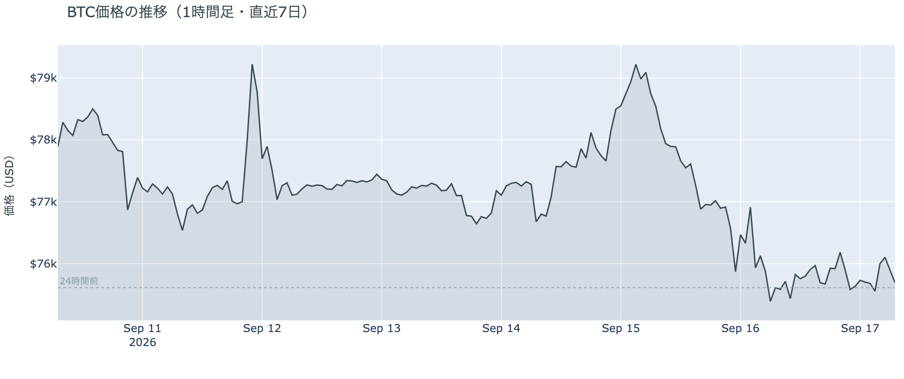

*図の見方: 1時間ごとの価格（日本時間）。火曜の右下がりの線が16日の未明に谷を付けたあと、水曜は右端まで線がほぼ平らです。*

* 朝7時5分の時点で約$75,688。24時間で+0.1%、値幅は$74,912〜$76,500の2.1%。前日の4.9%の半分以下。
* 1週間前と比べると−3.3%、1か月前と比べると+17.4%。
* FOMC の結果が出た17日の3時台に$76,000台へ一度上げ、1時間ほどで元の水準に戻った。
* Hyperliquid（＝オンチェーンの先物取引所）で見える清算は、この24時間で31件。ほぼ全部がショート側で、3時台の76,000ドル台に集中。最大の1件が全体の57%で、大口が1つ飛んだ形。

水曜日は、火曜の谷のあと$75,500前後の狭い帯にとどまった日でした。3年ぶりの利上げが決まった3時台に一度だけ上へ動き、そのとき売り持ち（ショート）の清算（＝証拠金不足で強制的に閉じられた取引）を伴いましたが、多数ではなく大口1件で、価格もすぐ戻りました。火曜に付けた1週間の安値$74,888は割っていません。

**図1-2 価格と50日・200日移動平均**

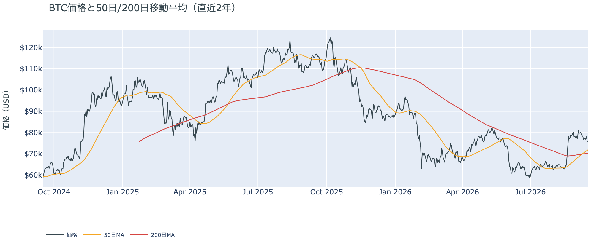

*図の見方: 2本の平均線の上下関係を見ます。50日線が200日線の上にあるのがゴールデンクロスです。*

* 50日線が200日線を上抜けてから9日目。差は約$1,606（2.3%）で、前日の$1,411からさらに開いた。
* 価格は50日線の約5%上。前日と同じ距離。

ゴールデンクロス（＝50日線が200日線を上抜けること）の状態は9日目で、差は日ごとに開き続けています。価格が横ばいだったので、50日線$71,889との距離も前日と変わっていません。

証券市場は下げました。9月16日の終値は、S&P500が−0.5%、金は−0.7%、原油は−3.6%で$102.02、米10年債利回りは5.01%、ドル指数は+0.7%でした。

## 2. なぜ動いたか：ビットコイン自身の需給か、外部環境か

**図2-1 ビットコインと株・金・原油の相対推移（起点＝100）**

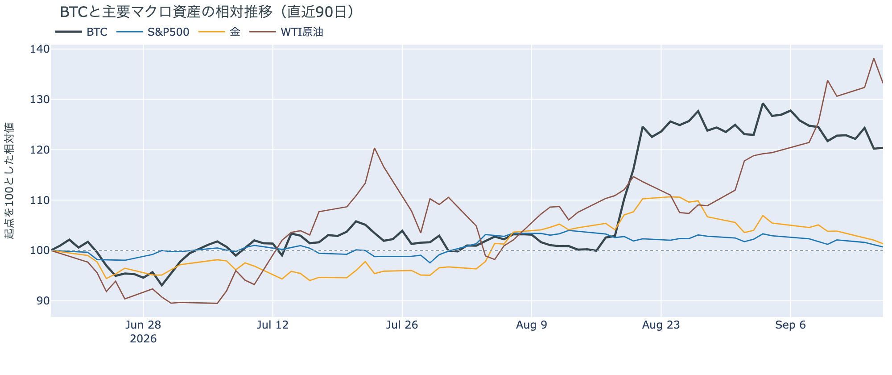

*図の見方: 同じ起点から何%動いたかで重ねたもの。線が同じ向きなら「一緒に動いた」、ビットコインだけ別の向きなら「自身の理由で動いた」と読みます。*

| この5営業日の動き（ビットコインは7日間） | 変化 |
|---|---:|
| ビットコイン | −3.3% |
| 金 | −3.6% |
| 米国株（S&P500） | −1.1% |
| 原油 | +6.2% |

* 水曜9月16日は、株・金・原油がそろって下げ、ドルと米10年債利回りが上がった。1日の証券市場の動きは「リスクオフ寄り」。
* 建玉は107,921BTC。前日の108,096BTCとほぼ同じで、1週間では+0.8%。
* 資金調達率はプラスが34回連続。1日をならした年率は+4.38%で、短期金利（13週Tビル 3.97%）を引いた上乗せは+0.41pt。前日の+3.18ptから大きく縮み、直近1か月の平均+3.19ptの8分の1。

水曜日にビットコインが動かなかった理由は2つです。

1. FOMC（＝米国の金利を決める会合）の利上げは織り込み通りで、ビットコインは前日に先に反応していました。政策金利は3.75〜4.00%へ0.25%上がり、全員一致でした。利上げの織り込みは前日の時点で9割あり、火曜の−4%のうち日中のじりじりした下げは、その FOMC を待つ証券市場と同じ向きに動いたものでした。結果が出た3時台にビットコインは$76,000台へ一度上げてから戻り、株が記者会見のあとに下げた向きにも付いていっていません。
2. 需給の側では、火曜に入った持ち高がそのまま向かい合ったまま、誰も動きませんでした。建玉（＝先物の未決済残高。証拠金で張っている人の量）は横ばいで、火曜に下げの中で新しく張ったショートと、残ったロングが両方残っています。資金調達率（＝ロングが払う金利。プラス＝ロングがショートより多い）はプラスのままですが、上乗せは1日で短期金利並みまで縮み、ロングの傾きは弱まりました。

前日は「火曜の下げは法案の否決に押されたもので、需給の流れが変わったのではない。流れが変わったのなら、建玉が増えたまま資金調達率がマイナスに沈み、ETF が出超に戻る」と説明しました。今朝の数値では、建玉は増えたまま横ばい、資金調達率はプラスのまま、ETF は火曜9月15日分が出超でした。3つのうちそろったのは ETF の1つで、ロングが降りていないという前日の説明は今日の数値と合っています。ただしアメリカの買い手が火曜に売っていたことは、今朝はっきりしました（図①-2）。

外部環境では、原油が水曜に3.6%下げて$102になりました。米エネルギー長官が、攻撃で止まっていたサウジアラビアの東西パイプライン（ホルムズ海峡を通らずに原油を出す経路）は数日内に再開すると述べ、サウジアラビアは米軍の支援を受けてホルムズ海峡経由の積み出しを増やしたと報じられています。延期されたイランと湾岸6か国の外相会合の次の日程は決まっていません。原油はまだ$100の上にあり、リスク資産全体の重しになりうる状況は続いています。

## 3. 市場参加者はいまどう見ているか

### ① アメリカの買い手は法案が否決された火曜に売り、市場心理は「強欲」から「中立」へ1日で冷めた

**図①-1 Coinbase Premium（アメリカとそれ以外の価格差・直近90日）**

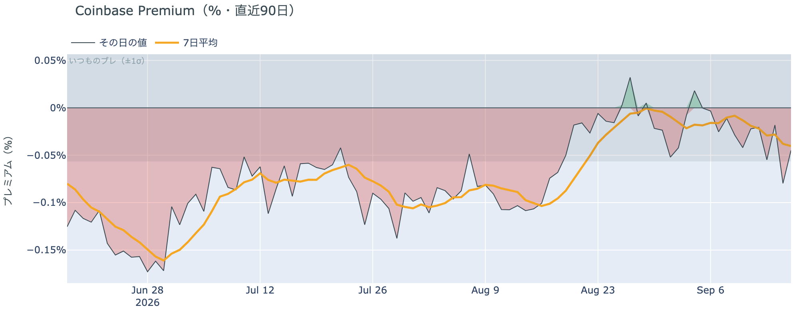

*図の見方: プラス＝アメリカで買いが強い。太線が1週間平均、細線がその日の値。薄い帯は「いつものブレの範囲」です。*

* 1週間平均は−0.040%。先週の−0.008%から下向きで、8月中旬の−0.10%よりは浅い。
* その日の値は−0.045%で、いつものブレの範囲内。5日続けて帯の内側。

Coinbase Premium（＝アメリカとそれ以外の価格差）はマイナスが続き、1週間平均は先週より弱くなっています。アメリカ側の買いが弱い状態は続いていますが、8月中旬の水準までは離れていて、価格差だけを見ればアメリカの買い手が逃げた形ではありません。

**図①-2 ETFの日ごとの資金の出入り（直近90日）**

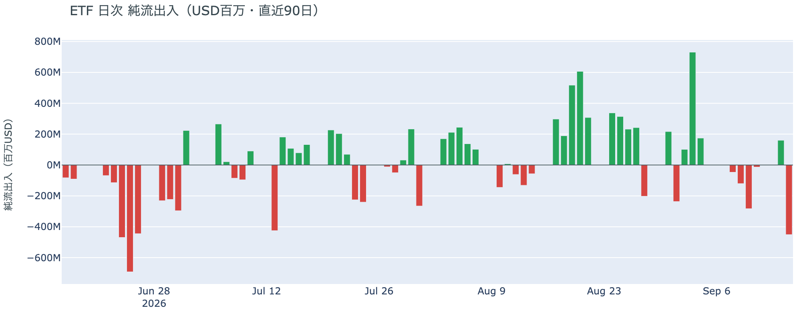

*図の見方: 入ったお金と出たお金の差。上に伸びれば入り超、下に伸びれば出超。*

| ETFの日ごとの出入り | 億ドル |
|---|---:|
| 9月10日 | −2.8 |
| 9月11日 | −0.1 |
| 9月14日 | +1.6 |
| 9月15日 | −4.5 |
| 直近7営業日の合計 | −5.8 |

火曜9月15日分は出超で、上場来の1日の出入りとしては下から5%に入る大きさです。月曜に戻った買いは1日で消え、法案の手続き投票があった火曜に、アメリカの買い手は売っていました。前日は「アメリカの買い手は月曜に少し買い戻したが、上げを主導した規模ではない」と説明しましたが、火曜の数値はその先を行っていて、買い戻しではなく売りでした。ただし出超がこの大きさになったのは確定分で1営業日だけで、火曜より前の1週間は、最も大きい日でもその6割ほどでした。アメリカの買い手は火曜に売った、ただし逃げ続けているかはまだ1日分しか出ていない、が今朝の読みです。

**図①-3 Fear & Greed（市場心理の指数・直近90日）**

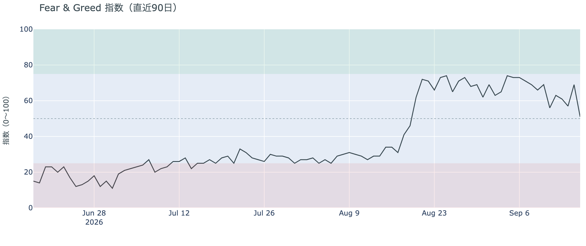

*図の見方: 0〜100で、50より上が「強欲」、下が「恐怖」。*

* 前日の69から18pt下がった。1週間前は66、1か月前は31。

市場心理は51の「中立」で、火曜の下げを映して「強欲」から1日で落ちました。これは9月16日の確定値で、FOMC の結果はまだ数値に入っていません。「中立」の下限に近い位置ですが、1か月前の「恐怖」までは遠く、価格の下げを怖がっている人が多数になった形ではありません。

### ② 長期保有者の分配は続いているが、量は3週間 −10万BTC前後で変わっていない

**図②-1 長期保有者の保有量の30日変化とSOPR（直近60日）**

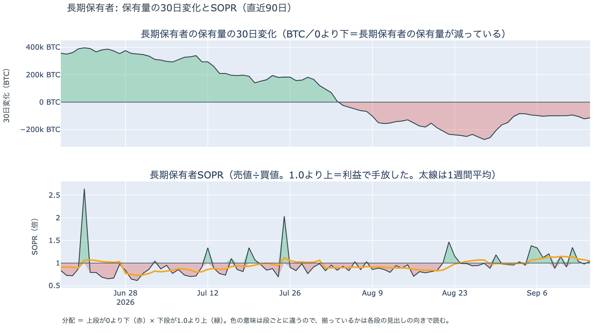

*図の見方: 上段は、長期保有者の保有量が30日でどれだけ増減したか。マイナス＝手放している。下段は長期保有者SOPRで、1より上なら利益で手放した。どちらも太線の1週間平均で読みます。*

| 9月15日時点 | 1週間平均 | 前の週の平均 |
|---|---:|---:|
| 長期保有者SOPR（1より上＝利益で手放した） | 1.05 | 1.14 |
| 長期保有者の保有量の30日変化（万BTC） | −10.5 | −9.5 |

* 減り方は1か月前（−15.1万BTC）の7割、8月末（−27万BTC前後）の4割弱。3週間続けて−10万BTC前後。
* 1年以上動いていないコインは全体の63.2%で、3か月で1.7pt増えた。売りに出てくるコインが少ない状態は続いている。

長期保有者（＝155日以上動かしていないコインの持ち主）は、利益の出ているコインを少しずつ手放し続けています。長期保有者SOPR（＝長期保有者が動かしたコインの売値÷買値）で見ると、動いたコインは平均して買値より5%高く手放されました。保有量が減り、動いた分が利益側という2つがそろっているので、これは分配（＝長期保有者からの放出）です。ただし量は3週間同じ水準で、利益の幅は先週より縮んでいて、火曜に価格が下げたぶん手放したコインの利益が薄くなっただけです。**ビットコイン自身の需給の土台は、前日と変わっていません。** ETFや取引所が預かっている分を差し引いても、この規模と向きは変わりません。

今日は、コインが最後に動いた価格の分布に大きな変化がなく、長く眠っていたコインが動いた記録もありません。マイナーの収入は平年並み（Puell Multiple（＝マイナー収入の平年比）が1週間平均で1.02）で、売りを急ぐ状況ではありません。

### ③ 先物：建玉は火曜に増えたまま動かず、ロングが払う上乗せは短期金利並みまで縮んだ

**図③-1 資金調達率と建玉（直近30日）**

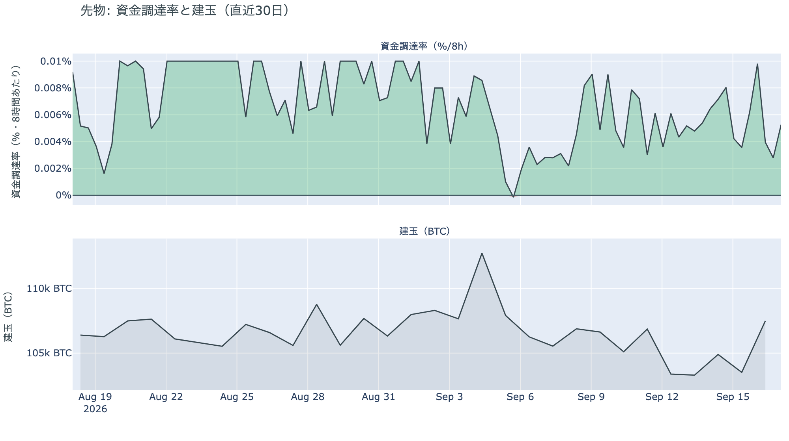

*図の見方: 上段は資金調達率（8時間ごと・日本時間）。プラスが続く＝ロングがショートより多い。下段は建玉。*

* 資金調達率はプラスが34回連続。ロングがショートより多い状態が11日続いている。
* 上乗せは+0.41pt。直近1か月の平均+3.19ptから1日で縮んだ。上限（8時間あたり±0.3%）にはほど遠い。
* 建玉は107,921BTC。火曜に1日で+3.5%増えた水準に、そのままとどまっている。

火曜に下げの中で新しく張ったショートと、清算を免れて残ったロングが、FOMC の結果をまたいでそのまま向かい合っています。前日は「残ったロングと新しいショートが、FOMC の結果を待つ夜に向かい合っている」と書きましたが、結果が出ても、どちらも手仕舞いをしていません。変わったのはロングが払う金利で、上乗せは1日で短期金利とほぼ同じ水準まで下がり、ロングの傾きは弱まりました。プラスのままなので、ロングがショートより多い状態そのものは11日続いています。過熱ではありません。

### ④ オプション：FOMC で身構えた IV は結果が出て剥がれ、プットが高い形と9月25日のコールはそのまま

オプションには2種類あります。コール（＝決めた価格で買う権利）とプット（＝決めた価格で売る権利）で、価格が上がればコールの価値が上がり、価格が下がればプットの価値が上がります。プットは「価格が下がったときの保険」として買われます。

**図④-1 満期ごとのIV（年率%）**

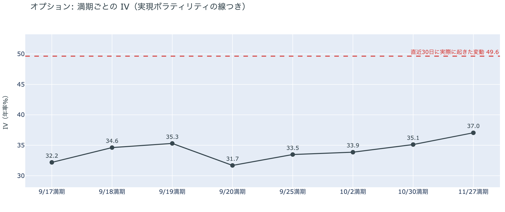

*図の見方: IVを満期ごとに並べたもの。点線は実現ボラティリティ。IVが点線より下なら、市場はこの先の値動きを過去の値動きより小さいと見ています。*

| 満期 | 今朝のIV | 前日のIV |
|---|---:|---:|
| 9月17日 | 32.2 | 47.1 |
| 9月18日 | 34.6 | 44.3 |
| 9月19日 | 35.3 | 42.2 |
| 9月25日 | 33.5 | 38.2 |

* IVは全体で39.0。実現ボラティリティ49.6より10.6pt低い。過去1年で見ると下から12%の位置。
* 満期ごとに見ると、手前が低く先が高い平常の形に戻り、突出した満期は無い。

IV（＝オプション価格から逆算した、この先の値動きの幅の予想）は実現ボラティリティ（＝直近30日に実際に起きた値動きの幅）より低く、市場はこの先の値動きを、過去の値動きより小さいと見ています。前日まで、17日・18日・19日に満期が来るオプションの権利料（＝オプションを買う人が払う金額）には上乗せが乗っていました。FOMC の直後に大きく動くと見られていたからです。結果が出て、上乗せは1日で全部剥がれました。全体の IV は過去1年でも低い位置にあり、守りを固めている状態ではなく、怖がってもいません。金曜の日銀の結果が出る18日の満期にも、同じような上乗せは乗っていません。

**図④-2 満期ごとのプットとコールの差**

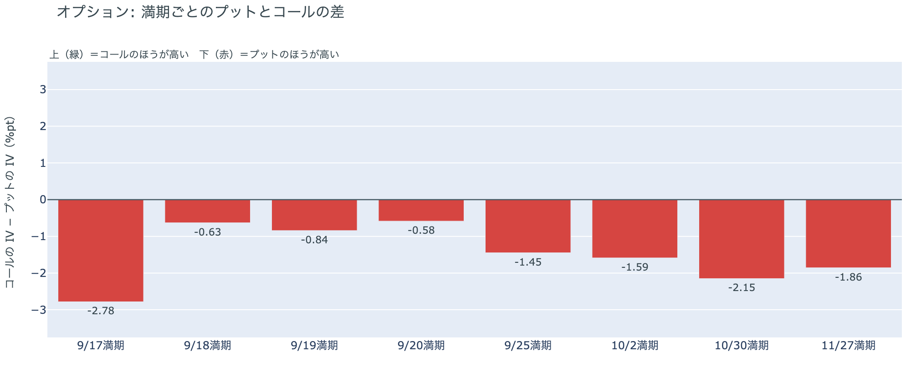

*図の見方: 満期ごとに、プットとコールのどちらが高く売れているか。ゼロより上ならコールのほうが高く、下ならプットのほうが高い。*

| 満期 | どちらが高いか |
|---|---|
| 9月17日 | プットがはっきり高い |
| 9月18日 | プットが高い |
| 9月19日 | プットが高い |
| 9月20日 | プットが高い |
| 9月25日 | プットが高い |
| 10月2日 | プットが高い |
| 10月30日 | プットが高い |
| 11月27日 | プットが高い |

* 前日と同じく、全部の満期でプットのほうが高い。コールが高い満期は今朝も無い。

前日は「参加者は備えを買い足したのではなく、価格に合わせてプットの値段を付け直している」と説明しました。水曜は価格が動かず、プットが高い形も全部の満期でそのまま残ったので、前日の説明は今日の数値と合っています。図④-1 で FOMC の権利料の上乗せが剥がれたのに、プットの値段が残ったことから、参加者が身構えていたのは FOMC の結果そのものではなく、火曜に$78,000を割ったあとの価格の水準に対してだと分かります。その水準が変わっていないので、備えの値段も変わっていません。

**図④-3 9月25日満期の持ち高（権利の価格ごと）**

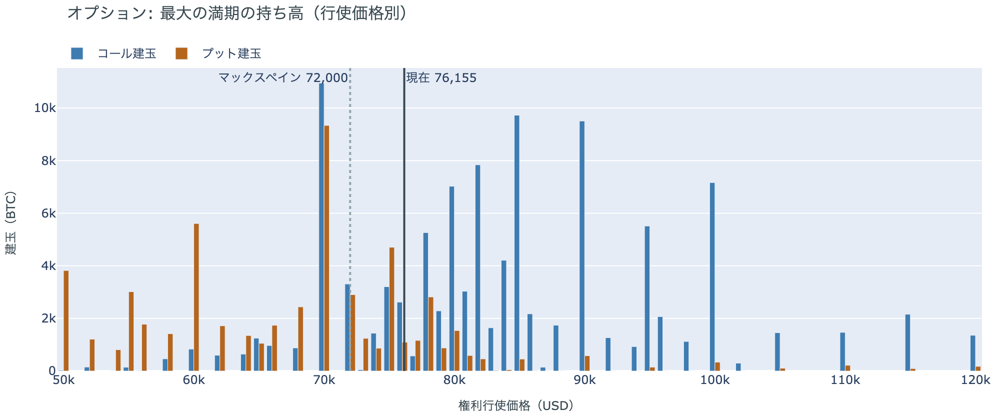

*図の見方: 青＝コール、橙＝プット。現値より上にコールが、下にプットが積まれるのが普通です。*

| 9月25日満期のオプション（価格は約$75,700） | 量（万BTC） | 意味 |
|---|---:|---|
| いまより高い価格のコール（決めた価格で買う権利） | 約9.5 | 「価格が上がる」に賭けた分 |
| いまより安い価格のプット（決めた価格で売る権利） | 約5.5 | 「価格が下がる」への保険 |
| うち、いまより15%以上高い価格のコール | 約5.1 | 大きな上げへの賭け |
| うち、いまより15%以上安い価格のプット | 約3.0 | 大きな下げへの保険 |

* 9月25日満期の持ち高は全部で188,204BTCと、全満期の43%。前日の186,169BTCとほぼ同じ。コールがプットの1.9倍で、前日と同じ。
* 持ち高が集まっている価格は、多い順に$75,000、$78,000、$80,000、$76,000。前日と同じ帯。

「価格が上がる」に賭けた人たちは、利上げの結果を見ても降りていません。この賭けが報われるには、9月25日までに、オプションの持ち高が集まっている$75,000〜$80,000の帯の上端$80,000を超える必要があります。いまの価格はその帯の下端にあり、$80,000まで5.7%です。火曜に増えた建玉と同じく、オプションの持ち高も FOMC をまたいで形を変えていません。

## 4. 価格に影響しうる直近のイベント

予測ではなく、「次に市場が反応しうる材料」の案内です。FOMC は終わり、次は金曜の日銀の結果です。オプション市場の備えは全部の満期でプットが高い形で並んでいて、特定の日だけ権利料に上乗せが乗った満期は、今朝はありません。FOMC は「物価は高止まりしている」と述べ、18人中16人が年内もう1回の利上げを見込んでいるので、次の物価統計と雇用統計は金利の材料になります。

| 日付 | イベント | 何に効くか |
|---|---|---|
| 9/18（金）昼 | 日銀の会合の結果。0.25%の利上げの織り込みは約9割 | 円 |
| 9/25（金）17:00 | オプションの大きな満期（約18.8万BTC、全満期の43%） | 「価格が上がる」に賭けた人たちの期限 |
| 9/30（水）21:30 日本時間 | 米PCE物価（FRBが重視する物価統計）と4〜6月期GDPの確定値 | 金利。FOMC が年内もう1回の利上げを見込む根拠になる統計 |
| 10/2（金）21:30 日本時間 | 米9月の雇用統計 | 金利 |
| 日程未定 | ホルムズ海峡の航行をめぐるイランと湾岸6か国の外相会合（延期のまま） | 原油。サウジアラビアの東西パイプラインは「数日内に再開」と米側が発言 |

## まとめ：水曜日の動きは何だったか

水曜日は、3年ぶりの利上げという外部環境の出来事があった夜に、ビットコインが動かなかった日でした。株と金が下げるなかで横ばいで、同じ向きに動いていません。理由は、利上げが9割織り込まれていて火曜に先に下げていたことと、火曜に入った先物の持ち高が FOMC をまたいで誰も手仕舞いしなかったことの2つです。ビットコイン自身の需給では、建玉は増えたまま横ばい、ロングが払う上乗せは短期金利並みまで縮み、長期保有者の分配は3週間同じ量。変わったのは、アメリカの買い手が法案の否決があった火曜に4.5億ドル売っていたと分かった一点で、市場心理もそれを映して「中立」まで冷めました。オプションは、FOMC の直後に大きく動くと見て乗っていた上乗せだけが剥がれ、プットが高い形と「価格が上がる」に賭けたコールの持ち高はそのまま残っています。ロングもコールも降りていないので、多数は火曜の下げを流れの変化とは見ていません。金曜の日銀の結果を、移動平均のクロス・アメリカの買い・ETF・市場心理の同じ物差しで見ます。

---

*本稿は情報提供を目的としたものであり、投資助言ではありません。将来の価格動向を保証・示唆するものではなく、投資判断は各自の責任において行ってください。*
