# 株の反発と同じ向きに+1%、IV は1年で最も低い ― アメリカの買い手は2日続けて売り、ロングは上乗せを払って積み直され、プットの備えは9月25日以降の満期だけに残った

**2026年9月18日**

木曜日は、株が利上げのあとの下げを1日で取り戻した日に、ビットコインも同じ向きに1%上げた日です。値幅は2.0%で、FOMC の夜と同じ静かさでした。動かしたのはビットコイン自身の需給ではなく、証券市場の向きです。アメリカの買い手は火曜・水曜と2日続けて売り、木曜もアメリカ側の価格がそれ以外より安いままでした。一方で先物では、前日に短期金利並みまで縮んでいた買い持ち（ロング）の上乗せが1日で戻り、ロングが積み直されています。オプションでは、9月21日までの満期でプットが高い形が消え、備えは9月25日以降の満期だけに残りました。IV は全体で過去1年で最も低い位置です。今日の昼に日銀の結果が出ます。

（数値は9月18日7時5分（日本時間）までのデータに基づきます。価格・先物・オプションはその時点の値、市場心理は9月17日の確定値、オンチェーン（＝ブロックチェーン上の記録）は9月16日時点、ETF資金フローは9月17日分まで（17日分は集計の途中）です。証券市場の終値は9月17日時点です。オンチェーンの長期保有者の数値には、ETFや取引所が預かっている分も含まれます。オプションはDeribit（BTCオプションの大半を占める取引所）の全銘柄です。）

## 1. 何が起きたか

**図1-1 価格の推移（1時間足・直近7日）**

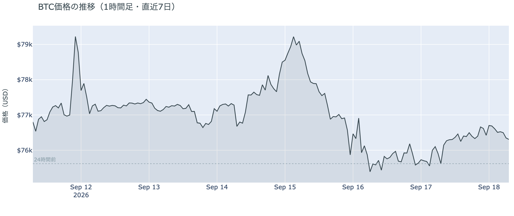

*図の見方: 1時間ごとの価格（日本時間）。火曜の谷のあと、水曜から木曜は線がほぼ平らで、右端近くの21〜22時台に小さな山と谷が1つずつあります。*

* 朝7時5分の時点で約$76,337。24時間で+1.0%、値幅は$75,577〜$77,105の2.0%。前日の2.1%とほぼ同じ。
* 1週間前と比べると−0.3%、1か月前と比べると+18.0%。
* 21時台に$77,100まで上げ、22時台に$75,900まで下げて、日付が変わるころには$76,700前後に戻った。
* Hyperliquid（＝オンチェーンの先物取引所）で見える清算は、この24時間で9件。ロングとショートがほぼ半々で、22時台の76,000ドル台に集中。最大の1件が全体の76%。

木曜日は$76,000台の狭い帯にとどまった一日で、動いたのは米国の経済統計が出る21時半をはさんだ2時間ほどでした。その往復は清算（＝証拠金不足で強制的に閉じられた取引）を伴いましたが、ロングとショートがほぼ半々で、大口が1つ飛んだ形です。火曜に付けた1週間の安値$74,888は割っておらず、水曜の朝と比べて価格の水準はほとんど変わっていません。

**図1-2 価格と50日・200日移動平均**

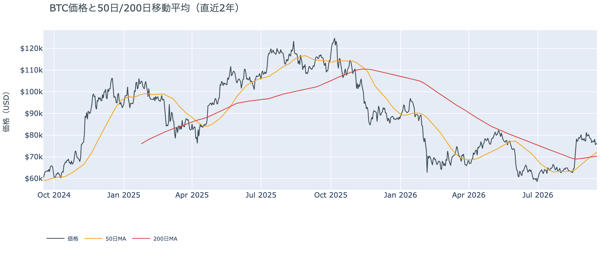

*図の見方: 2本の平均線の上下関係を見ます。50日線が200日線の上にあるのがゴールデンクロスです。*

* 50日線と200日線の差は約$1,809（2.6%）で、前日の$1,606からさらに開いた。
* 価格は50日線$72,147の約6%上。前日の5%から少し離れた。

ゴールデンクロス（＝50日線が200日線を上抜けること）の状態は10日目で、2本の線の差は毎日開き続けています。木曜の1%の上げで、価格と50日線の距離も少し広がりました。

証券市場は反発しました。9月17日の終値は、S&P500が+1.1%、金は−0.2%、原油は−1.3%で$101.09、米10年債利回りは4.95%で前日の5.01%から下がり、VIX（＝株式市場の恐怖指数）は13%下がりました。

## 2. なぜ動いたか：ビットコイン自身の需給か、外部環境か

**図2-1 ビットコインと株・金・原油の相対推移（起点＝100）**

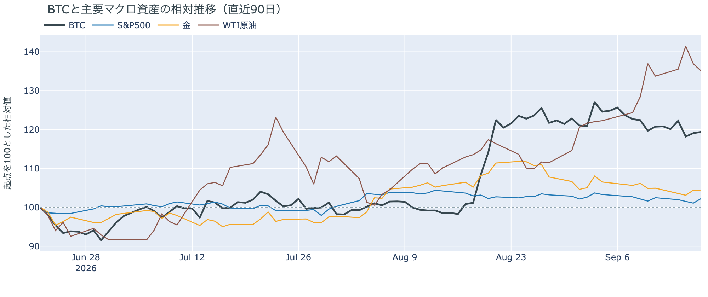

*図の見方: 同じ起点から何%動いたかで重ねたもの。線が同じ向きなら「一緒に動いた」、ビットコインだけ別の向きなら「自身の理由で動いた」と読みます。*

| この5営業日の動き（ビットコインは7日間） | 変化 |
|---|---:|
| ビットコイン | −0.3% |
| 金 | −0.6% |
| 米国株（S&P500） | +0.6% |
| 原油 | −1.4% |

* 木曜9月17日は、株が上がり、原油と米10年債利回りとVIXが下がった。1日の証券市場の動きは「リスクオン寄り」。
* 建玉は108,257BTC。前日の107,921BTCから+0.3%、1週間では+2.7%。
* 資金調達率はプラスが37回連続。1日をならした年率は+7.73%で、短期金利（13週Tビル 3.97%）を引いた上乗せは+3.76pt。前日の+0.41ptから1日で戻り、直近1か月の平均+3.36ptを上回った。
* 直近30日の値動きの相関は、金が+0.72、S&P500が+0.29。

木曜日にビットコインが1%上げたのは、証券市場の反発と同じ向きに動いたからで、ビットコイン自身の需給が押し上げたのではありません。理由は2つです。

1. 外部環境に新しい出来事はなく、株は利上げの翌日に下げを取り戻しました。FOMC（＝米国の金利を決める会合）の結果は水曜に出ていて、木曜は原油が下げ、金利も下がり、株が上がるという「リスクオン寄り」の一日でした。ビットコインはその向きに付いていき、上げ幅は株とほぼ同じでした。前日は「ビットコインは利上げに火曜の時点で先に反応していて、株が記者会見のあとに下げた向きには付いていかなかった」と説明しました。木曜は株が反発した向きに付いていったので、火曜の下げで織り込みが済んでいたという前日の説明は、今日の数値と合っています。
2. ビットコイン自身の需給では、買い手はアメリカではなく先物側にいました。ETF は火曜・水曜と2日続けて出超で、木曜も Coinbase の価格はそれ以外より安いままでした（図①-1・図①-2）。その一方で、建玉（＝先物の未決済残高。証拠金で張っている人の量）はわずかに増え、資金調達率（＝ロングが払う金利。プラス＝ロングがショートより多い）の短期金利に対する上乗せは、前日に短期金利並みまで縮んだところから1日で1か月平均を超える水準に戻りました。ロングが積み直されたので、上げは先物が支え、現物のアメリカの買い手は売り側にいた、が今朝の切り分けです。

外部環境では、原油が木曜に1.3%下げて$101になりました。サウジアラビアがオマーンのソハール港経由で原油の積み出しを追加で手配したと報じられ、ホルムズ海峡が使えない期間が長引く懸念が和らいだ形です。一方で、イエメンのフーシ派とサウジアラビアの攻撃の応酬は続いており、トランプ大統領は水曜に「戦争は終わりに近づいていると期待する」と述べました。原油はまだ$100の上にあり、リスク資産全体の重しになりうる状況は変わっていません。

規制では、米下院の金融サービス委員会が水曜（米国時間16日）に、大統領令で作られたビットコインの戦略準備を法律にする法案を28対21で可決しました。次は下院本会議での採決で、日程は決まっていません。上院で火曜に手続き投票が否決された CLARITY 法案（＝暗号資産の市場構造法案）は、再採決の日程が出ていません。

## 3. 市場参加者はいまどう見ているか

### ① アメリカの買い手は2日続けて売り、木曜も売り側にいた

**図①-1 Coinbase Premium（アメリカとそれ以外の価格差・直近90日）**

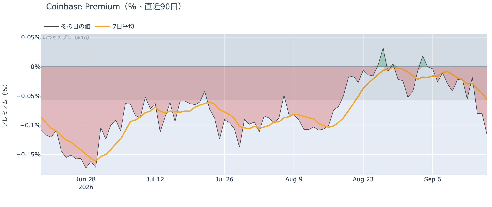

*図の見方: プラス＝アメリカで買いが強い。太線が1週間平均、細線がその日の値。薄い帯は「いつものブレの範囲」です。*

* 1週間平均は−0.056%。先週の−0.013%から4倍のマイナス幅で、8月中旬の−0.10%に近づいた。
* 過去300日のうち、その日の値より低かった日は15%だけ。マイナスは13日続いている。

Coinbase Premium（＝アメリカとそれ以外の価格差）は木曜に−0.117%で、いつものブレの2.1倍のマイナスでした。株が反発した日に、アメリカで売りが強かったということです。前日までは日々の値がいつものブレの内側で、1週間平均で「アメリカの買いが弱い」と言えるだけでしたが、木曜はその日の値だけでアメリカ側の売りが読める大きさで、1週間平均も1か月ぶりの水準まで下がりました。

**図①-2 ETFの日ごとの資金の出入り（直近90日）**

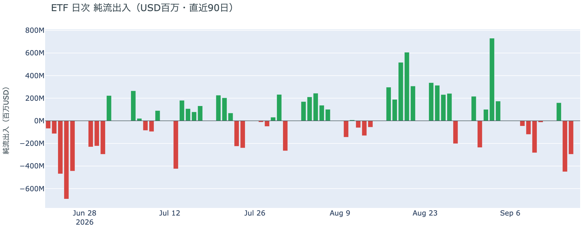

*図の見方: 入ったお金と出たお金の差。上に伸びれば入り超、下に伸びれば出超。*

| ETFの日ごとの出入り | 億ドル |
|---|---:|
| 9月11日 | −0.1 |
| 9月14日 | +1.6 |
| 9月15日 | −4.5 |
| 9月16日 | −3.0 |
| 直近7営業日の合計 | −10.0 |

* 木曜9月17日分は集計の途中で、まだ数値になっていない。

ETF は火曜・水曜の2日で7.5億ドルの出超になり、1週間の合計も前日の−5.8億ドルから−10億ドルへ広がりました。前日は「アメリカの買い手は火曜に売った、ただし逃げ続けているかはまだ1日分しか出ていない」と説明しました。水曜も出超だったので、1日だけではなくなっています。ただし水曜の出超は火曜の3分の2で、2日目に膨らんではいません。アメリカの買い手は、法案の否決と利上げをまたいで2日続けて売った、が今朝の読みです。図①-1 の木曜の価格差を合わせると、売りは木曜も続いていたと見えます。

**図①-3 Fear & Greed（市場心理の指数・直近90日）**

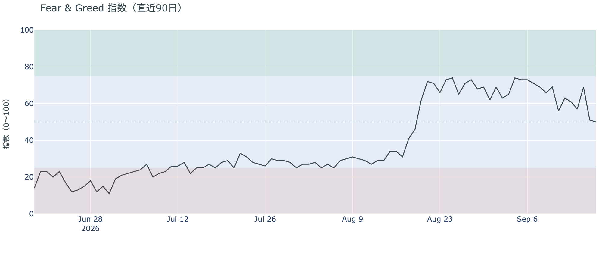

*図の見方: 0〜100で、50より上が「強欲」、下が「恐怖」。*

* 前日の51から1pt下がった。1週間前は69、1か月前は41。

市場心理は50の「中立」で、ちょうど真ん中です。木曜の反発でも「強欲」側に戻らず、1週間で19pt下がった位置にとどまっています。ただし1か月前の「恐怖」からは9pt上で、価格の下げを怖がっている人が多数になった形ではありません。

### ② 長期保有者の分配は4週目に入ったが、量は −10万BTC前後で変わらず、利益の幅は縮み続けている

**図②-1 長期保有者の保有量の30日変化とSOPR（直近60日）**

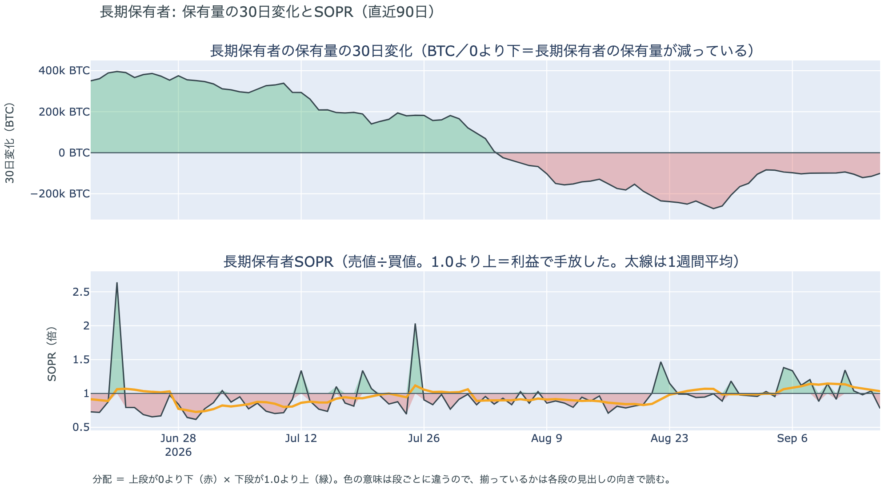

*図の見方: 上段は、長期保有者の保有量が30日でどれだけ増減したか。マイナス＝手放している。下段は長期保有者SOPRで、1より上なら利益で手放した。どちらも太線の1週間平均で読みます。*

| 9月16日時点 | 1週間平均 | 前の週の平均 |
|---|---:|---:|
| 長期保有者SOPR（1より上＝利益で手放した） | 1.03 | 1.13 |
| 長期保有者の保有量の30日変化（万BTC） | −10.5 | −9.5 |

* 減り方は1か月前（−17.4万BTC）の6割、8月末（−27万BTC前後）の4割弱。4週間続けて−10万BTC前後。
* 1年以上動いていないコインは全体の63.2%で、3か月で1.7pt増えた。売りに出てくるコインが少ない状態は続いている。

長期保有者（＝155日以上動かしていないコインの持ち主）は、利益の出ているコインを少しずつ手放し続けています。長期保有者SOPR（＝長期保有者が動かしたコインの売値÷買値）で見ると、動いたコインは平均して買値より3%高く手放されました。保有量が減り、動いた分が利益側という2つがそろっているので、これは分配（＝長期保有者からの放出）です。ただし量は4週間同じ水準で増えておらず、利益の幅は2週間前の14%、先週の5%から3%へ縮み続けています。価格が8月の上げの前の水準に近づくほど、手放したコインの利益が薄くなっているだけで、手放す勢いが強まった形ではありません。**ビットコイン自身の需給の土台は、前日と変わっていません。** ETFや取引所が預かっている分を差し引いても、この規模と向きは変わりません。

今日は、コインが最後に動いた価格の分布に大きな変化がなく、長く眠っていたコインが動いた記録もありません。マイナーの収入は平年並み（Puell Multiple（＝マイナー収入の平年比）が1週間平均で0.99）で、売りを急ぐ状況ではありません。

### ③ 先物：ロングは上乗せを再び払って積み直され、傾きは1日で戻った

**図③-1 資金調達率と建玉（直近30日）**

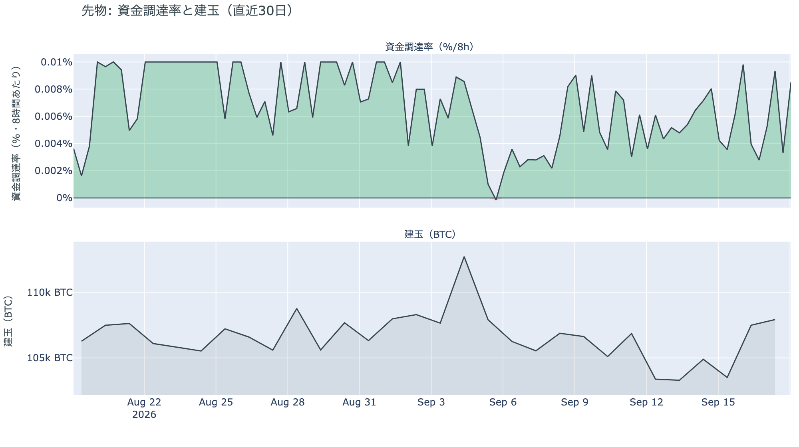

*図の見方: 上段は資金調達率（8時間ごと・日本時間）。プラスが続く＝ロングがショートより多い。下段は建玉。*

* 資金調達率はプラスが37回連続。ロングがショートより多い状態が12日続いている。
* 直近の8時間の率は、この30日でいちばん高い水準。上限（8時間あたり±0.3%）にはほど遠い。
* 建玉は火曜に+3.5%増えた水準から、木曜にさらに+0.3%。

前日に短期金利並みまで縮んでいたロングの上乗せが、1日で1か月の平均を超える水準に戻りました。建玉もわずかに増えているので、木曜の1%の上げのなかで、ロングが再び金利を払ってでも持つ側に積み直されたということです。前日は「火曜に入ったショートと残ったロングが向かい合ったまま、誰も動かなかった」と説明しましたが、木曜はロング側が動きました。ショートが手仕舞いをして建玉が減った形ではなく、建玉が増えているので、新しいロングが入っています。プラスの傾きは戻りましたが、上限には遠く、過熱ではありません。

### ④ オプション：9月21日までの満期はコールが高くなり、プットの備えは9月25日以降の満期だけに残った

オプションには2種類あります。コール（＝決めた価格で買う権利）とプット（＝決めた価格で売る権利）で、価格が上がればコールの価値が上がり、価格が下がればプットの価値が上がります。プットは「価格が下がったときの保険」として買われます。オプションを買う人は、その権利と引き換えに権利料（＝オプションを買う人が払う金額）を払います。

**図④-1 満期ごとのIV（年率%）**

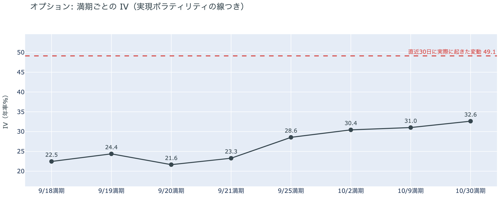

*図の見方: IVを満期ごとに並べたもの。点線は実現ボラティリティ。IVが点線より下なら、市場はこの先の値動きを過去の値動きより小さいと見ています。*

| 満期 | 今朝のIV | 前日のIV |
|---|---:|---:|
| 9月18日 | 22.5 | 34.6 |
| 9月19日 | 24.4 | 35.3 |
| 9月25日 | 28.6 | 33.5 |

* 実現ボラティリティは49.1。満期ごとに見ると、手前が低く先が高い平常の形で、突出した満期は無い。
* 前日の39.0から2.8pt下がった。

IV（＝オプション価格から逆算した、この先の値動きの幅の予想）は全体で36.2と、過去1年でいちばん低い位置です。実現ボラティリティ（＝直近30日に実際に起きた値動きの幅）より12.9pt低く、市場はこの先の値動きを、過去の値動きよりずっと小さいと見ています。守りを固めている状態ではなく、怖がってもいません。今日の昼に日銀の結果が出る18日の満期は、IV が手前のほかの満期と同じ20%台前半で、ほかの満期に対する権利料の上乗せは乗っていません。参加者は、日銀の結果でビットコインが大きく動くとは見ていないということです。

**図④-2 満期ごとのプットとコールの差**

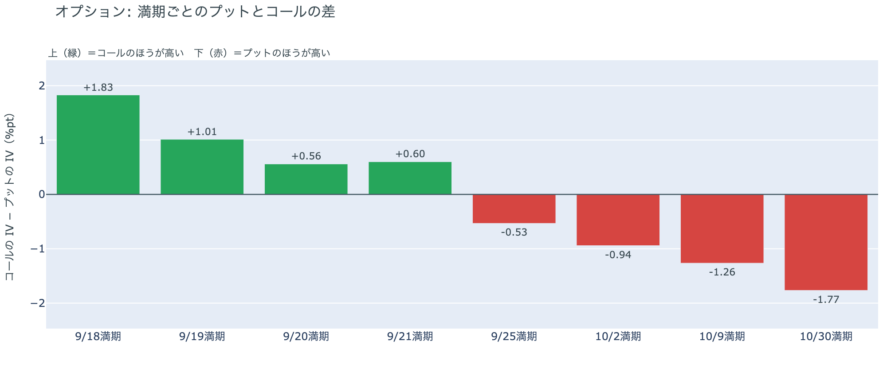

*図の見方: 満期ごとに、プットとコールのどちらが高く売れているか。ゼロより上ならコールのほうが高く、下ならプットのほうが高い。*

| 満期 | どちらが高いか |
|---|---|
| 9月18日 | コールがはっきり高い |
| 9月19日 | コールが高い |
| 9月20日 | コールが高い |
| 9月21日 | コールが高い |
| 9月25日 | プットが高い |
| 10月2日 | プットが高い |
| 10月9日 | プットが高い |
| 10月30日 | プットが高い |

* 前日は全部の満期でプットが高かった。9月21日までの4つの満期が、木曜に入れ替わった。
* 満期が先になるほどプットが高い度合いは大きく、10月30日がいちばん大きい。

参加者は、日銀の結果が出る今日から9月21日までの区間を「荒れない」と値付けし直し、備えは9月25日以降の満期に残しています。途中の満期で入れ替わるこの形が、今朝いちばんの材料です。前日は「参加者が身構えていたのは FOMC の結果そのものではなく、火曜に$78,000を割ったあとの価格の水準に対してだ」と説明しました。9月25日以降の満期でプットが高い形がそのまま残っているので、その部分は今日の数値と合っています。ただし9月21日までの手前の満期では、価格がほぼ同じ水準のまま、プットが高い形が消えました。手前の備えは、FOMC と日銀の結果が出るまでの間だけ置かれていたもので、価格の水準に対する備えは、9月25日の大きな満期から先の区間に置かれています。

**図④-3 9月25日満期の持ち高（権利の価格ごと）**

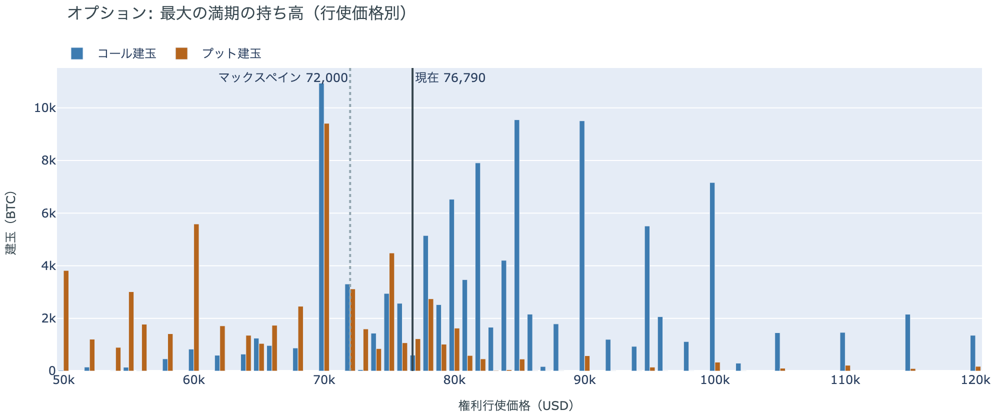

*図の見方: 青＝コール、橙＝プット。現値より上にコールが、下にプットが積まれるのが普通です。*

| 9月25日満期のオプション（価格は約$76,300） | 量（万BTC） | 意味 |
|---|---:|---|
| いまより高い価格のコール（決めた価格で買う権利） | 約9.5 | 「価格が上がる」に賭けた分 |
| いまより安い価格のプット（決めた価格で売る権利） | 約5.6 | 「価格が下がる」への保険 |
| うち、いまより15%以上高い価格のコール | 約5.0 | 大きな上げへの賭け |
| うち、いまより15%以上安い価格のプット | 約3.1 | 大きな下げへの保険 |

* 9月25日満期の持ち高は全部で188,665BTCと、全満期の43%。前日の188,204BTCとほぼ同じ。コールがプットの1.9倍で、前日と同じ。
* 持ち高が集まっている価格は、多い順に$76,000、$78,000、$75,000、$80,000。前日と同じ帯。

「価格が上がる」に賭けた人たちは降りていません。この賭けが報われるには、9月25日までの1週間で、オプションの持ち高が集まっている$75,000〜$80,000の帯の上端$80,000を超える必要があります。いまの価格はその帯の真ん中にあり、$80,000まで4.8%です。持ち高の形は FOMC をまたいでも木曜の反発でも変わっておらず、変わったのは図④-2 の手前の満期の値付けだけです。

## 4. 価格に影響しうる直近のイベント

予測ではなく、「次に市場が反応しうる材料」の案内です。今日の昼に日銀の結果が出ますが、18日の満期の権利料にはほかの満期に対する上乗せが乗っておらず、オプション市場はこの日を大きく動く日とは見ていません。備えは9月25日以降の満期にプットが高い形で並んでいて、9月25日は今年最大級の満期です。FOMC は「物価は高止まりしている」と述べ、18人中16人が年内もう1回の利上げを見込んでいるので、次の物価統計と雇用統計は金利の材料になります。

| 日付 | イベント | 何に効くか |
|---|---|---|
| 9/18（金）昼 | 日銀の会合の結果。1.00%から1.25%への利上げの織り込みは約9割。総裁の会見は15:30 | 円 |
| 9/25（金）17:00 | オプションの大きな満期（約18.9万BTC、全満期の43%） | 「価格が上がる」に賭けた人たちの期限。プットが高い形はこの満期から先 |
| 9/30（水）21:30 日本時間 | 米PCE物価（FRBが重視する物価統計）と4〜6月期GDPの確定値 | 金利。FOMC が年内もう1回の利上げを見込む根拠になる統計 |
| 10/2（金）21:30 日本時間 | 米9月の雇用統計 | 金利 |
| 日程未定 | 米下院本会議で、ビットコインの戦略準備を法律にする法案の採決（委員会は9月16日に可決） | 規制 |
| 日程未定 | ホルムズ海峡の航行をめぐるイランと湾岸6か国の外相会合（延期のまま） | 原油。サウジアラビアはオマーン経由の積み出しを追加で手配 |

## まとめ：木曜日の動きは何だったか

木曜日は、株が利上げの翌日に下げを取り戻した向きに、ビットコインも1%付いていった日でした。外部環境に新しい出来事はなく、動かしたのは証券市場の向きです。ビットコイン自身の需給では、買い手の顔ぶれが入れ替わっています。アメリカの買い手は火曜・水曜と2日続けて売り、木曜も Coinbase の価格がそれ以外より安く、市場心理は「中立」の真ん中にとどまりました。その一方で先物のロングは、前日に短期金利並みまで縮んだ上乗せを再び払って積み直され、傾きは1日で戻っています。長期保有者の分配は4週目に入りましたが、量は−10万BTC前後で変わらず、利益の幅は縮み続けています。オプションでは、9月21日までの満期でプットが高い形が消え、備えは9月25日以降の満期だけに残りました。IV は全体で過去1年でいちばん低く、日銀の結果が出る今日の満期にも上乗せは乗っていません。「価格が上がる」に賭けたコールの持ち高は、FOMC をまたいでも木曜の反発でも変わっていません。

---

*本稿は情報提供を目的としたものであり、投資助言ではありません。将来の価格動向を保証・示唆するものではなく、投資判断は各自の責任において行ってください。*
