# 6%の急伸で$81,000台、清算されたのはショート ― 建玉は増えず、アメリカの買い手は戻らず、9月25日以降の満期に残っていたプットの備えは10月30日を除いて消えた

**2026年9月19日**

金曜日は、証券市場がほとんど動かないなかで、ビットコインだけが6%上げた日です。夕方に$78,000を上抜けたところで売り持ち（ショート）の清算（＝証拠金不足で強制的に閉じられた取引）が集中し、ニューヨークの取引が始まる22時台に$80,000を超えました。建玉は増えておらず、アメリカの買い手も戻っていないので、上げは新しい買い手の流入ではなく、ショートが押し出された形です。オプションでは、9月25日以降の満期に残っていたプットの備えが、10月30日の満期を除いて消えました。

（数値は9月19日7時5分（日本時間）までのデータに基づきます。価格・先物・オプションはその時点の値、市場心理は9月18日の確定値、オンチェーン（＝ブロックチェーン上の記録）は9月17日時点、ETF資金フローは9月17日分まで（金曜18日分は集計前）です。証券市場の終値は9月18日時点です。オンチェーンの長期保有者の数値には、ETFや取引所が預かっている分も含まれます。オプションはDeribit（BTCオプションの大半を占める取引所）の全銘柄です。）

## 1. 何が起きたか

**図1-1 価格の推移（1時間足・直近7日）**

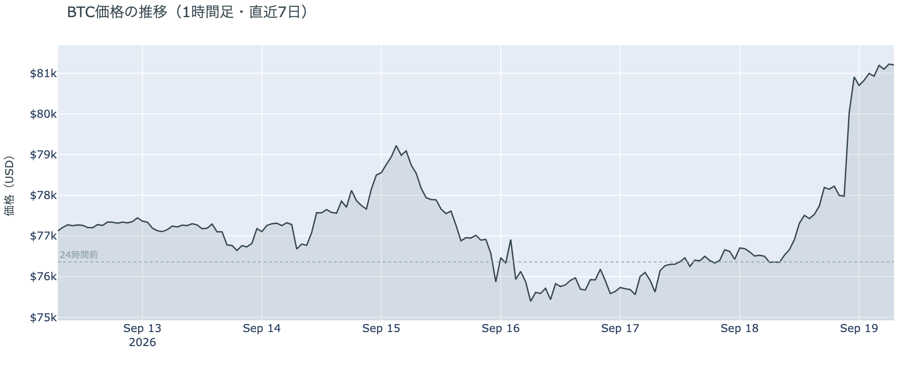

*図の見方: 1時間ごとの価格（日本時間）。火曜から木曜まで$75,000〜$77,000の平らな線が続き、右端の金曜夜にほぼ垂直な上げがあります。*

* 朝7時5分の時点で約$81,232。24時間で+6.4%、値幅は$76,205〜$81,388の6.8%。前日の2.0%の3倍以上。
* 1週間前と比べると+5.2%、1か月前と比べると+17.2%。1週間の高値を更新した。
* 朝から昼にかけて$77,000台へ、夕方に$78,000へ。22時台に$78,000から$80,000台後半へ一気に上げ、土曜の朝にかけて$81,000台。
* Hyperliquid（＝オンチェーンの先物取引所）で見える清算は、この24時間で148件。全部ショートで、$78,000を上抜けた18時台に集中し、価格帯も78,000ドル台が半分。137のアドレスに散らばり、最大の1件が全体の14%。

金曜日は、この1週間でいちばん大きく動いた日で、上げは清算を伴いました。清算されたのはショートだけで、大口が1つ飛んだのではなく、多数が押し出された形です。朝7時5分の価格は、9月3日の急騰の日の終値$81,264とほぼ同じで、火曜に付けた1週間の安値$74,888からは8.5%上です。

**図1-2 価格と50日・200日移動平均**

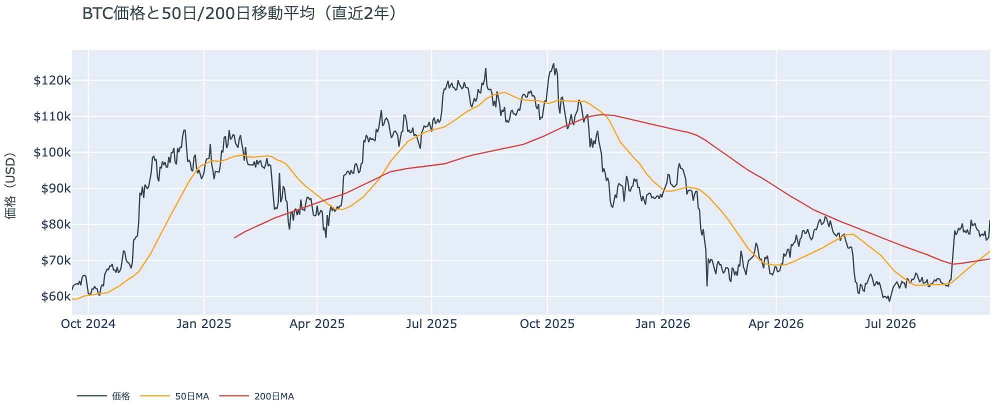

*図の見方: 2本の平均線の上下関係を見ます。50日線が200日線の上にあるのがゴールデンクロスです。*

* 50日線と200日線の差は約$2,078（3.0%）で、前日の$1,809からさらに開いた。
* 価格は50日線$72,477の約12%上。前日の6%から一気に離れた。

ゴールデンクロス（＝50日線が200日線を上抜けること）の状態は11日目で、2本の線の差は毎日開き続けています。金曜の上げで、価格と50日線の距離は前日の2倍に広がりました。

証券市場は金曜もほとんど動いていません。9月18日の終値は、S&P500が+0.2%で週間ではわずかに下げ、金は+0.4%、原油は−6.3%で$95.47と$100を割り、米10年債利回りは5.00%へ上がりました。

## 2. なぜ動いたか：ビットコイン自身の需給か、外部環境か

**図2-1 ビットコインと株・金・原油の相対推移（起点＝100）**

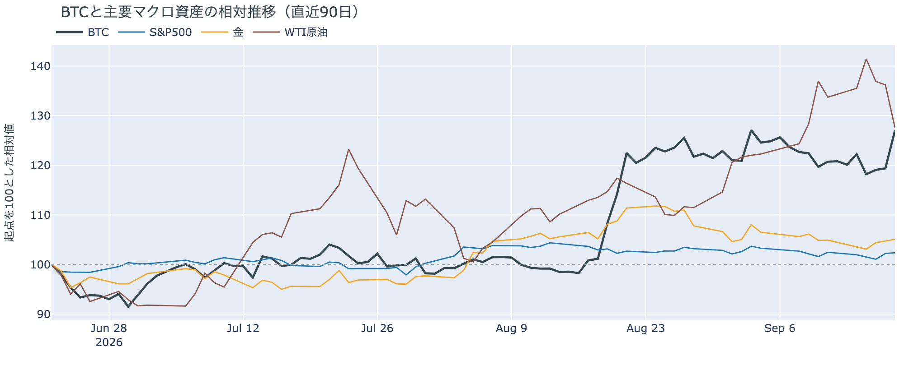

*図の見方: 同じ起点から何%動いたかで重ねたもの。線が同じ向きなら「一緒に動いた」、ビットコインだけ別の向きなら「自身の理由で動いた」と読みます。*

| この5営業日の動き（ビットコインは7日間） | 変化 |
|---|---:|
| ビットコイン | +5.2% |
| 金 | +0.2% |
| 米国株（S&P500） | −0.1% |
| 原油 | −4.6% |

* 金曜9月18日は、株が+0.2%、金が+0.4%、原油が−6.3%、米10年債利回りは5.00%へ上昇。1日の証券市場の動きは「まちまち」。
* 建玉は108,380BTC。前日の108,257BTCから+0.1%、1週間では+1.3%。
* 資金調達率はプラスが40回連続。1日をならした年率は+8.22%で、短期金利（＝ドルを米国の短期国債で持つだけで受け取れる金利。13週Tビル 3.98%）を引いた上乗せは+4.24pt。前日の+3.76pt、直近1か月の平均+3.50ptより大きい。
* 直近30日の値動きの相関は、金が+0.68、S&P500が+0.29。

金曜日にビットコインが6%上げたのは、ビットコイン自身の需給、なかでも先物のショートが清算で押し出されたからで、証券市場と同じ向きに動いたのではありません。理由は3つです。

1. 証券市場はほとんど動いていません。株も金も小幅で、米10年債利回りは上がりました（株には重しになる向き）。原油だけが大きく下げましたが、株はその向きにほぼ反応しておらず、ビットコインの上げ幅は証券市場のどれとも大きさが違います。
2. 上げは清算を伴い、清算されたのは全部ショートでした。$78,000を上抜けた夕方に集中し、多数のアドレスに散らばっています。建玉（＝先物の未決済残高。証拠金で張っている人の量）は前日とほぼ同じで、資金調達率（＝ロングが払う金利。プラス＝ロングがショートより多い）の短期金利に対する上乗せは1か月の平均より大きいままです。清算で消えたショートの分だけ新しい持ち高が入って差し引きゼロ、という形です。
3. アメリカの買い手は戻っていません（図①-1・図①-2）。Coinbaseの価格はそれ以外より安いままで、ETFの木曜分は入り超でしたが、金曜の上げより前の数字です。

この説明が違うなら、つまりショートの押し出しではなく新しい買い手が入ったのなら、来週に出る金曜分のETFが大きな入り超になり、Coinbase Premiumがプラスに転じます。その形が出たら、この説明は取り下げます。

外部環境では、日銀が金曜の昼に政策金利を1.00%から1.25%へ引き上げました（賛成7・反対2）。植田総裁は会見で利上げを続ける考えを示し、連続の利上げも「排除しない」と述べましたが、円は1ドル156円台へ安くなりました。日銀の結果が出た昼の時点でビットコインは$77,000台で、大きく動いたのはその10時間後です。

原油は金曜に6.3%下げて$95.47と、$100を割りました。サウジアラビアがパイプラインの被害を迂回してホルムズ海峡経由の積み出しを増やし（衛星画像の分析では直近6日で日量280万バレル、8月の70万バレルの4倍）、供給不足の懸念が和らいだと報じられています。フーシ派とイランの脅威は残っており、リスク資産全体の重しになりうる状況が消えたわけではありません。

規制では、米商品先物取引委員会（CFTC）が木曜（米国時間17日）に、暗号資産の取引と市場に関する規則案をホワイトハウスの審査に送りました。上院でCLARITY法案（＝暗号資産の市場構造法案）の手続き投票が否決された2日後で、議会を待たずに規則で進める形です。審査のあとCFTCで採決し、公表と意見募集に進みます。日程は出ていません。

## 3. 市場参加者はいまどう見ているか

### ① アメリカの買い手は6%の上げの日も買い側に戻らず、市場心理だけが「強欲」に戻った

**図①-1 Coinbase Premium（アメリカとそれ以外の価格差・直近90日）**

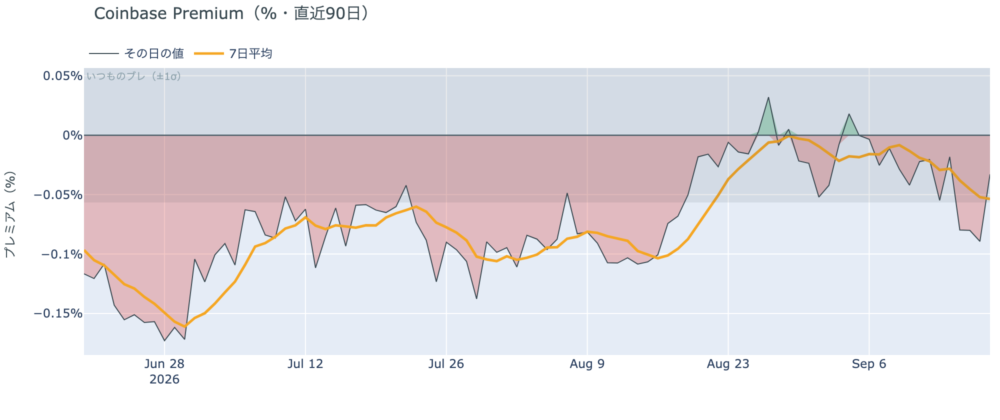

*図の見方: プラス＝アメリカで買いが強い。太線が1週間平均、細線がその日の値。薄い帯は「いつものブレの範囲」です。*

* 1週間平均は−0.054%。先週の−0.019%から3倍のマイナス幅で、8月中旬の−0.10%との中間。
* その日の値は−0.033%で、いつものブレの内側。木曜の−0.089%からマイナス幅は縮んだ。

Coinbase Premium（＝アメリカとそれ以外の価格差）は、6%上げた金曜もマイナスでした。アメリカ側の価格がそれ以外より高くなる形は出ておらず、上げを引っ張ったのはアメリカの買い手ではありません。木曜のような大きなマイナスは金曜に縮みましたが、1週間平均は先週より弱く、買い側には戻っていません。

**図①-2 ETFの日ごとの資金の出入り（直近90日）**

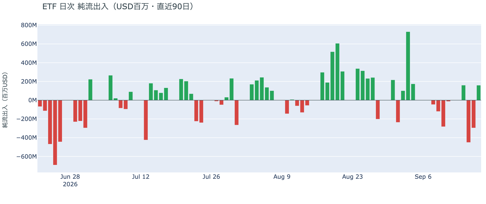

*図の見方: 入ったお金と出たお金の差。上に伸びれば入り超、下に伸びれば出超。*

| ETFの日ごとの出入り | 億ドル |
|---|---:|
| 9月14日 | +1.6 |
| 9月15日 | −4.5 |
| 9月16日 | −3.0 |
| 9月17日 | +1.6 |
| 直近7営業日の合計 | −8.4 |

* 金曜9月18日分は集計前で、まだ数値になっていない。

ETFは木曜に入り超へ戻りましたが、火曜・水曜の出超7.5億ドルの2割ほどを埋めただけで、1週間の合計はまだ出超です。前日は「アメリカの買い手は火曜・水曜と2日続けて売った」と説明しました。木曜は買い戻していますが、金曜の6%の上げより前の数字なので、上げにアメリカの買い手が乗ったかどうかは、まだこの表には出ていません。

**図①-3 Fear & Greed（市場心理の指数・直近90日）**

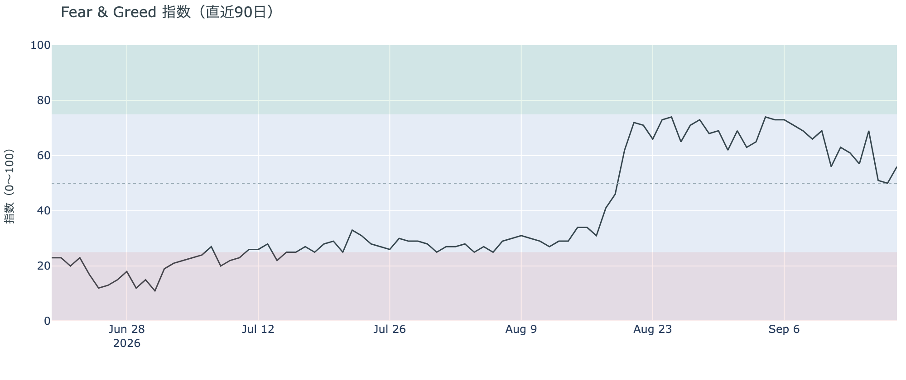

*図の見方: 0〜100で、50より上が「強欲」、下が「恐怖」。*

* 前日の50から6pt上がり、1週間前と同じ。1か月前は46。

市場心理は56の「強欲」に戻りました。木曜の「中立」の真ん中から1日で戻り、1週間前と同じ位置です。6%の上げを怖がっている人は多くありませんが、8月末から9月上旬の70前後には遠く、「極度の強欲」でもありません。

### ② 長期保有者は手放し続けているが、量は5週目も変わらず、利益の幅はほぼゼロになった

**図②-1 長期保有者の保有量の30日変化とSOPR（直近60日）**

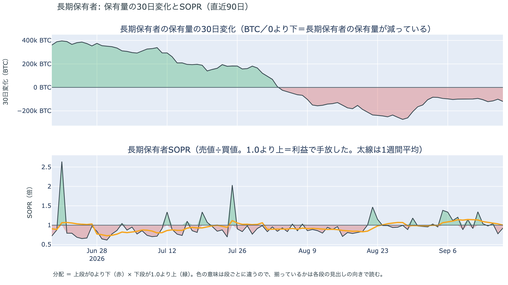

*図の見方: 上段は、長期保有者の保有量が30日でどれだけ増減したか。マイナス＝手放している。下段は長期保有者SOPRで、1より上なら利益で手放した。どちらも太線の1週間平均で読みます。*

| 9月17日時点 | 1週間平均 | 前の週の平均 |
|---|---:|---:|
| 長期保有者SOPR（1より上＝利益で手放した） | 1.00 | 1.15 |
| 長期保有者の保有量の30日変化（万BTC） | −10.8 | −9.7 |

* 減り方は1か月前（−18.1万BTC）の6割、8月末（−27万BTC前後）の4割。5週間続けて−10万BTC前後。
* 1年以上動いていないコインは全体の63.3%で、3か月で1.8pt増えた。売りに出てくるコインが少ない状態は続いている。

長期保有者（＝155日以上動かしていないコインの持ち主）は、コインを少しずつ手放し続けていますが、動いたコインの利益はほぼ無くなりました。長期保有者SOPR（＝長期保有者が動かしたコインの売値÷買値）で見ると、動いたコインは平均して買値とほぼ同じ価格（0.2%高い）で手放されています。前の週までは2桁の利益で手放されていたので、利益の幅はこの1週間でゼロ近くまで縮んだ形です。保有量の減り方は5週間同じで、手放す勢いは強まっていません。この数値は9月17日時点で、金曜の6%の上げは入っていません。**ビットコイン自身の需給の土台は、前日と変わっていません。** ETFや取引所が預かっている分を差し引いても、この規模と向きは変わりません。

長く眠っていたコインが動いた記録はありません。マイナーの収入は平年並み（Puell Multiple（＝マイナー収入の平年比）が1週間平均で1.00）で、売りを急ぐ状況ではありません。

### ③ 先物：6%上げても建玉は増えず、清算で消えたショートの分だけ持ち高が入れ替わった

**図③-1 資金調達率と建玉（直近30日）**

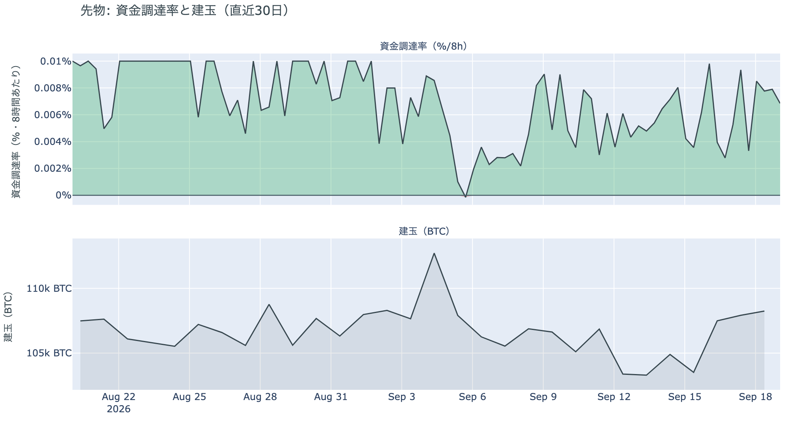

*図の見方: 上段は資金調達率（8時間ごと・日本時間）。プラスが続く＝ロングがショートより多い。下段は建玉。*

* 資金調達率はプラスが40回連続（約13日）。ロングがショートより多い状態が続いている。
* 直近の8時間の率は30日の最大に近いが、上限（8時間あたり±0.3%）にはほど遠い。
* 建玉は108,380BTC。金曜の6%の上げのなかで前日から+0.1%。

6%上げた日に建玉が増えていないのは、清算で消えたショートと同じだけ新しい持ち高が入り、差し引きゼロになったからです。新しい買い持ち（ロング）が大量に積まれた形ではありません。資金調達率の短期金利に対する上乗せは1か月の平均より大きく、ロングが金利を払ってでも持つ側に傾いたままです。前日は「ロングは上乗せを再び払って積み直された」と説明しました。金曜はそのロングが残ったまま、向かい側のショートが清算で押し出されたので、前日の説明は今日の数値と合っています。上限には遠く、過熱ではありません。

### ④ オプション：9月25日以降の満期に残っていたプットの備えは、10月30日を除いて消えた

オプションには2種類あります。コール（＝決めた価格で買う権利）とプット（＝決めた価格で売る権利）で、価格が上がればコールの価値が上がり、価格が下がればプットの価値が上がります。プットは「価格が下がったときの保険」として買われます。オプションを買う人は、その権利と引き換えに権利料（＝オプションを買う人が払う金額）を払います。

**図④-1 満期ごとのIV（年率%）**

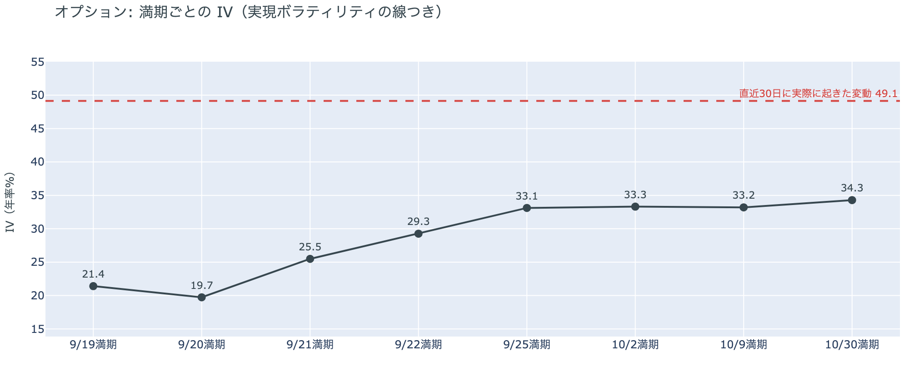

*図の見方: IVを満期ごとに並べたもの。点線は実現ボラティリティ。IVが点線より下なら、市場はこの先の値動きを過去の値動きより小さいと見ています。*

* IVは全体で33.6。前日の36.2からさらに下がり、過去1年の下から6%の位置。実現ボラティリティは49.1。
* 満期ごとに見ると、手前が低く先が高い平常の形で、突出した満期は無い。

IV（＝オプション価格から逆算した、この先の値動きの幅の予想）は実現ボラティリティ（＝直近30日に実際に起きた値動きの幅）より15.5pt低く、市場はこの先の値動きを、過去の値動きよりずっと小さいと見ています。6%上げた日にIVが下がったのは、参加者がこの上げを荒れの始まりとは見ていないということです。守りを固めている状態ではなく、怖がってもいません。特定の満期のオプションの権利料に、ほかの満期に対する上乗せは乗っておらず、今朝の時点で大きく動くと見られている日はありません。

**図④-2 満期ごとのプットとコールの差**

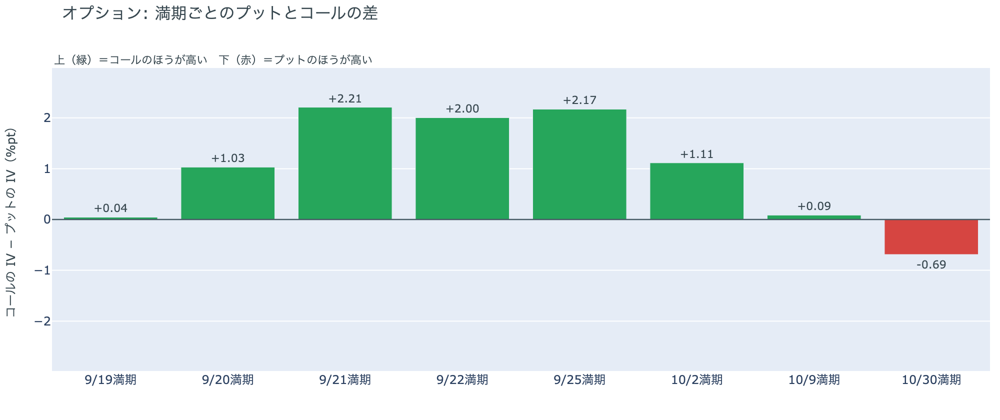

*図の見方: 満期ごとに、プットとコールのどちらが高く売れているか。ゼロより上ならコールのほうが高く、下ならプットのほうが高い。*

| 満期 | どちらが高いか |
|---|---|
| 9月19日 | ほぼ差なし |
| 9月20日 | コールが高い |
| 9月21日 | コールがはっきり高い |
| 9月22日 | コールがはっきり高い |
| 9月25日 | コールがはっきり高い（前日はプットが高かった） |
| 10月2日 | コールが高い（前日はプットが高かった） |
| 10月9日 | ほぼ差なし（前日はプットが高かった） |
| 10月30日 | プットが高い |

* 前日は9月25日以降の4つの満期すべてでプットが高かった。金曜の上げで、10月9日までの3つが入れ替わった。

9月25日以降の満期に残っていたプットの備えが、金曜の上げで10月30日の満期を除いて消え、参加者は「価格が上がる」側のコールの権利料をプットより高く払っています。途中の満期で入れ替わるこの形が、今朝いちばんの材料です。前日は「価格の水準に対する備えは、9月25日の大きな満期から先の区間に置かれている」と説明しました。価格が$80,000を超えたところでその備えが剥がれたので、あれはFOMC（＝米国の金利を決める会合）や日銀の結果ではなく価格の水準に対する備えだった、という前日の説明は今日の数値と合っています。残る備えは10月30日の満期だけで、10月27日〜28日のFOMCの直後に当たります。

**図④-3 9月25日満期の持ち高（権利の価格ごと）**

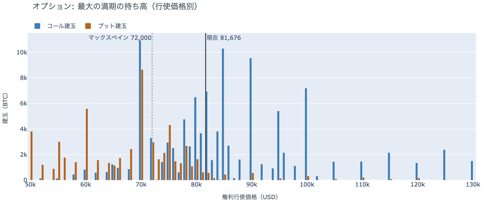

*図の見方: 青＝コール、橙＝プット。現値より上にコールが、下にプットが積まれるのが普通です。*

| 9月25日満期のオプション（価格は約$81,200） | 量（万BTC） | 意味 |
|---|---:|---|
| いまより高い価格のコール（決めた価格で買う権利） | 約7.7 | 「価格が上がる」に賭けた分 |
| いまより安い価格のプット（決めた価格で売る権利） | 約6.4 | 「価格が下がる」への保険 |
| うち、いまより15%以上高い価格のコール | 約3.9 | 大きな上げへの賭け |
| うち、いまより15%以上安い価格のプット | 約3.5 | 大きな下げへの保険 |

* 9月25日満期の持ち高は全部で189,335BTCと、全満期の44%。前日の188,665BTCとほぼ同じ。コールがプットの1.8倍で、前日の1.9倍とほぼ同じ。
* 持ち高が集まっている価格は、多い順に$80,000、$82,000、$85,000、$81,000。前日の$75,000〜$80,000から、帯そのものが上に移った。

「価格が上がる」に賭けた人たちは降りておらず、その賭けは帯の上端だった$80,000を超えたことで報われ始めています。前日まで「報われるには9月25日までに$80,000を超える必要がある」と書いてきた水準を、金曜の1日で越えました。持ち高の形は変わっておらず、変わったのは価格の側です。いまの価格は持ち高が集まる$80,000〜$85,000の帯の下のほうにあり、この上には$85,000と$90,000のコールが厚く積まれています。そこまで賭けた人が報われるには、9月25日までに$85,000を超える必要があります。

### ⑤ 価格が「最後に動いた価格」の帯を1つ上へまたぎ、価格より上に残る供給は全体の2割弱になった

**図⑤-1 コインが最後に動いた価格の分布（9月17日時点）**

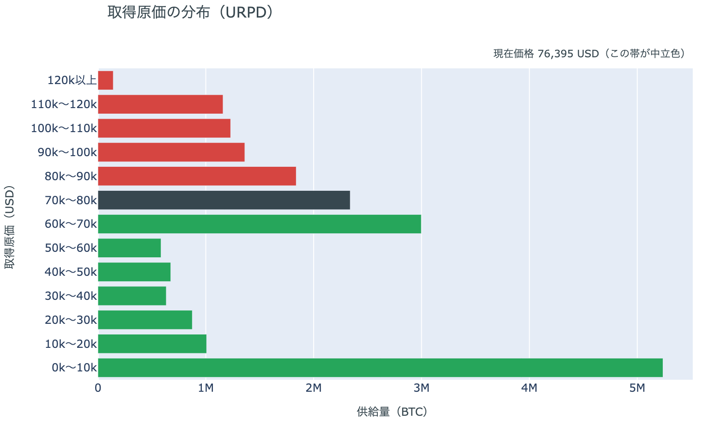

*図の見方: 横棒は、その価格帯で最後に動いたコインの量。中立色の帯は9月17日の価格がいた帯で、今朝の価格はその1つ上の帯にあります。*

| 9月17日時点の分布に今朝の価格を重ねると | 供給（万BTC） | 全供給比 |
|---|---:|---:|
| 価格より上の帯（$90,000以上） | 約389 | 19.4% |
| 価格がいる帯（$80,000〜$90,000） | 約184 | 9.2% |
| 価格より下の帯（$80,000未満） | 約1,435 | 71.5% |

* 帯の中の位置は下端から12%。下端$80,000まで−1.5%、上端$90,000まで+10.8%。
* 1日前は$70,000〜$80,000の帯にいた。価格より上の帯は28.5%から19.4%へ減った。
* 価格より上で最も厚い帯は$90,000〜$100,000（6.8%）で、その上も$120,000まで6%前後の帯が続く。

金曜の上げで、価格は「最後に動いた価格」の帯を1つ上へまたぎ、$80,000〜$90,000の帯に入りました。この帯に価格がいるのは、直近1週間で初めてです。$70,000〜$80,000で最後に動いた234万BTC（全供給の11.6%）が価格の下側に回ったので、価格より上に「最後に動いた価格」を持つ供給は3割弱から2割弱へ減りました。これは分布の形の話で、その量の売りが待っていることを意味しません。価格は帯の下端$80,000のすぐ上にあります。

## 4. 価格に影響しうる直近のイベント

予測ではなく、「次に市場が反応しうる材料」の案内です。オプション市場が備えを置いているのは10月30日の満期だけで、10月27日〜28日のFOMCの直後に当たります。9月25日の大きな満期から10月9日までは、コールがプットより高いか差の無い形です。FOMCは年内もう1回の利上げを見込んでおり、米10年債利回りは5%に上がっているので、次の物価統計と雇用統計は金利の材料になります。

| 日付 | イベント | 何に効くか |
|---|---|---|
| 9/25（金）17:00 | オプションの大きな満期（約18.9万BTC、全満期の44%） | 「価格が上がる」に賭けた人たちの期限。10月9日までの満期はコールが高い |
| 9/30（水）21:30 日本時間 | 米PCE物価（8月分。FRBが重視する物価統計）と4〜6月期GDPの確定値 | 金利。10月のFOMCでもう1回利上げするかの材料 |
| 10/2（金）21:30 日本時間 | 米9月の雇用統計 | 金利 |
| 10/27（火）〜28（水） | FOMC。もう1回の0.25%利上げの織り込みは9月17日時点で約55% | 金利。10月30日の満期でプットが高いのはこの直後 |
| 日程未定 | CFTCの暗号資産規則案。ホワイトハウスの審査のあとCFTCで採決し、公表と意見募集へ | 規制 |
| 日程未定 | 米下院本会議で、ビットコインの戦略準備を法律にする法案の採決（委員会は9月16日に可決） | 規制 |
| 日程未定 | ホルムズ海峡の航行をめぐるイランと湾岸諸国の外相会合（延期のまま） | 原油。サウジアラビアは海峡経由の積み出しを日量280万バレルまで増やしている |

## まとめ：金曜日の動きは何だったか

金曜日は、証券市場がほとんど動かないなかで、ビットコインだけが6%上げた日でした。動かしたのはビットコイン自身の需給で、$78,000を上抜けたところでショートが清算で押し出され、ニューヨークの朝に$80,000を超えました。ただし建玉は増えておらず、アメリカの買い手はCoinbaseの価格でもETFでも戻っておらず、長期保有者は9月17日時点で手放す量を変えていません。新しい買い手が入った形はまだ数字に出ていないので、ビットコイン自身の需給の土台が変わった日とは言えません。参加者の見方は変わりました。9月25日以降の満期に残っていたプットの備えは10月30日を除いて消え、9月25日の満期でコールに賭けた人たちは$80,000を超えたことで報われ始め、持ち高が集まる帯は$80,000〜$85,000へ上に移りました。IVは6%上げた日にも下がり、市場心理は「強欲」に戻りました。

---

*本稿は情報提供を目的としたものであり、投資助言ではありません。将来の価格動向を保証・示唆するものではなく、投資判断は各自の責任において行ってください。*
