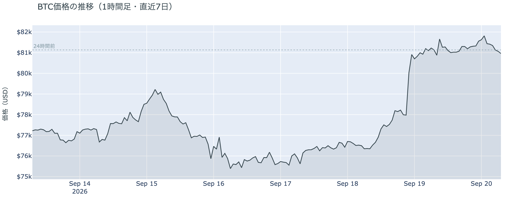
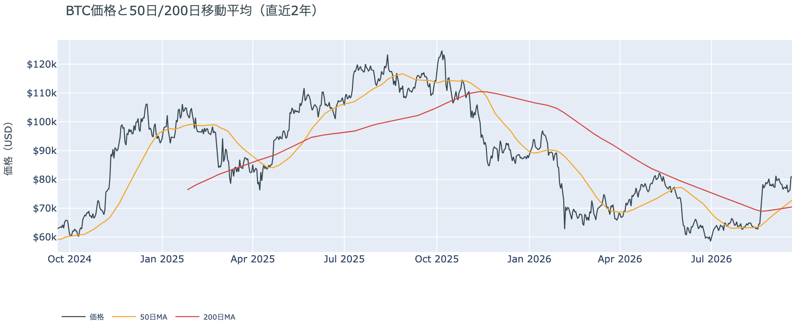
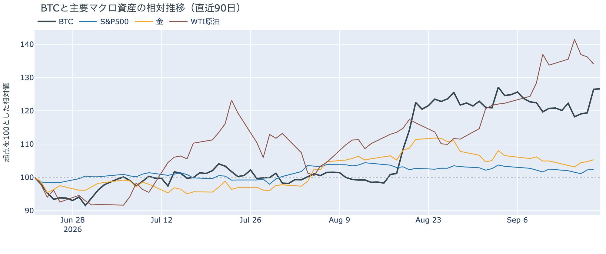
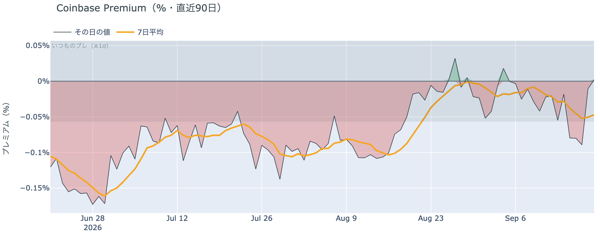
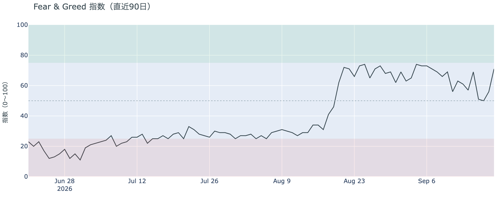
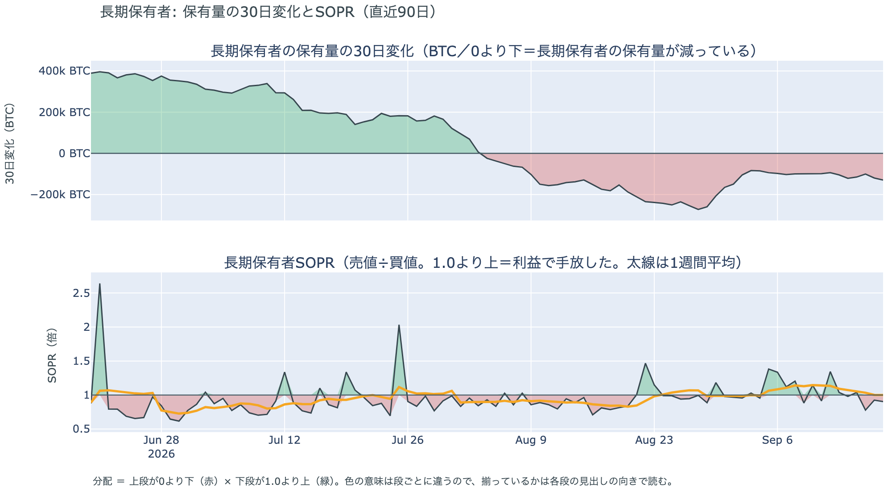
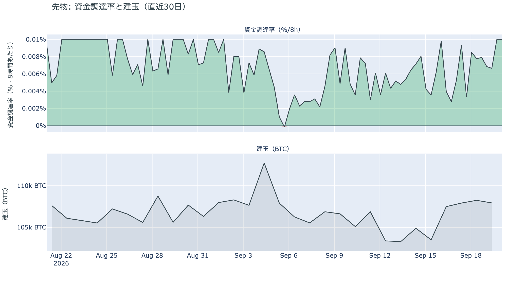
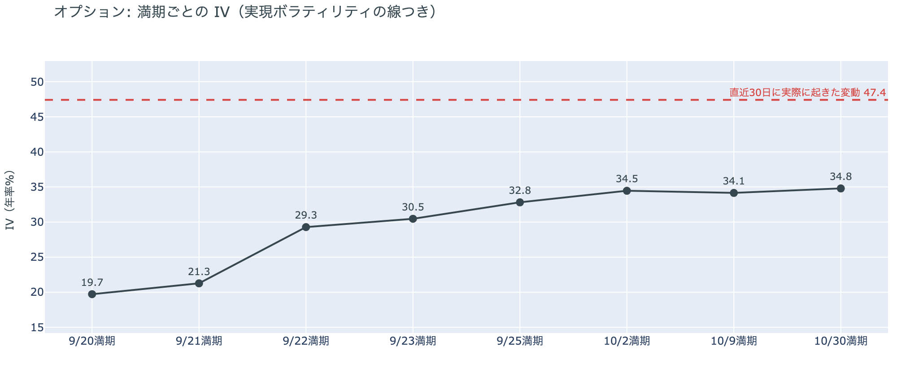
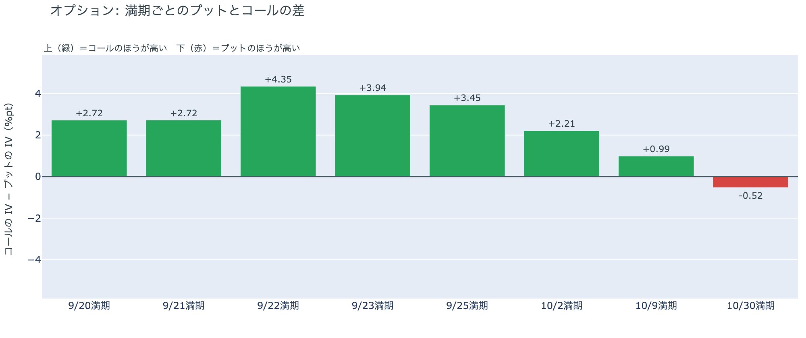
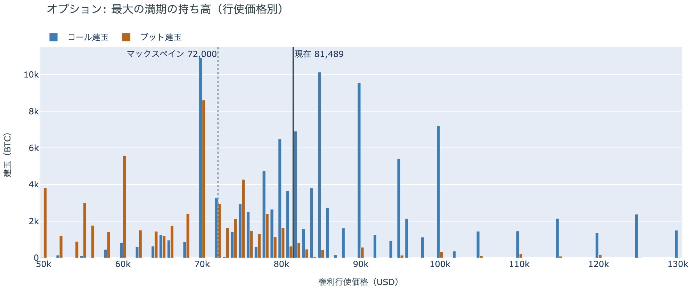

# 急伸の翌日は値幅1.4%で$81,000台を保ち、清算されたのは朝のショート ― 金曜分のETFは9月3日以来の入り超、市場心理は71へ跳ね、プットの備えは10月30日の満期だけのまま

**2026年9月20日**

土曜日は、金曜の6%の上げをそのまま保った日です。24時間の値幅は$80,822〜$81,925の1.4%で、朝に$81,700まで伸びた場面で売り持ち（ショート）の清算（＝証拠金不足で強制的に閉じられた取引）が出ましたが、そのあとは$81,000台で平らでした。証券市場は週末で閉まっています。前日に「金曜の上げは新しい買い手の流入ではなく、ショートが押し出された形」と説明しましたが、金曜分のETFは+4.3億ドルと9月3日以来の大きさで、ETF経由のアメリカの買い手は金曜の上げに乗っていました。ただし1週間の合計はまだ出超で、Coinbaseの価格ではアメリカ側が高い形は出ていません。オプションの持ち高と備えの形は週末をまたいでも変わらず、**プットの備えは10月30日の満期だけ**です。

（数値は9月20日7時5分（日本時間）までのデータに基づきます。価格・先物・オプションはその時点の値、市場心理は9月19日の確定値、オンチェーン（＝ブロックチェーン上の記録）は9月18日時点、ETF資金フローは9月18日の金曜分までです。証券市場の終値は9月18日時点で、週末のため更新がありません。オンチェーンの長期保有者の数値には、ETFや取引所が預かっている分も含まれます。オプションはDeribit（BTCオプションの大半を占める取引所）の全銘柄です。）

## 1. 何が起きたか

**図1-1 価格の推移（1時間足・直近7日）**

*図の見方: 1時間ごとの価格（日本時間）。金曜夜のほぼ垂直な上げのあと、土曜から日曜の朝まで線がほぼ平らです。*

* 朝7時5分の時点で約$80,958。24時間で−0.2%、値幅は1.4%。前日の6.8%の5分の1。
* 1週間前と比べると+4.8%、1か月前と比べると+10.9%。
* 土曜の9時台に$81,700近くまで伸びたあと、夕方まで$81,000〜$81,300。日曜の0時台に$81,925の高値を付け、朝にかけて$81,000をわずかに割った。
* Hyperliquid（＝オンチェーンの先物取引所）で見える清算は、この24時間で80件。9割がショートで、土曜9時台に4割が集中し、価格帯は81,000ドル台が9割。73のアドレスに散らばり、最大の1件が全体の20%。

土曜日は、金曜の上げを崩さずに保った日です。朝に$81,700まで伸びた場面は清算を伴い、清算されたのはショートで、大口が1つ飛んだのではなく多数が押し出された形です。ただし件数は金曜の半分ほどで、値動きも1%に収まりました。朝7時5分の価格は金曜の朝とほぼ同じで、9月3日の急騰の日の終値$81,264のすぐ下にあります。

**図1-2 価格と50日・200日移動平均**

*図の見方: 2本の平均線の上下関係を見ます。50日線が200日線の上にあるのがゴールデンクロスです。*

* 50日線と200日線の差は約$2,372（3.4%）で、前日の$2,078からさらに開いた。
* 価格は50日線$72,833の約11%上。前日の12%からわずかに縮んだ。

ゴールデンクロス（＝50日線が200日線を上抜けること）の状態は12日目で、2本の線の差は毎日開き続けています。価格が動かなかった土曜も50日線のほうは上がったので、価格と50日線の距離は少しだけ縮みました。

証券市場は週末で休みです。金曜9月18日の終値は、S&P500が+0.2%、金が+0.6%、原油は−1.6%で$100.30、米10年債利回りは5.00%でした。

## 2. なぜ動いたか：ビットコイン自身の需給か、外部環境か

**図2-1 ビットコインと株・金・原油の相対推移（起点＝100）**

*図の見方: 同じ起点から何%動いたかで重ねたもの。線が同じ向きなら「一緒に動いた」、ビットコインだけ別の向きなら「自身の理由で動いた」と読みます。*

| この5営業日の動き（ビットコインは7日間） | 変化 |
|---|---:|
| ビットコイン | +4.8% |
| 金 | +0.4% |
| 米国株（S&P500） | −0.1% |
| 原油 | +0.3% |

* 証券市場が閉まっている24時間で、ビットコインも1.4%しか動かなかった。
* 建玉は107,502BTC。前日の108,380BTCから−0.8%、1週間では+4.4%。
* 資金調達率はプラスのまま。1日をならした年率は+9.72%で、短期金利（13週Tビル 3.98%）を引いた上乗せは+5.75pt。前日の+4.24pt、直近1か月の平均+3.70ptより大きく、1か月の最大+7.25ptに近い。
* 直近30日の値動きの相関は、金が+0.70、S&P500が+0.29。

土曜日に価格が動かなかった理由は2つです。

1. 証券市場が閉まっていて、株・金・原油からの影響が止まっていた。この5営業日は金も株も原油もほとんど動いておらず、ビットコインの+4.8%は金曜の1日で付いたものです。証券市場と同じ向きに動いた週ではありません。
2. 金曜にショートが押し出されたあと、土曜は新しい持ち高がほとんど入らなかった。建玉（＝先物の未決済残高。証拠金で張っている人の量）は朝の清算で消えた分だけ減り、資金調達率（＝ロングが払う金利。プラス＝ロングがショートより多い）はプラスのままです。買い持ち（ロング）が残り、向かい側のショートが減った形なので、価格を動かす取引が土曜にはありませんでした。

外部環境では、原油が金曜に1.6%下げて$100.30と、$100の水準に残っています。ホルムズ海峡の通航は止まったまま（9月13日の通過は8隻で、平時の約85隻の1割以下）で、イランと湾岸諸国の外相会合も延期されたままです。イランの国営メディアは土曜にタンカーへの攻撃を伝えましたが、独立した確認は出ていません。原油が$100にあることは変わらず、リスク資産全体の重しになりうる状況は続いています。

## 3. 市場参加者はいまどう見ているか

### ① アメリカの買い手はETFでは金曜に買い、Coinbaseの価格ではまだ戻らず、市場心理は「強欲」の上のほうへ跳ねた

**図①-1 Coinbase Premium（アメリカとそれ以外の価格差・直近90日）**

*図の見方: プラス＝アメリカで買いが強い。太線が1週間平均、細線がその日の値。薄い帯は「いつものブレの範囲」です。*

* 1週間平均は−0.047%。先週の−0.022%からマイナス幅が倍になった。8月中旬は−0.10%。
* その日の値は+0.002%で、9月4日以来のプラス。ただしいつものブレの内側で、ゼロと変わらない。

Coinbase Premium（＝アメリカとそれ以外の価格差）は、1週間平均で見るとマイナスが先週より深く、アメリカ側の価格がそれ以外より高い形はまだ出ていません。土曜の値はゼロに戻りましたが、木曜までの大きなマイナスが消えた、というところまでです。金曜の上げにアメリカの買い手が乗っていたかは、Coinbaseの価格では見えず、ETFの数字（図①-2）に出ています。

**図①-2 ETFの日ごとの資金の出入り（直近90日）**

*図の見方: 入ったお金と出たお金の差。上に伸びれば入り超、下に伸びれば出超。*

| ETFの日ごとの出入り | 億ドル |
|---|---:|
| 9月15日 | −4.5 |
| 9月16日 | −3.0 |
| 9月17日 | +1.6 |
| 9月18日 | +4.3 |
| 直近7営業日の合計 | −2.9 |

* 金曜9月18日分は、9月3日の+7.3億ドルに次ぐ、この1か月で2番目の大きさ。
* 1週間の合計は、火曜・水曜の出超7.5億ドルが残ってまだ出超。

ETFは金曜に9月3日以来の入り超となり、ETF経由のアメリカの買い手は金曜の6%の上げに乗っていました。前日は「上げは新しい買い手の流入ではなくショートが押し出された形」と説明し、「金曜分のETFが大きな入り超になり、Coinbase Premiumがプラスに転じたら取り下げる」と書きました。その2つのうちETFの側だけが出たので、説明をこう直します。金曜の上げはショートの押し出しが主で、そこにETFの買いが同じ日に重なりました。ただし1週間の合計はまだ出超で、Coinbase Premium（図①-1）の1週間平均もマイナスのままなので、アメリカの買い手が「戻った」とまでは言えません。

**図①-3 Fear & Greed（市場心理の指数・直近90日）**

*図の見方: 0〜100で、50より上が「強欲」、下が「恐怖」。*

* 前日の56から15pt上がり、1週間前の63、1か月前の62を上回った。9月7日以来の高さ。

市場心理は71の「強欲」で、金曜の上げを1日遅れで映して跳ねました。「極度の強欲」の境目である75には届いていません。価格の上げを怖がっている人は少なく、木曜まで「中立」の真ん中にいた人たちが2日で「強欲」の上のほうへ移った形です。

### ② 長期保有者は手放し続け、量は先週よりやや増えたが、動いたコインの利益はほぼゼロのまま

**図②-1 長期保有者の保有量の30日変化とSOPR（直近60日）**

*図の見方: 上段は、長期保有者の保有量が30日でどれだけ増減したか。マイナス＝手放している。下段は長期保有者SOPRで、1より上なら利益で手放した。どちらも太線の1週間平均で読みます。*

| 9月18日時点 | 1週間平均 | 前の週の平均 |
|---|---:|---:|
| 長期保有者SOPR（1より上＝利益で手放した） | 1.00 | 1.14 |
| 長期保有者の保有量の30日変化（万BTC） | −11.2 | −9.9 |

* 減り方は1か月前（−15.4万BTC）の7割、8月末（−27万BTC前後）の4割。6週間続けて−10万BTC前後の幅にある。
* 1年以上動いていないコインは全体の63.3%で、3か月で1.8pt増えた。売りに出てくるコインが少ない状態は続いている。

長期保有者（＝155日以上動かしていないコインの持ち主）は、コインを少しずつ手放し続けています。量は前の週より1割ほど増えましたが、8月末の半分以下で、6週間続いた幅の中に収まっています。長期保有者SOPR（＝長期保有者が動かしたコインの売値÷買値）で見ると、動いたコインは平均して買値とほぼ同じ価格で手放されていて、前の週までの2桁の利益は消えたままです。この数値は9月18日時点で、金曜の上げの日までを含みます。**ビットコイン自身の需給の土台は、前日と変わっていません。** ETFや取引所が預かっている分を差し引いても、この規模と向きは変わりません。

今日は、コインが最後に動いた価格の分布に大きな変化がなく、長く眠っていたコインが動いた記録もありません。マイナーの収入は平年並み（Puell Multiple（＝マイナー収入の平年比）が1週間平均で1.00）で、売りを急ぐ状況ではありません。

### ③ 先物：土曜もショートが押し出され、ロングは前より高い金利を払って残っている

**図③-1 資金調達率と建玉（直近30日）**

*図の見方: 上段は資金調達率（8時間ごと・日本時間）。プラスが続く＝ロングがショートより多い。下段は建玉。*

* 資金調達率はプラスが43回連続（約14日）。ロングがショートより多い状態が続いている。
* 短期金利に対する上乗せは直近1か月の平均の1.5倍で、1か月の最大に近い。上限（8時間あたり±0.3%）にはほど遠い。
* 建玉は107,502BTC。金曜の6%の上げの前（9月17日の108,257BTC）より少し少ない。

土曜の朝に押し出されたショートの分だけ建玉が減り、新しい持ち高はほとんど入っていません。ロングは残ったまま、資金調達率の短期金利に対する上乗せは金曜より広がり、ロングが金利を払ってでも持つ側への傾きは強まりました。それでも上限には遠く、過熱ではありません。前日は「清算で消えたショートの分だけ新しい持ち高が入って差し引きゼロ」と説明しました。土曜はその入れ替わりが止まり、消えた分がそのまま減ったので、持ち高の形は前日から一段ロング寄りになっています。

### ④ オプション：週末をまたいでも持ち高と備えの形は変わらず、プットの備えは10月30日の満期だけ

オプションには2種類あります。コール（＝決めた価格で買う権利）とプット（＝決めた価格で売る権利）で、価格が上がればコールの価値が上がり、価格が下がればプットの価値が上がります。プットは「価格が下がったときの保険」として買われます。オプションを買う人は、その権利と引き換えに権利料（＝オプションを買う人が払う金額）を払います。

**図④-1 満期ごとのIV（年率%）**

*図の見方: IVを満期ごとに並べたもの。点線は実現ボラティリティ。IVが点線より下なら、市場はこの先の値動きを過去の値動きより小さいと見ています。*

* IVは全体で35.5。前日の33.6から少し戻したが、過去1年の下から9%の位置。実現ボラティリティは47.4。
* 満期ごとに見ると、手前が低く先が高い平常の形で、突出した満期は無い。

IV（＝オプション価格から逆算した、この先の値動きの幅の予想）は実現ボラティリティ（＝直近30日に実際に起きた値動きの幅）より12pt低く、市場はこの先の値動きを、過去の値動きより小さいと見ています。金曜に6%動いた翌日でもIVはほとんど上がっておらず、参加者はあの上げを荒れの始まりとは見ていません。守りを固めている状態ではなく、怖がってもいません。特定の満期のオプションの権利料に、ほかの満期に対する上乗せは乗っておらず、今朝の時点で大きく動くと見られている日はありません。

**図④-2 満期ごとのプットとコールの差**

*図の見方: 満期ごとに、プットとコールのどちらが高く売れているか。ゼロより上ならコールのほうが高く、下ならプットのほうが高い。*

| 満期 | どちらが高いか |
|---|---|
| 9月20日 | コールが高い |
| 9月21日 | コールが高い |
| 9月22日 | コールがはっきり高い |
| 9月23日 | コールがはっきり高い |
| 9月25日 | コールがはっきり高い |
| 10月2日 | コールが高い |
| 10月9日 | コールがわずかに高い |
| 10月30日 | プットがわずかに高い |

* 前日と同じ形。9月19日の満期が消え、9月23日の満期が加わった。

参加者は、9月25日の大きな満期から10月9日までは「価格が上がる」側のコールの権利料をプットより高く払い、備えを10月30日の満期にだけ置いています。10月30日は、10月27日〜28日のFOMC（＝米国の金利を決める会合）の直後です。金曜の上げで入れ替わったこの形は、週末をまたいでもそのまま残りました。前日は「残る備えは10月30日の満期だけ」と説明し、土曜の数値もそのとおりです。

**図④-3 9月25日満期の持ち高（権利の価格ごと）**

*図の見方: 青＝コール、橙＝プット。現値より上にコールが、下にプットが積まれるのが普通です。*

| 9月25日満期のオプション（価格は約$81,500） | 量（万BTC） | 意味 |
|---|---:|---|
| いまより高い価格のコール（決めた価格で買う権利） | 約7.7 | 「価格が上がる」に賭けた分 |
| いまより安い価格のプット（決めた価格で売る権利） | 約6.3 | 「価格が下がる」への保険 |
| うち、いまより15%以上高い価格のコール | 約3.9 | 大きな上げへの賭け |
| うち、いまより15%以上安い価格のプット | 約3.5 | 大きな下げへの保険 |

* 9月25日満期の持ち高は全部で189,442BTCと、全満期の44%。前日の189,335BTCとほぼ同じで、コールがプットの1.8倍。
* 持ち高が集まっている価格は、多い順に$80,000、$82,000、$81,000、$85,000。前日と同じ帯。

「価格が上がる」に賭けた人たちは降りておらず、持ち高は土曜にほとんど動いていません。いまの価格は持ち高が集まる$80,000〜$85,000の帯の下のほうにあり、$80,000のコールは報われた側にいます。この上に厚く積まれた$85,000と$90,000のコールが報われるには、9月25日までに$85,000を超える必要があります。土曜は、この帯の中で価格が止まった1日でした。

## 4. 価格に影響しうる直近のイベント

予測ではなく、「次に市場が反応しうる材料」の案内です。オプション市場が備えを置いているのは10月30日の満期だけで、10月27日〜28日のFOMCの直後に当たります。9月25日の大きな満期から10月9日までは、コールがプットより高い形です。FOMCは年内もう1回の利上げを見込んでおり、米10年債利回りは5%にあるので、次の物価統計と雇用統計は金利の材料になります。

| 日付 | イベント | 何に効くか |
|---|---|---|
| 9/25（金）17:00 | オプションの大きな満期（約18.9万BTC、全満期の44%） | 「価格が上がる」に賭けた人たちの期限。10月9日までの満期はコールが高い |
| 9/30（水）21:30 日本時間 | 米PCE物価（8月分。FRBが重視する物価統計）と4〜6月期GDPの確定値 | 金利。10月のFOMCでもう1回利上げするかの材料 |
| 10/2（金）21:30 日本時間 | 米9月の雇用統計 | 金利 |
| 10/27（火）〜28（水） | FOMC。もう1回の0.25%利上げの織り込みは9月17日時点で約55% | 金利。10月30日の満期でプットが高いのはこの直後 |
| 日程未定 | CFTCの暗号資産規則案。ホワイトハウスの審査（最長60日）のあとCFTCで採決し、公表と意見募集へ | 規制 |
| 日程未定 | 米下院本会議で、ビットコインの戦略準備を法律にする法案の採決（委員会は9月16日に可決） | 規制 |
| 日程未定 | ホルムズ海峡の航行をめぐるイランと湾岸諸国の外相会合（延期のまま） | 原油。海峡の通航は止まったままで、サウジアラビアの東西パイプラインも9月11日の攻撃から止まっている |

## まとめ：土曜日の動きは何だったか

土曜日は、金曜の6%の上げをそのまま保った日でした。証券市場は閉まり、ビットコインの値幅は1.4%。朝に伸びた場面でショートがもう一段押し出され、建玉はその分だけ減り、ロングは前より高い金利を払って残っています。金曜分のETFは9月3日以来の入り超で、金曜の上げにはETF経由のアメリカの買い手が乗っていました。ただし1週間ではまだ出超で、Coinbaseの価格でもアメリカ側が高い形は出ておらず、長期保有者は9月18日時点で手放す量をほぼ変えていません。ビットコイン自身の需給の土台が変わった日ではありません。オプションの持ち高と備えの形は週末をまたいでも変わらず、備えは10月30日の満期だけに残り、市場心理は71の「強欲」へ跳ねました。

---

*本稿は情報提供を目的としたものであり、投資助言ではありません。将来の価格動向を保証・示唆するものではなく、投資判断は各自の責任において行ってください。*
