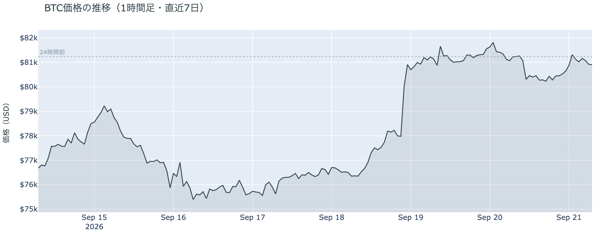
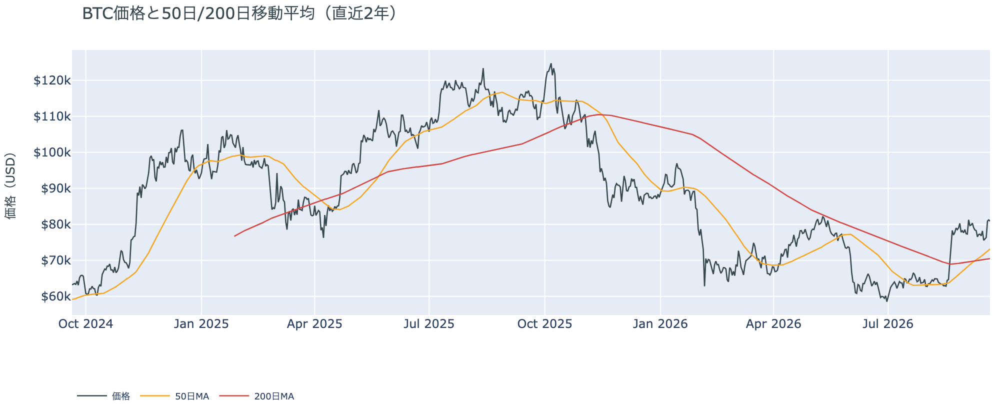
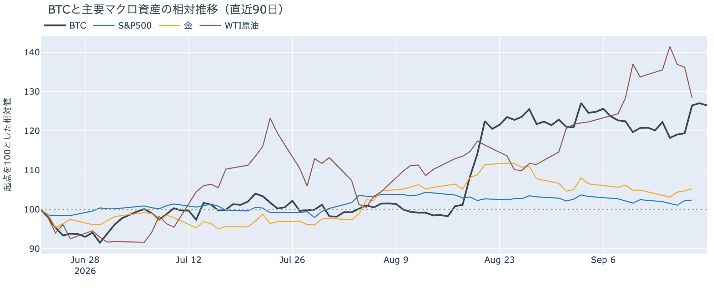
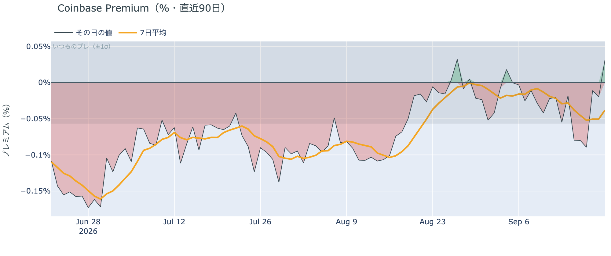
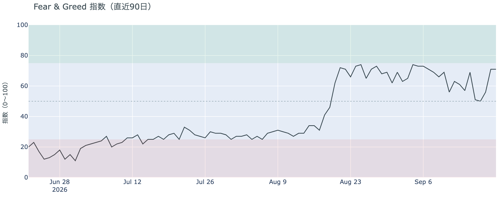
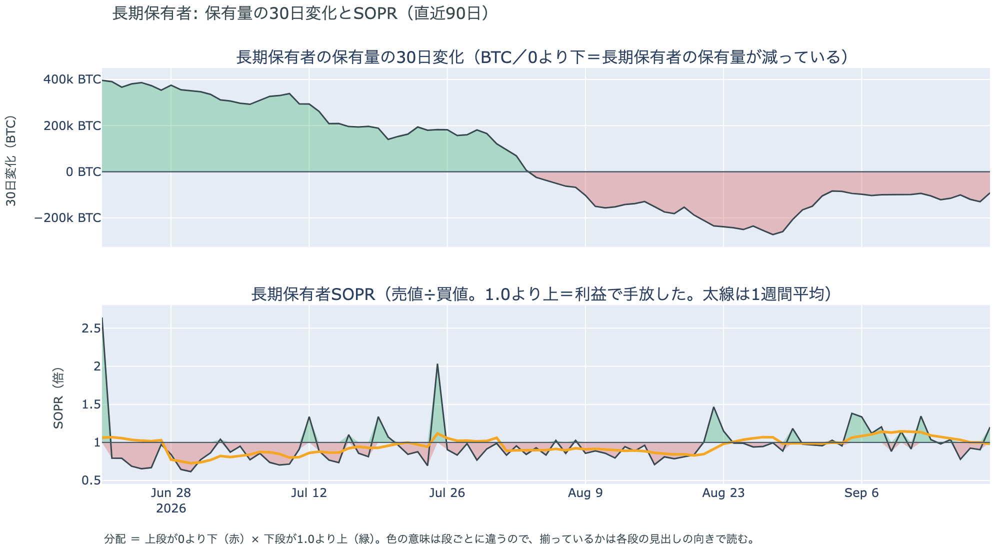
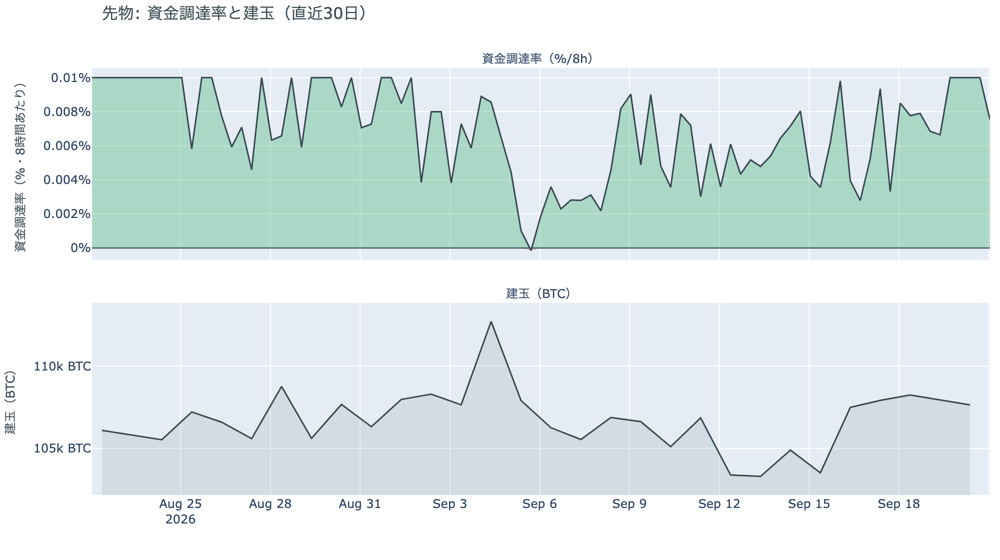
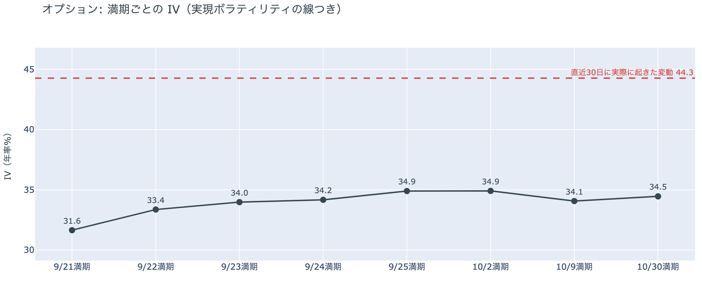
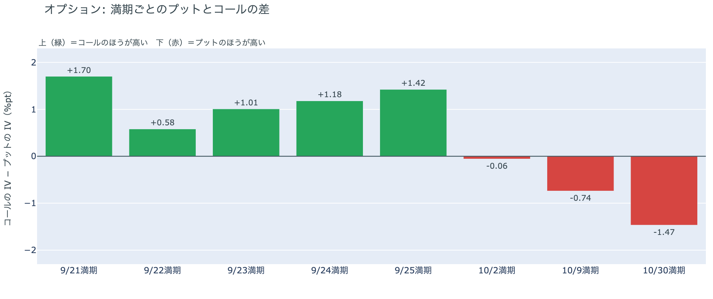
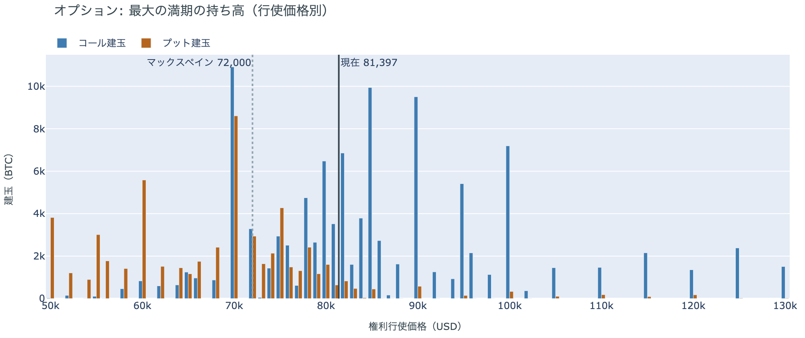

# $80,000を守った静かな日曜 ― ロングは短期金利に6ptの上乗せを払って残り、プットの備えは10月30日の満期だけから10月2日以降へ広がった

**2026年9月21日**

日曜日は、金曜の6%の上げを2日続けて保った日です。24時間の値幅は$80,085〜$81,472の1.7%で、日曜の昼前に$80,000近くまで下げた場面で買い持ち（ロング）の清算（＝証拠金不足で強制的に閉じられた取引）が出ましたが、そこから戻して朝は$80,900前後にあります。証券市場は週末で閉まっています。先物では建玉が動かないまま、ロングが払う資金調達率の短期金利に対する上乗せが1か月の平均の1.7倍まで広がりました。オプションでは、土曜まで10月30日の満期にだけ置かれていたプットの備えが、**10月2日以降のすべての満期へ広がりました**。

（数値は9月21日7時5分（日本時間）までのデータに基づきます。価格・先物・オプションはその時点の値、市場心理は9月20日の確定値、オンチェーン（＝ブロックチェーン上の記録）は9月19日時点、ETF資金フローは9月18日の金曜分までです。証券市場の終値は9月18日時点で、週末のため更新がありません。オンチェーンの長期保有者の数値には、ETFや取引所が預かっている分も含まれます。オプションはDeribit（BTCオプションの大半を占める取引所）の全銘柄です。）

## 1. 何が起きたか

**図1-1 価格の推移（1時間足・直近7日）**

*図の見方: 1時間ごとの価格（日本時間）。金曜夜のほぼ垂直な上げのあと、土曜から日曜は線がほぼ平らで、日曜の昼前に一度だけ$80,000近くまで沈んでいます。*

* 朝7時5分の時点で約$80,895。24時間で−0.4%、値幅は1.7%。土曜の1.4%と同じくらいの静かさ。
* 1週間前と比べると+5.3%、1か月前と比べると+3.3%。この1週間の最低は$74,888、最高は$81,925。
* Hyperliquid（＝オンチェーンの先物取引所）で見える清算は、この24時間で108件。6割弱がロングで、日曜11時台に半分以上が集中し、価格帯は80,000ドル台。102のアドレスに散らばり、最大の1件が全体の23%。

日曜日は、金曜の上げを崩さずに保った2日目です。昼前に$80,000近くまで下げた場面は清算を伴い、清算されたのは土曜のショートとは逆にロングで、大口が1つ飛んだのではなく多数が押し出された形です。ただし押しは1時間ほどで戻り、値幅は土曜と同じく1%台に収まりました。朝7時5分の価格は金曜の朝からほぼ変わらず、9月3日の急騰の日の終値$81,264のすぐ下にあります。

**図1-2 価格と50日・200日移動平均**

*図の見方: 2本の平均線の上下関係を見ます。50日線が200日線の上にあるのがゴールデンクロスです。*

* 50日線と200日線の差は約$2,697（3.8%）で、前日の$2,372からさらに開いた。
* 価格は50日線$73,201の約10.5%上。前日の11%からわずかに縮んだ。

ゴールデンクロス（＝50日線が200日線を上抜けること）の状態は13日目で、2本の線の差は毎日開き続けています。価格が横ばいだった週末も50日線のほうは上がり続けたので、価格と50日線の距離は2日続けて少し縮みました。

証券市場は週末で休みです。金曜9月18日の終値は、S&P500が+0.2%、金が+0.6%で$4,425、米10年債利回りは5.00%でした。原油は10月渡しの先物が−1.6%の$100.30でしたが、価格の基準にしている先物がこの日に11月渡しへ切り替わったため、下の表と図2-1では下げ幅が実際より大きく見えます。

## 2. なぜ動いたか：ビットコイン自身の需給か、外部環境か

**図2-1 ビットコインと株・金・原油の相対推移（起点＝100）**

*図の見方: 同じ起点から何%動いたかで重ねたもの。線が同じ向きなら「一緒に動いた」、ビットコインだけ別の向きなら「自身の理由で動いた」と読みます。*

| この5営業日の動き（ビットコインは7日間） | 変化 |
|---|---:|
| ビットコイン | +5.3% |
| 金 | +0.4% |
| 米国株（S&P500） | −0.1% |
| 原油 | −4.0% |

* 原油の−4.0%の大半は、先物の受け渡し月が10月から11月へ切り替わった分。10月渡しの金曜の終値は$100.30で、前日から−1.6%。
* 証券市場が閉まっている48時間で、ビットコインは土曜1.4%・日曜1.7%しか動かなかった。
* 建玉は107,461BTC。前日の107,502BTCと同じで、1週間では+4.2%。
* 資金調達率はプラスのまま。1日をならした年率は+10.05%で、短期金利（13週Tビル 3.98%）を引いた上乗せは+6.07pt。前日の+5.75ptからさらに広がり、直近1か月の平均+3.66ptの1.7倍。
* 直近30日の値動きの相関は、金が+0.70、S&P500が+0.29。

日曜日に価格が動かなかった理由は2つです。

1. 証券市場が閉まっていて、株・金・原油からの影響が止まっていた。この5営業日は金も株もほとんど動いておらず、ビットコインの+5.3%は金曜の1日で付いたものです。証券市場と同じ向きに動いた週ではなく、金曜の上げはビットコイン自身の需給で起きています。
2. 先物の持ち高が日曜に出入りしなかった。建玉（＝先物の未決済残高。証拠金で張っている人の量）は前日と同じで、資金調達率（＝ロングが払う金利。プラス＝ロングがショートより多い）はプラスのままです。ロングは前日より高い金利を払ってでも持ち高を残していますが、新しくロングを積む人も、まとめて手仕舞う人もいませんでした。

前日は「金曜の上げはショートの押し出しが主で、そこにETFの買いが同じ日に重なった」と説明しました。日曜はショートの清算が止まり、代わりに昼前の押しでロングが清算されましたが、建玉は減っていません。消えた分と同じだけしか新しい持ち高が入っておらず、金曜に残ったロングがそのまま据え置かれている形なので、前日の説明は今日の数値と合っています。

外部環境では、先週の金利の決定が出そろっています。FOMC（＝米国の金利を決める会合）は9月16日に0.25%の利上げを決めて政策金利を3.75〜4.00%とし、18人中16人が年内もう1回の利上げを見込みました。日銀も9月18日に0.25%の利上げで1.25%としました。原油は、サウジアラビアが9月11日の攻撃で止まった東西パイプラインを数日内に一部再開すると伝えられ、ホルムズ海峡を通らない経路での積み出しも増えているため、供給への不安が金曜にいったん和らぎました。一方でイランの革命防衛隊は、9月17日夜にホルムズ海峡でタンカーを攻撃したと18日に発表しており、海峡の通航は止まったままです。原油が$100前後にあることは変わらず、リスク資産全体の重しになりうる状況は続いています。

## 3. 市場参加者はいまどう見ているか

### ① アメリカの買い手はETFでは金曜に買い戻し、Coinbaseの価格ではまだ戻っておらず、市場心理は「強欲」を保った

**図①-1 Coinbase Premium（アメリカとそれ以外の価格差・直近90日）**

*図の見方: プラス＝アメリカで買いが強い。太線が1週間平均、細線がその日の値。薄い帯は「いつものブレの範囲」です。*

* 1週間平均は−0.038%。先週の−0.029%からマイナス幅がわずかに深い。8月中旬は−0.10%。
* その日の値は+0.031%で、いつものブレの半分。ゼロと変わらない。

Coinbase Premium（＝アメリカとそれ以外の価格差）は、1週間平均で見るとマイナスのままで、アメリカ側の価格がそれ以外より高い形はまだ出ていません。日曜の値はプラスでしたが、いつものブレの内側なので、それだけでアメリカの買いが戻ったとは読めません。金曜の上げにアメリカの買い手が乗ったかどうかは、Coinbaseの価格ではなくETFの数字（図①-2）に出ています。

**図①-2 ETFの日ごとの資金の出入り（直近90日）**

*図の見方: 入ったお金と出たお金の差。上に伸びれば入り超、下に伸びれば出超。*

| ETFの日ごとの出入り | 億ドル |
|---|---:|
| 9月15日 | −4.5 |
| 9月16日 | −3.0 |
| 9月17日 | +1.6 |
| 9月18日 | +4.3 |
| 直近7営業日の合計 | −2.9 |

* 数字は9月18日の金曜分までで、土曜の号から新しい日は加わっていない。
* 金曜分は、9月3日の+7.3億ドルに次ぐこの1か月で2番目の大きさ。火曜・水曜の出超7.5億ドルが残り、1週間の合計はまだ出超。

ETF経由のアメリカの買い手は、木曜・金曜と2日続けて買い戻し、金曜の6%の上げに乗っていました。ただし1週間の合計はまだ出超で、Coinbase Premium（図①-1）の1週間平均もマイナスのままなので、アメリカの買い手が「戻った」とまでは言えず、「手を止めていたのをやめた」というところです。

**図①-3 Fear & Greed（市場心理の指数・直近90日）**

*図の見方: 0〜100で、50より上が「強欲」、下が「恐怖」。*

* 前日と同じ71。1週間前の61から10pt上がり、1か月前の72とほぼ同じ。「極度の強欲」の境目75には届いていない。

市場心理は71の「強欲」で、金曜の上げで跳ねた水準を日曜も保っています。価格の上げを怖がっている人は少なく、1か月前の急騰の直後と同じくらいの強さです。

### ② 長期保有者は手放し続けているが、動いたコインは平均して買値をわずかに下回った

**図②-1 長期保有者の保有量の30日変化とSOPR（直近60日）**

*図の見方: 上段は、長期保有者の保有量が30日でどれだけ増減したか。マイナス＝手放している。下段は長期保有者SOPRで、1より上なら利益で手放した。どちらも太線の1週間平均で読みます。*

| 9月19日時点 | 1週間平均 | 前の週の平均 |
|---|---:|---:|
| 長期保有者SOPR（1より上＝利益で手放した） | 0.98 | 1.14 |
| 長期保有者の保有量の30日変化（万BTC） | −11.2 | −9.9 |

* 減り方は1か月前（−18.8万BTC）の6割、8月末（−27万BTC前後）の4割。6週間続けて−10万BTC前後の幅にある。
* 1年以上動いていないコインは全体の63.3%で、3か月で1.9pt増えた。売りに出てくるコインが少ない状態は続いている。

長期保有者（＝155日以上動かしていないコインの持ち主）は、コインを少しずつ手放し続けています。量は前の週より1割ほど増えましたが、8月末の半分以下で、6週間続いた幅の中に収まっています。長期保有者SOPR（＝長期保有者が動かしたコインの売値÷買値）は1週間平均で1をわずかに下回り、動いたコインは平均して買値より2%安く手放されました。前の週までの2桁の利益は消え、いまは損益ゼロをはさんで上下しています。量の減少と利益での放出がそろっていないので、長期保有者がまとまって利益を確定しに来ている形ではありません。**ビットコイン自身の需給の土台は、前日と変わっていません。** ETFや取引所が預かっている分を差し引いても、この規模と向きは変わりません。

今日は、コインが最後に動いた価格の分布に大きな変化がなく、長く眠っていたコインが動いた記録もありません。マイナーの収入は平年をわずかに下回り（Puell Multiple（＝マイナー収入の平年比）が1週間平均で0.98）、売りを急ぐ状況ではありません。

### ③ 先物：持ち高は動かず、ロングは短期金利に1か月の平均の1.7倍の上乗せを払って残っている

**図③-1 資金調達率と建玉（直近30日）**

*図の見方: 上段は資金調達率（8時間ごと・日本時間）。プラスが続く＝ロングがショートより多い。下段は建玉。*

* 資金調達率はプラスが46回連続（約15日）。ロングがショートより多い状態が続いている。
* 短期金利に対する上乗せは、直近1か月の最大+7.25ptに近づいたが届いていない。上限にはほど遠い。
* 建玉は107,461BTC。金曜の6%の上げの前（9月17日の108,257BTC）より少し少ない水準で、土曜から動いていない。

日曜は先物の持ち高が出入りせず、ロングは残ったまま、資金調達率の短期金利に対する上乗せは金曜から広がり続けています。ロングが金利を払ってでも持つ側への傾きは、この1か月で最も強い部類に入ります。それでも上限には遠く、過熱ではありません。昼前の押しで清算されたロングの分は、同じだけの新しい持ち高で埋まり、持ち高の形は前日と同じロング寄りのままです。

### ④ オプション：持ち高は変わらず、プットの備えは10月30日の満期だけから10月2日以降のすべての満期へ広がった

オプションには2種類あります。コール（＝決めた価格で買う権利）とプット（＝決めた価格で売る権利）で、価格が上がればコールの価値が上がり、価格が下がればプットの価値が上がります。プットは「価格が下がったときの保険」として買われます。オプションを買う人は、その権利と引き換えに権利料（＝オプションを買う人が払う金額）を払います。

**図④-1 満期ごとのIV（年率%）**

*図の見方: IVを満期ごとに並べたもの。点線は実現ボラティリティ。IVが点線より下なら、市場はこの先の値動きを過去の値動きより小さいと見ています。*

* IVは全体で36.3。前日の35.5から少し上がったが、過去1年の下から6%の位置。実現ボラティリティは44.3。
* 満期ごとに見ると、手前が低く先が高い平常の形で、突出した満期は無い。

IV（＝オプション価格から逆算した、この先の値動きの幅の予想）は実現ボラティリティ（＝実際に起きた値動きの幅）より8pt低く、市場はこの先の値動きを、過去の値動きより小さいと見ています。守りを固めている状態ではなく、怖がってもいません。特定の満期のオプションの権利料に、ほかの満期に対する上乗せは乗っておらず、今朝の時点で大きく動くと見られている日はありません。

**図④-2 満期ごとのプットとコールの差**

*図の見方: 満期ごとに、プットとコールのどちらが高く売れているか。ゼロより上ならコールのほうが高く、下ならプットのほうが高い。*

| 満期 | どちらが高いか |
|---|---|
| 9月21日 | コールがはっきり高い |
| 9月22日 | コールがわずかに高い |
| 9月23日 | コールが高い |
| 9月24日 | コールが高い |
| 9月25日 | コールがはっきり高い |
| 10月2日 | ほぼ差なし（土曜はコールが高かった） |
| 10月9日 | プットが高い（土曜はコールがわずかに高かった） |
| 10月30日 | プットがはっきり高い |

* 土曜まではプットのほうが高いのは10月30日の満期だけだった。日曜に10月9日が入れ替わり、10月2日は差が消えた。

参加者は、9月25日の大きな満期までは「価格が上がる」側のコールの権利料をプットより高く払い、備えを10月2日以降の満期に置き直しました。土曜までは備えが10月30日の満期にだけあり、10月27日〜28日のFOMCの直後に当たると説明しましたが、日曜には10月9日の満期でもプットのほうが高くなり、10月2日はコールとプットの差が消えました。10月2日は米国の雇用統計の日です。持ち高（図④-3）は動いていないので、これは新しくプットを大量に買った動きではなく、10月の満期の権利料の付け方を日曜に変えたものです。

**図④-3 9月25日満期の持ち高（権利の価格ごと）**

*図の見方: 青＝コール、橙＝プット。現値より上にコールが、下にプットが積まれるのが普通です。*

| 9月25日満期のオプション（価格は約$81,400） | 量（万BTC） | 意味 |
|---|---:|---|
| いまより高い価格のコール（決めた価格で買う権利） | 約7.6 | 「価格が上がる」に賭けた分 |
| いまより安い価格のプット（決めた価格で売る権利） | 約6.3 | 「価格が下がる」への保険 |
| うち、いまより15%以上高い価格のコール | 約3.9 | 大きな上げへの賭け |
| うち、いまより15%以上安い価格のプット | 約3.5 | 大きな下げへの保険 |

* 9月25日満期の持ち高は全部で188,892BTCと、全満期の44%。前日の189,442BTCとほぼ同じで、コールがプットの1.8倍。
* 持ち高が集まっている価格は、多い順に$80,000、$82,000、$85,000、$78,000。前日と同じ帯。

「価格が上がる」に賭けた人たちは降りておらず、持ち高は週末を通してほとんど動いていません。いまの価格は持ち高が集まる$78,000〜$85,000の帯の真ん中にあり、$80,000のコールは報われた側にいます。この上に厚く積まれた$85,000と$90,000のコールが報われるには、9月25日までの4日間に$85,000を超える必要があります。

## 4. 価格に影響しうる直近のイベント

予測ではなく、「次に市場が反応しうる材料」の案内です。オプション市場が備えを置いているのは10月2日以降の満期で、10月2日は米国の雇用統計、10月30日は10月27日〜28日のFOMCの直後に当たります。9月25日の大きな満期まではコールがプットより高い形です。FOMCは年内もう1回の利上げを見込み、米10年債利回りは5%にあるので、来週の物価統計と雇用統計は金利の材料になります。

| 日付 | イベント | 何に効くか |
|---|---|---|
| 9/24（木）〜 | 中国の習近平国家主席がワシントンを公式訪問。米中首脳が関税の一部引き下げなどを協議 | 通商。株 |
| 9/25（金）17:00 | オプションの大きな満期（約18.9万BTC、全満期の44%） | 「価格が上がる」に賭けた人たちの期限。この満期まではコールが高い |
| 9/30（水）21:30 日本時間 | 米PCE物価（8月分。FRBが重視する物価統計）と4〜6月期GDPの確定値 | 金利。10月のFOMCでもう1回利上げするかの材料 |
| 10/2（金）21:30 日本時間 | 米9月の雇用統計 | 金利。10月2日の満期でコールとプットの差が消えたのはこの日 |
| 10/27（火）〜28（水） | FOMC。9月16日のFOMCで示された見通しでは、18人中16人が年内もう1回の利上げを見込む | 金利。10月30日の満期でプットが高いのはこの直後 |
| 日程未定 | サウジアラビアの東西パイプラインの一部再開（数日内と報道）と、ホルムズ海峡の航行をめぐるイランと湾岸諸国の外相会合（延期のまま） | 原油 |
| 日程未定 | CFTCの暗号資産規則案。ホワイトハウスの審査のあとCFTCで採決し、公表と意見募集へ | 規制 |
| 日程未定 | 米下院本会議で、ビットコインの戦略準備を法律にする法案の採決（委員会は9月16日に可決） | 規制 |

## まとめ：日曜日の動きは何だったか

日曜日は、金曜の6%の上げを2日続けて保った日でした。証券市場は閉まり、ビットコインの値幅は1.7%。昼前に$80,000近くまで押した場面でロングが清算されましたが、建玉は動かず、ロングは短期金利に対して1か月の平均の1.7倍の上乗せを払って残っています。ETF経由のアメリカの買い手は金曜に買い戻していましたが、1週間ではまだ出超で、Coinbaseの価格でもアメリカ側が高い形は出ていません。長期保有者は9月19日時点で手放す量をほぼ変えず、動いたコインの損益はゼロ前後です。ビットコイン自身の需給の土台が変わった日ではありません。変わったのは一つ、オプションで**プットの備えが10月30日の満期だけから10月2日以降のすべての満期へ広がった**ことで、持ち高は動いていないので、10月の満期の権利料の付け方を変えたものです。市場心理は71の「強欲」を保っています。

---

*本稿は情報提供を目的としたものであり、投資助言ではありません。将来の価格動向を保証・示唆するものではなく、投資判断は各自の責任において行ってください。*
