# 原油安と株高の夜に+7%で1月以来の$86,000台、清算されたのはショート ― 建玉は増え、ロングの上乗せは日曜の半分に縮み、9月25日の満期はプットが高い側へ入れ替わった

**2026年9月22日**

月曜日は、週末に保っていた$81,000から一気に$87,000台まで上げた日です。24時間の値幅は$80,837〜$87,397の8.1%で、朝7時5分の価格は約$86,677。証券市場でも株が上げ、原油が4日続けて下げ、金利が下がった夜で、ビットコインはその同じ向きに、株の4倍の幅で動きました。上げの途中で清算（＝証拠金不足で強制的に閉じられた取引）されたのは全部売り持ち（ショート）で、建玉は減らずに増え、買い持ち（ロング）が払う上乗せは日曜の半分に縮みました。オプションでは、9月25日の大きな満期で、**コールが高かった値付けがプットが高い側へ入れ替わりました**。

（数値は9月22日7時5分（日本時間）までのデータに基づきます。価格・先物・オプションはその時点の値、市場心理は9月21日の確定値、オンチェーン（＝ブロックチェーン上の記録）は9月20日時点、ETF資金フローは9月18日の金曜分までで、月曜分はまだ加わっていません。証券市場の終値は9月21日時点です。オンチェーンの長期保有者の数値には、ETFや取引所が預かっている分も含まれます。オプションはDeribit（BTCオプションの大半を占める取引所）の全銘柄です。）

## 1. 何が起きたか

**図1-1 価格の推移（1時間足・直近7日）**

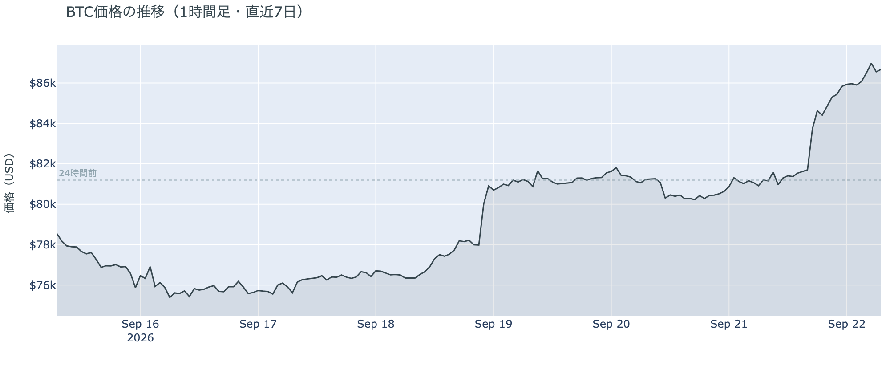

*図の見方: 1時間ごとの価格（日本時間）。金曜夜の垂直な上げのあと平らだった線が、月曜の夜から火曜の朝にかけてもう一段、階段のように上がっています。*

* 24時間で+6.7%。この1週間の最低$74,888から最高$87,397まで、7日で+10.9%。1か月前と比べると+12.5%。
* 直近の確定した日足終値は9月20日の$81,160。
* Hyperliquid（＝オンチェーンの先物取引所）で見える清算は、この24時間で1,059件。全部ショートで、82,000ドル台・83,000ドル台・86,000ドル台・87,000ドル台と、上げの段ごとに出ている。火曜5時台に4割が集中し、880のアドレスに散らばって、最大の1件が全体の9%。

月曜日は、金曜の6%の上げにもう一段、7%の上げを重ねた日です。上げは月曜の夜に始まり、証券市場が閉まる火曜の5時台に最も大きな清算を伴いました。清算されたのは金曜と同じくショートで、大口が1つ飛んだのではなく、多数のショートが段ごとに押し出された形です。朝7時5分の価格は、1月以来の高さにあります。

**図1-2 価格と50日・200日移動平均**

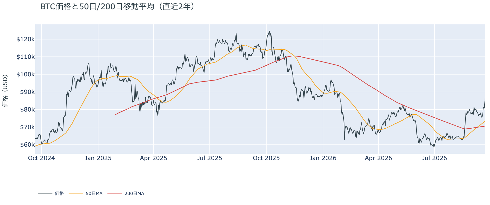

*図の見方: 2本の平均線の上下関係を見ます。50日線が200日線の上にあるのがゴールデンクロスです。*

* 50日線と200日線の差は約$3,086（4.4%）で、前日の$2,697からさらに開いた。
* 価格は50日線$73,670の約17.7%上。前日の10.5%から一気に広がった。

ゴールデンクロス（＝50日線が200日線を上抜けること）の状態は14日目で、2本の線の差は毎日開き続けています。月曜の上げで、価格と50日線の距離はこの2週間で最も広くなりました。

証券市場は月曜9月21日、S&P500が+1.5%の7,764.70で先月の最高値の0.4%手前まで戻し、米10年債利回りは4.96%へ下がり、金は−1.0%の$4,381でした。原油は4日続けて下げ、報道ではWTIが約2%安の$98台、ブレントが3.4%安の$100.34です。下の表と図2-1の原油の−9.3%には、先物の受け渡し月の切り替えが混じっています。

## 2. なぜ動いたか：ビットコイン自身の需給か、外部環境か

**図2-1 ビットコインと株・金・原油の相対推移（起点＝100）**

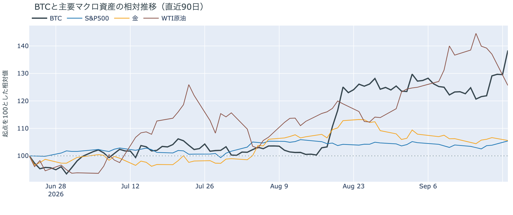

*図の見方: 同じ起点から何%動いたかで重ねたもの。線が同じ向きなら「一緒に動いた」、ビットコインだけ別の向きなら「自身の理由で動いた」と読みます。*

| この5営業日の動き（ビットコインは7日間） | 変化 |
|---|---:|
| ビットコイン | +10.9% |
| 金 | +0.7% |
| 米国株（S&P500） | +1.9% |
| 原油 | −9.3% |

* 月曜1日では、株が+1.5%、原油が報道で2〜3%安、米10年債利回りが4.96%へ低下。ビットコインは+6.7%で、株と同じ向きに、その4倍の幅。
* 建玉は108,825BTC。前日の107,461BTCから+1.3%で、金曜の上げの前（9月17日の108,257BTC）を上回った。
* 資金調達率はプラスのまま。1日をならした年率は+7.19%で、短期金利（13週Tビル 3.98%）を引いた上乗せは+3.20pt。日曜の+6.07ptの半分に縮み、直近1か月の平均+3.90ptも下回った。
* 直近30日の値動きの相関は、金が+0.61、S&P500が+0.42。
* 9月20日時点のコインが最後に動いた価格の分布にいまの価格を重ねると、$80,000〜$90,000の帯の上から3分の1にあり、価格より上の帯にある供給は全体の19%。

月曜日に7%上げた理由は2つです。

1. 証券市場と同じ向きに動いた夜だった。原油はホルムズ海峡を通る船が増え、サウジアラビアのパイプラインの復旧も伝えられて4日続けて下げ、株は最高値の手前まで戻し、金利は下がりました。ビットコインは株と同じ向きに動いていて、自身の理由だけで動いた日ではありません。
2. 動きの幅を4倍にしたのはビットコイン自身の需給で、上げの段ごとにショートが押し出されました。建玉（＝先物の未決済残高。証拠金で張っている人の量）は清算で消えた分を上回って増え、資金調達率（＝ロングが払う金利。プラス＝ロングがショートより多い）の短期金利に対する上乗せは日曜の半分に縮んでいます。ロングが金利を払ってでも追いかけた上げではなく、ショートが押し出された跡に新しい持ち高が入った上げです。

この説明が違うなら、つまりショートの押し出しではなく現物の新しい買いが主だったのなら、月曜分のETFがまとまった入り超になり、Coinbase Premiumの1週間平均がプラスへ向かいます。今朝の時点では、どちらもまだそうなっていません（図①-1・図①-2）。

外部環境では、原油の下げと同じ日に、トランプ大統領が今週の国連総会でイランのペゼシュキアン大統領と会うことに「おそらく前向き」と発言し、財務長官は習近平国家主席の訪米を前にした中国側との協議を「成功した」と述べています。月曜には、ビットコインを大量に保有するStrategy社が3週間ぶりに950BTCを買ったとも公表されました。原油はまだ$100前後で、供給への不安が消えたわけではありません。

## 3. 市場参加者はいまどう見ているか

### ① アメリカの買い手は月曜の上げを主導しておらず、ETFは金曜分までしか分からず、市場心理は「強欲」のまま

**図①-1 Coinbase Premium（アメリカとそれ以外の価格差・直近90日）**

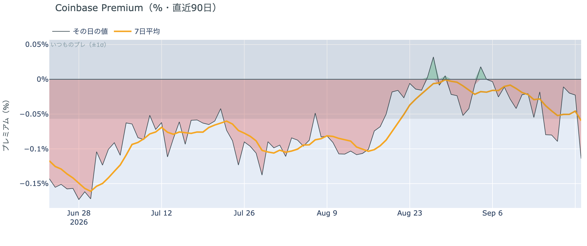

*図の見方: プラス＝アメリカで買いが強い。太線が1週間平均、細線がその日の値。薄い帯は「いつものブレの範囲」です。*

* 1週間平均は−0.059%。先週の−0.028%からマイナス幅が2倍に深まった。8月中旬は−0.10%。
* その日の値は−0.114%で、いつものブレの2倍。マイナス圏は17日続いている。

Coinbase Premium（＝アメリカとそれ以外の価格差）は、7%上げた月曜にいつものブレを超えてマイナスに沈みました。アメリカの取引所の価格がそれ以外より目立って安かったということで、月曜の上げを主導したのはアメリカの現物の買い手ではありません。1週間平均もマイナス幅を深めていて、アメリカ側の価格がそれ以外より高い形は出ていません。

**図①-2 ETFの日ごとの資金の出入り（直近90日）**

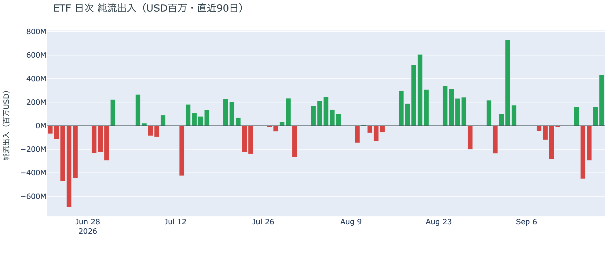

*図の見方: 入ったお金と出たお金の差。上に伸びれば入り超、下に伸びれば出超。*

| ETFの日ごとの出入り | 億ドル |
|---|---:|
| 9月15日 | −4.5 |
| 9月16日 | −3.0 |
| 9月17日 | +1.6 |
| 9月18日 | +4.3 |
| 直近7営業日の合計 | −2.9 |

* 数字は9月18日の金曜分までで、月曜分はまだ加わっていない。
* 木曜・金曜の入り超は2日続いたが、火曜・水曜の出超7.5億ドルを埋め切れず、1週間の合計はまだ出超。

ETF経由のアメリカの買い手は、金曜の上げには乗っていましたが、月曜の上げに乗ったかどうかはまだ分かりません。分かっている範囲では1週間の合計が出超で、Coinbase Premium（図①-1）もマイナスなので、アメリカの買い手が戻ったとは言えない状態のまま、価格だけが1月以来の高さに来ています。

**図①-3 Fear & Greed（市場心理の指数・直近90日）**

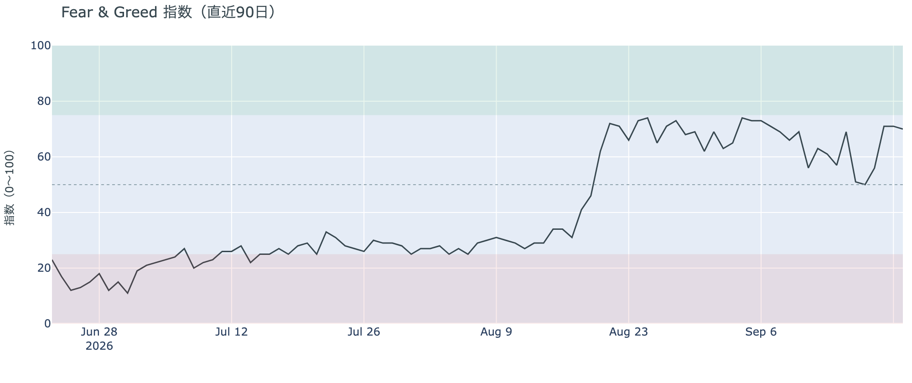

*図の見方: 0〜100で、50より上が「強欲」、下が「恐怖」。*

* 70の「強欲」。前日の71から1pt下がった。1週間前は57、1か月前は71。「極度の強欲」の境目75には届いていない。

市場心理は「強欲」の側にあり、月曜の上げの前から変わっていません。7%上げても「極度の強欲」には入らず、価格の上げを怖がる人も、浮かれる人も増えていない状態です。

### ② 長期保有者は手放す量を変えず、動いたコインは平均して買値をわずかに下回った

**図②-1 長期保有者の保有量の30日変化とSOPR（直近60日）**

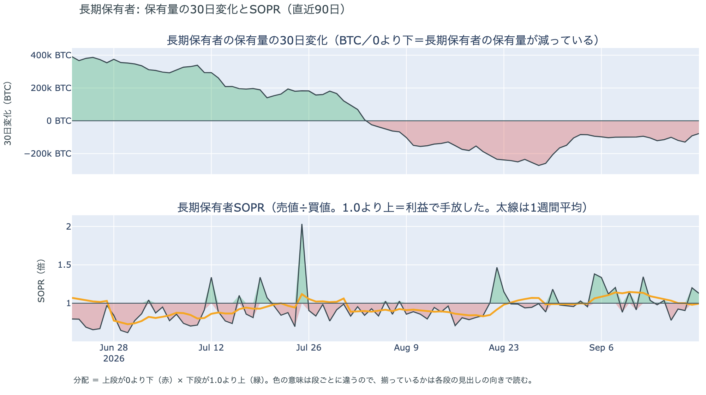

*図の見方: 上段は、長期保有者の保有量が30日でどれだけ増減したか。マイナス＝手放している。下段は長期保有者SOPRで、1より上なら利益で手放した。どちらも太線の1週間平均で読みます。*

| 9月20日時点 | 1週間平均 | 前の週の平均 |
|---|---:|---:|
| 長期保有者SOPR（1より上＝利益で手放した） | 0.99 | 1.09 |
| 長期保有者の保有量の30日変化（万BTC） | −10.8 | −10.0 |

* 減り方は1か月前（−21.2万BTC）の半分で、7週間続けて−10万BTC前後の幅にある。
* 1年以上動いていないコインは全体の63.4%で、3か月で1.9pt増えた。売りに出てくるコインが少ない状態は続いている。

長期保有者（＝155日以上動かしていないコインの持ち主）は、月曜の上げの前の時点で、コインを少しずつ手放し続けていました。量は7週間同じ幅の中にあり、長期保有者SOPR（＝長期保有者が動かしたコインの売値÷買値）は1週間平均で1をわずかに下回って、動いたコインは平均して買値より1%安く手放されました。量の減少と利益での放出がそろっていないので、長期保有者がまとまって利益を確定しに来ている形ではありません。**ビットコイン自身の需給の土台は、9月20日時点では前日と変わっていません。** 月曜の上げに長期保有者がどう応じたかは、この数値にはまだ出ていません。ETFや取引所が預かっている分を差し引いても、この規模と向きは変わりません。

今日は、コインが最後に動いた価格の分布に大きな変化がなく、長く眠っていたコインが動いた記録もありません。マイナーの収入は平年並み（Puell Multiple（＝マイナー収入の平年比）が1週間平均で0.99）で、売りを急ぐ状況ではありません。

### ③ 先物：ショートが押し出され、建玉はそれ以上に増え、ロングが払う上乗せは日曜の半分に縮んだ

**図③-1 資金調達率と建玉（直近30日）**

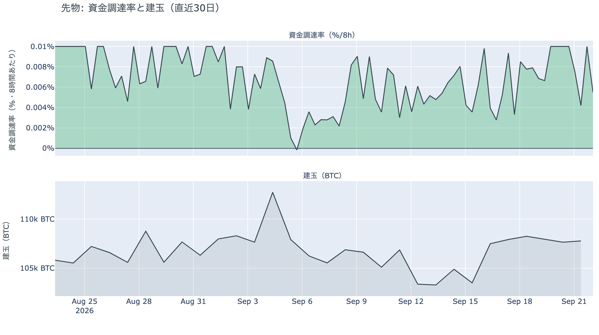

*図の見方: 上段は資金調達率（8時間ごと・日本時間）。プラスが続く＝ロングがショートより多い。下段は建玉。*

* 資金調達率はプラスが49回連続（約16日）。ロングがショートより多い状態が続いている。
* 短期金利に対する上乗せは、日曜に直近1か月の最大に迫っていたが、月曜に1か月の平均を下回るところまで縮んだ。上限にはほど遠い。
* 建玉は1日で+1.3%、1週間で+2.7%。金曜の6%の上げでは増えなかった建玉が、月曜の上げでは増えた。

月曜の上げで消えたのはショートだけで、その跡に、消えた分を上回る新しい持ち高が入りました。前日は「ロングは高い金利を払ってでも持ち高を残している」と説明しました。月曜はそのロングが上げに乗り、清算はショートにだけ出たので、前日の説明は今日の数値と合っています。ただし、ロングが払う上乗せは日曜の半分に縮んでいます。上げを見てロングが金利を払ってでも追いかけている形ではなく、ショートが押し出された跡に、持ち高が静かに入れ替わった形です。ロングに傾いてはいますが、過熱ではありません。

### ④ オプション：IVは7%上げた翌朝も下がり、9月25日の満期はコールが高い側からプットが高い側へ入れ替わった

オプションには2種類あります。コール（＝決めた価格で買う権利）とプット（＝決めた価格で売る権利）で、価格が上がればコールの価値が上がり、価格が下がればプットの価値が上がります。プットは「価格が下がったときの保険」として買われます。オプションを買う人は、その権利と引き換えに権利料（＝オプションを買う人が払う金額）を払います。

**図④-1 満期ごとのIV（年率%）**

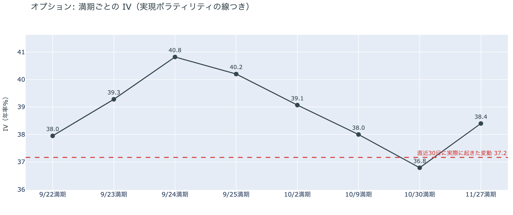

*図の見方: IVを満期ごとに並べたもの。点線は実現ボラティリティ。IVが点線より下なら、市場はこの先の値動きを過去の値動きより小さいと見ています。*

* IVは全体で35.6。前日の36.3から下がり、過去1年の下から28%の位置。実現ボラティリティは37.2で、前日の44.3から下がった。
* 満期ごとに見ると、9月24日・25日の満期が40〜41で最も高く、10月の満期は37〜39。1日だけ突出した満期は無い。

IV（＝オプション価格から逆算した、この先の値動きの幅の予想）は、7%上げた翌朝も上がらず、実現ボラティリティ（＝実際に起きた値動きの幅）を1.5pt下回っています。市場は月曜の上げを荒れの始まりとは見ておらず、この先の値動きを過去の値動きより小さいと見ています。守りを固めている状態ではなく、怖がってもいません。今週の満期のIVが10月の満期より3〜4pt高いのは、この数日の値動きを10月より広く見ているということで、特定の日のオプションの権利料にほかの満期に対する上乗せが乗っている形ではありません。

**図④-2 満期ごとのプットとコールの差**

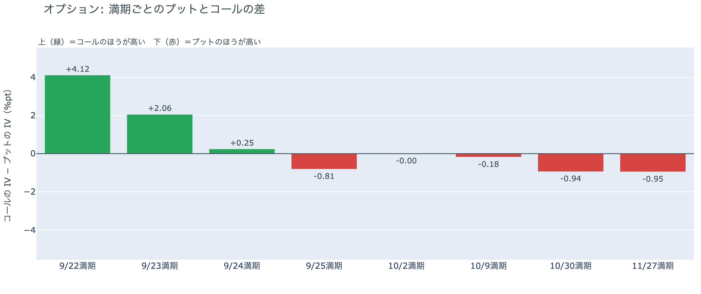

*図の見方: 満期ごとに、プットとコールのどちらが高く売れているか。ゼロより上ならコールのほうが高く、下ならプットのほうが高い。*

| 満期 | どちらが高いか |
|---|---|
| 9月22日 | コールがはっきり高い |
| 9月23日 | コールが高い |
| 9月24日 | コールがわずかに高い |
| 9月25日 | プットが高い（日曜はコールがはっきり高かった） |
| 10月2日 | ほぼ差なし |
| 10月9日 | プットがわずかに高い |
| 10月30日 | プットが高い |
| 11月27日 | プットが高い |

* プットのほうが高くなる最初の満期が、日曜の10月9日から9月25日へ手前に移った。
* 9月25日満期の持ち高は、コールがプットの1.5倍。日曜の1.8倍から、コールが減りプットが増えた。

参加者は、7%上げた翌朝に、金曜の大きな満期までを「荒れない」側から「備える」側へ置き直しました。日曜までは9月25日の満期でコールがはっきり高く、備えは10月2日以降の満期にだけありましたが、月曜の上げのあとで9月25日の満期はプットのほうが高くなっています。日曜の入れ替わりと違って、今回は持ち高も動いています。9月25日満期の持ち高の中でコールが減りプットが増えたので、価格が上がって利益の出たコールを一部閉じ、プットを買い足した動きです。金曜の満期に向けて、上げた分を守る側に回った参加者がいます。

**図④-3 9月25日満期の持ち高（権利の価格ごと）**

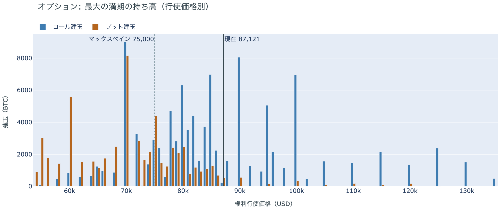

*図の見方: 青＝コール、橙＝プット。現値より上にコールが、下にプットが積まれるのが普通です。*

| 9月25日満期のオプション（価格は約$87,100） | 量（万BTC） | 意味 |
|---|---:|---|
| いまより高い価格のコール（決めた価格で買う権利） | 約4.9 | 「価格が上がる」に賭けた分 |
| いまより安い価格のプット（決めた価格で売る権利） | 約7.1 | 「価格が下がる」への保険 |
| うち、いまより15%以上高い価格のコール | 約2.2 | 大きな上げへの賭け |
| うち、いまより15%以上安い価格のプット | 約5.0 | 大きな下げへの保険 |

* 9月25日満期の持ち高は全部で184,392BTC。全満期に占める割合は日曜の44%から38%へ下がり、ほかの満期の持ち高が増えた。
* 持ち高が集まっている価格は、多い順に$90,000、$85,000、$95,000、$86,000。日曜の$78,000〜$85,000の帯から上へ動いた。

「価格が上がる」に賭けた人たちの多くは、月曜の上げで報われた側に入りました。日曜にいまより上にあった$82,000と$85,000のコールは価格の下に入り、いまより高い価格に残るコールは日曜の約7.6万BTCから約4.9万BTCへ減っています。残っているうち最も厚い$90,000のコールが報われるには、9月25日までの3日間に$90,000を超える必要があります。いまの価格は、持ち高が集まる$85,000〜$95,000の帯の中にあります。

## 4. 価格に影響しうる直近のイベント

予測ではなく、「次に市場が反応しうる材料」の案内です。オプション市場が備えを置いているのは9月25日の満期と10月9日以降の満期で、9月25日は大きな満期の日、10月30日は10月27日〜28日のFOMC（＝米国の金利を決める会合）の直後に当たります。今週の満期のIVが10月より高い9月24日・25日は、米中首脳会談と大きな満期の日でもあります。米10年債利回りは5%の手前にあり、来週の物価統計と雇用統計は金利の材料になります。

| 日付 | イベント | 何に効くか |
|---|---|---|
| 9/22（火）〜 | 国連総会（ニューヨーク）。トランプ大統領がイランのペゼシュキアン大統領との会談に「おそらく前向き」と発言 | 原油 |
| 9/23（水）〜25（金） | 習近平国家主席の米国公式訪問。首脳会談は9/24（木）にホワイトハウスで、関税の一時停止の期限・レアアース・AIを協議 | 通商。株 |
| 9/25（金）17:00 | オプションの大きな満期（約18.4万BTC、全満期の38%） | 「価格が上がる」に賭けた人たちの期限。この満期でプットが高くなった |
| 9/30（水）21:30 日本時間 | 米PCE物価（8月分。FRBが重視する物価統計）と4〜6月期GDPの確定値 | 金利。10月のFOMCでもう1回利上げするかの材料 |
| 10/2（金）21:30 日本時間 | 米9月の雇用統計 | 金利 |
| 10/5（月）まで | 米議会の休会前。上院で9月15日に否決されたCLARITY法案（＝暗号資産の市場構造法案）の再採決があるかどうか | 規制 |
| 10/27（火）〜28（水） | FOMC。9月16日のFOMCで示された見通しでは、18人中16人が年内もう1回の利上げを見込む | 金利。10月30日の満期でプットが高いのはこの直後 |
| 日程未定 | サウジアラビアの東西パイプラインの復旧と、ホルムズ海峡の航行をめぐるイランと湾岸諸国の外相会合（延期のまま） | 原油 |
| 日程未定 | 米下院本会議で、ビットコインの戦略準備を法律にする法案の採決（委員会は9月16日に可決） | 規制 |

## まとめ：月曜日の動きは何だったか

月曜日は、原油安・株高・金利低下と同じ向きの夜に、ビットコインがショートを押し出しながら株の4倍の幅で上げた日でした。清算されたのは全部ショートで、建玉は消えた分を上回って増え、ロングが払う上乗せは日曜の半分に縮んでいます。ロングが追いかけた上げではなく、ショートが押し出された跡に持ち高が入れ替わった上げです。アメリカの買い手はこの上げを主導しておらず、Coinbaseの価格はいつものブレを超えてアメリカ側が安く、ETFは金曜分までしか分かりません。長期保有者は9月20日時点で手放す量を変えず、動いたコインの損益はゼロ前後です。変わったのは一つ、オプションで**9月25日の満期がコールが高い側からプットが高い側へ入れ替わり、利益の出たコールの一部が閉じられてプットが足された**ことで、上げた分を金曜の満期まで守る側に回った参加者がいます。市場心理は70の「強欲」を保っています。

---

*本稿は情報提供を目的としたものであり、投資助言ではありません。将来の価格動向を保証・示唆するものではなく、投資判断は各自の責任において行ってください。*
