# アメリカの買い手が戻った日、$86,000台を値幅2%で保った ― 月曜分のETFは90日で最大の入り超、清算されたのは火曜午前のロング、市場心理は「極度の強欲」に入った

**2026年9月23日**

火曜日は、7%上げた翌日に、ほとんど動かなかった日です。24時間の値幅は$85,059〜$86,734の2.0%で、朝7時5分の価格は約$86,109。証券市場でも株は横ばい、金利はほぼ変わらず、原油だけが下げた夜で、ビットコインも止まりました。火曜の午前に85,000ドル台で買い持ち（ロング）の一部が清算（＝証拠金不足で強制的に閉じられた取引）されましたが、価格は$85,000を割っていません。今朝いちばんの変化はアメリカの買い手で、**月曜分のETFはこの90日で最大の入り超、火曜のCoinbaseの価格はいつものブレを超えてアメリカ側が高く**、市場心理は「極度の強欲」に入りました。オプションでは、今週の満期の権利料に乗っていた10月の満期に対する上乗せが剥がれ、備えが残るのは10月30日以降の満期だけです。

（数値は9月23日7時5分（日本時間）までのデータに基づきます。価格・先物・オプションはその時点の値、市場心理は9月22日の確定値、オンチェーン（＝ブロックチェーン上の記録）は9月21日時点、ETF資金フローは9月21日の月曜分までで、火曜分はまだ加わっていません。証券市場の終値は9月22日時点です。オンチェーンの長期保有者の数値には、ETFや取引所が預かっている分も含まれます。オプションはDeribit（BTCオプションの大半を占める取引所）の全銘柄です。）

## 1. 何が起きたか

**図1-1 価格の推移（1時間足・直近7日）**

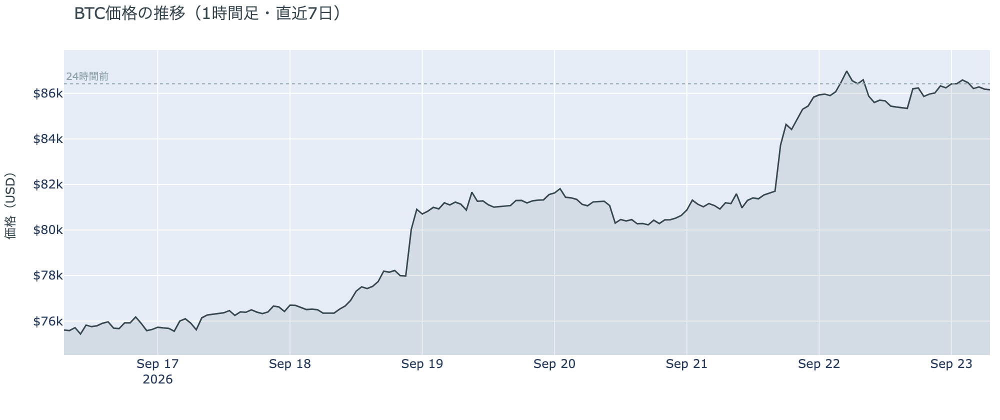

*図の見方: 1時間ごとの価格（日本時間）。金曜と月曜の夜に2段の階段のように上がった線が、火曜は上の段でほぼ平らです。*

* 24時間で−0.3%。1週間前と比べると+13.9%、1か月前と比べると+10.8%。
* 直近の確定した日足終値は9月21日の$86,595。
* Hyperliquid（＝オンチェーンの先物取引所）で見える清算は、この24時間で88件。ほぼ全部ロングで、98%が85,000ドル台に集中し、火曜10時台に半分が出た。86のアドレスに散らばり、最大の1件が全体の31%。

火曜日は、金曜と月曜の2段の上げのあと、上の段にとどまった日です。動いたのは火曜の午前だけで、価格が$85,000台前半へ下げた時間に多数のロングが清算されました。大口が1つ飛んだのではありません。金曜と月曜に清算されたのはショートで、火曜にはじめてロング側が押し出されましたが、価格はその後$86,000台へ戻りました。

**図1-2 価格と50日・200日移動平均**

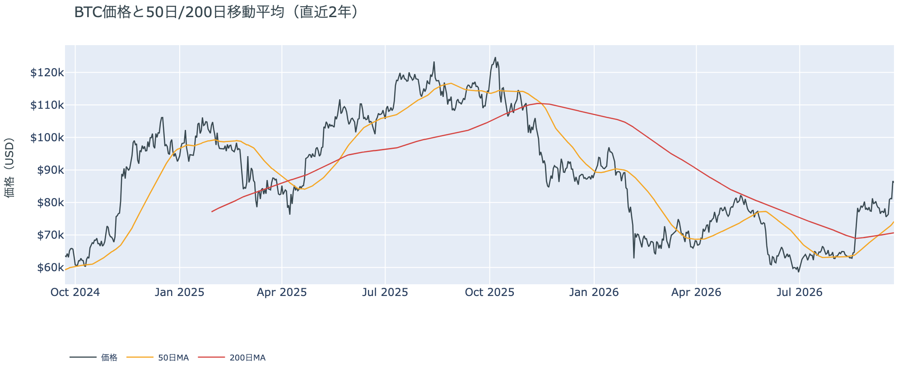

*図の見方: 2本の平均線の上下関係を見ます。50日線が200日線の上にあるのがゴールデンクロスです。*

* 50日線と200日線の差は約$3,448（4.9%）で、前日の$3,086からさらに開いた。
* 価格は50日線$74,121の約16.2%上。前日の17.7%から少し縮んだ。

ゴールデンクロス（＝50日線が200日線を上抜けること）の状態は15日目で、2本の線の差は毎日開き続けています。火曜は価格が止まり、50日線のほうが上がったので、価格と50日線の距離だけがわずかに縮みました。

証券市場は火曜9月22日、S&P500が横ばいの7,764.64、金が+0.3%の$4,396、米10年債利回りは4.97%でした。原油は5日続けて下げ、報道ではWTIの10月限が2.6%安の$93.30、ブレントが2.1%安の$98.23です。下の表と図2-1の原油の−6.2%には、先物の受け渡し月の切り替えが混じっています。

## 2. なぜ動いたか：ビットコイン自身の需給か、外部環境か

**図2-1 ビットコインと株・金・原油の相対推移（起点＝100）**

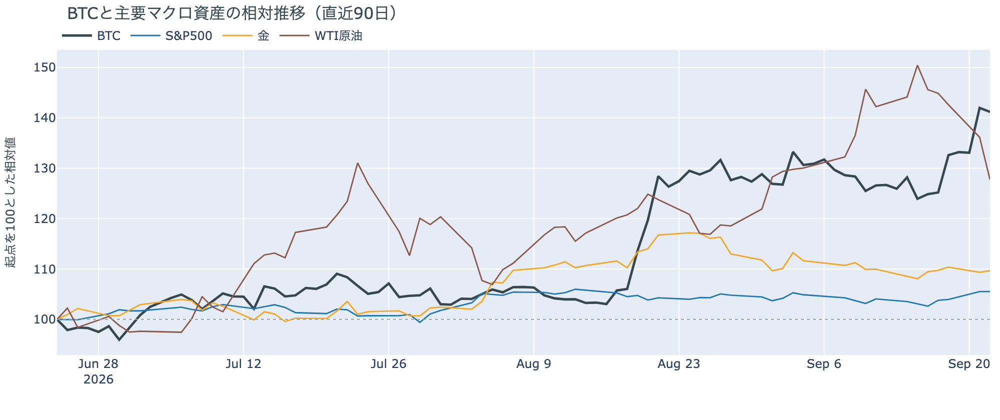

*図の見方: 同じ起点から何%動いたかで重ねたもの。線が同じ向きなら「一緒に動いた」、ビットコインだけ別の向きなら「自身の理由で動いた」と読みます。*

| この5営業日の動き（ビットコインは7日間） | 変化 |
|---|---:|
| ビットコイン | +13.9% |
| 金 | +1.5% |
| 米国株（S&P500） | +2.4% |
| 原油 | −15.1% |

* 火曜1日では、株が横ばい、米10年債利回りが4.97%でほぼ変わらず、原油が報道で2〜3%安。ビットコインは−0.3%。
* 建玉は106,985BTC。前日の108,825BTCから−1.7%で、1週間では+5.5%。
* 資金調達率はプラスのまま。1日をならした年率は+7.46%で、短期金利（13週Tビル 4.01%）を引いた上乗せは+3.46pt。前日の+3.20ptとほぼ同じで、直近1か月の平均+3.78ptより小さい。
* 直近30日の値動きの相関は、金が+0.63、S&P500が+0.42。
* 9月21日時点のコインが最後に動いた価格の分布にいまの価格を重ねると、$80,000〜$90,000の帯の下端から6割の位置にあり、価格より上の帯にある供給は全体の19%。

火曜日に価格が動かなかった理由は2つです。

1. 株も金利も動かなかった日だった。金曜と月曜の上げは株と同じ向きに起きていたので、株が横ばいで金利も変わらなければ、ビットコインも止まります。原油は、イランが「アメリカが封鎖を解けば7日以内にホルムズ海峡を再開できる」と表明し、サウジアラビアが紅海側の港から輸出を再開すると伝えられて下げましたが、株が動かなかったこの日、ビットコインも動いていません。
2. ビットコイン自身の需給では、先物のロングが減った分を、現物の買い手が埋めた。火曜の午前に85,000ドル台でロングが清算され、建玉（＝先物の未決済残高。証拠金で張っている人の量）は月曜に増えた分の一部を戻しましたが、価格は$85,000を割っていません。同じ日にCoinbaseの価格はいつものブレを超えてアメリカ側が高く（図①-1）、月曜分のETFはこの90日で最大の入り超でした（図①-2）。資金調達率（＝ロングが払う金利。プラス＝ロングがショートより多い）の短期金利に対する上乗せは前日とほぼ同じで、残ったロングが金利を余分に払ってまで積み増した形ではありません。

外部環境では、トランプ大統領が国連総会の演説で「中間選挙のあとにイランとの合意を見込む」と述べ、ペゼシュキアン大統領との会談は「おそらく前向き」のままで正式な予定はありません。原油は$90前後まで下げましたが、ホルムズ海峡の再開はまだ条件付きの表明で、供給への不安が消えたわけではありません。

## 3. 市場参加者はいまどう見ているか

### ① アメリカの買い手は月曜の上げに加わり、火曜も高い価格を払って買っている

**図①-1 Coinbase Premium（アメリカとそれ以外の価格差・直近90日）**

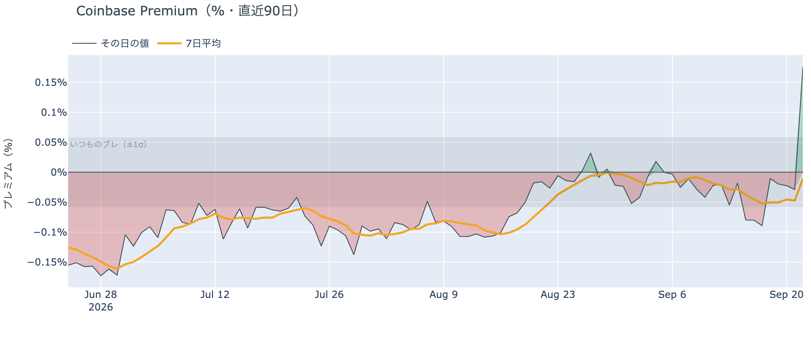

*図の見方: プラス＝アメリカで買いが強い。太線が1週間平均、細線がその日の値。薄い帯は「いつものブレの範囲」です。*

* Coinbase Premiumは1週間平均で−0.011%。先週の−0.038%から上がり、マイナス幅はほぼ消えた。
* その日の値は+0.176%で、いつものブレの3.0倍。この300日で最も高く、前日の−0.029%から一気に反転した。

アメリカの買い手は火曜日、ほかの国より高い価格を払ってでも買っています。Coinbase Premium（＝アメリカとそれ以外の価格差）はこの300日で最も高い値に跳ね、1週間平均のマイナスもほぼ消えました。前日は「アメリカの買い手はこの上げを主導していない」と説明しましたが、月曜分のETFが分かった今朝、この説明は書き換えます。月曜の上げにはアメリカの買い手が現物で加わっていました。

**図①-2 ETFの日ごとの資金の出入り（直近90日）**

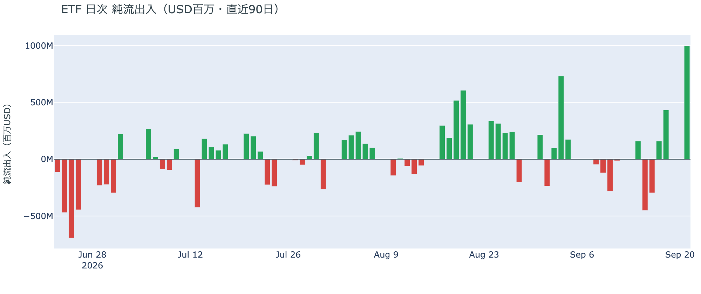

*図の見方: 入ったお金と出たお金の差。上に伸びれば入り超、下に伸びれば出超。*

| ETFの日ごとの出入り | 億ドル |
|---|---:|
| 9月16日 | −3.0 |
| 9月17日 | +1.6 |
| 9月18日 | +4.3 |
| 9月21日 | +10.0 |
| 直近7営業日の合計 | +9.9 |

* 入り超は3営業日連続。月曜分は上場以来の全営業日の上位2%に入る大きさで、IBIT・ARKB・FBTCの3本で9割を占めた。

月曜分のETFは、この90日で最大の入り超でした。金曜分の2倍を超える規模で、7営業日の合計は前週までの出超をすべて埋めて入り超に変わっています。アメリカの買い手は「手を止めている」から「買っている」へ移りました。

**図①-3 Fear & Greed（市場心理の指数・直近90日）**

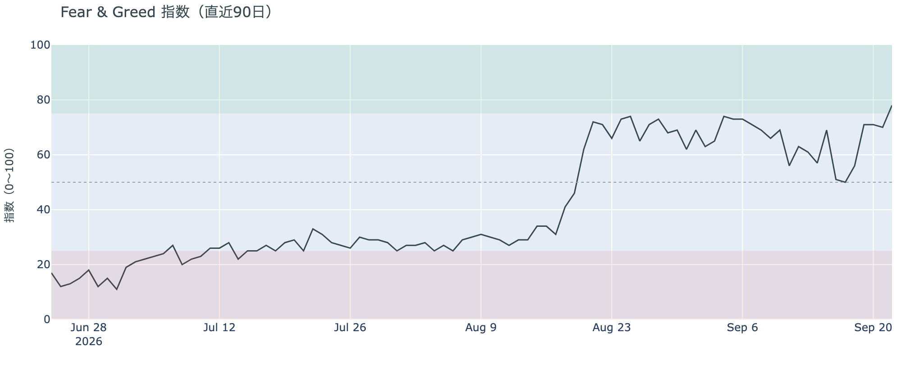

*図の見方: 0〜100で、50より上が「強欲」、下が「恐怖」。75より上は「極度の強欲」です。*

* 78の「極度の強欲」。前日の70から+8pt。1週間前は69、1か月前は66。
* 「極度の強欲」に入ったのはこの90日で初めて。8月と9月上旬は最高でも74だった。

Fear & Greed（＝市場心理の指数）は、7%の上げを受けて「極度の強欲」に入りました。この領域は過熱の目安とされることが多く、価格の下げを怖がっている人はほとんどいない状態です。市場心理だけを見れば、参加者は月曜の上げを「一時的な押し」ではなく「流れが続く」側に置いています。

### ② 長期保有者は7%上げた日も手放す量を変えず、動いたコインはほぼ買値どおり

**図②-1 長期保有者の保有量の30日変化とSOPR（直近60日）**

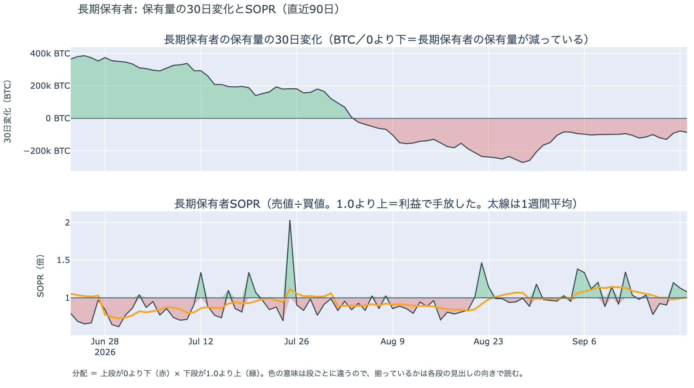

*図の見方: 上段は、長期保有者の保有量が30日でどれだけ増減したか。マイナス＝手放している。下段は長期保有者SOPRで、1より上なら利益で手放した。どちらも太線の1週間平均で読みます。*

| 9月21日時点 | 1週間平均 | 前の週の平均 |
|---|---:|---:|
| 長期保有者SOPR（1より上＝利益で手放した） | 1.007 | 1.072 |
| 長期保有者の保有量の30日変化（万BTC） | −10.3 | −10.2 |

* 減り方は1か月前（−23.5万BTC）の4割強で、この2週間は−10万BTC前後で止まっている。
* 1年以上動いていないコインは全体の63.3%で、3か月で1.9pt増えた。売りに出てくるコインが少ない状態は続いている。

長期保有者（＝155日以上動かしていないコインの持ち主）は、7%上げた月曜を含めても、手放す量を1週間変えていません。長期保有者SOPR（＝長期保有者が動かしたコインの売値÷買値）は1週間平均で1.007で、動かしたコインは平均して買値より0.7%高く手放されました。前の週の7%高くから縮み、ほぼ買値どおりです。量は減り続けていますが、勢いは1か月前の半分以下で、価格が上がっても放出は増えていません。ETFや取引所が預かっている分を差し引いても、この規模と向きは変わりません。放出が増えないまま現物の買い手が入っているので、同じ規模の買いでも価格が動きやすい下地です。

今日は、コインが最後に動いた価格の分布に大きな変化がなく、長く眠っていたコインが動いた記録もありません。マイナーの収入は平年並み（Puell Multiple（＝マイナー収入の平年比）が1週間平均で1.01）で、売りを急ぐ状況ではありません。

### ③ 先物：ロングの一部が清算され、傾きは弱まった

**図③-1 資金調達率と建玉（直近30日）**

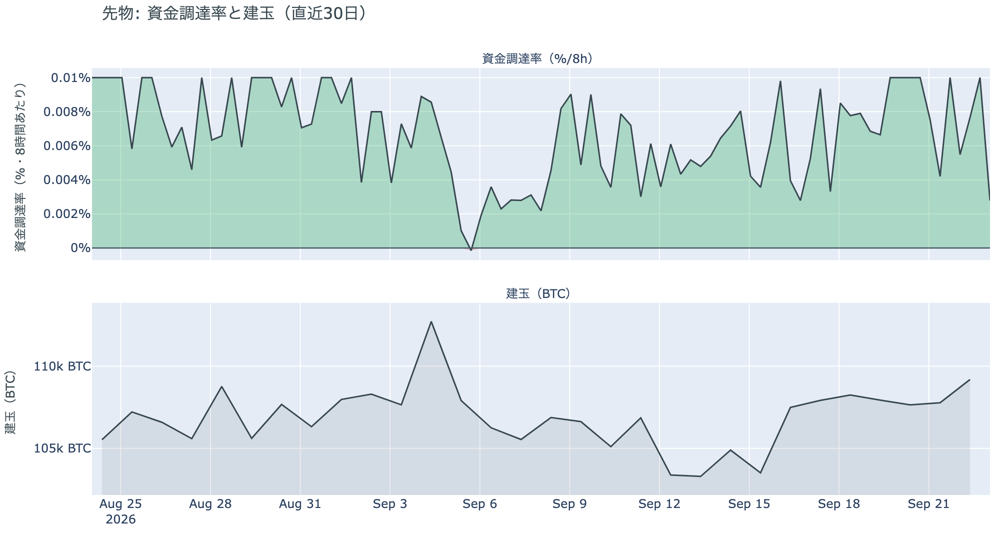

*図の見方: 上段は資金調達率（8時間ごと・日本時間）。プラスが続く＝ロングがショートより多い。下段は建玉。*

* 資金調達率はプラスが52回連続（約17日）。ロングがショートより多い状態が続いている。
* 短期金利に対する上乗せは+3.46pt。日曜の+6.07ptの半分強で、直近1か月の平均+3.78ptより小さい。
* 建玉は106,985BTC。前日から1,840BTC減り、月曜に増えた分の一部を戻した。1週間では+5.5%。

火曜の午前に85,000ドル台でロングの一部が清算され、建玉は月曜に増えた分の一部を戻しました。残ったロングが払う短期金利に対する上乗せは前日とほぼ同じです。資金調達率がプラスのまま建玉が減ったので、ロングへの傾きは弱まりました。過熱ではなく、7%上げた翌日にロングが追いかけて積み増した形でもありません。

### ④ オプション：今週の満期の権利料に乗っていた10月の満期に対する上乗せは剥がれ、備えが残るのは10月30日以降の満期

オプションには2種類あります。コール（＝決めた価格で買う権利）とプット（＝決めた価格で売る権利）で、価格が上がればコールの価値が上がり、価格が下がればプットの価値が上がります。プットは「価格が下がったときの保険」として買われます。オプションを買う人は、その権利と引き換えに権利料（＝オプションを買う人が払う金額）を払います。

**図④-1 満期ごとのIV（年率%）**

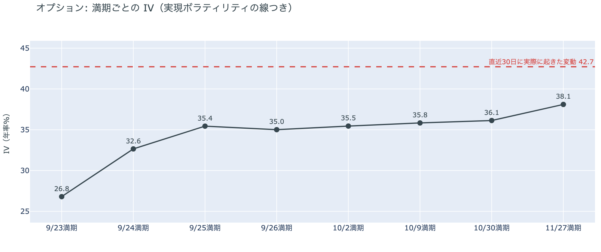

*図の見方: IVを満期ごとに並べたもの。点線は実現ボラティリティ。IVが点線より下なら、市場はこの先の値動きを過去の値動きより小さいと見ています。*

* IVは全体で38.1。前日の35.6から上がったが、過去1年の下から16%の位置。実現ボラティリティは42.7で、前日の37.2から7%の上げの分だけ上がった。
* 満期ごとに見ると、9月24日が32.6、9月25日が35.4、10月2日が35.5、10月30日が36.1。手前ほど低く先ほど高い平常の形で、突出した満期は無い。

IV（＝オプション価格から逆算した、この先の値動きの幅の予想）は実現ボラティリティ（＝実際に起きた値動きの幅）より4.6pt低く、市場はこの先の値動きを過去の値動きより小さいと見ています。守りを固めている状態ではなく、怖がってもいません。前日まで、9月24日と25日に満期が来るオプションの権利料には、10月の満期に対する上乗せが乗っていました。木曜の米中首脳会談と金曜の大きな満期の前後に大きく動くと見られていたからです。その上乗せは火曜の朝までに剥がれ、参加者は今週の残りを10月より荒れる区間とは見なくなっています。

**図④-2 満期ごとのプットとコールの差**

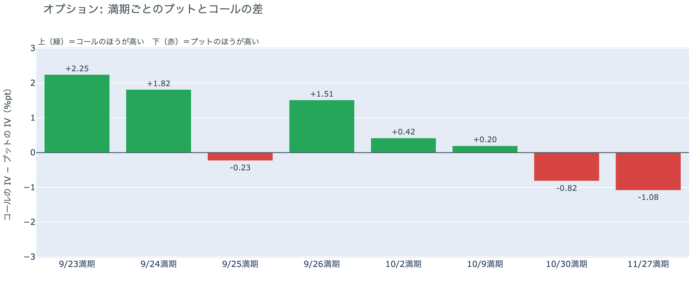

*図の見方: 満期ごとに、プットとコールのどちらが高く売れているか。ゼロより上ならコールのほうが高く、下ならプットのほうが高い。*

| 満期 | どちらが高いか |
|---|---|
| 9月23日 | コールがはっきり高い |
| 9月24日 | コールが高い |
| 9月25日 | プットがわずかに高い（前日ははっきり高かった） |
| 9月26日 | コールが高い |
| 10月2日 | コールが高い（前日はほぼ差なし） |
| 10月9日 | コールがわずかに高い（前日はプットがわずかに高かった） |
| 10月30日 | プットが高い |
| 11月27日 | プットが高い |

* プットのほうが高い満期は、9月25日の1つを挟んで、10月30日以降だけになった。10月2日と10月9日はコールが高い側へ戻った。

参加者は、金曜の大きな満期までを「備える」側に置いた月曜の朝から、火曜には「荒れない」側へ戻しました。9月25日の満期でプットが高い幅は縮んでわずかになり、その前後の満期はコールのほうが高くなっています。備えが残るのは10月30日以降の満期で、10月30日は10月27日〜28日のFOMC（＝米国の金利を決める会合）の直後に当たります。価格が上がる側に賭ける人が、金曜の満期を過ぎた10月上旬の満期にも増えた形です。

**図④-3 9月25日満期の持ち高（権利の価格ごと）**

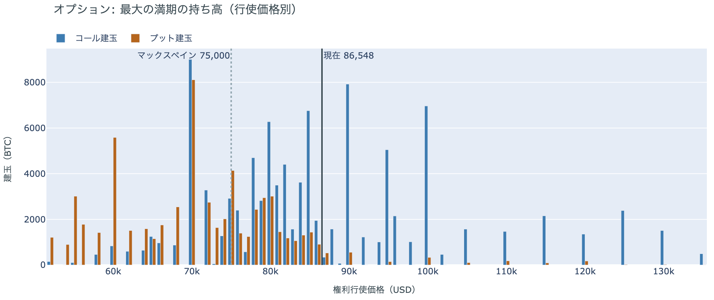

*図の見方: 青＝コール、橙＝プット。現値より上にコールが、下にプットが積まれるのが普通です。*

| 9月25日満期のオプション（価格は約$86,500） | 量（万BTC） | 意味 |
|---|---:|---|
| いまより高い価格のコール（決めた価格で買う権利） | 約5.0 | 「価格が上がる」に賭けた分 |
| いまより安い価格のプット（決めた価格で売る権利） | 約7.2 | 「価格が下がる」への保険 |
| うち、いまより15%以上高い価格のコール | 約2.9 | 大きな上げへの賭け |
| うち、いまより15%以上安い価格のプット | 約4.8 | 大きな下げへの保険 |

* 9月25日満期の持ち高は全部で185,783BTCで、全満期の37%。コールがプットの1.5倍で、前日と同じ形。
* 持ち高が集まっている価格は、多い順に$85,000、$90,000、$86,000、$84,000。前日と同じ帯。

「価格が上がる」に賭けた人たちは、火曜も降りていません。いまより高い価格に残るコールの量は前日と同じで、いちばん厚いのは$90,000のコールです。この賭けが報われるには、9月25日17時の満期までの2日余りで$90,000を超える必要があります。いまの価格は、持ち高が集まる$84,000〜$90,000の帯の中にあります。

## 4. 価格に影響しうる直近のイベント

予測ではなく、「次に市場が反応しうる材料」の案内です。オプション市場が備えを置いているのは10月30日以降の満期で、10月27日〜28日のFOMCの直後に当たります。木曜の米中首脳会談と金曜の大きな満期をまたぐ今週の満期の権利料に、10月の満期に対する上乗せは今朝の時点で乗っていません。米10年債利回りは5%の手前にあり、来週の物価統計と雇用統計は金利の材料になります。

| 日付 | イベント | 何に効くか |
|---|---|---|
| 9/23（水） | 国連総会でイランのペゼシュキアン大統領が演説。トランプ大統領との会談は「おそらく前向き」のままで、正式な予定は無い | 原油 |
| 9/24（木） | 米中首脳会談（ホワイトハウス）。関税の一時停止の期限・レアアース・AI・台湾を協議 | 通商。株 |
| 9/25（金）17:00 | オプションの大きな満期（約18.6万BTC、全満期の37%） | 「価格が上がる」に賭けた人たちの期限。この満期だけプットがわずかに高い |
| 9/30（水）21:30 日本時間 | 米PCE物価（8月分。FRBが重視する物価統計）と4〜6月期GDPの確定値 | 金利。10月のFOMCでもう1回利上げするかの材料 |
| 10/2（金）21:30 日本時間 | 米9月の雇用統計 | 金利 |
| 10/5（月）まで | 米議会の休会前。上院で9月15日に否決されたCLARITY法案（＝暗号資産の市場構造法案）の再採決があるかどうか。倫理条項をめぐる交渉が続く | 規制 |
| 10/27（火）〜28（水） | FOMC。9月16日のFOMCで示された見通しでは、18人中16人が年内もう1回の利上げを見込む | 金利。10月30日の満期でプットが高いのはこの直後 |
| 日程未定 | イランが「アメリカが封鎖を解けば7日以内にホルムズ海峡を再開できる」と表明。サウジアラビアは紅海側の港からの輸出再開へ | 原油 |
| 日程未定 | 米下院本会議で、ビットコインの戦略準備を法律にする法案の採決（委員会は9月16日に可決） | 規制 |

## まとめ：火曜日の動きは何だったか

火曜日は、7%上げた翌日に株と金利が動かず、ビットコインも値幅2%で止まった日でした。動いたのは火曜の午前だけで、85,000ドル台で多数のロングが清算されましたが、価格は$85,000を割らずに$86,000台へ戻っています。今朝いちばんの変化はアメリカの買い手です。月曜分のETFはこの90日で最大の入り超、火曜のCoinbaseの価格はこの300日で最もアメリカ側が高く、前日の「アメリカの買い手は主導していない」という説明は「月曜の上げに現物で加わっていた」に書き換えました。長期保有者は9月21日時点で手放す量を変えず、動いたコインはほぼ買値どおりです。市場心理は78の「極度の強欲」に入りました。オプションでは、今週の満期の権利料に乗っていた10月の満期に対する上乗せが剥がれ、備えが残るのは10月30日以降の満期だけで、「価格が上がる」に賭けた人たちは降りていません。

---

*本稿は情報提供を目的としたものであり、投資助言ではありません。将来の価格動向を保証・示唆するものではなく、投資判断は各自の責任において行ってください。*
