# 米10年債が19年ぶりの5.1%へ跳ねた夜に2%下げて$84,000台 ― 清算されたのは多数のロング、建玉は1日で8%減り、全部の満期でプットが高い側へ入れ替わった

**2026年9月24日**

水曜日は、証券市場と同じ向きに下げた日です。米10年債利回りが5.11%と2007年以来の高さへ跳ね、株も金も下げた水曜の夜に、ビットコインは$87,000台から$84,000台へ2%下げました。朝7時5分の価格は約$84,343。同じ時間帯に買い持ち（ロング）が多数清算（＝証拠金不足で強制的に閉じられた取引）され、先物の建玉は1日で8%減って、月曜の上げで積まれた分が一晩で消えました。アメリカの買い手は火曜分のETFまで4営業日続けて買っており、長期保有者の手放す量も変わっていません。オプションでは、前日まで手前の満期でコールが高かった値付けが、**全部の満期でプットが高い側へ入れ替わり**、いちばんはっきりしているのは明日9月25日の大きな満期です。

（数値は9月24日7時5分（日本時間）までのデータに基づきます。価格・先物・オプションはその時点の値、市場心理は9月23日の確定値、オンチェーン（＝ブロックチェーン上の記録）は9月22日時点、ETF資金フローは9月22日の火曜分までで、水曜分はまだ集計途中です。証券市場の終値は9月23日時点です。オンチェーンの長期保有者の数値には、ETFや取引所が預かっている分も含まれます。オプションはDeribit（BTCオプションの大半を占める取引所）の全銘柄です。）

## 1. 何が起きたか

**図1-1 価格の推移（1時間足・直近7日）**

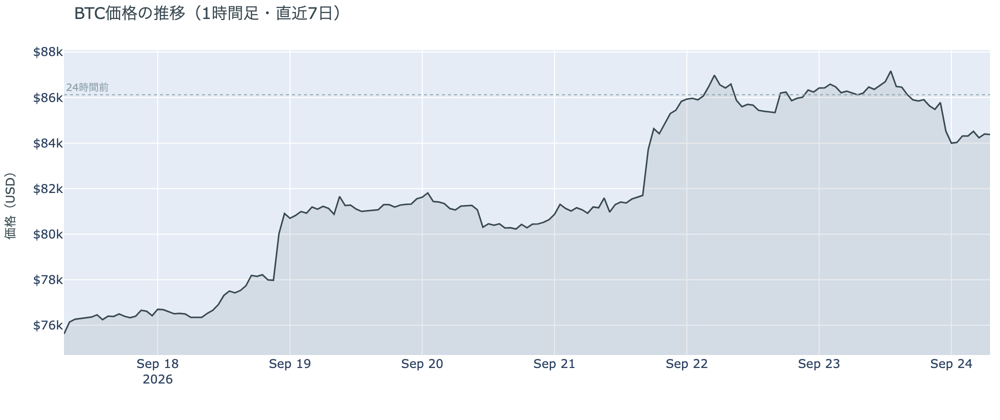

*図の見方: 1時間ごとの価格（日本時間）。金曜と月曜に2段の階段のように上がった線が、水曜の夜に1段下がっています。*

* 24時間で−2.1%、値幅は$83,513〜$87,283の4.5%。1週間前と比べると+10.8%、1か月前と比べると+6.8%。
* 直近の確定した日足終値は9月22日の$86,198。
* Hyperliquid（＝オンチェーンの先物取引所）で見える清算は、この24時間で215件。ほぼ全部ロングで、9割以上が83,000〜84,000ドル台に集中し、6割が水曜23時台の1時間に出た。209のアドレスに散らばり、最大の1件が全体の26%。

水曜日は、金曜と月曜に2段上がった階段を、1段下りた日です。下げたのは水曜の23時台で、アメリカの景況感の統計が出て米10年債利回りが跳ねた時間帯にあたります。その1時間に多数のロングが清算され、大口が1つ飛んだのではありません。金曜と月曜に清算されたのはショート、火曜と水曜はロングで、向きが入れ替わったまま2日目です。

**図1-2 価格と50日・200日移動平均**

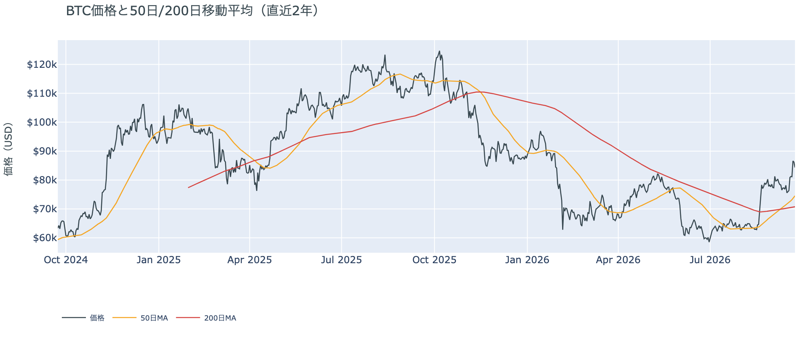

*図の見方: 2本の平均線の上下関係を見ます。50日線が200日線の上にあるのがゴールデンクロスです。*

* 50日線と200日線の差は約$3,769（5.3%）で、前日の$3,448からさらに開いた。
* 価格は50日線$74,529の約13.2%上。前日の16.2%から縮んだ。

ゴールデンクロス（＝50日線が200日線を上抜けること）の状態は16日目で、2本の線の差は毎日開き続けています。水曜の2%の下げで縮んだのは、価格と50日線の距離だけです。

**図1-3 価格に清算を重ねたもの（直近24時間）**

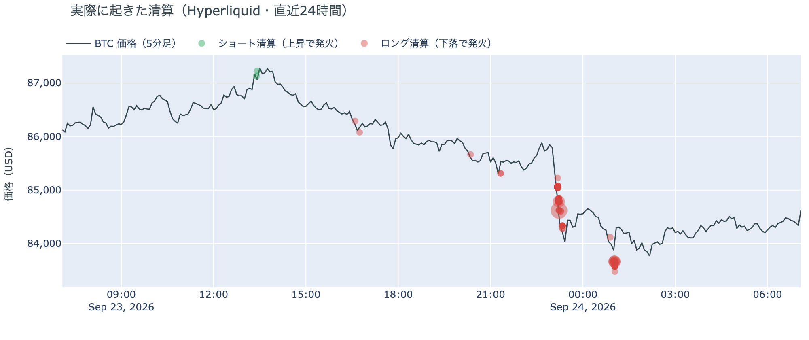

*図の見方: 線が価格（日本時間）、点が清算。点が縦にそろう時間帯に清算が集中しています。*

* 清算は水曜23時台に集中し、価格が$86,000台から$84,000台へ下がる途中で出た。

清算は下げの途中で同じ時間に起きているので、どちらが先かはこのデータでは決まりません。言えるのは、水曜の下げは多数のロングの清算を伴った、ということです。

証券市場は水曜9月23日、S&P500が−0.8%の7,706.03、金が−1.2%の$4,323、米10年債利回りは5.11%で2007年7月以来の高さでした。原油は下の表と図2-1では−2.0%ですが、報道ではWTIが1.8%高の$92.16で5日続いた下げが止まっています。表の値と報道の差には、先物の受け渡し月の切り替えが混じっています。

## 2. なぜ動いたか：ビットコイン自身の需給か、外部環境か

**図2-1 ビットコインと株・金・原油の相対推移（起点＝100）**

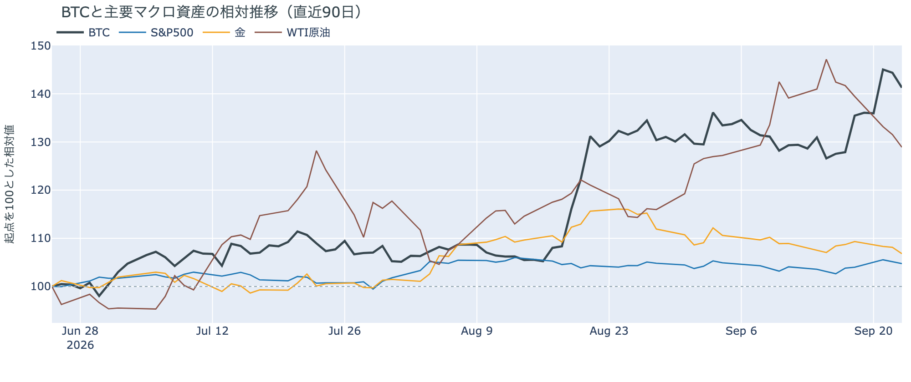

*図の見方: 同じ起点から何%動いたかで重ねたもの。線が同じ向きなら「一緒に動いた」、ビットコインだけ別の向きなら「自身の理由で動いた」と読みます。*

| この5営業日の動き（ビットコインは7日間） | 変化 |
|---|---:|
| ビットコイン | +10.8% |
| 金 | −1.5% |
| 米国株（S&P500） | +1.6% |
| 原油 | −9.5% |

* 水曜1日では、株が−0.8%、金が−1.2%、ドル指数が+0.7%、米10年債利回りが4.97%から5.11%へ上昇。ビットコインは−2.1%で、株と金と同じ向き。
* 建玉は98,480BTC。前日の106,985BTCから1日で減り、1週間では−0.7%。
* 資金調達率はプラスのまま小さくなった。1日をならした年率は+0.96%で、短期金利（13週Tビル 4.03%）を引いた上乗せは−3.06pt。前日の+3.46ptから一気に沈み、直近1か月で最も小さい。
* 直近30日の値動きの相関は、金が+0.66、S&P500が+0.45。

水曜日に価格が下げた理由は2つです。

1. 証券市場と同じ向きに動いた。アメリカの景況感の統計（PMI）がサービス業で5年ぶり、製造業で4年ぶりの高さとなり、10月のFOMC（＝米国の金利を決める会合）でもう1回利上げするという見方が強まって、米10年債利回りが5.11%へ跳ねました。株も金も同じ夜に下げ、ドルが上がっています。ビットコインが下げたのはその統計が出た直後の23時台で、株と金と同じ向き、同じ時間帯です。
2. ビットコイン自身の需給では、月曜に積まれた先物のロングが一晩で消えた。建玉（＝先物の未決済残高。証拠金で張っている人の量）は1日で8%減り、1週間前とほぼ同じ水準に戻りました。資金調達率（＝ロングが払う金利。プラス＝ロングがショートより多い）の短期金利に対する上乗せはマイナスに転じ、ロングがショートより多い状態はほぼ消えています。清算されたのが多数のロングだったことと合わせると、金利の上昇に押された下げで、レバレッジ（＝元手より大きな金額を建てること）を掛けていたロングが押し出された形です。

前日は「金曜と月曜の上げは株と同じ向きに起きていた」と説明しました。水曜は下げも株と同じ向きだったので、ビットコインが証券市場と一緒に動いている、という前日の説明は今日の数値と合っています。

外部環境では、イランのペゼシュキアン大統領が国連総会で「イランは屈服しない」と演説し、前日の米イラン協議についてルビオ国務長官は「前向きだったが突破口ではない」と述べました。ホルムズ海峡は事実上閉鎖されたままで、原油の5日続いた下げが止まっています。原油が高止まりしていることは金利が上がる理由の一つとして報じられており、リスク資産全体の重しになりうる状況です。

## 3. 市場参加者はいまどう見ているか

### ① アメリカの買い手は火曜分まで4営業日続けて買っているが、ほかの国より高く払ってはいない

**図①-1 Coinbase Premium（アメリカとそれ以外の価格差・直近90日）**

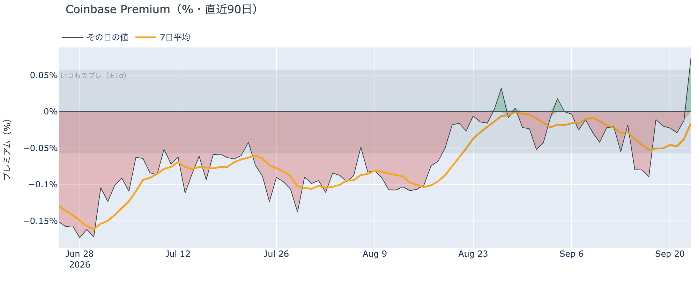

*図の見方: プラス＝アメリカで買いが強い。太線が1週間平均、細線がその日の値。薄い帯は「いつものブレの範囲」です。*

* Coinbase Premiumは1週間平均で−0.016%。先週の−0.045%からマイナス幅が縮み、ほぼゼロ。
* その日の値は+0.074%で、いつものブレの1.3倍と範囲の内側。確定した火曜の値は−0.012%だった。

Coinbase Premium（＝アメリカとそれ以外の価格差）は、1週間平均でほぼゼロです。アメリカの買い手は、ほかの国より高い価格を払ってまでは買っていません。前日は「火曜のCoinbaseの価格はいつものブレを超えてアメリカ側が高い」と書きましたが、確定した火曜の値はほぼゼロで、いつものブレの内側に収まったので、この説明は今日の数値と合っていません。アメリカの買い手が買っていることを示すのはETF（図①-2）のほうで、Coinbase Premiumが示すのは「価格差を付けてまでは買っていない」ことです。

**図①-2 ETFの日ごとの資金の出入り（直近90日）**

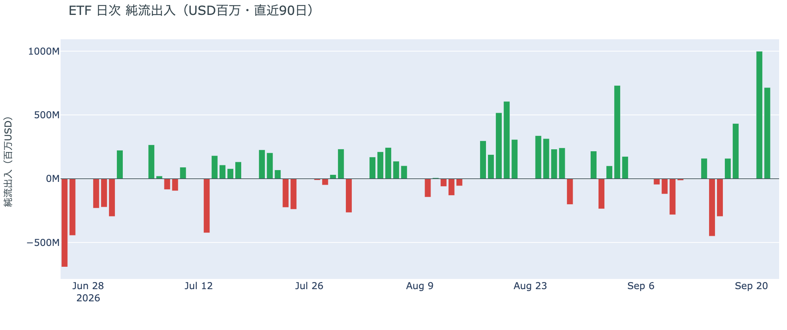

*図の見方: 入ったお金と出たお金の差。上に伸びれば入り超、下に伸びれば出超。*

| ETFの日ごとの出入り | 億ドル |
|---|---:|
| 9月17日 | +1.6 |
| 9月18日 | +4.3 |
| 9月21日 | +10.0 |
| 9月22日 | +7.1 |
| 直近7営業日の合計 | +15.6 |

* 入り超は確定分で4営業日連続。火曜分は月曜分の7割の規模。水曜分は集計途中。

アメリカの買い手は、火曜分まで買い続けています。月曜の90日で最大の入り超に続き、火曜も大きな入り超で、7営業日の合計は前週の出超をすべて埋めて入り超です。水曜の下げの日にどう動いたかは、まだ数字が出ていません。

**図①-3 Fear & Greed（市場心理の指数・直近90日）**

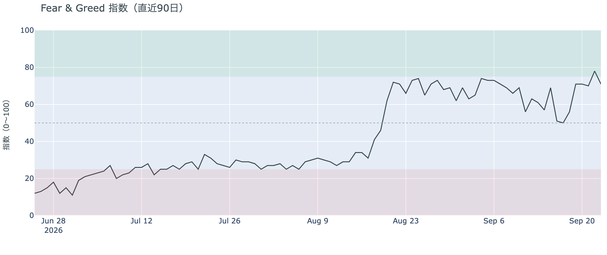

*図の見方: 0〜100で、50より上が「強欲」、下が「恐怖」。75より上は「極度の強欲」です。*

* 71の「強欲」。前日の78から−7pt。1週間前は51、1か月前は73。

Fear & Greed（＝市場心理の指数）は、「極度の強欲」に入った翌日に「強欲」へ戻りました。2%の下げで市場心理はすぐに冷めましたが、1か月前と同じ水準で、価格の下げを怖がっている状態ではありません。

### ② 長期保有者は利益で手放し続けているが、量は1か月前の4割のまま

**図②-1 長期保有者の保有量の30日変化とSOPR（直近60日）**

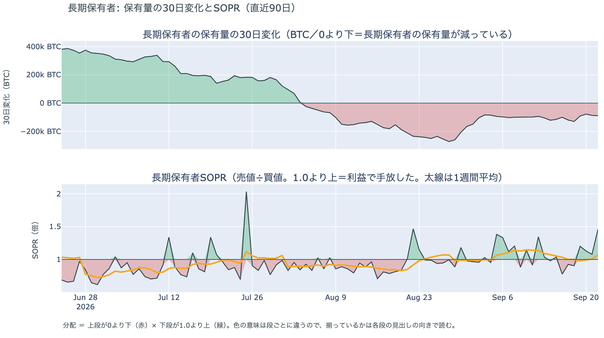

*図の見方: 上段は、長期保有者の保有量が30日でどれだけ増減したか。マイナス＝手放している。下段は長期保有者SOPRで、1より上なら利益で手放した。どちらも太線の1週間平均で読みます。*

| 9月22日時点 | 1週間平均 | 前の週の平均 |
|---|---:|---:|
| 長期保有者SOPR（1より上＝利益で手放した） | 1.068 | 1.048 |
| 長期保有者の保有量の30日変化（万BTC） | −9.9 | −10.5 |

* 減り方は1か月前（−23.8万BTC）の4割強で、この2週間は−10万BTC前後で止まっている。
* 1年以上動いていないコインは全体の63.3%で、3か月で1.8pt増えた。売りに出てくるコインが少ない状態は続いている。

長期保有者（＝155日以上動かしていないコインの持ち主）は、利益の出ているコインを手放し続けています。長期保有者SOPR（＝長期保有者が動かしたコインの売値÷買値）で見ると、動かしたコインは平均して買値より6.8%高く手放されました。保有量の30日変化がマイナスで、動いた分が利益側なので、これは分配（＝長期保有者からの放出）です。ただし勢いは1か月前の半分以下で、月曜に7%上げても、水曜に2%下げても、手放す量は変わっていません。ETFや取引所が預かっている分を差し引いても、この規模と向きは変わりません。放出が増えないまま、1年以上動いていないコインの割合は増えているので、同じ規模の買いでも売りでも価格が動きやすい下地です。ビットコイン自身の需給の土台は、前日と変わっていません。

今日は、コインが最後に動いた価格の分布に大きな変化がなく、長く眠っていたコインが動いた記録もありません。マイナーの収入は平年並み（Puell Multiple（＝マイナー収入の平年比）が1週間平均で1.01）で、売りを急ぐ状況ではありません。

### ③ 先物：月曜に積まれたロングは一晩で消え、ロングへの傾きはほぼ無くなった

**図③-1 資金調達率と建玉（直近30日）**

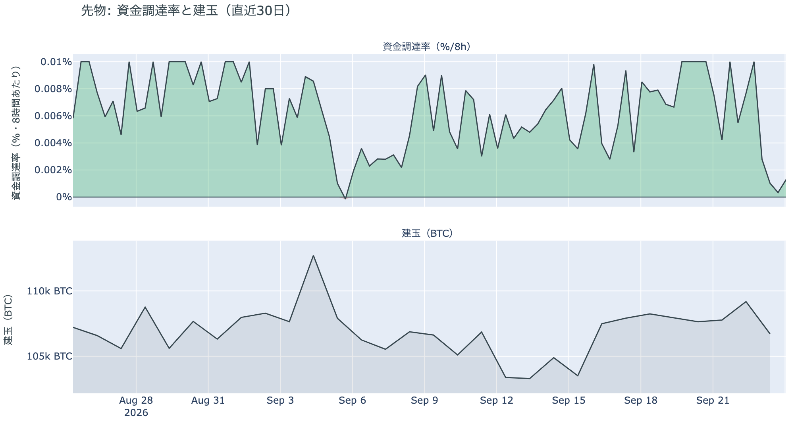

*図の見方: 上段は資金調達率（8時間ごと・日本時間）。プラスが続く＝ロングがショートより多い。下段は建玉。*

* 建玉は98,480BTC。前日の106,985BTCから8,505BTC減り、1週間前とほぼ同じ水準に戻った。月曜の上げで積まれた分がちょうど消えた形。
* 短期金利に対する上乗せは−3.06pt。直近1か月の平均は+3.60ptで、マイナスだった日は1か月のうち1割ほどしかない。

月曜の上げで積まれたロングは、水曜の夜に一晩で消えました。資金調達率の1日をならした年率は+0.96%で、短期金利（13週Tビル 4.03%）を引いた上乗せは−3.06pt。ロングが払う金利が、ただ置いておくだけでもらえる短期金利を下回り、ロングがショートより多い状態はほぼ無くなっています。前日は「ロングへの傾きは弱まった」と説明しましたが、水曜はその残りも清算と手仕舞いで消え、傾きそのものが無くなりました。過熱の逆で、レバレッジを掛けたロングがいったん退いた状態です。

### ④ オプション：全部の満期でプットが高い側へ入れ替わり、いちばんはっきりしているのは明日の満期

オプションには2種類あります。コール（＝決めた価格で買う権利）とプット（＝決めた価格で売る権利）で、価格が上がればコールの価値が上がり、価格が下がればプットの価値が上がります。プットは「価格が下がったときの保険」として買われます。オプションを買う人は、その権利と引き換えに権利料（＝オプションを買う人が払う金額）を払います。

**図④-1 満期ごとのIV（年率%）**

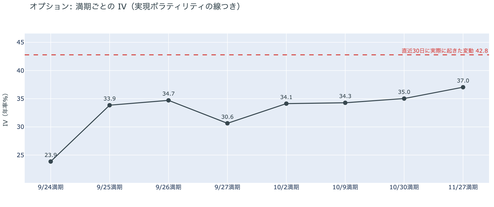

*図の見方: IVを満期ごとに並べたもの。点線は実現ボラティリティ。IVが点線より下なら、市場はこの先の値動きを過去の値動きより小さいと見ています。*

* IVは全体で37.4。前日の38.1から下がり、過去1年の下から11%の位置。実現ボラティリティは42.8。
* 満期ごとに見ると、今日9月24日が23.9で最も低く、9月25日が33.9、10月30日が35.0、11月27日が37.0。手前ほど低く先ほど高い平常の形で、突出した満期は無い。

IV（＝オプション価格から逆算した、この先の値動きの幅の予想）は実現ボラティリティ（＝実際に起きた値動きの幅）より5.4pt低く、市場はこの先の値動きを過去の値動きより小さいと見ています。2%下げた夜でもIVは上がらず、過去1年の中では低いほうなので、守りを固めている状態でも怖がっている状態でもありません。特定の満期のオプションの権利料に、ほかの満期に対する上乗せは乗っていません。今日の米中首脳会談と明日の大きな満期の前後に大きく動く、とは見られていない形です。

**図④-2 満期ごとのプットとコールの差**

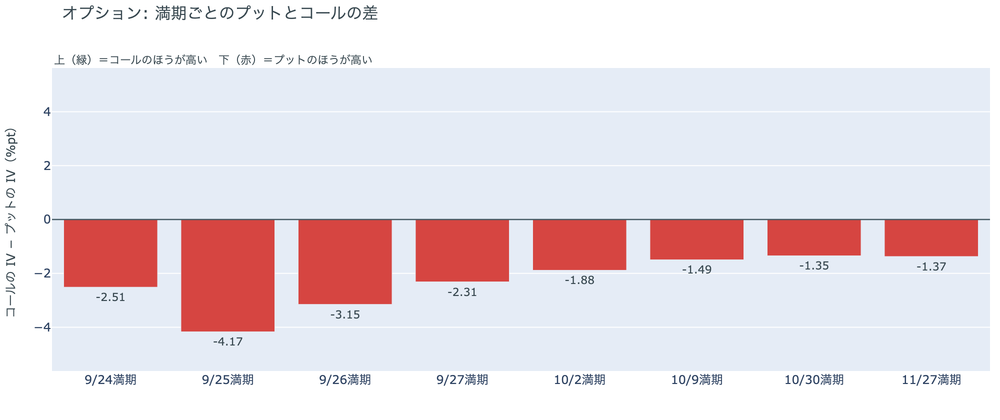

*図の見方: 満期ごとに、プットとコールのどちらが高く売れているか。ゼロより上ならコールのほうが高く、下ならプットのほうが高い。*

| 満期 | どちらが高いか |
|---|---|
| 9月24日 | プットが高い（前日はコールが高かった） |
| 9月25日 | プットがはっきり高い（前日はわずかだった） |
| 9月26日 | プットが高い（前日はコールが高かった） |
| 9月27日 | プットが高い |
| 10月2日 | プットが高い（前日はコールが高かった） |
| 10月9日 | プットが高い（前日はコールがわずかに高かった） |
| 10月30日 | プットが高い |
| 11月27日 | プットが高い |

* 8つの満期すべてでプットのほうが高い。前日はコールが高い満期が5つあった。最も差が大きいのは9月25日で、先の満期ほど差は小さい。

参加者は、水曜の一晩で、全部の満期を「荒れない」側から「備える」側へ戻しました。前日まで手前の満期でコールが高かった値付けは消え、明日9月25日の大きな満期でプットが最もはっきり高くなっています。ただし持ち高（図④-3）はほぼ変わっていないので、参加者が新たにプットを買い足したというより、水曜の下げを受けて、プットの権利料が全部の満期で高く値付けし直された形です。10月30日以降の満期は、前日からプットが高いままです。10月30日は10月27日〜28日のFOMCの直後に当たります。

**図④-3 9月25日満期の持ち高（権利の価格ごと）**

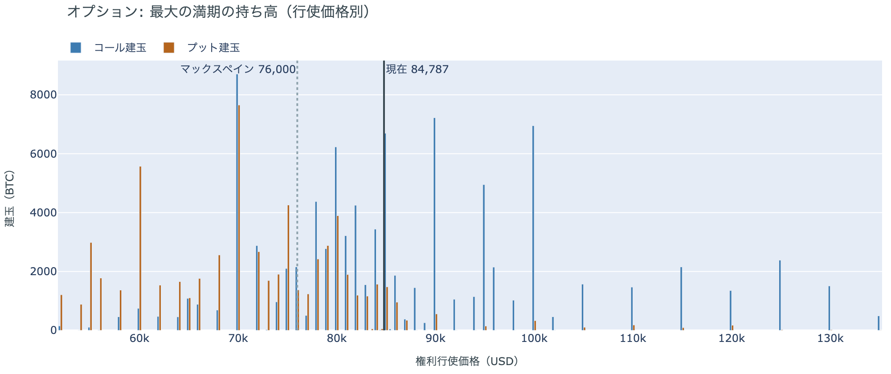

*図の見方: 青＝コール、橙＝プット。現値より上にコールが、下にプットが積まれるのが普通です。*

| 9月25日満期のオプション（価格は約$84,800） | 量（万BTC） | 意味 |
|---|---:|---|
| いまより高い価格のコール（決めた価格で買う権利） | 約5.7 | 「価格が上がる」に賭けた分 |
| いまより安い価格のプット（決めた価格で売る権利） | 約7.1 | 「価格が下がる」への保険 |
| うち、いまより15%以上高い価格のコール | 約3.0 | 大きな上げへの賭け |
| うち、いまより15%以上安い価格のプット | 約4.6 | 大きな下げへの保険 |

* 9月25日満期の持ち高は全部で181,995BTCで、全満期の36%。前日の185,783BTCとほぼ同じで、コールがプットの1.4倍。
* 持ち高が集まっている価格は、多い順に$85,000、$84,000、$90,000、$80,000。前日と同じ帯。

「価格が上がる」に賭けた人たちは、2%下げた水曜も降りていません。いまより高い価格に残るコールの量は前日と変わらず、いちばん厚いのは$90,000のコールです。この賭けが報われるには、明日9月25日17時の満期までに$90,000を超える必要があります。いまの価格は、持ち高が最も集まる$84,000〜$85,000の帯の中にあります。

## 4. 価格に影響しうる直近のイベント

予測ではなく、「次に市場が反応しうる材料」の案内です。オプション市場でプットが高いのは全部の満期で、最もはっきりしているのは明日9月25日の大きな満期です。一方で、ほかの満期に対する権利料の上乗せは特定の満期に乗っておらず、今日の米中首脳会談も、9月30日の物価統計も、大きく動く日とは値付けされていません。米10年債利回りは5.11%で、10月のFOMCでもう1回利上げする織り込みは66%まで上がっています。

| 日付 | イベント | 何に効くか |
|---|---|---|
| 9/24（木） | 米中首脳会談（ホワイトハウス。習近平国家主席の11年ぶりの公式訪問）。11月に期限が来る関税の一時停止・レアアース・AI・台湾を協議 | 通商。株 |
| 9/25（金）17:00 | オプションの大きな満期（約18.2万BTC、全満期の36%） | 「価格が上がる」に賭けた人たちの期限。この満期でプットが最もはっきり高い |
| 9/30（水）21:30 日本時間 | 米PCE物価（8月分。FRBが重視する物価統計） | 金利。10月のFOMCでもう1回利上げするかの材料 |
| 10/2（金）21:30 日本時間 | 米9月の雇用統計 | 金利 |
| 10/27（火）〜28（水） | FOMC。利上げの織り込みは66%で、前日の55%から上がった | 金利。10月30日の満期でプットが高いのはこの直後 |
| 日程未定 | 米イラン協議の続き。9月22日の協議は「前向きだが突破口ではない」（ルビオ国務長官）。ホルムズ海峡は事実上閉鎖のまま。サウジアラビアは紅海側へ抜ける東西パイプラインからの輸出を数日内に再開へ | 原油 |
| 日程未定 | 上院で9月15日に否決されたCLARITY法案（＝暗号資産の市場構造法案）の再採決があるかどうか。再審議の動議は残っている | 規制 |
| 日程未定 | 米下院本会議で、ビットコインの戦略準備を法律にする法案の採決（委員会は9月16日に可決） | 規制 |

## まとめ：水曜日の動きは何だったか

水曜日は、証券市場と同じ向きに下げた日でした。アメリカの景況感の統計が強く出て米10年債利回りが19年ぶりの5.11%へ跳ね、株も金も下げた夜に、ビットコインは2%下げて$84,000台へ戻っています。ビットコイン自身の需給で動いたのは先物で、月曜に積まれたロングが多数の清算と手仕舞いで一晩で消え、資金調達率の短期金利に対する上乗せはマイナスに転じました。アメリカの買い手は火曜分まで4営業日続けてETFで買っていますが、ほかの国より高く払ってはおらず、前日の「Coinbaseの価格がいつものブレを超えて高い」という説明は、確定した値では成り立ちませんでした。長期保有者は9月22日時点で利益で手放し続けていますが、量は1か月前の4割のままです。市場心理は「極度の強欲」から1日で「強欲」へ戻りました。オプションでは、前日まで手前の満期でコールが高かった値付けが全部の満期でプットが高い側へ入れ替わり、持ち高は変わらず、「価格が上がる」に賭けた人たちは明日の満期まで降りていません。

---

*本稿は情報提供を目的としたものであり、投資助言ではありません。将来の価格動向を保証・示唆するものではなく、投資判断は各自の責任において行ってください。*
