# 大きな満期の前日は値幅2.7%で$84,000台を保ち、清算されたのは夕方のロング ― 建玉は30日で最も少なく、ETFは下げた水曜も入り超、全部の満期でプットが高いまま2日目

**2026年9月25日**

木曜日は、動かなかった日です。米10年債利回りが5.16%へさらに上がり、原油も上がった夜に、株も金も動かず、ビットコインも$84,000台を保ちました。朝7時5分の価格は約$84,344。動いたのは木曜18時台だけで、価格が$83,000台へ下がったところで買い持ち（ロング）が多数清算（＝証拠金不足で強制的に閉じられた取引）されました。ビットコイン自身の需給では、先物のロングの手仕舞いが水曜の一晩で終わらず木曜も続き、建玉は直近30日で最も少なくなっています。一方でアメリカの買い手は、2%下げた水曜もETFで買っていました。オプションは全部の満期でプットが高いまま、今日17時の大きな満期を迎えます。

（数値は9月25日7時5分（日本時間）までのデータに基づきます。価格・先物・オプションはその時点の値、市場心理は9月24日の確定値、オンチェーン（＝ブロックチェーン上の記録）は9月23日時点、ETF資金フローは9月23日の水曜分までで、木曜分はまだ集計途中です。証券市場の終値は9月24日時点です。オンチェーンの長期保有者の数値には、ETFや取引所が預かっている分も含まれます。オプションはDeribit（BTCオプションの大半を占める取引所）の全銘柄です。）

## 1. 何が起きたか

**図1-1 価格の推移（1時間足・直近7日）**

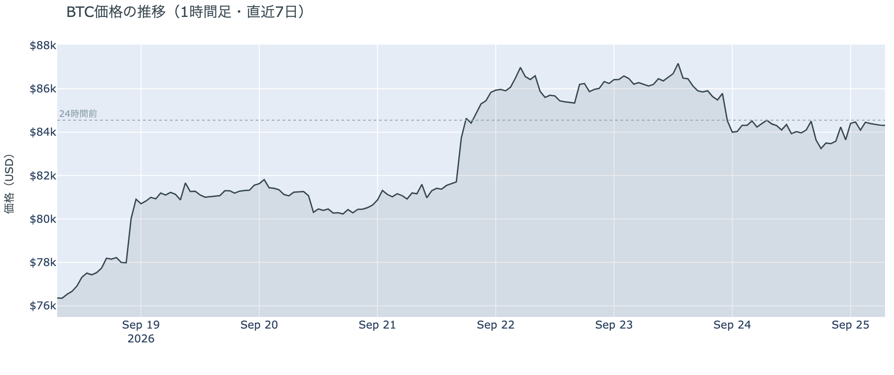

*図の見方: 1時間ごとの価格（日本時間）。水曜の夜に1段下がった線が、木曜はその高さのまま横に伸びています。*

* 朝7時5分の時点で約$84,344。24時間で−0.3%、値幅は$82,709〜$84,930の2.7%。1週間前と比べると+10.5%、1か月前と比べると+7.4%。
* 直近の確定した日足終値は9月23日の$84,378。
* Hyperliquid（＝オンチェーンの先物取引所）で見える清算は、この24時間で117件。ほぼ全部ロングで、9割が83,000ドル台、95%が木曜18時台の1時間に出た。116のアドレスに散らばり、最大の1件が全体の43%。

木曜日は、水曜の夜に1段下りた階段の上で、横ばいだった日です。動いたのは木曜18時台だけで、価格が$83,000台へ下がったところで多数のロングが清算されました。1件が全体の4割を占めましたが、残りは115のアドレスに散らばっています。清算のあと価格は$84,000台へ戻り、朝7時5分には24時間前とほぼ同じ水準です。

**図1-2 価格と50日・200日移動平均**

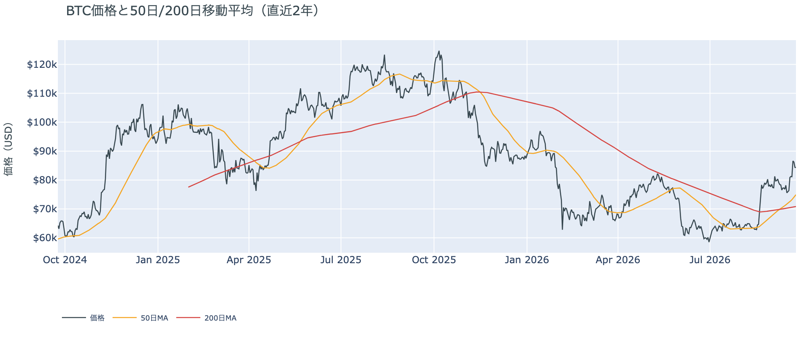

*図の見方: 2本の平均線の上下関係を見ます。50日線が200日線の上にあるのがゴールデンクロスです。*

* 50日線と200日線の差は約$4,073（5.8%）で、前日の$3,769からさらに開いた。
* 価格は50日線$74,924の約12.6%上。前日の13.2%から縮んだ。

ゴールデンクロス（＝50日線が200日線を上抜けること）の状態は17日目で、2本の線の差は開き続けています。価格が横ばいだった木曜も50日線のほうは上がったので、縮んだのは価格と50日線の距離だけです。

証券市場は木曜9月24日、S&P500が−0.02%の7,704.13でほぼ横ばい、金は−0.2%の$4,310、原油は+2.8%の$94.76、米10年債利回りは5.16%で、前日の5.11%からさらに上がりました。株と金は動かず、動いたのは原油と金利です。

## 2. なぜ動いたか：ビットコイン自身の需給か、外部環境か

**図2-1 ビットコインと株・金・原油の相対推移（起点＝100）**

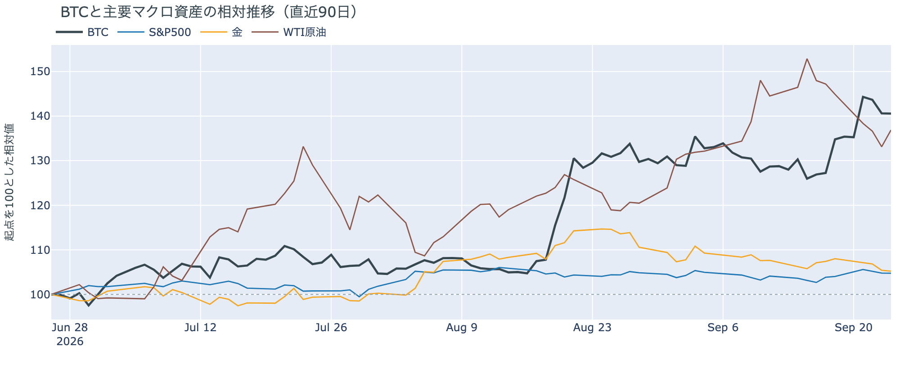

*図の見方: 同じ起点から何%動いたかで重ねたもの。線が同じ向きなら「一緒に動いた」、ビットコインだけ別の向きなら「自身の理由で動いた」と読みます。*

| この5営業日の動き（ビットコインは7日間） | 変化 |
|---|---:|
| ビットコイン | +10.5% |
| 金 | −2.0% |
| 米国株（S&P500） | +2.0% |
| 原油 | −7.0% |

* 木曜1日では、株が−0.02%、金が−0.2%で動かず、原油が+2.8%、米10年債利回りが5.11%から5.16%へ上がった。ビットコインは−0.3%で、株と金と同じく動かなかった。
* 建玉は95,983BTC。前日の98,480BTCからさらに減り、1週間では−8.7%。
* 資金調達率はプラスのまま。1日をならした年率は+2.32%で、短期金利（13週Tビル 4.07%）を引いた上乗せは−1.75pt。前日の−3.06ptからマイナス幅は縮んだが、2日続けて短期金利を下回っている。
* 直近30日の値動きの相関は、金が+0.67、S&P500が+0.44。

木曜日に価格が動かなかった理由は2つです。

1. 株と金が動かなかった。米10年債利回りがさらに上がり、原油も上がった夜でしたが、株も金も動かず、ビットコインも株と同じく動きませんでした。前日は「ビットコインは証券市場と一緒に動いている」と説明しました。水曜は株と同じ向きに下げ、木曜は株と同じく横ばいだったので、この説明は今日の数値と合っています。
2. ビットコイン自身の需給では、先物のロングの手仕舞いが続く一方で、ETFの買いも続いた。建玉（＝先物の未決済残高。証拠金で張っている人の量）は水曜に8%減ったあと木曜もさらに減り、直近30日で最も少ない水準です。資金調達率（＝ロングが払う金利。プラス＝ロングがショートより多い）の短期金利に対する上乗せはマイナスのままで、レバレッジ（＝元手より大きな金額を建てること）を掛けたロングが退く動きは、水曜の一晩で終わりませんでした。同じ木曜に確定した水曜分のETFは入り超です（図①-2）。証拠金で買っていた人が減り、現物を買う人が残った形で、先物の手仕舞いと現物の買いが同じ日に起きて、価格は動きませんでした。

外部環境では、9月24日の米中首脳会談で、11月に期限が来る関税の一時停止を来年1月10日まで延長すると発表されました。株はこの発表に動いていません。イランは国連で、最長60日の地域全体の停戦・ホルムズ海峡の段階的な再開・アメリカの海上封鎖の解除を組み合わせた案をアメリカに示し、受け入れの期限を「4〜5日」と切りました。アメリカは封鎖の解除を先にはしないと述べています。原油は木曜に+2.8%で、リスク資産全体の重しになりうる状況は続いています。ニューヨーク連銀のウィリアムズ総裁が年内にもう1回の利上げは「妥当」と述べ、10月のFOMC（＝米国の金利を決める会合）で利上げする織り込みは7割前後に上がりました。米10年債利回りが5.16%へ上がったのは、この見方が強まった結果として報じられています。

## 3. 市場参加者はいまどう見ているか

### ① アメリカの買い手は2%下げた水曜も買っていたが、ほかの国より高く払ってはいない

**図①-1 Coinbase Premium（アメリカとそれ以外の価格差・直近90日）**

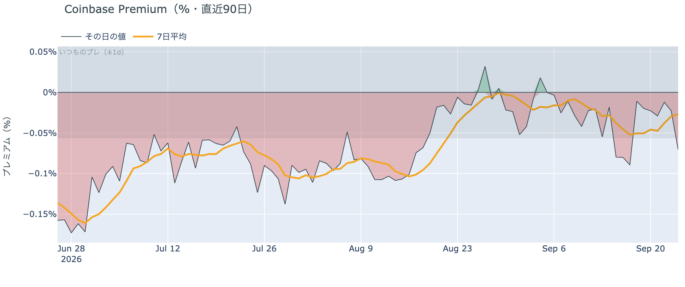

*図の見方: プラス＝アメリカで買いが強い。太線が1週間平均、細線がその日の値。薄い帯は「いつものブレの範囲」です。*

* Coinbase Premiumは1週間平均で−0.027%。先週の−0.052%からマイナス幅が縮み、ほぼゼロ。
* その日の値は−0.071%で、いつものブレの1.2倍と範囲の内側。

Coinbase Premium（＝アメリカとそれ以外の価格差）は、1週間平均でほぼゼロです。アメリカの買い手は、ほかの国より高い価格を払ってまでは買っていません。買っていること自体を示すのはETF（図①-2）で、Coinbase Premiumが示すのは、価格差が付いていないことです。

**図①-2 ETFの日ごとの資金の出入り（直近90日）**

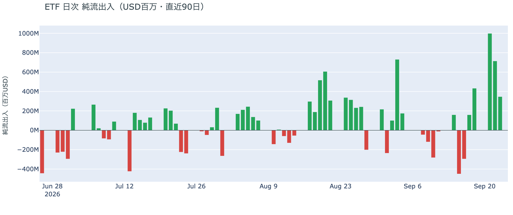

*図の見方: 入ったお金と出たお金の差。上に伸びれば入り超、下に伸びれば出超。*

| ETFの日ごとの出入り | 億ドル |
|---|---:|
| 9月18日 | +4.3 |
| 9月21日 | +10.0 |
| 9月22日 | +7.1 |
| 9月23日 | +3.5 |
| 直近7営業日の合計 | +23.6 |

* 入り超は確定分で5営業日連続。水曜分は火曜分の半分の規模。木曜分は集計途中。

アメリカの買い手は、2%下げた水曜も買っていました。前日は「水曜の下げの日にどう動いたかは、まだ数字が出ていない」と書きましたが、確定した水曜分は入り超で、5営業日続けて買っています。規模は月曜の3分の1に縮みましたが、下げた日に売りへ回ってはいません。

**図①-3 Fear & Greed（市場心理の指数・直近90日）**

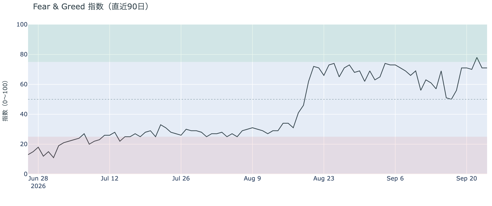

*図の見方: 0〜100で、50より上が「強欲」、下が「恐怖」。75より上は「極度の強欲」です。*

* 71の「強欲」。前日と同じ。1週間前は50、1か月前は74。

Fear & Greed（＝市場心理の指数）は前日と同じ71で、「強欲」のままです。水曜の下げのあとも市場心理は冷めておらず、1か月前と同じ水準で、価格の下げを怖がっている状態ではありません。

### ② 長期保有者は買値より17%高く手放し続けているが、量は1か月前の4割のまま

**図②-1 長期保有者の保有量の30日変化とSOPR（直近60日）**

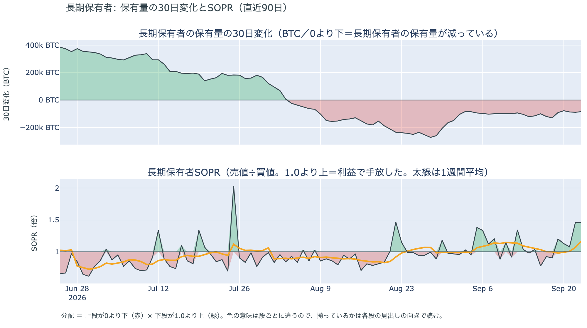

*図の見方: 上段は、長期保有者の保有量が30日でどれだけ増減したか。マイナス＝手放している。下段は長期保有者SOPRで、1より上なら利益で手放した。どちらも太線の1週間平均で読みます。*

| 9月23日時点 | 1週間平均 | 前の週の平均 |
|---|---:|---:|
| 長期保有者SOPR（1より上＝利益で手放した） | 1.17 | 1.03 |
| 長期保有者の保有量の30日変化（万BTC） | −9.7 | −10.5 |

* 減り方は1か月前（−24.3万BTC）の4割で、この2週間は−10万BTC前後で止まっている。
* 1年以上動いていないコインは全体の63.3%で、3か月で1.8pt増えた。売りに出てくるコインが少ない状態は続いている。

長期保有者（＝155日以上動かしていないコインの持ち主）は、利益の出ているコインを手放し続けています。長期保有者SOPR（＝長期保有者が動かしたコインの売値÷買値）で見ると、動かしたコインは平均して買値より17%高く手放されました。前の週の3%から利益の幅が広がったのは、この1週間で価格が1割上がった分です。保有量の30日変化がマイナスで、動いた分が利益側なので、これは分配（＝長期保有者からの放出）です。ただし量は増えておらず、価格が上がっても手放す量は1か月前の4割のままです。ETFや取引所が預かっている分を差し引いても、この規模と向きは変わりません。放出が増えないまま、1年以上動いていないコインの割合は増えているので、同じ規模の買いでも売りでも価格が動きやすい下地です。ビットコイン自身の需給の土台は、前日と変わっていません。

今日は、コインが最後に動いた価格の分布に大きな変化がなく、長く眠っていたコインが動いた記録もありません。マイナーの収入は平年並み（Puell Multiple（＝マイナー収入の平年比）が1週間平均で1.01）で、売りを急ぐ状況ではありません。

### ③ 先物：ロングの手仕舞いは水曜の一晩で終わらず、木曜も続いた

**図③-1 資金調達率と建玉（直近30日）**

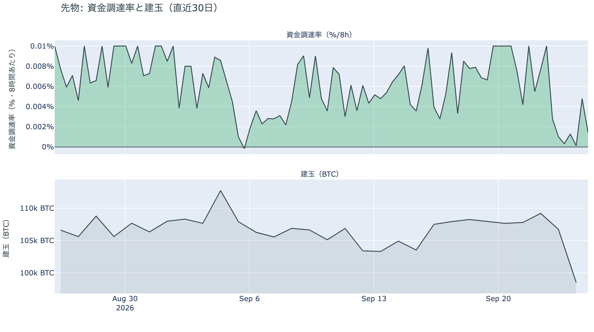

*図の見方: 上段は資金調達率（8時間ごと・日本時間）。プラスが続く＝ロングがショートより多い。下段は建玉。*

* 建玉は95,983BTC。前日の98,480BTCから2,497BTC減り、直近30日で最も少ない。水曜と合わせた2日で約1万1,000BTC減った。
* 短期金利に対する上乗せは−1.75pt。直近1か月の平均は+3.33ptで、マイナスだった日は1か月のうち15%。

ロングの手仕舞いは、木曜も続きました。資金調達率の1日をならした年率は+2.32%で、短期金利（13週Tビル 4.07%）を引いた上乗せは−1.75pt。ロングが払う金利は、ただ置いておくだけでもらえる短期金利を、2日続けて下回っています。前日は「月曜に積まれたロングが一晩で消えた」と説明しましたが、木曜は価格が動かないまま建玉がさらに減ったので、消えたのは月曜の分だけではなく、それより前から残っていたロングも手仕舞われています。清算されたのも木曜18時台のロングです（図1-1）。ロングへの傾きは無く、証拠金で買っている量が1か月でいちばん少ない状態で、今日の大きな満期を迎えます。

### ④ オプション：全部の満期でプットが高いまま今日の満期を迎え、「価格が上がる」に賭けた人たちは降りていない

オプションには2種類あります。コール（＝決めた価格で買う権利）とプット（＝決めた価格で売る権利）で、価格が上がればコールの価値が上がり、価格が下がればプットの価値が上がります。プットは「価格が下がったときの保険」として買われます。オプションを買う人は、その権利と引き換えに権利料（＝オプションを買う人が払う金額）を払います。

**図④-1 満期ごとのIV（年率%）**

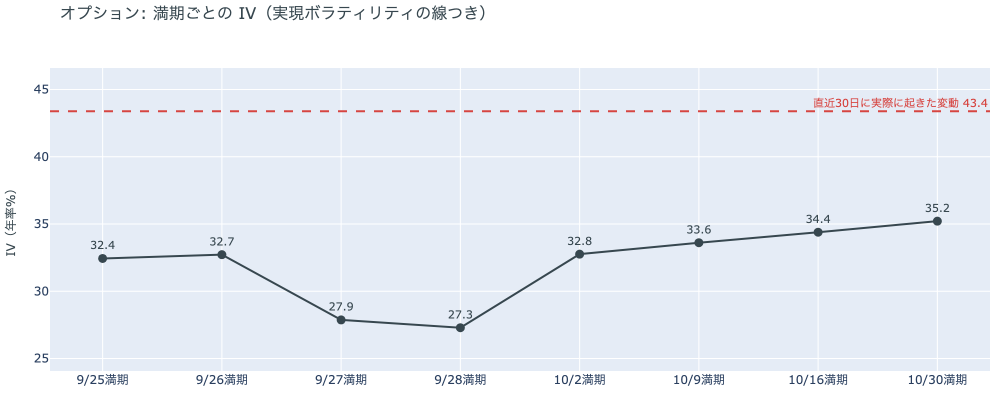

*図の見方: IVを満期ごとに並べたもの。点線は実現ボラティリティ。IVが点線より下なら、市場はこの先の値動きを過去の値動きより小さいと見ています。*

* IVは全体で35.8。前日の37.4から下がり、過去1年の下から9%の位置。実現ボラティリティは43.4。
* 満期ごとに見ると、いちばん高いのは10月30日の35.2。今日9月25日と明日の満期は32台、週末の満期は27台で、突出した満期は無い。

IV（＝オプション価格から逆算した、この先の値動きの幅の予想）は実現ボラティリティ（＝実際に起きた値動きの幅）より7.6pt低く、市場はこの先の値動きを過去の値動きより小さいと見ています。大きな満期の前日でもIVは下がり、過去1年の中で最も低い側にあるので、守りを固めている状態でも怖がっている状態でもありません。今日の満期のオプションの権利料に、ほかの満期に対する上乗せは乗っていません。満期の日に大きく動くとは見られていない形です。

**図④-2 満期ごとのプットとコールの差**

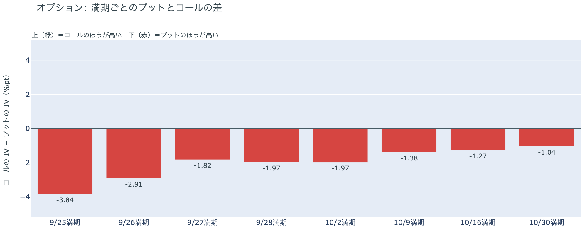

*図の見方: 満期ごとに、プットとコールのどちらが高く売れているか。ゼロより上ならコールのほうが高く、下ならプットのほうが高い。*

| 満期 | どちらが高いか |
|---|---|
| 9月25日 | プットがはっきり高い（2日目） |
| 9月26日 | プットが高い |
| 9月27日 | プットが高い |
| 9月28日 | プットが高い |
| 10月2日 | プットが高い |
| 10月9日 | プットが高い |
| 10月16日 | プットが高い |
| 10月30日 | プットが高い |

* 8つの満期すべてでプットのほうが高く、水曜に入れ替わってから2日目。最も差が大きいのは今日9月25日で、先の満期ほど差は小さい。

参加者は、水曜に全部の満期を「備える」側へ戻した値付けのまま、今日の満期を迎えています。プットが最もはっきり高いのは今日の満期で、10月以降の満期は差が小さいので、備えは今日の満期の前後に置かれ、その先は薄い形です。持ち高（図④-3）を見ると、減ったのはコールで、プットは少し増えています。権利料の値付けだけでなく、持ち高もわずかに備える側へ動いた1日でした。

**図④-3 9月25日満期の持ち高（権利の価格ごと）**

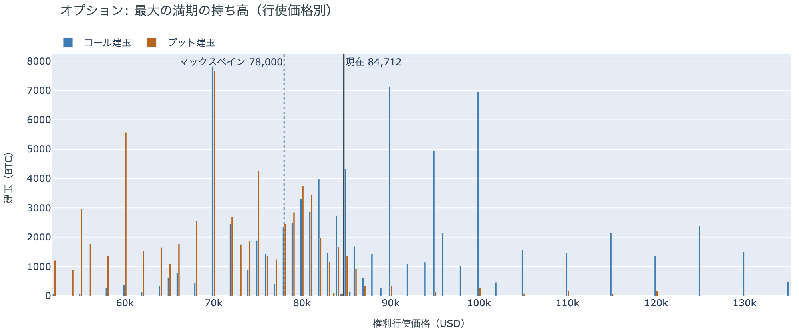

*図の見方: 青＝コール、橙＝プット。現値より上にコールが、下にプットが積まれるのが普通です。*

| 9月25日満期のオプション（価格は約$84,700） | 量（万BTC） | 意味 |
|---|---:|---|
| いまより高い価格のコール（決めた価格で買う権利） | 約5.5 | 「価格が上がる」に賭けた分 |
| いまより安い価格のプット（決めた価格で売る権利） | 約7.4 | 「価格が下がる」への保険 |
| うち、いまより15%以上高い価格のコール | 約3.0 | 大きな上げへの賭け |
| うち、いまより15%以上安い価格のプット | 約4.6 | 大きな下げへの保険 |

* 9月25日満期の持ち高は全部で170,931BTCで、全満期の34%。前日の181,995BTCから約1万1,000BTC減り、コールがプットの1.2倍（前日は1.4倍）。
* 持ち高が集まっている価格は、多い順に$85,000、$84,000、$90,000、$82,000。前日と同じ帯。

「価格が上がる」に賭けた人たちは、満期の前日も降りていません。持ち高は1日で約1万1,000BTC減りましたが、減ったのは主にいまより安い価格のコールで、いまより高い価格に残るコールの量は前日とほぼ同じです。いちばん厚いのは$90,000のコールで、この賭けが報われるには、今日17時の満期までに$90,000を超える必要があります。いまの価格はその約7%下で、持ち高が最も集まる$84,000〜$85,000の帯の中にあります。

## 4. 価格に影響しうる直近のイベント

予測ではなく、「次に市場が反応しうる材料」の案内です。オプション市場でプットが高いのは全部の満期で、最もはっきりしているのは今日17時の大きな満期です。一方で、ほかの満期に対する権利料の上乗せはどの満期にも乗っておらず、9月30日の物価統計も10月のFOMCも、大きく動く日とは値付けされていません。米10年債利回りは5.16%で、10月のFOMCで利上げする織り込みは7割前後まで上がっています。

| 日付 | イベント | 何に効くか |
|---|---|---|
| 9/25（金）17:00 | オプションの大きな満期（約17.1万BTC、全満期の34%） | 「価格が上がる」に賭けた人たちの期限。この満期でプットが最もはっきり高い |
| 9/27（日）〜28（月）ごろ | イランがアメリカに示した受け入れの期限。最長60日の地域全体の停戦・ホルムズ海峡の段階的な再開・海上封鎖の解除を組み合わせた案に「4〜5日」 | 原油 |
| 9/30（水）21:30 日本時間 | 米PCE物価（8月分。FRBが重視する物価統計） | 金利。10月のFOMCでもう1回利上げするかの材料 |
| 10/2（金）21:30 日本時間 | 米9月の雇用統計 | 金利 |
| 10/27（火）〜28（水） | FOMC。利上げの織り込みは7割前後で、前日の66%から上がった | 金利。10月30日の満期でプットが高いのはこの直後 |
| 日程未定 | 上院で9月15日に否決されたCLARITY法案（＝暗号資産の市場構造法案）の再採決があるかどうか。再審議の動議は残っている | 規制 |
| 日程未定 | 米下院本会議で、ビットコインの戦略準備を法律にする法案の採決（委員会は9月16日に可決） | 規制 |
| 2027/1/10 | 米中の関税の一時停止の新しい期限（9月24日の首脳会談で11月から延長） | 通商。株 |

## まとめ：木曜日の動きは何だったか

木曜日は、動かなかった日でした。米10年債利回りが5.16%へさらに上がり、原油も上がった夜に、株も金も動かず、ビットコインも$84,000台を保っています。ビットコイン自身の需給で動いたのは先物で、ロングの手仕舞いが水曜の一晩で終わらず木曜も続き、建玉は直近30日で最も少なくなりました。一方でアメリカの買い手は2%下げた水曜もETFで買っており、入り超は5営業日続いています。長期保有者は9月23日時点で買値より17%高く手放し続けていますが、量は1か月前の4割のままです。市場心理は「強欲」のまま動いていません。オプションは全部の満期でプットが高いまま今日17時の大きな満期を迎え、「価格が上がる」に賭けた人たちは降りていません。

---

*本稿は情報提供を目的としたものであり、投資助言ではありません。将来の価格動向を保証・示唆するものではなく、投資判断は各自の責任において行ってください。*
