# 四半期の大きな満期を値幅2.6%で通過して$83,000台 ― 清算されたのは大口のロング1件、9月29日までの満期はコールが高い側へ入れ替わり、資金調達率は3日続けて短期金利の下

**2026年9月26日**

金曜日は、四半期でいちばん大きなオプションの満期を、ほとんど動かずに通過した日です。原油が下げ、株と金が上がった夜に、ビットコインは$83,000〜$85,000の中にとどまり、朝7時5分の価格は約$83,851。動いたのは金曜21時台だけで、$84,000台で買い持ち（ロング）の大口1件が清算（＝証拠金不足で強制的に閉じられた取引）されました。満期が消えたあと、参加者は9月29日までの満期をコールが高い側へ値付けし直し、備えは10月2日以降の満期にだけ残しています。一方で先物では、資金調達率が3日続けて短期金利を下回り、証拠金で買う人は満期のあとも戻っていません。

（数値は9月26日7時5分（日本時間）までのデータに基づきます。価格・先物・オプションはその時点の値、市場心理は9月25日の確定値、オンチェーン（＝ブロックチェーン上の記録）は9月24日時点、ETF資金フローは9月24日の木曜分までで、金曜分はまだ集計途中です。証券市場の終値は9月25日時点です。オンチェーンの長期保有者の数値には、ETFや取引所が預かっている分も含まれます。オプションはDeribit（BTCオプションの大半を占める取引所）の全銘柄です。）

## 1. 何が起きたか

**図1-1 価格の推移（1時間足・直近7日）**

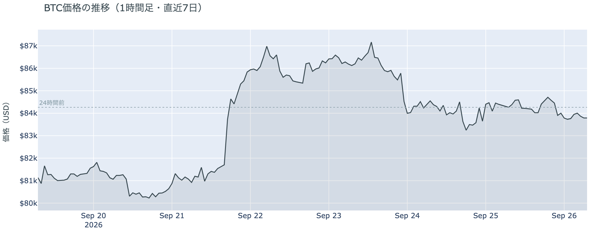

*図の見方: 1時間ごとの価格（日本時間）。水曜に1段下がった線が、木曜と金曜は$83,000〜$85,000の狭い幅で横に伸びています。*

* 朝7時5分の時点で約$83,851。24時間で−0.5%、値幅は$83,091〜$85,250の2.6%。1週間前と比べると+3.7%、1か月前と比べると+6.1%。
* 直近の確定した日足終値は9月24日の$84,385。
* Hyperliquid（＝オンチェーンの先物取引所）で見える清算は、この24時間で159件。ほぼ全部ロングで、9割以上が84,000ドル台、9割が金曜21時台の1時間に出た。95のアドレスに散らばるが、最大の1件が全体の85%。

金曜日は、四半期の大きな満期を通過しても値動きが増えなかった日です。日本時間17時の満期の前後で価格は$84,000台のまま動かず、動いたのは21時台だけでした。そこで$84,000台のロングが清算されましたが、中身は大口が1つ飛んだもので、多数が焼けたのではありません。清算のあとも価格は$83,000台後半で、朝7時5分には24時間前とほぼ同じ水準です。

**図1-2 価格と50日・200日移動平均**

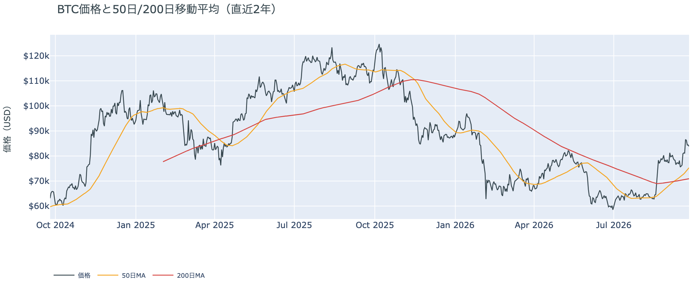

*図の見方: 2本の平均線の上下関係を見ます。50日線が200日線の上にあるのがゴールデンクロスです。*

* 50日線と200日線の差は約$4,388（6.2%）で、前日の$4,073からさらに開いた。
* 価格は50日線$75,317の約11.3%上。前日の12.6%から縮んだ。

ゴールデンクロス（＝50日線が200日線を上抜けること）の状態は18日目で、2本の線の差は開き続けています。価格が横ばいのあいだも50日線のほうは毎日上がっているので、縮んでいるのは価格と50日線の距離だけで、ゴールデンクロスの状態そのものは前日より強まっています。

証券市場は金曜9月25日、S&P500が+0.5%の7,743、金は+0.5%の$4,321、原油は−2.3%の$92.44、米10年債利回りは5.18%で、取引時間中には5.2%を超えて2007年以来の高さを付けました。株と金は上げ、原油は下げ、金利は上がっています。

## 2. なぜ動いたか：ビットコイン自身の需給か、外部環境か

**図2-1 ビットコインと株・金・原油の相対推移（起点＝100）**

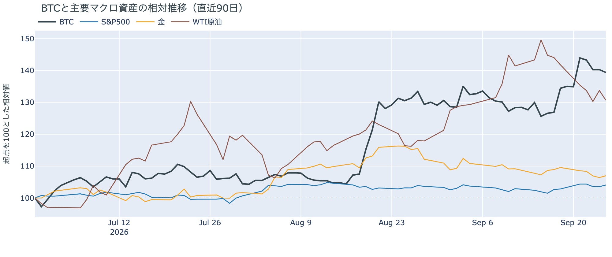

*図の見方: 同じ起点から何%動いたかで重ねたもの。線が同じ向きなら「一緒に動いた」、ビットコインだけ別の向きなら「自身の理由で動いた」と読みます。*

| この5営業日の動き（ビットコインは7日間） | 変化 |
|---|---:|
| ビットコイン | +3.7% |
| 金 | −2.4% |
| 米国株（S&P500） | +1.2% |
| 原油 | −7.8% |

* 金曜1日では、株が+0.5%、金が+0.5%、原油が−2.3%、米10年債利回りが5.16%から5.18%へ上がった。ビットコインは−0.5%で、株と金が上げた夜にわずかに下げた。
* 建玉は95,223BTC。前日の95,983BTCからさらに減り、1週間では−11.4%。
* 資金調達率はプラスのまま。1日をならした年率は+1.15%で、短期金利（13週Tビル 4.07%）を引いた上乗せは−2.92pt。前日の−1.75ptからマイナス幅が広がり、3日続けて短期金利を下回っている。
* 直近30日の値動きの相関は、金が+0.66、S&P500が+0.44。

金曜日に価格が動かなかった理由は2つです。

1. 四半期の大きな満期が、価格を動かす形にならなかった。約17万BTCのオプションが日本時間17時に消えましたが、満期の時点の価格は持ち高が最も集まっていた$84,000〜$85,000の帯の中にあり、コール側にもプット側にも大きく報われた人がいませんでした。満期をまたいで価格を動かす取引は出ていません。
2. 株と金が上げた夜に、ビットコインは先物のロングが戻らず、上げに付いていかなかった。建玉（＝先物の未決済残高。証拠金で張っている人の量）は3日続けて減り、資金調達率（＝ロングが払う金利。プラス＝ロングがショートより多い）の短期金利に対する上乗せは3日続けてマイナスです。レバレッジ（＝元手より大きな金額を建てること）を掛けたロングは、満期を通過しても戻っていません。同じ日に確定した9月24日分のETFは6営業日続けて入り超（図①-2）で、証拠金で買う人が減り、現物を買う人が残る形は木曜と同じです。

前日は「ビットコインは株と同じく動かなかった」と説明しました。金曜は株と金が上げたのにビットコインはわずかに下げたので、この日は証券市場と一緒に動いたのではなく、ビットコイン自身の需給、つまりロングが戻らないことで動かなかった日です。

外部環境では、イランのアラグチ外相が9月25日、国連で「条件が満たされれば7日でホルムズ海峡を開き、その後に交渉を再開する」という案を示しました。条件は制裁の緩和・原油輸出の制限解除・凍結資金へのアクセスで、9月23日に示した最長60日の停戦案を前倒しした形です。アメリカは協議を「前向きで建設的」としつつ急がない姿勢で、海上封鎖の解除を先にはしないという立場は変えていません。原油は金曜に−2.3%の$92.44で、この5営業日で7.8%下げましたが、$90台にとどまっており、リスク資産全体の重しになりうる状況は続いています。米10年債利回りは取引時間中に5.2%を超え、10月のFOMC（＝米国の金利を決める会合）で利上げする織り込みは6〜7割です。

## 3. 市場参加者はいまどう見ているか

### ① アメリカの買い手は6営業日続けて買っているが、勢いは日ごとに細り、金曜はほかの国より安く付けた

**図①-1 Coinbase Premium（アメリカとそれ以外の価格差・直近90日）**

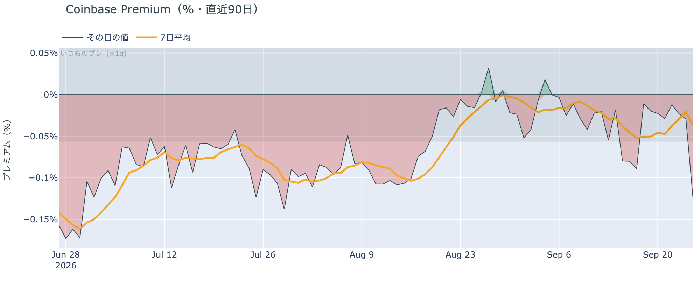

*図の見方: プラス＝アメリカで買いが強い。太線が1週間平均、細線がその日の値。薄い帯は「いつものブレの範囲」です。*

* Coinbase Premiumは1週間平均で−0.037%。先週の−0.051%からマイナス幅は縮み、ほぼゼロ。
* その日の値は−0.124%で、いつものブレの2.2倍。過去300日の下から13%の位置。

金曜のCoinbase Premium（＝アメリカとそれ以外の価格差）は、いつものブレを超えてマイナスに振れました。1週間平均ではほぼゼロで、アメリカの買い手がほかの国より高く払ってまでは買っていない状態が続いていますが、金曜1日はアメリカのほうが安く付いています。ETFの入り超が細っている（図①-2）のと同じ向きで、アメリカの買い手の勢いは月曜より落ちています。

**図①-2 ETFの日ごとの資金の出入り（直近90日）**

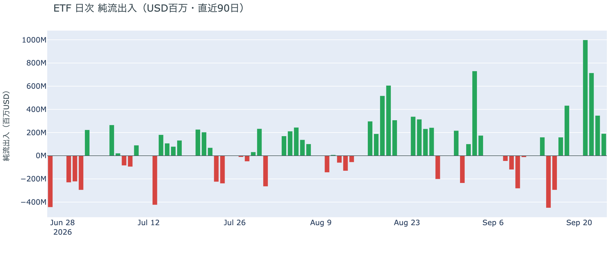

*図の見方: 入ったお金と出たお金の差。上に伸びれば入り超、下に伸びれば出超。*

| ETFの日ごとの出入り | 億ドル |
|---|---:|
| 9月21日 | +10.0 |
| 9月22日 | +7.1 |
| 9月23日 | +3.5 |
| 9月24日 | +1.9 |
| 直近7営業日の合計 | +25.5 |

* 入り超は確定分で6営業日連続。月曜から4日続けて、規模は前の日のおよそ半分に縮んでいる。金曜分は集計途中。

アメリカの買い手は6営業日続けて買っていますが、勢いは日ごとに細っています。木曜分の+1.9億ドルは月曜の5分の1です。前日は「2%下げた水曜も買っていた」と書きました。木曜分も入り超なので、下げた日に売りへ回っていないという説明は今日の数値と合っています。ただし月曜に「戻った」と書いた勢いは、金曜の時点では残っていません。

**図①-3 Fear & Greed（市場心理の指数・直近90日）**

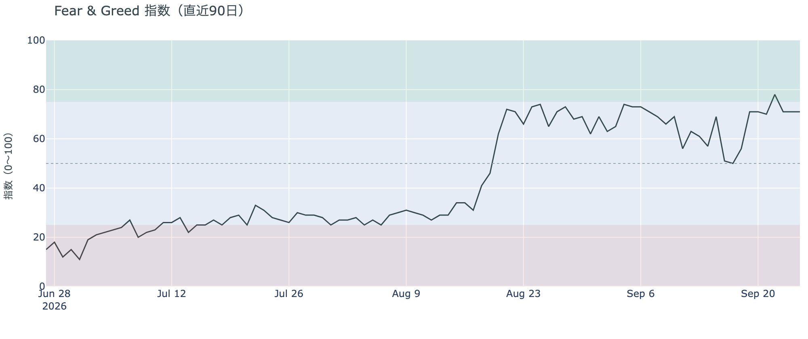

*図の見方: 0〜100で、50より上が「強欲」、下が「恐怖」。75より上は「極度の強欲」です。*

* 71の「強欲」。前日と同じで、4日続けて71。1週間前は56、1か月前は65。

Fear & Greed（＝市場心理の指数）は71の「強欲」のままです。大きな満期を通過しても市場心理は動かず、1週間前の56から15pt上がった水準を保っています。買い手の勢いが細っても、価格の下げを怖がっている状態ではありません。

### ② 長期保有者の分配は続いているが、手放す量は1か月前の3分の1に縮んだ

**図②-1 長期保有者の保有量の30日変化とSOPR（直近60日）**

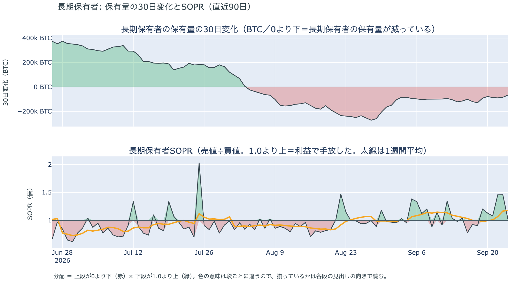

*図の見方: 上段は、長期保有者の保有量が30日でどれだけ増減したか。マイナス＝手放している。下段は長期保有者SOPRで、1より上なら利益で手放した。どちらも太線の1週間平均で読みます。*

| 9月24日時点 | 1週間平均 | 前の週の平均 |
|---|---:|---:|
| 長期保有者SOPR（1より上＝利益で手放した） | 1.18 | 1.00 |
| 長期保有者の保有量の30日変化（万BTC） | −9.0 | −10.8 |

* 減り方は1か月前（−25.0万BTC）の3分の1強。9月24日1日の値は−6.7万BTCで、この1か月で最も小さい。
* 1年以上動いていないコインは全体の63.3%で、3か月で1.8pt増えた。売りに出てくるコインが少ない状態は続いている。

長期保有者（＝155日以上動かしていないコインの持ち主）は、利益の出ているコインを手放し続けています。長期保有者SOPR（＝長期保有者が動かしたコインの売値÷買値）で見ると、動かしたコインは平均して買値より18%高く手放されました。前の週はちょうど買値並みで、利益の幅が広がったのはこの1週間で価格が1割近く上がった分です。保有量の30日変化がマイナスで、動いた分が利益側なので、これは分配（＝長期保有者からの放出）です。ただし量は増えておらず、むしろ縮んでいます。ETFや取引所が預かっている分を差し引いても、この規模と向きは変わりません。放出が細るなかで1年以上動いていないコインの割合は増えているので、同じ規模の買いでも売りでも価格が動きやすい下地です。ビットコイン自身の需給の土台は、前日と変わっていません。

今日は、コインが最後に動いた価格の分布に大きな変化がなく、長く眠っていたコインが動いた記録もありません。マイナーの収入は平年並み（Puell Multiple（＝マイナー収入の平年比）が1週間平均で1.03）で、売りを急ぐ状況ではありません。

### ③ 先物：満期を通過してもロングは戻らず、資金調達率は3日続けて短期金利の下

**図③-1 資金調達率と建玉（直近30日）**

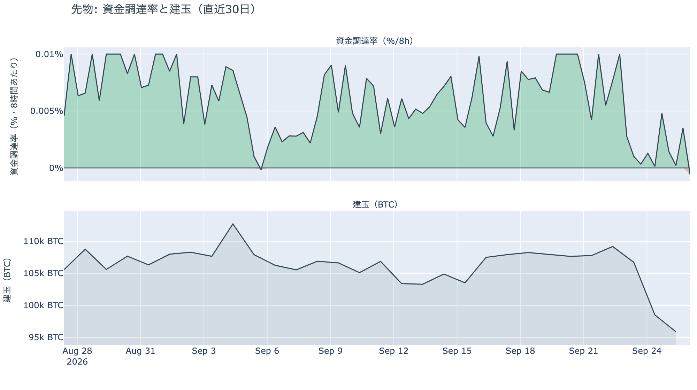

*図の見方: 上段は資金調達率（8時間ごと・日本時間）。プラスが続く＝ロングがショートより多い。下段は建玉。*

* 建玉は95,223BTC。前日の95,983BTCから760BTC減り、直近30日で最も少ない水準を更新した。水曜・木曜の2日で約1万1,000BTC減ったのに比べ、金曜の減り方は小さい。
* 短期金利に対する上乗せは−2.92pt。直近1か月の平均は+3.03ptで、マイナスだった日は1か月のうち2割弱。今日はその1か月でいちばん低い側（最小−3.06pt）に近い。

満期を通過しても、ロングは戻りませんでした。資金調達率の1日をならした年率は+1.15%で、短期金利（13週Tビル 4.07%）を引いた上乗せは−2.92pt。ロングが払う金利が、ただ置いておくだけでもらえる短期金利を下回るのは3日目で、マイナス幅は日ごとに広がっています。前日は「消えたのは月曜の分だけではなく、それより前から残っていたロングも手仕舞われている」と説明しました。金曜は建玉の減り方が水曜・木曜の10分の1以下に縮んだので、手仕舞いはほぼ出尽くしています。ただし新しくロングを建てる人もおらず、証拠金で買っている量は1か月でいちばん少ないままです。清算されたのも金曜21時台のロングでした（図1-1）。ロングへの傾きは無く、先物の参加者は満期のあとも様子を見る側に残っています。

### ④ オプション：大きな満期を通過して9月29日までの満期はコールが高い側へ入れ替わり、備えは10月2日以降に残った

オプションには2種類あります。コール（＝決めた価格で買う権利）とプット（＝決めた価格で売る権利）で、価格が上がればコールの価値が上がり、価格が下がればプットの価値が上がります。プットは「価格が下がったときの保険」として買われます。オプションを買う人は、その権利と引き換えに権利料（＝オプションを買う人が払う金額）を払います。

**図④-1 満期ごとのIV（年率%）**

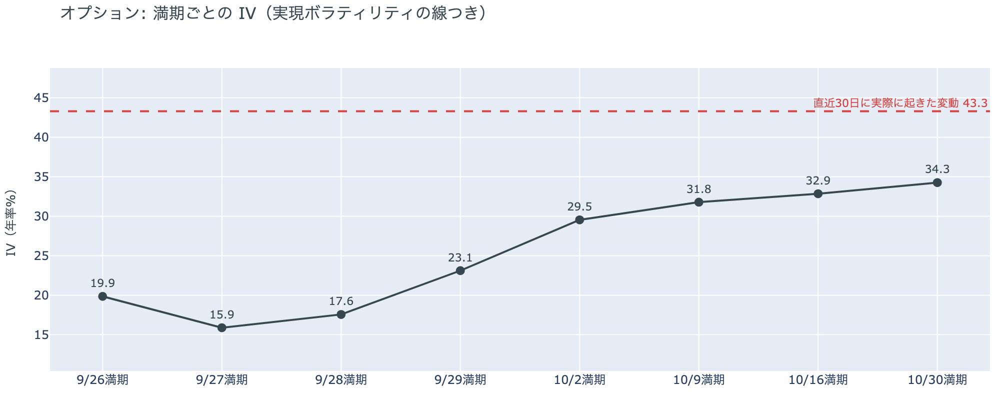

*図の見方: IVを満期ごとに並べたもの。点線は実現ボラティリティ。IVが点線より下なら、市場はこの先の値動きを過去の値動きより小さいと見ています。*

* IVは全体で36.0。前日の35.8とほぼ同じで、過去1年の下から4%の位置。実現ボラティリティは43.3。
* 満期ごとに見ると、今日9月26日の満期が19.9、27日が15.9、28日が17.6、29日が23.1で、10月2日から先は29〜34。前日は9月26日の満期が32台だった。

IV（＝オプション価格から逆算した、この先の値動きの幅の予想）は実現ボラティリティ（＝実際に起きた値動きの幅）より7.3pt低く、市場はこの先の値動きを過去の値動きより小さいと見ています。過去1年で最も低い側にあり、守りを固めている状態でも怖がっている状態でもありません。四半期の大きな満期を通過して、9月29日までの満期のIVは前日の32台から15〜23へ下がりました。今日17時に満期が来るオプションの権利料には、週末の満期に対するわずかな上乗せが乗っています。満期の前後で少しは動くと見ている人がいるからですが、その差は4ptで、その先の週末は10月以降の満期の半分ほどの値動きしか見込まれていません。参加者は月末までを、10月以降よりはっきり静かな区間と値付けしています。

**図④-2 満期ごとのプットとコールの差**

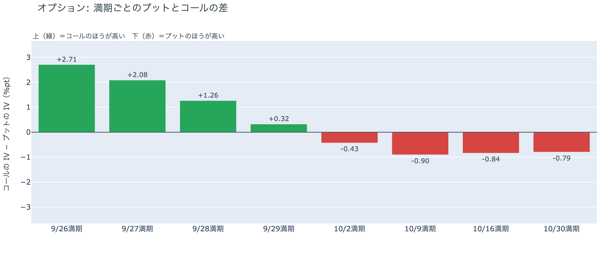

*図の見方: 満期ごとに、プットとコールのどちらが高く売れているか。ゼロより上ならコールのほうが高く、下ならプットのほうが高い。*

| 満期 | どちらが高いか |
|---|---|
| 9月26日 | コールがはっきり高い（前日はプットが高かった） |
| 9月27日 | コールが高い（前日はプットが高かった） |
| 9月28日 | コールが高い（前日はプットが高かった） |
| 9月29日 | わずかにコールが高い |
| 10月2日 | プットが高い |
| 10月9日 | プットが高い |
| 10月16日 | プットが高い |
| 10月30日 | プットが高い |

* 前日は8つの満期すべてでプットが高かった。9月25日の満期が消え、9月29日までの4つの満期がコールが高い側へ入れ替わった。プットのほうが高くなる最初の満期は10月2日。

参加者は、大きな満期を通過した金曜に、月末までの満期を「荒れない」側へ値付けし直しました。前日は「備えは今日の満期の前後に置かれ、その先は薄い」と説明しました。その満期が消えると、手前の満期はコールが高い側へ戻り、10月2日以降にプットが高い形だけが残ったので、備えの置き場は前日の説明のとおりでした。いま参加者は9月29日までは荒れないと値付けし、備えを10月2日以降の満期に置いています。10月2日は米雇用統計の日で、10月30日の満期は10月27〜28日のFOMCの直後です。「短期は荒れない、10月から先は備える」型に戻っています。

**図④-3 12月25日満期の持ち高（権利の価格ごと）**

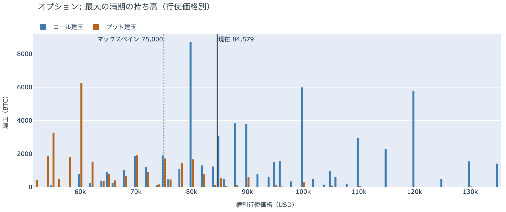

*図の見方: 青＝コール、橙＝プット。現値より上にコールが、下にプットが積まれるのが普通です。*

| 12月25日満期のオプション（価格は約$84,600） | 量（万BTC） | 意味 |
|---|---:|---|
| いまより高い価格のコール（決めた価格で買う権利） | 約5.1 | 「価格が上がる」に賭けた分 |
| いまより安い価格のプット（決めた価格で売る権利） | 約4.3 | 「価格が下がる」への保険 |
| うち、いまより15%以上高い価格のコール | 約3.5 | 大きな上げへの賭け |
| うち、いまより15%以上安い価格のプット | 約3.5 | 大きな下げへの保険 |

* 9月25日の満期が消え、いちばん大きな満期は12月25日に移った。持ち高は全部で118,795BTCで、全満期の34%。コールがプットの1.7倍。
* 建玉が厚い行使価格は、コールが$80,000（約8,700BTC）・$100,000（約6,000BTC）・$120,000（約5,800BTC）、プットが$60,000（約6,300BTC）・$40,000（約4,900BTC）。
* 全満期で持ち高が集まっている価格は、多い順に$84,000（全体の17%）、$90,000、$85,000。

「価格が上がる」に賭けた人たちの次の期限は12月25日で、賭けは$100,000と$120,000のコールに集まっています。この賭けが報われるには、12月25日までに$100,000を超える必要があり、いまの価格はその18%下です。一方でいちばん厚い$80,000のコールはいまの価格より下にあり、すでに権利の価値がある状態です。プットは$60,000と$40,000に厚く、いまの価格から3割〜5割下に大きな下げへの保険が置かれています。大きな上げへの賭けと大きな下げへの保険がほぼ同じ量なので、12月までに大きく動くとすればどちらか、を持ち高は決めきっていません。いまの価格は、全満期で持ち高が最も集まる$84,000〜$85,000の帯の中にあります。

## 4. 価格に影響しうる直近のイベント

予測ではなく、「次に市場が反応しうる材料」の案内です。オプション市場が備えを置いているのは10月2日以降の満期で、9月29日までの満期にはプットの備えは無く、コールのほうが高くなっています。10月2日は米雇用統計の日、10月30日の満期は10月27〜28日のFOMCの直後です。米10年債利回りは5.18%で、10月のFOMCで利上げする織り込みは6〜7割です。

| 日付 | イベント | 何に効くか |
|---|---|---|
| 9/30（水）21:30 日本時間 | 米PCE物価（8月分。FRBが重視する物価統計） | 金利。10月のFOMCでもう1回利上げするかの材料 |
| 9/30（水） | 米会計年度末。つなぎ予算は上下両院を通過し、大統領の署名待ち | 署名されれば10月1日からの政府閉鎖は回避され、統計の公表が止まらない |
| 10/2（金）ごろ | イランが9月25日に示した「7日でホルムズ海峡を開き、その後に交渉を再開する」案の7日目。アメリカは急がない姿勢で、海上封鎖の解除を先にはしない立場 | 原油 |
| 10/2（金）21:30 日本時間 | 米9月の雇用統計 | 金利。この日の満期からプットが高い |
| 10/27（火）〜28（水） | FOMC。利上げの織り込みは6〜7割 | 金利。10月30日の満期でプットが高いのはこの直後 |
| 日程未定 | 上院で9月15日に否決されたCLARITY法案（＝暗号資産の市場構造法案）の再採決があるかどうか。再審議の動議は残っている | 規制 |
| 日程未定 | 米下院本会議で、ビットコインの戦略準備を法律にする法案の採決（委員会は9月16日に可決） | 規制 |
| 12/25（金）17:00 | オプションの最も大きな満期（約11.9万BTC、全満期の34%） | 「価格が上がる」に賭けた人たちの次の期限 |
| 2027/1/10 | 米中の関税の一時停止の新しい期限（9月24日の首脳会談で11月から延長） | 通商。株 |

## まとめ：金曜日の動きは何だったか

金曜日は、四半期の大きな満期をほとんど動かずに通過した日でした。原油が下げ、株と金が上げた夜に、ビットコインは$83,000〜$85,000の中にとどまっています。ビットコイン自身の需給で変わったのはオプションの値付けで、9月29日までの満期がコールの高い側へ入れ替わり、備えは10月2日以降の満期にだけ残りました。先物ではロングが戻らず、資金調達率は3日続けて短期金利を下回り、建玉は直近30日で最も少ないままです。アメリカの買い手は6営業日続けて買っていますが勢いは日ごとに細り、金曜はCoinbase Premiumがいつものブレを超えてマイナスに振れました。長期保有者は9月24日時点で買値より18%高く手放し続けていますが、量は1か月前の3分の1です。市場心理は「強欲」のまま動いていません。

---

*本稿は情報提供を目的としたものであり、投資助言ではありません。将来の価格動向を保証・示唆するものではなく、投資判断は各自の責任において行ってください。*
