# 満期明けの土曜は$84,000台で値幅0.7% ― 清算は0件、ロングは戻らず資金調達率は4日続けて短期金利の下、市場心理は「極度の強欲」の一歩手前

**2026年9月27日**

土曜日は、ほとんど動かなかった日です。24時間の値幅は$83,778〜$84,325の0.7%で、朝7時5分の価格は約$84,227。証券市場が閉まっている24時間に、ビットコインも$84,000の線の上下を行き来しただけでした。清算（＝証拠金不足で強制的に閉じられた取引）は0件。先物では買い持ち（ロング）が戻らず、資金調達率は4日続けて短期金利（＝ドルを米国の短期国債で持つだけで受け取れる金利）を下回っていますが、その差は金曜より縮みました。オプションの値付けは金曜のまま変わらず、参加者は月末までを「荒れない」側に置き、備えは10月2日以降の満期にだけ残しています。

（数値は9月27日7時5分（日本時間）までのデータに基づきます。価格・先物・オプションはその時点の値、市場心理は9月26日の確定値、オンチェーン（＝ブロックチェーン上の記録）は9月25日時点、ETF資金フローは9月25日の金曜分までです。証券市場の終値は9月25日時点で、週末のため更新がありません。オンチェーンの長期保有者の数値には、ETFや取引所が預かっている分も含まれます。オプションはDeribit（BTCオプションの大半を占める取引所）の全銘柄です。）

## 1. 何が起きたか

**図1-1 価格の推移（1時間足・直近7日）**

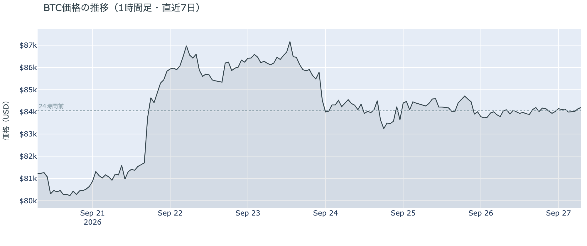

*図の見方: 1時間ごとの価格（日本時間）。水曜に1段下がった線が、木曜から土曜まで$84,000の点線のまわりで横に伸び、土曜はその幅がいちばん狭くなっています。*

* 朝7時5分の時点で約$84,227。24時間で+0.2%、値幅は0.7%で、金曜の2.6%の4分の1。1週間前と比べると+3.7%、1か月前と比べると+4.9%。
* 直近の確定した日足終値は9月25日の$84,093。
* Hyperliquid（＝オンチェーンの先物取引所）で見える清算は、この24時間で0件。金曜は大口1件を含む159件だった。

土曜日は、この1週間でいちばん静かな24時間でした。金曜21時台に$84,000台のロングの大口1件が清算されたあと、土曜は清算が1件も出ていません。価格は朝7時5分の時点で24時間前とほぼ同じ$84,000台で、月曜の急騰から水曜の下げまでの$80,000〜$87,000の往復が、木曜から3日続けて$84,000の周りに収まっています。

**図1-2 価格と50日・200日移動平均**

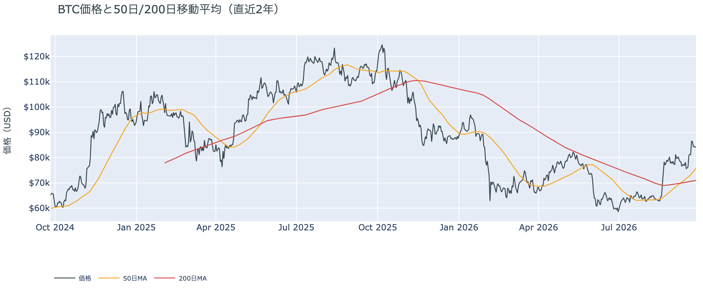

*図の見方: 2本の平均線の上下関係を見ます。50日線が200日線の上にあるのがゴールデンクロスです。*

* 50日線と200日線の差は約$4,707（6.6%）で、前日の$4,388からさらに開いた。
* 価格は50日線$75,708の約11.3%上で、前日と同じ。

ゴールデンクロス（＝50日線が200日線を上抜けること）の状態は19日目で、2本の線の差は開き続けています。土曜は価格が動かず、50日線だけが上がった日です。価格と50日線の距離は前日と同じ11%で、ゴールデンクロスの状態は前日より強まっています。

証券市場は週末で閉まっています。金曜9月25日の終値は、S&P500が+0.5%の7,743、金は+0.5%の$4,321、原油は−2.3%の$92.41、米10年債利回りは5.18%でした。株と金は上げ、原油は下げ、金利は上がった形のまま週末に入っています。

## 2. なぜ動いたか：ビットコイン自身の需給か、外部環境か

**図2-1 ビットコインと株・金・原油の相対推移（起点＝100）**

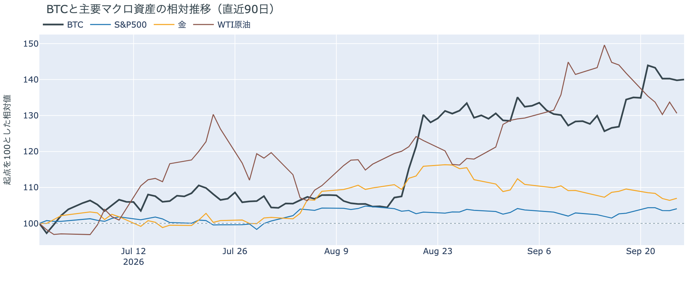

*図の見方: 同じ起点から何%動いたかで重ねたもの。線が同じ向きなら「一緒に動いた」、ビットコインだけ別の向きなら「自身の理由で動いた」と読みます。*

| この5営業日の動き（ビットコインは7日間） | 変化 |
|---|---:|
| ビットコイン | +3.7% |
| 金 | −2.3% |
| 米国株（S&P500） | +1.2% |
| 原油 | −7.9% |

* 証券市場が閉まっている24時間で、ビットコインは0.7%しか動かなかった。金曜までの5営業日で、ビットコインは株と同じ向きに上げ、金と原油とは逆の向きだった。
* 建玉は94,295BTC。前日の95,223BTCから928BTC減り、1週間では−11.8%。
* 資金調達率はプラスのまま。1日をならした年率は+1.88%で、短期金利（13週Tビル 4.07%）を引いた上乗せは−2.19pt。前日の−2.92ptからマイナス幅は縮んだが、4日続けて短期金利を下回っている。
* 直近30日の値動きの相関は、金が+0.66、S&P500が+0.45。

土曜日に価格が動かなかった理由は2つです。

1. 証券市場が閉まっていて、金利と原油からの影響が止まっていた。この1週間のビットコインは、月曜に株と一緒に上げ、水曜は米10年債利回りが5.1%へ跳ねた夜に下げ、金曜は株と金が上げても付いていきませんでした。その金利も原油も、週末は動きません。
2. 先物のロングが戻らず、手仕舞いも出尽くした。建玉（＝先物の未決済残高。証拠金で張っている人の量）は土曜も減りましたが、減り方は水曜・木曜の10分の1以下です。資金調達率（＝ロングが払う金利。プラス＝ロングがショートより多い）の短期金利に対する上乗せは4日続けてマイナスのままで、新しくロングを建てる人はいません。同時に、金曜分まで確定したETFは7営業日続けて入り超（図①-2）で、証拠金で買う人が減り、現物を買う人が残る形は木曜・金曜と同じです。

前日は「金曜は証券市場と一緒に動いたのではなく、ロングが戻らないことで動かなかった」と説明しました。土曜は証券市場が閉まっているので比べる相手がありませんが、ロングが戻らず建玉が減り続けている形は同じで、前日の説明は今日の数値と合っています。

外部環境では、トランプ大統領が9月26日、イランが国連で示した「7日でホルムズ海峡を開き、その後に交渉を再開する」案について「その内容では受け入れられない」と述べました。一方でイランのペゼシュキアン大統領は、米CBSのインタビュー（9月27日放送）で、長期の停戦の交渉に入れば国連の核査察官の受け入れを認めると述べ、案そのものは取り下げていません。ホルムズ海峡の商業船の通航は止まったままで、原油は金曜の$92.41から週末は動いていませんが、$90台にとどまっており、リスク資産全体の重しになりうる状況は続いています。米10年債利回りは5.18%で、10月のFOMC（＝米国の金利を決める会合）で利上げする織り込みは7割です。

## 3. 市場参加者はいまどう見ているか

### ① アメリカの買い手は7営業日続けて買っているが、勢いは月曜の7分の1に細った

**図①-1 Coinbase Premium（アメリカとそれ以外の価格差・直近90日）**

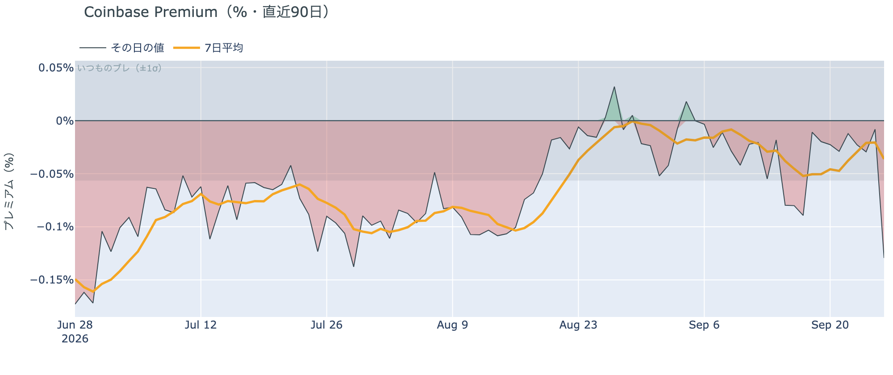

*図の見方: プラス＝アメリカで買いが強い。太線が1週間平均、細線がその日の値。薄い帯は「いつものブレの範囲」です。*

* Coinbase Premiumは1週間平均で−0.036%。先週の−0.050%からマイナス幅は縮み、ほぼゼロ。
* 土曜の集計途中の値は−0.13%で、いつものブレの2.3倍。確定した金曜9月25日の値は−0.01%。

前日は「金曜1日はアメリカのほうが安く付いた」と書きました。しかし確定した金曜の値はほぼゼロに戻り、金曜の朝に見えていたマイナスは集計途中の値でした。土曜の−0.13%も同じく集計途中の値なので、読むのは1週間平均のほうです。Coinbase Premium（＝アメリカとそれ以外の価格差）の1週間平均はほぼゼロで、アメリカの買い手がほかの国より高く払ってまでは買っていない状態が続いています。

**図①-2 ETFの日ごとの資金の出入り（直近90日）**

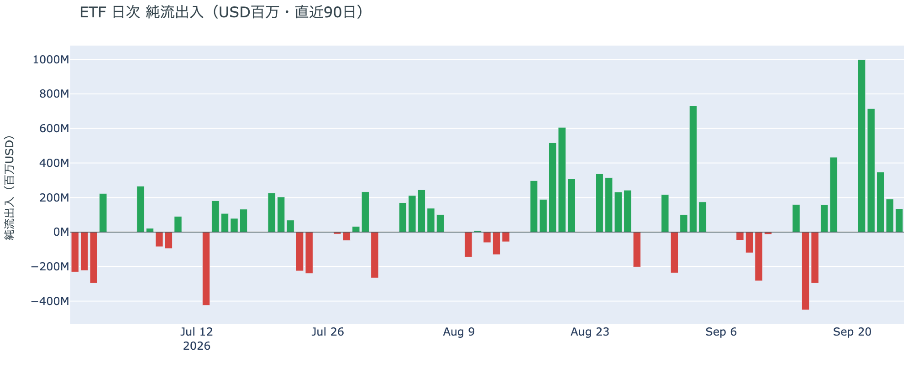

*図の見方: 入ったお金と出たお金の差。上に伸びれば入り超、下に伸びれば出超。*

| ETFの日ごとの出入り | 億ドル |
|---|---:|
| 9月22日 | +7.1 |
| 9月23日 | +3.5 |
| 9月24日 | +1.9 |
| 9月25日 | +1.3 |
| 直近7営業日の合計 | +29.8 |

* 入り超は確定分で7営業日連続。月曜の+10.0億ドルから金曜まで、毎日前の日より小さい。

アメリカの買い手は、金曜まで7営業日続けて買っています。ただし金曜分の+1.3億ドルは月曜の7分の1で、勢いは日ごとに細っています。前日は「下げた日に売りへ回っていない」と説明しました。金曜分も入り超なので、この説明は今日の数値と合っています。売りに回ってはいないが、買いの勢いは週の初めの姿ではない、が今朝の読みです。

**図①-3 Fear & Greed（市場心理の指数・直近90日）**

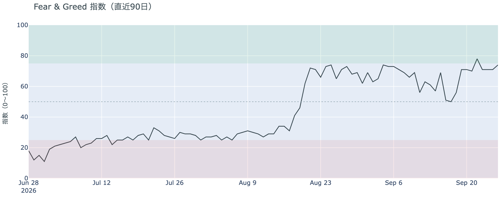

*図の見方: 0〜100で、50より上が「強欲」、下が「恐怖」。75より上は「極度の強欲」です。*

* 74の「強欲」。前日の71から3pt上がり、火曜の78以来の高さ。1週間前は71、1か月前も71。

Fear & Greed（＝市場心理の指数）は74で、「極度の強欲」の境目75の一歩手前まで上がりました。価格が土曜に動かなかったのに市場心理は上がっていて、買いの勢いが細っても価格の下げを怖がっている人はいない状態です。

### ② 長期保有者の分配は続いているが、手放す量は1か月前の3分の1のまま

**図②-1 長期保有者の保有量の30日変化とSOPR（直近60日）**

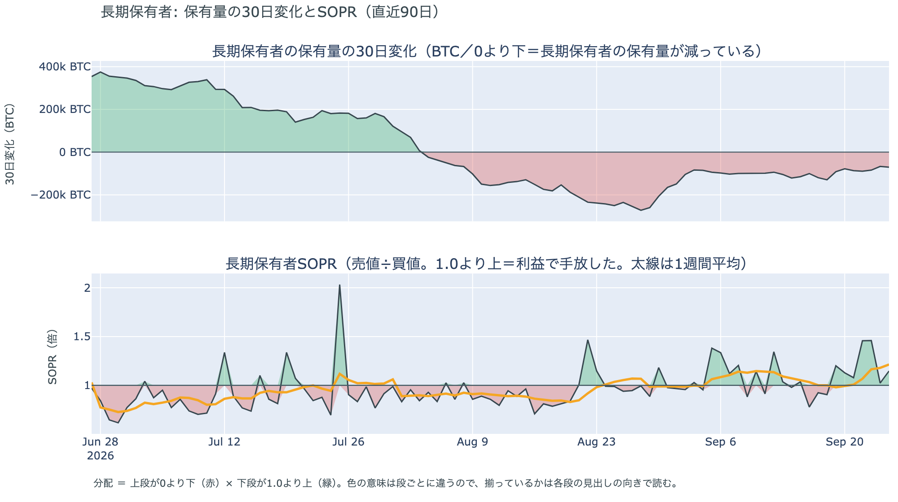

*図の見方: 上段は、長期保有者の保有量が30日でどれだけ増減したか。マイナス＝手放している。下段は長期保有者SOPRで、1より上なら利益で手放した。どちらも太線の1週間平均で読みます。*

| 9月25日時点 | 1週間平均 | 前の週の平均 |
|---|---:|---:|
| 長期保有者SOPR（1より上＝利益で手放した） | 1.21 | 1.00 |
| 長期保有者の保有量の30日変化（万BTC） | −8.1 | −11.2 |

* 減り方は1か月前（−23.5万BTC）の3分の1。9月25日1日の値は−7.1万BTCで、金曜に書いた9月24日の−6.7万BTCと並んでこの1か月で最も小さい側。
* 1年以上動いていないコインは全体の63.3%で、3か月で1.7pt増えた。売りに出てくるコインが少ない状態は続いている。

長期保有者（＝155日以上動かしていないコインの持ち主）は、利益の出ているコインを手放し続けています。長期保有者SOPR（＝長期保有者が動かしたコインの売値÷買値）で見ると、動かしたコインは平均して買値より21%高く手放されました。前の週はちょうど買値並みだったので、利益の幅が広がったのは月曜からの上げで価格が1割近く上がった分です。保有量の30日変化がマイナスで、動いた分が利益側なので、これは分配（＝長期保有者からの放出）です。ただし量は増えておらず、1か月前の3分の1に縮んだまま変わっていません。ETFや取引所が預かっている分を差し引いても、この規模と向きは変わりません。放出が細るなかで1年以上動いていないコインの割合は増えているので、同じ規模の買いでも売りでも価格が動きやすい下地です。ビットコイン自身の需給の土台は、前日と変わっていません。

今日は、コインが最後に動いた価格の分布に大きな変化がなく、長く眠っていたコインが動いた記録もありません。マイナーの収入は平年並み（Puell Multiple（＝マイナー収入の平年比）が1週間平均で1.01）で、売りを急ぐ状況ではありません。

### ③ 先物：ロングは戻らないが、手仕舞いは出尽くした

**図③-1 資金調達率と建玉（直近30日）**

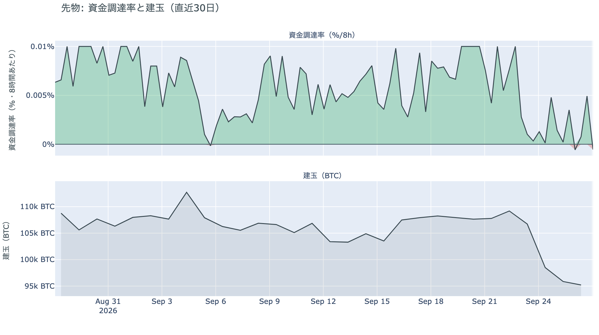

*図の見方: 上段は資金調達率（8時間ごと・日本時間）。プラスが続く＝ロングがショートより多い。下段は建玉。*

* 建玉は94,295BTC。前日の95,223BTCから928BTC減り、直近30日で最も少ない水準を更新した。減り方は金曜の760BTCと同じくらいで、水曜・木曜の2日で減った約1万1,000BTCの10分の1以下。
* 短期金利に対する上乗せは−2.19pt。直近1か月の平均は+2.76ptで、マイナスだった日は1か月のうち2割。
* 資金調達率は金曜から土曜にかけてゼロ付近を行き来し、この30日で初めて一時マイナスに触れた。

ロングは土曜も戻っていません。資金調達率の1日をならした年率は+1.88%で、短期金利（13週Tビル 4.07%）を引いた上乗せは−2.19pt。ロングが払う金利が短期金利を下回るのは4日目ですが、マイナス幅は前日の−2.92ptから縮みました。前日は「手仕舞いはほぼ出尽くした」と説明しました。土曜の建玉の減り方は金曜と同じ小ささで、その説明は今日の数値と合っています。ロングを新しく建てる人はまだおらず、証拠金で買っている量は1か月でいちばん少ないままです。清算が0件だったのも、焼かれるほどのロングが残っていないことの裏返しです。先物の参加者は、大きな満期を通過したあとの週末を、様子を見る側で過ごしています。ロングへの傾きは弱まったままで、過熱ではありません。

### ④ オプション：月末までは荒れない、10月2日から先は備える、の値付けが土曜も続いた

オプションには2種類あります。コール（＝決めた価格で買う権利）とプット（＝決めた価格で売る権利）で、価格が上がればコールの価値が上がり、価格が下がればプットの価値が上がります。プットは「価格が下がったときの保険」として買われます。オプションを買う人は、その権利と引き換えに権利料（＝オプションを買う人が払う金額）を払います。

**図④-1 満期ごとのIV（年率%）**

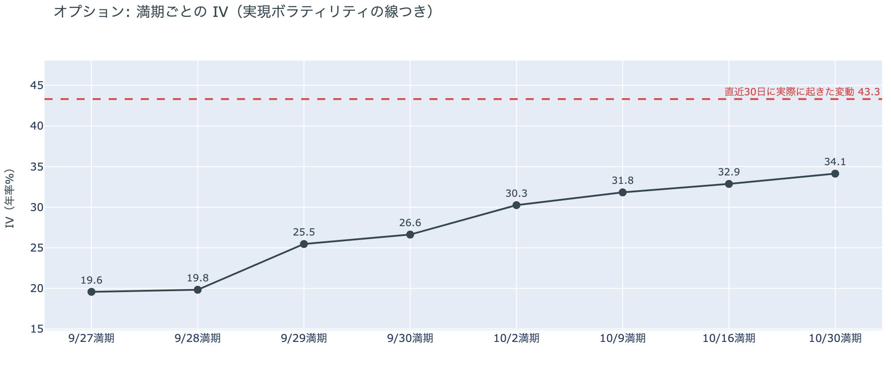

*図の見方: IVを満期ごとに並べたもの。点線は実現ボラティリティ。IVが点線より下なら、市場はこの先の値動きを過去の値動きより小さいと見ています。*

* IVは全体で34.6。前日の36.0から下がり、過去1年の下から4%の位置。実現ボラティリティは43.3。
* 満期ごとに見ると、今日9月27日と28日の満期が20前後、29日が25.5、新しく立った30日の満期が26.6で、10月2日から先は30〜34。手前ほど低く先ほど高い平常の形で、突出した満期は無い。

IV（＝オプション価格から逆算した、この先の値動きの幅の予想）は実現ボラティリティ（＝実際に起きた値動きの幅）より8.7pt低く、市場はこの先の値動きを過去の値動きより小さいと見ています。過去1年で最も低い側にあり、守りを固めている状態でも怖がっている状態でもありません。特定の満期の権利料にだけ乗る上乗せもありません。週末に満期が来るオプションのIVは10月以降の満期の6割ほどで、参加者は月末までを、10月以降よりはっきり静かな区間と値付けしています。

**図④-2 満期ごとのプットとコールの差**

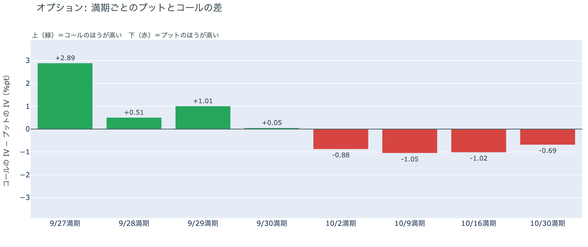

*図の見方: 満期ごとに、プットとコールのどちらが高く売れているか。ゼロより上ならコールのほうが高く、下ならプットのほうが高い。*

| 満期 | どちらが高いか |
|---|---|
| 9月27日 | コールがはっきり高い |
| 9月28日 | コールが高い |
| 9月29日 | コールが高い |
| 9月30日 | ほぼ差なし（新しく立った満期） |
| 10月2日 | プットが高い |
| 10月9日 | プットが高い |
| 10月16日 | プットが高い |
| 10月30日 | プットが高い |

* 前日と同じ形。プットのほうが高くなる最初の満期は10月2日で、それより手前の満期はコールが高い。

参加者は、金曜に値付けし直した「月末までは荒れない、10月2日から先は備える」の形を、土曜もそのまま保っています。前日は「9月29日までは荒れないと値付けし、備えを10月2日以降の満期に置いている」と説明しました。土曜に新しく立った9月30日の満期もプットとコールにほぼ差が無く、備えの置き場は前日の説明のとおりです。10月2日は米雇用統計の日で、10月30日の満期は10月27〜28日のFOMCの直後です。

**図④-3 12月25日満期の持ち高（権利の価格ごと）**

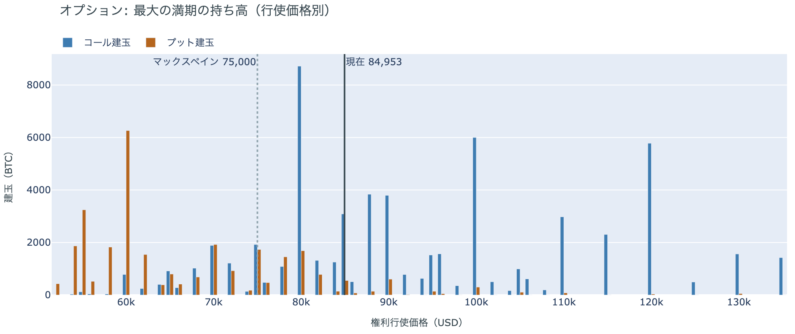

*図の見方: 青＝コール、橙＝プット。現値より上にコールが、下にプットが積まれるのが普通です。*

| 12月25日満期のオプション（価格は約$84,950） | 量（万BTC） | 意味 |
|---|---:|---|
| いまより高い価格のコール（決めた価格で買う権利） | 約5.1 | 「価格が上がる」に賭けた分 |
| いまより安い価格のプット（決めた価格で売る権利） | 約4.3 | 「価格が下がる」への保険 |
| うち、いまより15%以上高い価格のコール | 約3.5 | 大きな上げへの賭け |
| うち、いまより15%以上安い価格のプット | 約3.6 | 大きな下げへの保険 |

* いちばん大きな満期は12月25日で、持ち高は全部で118,800BTC、全満期の34%。コールがプットの1.7倍で、前日と同じ形。
* 建玉が厚い行使価格は、コールが$80,000（約8,700BTC）・$100,000（約6,000BTC）・$120,000（約5,800BTC）、プットが$60,000（約6,300BTC）・$40,000（約4,900BTC）。
* 全満期で持ち高が集まっている価格は、多い順に$84,000（全体の16%）、$90,000、$85,000。

「価格が上がる」に賭けた人たちは、週末も降りていません。賭けは$100,000と$120,000のコールに集まっていて、報われるには12月25日までに$100,000を超える必要があります。いまの価格はその18%下です。いちばん厚い$80,000のコールはいまの価格より下にあり、すでに権利の価値がある状態です。プットは$60,000と$40,000に厚く、いまの価格から3割〜5割下に大きな下げへの保険が置かれています。大きな上げへの賭けと大きな下げへの保険がほぼ同じ量なので、12月までに大きく動くとすればどちらか、を持ち高は決めきっていません。いまの価格は、全満期で持ち高が最も集まる$84,000〜$85,000の帯の中にあります。

## 4. 価格に影響しうる直近のイベント

予測ではなく、「次に市場が反応しうる材料」の案内です。オプション市場が備えを置いているのは10月2日以降の満期で、9月30日までの満期にはプットの備えはありません。10月2日は米雇用統計の日、10月30日の満期は10月27〜28日のFOMCの直後です。米10年債利回りは5.18%で、10月のFOMCで利上げする織り込みは7割です。

| 日付 | イベント | 何に効くか |
|---|---|---|
| 9/30（水）21:30 日本時間 | 米PCE物価（8月分。FRBが重視する物価統計） | 金利。10月のFOMCでもう1回利上げするかの材料 |
| 10/2（金）ごろ | イランが9月25日に示した「7日でホルムズ海峡を開き、その後に交渉を再開する」案の7日目。トランプ大統領は9月26日に「受け入れられない」と述べ、イラン側は案を取り下げていない | 原油 |
| 10/2（金）21:30 日本時間 | 米9月の雇用統計 | 金利。この日の満期からプットが高い |
| 10/2（金） | 米上院が中間選挙後まで休会に入る。9月15日に否決されたCLARITY法案（＝暗号資産の市場構造法案）の再採決があるとすればこの前 | 規制 |
| 10/27（火）〜28（水） | FOMC。利上げの織り込みは7割 | 金利。10月30日の満期でプットが高いのはこの直後 |
| 日程未定 | 米下院本会議で、ビットコインの戦略準備を法律にする法案の採決（委員会は9月16日に可決。下院は選挙期間で休会中） | 規制 |
| 12/25（金）17:00 | オプションの最も大きな満期（約11.9万BTC、全満期の34%） | 「価格が上がる」に賭けた人たちの次の期限 |
| 2027/1/10 | 米中の関税の一時停止の新しい期限（9月24日の首脳会談で11月から延長） | 通商。株 |

## まとめ：土曜日の動きは何だったか

土曜日は、証券市場が閉まっている24時間に、ビットコインも$84,000台で動かなかった日でした。清算は0件で、先物のロングは戻らず、建玉は30日で最も少ない水準をわずかに更新しましたが、手仕舞いの勢いは金曜に続いて小さいままです。資金調達率は4日続けて短期金利を下回っていますが、その差は縮みました。アメリカの買い手は金曜まで7営業日続けて買っていて、勢いは月曜の7分の1に細っています。長期保有者は9月25日時点で買値より21%高く手放し続けていますが、量は1か月前の3分の1のまま変わっていません。オプションの参加者は「月末までは荒れない、10月2日から先は備える」の値付けを土曜も保ち、市場心理は「極度の強欲」の一歩手前まで上がっています。ビットコイン自身の需給は、金曜から変わっていません。

---

*本稿は情報提供を目的としたものであり、投資助言ではありません。将来の価格動向を保証・示唆するものではなく、投資判断は各自の責任において行ってください。*
