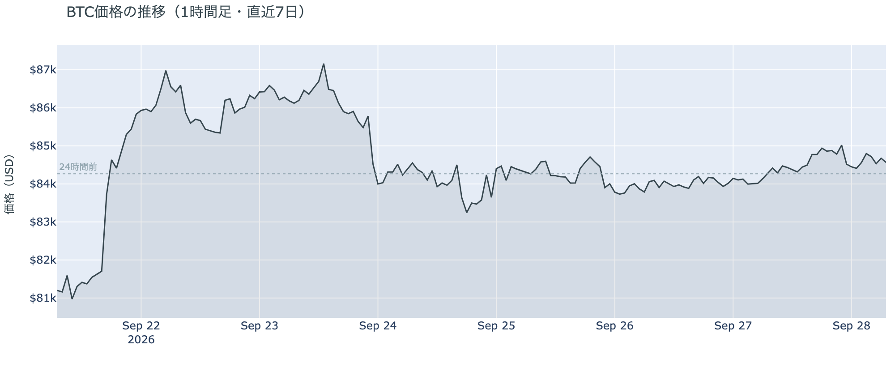
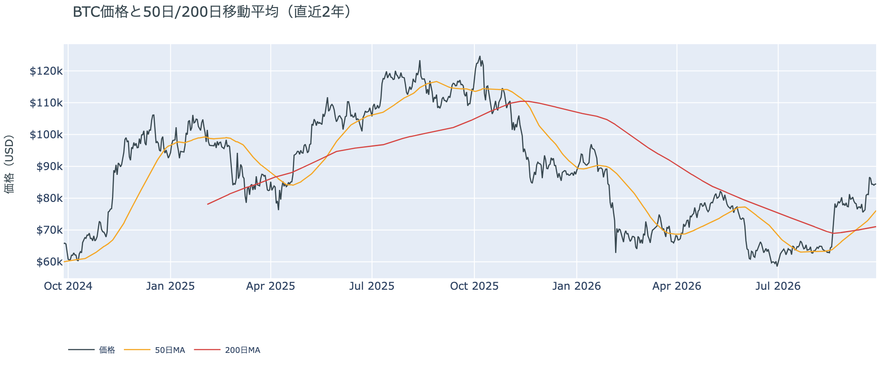
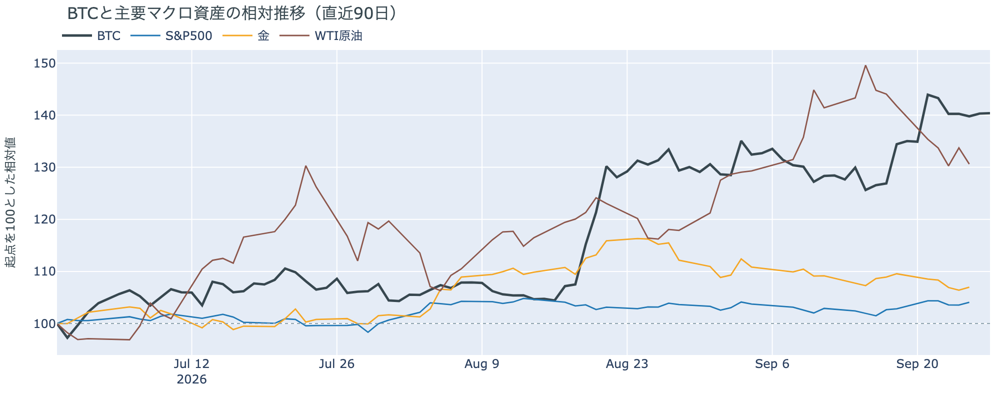
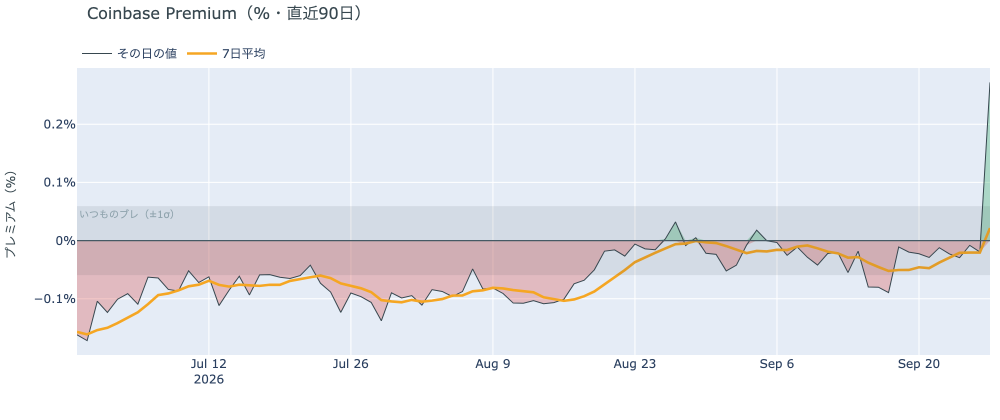
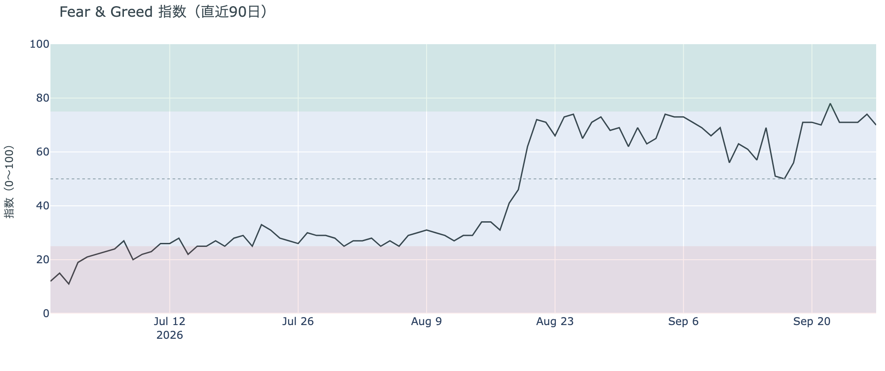
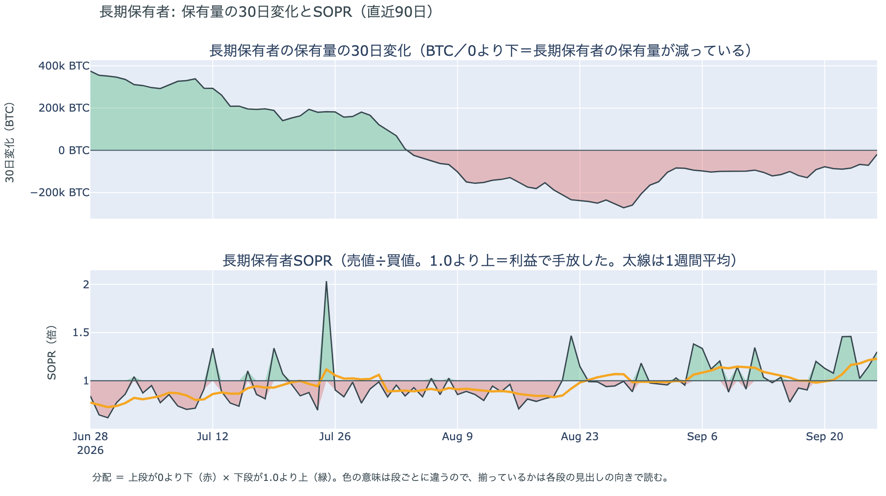
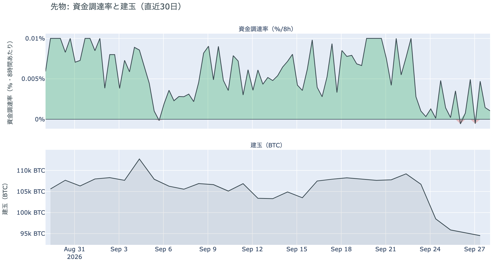
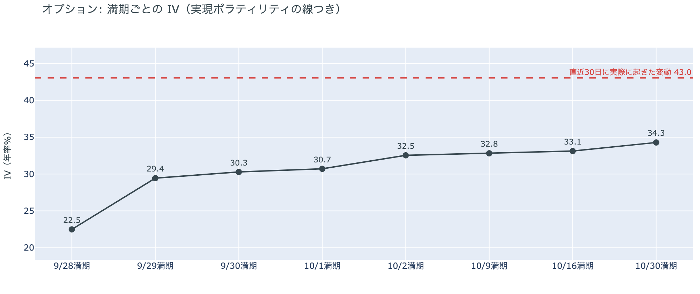
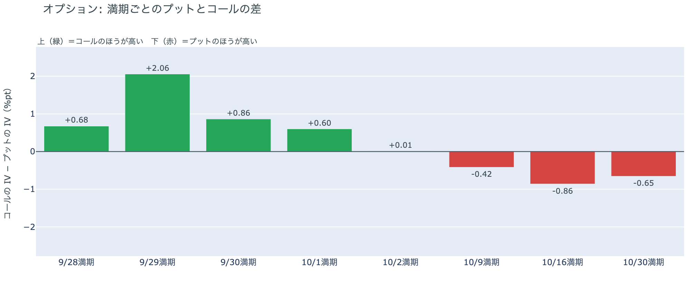
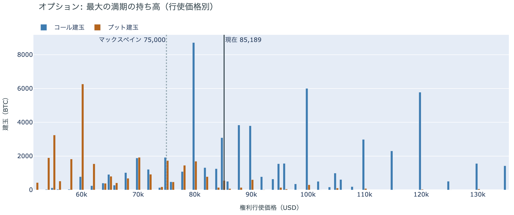

# 日曜も$84,000台で値幅1.1% ― プットが高い満期は10月2日から10月9日へずれた

**2026年9月28日**

日曜日も、ほとんど動かなかった日です。24時間の値幅は$84,234〜$85,158の1.1%で、朝7時5分の価格は約$84,458。証券市場が閉まっている48時間の2日目も、ビットコインは$84,000台にとどまりました。動いたのは夕方の1時間だけで、価格が一度$85,000を超えたときに、売り持ち（ショート）が多数まとめて清算（＝証拠金不足で強制的に閉じられた取引）されました。先物では買い持ち（ロング）がわずかに戻り、資金調達率はプラスに戻りましたが、短期金利（＝ドルを米国の短期国債で持つだけで受け取れる金利）を下回るのは5日目です。オプションでは、前日まで10月2日満期に置かれていたプットの備えが外れ、プットが高い最初の満期は10月9日になりました。

（数値は9月28日7時5分（日本時間）までのデータに基づきます。価格・先物・オプションはその時点の値、市場心理は9月27日の確定値、オンチェーン（＝ブロックチェーン上の記録）は9月26日時点、ETF資金フローは9月25日の金曜分までです。証券市場の終値は9月25日時点で、週末のため更新がありません。オンチェーンの長期保有者の数値には、ETFや取引所が預かっている分も含まれます。オプションはDeribit（BTCオプションの大半を占める取引所）の全銘柄です。）

## 1. 何が起きたか

**図1-1 価格の推移（1時間足・直近7日）**

*図の見方: 1時間ごとの価格（日本時間）。木曜から$84,000の点線のまわりで横に伸びてきた線が、日曜の夕方に一度だけ$85,000を超え、そのあと点線の近くへ戻っています。*

* 朝7時5分の時点で約$84,458。24時間で+0.2%、値幅は1.1%で、土曜の0.7%より少し広い。1週間前と比べると+4.1%、1か月前と比べると+8.5%。
* 直近の確定した日足終値は9月26日の$84,417。
* Hyperliquid（＝オンチェーンの先物取引所）で見える清算は、この24時間で68件、すべてショート。最大の1件でも全体の26%で、大口1件ではなく多数に分かれている。集中したのは日曜18時台で、価格帯は$84,000台。

日曜日は、土曜に続いて静かな24時間でした。動いたのは夕方の1時間で、価格が$85,000を超えたところで、下がる側に張っていたショートが多数まとめて清算されました。大口が1つ飛んだのではなく、小さな持ち高が68件焼かれた形で、この上げはショートの清算を伴っています。価格はその後$84,000台に戻り、朝7時5分の時点では24時間前とほぼ同じです。

**図1-2 価格と50日・200日移動平均**

*図の見方: 2本の平均線の上下関係を見ます。50日線が200日線の上にあるのがゴールデンクロスです。*

* 50日線と200日線の差は約$5,030（7.1%）で、前日の$4,707からさらに開いた。
* 価格は50日線$76,103の約11.0%上で、前日の11.3%からわずかに縮んだ。

ゴールデンクロス（＝50日線が200日線を上抜けること）の状態は20日目で、2本の線の差は開き続けています。日曜は価格が動かず、50日線だけが上がった日です。価格と50日線の距離は11%で、ゴールデンクロスの状態は前日から強まったまま変わっていません。

証券市場は週末で閉まっています。金曜9月25日の終値は、S&P500が+0.5%の7,743、金は+0.5%の$4,321、原油は−2.3%の$92.41、米10年債利回りは5.18%でした。株と金は上げ、原油は下げ、金利は上がった形のまま週明けを迎えます。

## 2. なぜ動いたか：ビットコイン自身の需給か、外部環境か

**図2-1 ビットコインと株・金・原油の相対推移（起点＝100）**

*図の見方: 同じ起点から何%動いたかで重ねたもの。線が同じ向きなら「一緒に動いた」、ビットコインだけ別の向きなら「自身の理由で動いた」と読みます。*

| この5営業日の動き（ビットコインは7日間） | 変化 |
|---|---:|
| ビットコイン | +4.1% |
| 金 | −2.3% |
| 米国株（S&P500） | +1.2% |
| 原油 | −7.9% |

* 証券市場が閉まっている土曜・日曜の48時間で、ビットコインの値幅は0.7%と1.1%。金曜までの5営業日で、ビットコインは株と同じ向きに上げ、金と原油とは逆の向きだった。
* 建玉は94,624BTC。前日の94,295BTCから329BTC増えたが、1週間では−12.2%。
* 資金調達率はプラスに戻った。1日をならした年率は+2.63%で、短期金利（13週Tビル 4.07%）を引いた上乗せは−1.44pt。金曜の−2.92pt、土曜の−2.19ptから3日続けてマイナス幅が縮んだ。

日曜日に価格がほとんど動かなかった理由は2つです。

1. 証券市場が閉まっていて、金利と原油からの影響が止まっていた。先週のビットコインは、月曜に株と一緒に上げ、水曜は米10年債利回りが5.1%へ跳ねた夜に下げました。その金利も原油も、週末は動きません。
2. 先物のロングが、まだわずかしか戻っていない。建玉（＝先物の未決済残高。証拠金で張っている人の量）は日曜に増えましたが、増えた量は1週間で減った約1万3,000BTCの3%に満たない。資金調達率（＝ロングが払う金利。プラス＝ロングがショートより多い）はプラスに戻りましたが、短期金利を引いた上乗せはマイナスのままで、新しくロングを建てる人は少ない。

夕方の小さな上げは、ショートの清算を伴い、建玉がわずかに増え、資金調達率がプラスに戻る、という先物の持ち高の動きと一緒に起きています。ビットコイン自身の需給の中の小さな動きで、外部環境に押されたものではありません。前日は「ロングは戻らないが、手仕舞いは出尽くした」と説明しました。日曜は建玉が減らずに増えたので、前日の説明は今日の数値と合っています。

外部環境では、週末に新しい動きがありました。トランプ大統領は9月26日、イランが国連で示した「7日でホルムズ海峡を開き、その後に交渉を再開する」案を「受け入れられない」と述べました。イランのアラグチ外相は27日、条件は緩めず、仲介国のカタール・パキスタン・オマーンを通じた正式な回答を待つと述べています。イランのメディアは、トランプ大統領の発言の数時間後にホルムズ海峡のケシュム島付近で爆発があったと報じました。海峡の商業船の通航は止まったままです。原油は週末に取引が無く、金曜終値の$92.41のまま週明けを迎えます。$90台の原油と5.18%の米10年債利回りは、リスク資産全体の重しになりうる状況です。10月のFOMC（＝米国の金利を決める会合）で利上げする織り込みは7割で、金曜から変わっていません。

## 3. 市場参加者はいまどう見ているか

### ① アメリカの買い手は7営業日続けて買っていて、日曜は集計途中の値でアメリカのほうが高く付いた

**図①-1 Coinbase Premium（アメリカとそれ以外の価格差・直近90日）**

*図の見方: プラス＝アメリカで買いが強い。太線が1週間平均、細線がその日の値。薄い帯は「いつものブレの範囲」です。*

* Coinbase Premiumは1週間平均で+0.022%。先週の−0.046%からプラスへ転じた。
* 日曜の集計途中の値は+0.27%で、いつものブレの4.6倍。この300日で最も高い。確定した土曜9月26日の値は−0.02%。

Coinbase Premium（＝アメリカとそれ以外の価格差）は、日曜の集計途中の値で、この300日で最も大きなプラスになりました。いつものブレの4.6倍なので、日次の値も材料になります。ただし集計途中の値です。前日の朝に見えていた土曜の−0.13%が確定では−0.02%に戻ったように、今日の値も確定で変わりえます。1週間平均がプラスへ転じたのも、ほぼこの日曜の1点が作ったものです。確定した金曜・土曜の値はほぼゼロで、アメリカの買い手がほかの国より高く払ってまでは買っていない状態が続いたあと、日曜に初めてアメリカのほうが高く付いた、が今朝の読みです。

**図①-2 ETFの日ごとの資金の出入り（直近90日）**

*図の見方: 入ったお金と出たお金の差。上に伸びれば入り超、下に伸びれば出超。*

| ETFの日ごとの出入り | 億ドル |
|---|---:|
| 9月21日 | +10.0 |
| 9月22日 | +7.1 |
| 9月23日 | +3.5 |
| 9月24日 | +1.9 |
| 9月25日 | +1.3 |
| 直近7営業日の合計 | +29.8 |

* 週末なので新しい確定分は無い。入り超は確定分で7営業日連続。
* 直近7営業日の合計は、図の90日でいちばん大きい。

アメリカの買い手は、金曜まで7営業日続けて買っています。週末で新しい数字は無く、月曜から金曜へ入り超が毎日縮んでいく姿は前日と同じです。それでも1週間の合計はこの90日でいちばん大きく、下げた水曜も含めて売りへ回った日はありません。買いの勢いは週の初めの姿ではないが、買い手は残っている、が今朝の読みです。

**図①-3 Fear & Greed（市場心理の指数・直近90日）**

*図の見方: 0〜100で、50より上が「強欲」、下が「恐怖」。75より上は「極度の強欲」です。*

* 70の「強欲」。前日の74から4pt下がった。1週間前は71、1か月前は73。

Fear & Greed（＝市場心理の指数）は、「極度の強欲」の境目75の一歩手前から4pt下がり、70の「強欲」に戻りました。価格は動いていないので、心理だけが少し冷めた形です。1週間前・1か月前とほぼ同じ水準で、価格の下げを怖がっている人は多くありません。

### ② 長期保有者の分配は続いているが、手放す量は1か月前の3割弱まで細った

**図②-1 長期保有者の保有量の30日変化とSOPR（直近60日）**

*図の見方: 上段は、長期保有者の保有量が30日でどれだけ増減したか。マイナス＝手放している。下段は長期保有者SOPRで、1より上なら利益で手放した。どちらも太線の1週間平均で読みます。*

| 9月26日時点 | 1週間平均 | 前の週の平均 |
|---|---:|---:|
| 長期保有者SOPR（1より上＝利益で手放した） | 1.23 | 0.98 |
| 長期保有者の保有量の30日変化（万BTC） | −7.1 | −11.2 |

* 減り方は1か月前（8月27日時点で−25.4万BTC）の3割弱。前の週から4割縮んだ。
* 1年以上動いていないコインは全体の63.3%で、3か月で1.8pt増えた。売りに出てくるコインが少ない状態は続いている。

長期保有者（＝155日以上動かしていないコインの持ち主）は、利益の出ているコインを手放し続けています。長期保有者SOPR（＝長期保有者が動かしたコインの売値÷買値）で見ると、動いたコインは平均して買値より23%高く手放されました。前の週は買値をわずかに下回っていたので、利益の幅が広がったのは月曜からの上げで価格が1割近く上がった分です。保有量の30日変化がマイナスで、動いた分が利益側なので、これは分配（＝長期保有者からの放出）です。ただし量は増えておらず、1か月前の3割弱まで細りました。ETFや取引所が預かっている分を差し引いても、この規模と向きは変わりません。放出が細るなかで1年以上動いていないコインの割合は増えているので、同じ規模の買いでも売りでも価格が動きやすい下地です。ビットコイン自身の需給の土台は、前日と変わっていません。

今日は、コインが最後に動いた価格の分布に大きな変化がなく、長く眠っていたコインが動いた記録もありません。マイナーの収入は平年並み（Puell Multiple（＝マイナー収入の平年比）が1週間平均で1.05）で、売りを急ぐ状況ではありません。

### ③ 先物：ロングは戻り始めたが、量は1週間で減った分の3%に満たない

**図③-1 資金調達率と建玉（直近30日）**

*図の見方: 上段は資金調達率（8時間ごと・日本時間）。プラスが続く＝ロングがショートより多い。下段は建玉。*

* 建玉は前日から329BTC増え、直近30日で最も少ない水準からわずかに離れた。増えたのは水曜・木曜の2日で減った約1万1,000BTCと比べてごくわずか。
* 資金調達率は土曜にゼロ付近を行き来したあと、日曜はプラスが3回続いた（約1日）。
* 短期金利に対する上乗せの直近1か月の平均は+2.55pt。マイナスだった日は1か月のうち4分の1。

ロングは日曜に少しだけ戻りました。資金調達率の1日をならした年率は+2.63%で、短期金利（13週Tビル 4.07%）を引いた上乗せは−1.44pt。ロングが払う金利が短期金利を下回るのは5日目ですが、マイナス幅は3日続けて縮んでいます。前日は「ロングは戻らないが、手仕舞いは出尽くした」と説明しました。日曜は建玉が減らずに増えたので、その説明は今日の数値と合っています。夕方の上げでショートが多数清算されたのは、下がる側に張っていた人のほうが焼かれやすい位置にいたからで、ロングが積み上がった結果ではありません。証拠金で買っている量は1か月でいちばん少ない水準のすぐ上にあり、ロングへの傾きは弱いままです。過熱ではありません。

### ④ オプション：10月2日満期のプットの上乗せが剥がれ、備えは10月9日以降の満期に残った

オプションには2種類あります。コール（＝決めた価格で買う権利）とプット（＝決めた価格で売る権利）で、価格が上がればコールの価値が上がり、価格が下がればプットの価値が上がります。プットは「価格が下がったときの保険」として買われます。オプションを買う人は、その権利と引き換えに権利料（＝オプションを買う人が払う金額）を払います。

**図④-1 満期ごとのIV（年率%）**

*図の見方: IVを満期ごとに並べたもの。点線は実現ボラティリティ。IVが点線より下なら、市場はこの先の値動きを過去の値動きより小さいと見ています。*

* IVは全体で34.9。前日の34.6とほぼ同じで、過去1年の下から5%の位置。実現ボラティリティは43.0。
* 満期ごとに見ると、今日9月28日の満期が22.5、9月29日から10月1日までが29〜31、10月2日から先が32〜34。手前ほど低く先ほど高い平常の形で、突出した満期は無い。

IV（＝オプション価格から逆算した、この先の値動きの幅の予想）は実現ボラティリティ（＝実際に起きた値動きの幅）より8.1pt低く、市場はこの先の値動きを過去の値動きより小さいと見ています。過去1年で最も低い側にあり、守りを固めている状態でも怖がっている状態でもありません。特定の満期の権利料にだけ乗る上乗せもありません。新しく立った10月1日の満期も、前後の満期と同じ高さで値付けされています。

**図④-2 満期ごとのプットとコールの差**

*図の見方: 満期ごとに、プットとコールのどちらが高く売れているか。ゼロより上ならコールのほうが高く、下ならプットのほうが高い。*

| 満期 | どちらが高いか |
|---|---|
| 9月28日 | コールが高い |
| 9月29日 | コールがはっきり高い |
| 9月30日 | コールが高い |
| 10月1日 | コールが高い（新しく立った満期） |
| 10月2日 | ほぼ差なし（前日はプットが高かった） |
| 10月9日 | プットが高い |
| 10月16日 | プットが高い |
| 10月30日 | プットが高い |

* プットのほうが高くなる最初の満期は10月9日。金曜・土曜は10月2日だった。

参加者は、備えの置き場を1週間後ろへずらしました。前日は「月末までは荒れない、10月2日から先は備える」と説明しましたが、日曜に10月2日満期のプットとコールの差がほぼ無くなり、プットが高い最初の満期は10月9日になりました。10月2日は米雇用統計の日で、参加者はその日までを荒れない側に値付けし直しています。持ち高（図④-3）は変わっていないので、備えを手放したのではなく、ほかの満期に対して10月2日満期のプットの権利料に乗っていた上乗せが、週末に剥がれたと読みます。10月30日の満期は10月27〜28日のFOMCの直後で、ここのプットは高いままです。

**図④-3 12月25日満期の持ち高（権利の価格ごと）**

*図の見方: 青＝コール、橙＝プット。現値より上にコールが、下にプットが積まれるのが普通です。*

| 12月25日満期のオプション（価格は約$85,200） | 量（万BTC） | 意味 |
|---|---:|---|
| いまより高い価格のコール（決めた価格で買う権利） | 約4.8 | 「価格が上がる」に賭けた分 |
| いまより安い価格のプット（決めた価格で売る権利） | 約4.3 | 「価格が下がる」への保険 |
| うち、いまより15%以上高い価格のコール | 約3.5 | 大きな上げへの賭け |
| うち、いまより15%以上安い価格のプット | 約3.6 | 大きな下げへの保険 |

* いちばん大きな満期は12月25日で、持ち高は全部で118,934BTC、全満期の34%。コールがプットの1.7倍で、前日と同じ形。
* 建玉が厚い行使価格は、コールが$80,000（約8,700BTC）・$100,000（約6,000BTC）・$120,000（約5,800BTC）、プットが$60,000（約6,300BTC）・$40,000（約4,900BTC）。
* 全満期で持ち高が集まっている価格は、多い順に$84,000（全体の13%）、$90,000、$85,000。

「価格が上がる」に賭けた人たちは、週末を通して降りていません。賭けは$100,000と$120,000のコールに集まっていて、報われるには12月25日までに$100,000を超える必要があります。その水準はいまの価格から17%上です。いちばん厚い$80,000のコールはいまの価格より下にあり、すでに権利の価値がある状態です。プットは$60,000と$40,000に厚く、いまの価格から3割〜5割下に大きな下げに備えたプットが置かれています。大きな上げへの賭けと大きな下げへの備えがほぼ同じ量なので、12月までに大きく動くとすればどちらか、を持ち高は決めきっていません。いまの価格は、全満期で持ち高が最も集まる$84,000〜$85,000の帯の中にあります。

## 4. 価格に影響しうる直近のイベント

予測ではなく、「次に市場が反応しうる材料」の案内です。オプション市場が備えを置いているのは10月9日以降の満期で、10月2日の米雇用統計までの満期には、今朝の時点でプットの権利料に上乗せは乗っていません。10月30日の満期は10月27〜28日のFOMCの直後です。米10年債利回りは5.18%で、10月のFOMCで利上げする織り込みは7割です。

| 日付 | イベント | 何に効くか |
|---|---|---|
| 9/30（水）21:30 日本時間 | 米PCE物価（8月分。FRBが重視する物価統計）。同時に4〜6月期GDPの確定値 | 金利。10月のFOMCでもう1回利上げするかの材料 |
| 10/2（金）ごろ | イランが9月25日に示した「7日でホルムズ海峡を開き、その後に交渉を再開する」案の7日目。トランプ大統領は9月26日に「受け入れられない」と述べ、イランは27日に条件を緩めないと表明 | 原油 |
| 10/2（金）21:30 日本時間 | 米9月の雇用統計 | 金利。この日の満期はプットとコールの差がほぼ無い |
| 10/2（金） | 米SECのパース委員が退任し、委員はアトキンス委員長とウエダ委員の2人になる。後任は未指名 | 規制 |
| 10/2（金） | 米上院が中間選挙後まで休会に入る。9月15日に否決されたCLARITY法案（＝暗号資産の市場構造法案）の再採決があるとすればこの前 | 規制 |
| 10/9（金）17:00 | オプションの満期。プットがコールより高い最初の満期 | 備えの置き場の手前側 |
| 10/27（火）〜28（水） | FOMC。利上げの織り込みは7割 | 金利。10月30日の満期でプットが高いのはこの直後 |
| 日程未定 | 米下院本会議で、ビットコインの戦略準備を法律にする法案の採決（委員会は9月16日に可決。下院は選挙期間で休会中） | 規制 |
| 12/25（金）17:00 | オプションの最も大きな満期（約11.9万BTC、全満期の34%） | 「価格が上がる」に賭けた人たちの次の期限 |
| 2027/1/10 | 米中の関税の一時停止の新しい期限（9月24日の首脳会談で11月から延長） | 通商。株 |

## まとめ：日曜日の動きは何だったか

日曜日は、証券市場が閉まっている48時間の2日目も、ビットコインが$84,000台で動かなかった日でした。動いたのは夕方の1時間で、価格が$85,000を超えたときにショートが多数清算され、建玉はわずかに増え、資金調達率はプラスに戻りました。ただし短期金利を引いた上乗せはマイナスのままで、ロングが戻った量は1週間で減った分の3%に満たない。アメリカの買い手は金曜まで7営業日続けて買っていて、日曜は集計途中の値でアメリカのほうが高く付いています。長期保有者は9月26日時点で買値より23%高く手放し続けていますが、量は1か月前の3割弱まで細りました。オプションでは、ほかの満期に対して10月2日満期のプットに乗っていた上乗せが週末に剥がれ、備えは10月9日以降の満期に残っています。市場心理は「極度の強欲」の一歩手前から70の「強欲」へ戻りました。外部環境では、ホルムズ海峡をめぐるイランの案をトランプ大統領が拒み、イランが条件を緩めないと応じましたが、原油には値が付いておらず、ビットコインも反応していません。ビットコイン自身の需給は、金曜から変わっていません。

---

*本稿は情報提供を目的としたものであり、投資助言ではありません。将来の価格動向を保証・示唆するものではなく、投資判断は各自の責任において行ってください。*
