# 週明けは金が4%安・米10年債5.24%の日に1.3%下げて$83,000台 ― 清算されたのは大口のロング1件、建玉は30日で最少を更新し、全部の満期でプットが高い側へ戻った

**2026年9月29日**

月曜日は、証券市場が開いた週明けに、ビットコインが金と同じ向きに下げた日です。24時間の値幅は$82,510〜$84,992の3.0%で、朝7時5分の価格は約$83,149。トランプ大統領がイランの「7日でホルムズ海峡を開く」案を退けたあと、原油と米10年債利回りが上がり、金が4%、株が0.8%下げるなかで、ビットコインも1.3%下げました。下げは月曜18時台に集中し、買い持ち（ロング）の大口1件の清算（＝証拠金不足で強制的に閉じられた取引）を伴っています。先物の建玉は30日で最も少ない水準を更新し、資金調達率が短期金利（＝ドルを米国の短期国債で持つだけで受け取れる金利）を下回るのは6日目。オプションでは、日曜に10月1日までコールが高かった手前の満期が、月曜には全部の満期でプットが高い側へ戻りました。

（数値は9月29日7時5分（日本時間）までのデータに基づきます。価格・先物・オプションはその時点の値、市場心理は9月28日の確定値、オンチェーン（＝ブロックチェーン上の記録）は9月27日時点、ETF資金フローは9月25日の金曜分までです。証券市場の終値は9月28日時点です。オンチェーンの長期保有者の数値には、ETFや取引所が預かっている分も含まれます。オプションはDeribit（BTCオプションの大半を占める取引所）の全銘柄です。）

## 1. 何が起きたか

**図1-1 価格の推移（1時間足・直近7日）**

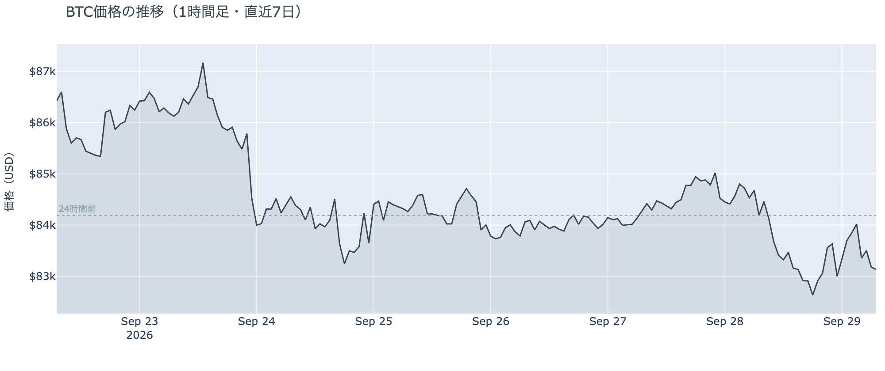

*図の見方: 1時間ごとの価格（日本時間）。木曜から$84,000のまわりで横に伸びてきた線が、月曜の夕方に一段下がり、そのまま$83,000台で止まっています。*

* 朝7時5分の時点で約$83,149。24時間で−1.3%、値幅は3.0%で、土曜の0.7%・日曜の1.1%から広がった。1週間前と比べると−4.0%、1か月前と比べると+6.3%。
* 直近の確定した日足終値は9月27日の$84,462。
* Hyperliquid（＝オンチェーンの先物取引所）で見える清算は、この24時間で49件、94%がロング。最大の1件が全体の69%を占め、月曜18時台の$82,000台に集中している。

月曜日は、週末の静けさが終わった日です。木曜から4日続いた$84,000台を、月曜の夕方に一度で離れました。下げたのは18時台の1時間で、そこで上がる側に張っていた大口のロング1件が清算されています。多数が焼かれたのではなく、大口が1つ飛んだ形で、月曜の下げはその清算を伴いました。

**図1-2 価格と50日・200日移動平均**

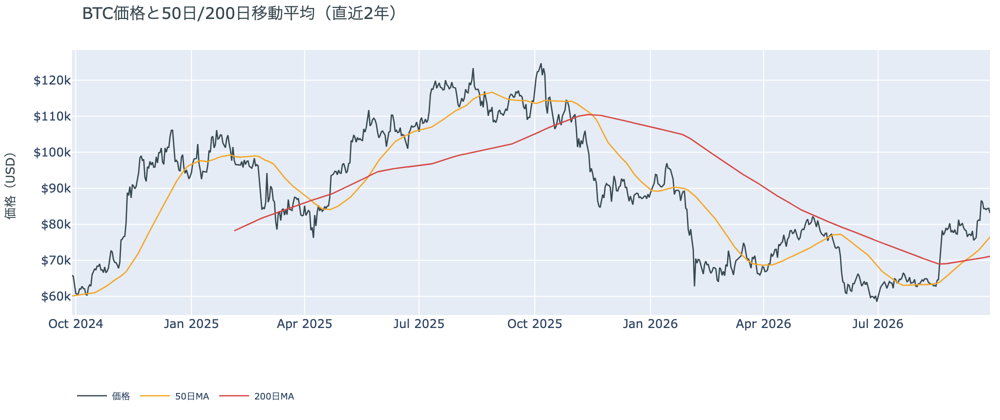

*図の見方: 2本の平均線の上下関係を見ます。50日線が200日線の上にあるのがゴールデンクロスです。*

* 50日線と200日線の差は約$5,333（7.5%）で、前日の$5,030からさらに開いた。
* 価格は50日線$76,469の約8.7%上で、前日の11.0%から縮んだ。

ゴールデンクロス（＝50日線が200日線を上抜けること）の状態は21日目で、2本の線の差は開き続けています。月曜は価格が下げ、50日線は上がった日で、価格と50日線の距離は縮みました。それでも価格は50日線のはっきり上にあり、ゴールデンクロスの状態は崩れていません。

**図1-3 価格に清算を重ねたもの（直近24時間）**

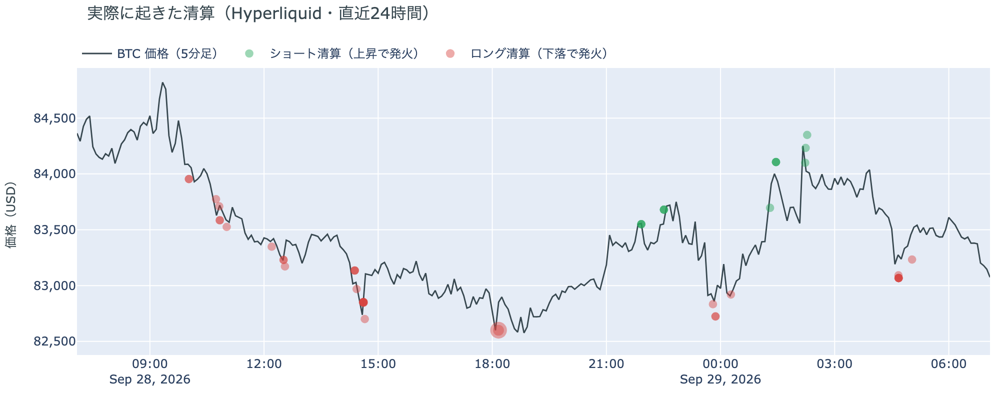

*図の見方: 線が価格（日本時間）、点が清算。点が縦にそろう時間帯に清算が集中しています。*

* 清算は月曜18時台に集中し、価格が$84,000台から$82,000台へ下がる途中で出た。

図の点はほぼ1か所にまとまっています。月曜の下げは、多数の小さな持ち高が次々に焼かれたのではなく、大口のロング1件が下げの途中で清算された形です。

証券市場は週明けの月曜9月28日、S&P500が−0.8%の7,683.69、金が−4.0%の$4,148.50で8月5日以来の安値、原油は+1.0%の$93.29、米10年債利回りは5.24%へ上がりました。株と金が下げ、原油と金利が上がった日に、ビットコインは金と同じ向きに下げています。

## 2. なぜ動いたか：ビットコイン自身の需給か、外部環境か

**図2-1 ビットコインと株・金・原油の相対推移（起点＝100）**

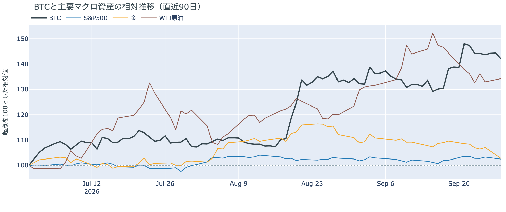

*図の見方: 同じ起点から何%動いたかで重ねたもの。線が同じ向きなら「一緒に動いた」、ビットコインだけ別の向きなら「自身の理由で動いた」と読みます。*

| この5営業日の動き（ビットコインは7日間） | 変化 |
|---|---:|
| ビットコイン | −4.0% |
| 金 | −5.4% |
| 米国株（S&P500） | −1.0% |
| 原油 | −2.6% |

* 月曜1日では、金が−4.0%、株が−0.8%、ビットコインが−1.3%。金利は米10年債利回りが5.24%、ドル指数は+0.2%。ビットコインは金の3分の1の幅で、同じ向きに下げた。
* 建玉は92,816BTC。前日の94,624BTCから1,808BTC減り、直近30日で最も少ない。1週間では−12.7%。
* 資金調達率は月曜にゼロ付近まで下がり、朝の時点でプラスに戻っている。1日をならした年率は+2.15%で、短期金利（13週Tビル 4.06%）を引いた上乗せは−1.90pt。日曜の−1.44ptからマイナス幅がまた広がった。

月曜日に価格が下げた理由は2つです。

1. 金利が上がりドルが強くなった日に、ビットコインは金と同じ向きに下げた。トランプ大統領がイランの案を退けて原油が上がり、米10年債利回りが5.24%へ上がった日に、金利の付かない資産である金とビットコインが同じ向きへ下げました。先週の水曜に米10年債利回りが5.1%へ跳ねた夜、ビットコインが2%下げたのと同じ形です。
2. 先物のロングが再び減った。建玉（＝先物の未決済残高。証拠金で張っている人の量）は減って30日で最も少ない水準を更新し、大口のロング1件の清算を伴いました。減った量は先週の水曜・木曜に減った約1万1,000BTCの6分の1で、投げの規模ではありませんが、資金調達率（＝ロングが払う金利。プラス＝ロングがショートより多い）は短期金利を6日続けて下回り、新しくロングを建てる人は戻っていません。

前日は「ロングは戻らないが、手仕舞いは出尽くした」と説明しました。月曜に建玉が再び減って30日の最少を更新したので、この説明は今日の数値と合わなくなりました。代わりの説明はこうです。手仕舞いは出尽くしたのではなく、証券市場が動く日に小さく続いている。ただし新しい売りではなく、金利が上がる日にロングを持ち続けない人が少しずつ降りている動きで、ビットコイン自身の需給が新しく崩れたのではない。

この説明が違うなら、つまり金利ではなくビットコイン自身の売りが出ているのなら、証券市場が落ち着いた日にも建玉が減り続け、Coinbase Premiumの1週間平均がマイナスへ深まります。その形が出たら、この説明は取り下げます。

外部環境では、週末に続いて月曜も動きがありました。トランプ大統領は9月26日にイランの「7日でホルムズ海峡を開き、その後に交渉を再開する」案を退けたうえで、今週中にカタールを通じた交渉が再開するとの見方を示しています。イランは条件を緩めない構えで、月曜の原油は北海ブレントが$107台へ上がりました。$90台の原油と5.24%の米10年債利回りは、リスク資産全体の重しになりうる状況です。

## 3. 市場参加者はいまどう見ているか

### ① アメリカの買い手は金曜まで7営業日続けて買っているが、ほかの国より高く払ってまでは買っていない

**図①-1 Coinbase Premium（アメリカとそれ以外の価格差・直近90日）**

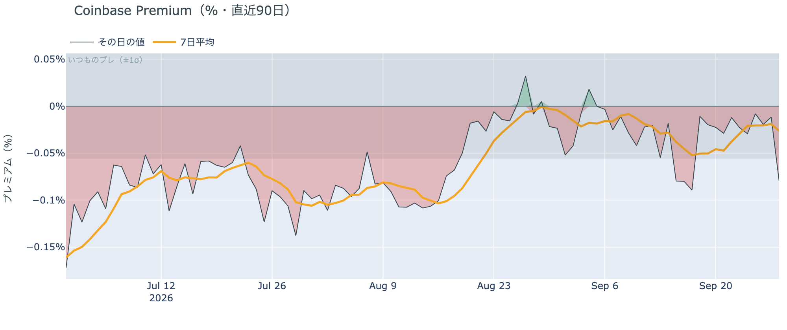

*図の見方: プラス＝アメリカで買いが強い。太線が1週間平均、細線がその日の値。薄い帯は「いつものブレの範囲」です。*

* Coinbase Premiumは1週間平均で−0.026%。先週の−0.047%からマイナス幅は縮んだが、プラスには届いていない。
* 月曜の集計途中の値は−0.08%で、いつものブレの1.4倍。帯の内側。
* 日曜9月27日の確定値は−0.01%。前日の朝に見えていた集計途中の+0.27%は、確定でほぼゼロに戻った。

Coinbase Premium（＝アメリカとそれ以外の価格差）は、1週間平均でわずかなマイナスのまま、ゼロに近づいています。前日は「日曜に初めてアメリカのほうが高く付いた」と書きましたが、あれは集計途中の値で、確定ではほぼゼロでした。訂正します。アメリカの買い手がほかの国より高く払ってまでは買っていない状態は変わらず、下げた月曜も、アメリカから売りが強まった形にはなっていません。

**図①-2 ETFの日ごとの資金の出入り（直近90日）**

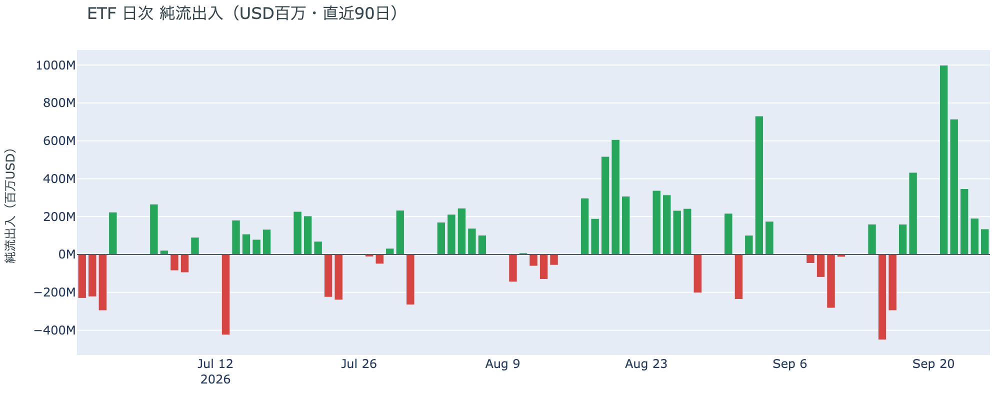

*図の見方: 入ったお金と出たお金の差。上に伸びれば入り超、下に伸びれば出超。*

| ETFの日ごとの出入り | 億ドル |
|---|---:|
| 9月21日 | +10.0 |
| 9月22日 | +7.1 |
| 9月23日 | +3.5 |
| 9月24日 | +1.9 |
| 9月25日 | +1.3 |
| 直近7営業日の合計 | +29.8 |

* 月曜9月28日分はまだ集計されていない。入り超は確定分で7営業日連続。
* 直近7営業日の合計は、図の90日でいちばん大きい。

アメリカの買い手は、金曜まで7営業日続けて買っています。月曜分はまだ数字が無く、月曜から金曜へ入り超が毎日縮んでいく姿は前日と同じです。1週間の合計はこの90日でいちばん大きいままで、下げた先週の水曜も含めて売りへ回った日はありません。買いの勢いは週の初めの姿ではないが、買い手は残っている、が今朝の読みです。

**図①-3 Fear & Greed（市場心理の指数・直近90日）**

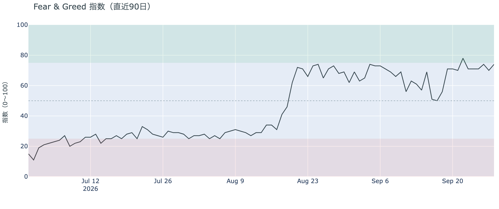

*図の見方: 0〜100で、50より上が「強欲」、下が「恐怖」。75より上は「極度の強欲」です。*

* 74の「強欲」。前日の70から4pt戻した。1週間前は70、1か月前は68。

Fear & Greed（＝市場心理の指数）は、価格が下げた月曜に「極度の強欲」の境目75の一歩手前まで戻りました。先週の水曜に2%下げたときも71で変わらなかったので、1.3%の下げで心理が冷めてはいません。価格の下げを怖がっている人は多くありません。

### ② 長期保有者の分配は続いているが、手放す量は1か月前の2割強まで細った

**図②-1 長期保有者の保有量の30日変化とSOPR（直近60日）**

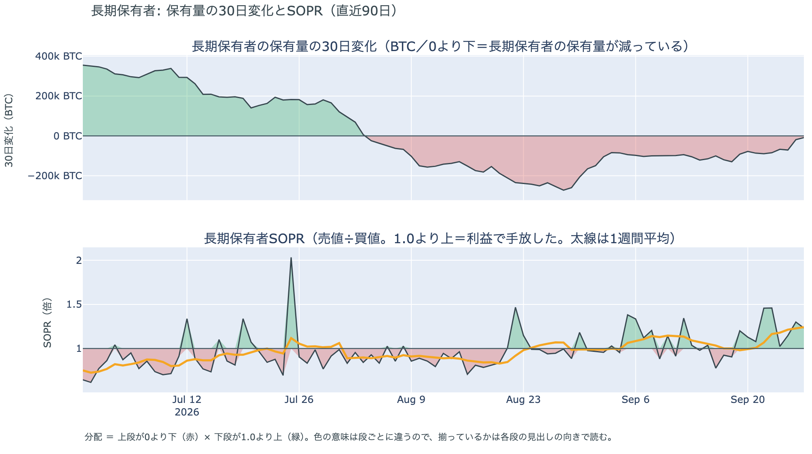

*図の見方: 上段は、長期保有者の保有量が30日でどれだけ増減したか。マイナス＝手放している。下段は長期保有者SOPRで、1より上なら利益で手放した。どちらも太線の1週間平均で読みます。*

| 9月27日時点 | 1週間平均 | 前の週の平均 |
|---|---:|---:|
| 長期保有者SOPR（1より上＝利益で手放した） | 1.24 | 0.99 |
| 長期保有者の保有量の30日変化（万BTC） | −6.1 | −10.8 |

* 減り方は1か月前（8月28日時点で−27.2万BTC）の2割強。前の週から4割縮んだ。
* 1年以上動いていないコインは全体の63.3%で、3か月で1.8pt増えた。売りに出てくるコインが少ない状態は続いている。

長期保有者（＝155日以上動かしていないコインの持ち主）は、利益の出ているコインを手放し続けています。長期保有者SOPR（＝長期保有者が動かしたコインの売値÷買値）で見ると、動いたコインは平均して買値より24%高く手放されました。前の週は買値をわずかに下回っていたので、利益の幅が広がったのは先週の上げで価格が1割近く上がった分です。保有量の30日変化がマイナスで、動いた分が利益側なので、これは分配（＝長期保有者からの放出）です。ただし量は増えておらず、1か月前の2割強まで細りました。ETFや取引所が預かっている分を差し引いても、この規模と向きは変わりません。放出が細るなかで1年以上動いていないコインの割合は増えているので、同じ規模の買いでも売りでも価格が動きやすい下地です。月曜の下げは、長期保有者が手放す量を増やした結果ではありません。ビットコイン自身の需給の土台は、前日と変わっていません。

今日は、コインが最後に動いた価格の分布に大きな変化がなく、長く眠っていたコインが動いた記録もありません。マイナーの収入は平年並み（Puell Multiple（＝マイナー収入の平年比）が1週間平均で1.05）で、売りを急ぐ状況ではありません。

### ③ 先物：ロングは戻らないまま、金利が上がった日にまた少し減った

**図③-1 資金調達率と建玉（直近30日）**

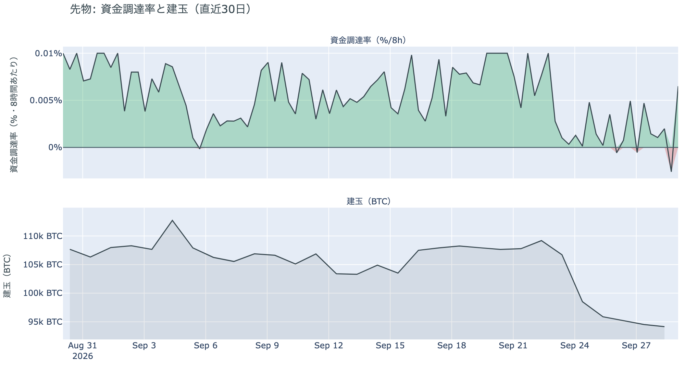

*図の見方: 上段は資金調達率（8時間ごと・日本時間）。プラスが続く＝ロングがショートより多い。下段は建玉。*

* 建玉は前日から1,808BTC減り、直近30日で最も少ない。日曜に戻した329BTCの5倍が1日で消えた。
* 資金調達率は月曜にゼロ付近まで下がり、朝の時点でプラスは1回だけ。30日の平均を大きく下回っている。
* 短期金利に対する上乗せの直近1か月の平均は+2.28pt。マイナスだった日は1か月のうち4分の1。

ロングは戻らないまま、月曜にまた少し減りました。資金調達率の1日をならした年率は+2.15%で、短期金利（13週Tビル 4.06%）を引いた上乗せは−1.90pt。ロングが払う金利が短期金利を下回るのは6日目で、日曜に縮みかけたマイナス幅がまた広がっています。金利が上がる日に、証拠金でロングを持つ人が降りる。先週の水曜から続くこの形が月曜にもう一度出た、が今朝の読みです。ロングへの傾きは弱いままで、過熱ではありません。

### ④ オプション：手前の満期までプットが高い側へ戻ったが、値動きの幅は小さいままと見ている

オプションには2種類あります。コール（＝決めた価格で買う権利）とプット（＝決めた価格で売る権利）で、価格が上がればコールの価値が上がり、価格が下がればプットの価値が上がります。プットは「価格が下がったときの保険」として買われます。オプションを買う人は、その権利と引き換えに権利料（＝オプションを買う人が払う金額）を払います。

**図④-1 満期ごとのIV（年率%）**

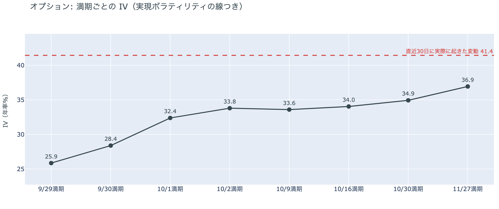

*図の見方: IVを満期ごとに並べたもの。点線は実現ボラティリティ。IVが点線より下なら、市場はこの先の値動きを過去の値動きより小さいと見ています。*

* IVは全体で35.1。前日の34.9とほぼ同じで、過去1年の下から8%の位置。実現ボラティリティは41.4。
* 満期ごとに見ると、9月29日の満期が25.9、9月30日が28.4、10月1日から先が32〜37。手前ほど低く先ほど高い平常の形で、突出した満期は無い。

IV（＝オプション価格から逆算した、この先の値動きの幅の予想）は実現ボラティリティ（＝実際に起きた値動きの幅）より6pt余り低く、市場はこの先の値動きを過去の値動きより小さいと見ています。過去1年で最も低い側にあり、守りを固めている状態でも怖がっている状態でもありません。9月30日に米PCE物価、10月2日に米雇用統計がありますが、その日の満期のオプションの権利料に、ほかの満期に対する上乗せは乗っていません。

**図④-2 満期ごとのプットとコールの差**

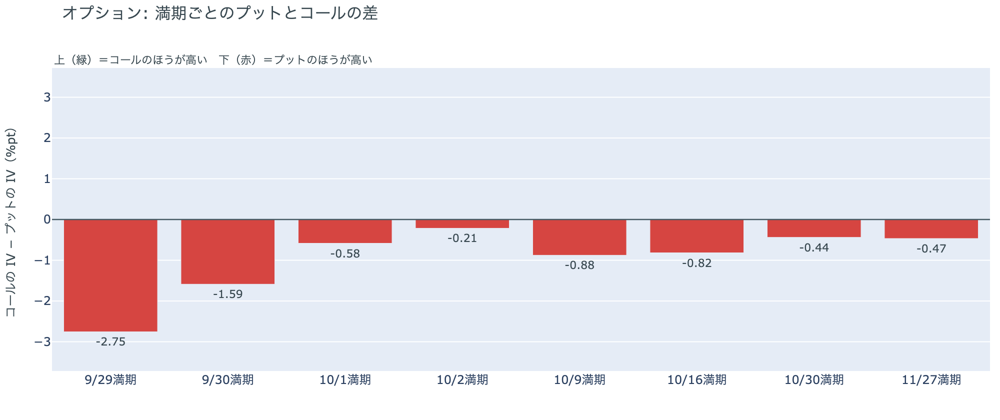

*図の見方: 満期ごとに、プットとコールのどちらが高く売れているか。ゼロより上ならコールのほうが高く、下ならプットのほうが高い。*

| 満期 | どちらが高いか |
|---|---|
| 9月29日 | プットがはっきり高い（前日はコールがはっきり高かった） |
| 9月30日 | プットが高い（前日はコールが高かった） |
| 10月1日 | プットがわずかに高い（前日はコールが高かった） |
| 10月2日 | プットがわずかに高い（前日はほぼ差なし） |
| 10月9日 | プットが高い |
| 10月16日 | プットが高い |
| 10月30日 | プットが高い |
| 11月27日 | プットが高い |

* プットのほうが高くなる最初の満期は9月29日。日曜は10月9日だった。
* 全部の満期でプットが高い形は9月24日・25日にも出て、26日に手前の満期がコールへ戻っていた。

参加者は、下げた日に手前の満期までプットを高く値付けし直しました。日曜に「10月2日までは荒れない」側へ寄せていた値付けが、月曜の下げで一晩で戻り、今日満期が来る9月29日までプットが高い側です。持ち高（図④-3）は変わっていないので、備えを新しく積んだのではなく、ほかの満期に対して手前の満期のプットの権利料に上乗せが乗った、と読みます。下げた日はプット、戻った日はコール、という値付けの往復は先週の水曜から金曜にも起きていて、これで2回目です。IV（図④-1）が低いままなので、どちらの日も参加者は大きく動くとは見ていません。

**図④-3 10月30日満期の持ち高（権利の価格ごと）**

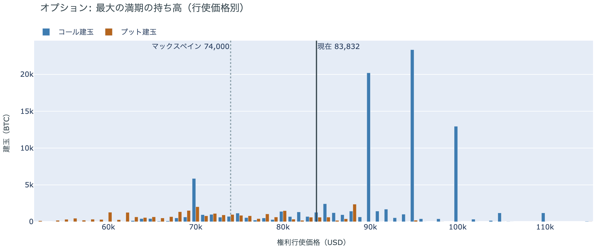

*図の見方: 青＝コール、橙＝プット。現値より上にコールが、下にプットが積まれるのが普通です。*

| 10月30日満期のオプション（価格は約$83,800） | 量（万BTC） | 意味 |
|---|---:|---|
| いまより高い価格のコール（決めた価格で買う権利） | 約7.3 | 「価格が上がる」に賭けた分 |
| いまより安い価格のプット（決めた価格で売る権利） | 約2.4 | 「価格が下がる」への保険 |
| うち、いまより15%以上高い価格のコール | 約1.6 | 大きな上げへの賭け |
| うち、いまより15%以上安い価格のプット | 約1.5 | 大きな下げへの保険 |

* いちばん大きな満期は10月30日に入れ替わった。持ち高は全部で120,000BTCで全満期の34%。前日までいちばん大きかった12月25日の満期を上回った。
* 建玉が厚い行使価格は、コールが$95,000（約2万3,000BTC）・$90,000（約2万BTC）・$100,000（約1万3,000BTC）。プットは$88,000（約2,400BTC）・$70,000（約2,000BTC）で、コールの10分の1。
* 全満期で持ち高が集まっている価格は、多い順に$84,000（全体の12%）、$90,000、$82,000。

「価格が上がる」に賭けた人たちは、月曜の下げでも降りていません。10月30日の満期では、いまより高い価格のコールが、いまより安い価格のプットの3倍あります。賭けは$90,000〜$100,000のコールに集まっていて、報われるには10月30日までに$90,000を超える必要があります。その水準はいまの価格から8%上で、10月30日は10月27〜28日のFOMC（＝米国の金利を決める会合）の直後の満期です。プットは全体では薄いものの、いまより15%以上安い価格に置かれた分は、大きな上げへの賭けとほぼ同じ量です。いまの価格は、全満期で持ち高が最も集まる$82,000〜$85,000の帯の中にあります。

## 4. 価格に影響しうる直近のイベント

予測ではなく、「次に市場が反応しうる材料」の案内です。オプション市場は今朝の時点で全部の満期でプットを高く値付けしていますが、9月30日の米PCE物価と10月2日の米雇用統計の日の満期の権利料に、ほかの満期に対する上乗せは乗っていません。いちばん大きな満期は10月30日で、10月27〜28日のFOMCの直後です。

| 日付 | イベント | 何に効くか |
|---|---|---|
| 今週中（日程未定） | カタールを通じた米国とイランの交渉の再開。トランプ大統領は9月26日にイランの「7日でホルムズ海峡を開く」案を退けたうえで、今週中の再開を見込むと発言。イランは条件を緩めないと表明 | 原油 |
| 9/30（水）21:30 日本時間 | 米PCE物価（8月分。FRBが重視する物価統計）。同時に4〜6月期GDPの確定値 | 金利。10月のFOMCでもう1回利上げするかの材料 |
| 10/2（金） | イランが9月25日に示した「7日でホルムズ海峡を開き、その後に交渉を再開する」案の7日目 | 原油 |
| 10/2（金）21:30 日本時間 | 米9月の雇用統計 | 金利 |
| 10/2（金） | 米SECのパース委員が退任し、委員はアトキンス委員長とウエダ委員の2人になる。後任は未指名 | 規制 |
| 10/2（金） | 米上院が中間選挙後まで休会に入る。9月15日に否決されたCLARITY法案（＝暗号資産の市場構造法案）の再採決があるとすればこの前 | 規制 |
| 10/27（火）〜28（水） | FOMC。利上げの織り込みは7割 | 金利。10月30日の満期はこの直後 |
| 10/30（金）17:00 | オプションの最も大きな満期（約12万BTC、全満期の34%） | 「価格が上がる」に賭けた人たちの期限 |
| 日程未定 | 米下院本会議で、ビットコインの戦略準備を法律にする法案の採決（委員会は9月16日に可決。下院は選挙期間で休会中） | 規制 |
| 2027/1/10 | 米中の関税の一時停止の新しい期限（9月24日の首脳会談で11月から延長） | 通商。株 |

## まとめ：月曜日の動きは何だったか

月曜日は、週明けに金利が上がりドルが強くなった日に、ビットコインが金と同じ向きに下げた日でした。金が4%、株が0.8%下げるなかで、ビットコインは1.3%。下げは18時台の1時間に集中し、大口のロング1件の清算を伴いました。建玉は30日で最も少ない水準を更新し、資金調達率は短期金利を6日続けて下回っています。前日の「手仕舞いは出尽くした」は取り下げ、金利が上がる日にロングが少しずつ降りる動きが続いている、と説明し直しました。アメリカの買い手は金曜まで7営業日続けて買っていて、Coinbase Premiumは確定値でほぼゼロのままです。長期保有者は9月27日時点で買値より24%高く手放し続けていますが、量は1か月前の2割強まで細りました。オプションでは、下げた日に全部の満期でプットが高い側へ戻りましたが、持ち高は変わらず、IVは過去1年で最も低い側のままです。外部環境では、トランプ大統領がイランの案を退けたまま今週中の交渉再開を見込み、原油と金利が上がりました。ビットコイン自身の需給の土台は、前日と変わっていません。

---

*本稿は情報提供を目的としたものであり、投資助言ではありません。将来の価格動向を保証・示唆するものではなく、投資判断は各自の責任において行ってください。*
