# $82,700で下げ止まり、建玉は減り止まる ― 資金調達率は7日ぶりに短期金利の上、手前の満期はコール高へ

**2026年9月30日**

火曜日は、月曜から続いた下げが午前で止まった日です。24時間の値幅は$82,736〜$84,557の2.2%で、朝7時5分の価格は約$83,550と、24時間前とほぼ同じ水準にいます。下げたのは火曜の午前で、10時台に価格が$82,700台へ届いたところで、証拠金で買い持ち（ロング）にしていた多数の小さな取引が清算（＝証拠金不足で強制的に閉じられた取引）されました。そこで下げは止まり、夜には$84,500台まで戻しています。先物では、1週間減り続けていた建玉が火曜はほぼ横ばいになり、ロングが払う金利は7日ぶりに短期金利（＝ドルを米国の短期国債で持つだけで受け取れる金利）の上へ戻りました。オプションでは、月曜に全部の満期でプットが高い側へ戻っていた値付けが、火曜には10月9日までの満期でコールが高い側へ戻っています。

（数値は9月30日7時5分（日本時間）までのデータに基づきます。価格・先物・オプションはその時点の値、市場心理は9月29日の確定値、オンチェーン（＝ブロックチェーン上の記録）は9月28日時点、ETF資金フローは9月28日の月曜分までが確定し、29日分は集計の途中です。証券市場の終値は9月29日時点です。オンチェーンの長期保有者の数値には、ETFや取引所が預かっている分も含まれます。オプションはDeribit（BTCオプションの大半を占める取引所）の全銘柄です。）

## 1. 何が起きたか

**図1-1 価格の推移（1時間足・直近7日）**

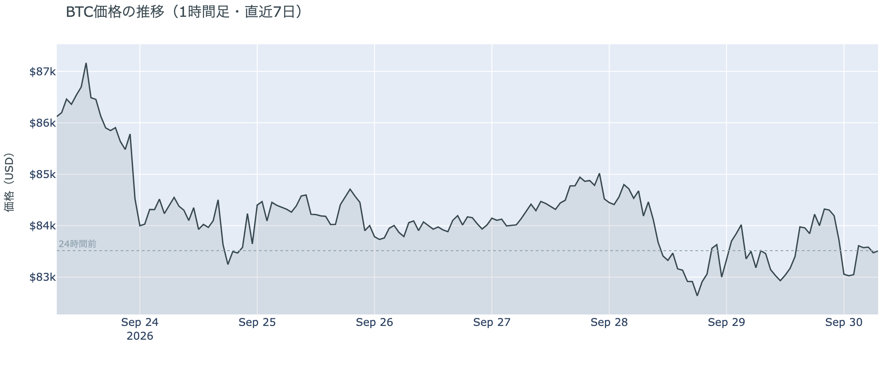

*図の見方: 1時間ごとの価格（日本時間）。月曜の夕方に点線の下へ折れた線が、火曜の午前に$82,700台まで下がったあと、夜に$84,000台へ戻り、朝は点線の近くに戻っています。*

* 朝7時5分の時点で約$83,550。24時間の変化はほぼゼロで、値幅は$82,736〜$84,557の2.2%と、月曜の3.0%から縮んだ。1週間前と比べると−3.1%、1か月前と比べると+7.6%。
* 直近の確定した日足終値は9月28日の$83,457。
* Hyperliquid（＝オンチェーンの先物取引所）で見える清算は、この24時間で152件。6割強がロングで、最大の1件でも全体の25%。集中したのは火曜10時台で、価格帯は$82,000台。

火曜日は、月曜から続いた下げが午前で止まった日でした。火曜の10時台に価格が$82,700台へ届いたところでロングの清算が集中しましたが、月曜のように大口1件が飛んだのではなく、多数の小さなロングが焼かれた形です。そのあと価格は下げず、夜には$84,500台まで戻し、朝は24時間前とほぼ同じ水準にいます。火曜の午前の下げは多数のロングの清算を伴いました。

**図1-2 価格と50日・200日移動平均**

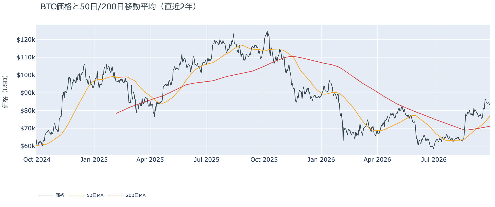

*図の見方: 2本の平均線の上下関係を見ます。50日線が200日線の上にあるのがゴールデンクロスです。*

* 50日線と200日線の差は約$5,667（8.0%）で、前日の$5,333からさらに開いた。
* 価格は50日線$76,868の約8.7%上で、前日と同じ。

ゴールデンクロス（＝50日線が200日線を上抜けること）の状態は22日目で、2本の線の差は開き続けています。価格と50日線の距離は月曜に11%から8.7%へ縮んだあと、火曜はそのままです。ゴールデンクロスの状態は崩れていません。

証券市場は火曜9月29日、S&P500が−0.2%の7,671、金が+1.1%の$4,215、原油は−4.0%の$88.94、米10年債利回りは5.26%で、前日の5.24%からさらに上がりました。原油が大きく下げ、金が前日の4%安から少し戻し、株はほぼ横ばいの日です。ビットコインはこの夜に$84,500台まで戻してから$83,500へ下げていて、原油とも金とも同じ向きには動いていません。

## 2. なぜ動いたか：きっかけと、需給のどこが動いたか

**図2-1 ビットコインと株・金・原油の相対推移（起点＝100）**

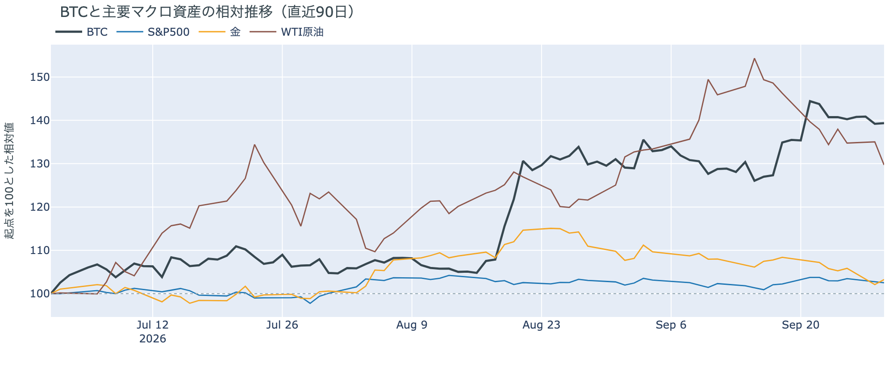

*図の見方: 同じ起点から何%動いたかで重ねたもの。線が同じ向きなら「共通のきっかけがありえた」、ビットコインだけ別の向きなら「ビットコインに固有のきっかけがありえた」と読みます。*

| この5営業日の動き（ビットコインは7日間） | 変化 |
|---|---:|
| ビットコイン | −3.1% |
| 金 | −3.7% |
| 米国株（S&P500） | −1.2% |
| 原油 | −6.0% |

* この5営業日、ビットコインは金・株・原油と同じ向きに下げた。米10年債利回りは5営業日で5.8%上がって5.26%。
* 建玉は92,694BTC。前日の92,816BTCから約120BTC減っただけで、1週間では−15.0%。
* 資金調達率は火曜の朝から4回続けてプラス（約1.3日）。1日をならした年率は+4.39%で、短期金利（13週Tビル 4.07%）を引いた上乗せは+0.33pt。前日の−1.90ptからプラスへ戻った。

火曜日に価格が24時間で横ばいだったのは、新しいきっかけが来ず、月曜から続いていた先物のロングの手仕舞いが、火曜の午前の清算で止まったからです。

1. きっかけ：外部環境に新しい出来事はありませんでした。原油は火曜に4%下げて$88.94と$90を割りましたが、これはホルムズ海峡を通る原油が戦争前の8割近くまで戻ったという報道と同時に起きた動きで、ビットコインは原油が下げた夜にむしろ$84,500台まで戻しています。米10年債利回りは5.26%と2007年以来の高さを更新し、金は前日の4%安から1.1%戻しました。この5営業日で見れば、ビットコインは金・株・原油と同じ向きに下げていて、金利の上昇という共通のきっかけがありえます。ただし火曜のこの24時間に限れば、原油は下げ、金は上げ、ビットコインは横ばいで、同じ向きには動いていません。
2. 伝わり方：先物のロングです。火曜の午前に$82,700台で多数のロングの清算が集中し、そこで建玉（＝先物の未決済残高。証拠金で張っている人の量）の減少が止まりました。資金調達率（＝ロングが払う金利。プラス＝ロングがショートより多い）は火曜の朝から4回続けてプラスで、短期金利を引いた上乗せは7日ぶりにプラスへ戻っています。オプションでは、月曜に全部の満期でプットが高い側へ戻っていた値付けが、火曜には10月9日までの満期でコールが高い側へ戻りました（図④-2）。持ち高（図④-3）は動いていません。現物のほうは、ETFが月曜9月28日に0.3億ドルの入り超と、ほぼ手を止めた水準です。長期保有者は、月曜の下げが入った9月28日時点でも前日と同じ姿です（図②-1）。

前日は「手仕舞いは出尽くしたのではなく細く続いていて、価格が少し下げるたびに残っているロングが一段ずつ削られている」と説明し、「建玉が減り止まり、上乗せのマイナス幅が縮めば、この説明は取り下げる」と書きました。火曜はその形が出ました。建玉は約120BTCしか減らず、上乗せはマイナスからプラスへ戻ったので、前日の説明は取り下げます。代わりの説明はこうです。ロングの手仕舞いは、月曜18時台の大口1件の清算と火曜午前の多数の清算で一区切りつき、残ったロングはそのまま保たれています。市場の多数は月曜の下げを「一時的な押し」と見ていて、火曜には手前の満期のオプションの値付けもコールが高い側へ戻しました。

この説明が違うなら、つまり「一区切りついた」のではなく「1日止まっただけ」なら、建玉は再び減り、資金調達率の上乗せはマイナスへ戻ります。その形が出たら、この説明は取り下げます。

外部環境では、ホルムズ海峡を通る原油と石油製品が先週は日量1,310万バレルと戦争前の8割近くまで戻り、湾岸諸国の9月の輸出は開戦以来で最も多くなったと報じられました。原油の4%安はこの報道と同時に起きています。一方でイランは、トランプ大統領が9月26日に退けた「7日でホルムズ海峡を開く」案について、仲介者を通じた正式な米側の回答をまだ待っていると述べ、トランプ大統領は9月27日に「今週さらに協議がある」と話しています。原油は$90を割りましたが、5.26%の米10年債利回りは、リスク資産全体の重しになりうる状況です。

## 3. 市場参加者はいまどう見ているか

### ① アメリカの買い手は8営業日続けて買っているが、月曜はほぼ手が止まった

**図①-1 Coinbase Premium（アメリカとそれ以外の価格差・直近90日）**

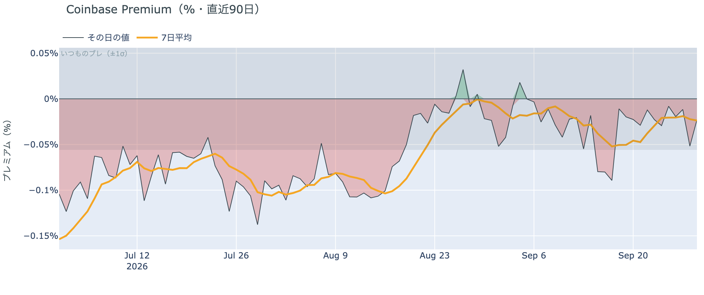

*図の見方: プラス＝アメリカで買いが強い。太線が1週間平均、細線がその日の値。薄い帯は「いつものブレの範囲」です。*

* Coinbase Premiumは1週間平均で−0.02%。前の週の−0.04%からマイナス幅が縮んだ。
* 火曜の値は−0.02%で、いつものブレの半分以下。帯の内側にある。

Coinbase Premium（＝アメリカとそれ以外の価格差）は、1週間平均で見るとアメリカ側の弱さが前の週より縮んでいます。火曜の値もいつものブレの内側で、アメリカのほうが特に安く付いた日ではありません。アメリカの買い手が引いたと言える動きは出ていません。

**図①-2 ETFの日ごとの資金の出入り（直近90日）**

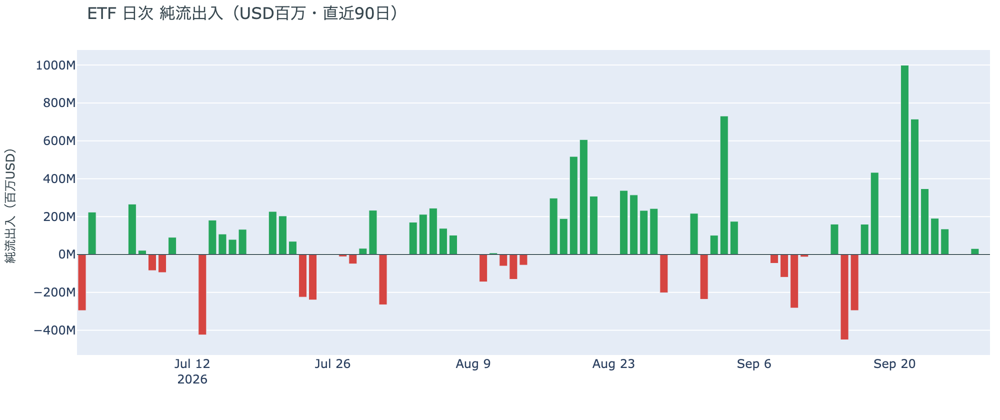

*図の見方: 入ったお金と出たお金の差。上に伸びれば入り超、下に伸びれば出超。*

| ETFの日ごとの出入り | 億ドル |
|---|---:|
| 9月23日 | +3.5 |
| 9月24日 | +1.9 |
| 9月25日 | +1.3 |
| 9月28日 | +0.3 |
| 直近7営業日の合計 | +24.2 |

ETFへの資金は9月28日まで8営業日続けて入り超ですが、月曜の分は0.3億ドルと、1週間前の月曜9月21日の10億ドルの30分の1です。アメリカの買い手は逃げてはいませんが、月曜の下げの日にはほぼ手を止めました。火曜9月29日の分は集計の途中で、まだ数字になっていません。

**図①-3 Fear & Greed（市場心理の指数・直近90日）**

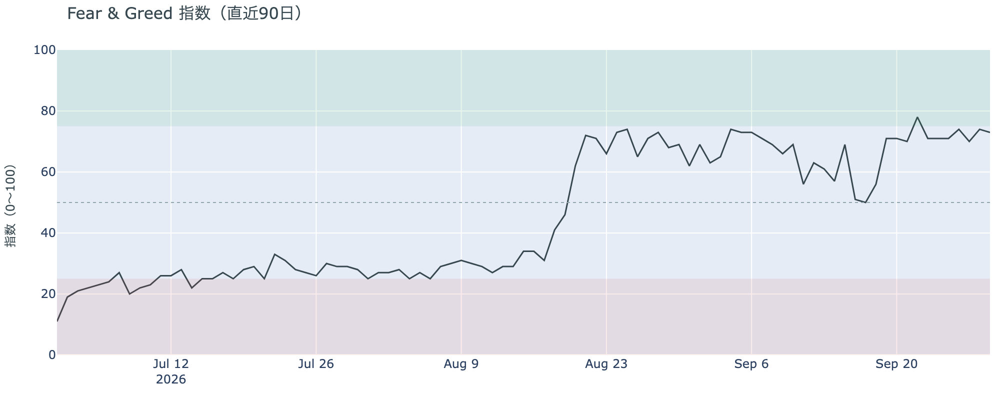

*図の見方: 0〜100で、50より上が「強欲」、下が「恐怖」。*

* 73の「強欲」。前日の74から1pt下がり、「極度の強欲」との境目75の少し下。1週間前は78、1か月前は69。

市場心理は9月29日時点で「強欲」の上端にとどまっています。月曜に価格が$82,500へ下げても、市場の多数はこの下げを怖がっていません。

### ② 長期保有者の分配は続いているが、月曜の下げが入っても量は増えていない

**図②-1 長期保有者の保有量の30日変化とSOPR（直近60日）**

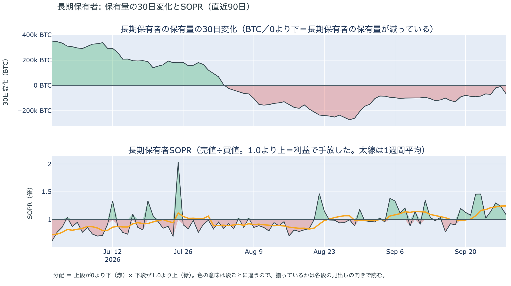

*図の見方: 上段は、長期保有者の保有量が30日でどれだけ増減したか。マイナス＝手放している。下段は長期保有者SOPRで、1より上なら利益で手放した。どちらも太線の1週間平均で読みます。*

| 9月28日時点 | 1週間平均 | 前の週の平均 |
|---|---:|---:|
| 長期保有者SOPR（1より上＝利益で手放した） | 1.25 | 1.01 |
| 長期保有者の保有量の30日変化（万BTC） | −5.8 | −10.3 |

* 減り方は前の週の6割弱で、1か月前の−26.0万BTCと比べると2割強。
* 1年以上動いていないコインは全体の63.3%で、3か月で1.6pt増えた。

長期保有者（＝155日以上動かしていないコインの持ち主）は、利益の出ているコインを手放し続けています。保有量の30日変化がマイナスで、長期保有者SOPR（＝長期保有者が動かしたコインの売値÷買値）が1週間平均で1を上回っているので、これは分配（＝長期保有者からの放出）です。動かしたコインは平均して買値より25%高く手放されました。ただし量は細り続けていて、1か月前の2割強しかありません。月曜の下げが入った9月28日の分でも、手放す量は前の週より増えていません。ETFや取引所が預かっている分を差し引いても、この規模と向きは変わりません。**ビットコイン自身の需給の土台は、前日と変わっていません。**

今日は、コインが最後に動いた価格の分布に大きな変化がなく、長く眠っていたコインが動いた記録もありません。マイナーの収入は平年並み（Puell Multiple（＝マイナー収入の平年比）が1週間平均で1.06）で、売りを急ぐ状況ではありません。

### ③ 先物：ロングは減り止まり、資金調達率は7日ぶりに短期金利の上へ戻った

**図③-1 資金調達率と建玉（直近30日）**

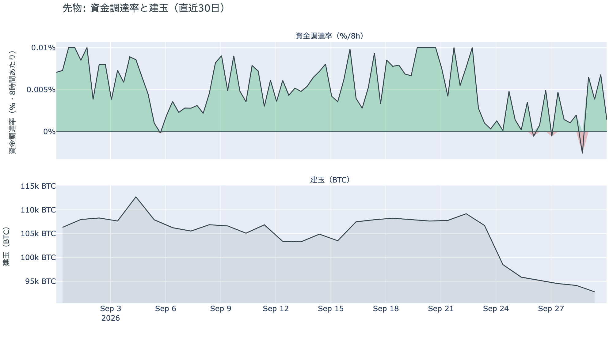

*図の見方: 上段は資金調達率（8時間ごと・日本時間）。プラスが続く＝ロングがショートより多い。下段は建玉。*

* 建玉は前日から約120BTC（0.1%）減っただけ。9月23日から月曜までの1週間で約1万6,000BTC減ったあと、火曜は横ばい。
* 資金調達率は月曜に一度マイナスへ沈んだあと、火曜の朝から4回続けてプラス。
* 短期金利を引いた上乗せは直近34日の平均+2.15ptより小さく、この34日でプラスだった日は74%。

ロングは減り止まりました。資金調達率の1日をならした年率は+4.39%で、短期金利（13週Tビル 4.07%）を引いた上乗せは+0.33pt。ロングが払う金利が短期金利を下回る日が6日続いたあと、火曜に7日ぶりで上へ戻りました。証拠金で買っている量は1か月でいちばん少ないままで、上乗せは平常の+2.15ptにはまだ遠く、ロングへの傾きは弱いままです。ただ、下げるたびに残ったロングが削られる形は火曜には出ておらず、残ったロングはそのまま保たれています。過熱ではありません。

### ④ オプション：10月9日までの満期はコールが高い側へ戻り、プットが高いのは10月30日から先だけ

オプションには2種類あります。コール（＝決めた価格で買う権利）とプット（＝決めた価格で売る権利）で、価格が上がればコールの価値が上がり、価格が下がればプットの価値が上がります。プットは「価格が下がったときの保険」として買われます。オプションを買う人は、その権利と引き換えに権利料（＝オプションを買う人が払う金額）を払います。

**図④-1 満期ごとのIV（年率%）**

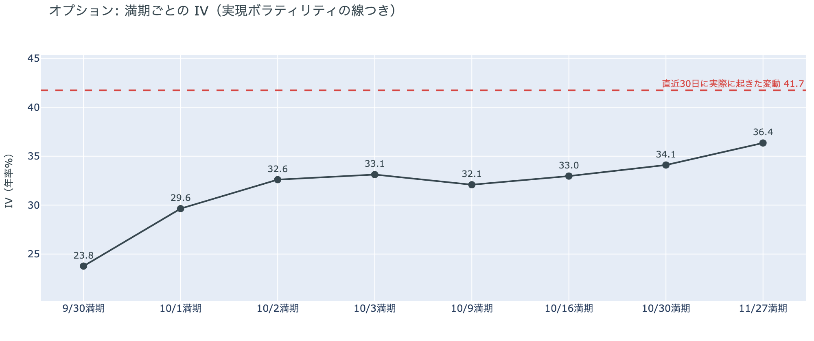

*図の見方: IVを満期ごとに並べたもの。点線は実現ボラティリティ。IVが点線より下なら、市場はこの先の値動きを過去の値動きより小さいと見ています。*

* IVは全体で35.9。実現ボラティリティ41.7より5.8pt低い。過去1年で見ると下から5%の低さ。
* 満期ごとに見ると、今日9月30日の満期が23.8で最も低く、11月27日の36.4まで先ほど高い平常の形。特定の日だけ跳ねている満期は無い。

IV（＝オプション価格から逆算した、この先の値動きの幅の予想）は実現ボラティリティ（＝実際に起きた値動きの幅）より低く、市場はこの先の値動きを、過去の値動きより小さいと見ています。月曜に3%、火曜に2%の値幅が出ても、IVは過去1年の下から5%の水準にあり、怖がっていません。今夜21時30分の米PCE物価も10月2日の米雇用統計も、その日の満期のオプションの権利料に、ほかの満期に対する上乗せは乗っていません。

**図④-2 満期ごとのプットとコールの差**

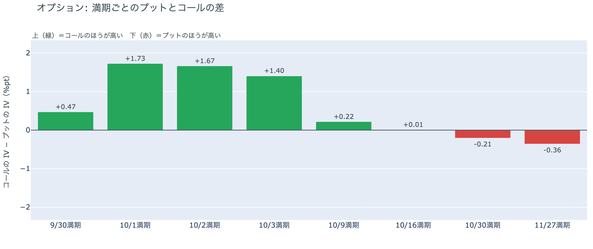

*図の見方: 満期ごとに、プットとコールのどちらが高く売れているか。ゼロより上ならコールのほうが高く、下ならプットのほうが高い。*

| 満期 | どちらが高いか |
|---|---|
| 9月30日 | コールが高い |
| 10月1日 | コールが高い（差は満期の中で最大） |
| 10月2日 | コールが高い |
| 10月3日 | コールが高い |
| 10月9日 | コールがわずかに高い |
| 10月16日 | ほぼ差なし |
| 10月30日 | プットが高い |
| 11月27日 | プットが高い |

* 月曜は全部の満期でプットのほうが高かった。火曜にその値付けが変わり、プットが高い最初の満期は10月30日になった。
* 金曜から日曜までコールが高かったのは10月2日の満期までで、10月9日から先はプットが高かった。火曜は10月9日までコールが高く、境目は10月30日まで先へ動いた。

火曜に参加者は、月曜に手前へ戻していた備えを再び先へ送りました。金曜から日曜の「10月2日の米雇用統計までは荒れない」という値付けよりさらに先の10月9日までコールが高く、備えは10月27〜28日のFOMC（＝米国の金利を決める会合）をまたぐ10月30日以降の満期に置いています。月曜の下げで手前の満期にも備えを戻した動きは、1日で元に戻りました。ただし持ち高（図④-3）は動いておらず、変わったのは値付けだけです。

**図④-3 10月30日満期の持ち高（権利の価格ごと）**

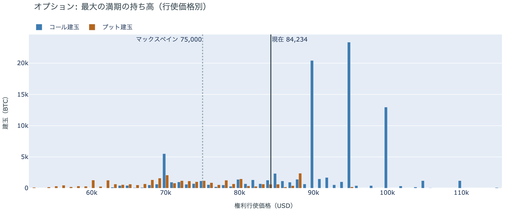

*図の見方: 青＝コール、橙＝プット。現値より上にコールが、下にプットが積まれるのが普通です。*

| 10月30日満期のオプション（価格は約$84,200） | 量（万BTC） | 意味 |
|---|---:|---|
| 現値より上のコール | 約7.2 | 「価格が上がる」に賭けた分 |
| 現値より下のプット | 約2.6 | 「価格が下がる」への保険 |
| うち、いまより15%以上高い価格のコール | 約1.6 | 大きな上げへの賭け |
| うち、いまより15%以上安い価格のプット | 約1.5 | 大きな下げへの保険 |

* 10月30日満期の持ち高は全部で約12.1万BTCと、全満期の34%で最も多い。現値より上のコールは現値より下のプットの2.8倍で、前日とほぼ同じ形。
* コールが集まっている価格は、多い順に$95,000（約2.3万BTC）、$90,000（約2.0万BTC）、$100,000（約1.3万BTC）。
* 満期をまたいで持ち高が集まっている価格は、多い順に$84,000、$90,000、$85,000、$82,000で、$82,000〜$90,000の帯に集まっている。

「価格が上がる」に賭けた人たちは、月曜の下げと火曜の清算を経ても降りていません。10月30日満期のコールは$90,000と$95,000に厚く積まれたままで、この賭けが報われるには、FOMCの2日後の10月30日までに、いまより8%高い$90,000を超える必要があります。いまの価格は、満期をまたいで持ち高が集まっている$82,000〜$90,000の帯の中にあります。

## 4. 価格に影響しうる直近のイベント

予測ではなく、「次に市場が反応しうる材料」の案内です。今朝の時点で、オプション市場は10月9日までの満期でコールを高く値付けし、備えを10月30日以降の満期に置いています。この区間に当たるのは10月27〜28日のFOMCです。今夜の米PCE物価と10月2日の米雇用統計の満期に、ほかの満期に対する上乗せは乗っていません。米10年債利回りは5.26%で、10月のFOMCで利上げする織り込みは7割で変わっていません。

| 日付 | イベント | 何に効くか |
|---|---|---|
| 9/30（水）21:30 日本時間 | 米PCE物価（8月分。FRBが重視する物価統計）。同時に4〜6月期GDPの確定値 | 金利。10月のFOMCでもう1回利上げするかの材料 |
| 9/30（水）〜10/2（金） | トランプ大統領が「今週さらにある」と述べたイランとの協議。イランは9月25日に示した「7日でホルムズ海峡を開き、その後に交渉を再開する」案への正式な米側の回答を、仲介者を通じて待っている | 原油 |
| 10/2（金）21:30 日本時間 | 米9月の雇用統計 | 金利 |
| 10/2（金） | 米SECのパース委員が退任し、委員はアトキンス委員長とウエダ委員の2人になる。後任は未指名 | 規制 |
| 10/2（金） | 米上院が中間選挙後まで休会に入る。9月15日に否決されたCLARITY法案（＝暗号資産の市場構造法案）の再採決があるとすればこの前 | 規制 |
| 10/27（火）〜28（水） | FOMC。利上げの織り込みは7割 | 金利 |
| 10/30（金）17:00 | オプションの最も大きな満期（約12万BTC、全満期の34%）。FOMCの2日後 | 「価格が上がる」に賭けた人たちの期限 |
| 12/11（金） | 米政府のつなぎ予算の期限（9月1日に成立。10月1日からの新年度の政府閉鎖は回避済み） | 株・金利 |
| 日程未定 | 米下院本会議で、ビットコインの戦略準備を法律にする法案の採決（委員会は9月16日に可決。下院は選挙期間で休会中） | 規制 |
| 2027/1/10 | 米中の関税の一時停止の新しい期限（9月24日の首脳会談で11月から延長） | 通商。株 |

## まとめ：火曜日の動きは何だったか

火曜日は、はっきりしたきっかけが無いまま午前に$82,700台まで下げて多数のロングが清算され、そこで先物の手仕舞いが止まって、24時間では横ばいに戻った日でした。1週間減り続けていた建玉は減り止まり、短期金利を引いた資金調達率の上乗せは−1.90ptから+0.33ptへ、7日ぶりにプラスへ戻りました。原油が4%下げ、金が1.1%戻し、米10年債利回りが5.26%へ上がった夜に、ビットコインは$84,500台まで戻しています。動いたのは先物の持ち高までで、アメリカの買い手は9月28日まで8営業日続けて買いながら月曜はほぼ手を止め、長期保有者は月曜の下げが入った9月28日時点でも買値より25%高く手放しながら量を1か月前の2割強に細らせたままで、市場心理は「強欲」の上端です。オプションでは、月曜に全部の満期でプットが高い側へ戻っていた値付けが、火曜には10月9日までの満期でコールが高い側へ戻り、10月30日満期のコールの持ち高は動いていません。前日の「残ったロングが下げるたびに一段ずつ削られている」という説明は取り下げ、「月曜の大口1件と火曜の多数の清算で手仕舞いは一区切りつき、残ったロングは保たれている」に置き換えました。外部環境では、ホルムズ海峡を通る原油が戦争前の8割近くまで戻ったと報じられて原油は$90を割り、イランとの協議は今週も続く見込みで、米10年債利回りは5.26%と2007年以来の高さを更新しています。

---

*本稿は情報提供を目的としたものであり、投資助言ではありません。将来の価格動向を保証・示唆するものではなく、投資判断は各自の責任において行ってください。*
