# 米物価統計が予想を下回り$85,600へ跳ねて往復 ― ショートの清算を伴い、減り続けた建玉は増加へ

**2026年10月1日**

水曜日は、夜に2%あまり跳ねて、2時間ほどで元へ戻った日です。21時30分に出た米国の物価統計が予想を下回ると、価格は$83,000台から$85,614まで上げ、証拠金で売り持ち（ショート）にしていた多数の小さな取引が清算（＝証拠金不足で強制的に閉じられた取引）されましたが、上げは日付が変わる前に消え、朝7時5分の価格は約$83,660と24時間前とほぼ同じ水準です。残ったのは先物の変化で、9月23日から減り続けていた建玉が初めて増え、買い持ち（ロング）が積まれました。オプションでは、火曜にコールが高い側へ戻っていた手前の満期が、水曜には全部プットが高い側へ戻り、差がいちばん大きいのは10月2日夜の米雇用統計をまたぐ10月3日の満期です。

（数値は10月1日7時5分（日本時間）までのデータに基づきます。価格・先物・オプションはその時点の値、市場心理は9月30日の確定値、オンチェーン（＝ブロックチェーン上の記録）は9月29日時点（長期保有者SOPRは9月28日時点）、ETF資金フローは9月29日分までで、30日分はまだ出ていません。証券市場の終値は9月30日時点です。オンチェーンの長期保有者の数値には、ETFや取引所が預かっている分も含まれます。オプションはDeribit（BTCオプションの大半を占める取引所）の全銘柄です。）

## 1. 何が起きたか

**図1-1 価格の推移（1時間足・直近7日）**

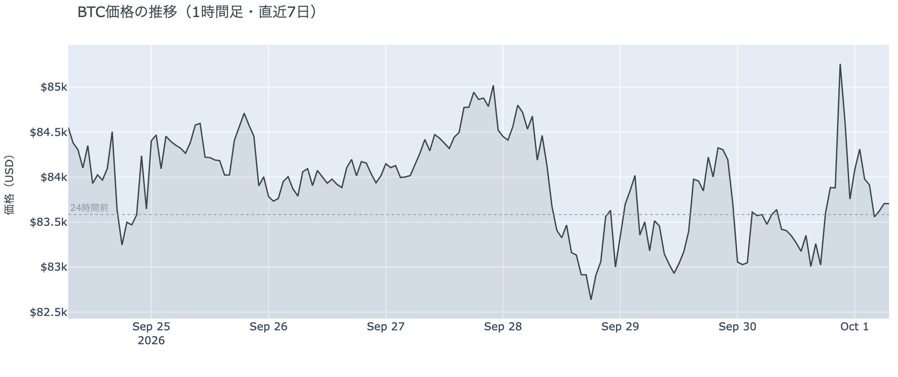

*図の見方: 1時間ごとの価格（日本時間）。水曜の日中は点線の少し下で平らだった線が、夜に1本だけ鋭く跳ねて、朝には点線の近くへ戻っています。*

* 朝7時5分の時点で約$83,660。24時間の変化は+0.1%で、値幅は$82,912〜$85,614の3.3%と、前日の2.2%から広がった。1週間前と比べると−0.9%、1か月前と比べると+6.5%。
* 直近の確定した日足終値は9月29日の$83,638。

水曜日は、夜に跳ねて、そのまま元へ戻った日でした。日中は$83,000前後でほとんど動かず、21時30分に米国の物価統計が出た直後に一気に上げ、日付が変わる前に上げをすべて消しています。24時間で見れば、価格は動いていません。

**図1-2 価格と50日・200日移動平均**

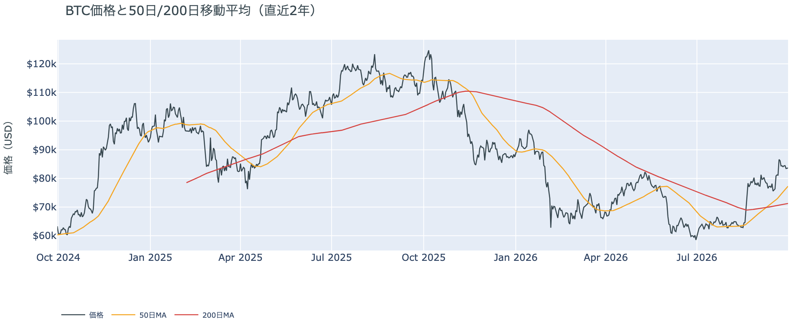

*図の見方: 2本の平均線の上下関係を見ます。50日線が200日線の上にあるのがゴールデンクロスです。*

* 50日線と200日線の差は約$6,009（8.4%）で、前日の$5,667からさらに開いた。
* 価格は50日線$77,272の約8.3%上で、前日の8.7%から少し縮んだ。

ゴールデンクロス（＝50日線が200日線を上抜けること）の状態は23日目で、2本の線の差は開き続けています。価格が横ばいのあいだに50日線が上がってきたので、価格と50日線の距離は少しずつ縮んでいます。ゴールデンクロスの状態は崩れていません。

**図1-3 価格に清算を重ねたもの（直近24時間）**

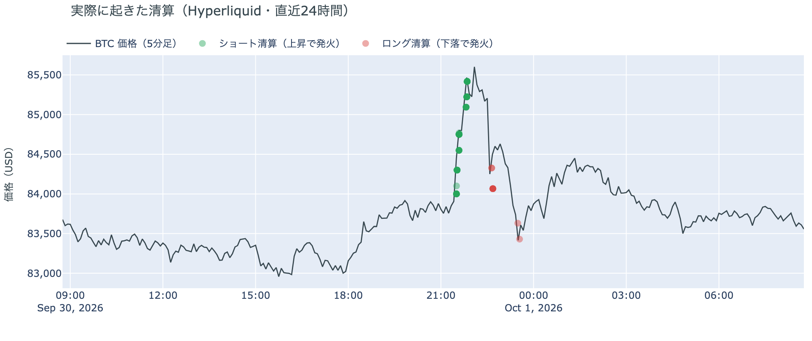

*図の見方: 線が価格（日本時間）、点が清算。緑がショートの清算、赤がロングの清算で、点が縦にそろう時間帯に清算が集中しています。*

* Hyperliquidで見える清算は、この24時間で78件。8割弱がショートで、最大の1件でも全体の10%。
* ショートの清算は水曜21時台に集中し、価格が$84,000台から$85,000台へ上がる途中で出た。上げが消える途中では、逆にロングが数件清算された。

水曜の夜の上げは、多数の小さなショートの清算を伴いました。Hyperliquid（＝オンチェーンの先物取引所）で見える範囲では、大口が1つ飛んだのではなく、小さなショートが上げの途中で次々に清算された形です。清算と値動きは同じ時間に起きているので、どちらが先かはこのデータでは決まりません。

証券市場は水曜9月30日、S&P500が−0.25%の7,652、金が+0.2%の$4,189、原油が+1.1%の$90.34、米10年債利回りは5.29%で、前日の5.26%からさらに上がりました。物価統計が予想を下回った夜に、株は朝方の上げを保てずに小幅安で終わり、金利は上がって終わり、ビットコインは跳ねたあと元へ戻っています。

## 2. なぜ動いたか：きっかけと、需給のどこが動いたか

**図2-1 ビットコインと株・金・原油の相対推移（起点＝100）**

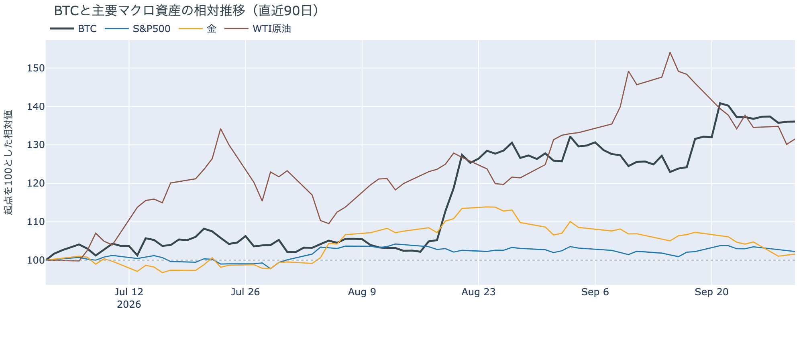

*図の見方: 同じ起点から何%動いたかで重ねたもの。線が同じ向きなら「共通のきっかけがありえた」、ビットコインだけ別の向きなら「ビットコインに固有のきっかけがありえた」と読みます。*

| この5営業日の動き（ビットコインは7日間） | 変化 |
|---|---:|
| ビットコイン | −0.9% |
| 金 | −3.0% |
| 米国株（S&P500） | −0.7% |
| 原油 | −2.0% |

* この5営業日、ビットコインは金・株・原油と同じ向きに下げた。米10年債利回りは5営業日で3.5%上がった。
* 建玉は95,392BTC。前日の92,694BTCから約2,700BTC（2.9%）増えた。
* 資金調達率は、1日をならした年率が+5.13%で、短期金利（13週Tビル 4.03%）を引いた上乗せは+1.10pt。前日の+0.33ptから広がった。

水曜の夜にビットコインが跳ねたのは、米PCE物価（＝FRBが重視する物価統計）が予想を下回ったことをきっかけに、先物のショートの清算を通って上げたからで、その上げは2時間ほどで消えました。

1. きっかけ：外部環境の出来事です。21時30分に出た8月の米PCE物価は、食品とエネルギーを除いた前年比が+3.0%と、予想の+3.3%を下回りました。10月27〜28日のFOMC（＝米国の金利を決める会合）で利上げする織り込みは、1週間前の7割から4割前後へ下がっています。ただし同じ夜、米10年債利回りは発表の直後にいったん下げたあと上げに転じ、S&P500も朝方の上げを消して下げて終わりました。物価統計で動いた分を、株も債券も保てなかった夜です。ビットコインの上げが消えたのも同じ夜ですが、同じ向きに動いたことは原因の証明ではありません。
2. 伝わり方：先物です。上げの途中の21時台に、多数の小さなショートが清算されました（図1-3）。上げが消えたあとも、建玉（＝先物の未決済残高。証拠金で張っている人の量）は前日より多いままで、資金調達率（＝ロングが払う金利。プラス＝ロングがショートより多い）から短期金利（＝ドルを米国の短期国債で持つだけで受け取れる金利）を引いた上乗せは広がりました。ショートが清算されて減った分を上回って、新しいロングが積まれたということです。現物のほうは動いていません。ETFは9月29日が0.7億ドルの入り超と小さく、長期保有者は9月29日時点でも前日と同じ姿です（図②-1）。

前日は「ロングの手仕舞いは月曜の大口1件と火曜の多数の清算で一区切りつき、残ったロングは保たれている」と説明し、この説明が違うなら建玉は再び減り、上乗せはマイナスへ戻ると書きました。水曜は建玉が増え、上乗せはプラスのまま広がったので、前日の説明は今日の数値と合っています。

外部環境ではもう一つ、イランが9月30日に、「7日でホルムズ海峡を開く」案に対する米側の回答をカタールの仲介者を通じて受け取ったと認めました。回答の中身は公表されていません。原油は1.1%上げましたが$90前後のままです。米10年債利回りは2007年以来の高さをさらに更新していて、リスク資産全体の重しになりうる状況は変わっていません。

## 3. 市場参加者はいまどう見ているか

### ① アメリカの買い手は買い続けているが、今週の額は小さいまま

**図①-1 Coinbase Premium（アメリカとそれ以外の価格差・直近90日）**

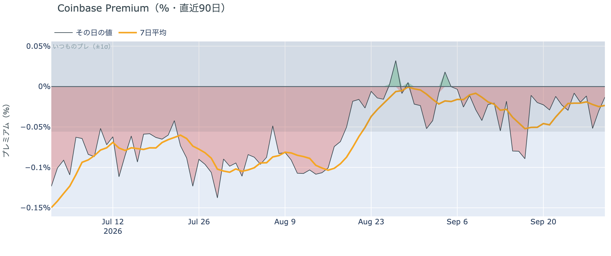

*図の見方: プラス＝アメリカで買いが強い。太線が1週間平均、細線がその日の値。薄い帯は「いつものブレの範囲」です。*

* Coinbase Premiumは1週間平均で−0.02%。前の週の−0.03%からマイナス幅がわずかに縮んだ。
* 水曜の値は−0.01%で、いつものブレの5分の1。帯の内側にある。

Coinbase Premium（＝アメリカとそれ以外の価格差）は、1週間平均で見ると前の週とほぼ同じ小さなマイナスです。物価統計で価格が跳ねた水曜も、アメリカ側だけが高く買われた形は出ていません。アメリカの買い手が水曜の上げを引っ張ったとは言えず、引いたとも言えません。

**図①-2 ETFの日ごとの資金の出入り（直近90日）**

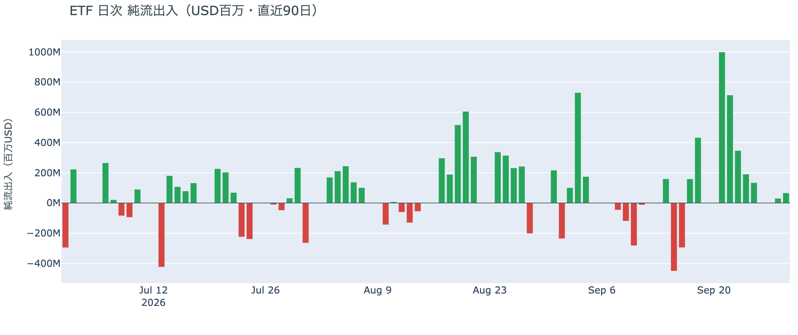

*図の見方: 入ったお金と出たお金の差。上に伸びれば入り超、下に伸びれば出超。*

| ETFの日ごとの出入り | 億ドル |
|---|---:|
| 9月24日 | +1.9 |
| 9月25日 | +1.3 |
| 9月28日 | +0.3 |
| 9月29日 | +0.7 |
| 直近7営業日の合計 | +24.8 |

ETFへの資金は9月29日まで9営業日続けて入り超ですが、今週の月曜と火曜は2日合わせても1億ドルに届きません。7営業日の合計の大半は、9月21日から23日の3日間に入った分です。アメリカの買い手は逃げてはいませんが、今週は小さく買っているだけです。物価統計が出た9月30日の分は、まだ数字になっていません。

**図①-3 Fear & Greed（市場心理の指数・直近90日）**

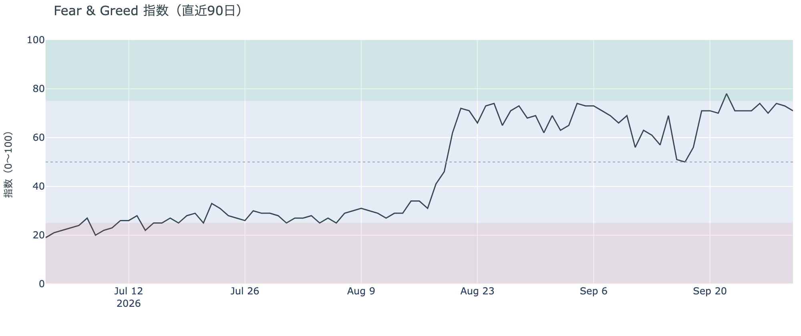

*図の見方: 0〜100で、50より上が「強欲」、下が「恐怖」。*

* 71の「強欲」。前日の73から2pt下がった。1か月前は62。

市場心理は9月30日の確定値で「強欲」のままで、1週間前とちょうど同じ水準です。月曜と火曜に価格が$82,000台まで下げても、市場の多数は怖がっていません。

### ② 長期保有者の分配は続いているが、量は前の週の6割弱に細ったまま

**図②-1 長期保有者の保有量の30日変化とSOPR（直近90日）**

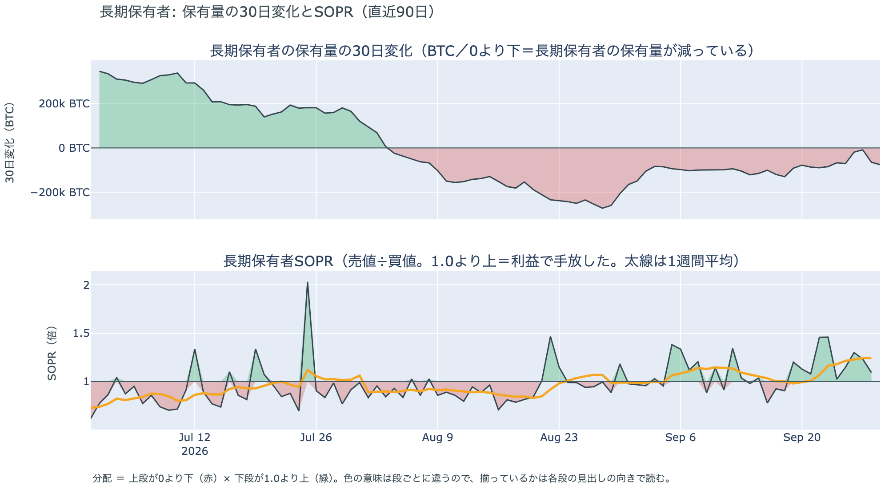

*図の見方: 上段は、長期保有者の保有量が30日でどれだけ増減したか。マイナス＝手放している。下段は長期保有者SOPRで、1より上なら利益で手放した。どちらも1週間平均で読みます。*

| 9月29日時点（SOPRは9月28日時点） | 1週間平均 | 前の週の平均 |
|---|---:|---:|
| 長期保有者SOPR（1より上＝利益で手放した） | 1.25 | 1.01 |
| 長期保有者の保有量の30日変化（万BTC） | −5.6 | −9.9 |

* 1か月前（8月30日）の−20.7万BTCと比べると3割弱。
* 1年以上動いていないコインは全体の63.3%で、3か月で1.6pt増えた。

長期保有者（＝155日以上動かしていないコインの持ち主）は、利益の出ているコインを手放し続けています。保有量の30日変化がマイナスで、長期保有者SOPR（＝長期保有者が動かしたコインの売値÷買値）が1週間平均で1を上回っているので、これは分配（＝長期保有者からの放出）です。動かしたコインは平均して買値より25%高く手放されました。ただし量は細ったままで、月曜と火曜の下げが入った9月29日時点でも、手放す量は前の週の6割弱しかありません。ETFや取引所が預かっている分を差し引いても、この規模と向きは変わりません。**ビットコイン自身の需給の土台は、前日と変わっていません。**

9月29日時点で、コインが最後に動いた価格の分布に大きな変化はなく、長く眠っていたコインが動いた記録もありません。マイナーの収入は平年並み（Puell Multiple（＝マイナー収入の平年比）が1週間平均で1.06）で、売りを急ぐ状況ではありません。

### ③ 先物：減り続けていた建玉が増え、ロングが積まれた

**図③-1 資金調達率と建玉（直近30日）**

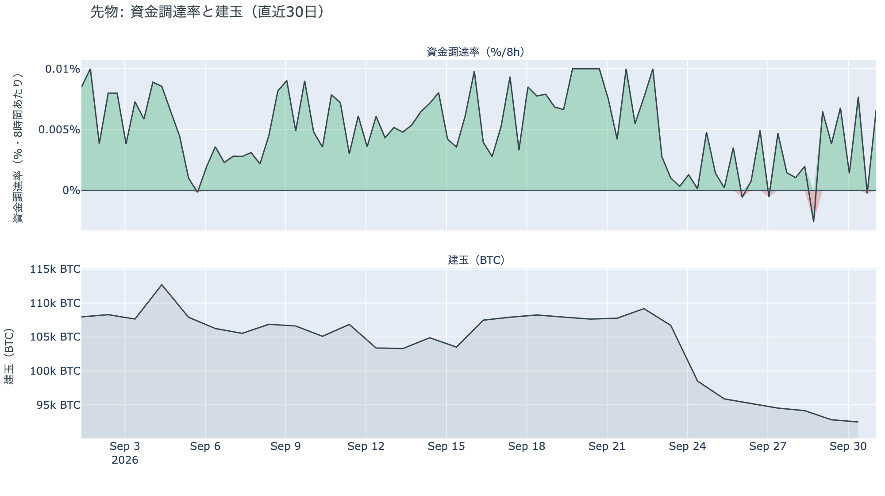

*図の見方: 上段は資金調達率（8時間ごと・日本時間）。プラスが続く＝ロングがショートより多い。下段は建玉。*

* 建玉は前日から2.9%増えた。9月23日からの1週間で1割あまり減ったあとの、最初の増加。
* 資金調達率は水曜の夕方の回で一度マイナスへ沈み、物価統計のあとの回でプラスへ戻った。
* 短期金利を引いた上乗せは、直近34日の平均+2.04ptよりまだ小さい。この34日でプラスだった日は74%。

先物では、9月23日から減り続けていた建玉が水曜に初めて増えました。資金調達率の1日をならした年率は+5.13%で、短期金利（13週Tビル 4.03%）を引いた上乗せは+1.10pt。ロングが払う金利は、2日続けて短期金利の上にあります。資金調達率がプラスのまま建玉が増えたので、積まれたのはロングです。ただし上乗せは平常の半分ほどで、証拠金で張っている量も、減り始める前の9月23日より1割ほど少ないままです。ロングへの傾きは戻り始めたところで、過熱ではありません。

### ④ オプション：全部の満期でプットが高い側へ戻り、差が最大なのは雇用統計をまたぐ10月3日

オプションには2種類あります。コール（＝決めた価格で買う権利）とプット（＝決めた価格で売る権利）で、価格が上がればコールの価値が上がり、価格が下がればプットの価値が上がります。プットは「価格が下がったときの保険」として買われます。オプションを買う人は、その権利と引き換えに権利料（＝オプションを買う人が払う金額）を払います。

**図④-1 満期ごとのIV（年率%）**

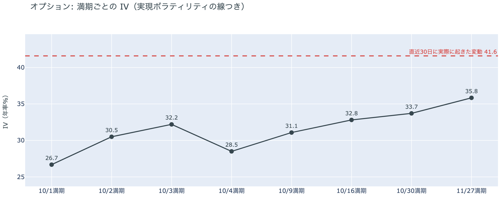

*図の見方: IVを満期ごとに並べたもの。点線は実現ボラティリティ。IVが点線より下なら、市場はこの先の値動きを過去の値動きより小さいと見ています。*

* IVは全体で35.1。実現ボラティリティ41.6より6.5pt低い。過去1年で見ると下から6%の低さ。
* 満期ごとに見ると、今日10月1日の満期が26.7で最も低く、11月27日の35.8まで先ほど高い形。大きく跳ねた満期は無いが、10月3日の満期は32.2で、前後の10月2日（30.5）と10月4日（28.5）より少し高い。

IV（＝オプション価格から逆算した、この先の値動きの幅の予想）は実現ボラティリティ（＝実際に起きた値動きの幅）より低く、市場はこの先の値動きを、過去の値動きより小さいと見ています。物価統計の夜に3%の値幅が出ても、IVは過去1年でいちばん低い部類のままで、怖がっていません。ただ、10月3日に満期（＝権利の期限）が来るオプションの権利料には、前後の満期に対する小さな上乗せが乗っています。10月2日21時30分の米雇用統計をまたぐ最初の満期で、その夜に値が動くと見られているからです。

**図④-2 満期ごとのプットとコールの差**

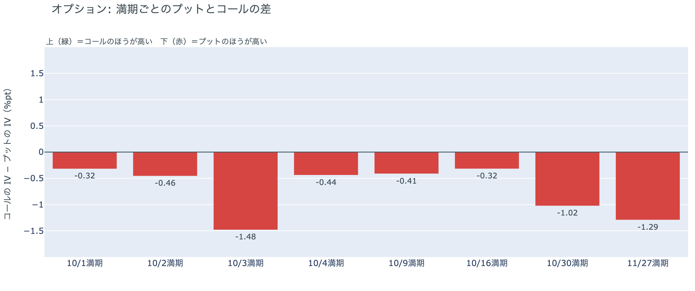

*図の見方: 満期ごとに、プットとコールのどちらが高く売れているか。ゼロより上ならコールのほうが高く、下ならプットのほうが高い。*

| 満期 | どちらが高いか |
|---|---|
| 10月1日 | プットがわずかに高い |
| 10月2日 | プットがわずかに高い |
| 10月3日 | プットがはっきり高い（差は満期の中で最大） |
| 10月4日 | プットがわずかに高い |
| 10月9日 | プットがわずかに高い |
| 10月16日 | プットがわずかに高い |
| 10月30日 | プットが高い |
| 11月27日 | プットが高い |

* 火曜は10月9日までの満期でコールが高かった。水曜にその値付けが変わり、コールが高い満期は一つも残っていない。
* 手前の満期は、月曜はプット、火曜はコール、水曜はプットと、1日ごとに入れ替わっている。

水曜に参加者は、火曜に先の満期へ送っていた備えを、再び手前の満期にも置きました。物価統計が予想を下回って価格が跳ねた夜のあとなのに、全部の満期でプットのほうが高く値付けされています。差がいちばん大きいのは、10月2日夜の米雇用統計をまたぐ10月3日の満期です。ただし、10月3日を除く手前の満期の差は小さく、月曜から1日ごとに入れ替わっています。参加者がはっきり備えを置いているのは、米雇用統計をまたぐ10月3日の満期と、10月27〜28日のFOMCをまたぐ10月30日から先の満期です。

**図④-3 10月30日満期の持ち高（権利の価格ごと）**

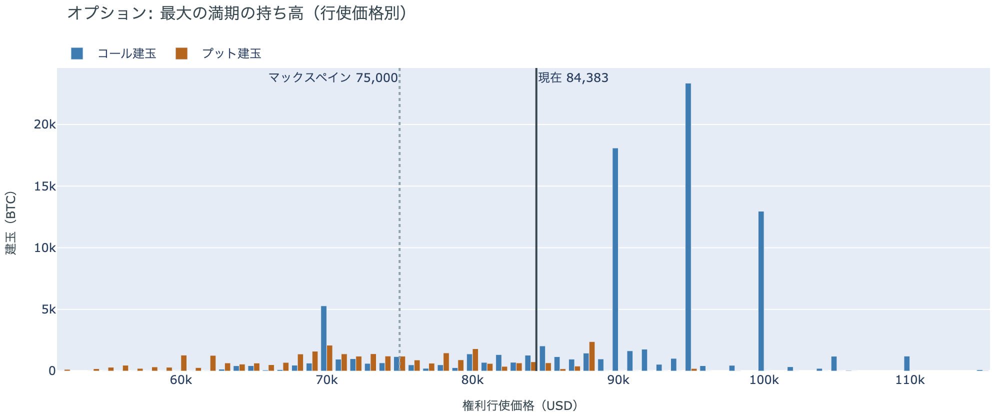

*図の見方: 青＝コール、橙＝プット。現値より上にコールが、下にプットが積まれるのが普通です。*

| 10月30日満期のオプション（価格は約$84,400） | 量（万BTC） | 意味 |
|---|---:|---|
| 現値より上のコール | 約7.0 | 「価格が上がる」に賭けた分 |
| 現値より下のプット | 約2.8 | 「価格が下がる」への保険 |
| うち、いまより15%以上高い価格のコール | 約1.7 | 大きな上げへの賭け |
| うち、いまより15%以上安い価格のプット | 約1.5 | 大きな下げへの保険 |

* 10月30日満期の持ち高は全部で約12.1万BTCと、全満期の33%で最も多い。現値より上のコールと現値より下のプットの比は、前日は2.8倍だった。
* コールが集まっている価格は、多い順に$95,000（約2.3万BTC）、$90,000（約1.8万BTC。前日は約2.0万BTC）、$100,000（約1.3万BTC）。
* 満期をまたいで持ち高が集まっている価格は、多い順に$84,000、$90,000、$85,000、$82,000、$80,000。

「価格が上がる」に賭けた人たちの大半は降りていませんが、持ち高は少しだけ守りの側へ動きました。10月30日満期では、現値より上のコールが現値より下のプットの2.5倍あり、$95,000と$100,000のコールは前日のまま積まれています。一方で、$90,000のコールは1割ほど減り、現値より下のプットは1割ほど増えました。コールの賭けが報われるには、FOMCの2日後の10月30日までに、朝の価格より8%高い$90,000を超える必要があります。いまの価格は、満期をまたいで持ち高が集まっている$80,000〜$90,000の帯の中にあります。

## 4. 価格に影響しうる直近のイベント

予測ではなく、「次に市場が反応しうる材料」の案内です。今朝の時点で、オプション市場は全部の満期でプットを高く値付けしていて、備えがはっきり置かれているのは10月3日の満期と、10月30日から先の満期です。10月3日の満期に当たるのは10月2日夜の米雇用統計、10月30日から先の満期に当たるのは10月27〜28日のFOMCです。10月のFOMCで利上げする織り込みは、水曜の物価統計のあと、1週間前の7割から4割前後へ下がりました。

| 日付 | イベント | 何に効くか |
|---|---|---|
| 10/2（金）21:30 日本時間 | 米9月の雇用統計。事前の予想は雇用者数が9万人前後の増加（8月は16.2万人増）、失業率は4.1% | 金利。10月のFOMCで利上げするかの材料。10月3日満期のオプションがまたぐ |
| 10/2（金） | 米SECのパース委員が退任し、委員はアトキンス委員長とウエダ委員の2人になる | 規制 |
| 日程未定 | イランが9月30日に受け取った、「7日でホルムズ海峡を開く」案への米側の回答に対するイランの返答。米側の回答の中身は公表されていない | 原油 |
| 10月上旬 | 米上院が11月3日の中間選挙のあとまで休会に入る。9月15日に否決されたCLARITY法案（＝暗号資産の市場構造法案）の再採決は日程に入っていない | 規制 |
| 10/27（火）〜28（水） | FOMC。利上げの織り込みは4割前後 | 金利 |
| 10/30（金）17:00 | オプションの最も大きな満期（約12万BTC、全満期の33%）。FOMCの2日後 | 「価格が上がる」に賭けた人たちの期限 |

## まとめ：水曜日の動きは何だったか

水曜日は、予想を下回った米PCE物価をきっかけに、先物のショートの清算を伴って$85,614まで跳ね、2時間ほどで上げを消して、24時間では横ばいに戻った日でした。同じ夜に、米10年債利回りはいったん下げたあと5.29%へ上がり、S&P500は朝方の上げを消して0.25%安で終えています。動いたのは先物の持ち高までです。9月23日から減り続けていた建玉は初めて増え、短期金利を引いた資金調達率の上乗せは+0.33ptから+1.10ptへ広がって、ロングが積まれました。アメリカの買い手は9月29日まで9営業日続けて買いながら今週は小さな額にとどまり、長期保有者は買値より25%高く手放しながら量を前の週の6割弱に細らせたままで、市場心理は「強欲」です。前日の「手仕舞いは一区切りつき、残ったロングは保たれている」という説明は、今日の数値と合っています。オプションでは、火曜にコールが高い側へ戻っていた手前の満期が、水曜には全部プットが高い側へ戻りました。備えがはっきり置かれているのは、10月2日夜の米雇用統計をまたぐ10月3日の満期と、FOMCをまたぐ10月30日から先の満期です。10月30日満期では$90,000のコールが1割ほど減り、現値より下のプットが1割ほど増えましたが、$95,000と$100,000のコールはそのまま残っています。

---

*本稿は情報提供を目的としたものであり、投資助言ではありません。将来の価格動向を保証・示唆するものではなく、投資判断は各自の責任において行ってください。*
