# 利上げ観測が後退した夜に$85,200へ ― 先物のロングが2日続けて積まれ、現物の買い手は動かず

**2026年10月2日**

木曜日は、深夜から金曜の未明にかけて上げ、上げの大半を残して朝を迎えた日です。

* **価格**：$83,000台から$85,244まで上げ、朝7時5分の時点で約$84,710（24時間前より+1.3%）
* **きっかけ**：10月のFOMCで利上げするという見方が、もう一段後退した（米国の取引時間）
* **先物**：上げを運んだ。証拠金で売り持ち（ショート）にしていた大口1件が清算（＝証拠金不足で強制的に閉じられた取引）され、買い持ち（ロング）が2日続けて積まれた
* **需給の土台**：米国の買い手と長期保有者は動いていない
* **オプションの見方**：今夜21時30分の米雇用統計で値が動くとは見ているが、向きは決めていない。下げへの備えがいちばん厚いのは10月末のFOMC

## 1. 何が起きたか

**図1-1 価格の推移（1時間足・直近7日）**

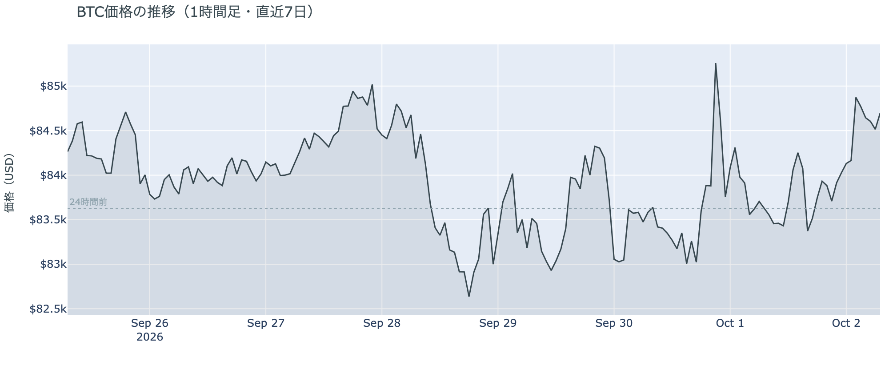

*図の見方: 1時間ごとの価格（日本時間）。木曜の夕方にいったん点線の下へ下げた線が、深夜から右端にかけて点線の上へ上がっています。*

* 朝7時5分の時点で約$84,710。24時間の変化は+1.3%で、値幅は$83,107〜$85,244の2.6%と、前日の3.3%から縮んだ。1週間前と比べると+0.4%、1か月前と比べると+9.5%。
* 直近の確定した日足終値は9月30日の$83,556。
* Hyperliquidで見える清算は、ほぼ全部がショート。金曜2時台、価格が$84,000台から$85,000台へ上がる途中に集中し、最大の1件が全体の9割近くを占めた。

木曜日は、夕方に下げたあと深夜から未明に上げ、その上げがほぼ残った日でした。未明の上げは清算を伴いましたが、Hyperliquid（＝オンチェーンの先物取引所）で見える範囲では、多数のショートが次々に清算されたのではなく、大口のショートが1つ飛んだ形です。清算と値動きは同じ時間に起きているので、どちらが先かはこのデータでは決まりません。

**図1-2 価格と50日・200日移動平均**

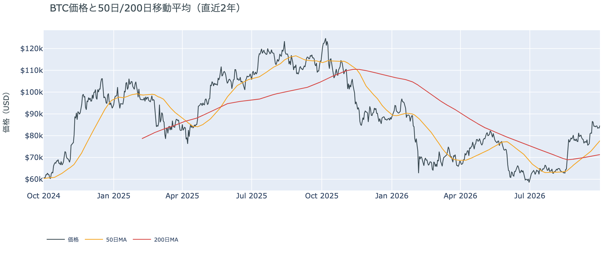

*図の見方: 2本の平均線の上下関係を見ます。50日線が200日線の上にあるのがゴールデンクロスです。*

* 50日線（$77,696）と200日線（$71,323）の差は約$6,374（8.9%）で、前日の$6,009からさらに開いた。
* 価格と50日線の距離は、前日の8.3%から開いた。

長い目で見た流れの向きは変わっていません。ゴールデンクロス（＝50日線が200日線を上抜けること）の状態は24日目で、価格は50日線の約9%上にあります。

証券市場は木曜10月1日、S&P500が+0.19%の7,666、金が+0.5%の$4,208、原油が+2.75%の$92.91でした。米10年債利回りは取引時間中に5.33%と2002年以来の高さを付けたあと下げに転じ、前日の5.29%から5.24%へ下げて終えています。ビットコインが上げたのは、同じ米国の取引時間です。

## 2. なぜ動いたか：きっかけと、需給のどこが動いたか

**図2-1 ビットコインと株・金・原油の相対推移（起点＝100）**

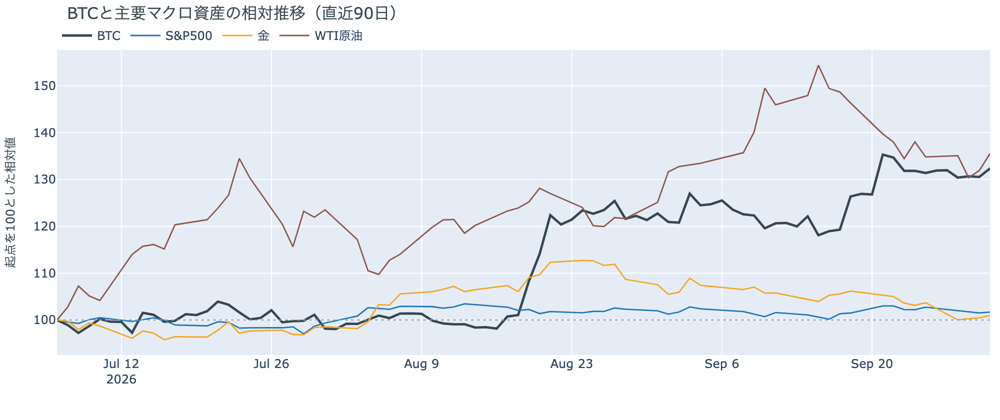

*図の見方: 同じ起点から何%動いたかで重ねたもの。線が同じ向きなら「共通のきっかけがありえた」、ビットコインだけ別の向きなら「ビットコインに固有のきっかけがありえた」と読みます。*

| この5営業日の動き（ビットコインは7日間） | 変化 |
|---|---:|
| ビットコイン | +0.4% |
| 金 | −2.1% |
| 米国株（S&P500） | −0.5% |
| 原油 | −1.8% |

* この5営業日、金・株・原油がそろって下げたなかで、ビットコインだけがわずかに上げた。
* 建玉は96,972BTC。前日の95,392BTCから約1,600BTC（1.7%）増えた。
* 資金調達率は、1日をならした年率が+7.13%で、短期金利（13週Tビル 3.98%）を引いた上乗せは+3.15pt。前日の+1.10ptから広がった。

木曜の深夜から金曜の未明にビットコインが上げたのは、10月のFOMC（＝米国の金利を決める会合）で利上げするという見方がもう一段後退したことをきっかけに、先物のショートの清算と新しいロングを通って上げたからです。

1. きっかけ：外部環境の出来事です。木曜の米国では、FRBのジェファーソン副議長が「追加の利上げにはもっと時間がかかるかもしれない」と述べ、10月27〜28日のFOMCで利上げする織り込みは、前日の4割前後から3割前後へ下がりました。米10年債利回りは2002年以来の高さから下げに転じ、ビットコインが上げたのも同じ時間帯です。ただし、同じ日に出たISM製造業の仕入れ価格の指数は77.9と前月の71.1から跳ねていて、物価の材料がそろって利上げの後退を指したわけではありません。同じ向きに動いたことも、原因の証明ではありません。
2. 伝わり方：先物です。上げの途中の金曜2時台に大口のショートが1つ清算され、建玉（＝先物の未決済残高。証拠金で張っている人の量）は前日より増えました。資金調達率（＝ロングが払う金利。プラス＝ロングがショートより多い）から短期金利（＝ドルを米国の短期国債で持つだけで受け取れる金利）を引いた上乗せも広がっています。清算されて減ったショートを上回って、新しいロングが積まれたということです。現物のほうは上げに加わっていません。アメリカ側だけが高く買われた形は出ておらず（図①-1）、長期保有者も9月30日時点で前日と同じ姿です（図②-1）。

前日は「9月23日から減り続けていた建玉が初めて増え、ロングが積まれた」と説明しました。木曜も建玉は増え、上乗せはさらに広がったので、前日の説明は今日の数値と合っています。

外部環境ではほかに2つ動きがありました。原油の+2.75%は、中国が石油製品の輸出を止めたという報道と同じ日に起きています。イランをめぐっては、「7日でホルムズ海峡を開く」案を米国が退けたあともカタールを介した協議が続いていますが、トランプ大統領は10月1日にイランを攻撃する可能性を示唆し、米軍は空母打撃群を中東へ送りました。原油高は、リスク資産全体の重しになりうる状況のままです。規制では、米SEC（証券取引委員会）が10月1日、投資顧問やファンドが暗号資産を自社で保管できる場合を定める規則案を公表しました。意見募集は60日間です。

## 3. 市場参加者はいまどう見ているか

### ① アメリカの買い手は上げに加わらず、手を止めているが、逃げてはいない

**図①-1 Coinbase Premium（アメリカとそれ以外の価格差・直近90日）**

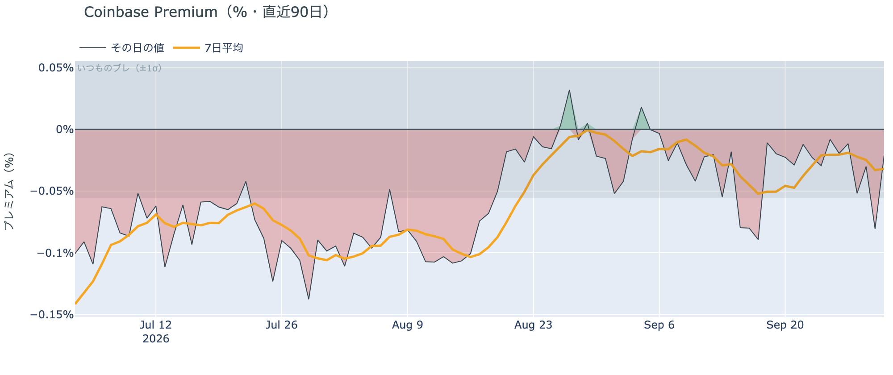

*図の見方: プラス＝アメリカで買いが強い。太線が1週間平均、細線がその日の値。薄い帯は「いつものブレの範囲」です。*

* Coinbase Premiumは1週間平均で−0.03%。前の週の−0.02%からマイナス幅がわずかに広がった。
* 木曜の値は−0.02%で、いつものブレの0.4倍。帯の内側にある。

アメリカの買い手は、木曜の上げを引っ張っていません。Coinbase Premium（＝アメリカとそれ以外の価格差）は1週間平均で小さなマイナスのままで、未明に価格が上げた木曜も、アメリカ側だけが高く買われた形は出ていません。

**図①-2 ETFの日ごとの資金の出入り（直近90日）**

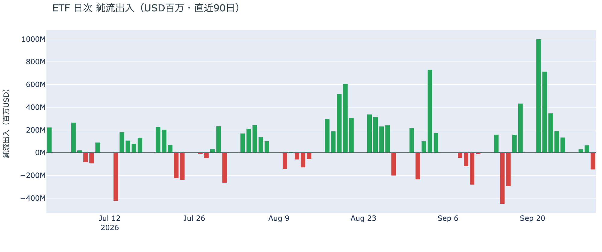

*図の見方: 入ったお金と出たお金の差。上に伸びれば入り超、下に伸びれば出超。*

| ETFの日ごとの出入り | 億ドル |
|---|---:|
| 9月25日 | +1.3 |
| 9月28日 | +0.3 |
| 9月29日 | +0.7 |
| 9月30日 | −1.5 |
| 直近7営業日の合計 | +13.4 |

* 入り超は9月17日から9営業日続いていた。7営業日の合計の大半は、9月21日から23日の3日間に入った分。
* 9月30日に出た額のうち1.3億ドルは、1本のファンドから出た分。

ETFの買い手は買いの手を止めましたが、逃げてはいません。9月30日は出超に転じたものの、出た額は、9月21日の1日に入った額の7分の1ほどです。価格が上げた10月1日の分は、まだ数字になっていません。

**図①-3 Fear & Greed（市場心理の指数・直近90日）**

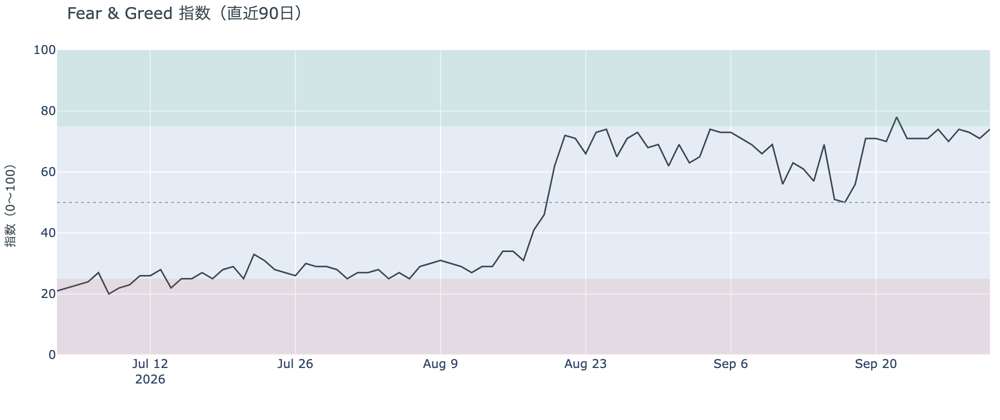

*図の見方: 0〜100で、50より上が「強欲」、下が「恐怖」。*

* 74の「強欲」。前日の71から3pt上がった。1週間前は71、1か月前は69。

市場の多数は、価格の下げを怖がっていません。Fear & Greed（＝市場心理の指数）は10月1日の確定値で「強欲」のままで、月曜と火曜に価格が$82,000台まで下げたあとも冷めていません。

### ② 長期保有者は利益の出たコインを手放し続けているが、量は前の週の半分強に細ったまま

**図②-1 長期保有者の保有量の30日変化とSOPR（直近90日）**

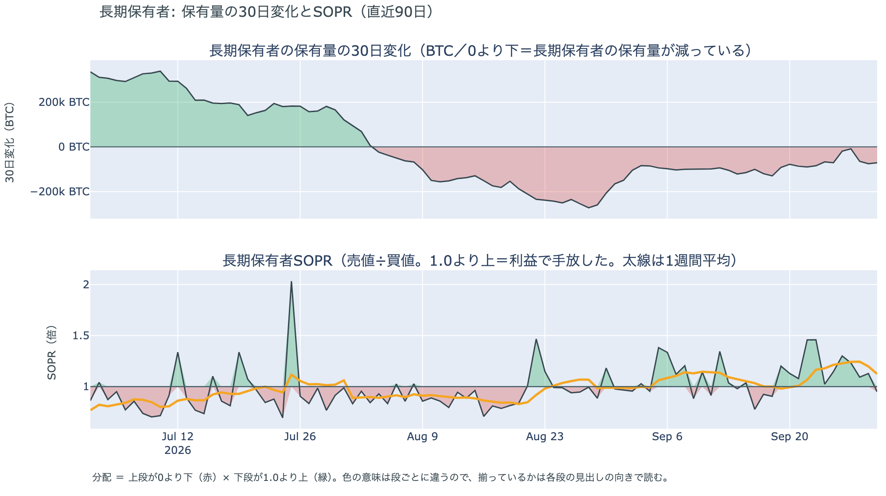

*図の見方: 上段は、長期保有者の保有量が30日でどれだけ増減したか。マイナス＝手放している。下段は長期保有者SOPRで、1より上なら利益で手放した。どちらも1週間平均で読みます。*

| 9月30日時点 | 1週間平均 | 前の週の平均 |
|---|---:|---:|
| 長期保有者SOPR（1より上＝利益で手放した） | 1.12 | 1.16 |
| 長期保有者の保有量の30日変化（万BTC） | −5.4 | −9.7 |

* 1か月前（8月31日）の−16.5万BTCと比べると3分の1。
* 1年以上動いていないコインは全体の63.2%で、3か月で1.6pt増えた。

長期保有者（＝155日以上動かしていないコインの持ち主）は利益の出たコインを手放し続けていますが、手放す勢いは強まっていません。保有量の30日変化がマイナスで、長期保有者SOPR（＝長期保有者が動かしたコインの売値÷買値）が1週間平均で1を上回っているので、これは分配（＝長期保有者からの放出）です。ただし手放す量は前の週の半分強に細ったままで、ETFや取引所が預かっている分を差し引いても、この規模と向きは変わりません。**ビットコイン自身の需給の土台は、前日と変わっていません。**

9月30日時点で、コインが最後に動いた価格の分布に大きな変化はなく、長く眠っていたコインが動いた記録もありません。マイナーの収入は平年をやや上回る程度（Puell Multiple（＝マイナー収入の平年比）が1週間平均で1.09）で、売りを急ぐ状況ではありません。

### ③ 先物：ロングが2日続けて積まれたが、過熱ではない

**図③-1 資金調達率と建玉（直近30日）**

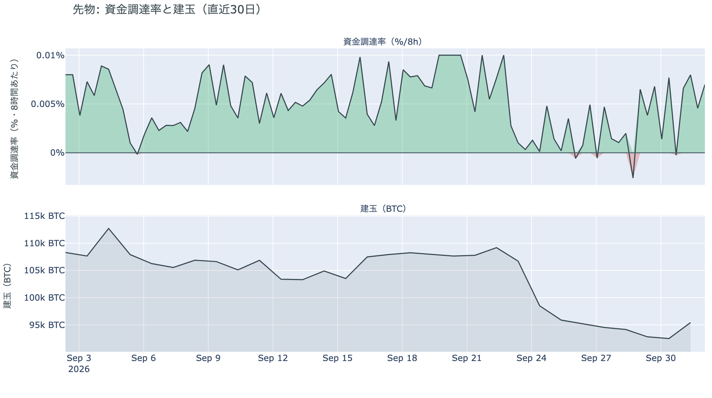

*図の見方: 上段は資金調達率（8時間ごと・日本時間）。プラスが続く＝ロングがショートより多い。下段は建玉。*

* 建玉は前日から1.7%増え、2日続けての増加。1週間前と比べると、まだ3.1%少ない。
* 資金調達率はプラスが4回連続（約1日あまり）。
* 短期金利を引いた上乗せは、前日は+1.10pt、直近34日の平均は+2.05pt。この34日でプラスだった日は74%。

先物の参加者は、先週いったん減らしたロングを積み直しています。ただし過熱ではありません。資金調達率の1日をならした年率は+7.13%で、短期金利（13週Tビル 3.98%）を引いた上乗せは+3.15pt。資金調達率がプラスのまま建玉が増えたので、積まれたのはロングです。それでも証拠金で張っている量は、減り始める前の9月23日より1割弱少ないままです。

### ④ オプション：今夜の雇用統計は「動くが、向きは決めない」。下げへの備えは10月末のFOMCに

オプションには2種類あります。コール（＝決めた価格で買う権利）とプット（＝決めた価格で売る権利）で、価格が上がればコールの価値が上がり、価格が下がればプットの価値が上がります。プットは「価格が下がったときの保険」として買われます。オプションを買う人は、その権利と引き換えに権利料（＝オプションを買う人が払う金額）を払います。

**図④-1 満期ごとのIV（年率%）**

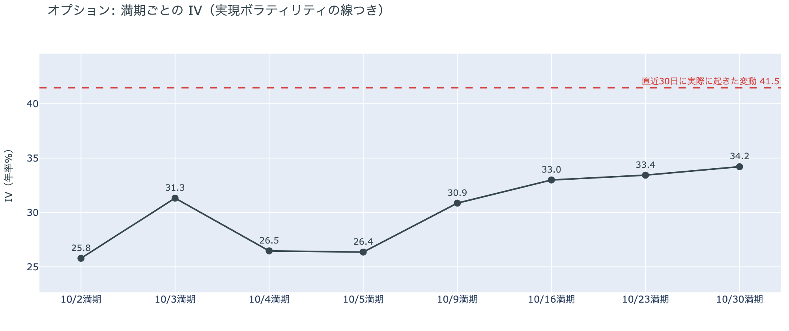

*図の見方: IVを満期ごとに並べたもの。点線は実現ボラティリティ。IVが点線より下なら、市場はこの先の値動きを過去の値動きより小さいと見ています。*

* IVは全体で35.2。実現ボラティリティ41.5より6.2pt低い。過去1年で見ると下から13%の低さ。
* 満期ごとに見ると、10月3日の満期が31.3で、前後の10月2日（25.8）と10月4日（26.5）より5ptほど高い。前日はこの差が2〜4ptだった。
* 10月9日から先は30.9〜34.2で、先の満期ほど高い平常の形。

オプションの参加者は、この先の値動きを怖がっていません。IV（＝値動きの幅の予想）は全体で実現ボラティリティ（＝実際に起きた値動きの幅）より低く、これから先の値動きを、これまでの値動きより小さいと見ています。例外は今夜21時30分の米雇用統計です。雇用統計をまたぐ最初の満期（＝権利の期限）である10月3日のオプションの権利料にだけ、前後の満期に対する上乗せが乗っています。

**図④-2 満期ごとのプットとコールの差**

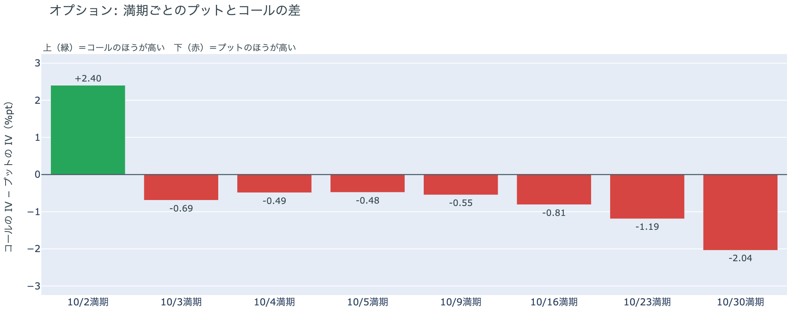

*図の見方: 満期ごとに、プットとコールのどちらが高く売れているか。ゼロより上ならコールのほうが高く、下ならプットのほうが高い。*

| 満期 | どちらが高いか |
|---|---|
| 10月2日（今日17時に切れる） | コールがはっきり高い |
| 10月3日 | プットがわずかに高い |
| 10月4日 | プットがわずかに高い |
| 10月5日 | プットがわずかに高い |
| 10月9日 | プットがわずかに高い |
| 10月16日 | プットが高い |
| 10月23日 | プットが高い |
| 10月30日 | プットがはっきり高い（差は満期の中で最大） |

* コールが高いのは、米雇用統計が出る前に切れる10月2日の満期だけ。
* 前日は全部の満期でプットが高く、差が最大だったのは10月3日の満期。木曜には、10月3日の差は前後の満期と同じ小ささになった。
* 10月3日から先は、満期が先になるほどプットとコールの差が大きい。

参加者は、今夜の米雇用統計で値が動くとは見ていますが、上か下かは決めていません。下げへの備えをいちばん厚く置いているのは、その先の10月末のFOMCです。雇用統計をまたぐ10月3日の満期は、IVに上乗せが乗っている（図④-1）のに、プットとコールの差はわずかです。プットがはっきり高いのは、10月27〜28日のFOMCをまたぐ10月30日の満期です。

**図④-3 12月25日満期の持ち高（権利の価格ごと）**

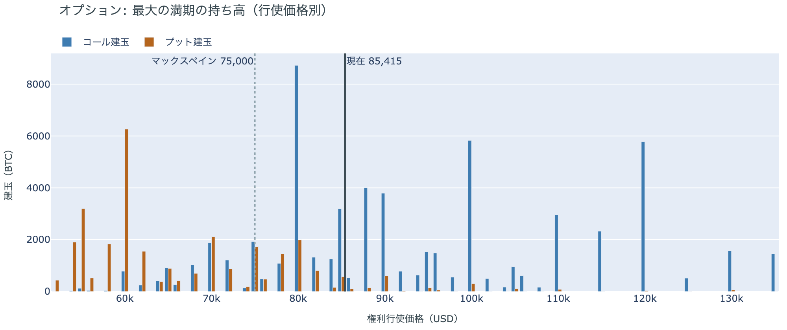

*図の見方: 青＝コール、橙＝プット。現値より上にコールが、下にプットが積まれるのが普通です。*

| 12月25日満期のオプション（価格は約$85,400） | 量（万BTC） | 意味 |
|---|---:|---|
| コール | 約7.4 | 「価格が上がる」に賭けた分 |
| プット | 約4.5 | 「価格が下がる」への保険 |
| うち、いまより15%以上高い価格のコール | 約3.5 | 大きな上げへの賭け |
| うち、いまより15%以上安い価格のプット | 約3.6 | 大きな下げへの保険 |

* 12月25日満期の持ち高は全部で約12.0万BTCと、全満期の33%で最も多い。前日まで最大だった10月30日満期と入れ替わったので、この図は今日から12月25日満期を描いている。
* コールが多い価格は$80,000（約0.9万BTC）、$100,000と$120,000（それぞれ約0.6万BTC）。プットが多い価格は$60,000（約0.6万BTC）と$40,000（約0.5万BTC）。
* 満期をまたいで持ち高が集まっている価格は、多い順に$85,000、$84,000、$90,000、$86,000、$95,000。いまの価格は、この帯の中にある。

年末に向けて、参加者は大きな上げにも大きな下げにも、同じ厚さで構えています。12月25日満期は全体ではコールがプットの1.6倍ありますが、いまより15%以上高い価格のコールと、15%以上安い価格のプットはほぼ同じ量です。年末までの向きについて、オプションの持ち高は上にも下にも決め打ちしていません。

## 4. 価格に影響しうる直近のイベント

今朝の時点でオプション市場が備えを置いているのは、IVに上乗せが乗っている10月3日の満期と、プットがはっきり高い10月30日の満期です。10月3日の満期に当たるのは今夜の米雇用統計、10月30日の満期に当たるのは10月27〜28日のFOMCです。

| 日付 | イベント | 何に効くか |
|---|---|---|
| 10/2（金）21:30 日本時間 | 米9月の雇用統計。事前の予想は雇用者数が9万人前後の増加、失業率は4.1%で横ばい | 金利。10月のFOMCで利上げするかの材料。10月3日満期のオプションがまたぐ |
| 日程未定 | ホルムズ海峡の再開をめぐる米国とイランの協議（カタールが仲介）。トランプ大統領は10月1日に攻撃の可能性を示唆した | 原油 |
| 10/14（水）21:30 日本時間 | 米9月のCPI（＝米国の物価統計）。10月のFOMCの前に出る | 金利 |
| 10/27（火）〜28（水） | FOMC。利上げの織り込みは3割前後。結果は日本時間29日未明 | 金利 |
| 10/30（金）17:00 | オプションの大きな満期。FOMCの2日後 | プットがいちばん高く値付けされている満期 |
| 締め切り日は未公表 | 米SECが10月1日に公表した、暗号資産の保管に関する規則案の意見募集（60日間） | 規制 |
| 12/25（金）17:00 | オプションの最も大きな満期（約12.0万BTC、全満期の33%） | 年末までの上げへの賭けと、下げへの保険の期限 |

## まとめ：木曜日の動きは何だったか

木曜日は、10月のFOMCで利上げするという見方が後退したことをきっかけに、先物のショートの清算と新しいロングを通って$85,244まで上げ、その大半を残した日でした。動いたのは先物の持ち高までで、アメリカの買い手は上げに加わらず、長期保有者も手放す勢いを強めていません。先物の参加者はロングを積み直していますが、過熱ではありません。オプションの参加者は、今夜の米雇用統計で値が動くとは見ながら向きは決めておらず、下げへの備えをいちばん厚く置いているのは10月末のFOMCです。

---

<small>（数値は10月2日7時5分（日本時間）までのデータに基づきます。価格・先物・オプションはその時点の値、市場心理は10月1日の確定値、オンチェーン（＝ブロックチェーン上の記録）は9月30日時点、ETF資金フローは9月30日分までで、10月1日分はまだ出ていません。証券市場の終値は10月1日時点です。オンチェーンの長期保有者の数値には、ETFや取引所が預かっている分も含まれます。オプションはDeribit（BTCオプションの大半を占める取引所）の全銘柄です。）</small>

*本稿は情報提供を目的としたものであり、投資助言ではありません。将来の価格動向を保証・示唆するものではなく、投資判断は各自の責任において行ってください。*
