# $87,249へ上げて一晩で全部戻す ― 雇用統計の前に積まれたロングが剥がれ、現物の買い手は動かず

**2026年10月3日**

金曜日は、昼から夜にかけて上げた分を、未明までに全部戻した日です。

* **価格**：米雇用統計の直後に$87,249まで上げ、未明に$83,850まで下げて、朝7時5分の時点で約$84,471（24時間前より−0.3%）
* **きっかけ**：米9月の雇用統計が予想を大きく下回り、10月のFOMC（＝米国の金利を決める会合）で利上げするという見方がさらに後退した。ただし上げの大半は統計の前に起きている
* **先物**：上げも下げも運んだ。昼の上げでは売り持ち（ショート）の多数が清算（＝証拠金不足で強制的に閉じられた取引）され、未明の下げでは買い持ち（ロング）の多数が清算された。建玉は増えたが、ロングの傾きは弱まった
* **需給の土台**：米国の買い手と長期保有者は動いていない
* **オプションの見方**：雇用統計をまたぐ満期だけに乗っていた、ほかの満期に対する上乗せは剥がれた。来週の満期はコールが高い側へ入れ替わり、下げへの備えは10月16日から先にある。いちばん厚いのは10月末のFOMCをまたぐ満期

## 1. 何が起きたか

**図1-1 価格の推移（1時間足・直近7日）**

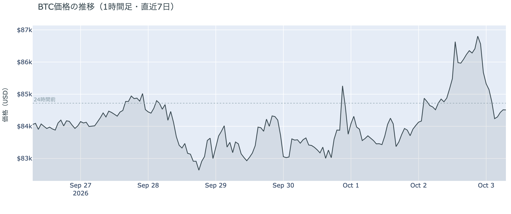

*図の見方: 1時間ごとの価格（日本時間）。右端の金曜に、点線の上へ立ち上がった山が、そのまま点線の下まで下りています。*

* 朝7時5分の時点で約$84,471。24時間の値幅は4.0%で、この1週間でいちばん広い。
* 24時間前と比べて−0.3%。直近の確定した日足終値は10月1日の$84,849。

金曜日は、上げを一晩で全部戻した日で、往復の幅はこの1週間でいちばん大きなものでした。上げの大半は雇用統計が出る前の昼に起きていて、統計の直後に伸びた分は1時間ほどしか持ちませんでした。

**図1-2 価格と50日・200日移動平均**

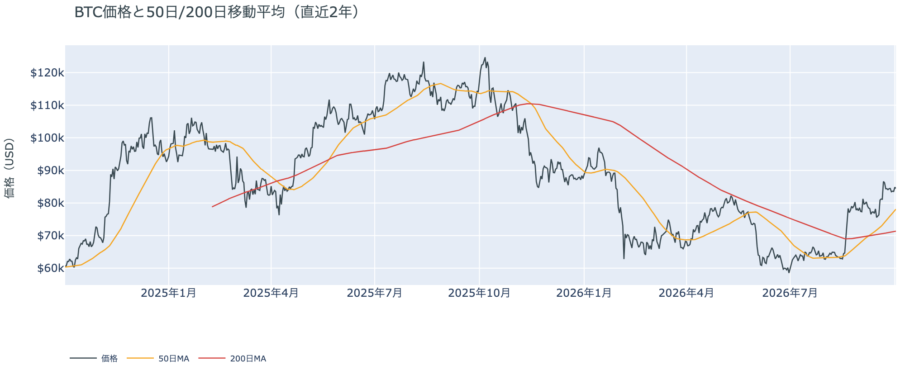

*図の見方: 2本の平均線の上下関係を見ます。50日線が200日線の上にあるのがゴールデンクロスです。*

* 50日線と200日線の差は約$6,749（9.5%）で、前日からさらに開いた。
* 価格は50日線の8.1%上。

長い目で見た流れの向きは、金曜の往復でも変わっていません。ゴールデンクロス（＝50日線が200日線を上抜けること）の状態は25日目です。

**図1-3 実際に起きた清算（Hyperliquid・直近24時間）**

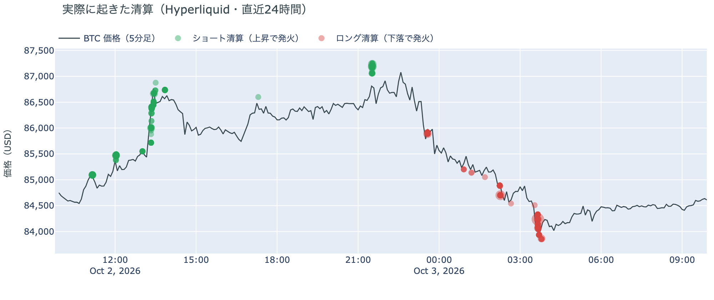

*図の見方: 価格の線に、清算が起きた時刻と価格を点で重ねたもの（日本時間）。緑はショートの清算で上昇のときに、赤はロングの清算で下落のときに起きます。*

* 全体ではショートの清算が6割で、最大の1件は全体の3分の1。
* 清算は$84,000台から$87,000台に散らばり、1つの価格帯に偏っていない。

金曜の往復は、上げも下げも多数の清算を伴い、大口が1つ飛んだ形ではありません。Hyperliquid（＝オンチェーンの先物取引所）で見える範囲では、昼の上げでショートが、未明の下げでロングが清算されました。清算と値動きは同じ時間に起きるので、どちらが先かはこのデータでは決まりません。

証券市場は金曜10月2日、S&P500が+0.73%の7,722、金が−0.72%の$4,172、原油が−1.73%の$91.26でした。米10年債利回りは雇用統計の直後にいったん下げたあと上げに転じ、5.28%で終えています。ビットコインが未明に下げたのは、株が上げた米国の取引時間と重なります。

## 2. なぜ動いたか：きっかけと、需給のどこが動いたか

**図2-1 ビットコインと株・金・原油の相対推移（起点＝100）**

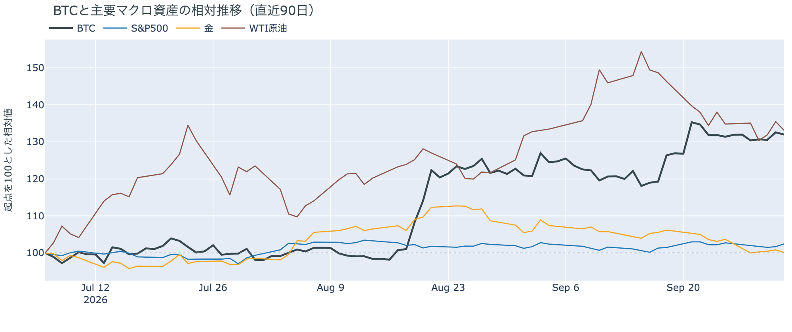

*図の見方: 同じ起点から何%動いたかで重ねたもの。線が同じ向きなら「共通のきっかけがありえた」、ビットコインだけ別の向きなら「ビットコインに固有のきっかけがありえた」と読みます。*

| この5営業日の動き（ビットコインは7日間） | 変化 |
|---|---:|
| ビットコイン | +0.5% |
| 金 | −3.5% |
| 米国株（S&P500） | −0.3% |
| 原油 | −1.2% |

* 建玉は98,561BTCで、1週間前より1.1%多い。
* 短期金利を引いた上乗せは+1.08ptで、前日の+3.15ptから縮んだ。

金曜日にビットコインが$87,249まで上げて一晩で戻したのは、弱い米雇用統計で利上げの見方が後退する流れを、先物のショートの清算で昼に先回りして上げ、未明にはロングの清算で下げたからです。

1. きっかけ：外部環境の出来事です。金曜21時30分の米9月の雇用統計は、雇用者数の増加が2.9万人と事前の予想（8万人台）を大きく下回り、失業率は4.2%へ上がりました。10月27〜28日のFOMCで利上げを見送る織り込みは8割弱へ上がり、利上げの織り込みはこの1週間で7割から2割へ下がっています。ただし、ビットコインの上げの大半は統計が出る前の昼に起きていて、株が統計のあとも上げて終えたのに、ビットコインは未明に下げました。利上げ観測の後退だけでは、未明の下げは説明がつきません。
2. 伝わり方：先物です。昼の上げで多数のショートが清算され、建玉（＝先物の未決済残高。証拠金で張っている人の量）は増えました。ところが未明には、統計の前に積まれたロングが下げの途中で次々に清算され、資金調達率（＝ロングが払う金利。プラス＝ロングがショートより多い）から短期金利（＝ドルを米国の短期国債で持つだけで受け取れる金利）を引いた上乗せは、前日の3分の1に縮みました。統計の前に積まれたロングが、統計のあとに剥がれたということです。現物は上げにも下げにも加わっていません。アメリカ側だけが高く買われた形は出ておらず（図①-1）、長期保有者も10月1日時点で減り方を前の週より小さくしています（図②-1）。

前日は「利上げの見方が後退したことをきっかけに、ショートの清算と新しいロングを通って上げた」と説明しました。金曜も昼は同じ道で上げましたが、夜に利上げ観測がさらに後退したのに上げは残らず、ロングの清算で戻しました。きっかけと通り道は前日と同じで、違いは、積まれたロングが一晩で剥がれたことです。

外部環境では、イランをめぐる動きが続いています。米軍は3隻目の空母を含む艦隊と約9,000人の部隊を中東へ向かわせ、ホワイトハウスは「いまは交渉は行われていない」として、攻撃を含む選択肢を残したままです。原油は$91台へ下げましたが、リスク資産全体の重しになりうる状況は変わっていません。

## 3. 市場参加者はいまどう見ているか

### ① アメリカの買い手は往復に加わらず、手を止めているが、逃げてはいない

**図①-1 Coinbase Premium（アメリカとそれ以外の価格差・直近90日）**

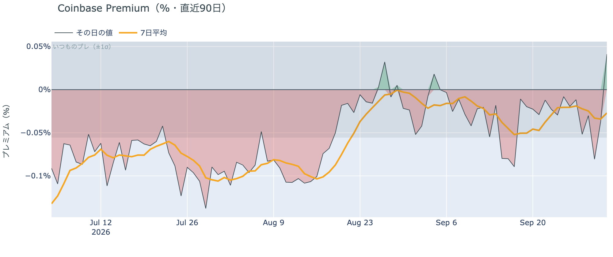

*図の見方: プラス＝アメリカで買いが強い。太線が1週間平均、細線がその日の値。薄い帯は「いつものブレの範囲」です。*

* 1週間平均は−0.03%で、前の週の−0.02%からマイナス幅がわずかに広がった。
* 金曜の値は+0.04%で、いつものブレの0.7倍。

アメリカの買い手は、金曜の上げも下げも引っ張っていません。Coinbase Premium（＝アメリカとそれ以外の価格差）は1週間平均で小さなマイナスのままで、価格が$87,000台まで上げた金曜も、アメリカ側だけが高く買われた形は出ていません。

**図①-2 ETFの日ごとの資金の出入り（直近90日）**

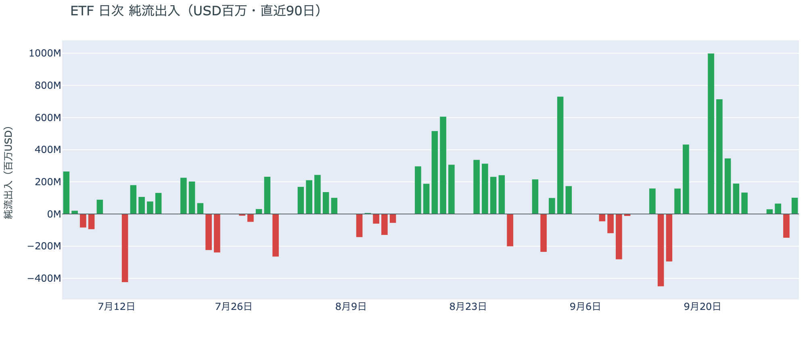

*図の見方: 入ったお金と出たお金の差。上に伸びれば入り超、下に伸びれば出超。*

| ETFの日ごとの出入り | 億ドル |
|---|---:|
| 9月28日 | +0.3 |
| 9月29日 | +0.7 |
| 9月30日 | −1.5 |
| 10月1日 | +1.0 |
| 直近7営業日の合計 | +7.2 |

* 10月1日の入り超のうち2.0億ドルは1本のファンドに入った分で、ほかの多くのファンドは小さな出超。

ETFの買い手は、手を止めているものの逃げてはいません。9月30日の出超は1日で終わり、10月1日は入り超に戻りましたが、入った額は9月下旬に日ごとに入っていた額の3分の1ほどです。金曜の往復の分は、まだ数字になっていません。

**図①-3 Fear & Greed（市場心理の指数・直近90日）**

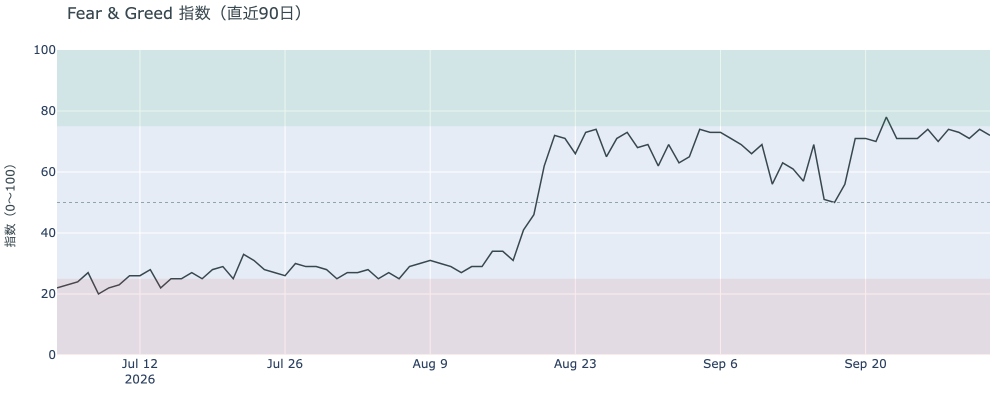

*図の見方: 0〜100で、50より上が「強欲」、下が「恐怖」。*

* 72の「強欲」。前日の74から2pt下がり、1週間前は71、1か月前は63。

市場の多数は、金曜の往復を怖がっていません。Fear & Greed（＝市場心理の指数）は10月2日の確定値で「強欲」のままで、この1週間ほぼ同じ水準にあります。

### ② 長期保有者は利益確定の売りを続けているが、減り方は前の週の6割に縮んだ

**図②-1 長期保有者の保有量の30日変化とSOPR（直近90日）**

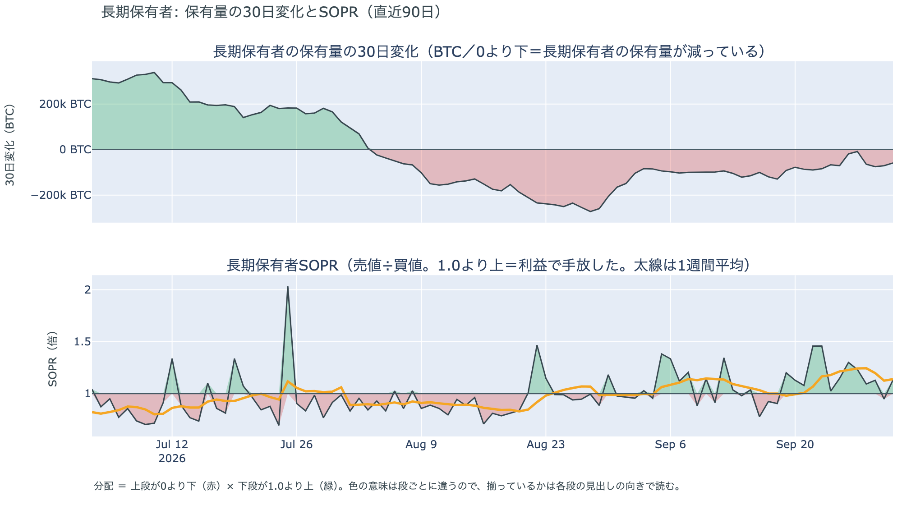

*図の見方: 上段は、長期保有者の保有量が30日でどれだけ増減したか。マイナス＝手放している。下段は長期保有者SOPRで、1より上なら利益で手放した。どちらも1週間平均で読みます。*

| 10月1日時点 | 1週間平均 | 前の週の平均 |
|---|---:|---:|
| 長期保有者SOPR（1より上＝利益で手放した） | 1.14 | 1.18 |
| 長期保有者の保有量の30日変化（万BTC） | −5.3 | −9.0 |

* 1か月前（9月1日）の−14.9万BTCと比べると3分の1。

長期保有者（＝155日以上保有者）は利益確定の売りを続けていますが、減り方は前の週より小さくなっています。保有量は30日で減り、動いたコインは平均して買値より高く動いています。**ビットコイン自身の需給の土台は、前日と変わっていません。**

10月1日時点で、コインが最後に動いた価格の分布に大きな変化はなく、長く眠っていたコインが動いた記録もありません。マイナーの収入は平年をやや上回る程度（Puell Multiple（＝マイナー収入の平年比）が1週間平均で1.09）で、売りを急ぐ状況ではありません。

### ③ 先物：ロングは積まれたままだが、傾きは一晩で弱まった

**図③-1 資金調達率と建玉（直近30日）**

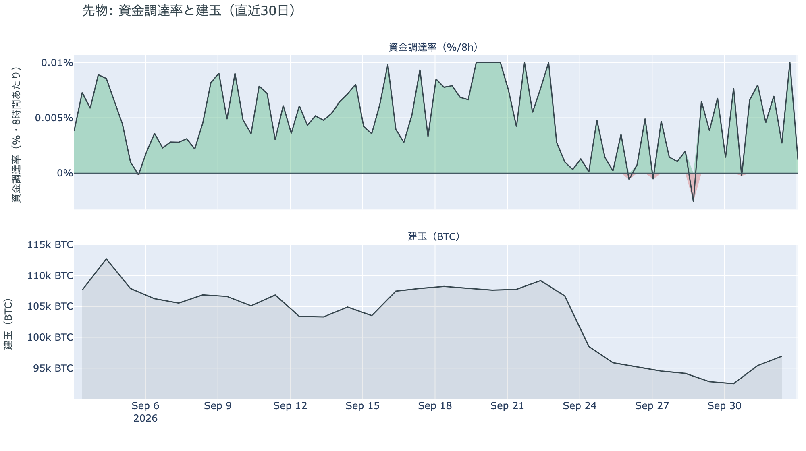

*図の見方: 上段は資金調達率（8時間ごと・日本時間）。プラスが続く＝ロングがショートより多い。下段は建玉。*

* 建玉は1週間前より1.1%多いが、減り始める前の9月23日の水準にはまだ届いていない。
* 短期金利を引いた上乗せの直近34日の平均は+1.82pt。

先物の参加者は、ロングを積んだまま降りてはいませんが、一晩で傾きを弱めました。資金調達率の1日をならした年率は+5.08%で、短期金利（13週Tビル 3.99%）を引いた上乗せは+1.08pt。建玉が増えているのに上乗せが縮んだのは、昼に積まれたロングの一部が未明に清算され、残ったロングの傾きが前日より小さくなったからです。ロングに傾いてはいますが、過熱ではありません。

### ④ オプション：雇用統計の身構えは解け、来週は荒れないと値付け。下げへの備えは10月16日から先に

オプションには2種類あります。コール（＝決めた価格で買う権利）とプット（＝決めた価格で売る権利）で、価格が上がればコールの価値が上がり、価格が下がればプットの価値が上がります。プットは「価格が下がったときの保険」として買われます。オプションを買う人は、その権利と引き換えに権利料（＝オプションを買う人が払う金額）を払います。

**図④-1 満期ごとのIV（年率%）**

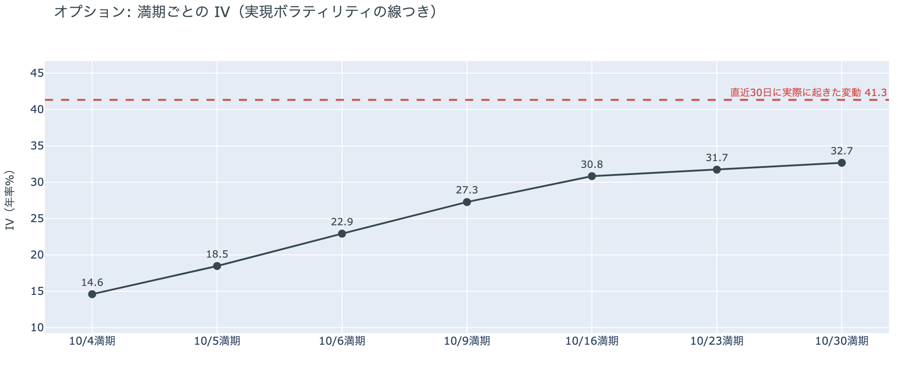

*図の見方: IVを満期ごとに並べたもの。点線は実現ボラティリティ。IVが点線より下なら、市場はこの先の値動きを過去の値動きより小さいと見ています。*

* IVは全体で34.8。実現ボラティリティ41.3より6.5pt低く、過去1年で下から4%の低さ。
* 満期ごとのIVは、いちばん手前の10月4日の14.6から10月30日の32.7まで、先ほど高い平常の形。

オプションの参加者は、雇用統計を通過して、この先の値動きを怖がっていません。IV（＝値動きの幅の予想）は全体で実現ボラティリティ（＝過去の値動きの幅）より低く、この1年でいちばん低い部類にあります。前日まで雇用統計をまたぐ満期（＝権利の期限）のオプションの権利料にだけ乗っていた、ほかの満期に対する上乗せは、統計が出て剥がれました。

**図④-2 満期ごとのプットとコールの差**

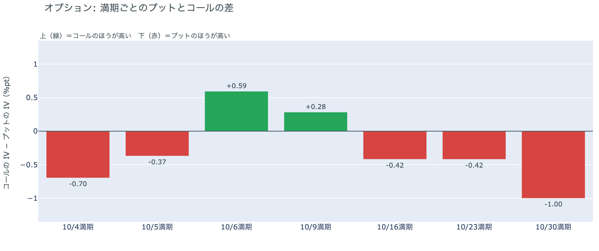

*図の見方: 満期ごとに、プットとコールのどちらが高く売れているか。ゼロより上ならコールのほうが高く、下ならプットのほうが高い。*

| 満期 | どちらが高いか |
|---|---|
| 10月4日 | プットがわずかに高い |
| 10月5日 | プットがわずかに高い |
| 10月6日 | コールが高い |
| 10月9日 | コールが高い |
| 10月16日 | プットが高い |
| 10月23日 | プットが高い |
| 10月30日 | プットがはっきり高い（差は満期の中で最大） |

* 10月6日と10月9日の満期は、前日はプットがわずかに高かったが、金曜にコールが高い側へ入れ替わった。

参加者は、来週は荒れないと値付けし、下げへの備えを10月16日から先の満期に置いています。来週の満期はコールのほうが高く、「価格が上がる」側に賭けている人のほうが多い形です。プットがいちばんはっきり高いのは、10月27〜28日のFOMCをまたぐ10月30日の満期です。

**図④-3 10月30日満期の持ち高（権利の価格ごと）**

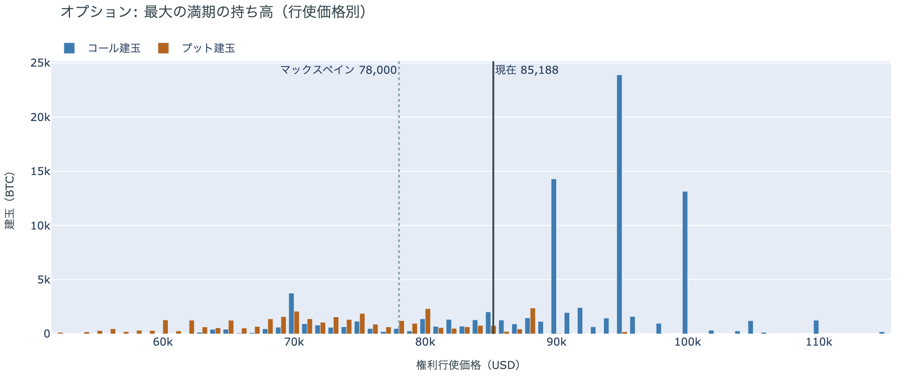

*図の見方: 青＝コール、橙＝プット。現値より上にコールが、下にプットが積まれるのが普通です。*

| 10月30日満期のオプション（価格は約$85,200） | 量（万BTC） | 意味 |
|---|---:|---|
| コール | 約8.8 | 「価格が上がる」に賭けた分 |
| プット | 約3.4 | 「価格が下がる」への保険 |
| うち、いまより15%以上高い価格のコール | 約1.8 | 大きな上げへの賭け |
| うち、いまより15%以上安い価格のプット | 約1.7 | 大きな下げへの保険 |

* 10月30日満期の持ち高は約12.3万BTCと全満期の35%で、前日まで最大だった12月25日満期と入れ替わった。
* コールがいちばん集まっている価格は$95,000で約2.4万BTC、次が$90,000の約1.4万BTC。

「価格が上がる」に賭けた人たちは、金曜の往復でも降りていません。コールがプットの2.5倍あり、その大半はいまより高い価格に積まれています。その賭けが報われるには、10月30日までに$90,000を超える必要があります。

## 4. 価格に影響しうる直近のイベント

今朝の時点でオプション市場が備えを置いているのは10月16日から先の満期で、いちばん厚いのは10月27〜28日のFOMCをまたぐ10月30日の満期です。来週の10月6日と10月9日の満期はコールが高く、来週の米サービス業の景況感指数とFOMC議事録に対しては、備えは置かれていません。

| 日付 | イベント | 何に効くか |
|---|---|---|
| 10/4（日） | OPEC+の会合。サウジアラビア・ロシアなど7か国が、11月の生産量を決める | 原油 |
| 10/5（月）23:00 日本時間 | 米9月のサービス業の景況感指数（ISM非製造業） | 金利 |
| 10/8（木）3:00 日本時間 | 9月のFOMCの議事録。10月の利上げを見送る織り込みは8割弱 | 金利 |
| 日程未定 | ホルムズ海峡の再開をめぐる米国とイランの協議（カタールが仲介）。ホワイトハウスは「いまは交渉は行われていない」としている | 原油 |
| 10/14（水）21:30 日本時間 | 米9月のCPI（＝米国の物価統計）。10月のFOMCの前に出る最後の物価統計 | 金利 |
| 10/27（火）〜28（水） | FOMC。利上げを見送る織り込みは8割弱。結果は日本時間29日未明 | 金利 |
| 10/30（金）17:00 | オプションの最も大きな満期（約12.3万BTC、全満期の35%）。FOMCの2日後 | プットがいちばん高く値付けされている満期。$90,000以上のコールの期限 |
| 締め切り日は未公表 | 米SEC（証券取引委員会）が10月1日に公表した、暗号資産の保管に関する規則案の意見募集（60日間） | 規制 |

## まとめ：金曜日の動きは何だったか

金曜日は、弱い米雇用統計で利上げの見方が後退する流れを、先物のショートの清算で昼に先回りして$87,249まで上げ、未明にはロングの清算で$84,000台へ戻した日でした。動いたのは先物の持ち高までで、アメリカの買い手は上げにも下げにも加わらず、長期保有者の利益確定の売りも減り方が小さくなったままです。先物のロングは積まれたままですが、傾きは一晩で弱まりました。オプションの参加者は雇用統計を通過してこの先を怖がっておらず、下げへの備えは10月末のFOMCをまたぐ満期に置いたままです。

---

<small>（数値は10月3日7時5分（日本時間）までのデータに基づきます。価格・先物・オプションはその時点の値、市場心理は10月2日の確定値、オンチェーン（＝ブロックチェーン上の記録）は10月1日時点、ETF資金フローは10月1日分までで、10月2日分はまだ出ていません。証券市場の終値は10月2日時点です。オンチェーンの長期保有者の数値には、ETFや取引所が預かっている分も含まれます。オプションはDeribit（BTCオプションの大半を占める取引所）の全銘柄です。）</small>

*本稿は情報提供を目的としたものであり、投資助言ではありません。将来の価格動向を保証・示唆するものではなく、投資判断は各自の責任において行ってください。*
