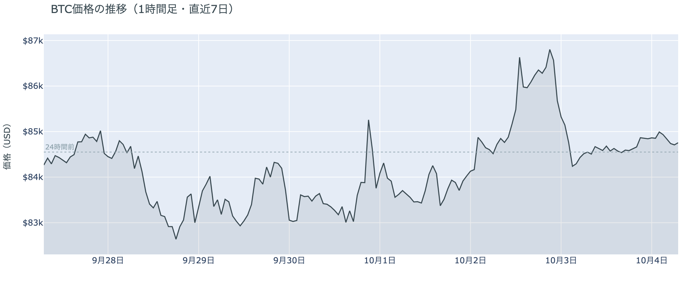
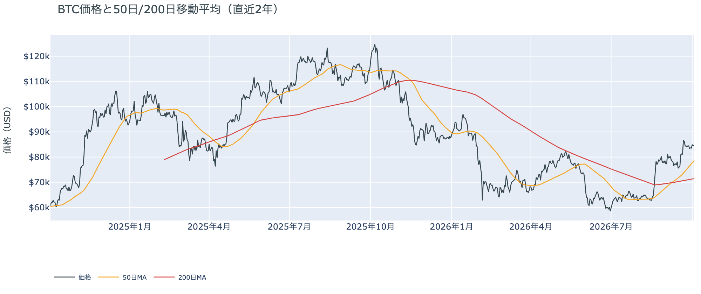
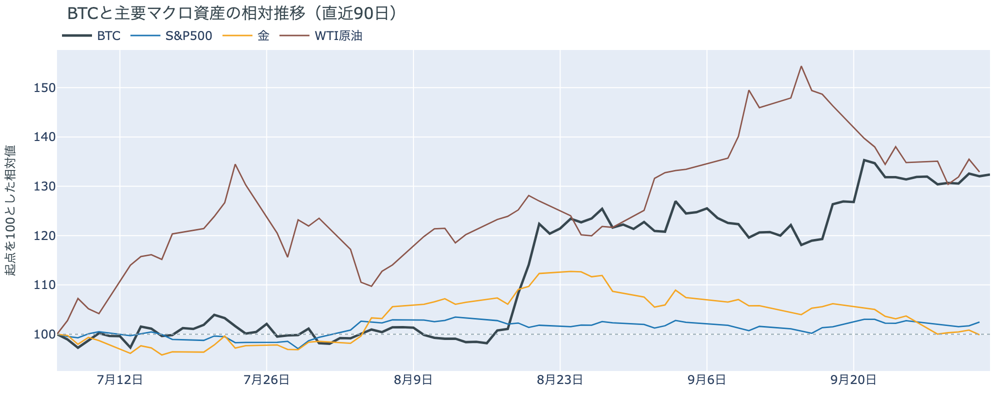
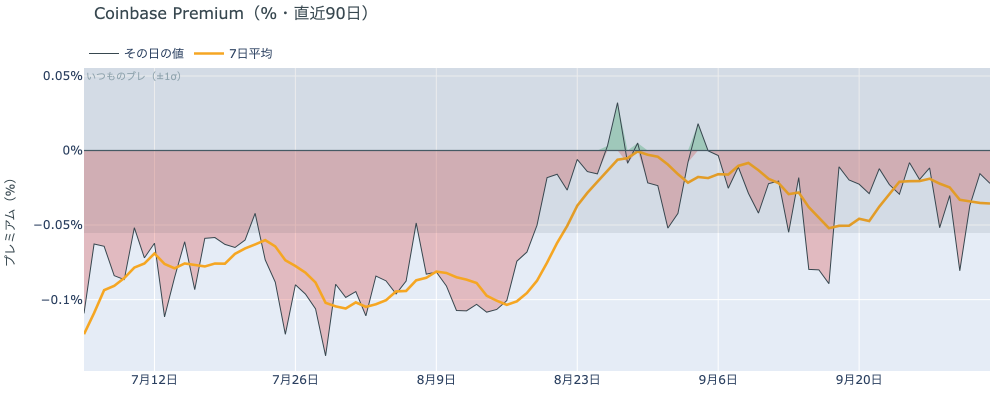
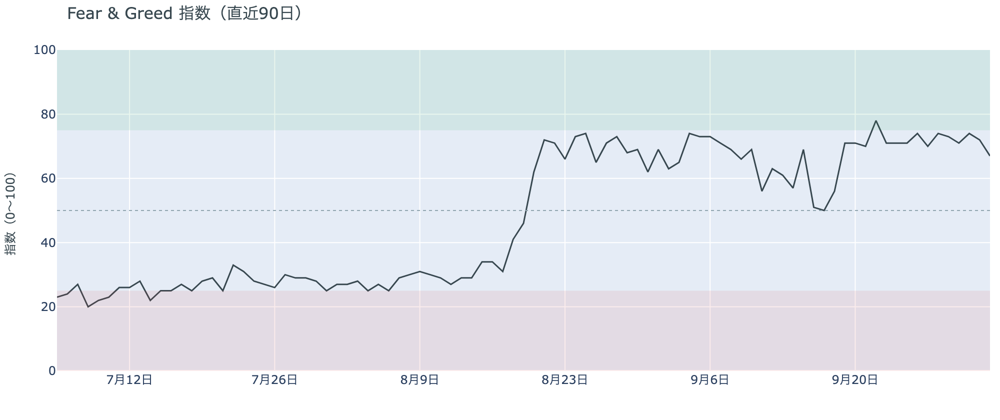
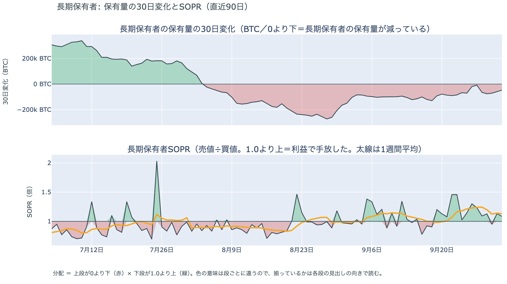
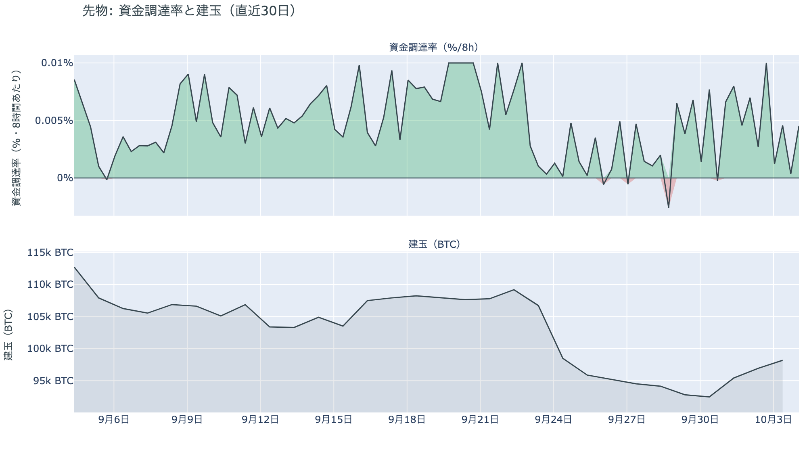
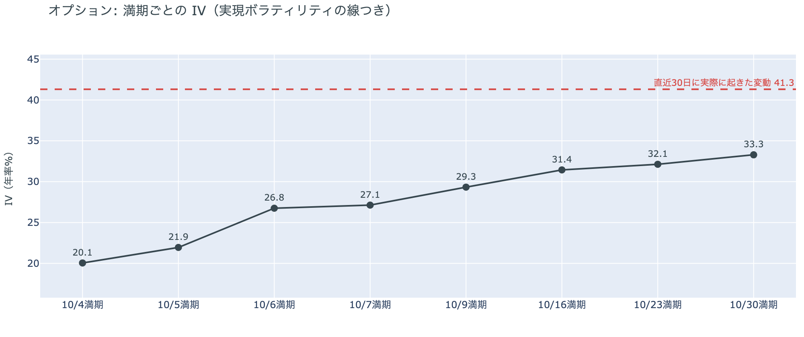
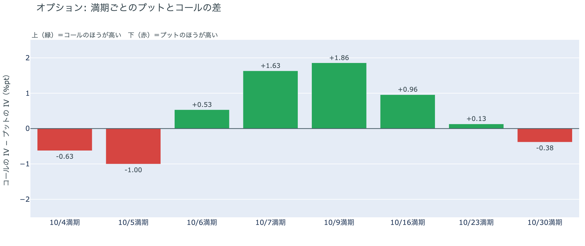
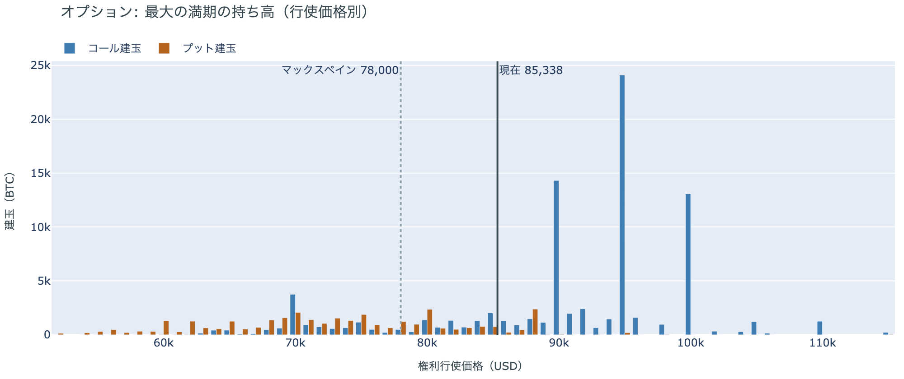

# 値幅0.7%の土曜、資金調達率は短期金利を下回る ― 10月16日・23日の満期はコールが高い側へ

**2026年10月4日**

土曜日は、金曜の往復のあとで、ほとんど動かなかった日です。

* **価格**：24時間の値幅は$84,425〜$85,022の0.7%で、朝7時5分の時点で約$84,731（24時間前より+0.2%）
* **きっかけ**：新しいきっかけは来なかった。証券市場は週末で閉まっていた
* **先物**：金曜に手仕舞われた買い持ち（ロング）は積み直されなかった。資金調達率（＝ロングが払う金利。プラス＝ロングがショートより多い）はプラスのままだが、短期金利（＝ドルを米国の短期国債で持つだけで受け取れる金利）を下回った
* **需給の土台**：米国の買い手は手を止めたまま、長期保有者の利益確定の売りは続いているが強まっていない
* **オプションの見方**：この先の値動きを怖がっていない。前日はプットが高かった10月16日と10月23日の満期がコールの高い側へ移り、プットが高い満期は目先の2日と、10月末のFOMC（＝米国の金利を決める会合）をまたぐ10月30日だけになった

## 1. 何が起きたか

**図1-1 価格の推移（1時間足・直近7日）**

*図の見方: 1時間ごとの価格（日本時間）。金曜の山のあと、右端の土曜は線が点線のそばでほぼ平らです。*

* 24時間の値幅は0.7%で、前日の4.0%の6分の1。
* Hyperliquidで見える清算は3件だけで、最大の1件が全体の4分の3。

土曜日は、この1週間でいちばん静かな24時間でした。金曜の往復で多数出た清算（＝証拠金不足で強制的に閉じられた取引）は、土曜日にはほとんど出ていません。Hyperliquid（＝オンチェーンの先物取引所）で見えたのは日曜の3時台に売り持ち（ショート）の大口が1つ清算された分だけで、値動きの速い時間には重なっていません。

**図1-2 価格と50日・200日移動平均**

*図の見方: 2本の平均線の上下関係を見ます。50日線が200日線の上にあるのがゴールデンクロスです。*

* 50日線と200日線の差は約$7,130（10.0%）で、前日の約$6,749からさらに開いた。
* 価格は50日線の7.9%上。

長い目で見た流れの向きは変わっていません。ゴールデンクロス（＝50日線が200日線を上抜けること）の状態が26日目で、2本の平均線の差は開き続けています。

証券市場は週末で休みです。金曜10月2日は米国株（S&P500）が+0.73%で終わっていて、外部環境から週末へ持ち越された売りの材料はありません。

## 2. なぜ動いたか：きっかけと、需給のどこが動いたか

**図2-1 ビットコインと株・金・原油の相対推移（起点＝100）**

*図の見方: 同じ起点から何%動いたかで重ねたもの。線の向きが揃っているかを見ます。*

| この5営業日の動き（ビットコインは7日間） | 変化 |
|---|---:|
| ビットコイン | +0.4% |
| 金 | −3.7% |
| 米国株（S&P500） | −0.3% |
| 原油 | −1.4% |

* 建玉は97,415BTCで、前日の98,561BTCから1.2%減った。
* 資金調達率から短期金利を引いた上乗せは−0.54ptで、前日の+1.08ptからマイナスへ移った。

土曜日に価格が動かなかったのは、新しいきっかけが来ず、金曜に手仕舞われた先物のロングが積み直されなかったからです。

1. きっかけ：ありません。証券市場は週末で閉まっていて、株・金・原油・金利から新しい材料は来ませんでした。金曜の米雇用統計のあと、10月27〜28日のFOMCで利上げする織り込みは約2割（1週間前は約6割）で、土曜日にこれを動かす出来事は出ていません。この1週間でビットコインはほぼ横ばい、金は大きく下げていて、同じ向きには動いていません（図2-1）。
2. 伝わり方：先物が動かなかったので、価格も動きませんでした。建玉（＝先物の未決済残高。証拠金で張っている人の量）は価格が横ばいのまま小さく減り、新しいロングもショートも積まれていません。資金調達率はプラスを保っていますが、短期金利を引いた上乗せはマイナスになりました。現物も動いていません。アメリカ側だけが高く買われた形は出ておらず（図①-1）、長期保有者も10月2日時点で減り方を前の週より小さくしています（図②-1）。

前日は「米雇用統計を見込んで積まれたロングが、米雇用統計のあとに手仕舞われた」と説明しました。手仕舞いが一時的なものだったなら、土曜日にロングが積み直されて建玉が増え、資金調達率の上乗せも戻るはずです。どちらも起きていないので、前日の説明は今日の数値と合っています。

原油をめぐっては、OPEC+の会合が今日10月4日に開かれます。ホルムズ海峡の再開をめぐる協議にも、この週末に新しい決定は出ていません。どちらも、土曜のビットコインの値動きに効いた形跡はありません。

## 3. 市場参加者はいまどう見ているか

### ① アメリカの買い手は手を止めたままで、逃げてはいない

**図①-1 Coinbase Premium（アメリカとそれ以外の価格差・直近90日）**

*図の見方: プラス＝アメリカで買いが強い。太線が1週間平均、細線がその日の値。薄い帯は「いつものブレの範囲」です。*

* 1週間平均は−0.04%で、前の週の−0.02%からわずかに下向き。
* 土曜の値は−0.02%で、いつものブレの0.4倍。

アメリカの買い手は、手を止めたままです。Coinbase Premium（＝アメリカとそれ以外の価格差）は1週間平均で小さなマイナスが続いていて、買いに戻った形も、売りに回った形も出ていません。

**図①-2 ETFの日ごとの資金の出入り（直近90日）**

*図の見方: 入ったお金と出たお金の差。上に伸びれば入り超、下に伸びれば出超。*

| ETFの日ごとの出入り | 億ドル |
|---|---:|
| 9月29日 | +0.7 |
| 9月30日 | −1.5 |
| 10月1日 | +1.0 |
| 10月2日 | +0.3 |
| 直近7営業日の合計 | +4.1 |

* 10月2日の入り超は、ほぼ全額が1本のファンドに入った分。

ETFの買い手は、金曜の往復に加わっていません。価格が$87,000台まで上げて戻した10月2日も入り超は小さく、資金が大きく入ることも、出ていくこともありませんでした。入り超は続いていますが、9月下旬に日ごとに入っていた額よりずっと小さいままです。

**図①-3 Fear & Greed（市場心理の指数・直近90日）**

*図の見方: 0〜100で、50より上が「強欲」、下が「恐怖」。*

* 67の「強欲」。前日の72から5pt下がり、1週間前は74、1か月前は65。

市場の多数は、金曜の往復を怖がっていません。Fear & Greed（＝市場心理の指数）は10月3日の確定値で少し下がりましたが、「強欲」の側にとどまっていて、1か月前とほぼ同じ水準です。

### ② 長期保有者は利益確定の売りを続けているが、減り方は前の週より小さい

**図②-1 長期保有者の保有量の30日変化とSOPR（直近90日）**

*図の見方: 上段は、長期保有者の保有量が30日でどれだけ増減したか。マイナス＝手放している。下段は長期保有者SOPRで、1より上なら利益で手放した。どちらも1週間平均で読みます。*

| 10月2日時点 | 1週間平均 | 前の週の平均 |
|---|---:|---:|
| 長期保有者SOPR（1より上＝利益で手放した） | 1.13 | 1.21 |
| 長期保有者の保有量の30日変化（万BTC） | −4.9 | −8.1 |

* 1か月前（9月2日）の−10.5万BTCと比べると半分以下。

長期保有者（＝155日以上保有者）は利益確定の売りを続けていますが、減り方は前の週より小さくなっています。保有量は30日で減り、動いたコインは平均して買値より高く動いています。**ビットコイン自身の需給の土台は、前日と変わっていません。**

長期保有者のほかに、売りに回りそうな持ち手も見当たりません。長く眠っていたコインが急に動いた記録はなく、マイナーの収入も平年をやや上回る程度（Puell Multiple（＝マイナー収入の平年比）が1週間平均で1.10）で、売りを急ぐ状況ではありません。

### ③ 先物：ロングは積み直されず、傾きはほぼ消えた

**図③-1 資金調達率と建玉（直近30日）**

*図の見方: 上段は資金調達率（8時間ごと・日本時間）。プラスが続く＝ロングがショートより多い。下段は建玉。*

* 資金調達率はプラスが10回連続（約3日）。
* 短期金利を引いた上乗せの直近34日の平均は+1.72pt。

先物の参加者は、金曜に手仕舞ったロングを積み直さず、どちらにも傾けずに様子を見ています。資金調達率の1日をならした年率は+3.45%で、短期金利（13週Tビル 3.99%）を引いた上乗せは−0.54pt。ロングがショートより多い状態は続いていますが、ロングが払う金利は短期金利より低く、ロングへの傾きはほぼ消えています。ショートが積まれたわけでもありません。価格が横ばいのまま建玉が小さく減っただけで、下げに賭ける新しい持ち高は入っていません。

### ④ オプション：この先を怖がらず、下げへの備えは目先の2日と10月30日の満期に残る

オプションには2種類あります。コール（＝決めた価格で買う権利）とプット（＝決めた価格で売る権利）で、価格が上がればコールの価値が上がり、価格が下がればプットの価値が上がります。プットは「価格が下がったときの保険」として買われます。オプションを買う人は、その権利と引き換えに権利料（＝オプションを買う人が払う金額）を払います。

**図④-1 満期ごとのIV（年率%）**

*図の見方: IVを満期ごとに並べたもの。点線は実現ボラティリティ。IVが点線より下なら、市場はこの先の値動きを過去の値動きより小さいと見ています。*

* IVは全体で34.8。実現ボラティリティ41.3より6.5pt低く、過去1年で下から7%。
* 満期ごとのIVは、10月4日の20.1から10月30日の33.3まで、途中に突出した満期が無い。

オプションの参加者は、この先の値動きを怖がっていません。IV（＝値動きの幅の予想）は全体で実現ボラティリティ（＝過去の値動きの幅）より低く、この1年でも低い部類にあります。特定の満期（＝権利の期限）のオプションの権利料にだけ、ほかの満期に対する上乗せが乗っている、ということもありません。

**図④-2 満期ごとのプットとコールの差**

*図の見方: 満期ごとに、プットとコールのどちらが高く売れているか。ゼロより上ならコールのほうが高く、下ならプットのほうが高い。*

| 満期 | どちらが高いか |
|---|---|
| 10月4日 | プットが高い |
| 10月5日 | プットが高い |
| 10月6日 | コールが高い |
| 10月7日 | コールが高い |
| 10月9日 | コールが高い |
| 10月16日 | コールが高い（前日はプットが高かった） |
| 10月23日 | ほぼ差なし（前日はプットが高かった） |
| 10月30日 | プットが高い |

参加者は、10月末のFOMCの手前までは下げに身構えるのをやめました。前日は10月16日から先の満期が全部プットの高い側にありましたが、10月16日の満期はコールが高い側へ移り、10月23日の満期は差がほぼ無くなっています。プットのほうが高く値付けされているのは、週末から月曜の夕方までの2つの満期と、10月27〜28日のFOMCをまたぐ10月30日の満期だけです。

**図④-3 10月30日満期の持ち高（権利の価格ごと）**

*図の見方: 青＝コール、橙＝プット。現値より上にコールが、下にプットが積まれるのが普通です。*

| 10月30日満期のオプション | 量（万BTC） | 意味 |
|---|---:|---|
| コール | 約8.8 | 「価格が上がる」に賭けた分 |
| プット | 約3.4 | 「価格が下がる」への保険 |
| うち、いまより15%以上高い価格のコール | 約1.7 | 大きな上げへの賭け |
| うち、いまより15%以上安い価格のプット | 約1.7 | 大きな下げへの保険 |

* 10月30日満期の持ち高は約12.3万BTCと全満期の35%で、コールがプットの2.5倍。
* コールが集まっている価格は$95,000に約2.4万BTC、$90,000に約1.4万BTC。

「価格が上がる」に賭けた人たちは、降りずに待っています。持ち高の形は前日とほぼ同じで、コールの大半はいまより高い価格に積まれています。その賭けが報われるには、10月30日までに$90,000を超える必要があります。

## 4. 価格に影響しうる直近のイベント

今朝の時点でプットが高く値付けされているのは、週末をまたぐ10月4日・5日の満期と、10月27〜28日のFOMCをまたぐ10月30日の満期です。米9月のISM非製造業と9月のFOMCの議事録をまたぐ10月6日〜9日の満期、米9月のCPIをまたぐ10月16日の満期は、コールのほうが高く値付けされています。

| 日付 | イベント | 何に効くか |
|---|---|---|
| 10/4（日） | OPEC+の会合。サウジアラビア・ロシアなど7か国が、11月の生産量を決める | 原油 |
| 10/5（月）23:00 日本時間 | 米9月のISM非製造業（＝サービス業の景況感指数） | 金利 |
| 10/8（木）3:00 日本時間 | 9月のFOMCの議事録 | 金利 |
| 日程未定 | ホルムズ海峡の再開をめぐる協議 | 原油 |
| 10/14（水）21:30 日本時間 | 米9月のCPI（＝米国の物価統計）。10月のFOMCの前に出る最後の物価統計 | 金利。10月16日の満期がまたぐ |
| 10/27（火）〜28（水） | FOMC。利上げの織り込みは約2割。結果は日本時間29日未明 | 金利 |
| 10/30（金）17:00 | オプションの最も大きな満期（約12.3万BTC、全満期の35%）。FOMCの2日後 | プットが高く値付けされている満期。$90,000以上のコールの期限 |

## まとめ：土曜日の動きは何だったか

土曜日は、新しいきっかけが来ず、金曜に手仕舞われた先物のロングも積み直されなかったので、価格が約$84,700のまま動かなかった日でした。アメリカの買い手は手を止めたまま、長期保有者の利益確定の売りも減り方が小さいままで、ビットコイン自身の需給の土台は変わっていません。先物ではロングへの傾きが消え、オプションでは下げへの備えが10月末の満期にだけ残っています。参加者は近いうちに崩れるとは見ていませんが、次に大きく動く材料の10月末のFOMCまでは、賭けを大きくしないでいます。

---

<small>（数値は10月4日7時5分（日本時間）までのデータに基づきます。価格・先物・オプションはその時点の値、市場心理は10月3日の確定値、オンチェーン（＝ブロックチェーン上の記録）は10月2日時点、ETF資金フローは10月2日分までです。証券市場の終値は10月2日時点で、週末のため更新がありません。FOMCの織り込みは10月2日のFF金利先物の終値から計算したものです。オンチェーンの長期保有者の数値には、ETFや取引所が預かっている分も含まれます。オプションはDeribit（BTCオプションの大半を占める取引所）の全銘柄です。）</small>

*本稿は情報提供を目的としたものであり、投資助言ではありません。将来の価格動向を保証・示唆するものではなく、投資判断は各自の責任において行ってください。*
