# 月曜の早朝に$86,000台へ、ショートの清算が上げを加速 ― 全満期でコールが高く、米国の買い手は加わらず

**2026年10月5日**

日曜日は、昼からゆっくり上げ、月曜の朝5時すぎに上げが速まった日です。

* **価格**：24時間で1.6%上げ、朝7時5分の時点で約$86,183。値幅は1.7%で、土曜の0.7%からは広がったが、大きく動いた日ではない
* **きっかけ**：はっきりしたきっかけは無かった。証券市場は週末で閉まっていて、上げが速まったのは証券市場が開く前だった
* **先物**：上げを運んだのは先物で、朝5時すぎからは売り持ち（ショート）の清算（＝証拠金不足で強制的に閉じられた取引）が上げを加速させた。一方で買い持ち（ロング）が払う資金調達率（＝ロングが払う金利。プラス＝ロングがショートより多い）は短期金利（＝ドルを米国の短期国債で持つだけで受け取れる金利）をさらに下回っていて、上げへの確信が戻ったわけではない
* **需給の土台**：米国の買い手はこの上げに加わっておらず、Coinbase Premium（＝アメリカとそれ以外の価格差）はいつものブレを超えて沈んだ。長期保有者の利益確定の売りは続いているが強まっていないので、土台は前日から変わっていない
* **オプションの見方**：下げへの備えを外した。前日まで10月末のFOMC（＝米国の金利を決める会合）をまたぐ満期に残っていたプット（＝決めた価格で売る権利）の高さが消え、全部の満期でコール（＝決めた価格で買う権利）のほうが高くなった。参加者は下げより上げに備えている

## 1. 何が起きたか

**図1-1 価格の推移（1時間足・直近7日）**

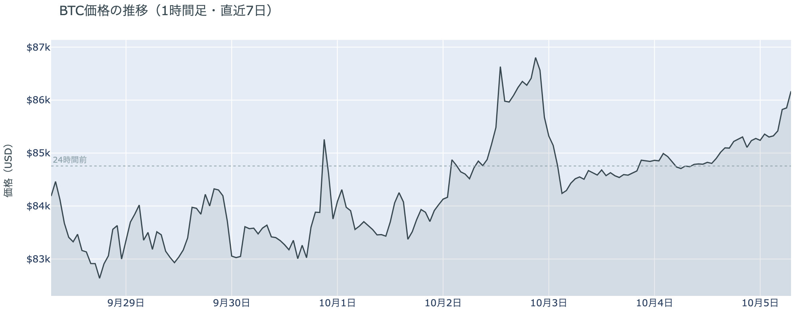

*図の見方: 1時間ごとの価格（日本時間）。点線は24時間前の水準。右端で線が点線から上へ離れていきます。*

* 24時間の値幅は1.7%で、前日の0.7%から広がった。
* Hyperliquidで見えた清算は全部ショートで、値動きの速い5分足（上位1割）にその73%が入っていた。

日曜日は、昼から少しずつ上げ、月曜の朝5時すぎに上げが速まりました。朝7時5分の時点で約$86,183です。上げを速めたのはショートの清算（＝証拠金不足で強制的に閉じられた取引）です。Hyperliquid（＝オンチェーンの先物取引所）で見えた清算は売り持ち（ショート）ばかりで、大口1件ではなく多数に分かれていて、半分あまりが朝5時台に集まっていました。清算は強制の買い注文になるので、その時間の上げを押し広げました。

**図1-2 価格と50日・200日移動平均**

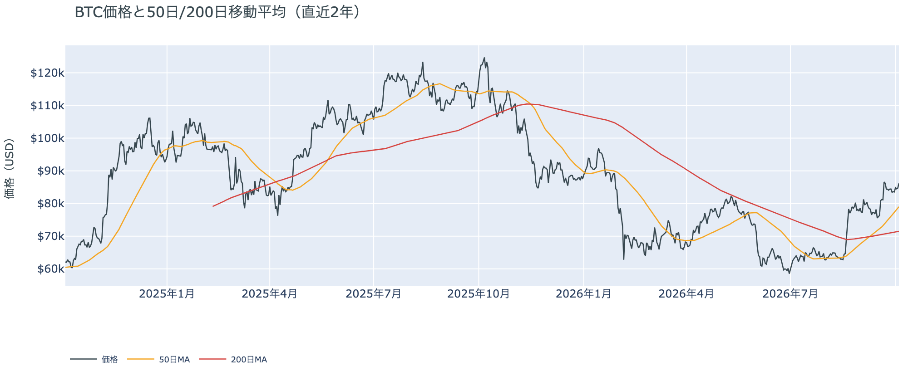

*図の見方: 2本の平均線の上下関係を見ます。50日線が200日線の上にあるのがゴールデンクロスです。*

* 50日線と200日線の差は約$7,519（10.5%）で、前日の約$7,130からさらに開いた。
* 価格は50日線の9.1%上。

長い目で見た流れの向きは変わっていません。ゴールデンクロス（＝50日線が200日線を上抜けること）の状態が27日目で、2本の平均線の差は開き続けています。

証券市場は週末で休みでした。金曜10月2日は米国株（S&P500）が+0.73%で終わっていて、外部環境から週末へ持ち越された売りの材料はありません。日曜の上げは、株・金・原油の取引が無い時間に、ビットコインだけで起きました。

## 2. なぜ動いたか：きっかけと、需給のどこが動いたか

**図2-1 ビットコインと株・金・原油の相対推移（起点＝100）**

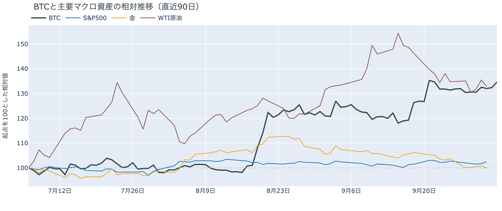

*図の見方: 同じ起点から何%動いたかで重ねたもの。線の向きが揃っているかを見ます。*

| この5営業日の動き（ビットコインは7日間） | 変化 |
|---|---:|
| ビットコイン | +2.0% |
| 金 | −3.7% |
| 米国株（S&P500） | −0.3% |
| 原油 | −1.4% |

* 建玉は96,903BTCで、前日の97,415BTCから0.5%減った。
* 資金調達率から短期金利を引いた上乗せは−1.84ptで、前日の−0.54ptからマイナスが広がった。

日曜の上げは、はっきりしたきっかけが無いまま、先物のショートの買い戻しと清算を通って起きました。

1. きっかけ：見当たりません。証券市場は週末で閉まっていて、株・金・原油・金利から新しい材料は来ていません。10月27〜28日のFOMCで利上げする織り込みは、金曜10月2日の時点で約2割（1週間前は約6割）のままです。この1週間でビットコインは上げ、金・株・原油はそろって下げているので、株や金と共通のきっかけで動いたのではありません（図2-1）。
2. 伝わり方：先物を通りました。昼の14時ごろから夜20時ごろまでは、価格が小さく上げながら建玉（＝先物の未決済残高。証拠金で張っている人の量）が増えていて、買い持ち（ロング）が少しずつ積まれました。朝5時すぎからは向きが変わり、ショートの清算が上げを加速させ、6時台には価格が上げたまま建玉が減りました。ショートが買い戻して降りた、ということです。現物の買い手は上げを運んでいません。アメリカ側の価格はそれ以外より安いままで（図①-1）、長期保有者も10月3日時点で売りを強めていません（図②-1）。

24時間を通すと建玉は前日より小さく減っていて、昼に積まれたロングより、朝に降りたショートのほうが多かったことになります。上げの中心は、新しい買いではなく、ショートが降りたことです。

原油をめぐっては、OPEC+の会合が日曜10月4日に開かれ、サウジアラビア・ロシアなど7か国が11月の生産目標を据え置くと決めました。原油の取引が始まる前の決定で、日曜のビットコインの値動きに効いた形跡はありません。

## 3. 市場参加者はいまどう見ているか

### ① アメリカの買い手は、日曜の上げに加わっていない

**図①-1 Coinbase Premium（アメリカとそれ以外の価格差・直近90日）**

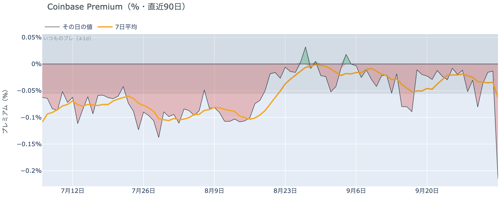

*図の見方: プラス＝アメリカで買いが強い。太線が1週間平均、細線がその日の値。薄い帯は「いつものブレの範囲」です。*

* 1週間平均は−0.06%で、前の週の−0.02%から下向き。
* その日の値は−0.22%で、いつものブレの3.8倍。前日は−0.01%だった。

アメリカの買い手は、この上げを追いかけていません。Coinbase Premium（＝アメリカとそれ以外の価格差）は、その日の値がいつものブレを大きく超えてマイナスに沈みました。価格が上げたのにアメリカ側のほうが安いので、上げを買い進めたのはアメリカ以外の取引所の側だということです。1週間平均も前の週より下がっていて、アメリカの買い手が戻ってきた形はありません。

**図①-2 ETFの日ごとの資金の出入り（直近90日）**

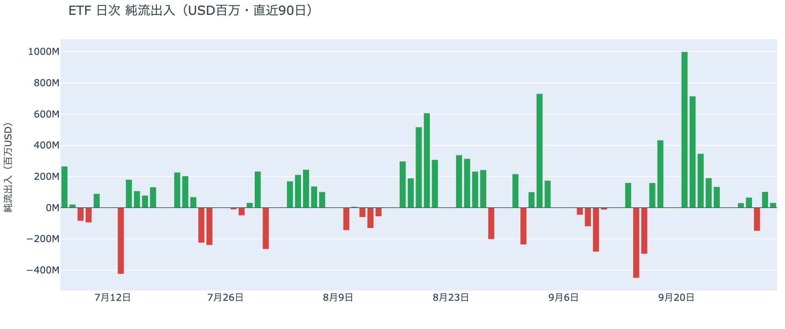

*図の見方: 入ったお金と出たお金の差。上に伸びれば入り超、下に伸びれば出超。*

| ETFの日ごとの出入り | 億ドル |
|---|---:|
| 9月29日 | +0.7 |
| 9月30日 | −1.5 |
| 10月1日 | +1.0 |
| 10月2日 | +0.3 |
| 直近7営業日の合計 | +4.1 |

ETFの買い手は、逃げてはいませんが、買い進めてもいません。週末は取引が無いので数字は10月2日分までで、入り超は2営業日続いているものの、9月下旬に日ごとに入っていた額よりずっと小さいままです。

**図①-3 Fear & Greed（市場心理の指数・直近90日）**

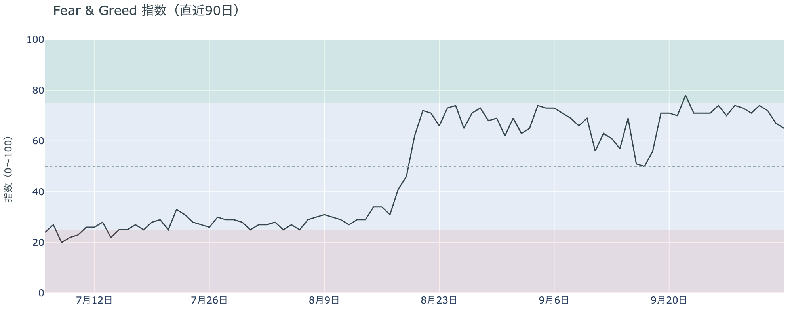

*図の見方: 0〜100で、50より上が「強欲」、下が「恐怖」。*

* 65の「強欲」。前日の67から2pt下がり、1週間前は70、1か月前は74。

市場の多数は強気の側にいますが、熱は少しずつ冷めています。Fear & Greed（＝市場心理の指数）は10月4日の確定値で「強欲」の区分にとどまっているものの、この1か月はゆっくり下がってきました。価格が上げても、心理が過熱へ向かってはいないということです。

### ② 長期保有者は利益確定の売りを続けているが、減り方は前の週より小さい

**図②-1 長期保有者の保有量の30日変化とSOPR（直近90日）**

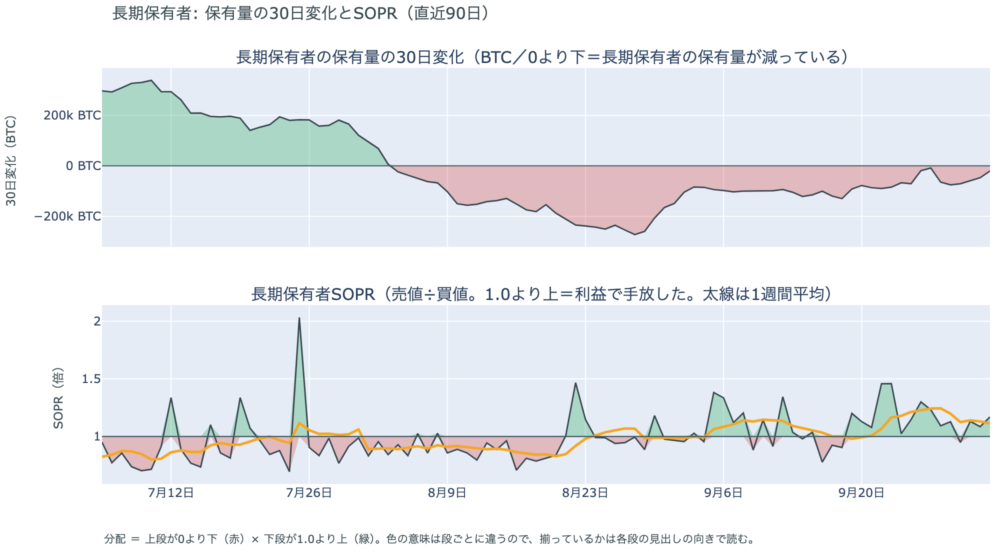

*図の見方: 上段は、長期保有者の保有量が30日でどれだけ増減したか。マイナス＝手放している。下段は長期保有者SOPRで、1より上なら利益で手放した。どちらも1週間平均で読みます。*

| 10月3日時点 | 1週間平均 | 前の週の平均 |
|---|---:|---:|
| 長期保有者SOPR（1より上＝利益で手放した） | 1.11 | 1.23 |
| 長期保有者の保有量の30日変化（万BTC） | −4.9 | −7.1 |

* 1か月前（9月3日）の−8.4万BTCと比べると、その日の値は4分の1。

長期保有者（＝155日以上保有者）は利益確定の売りを続けていますが、減り方は前の週より小さくなっています。保有量は30日で減り、動いたコインは平均して買値より高く動いています。価格が$84,000〜$86,000台にとどまるなかで売りを急いではいないので、長期保有者の側から見たビットコイン自身の需給の土台は、前日と変わっていません。

長期保有者のほかに、売りに回りそうな持ち手も見当たりません。長く眠っていたコインが急に動いた記録はなく、マイナーの収入も平年をやや上回る程度（Puell Multiple（＝マイナー収入の平年比）が1週間平均で1.08）で、売りを急ぐ状況ではありません。

### ③ 先物：ショートは降りたが、ロングは余分に払ってまで賭けていない

**図③-1 資金調達率と建玉（直近30日）**

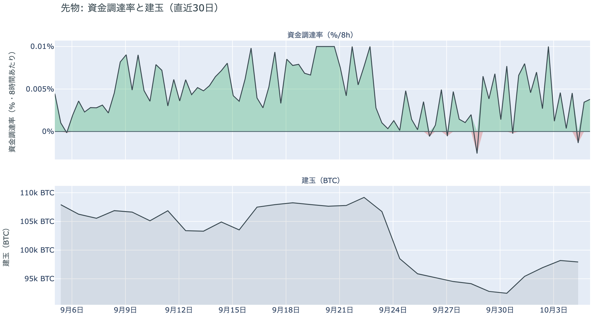

*図の見方: 上段は資金調達率（8時間ごと・日本時間）。プラスが続く＝ロングがショートより多い。下段は建玉。*

* 資金調達率はプラスが2回連続で、その前に一度マイナスを挟んだ。
* 短期金利を引いた上乗せの直近34日の平均は+1.34pt。

先物の参加者は、下げに賭けるのをやめましたが、上げに強い確信を持ったわけでもありません。月曜の朝にショートが清算と買い戻しで降りたので、下げを見込む人は減りました。一方で、資金調達率は1日をならした年率で+2.15%と、短期金利（13週Tビル 3.99%）を1.84pt下回っています。ロングが払う金利が普通の資金のコストより安いということで、余分に払ってでも上げに賭けたい人は戻っていません。価格は上げたのに、ロングの側の熱は前日よりむしろ下がっています。

### ④ オプション：下げへの備えが全部の満期から消え、コールのほうが高くなった

オプションには2種類あります。コール（＝決めた価格で買う権利）とプット（＝決めた価格で売る権利）で、価格が上がればコールの価値が上がり、価格が下がればプットの価値が上がります。プットは「価格が下がったときの保険」として買われます。オプションを買う人は、その権利と引き換えに権利料（＝オプションを買う人が払う金額）を払います。

**図④-1 満期ごとのIV（年率%）**

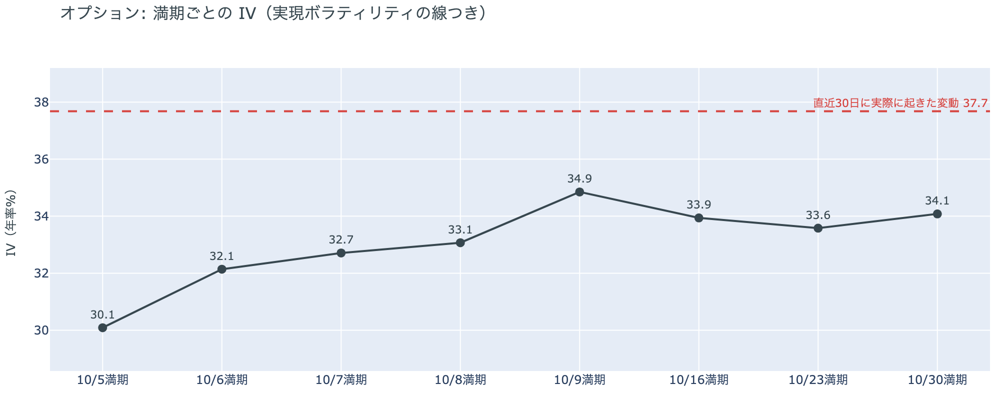

*図の見方: IVを満期ごとに並べたもの。点線は実現ボラティリティ。IVが点線より下なら、市場はこの先の値動きを過去の値動きより小さいと見ています。*

* IVは全体で35.4。実現ボラティリティ37.7より2.3pt低く、過去1年で下から13%。
* 満期ごとのIVは、10月5日の30.1から10月30日の34.1まで、途中に突出した満期が無い。

オプションの参加者は、この先しばらく大きく動くとは見ていません。IV（＝値動きの幅の予想）は実現ボラティリティ（＝過去の値動きの幅）より低く、この1年でも低い部類です。参加者が予想する値動きの幅は、最近実際に動いた幅より小さいということです。特定の満期（＝権利の期限）だけ権利料に上乗せが乗っていることもないので、値動きが特に大きくなると見ている日付はありません。

**図④-2 満期ごとのプットとコールの差**

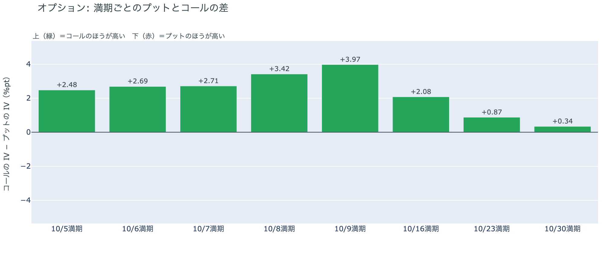

*図の見方: 満期ごとに、プットとコールのどちらが高く売れているか。ゼロより上ならコールのほうが高く、下ならプットのほうが高い。*

| 満期 | どちらが高いか |
|---|---|
| 10月5日 | コールが高い（前日はプットが高かった） |
| 10月6日 | コールが高い |
| 10月7日 | コールが高い |
| 10月8日 | コールが高い |
| 10月9日 | コールが高い |
| 10月16日 | コールが高い |
| 10月23日 | コールが高い（前日はほぼ差なし） |
| 10月30日 | コールがわずかに高い（前日はプットが高かった） |

参加者は下げへの備えを外し、下げより上げに備えています。プットが高く値付けされるのは、下げに備える保険を買いたい人が多いときです。そのプットの高さが、全部の満期から消えました。前日は「下げへの備えは10月末のFOMCをまたぐ満期にだけ残っている」と説明しましたが、10月30日の満期でもコールのほうがわずかに高くなったので、この説明は今日の数値と合わなくなりました。参加者は、FOMCの結果で大きく下げるとは見なくなっています。コールがいちばんはっきり高いのは今週10月8日・9日の満期で、上げへの備えは目先に厚く置かれています。

**図④-3 10月30日満期の持ち高（権利の価格ごと）**

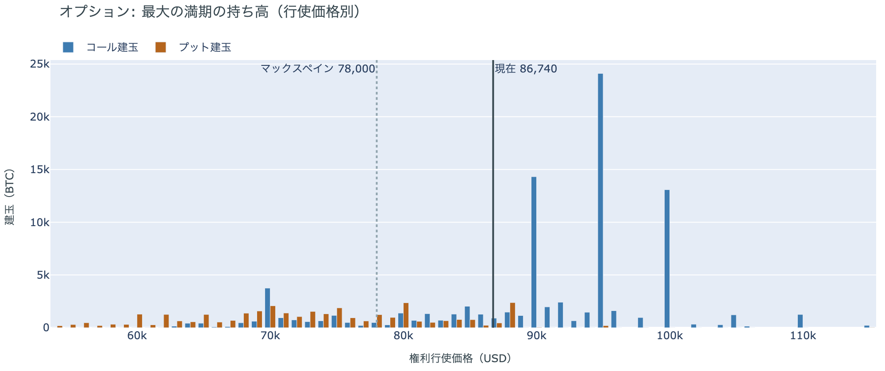

*図の見方: 青＝コール、橙＝プット。現値より上にコールが、下にプットが積まれるのが普通です。*

| 10月30日満期のオプション | 量（万BTC） | 意味 |
|---|---:|---|
| コール | 約8.8 | 「価格が上がる」に賭けた分 |
| プット | 約3.5 | 「価格が下がる」への保険 |
| うち、いまより15%以上高い価格のコール | 約1.7 | 大きな上げへの賭け |
| うち、いまより15%以上安い価格のプット | 約1.9 | 大きな下げへの保険 |

* 10月30日満期の持ち高は約12.3万BTCと全満期の35%で、コールがプットの2.5倍。
* コールが集まっている価格は$95,000に約2.4万BTC、$90,000に約1.4万BTC。

「価格が上がる」に賭けた人たちは降りておらず、10月末に向けた上げへの期待は残っています。10月30日満期の持ち高は前日とほぼ同じ形なので、変わったのは持ち高ではなく、プットとコールの値付けのほうです（図④-2）。コールの大半はいまより高い$90,000と$95,000に積まれていて、その賭けが報われるには、FOMCを越えて10月30日までに$90,000を超える必要があります。日曜の上げで、そこまでの距離は4%あまりに縮まりました。

## 4. 価格に影響しうる直近のイベント

今朝の時点で、プットのほうが高く値付けされている満期はありません。コールがいちばんはっきり高いのは10月8日・9日の満期で、米9月のISM非製造業と9月のFOMCの議事録をまたぎます。米9月のCPIをまたぐ10月16日の満期、10月27〜28日のFOMCをまたぐ10月30日の満期も、コールのほうが高く値付けされています。

| 日付 | イベント | 何に効くか |
|---|---|---|
| 10/5（月）23:00 日本時間 | 米9月のISM非製造業（＝サービス業の景況感指数） | 金利 |
| 10/8（木）3:00 日本時間 | 9月のFOMCの議事録 | 金利。10月8日・9日の満期がまたぐ |
| 日程未定 | ホルムズ海峡の再開をめぐるイランとオマーンの協議 | 原油 |
| 10/14（水）21:30 日本時間 | 米9月のCPI（＝米国の物価統計）。10月のFOMCの前に出る最後の物価統計 | 金利。10月16日の満期がまたぐ |
| 10/27（火）〜28（水） | FOMC。利上げの織り込みは約2割。結果は日本時間29日未明 | 金利 |
| 10/30（金）17:00 | オプションの最も大きな満期（約12.3万BTC、全満期の35%）。FOMCの2日後 | $90,000以上のコールの期限 |
| 11/1（日） | OPEC+の会合。7か国が12月の生産目標を決める | 原油 |

## まとめ：日曜日の動きは何だったか

日曜日は、はっきりしたきっかけが無いまま、先物のショートが買い戻しと清算で降りたことで、価格が約$86,200まで上げた日でした。動いたのは先物までで、アメリカの買い手はこの上げに加わらず、長期保有者の利益確定の売りも減り方が小さいままなので、ビットコイン自身の需給の土台は変わっていません。参加者は下げへの備えを外して上げの側に寄りましたが、余分に払ってでもロングを積むほどの確信は、まだ持っていません。

---

<small>（数値は10月5日7時5分（日本時間）までのデータに基づきます。価格・先物・オプション・Coinbase Premiumはその時点の値、市場心理は10月4日の確定値、オンチェーン（＝ブロックチェーン上の記録）は10月3日時点、ETF資金フローは10月2日分までです。証券市場の終値は10月2日時点で、週末のため更新がありません。FOMCの織り込みは10月2日のFF金利先物の終値から計算したものです。オンチェーンの長期保有者の数値には、ETFや取引所が預かっている分も含まれます。オプションはDeribit（BTCオプションの大半を占める取引所）の全銘柄です。）</small>

*本稿は情報提供を目的としたものであり、投資助言ではありません。将来の価格動向を保証・示唆するものではなく、投資判断は各自の責任において行ってください。*
