# $87,000手前で押し戻され往復、朝のロングは夜に手仕舞い ― 10月末の満期にプットの高さが戻る

**2026年10月6日**

月曜日は、朝に$87,000の手前まで上げたあと夜に押し戻され、24時間ではほぼ元の水準に戻った日です。

* **価格**：24時間の値幅は2.4%と前日の1.7%から広がったが、行って戻っただけで、朝7時5分の時点で約$85,982（24時間前より−0.5%）。前日の上げの大半は保たれている
* **きっかけ**：朝の上げにははっきりしたきっかけが無かった。夜の下げは、米9月のISM非製造業（＝サービス業の景況感指数）のあとに米10年債利回りが上がった時間に起きたが、株は上げて終わっていて、株と共通のきっかけではない
* **先物**：上げも下げも先物が運んだ。朝に積まれた買い持ち（ロング）が夜に手仕舞われ、建玉（＝先物の未決済残高。証拠金で張っている人の量）は前日より減った。上げを追う賭けは1日もたず、上げへの確信は戻っていない
* **需給の土台**：米国の買い手は戻っても逃げてもおらず、長期保有者の利益確定の売りは続いているが強まっていないので、土台は前日から変わっていない
* **オプションの見方**：下げへの備えは外されていなかった。前日に全部の満期で高くなったコール（＝決めた価格で買う権利）は1日で元に戻り、10月末のFOMC（＝米国の金利を決める会合）をまたぐ満期では、またプット（＝決めた価格で売る権利）のほうが高い

## 1. 何が起きたか

**図1-1 価格の推移（1時間足・直近7日）**

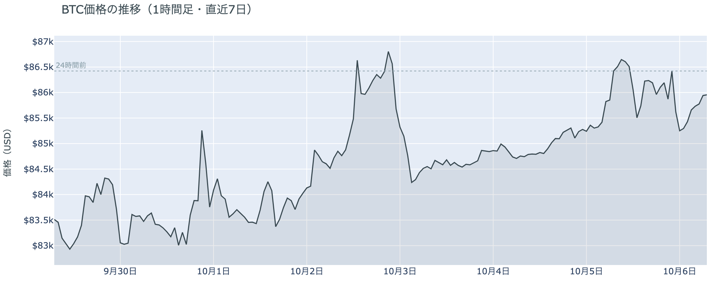

*図の見方: 1時間ごとの価格（日本時間）。点線は24時間前の水準。右端で線が点線の上へ出たあと、点線の近くまで戻っています。*

* 24時間の値幅は2.4%で、前日の1.7%から広がった。
* Hyperliquidで見えた清算の9割はショートで、最大の1件が全体の83%を占めた。

月曜日は、朝に上げた分を夜に返した日です。朝7時5分の時点で約$85,982と、24時間前をわずかに下回っています。朝は10時ごろまでに$87,000の手前まで上げ、夜23時台に速く下げて、0時台には$85,000前後まで押し戻されました。朝7時台には売り持ち（ショート）の清算（＝証拠金不足で強制的に閉じられた取引）が上げを加速させましたが、Hyperliquid（＝オンチェーンの先物取引所）で見えたのは多数の清算ではなく、大口が1つ飛んだ形です。夜の下げには清算がほとんど入っておらず、強制ではなく自分から降りた人が下げを運びました。

**図1-2 価格と50日・200日移動平均**

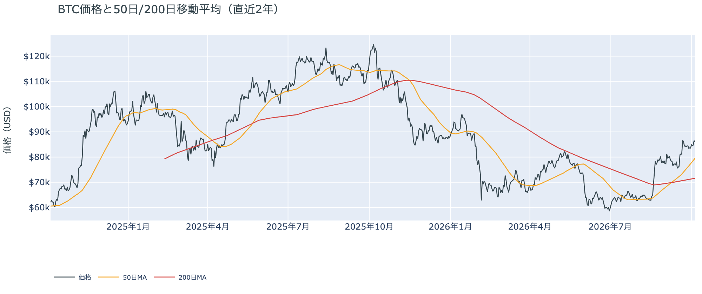

*図の見方: 2本の平均線の上下関係を見ます。50日線が200日線の上にあるのがゴールデンクロスです。*

* 50日線と200日線の差は約$7,907（11.1%）で、前日の約$7,519からさらに開いた。
* 価格は50日線の8.2%上。

長い目で見た流れの向きは、月曜の往復でも変わっていません。ゴールデンクロス（＝50日線が200日線を上抜けること）の状態が28日目で、2本の平均線の差は開き続けています。

週明け10月5日の証券市場から、ビットコインへ売りの材料は持ち込まれていません。米国株（S&P500）は+0.66%で終わり、10月のFOMCで利上げする織り込みも約2割のまま動きませんでした。

## 2. なぜ動いたか：きっかけと、需給のどこが動いたか

**図2-1 ビットコインと株・金・原油の相対推移（起点＝100）**

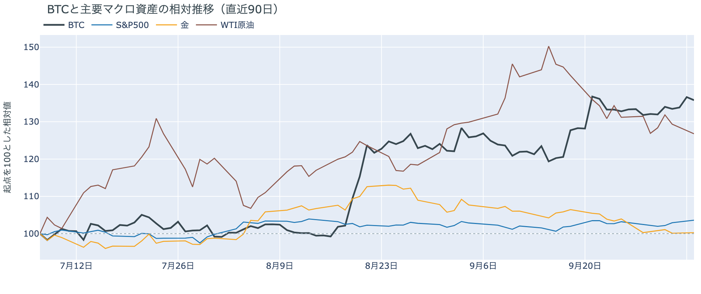

*図の見方: 同じ起点から何%動いたかで重ねたもの。線の向きが揃っているかを見ます。*

| この5営業日の動き（ビットコインは7日間） | 変化 |
|---|---:|
| ビットコイン | +3.0% |
| 金 | 0.0% |
| 米国株（S&P500） | +1.2% |
| 原油 | −3.6% |

* 建玉は94,474BTCで、前日の96,903BTCから2.5%減った。
* 値動きがいちばん大きかった夜23時35分の5分足に入っていた清算は、24時間の1%だけ。

月曜の往復は、朝に先物で積まれたロングが、夜に米国の金利が上がった時間に手仕舞われて起きました。

1. きっかけ：朝の上げには見当たりません。夜の下げは、23時に米9月のISM非製造業（54.9。前月は55.4）が出たあと、米10年債利回りが5.31%から5.34%へ上がった時間に起きました。ただし同じ夜に米国株は上げて終わっているので、株と共通のきっかけではありません。FOMCの利上げの織り込みも変わっておらず、金融政策の見方を動かすほどの材料ではありませんでした。
2. 伝わり方：先物を通りました。朝8時台から10時台は、価格が上げながら建玉が増えていて、ロングが新しく積まれました。夜23時台からは、価格が下げながら建玉が減っています。ロングの手仕舞いです。朝に増えた分と同じくらいの建玉が夜から朝にかけて消えたので、朝の上げを追ったロングが、夜の下げで降りたことになります。現物の買い手は上げも下げも運んでいません（図①-1）。

前日は「日曜の上げの中心は、新しい買いではなく、ショートが降りたこと」と説明しました。月曜の朝にはその上にロングが積まれましたが、1日もたずに手仕舞われたので、上げを支える新しい買いが入っていないという前日の説明は、今日の数値とも合っています。

原油は10月5日に−2.0%の$89.30で終わりました。サウジアラビアがアジア向けの販売価格を引き下げたと報じられた日で、月曜のビットコインの値動きに効いた形跡はありません。

## 3. 市場参加者はいまどう見ているか

### ① アメリカの買い手は、戻ってもいないが、売りを強めてもいない

**図①-1 Coinbase Premium（アメリカとそれ以外の価格差・直近90日）**

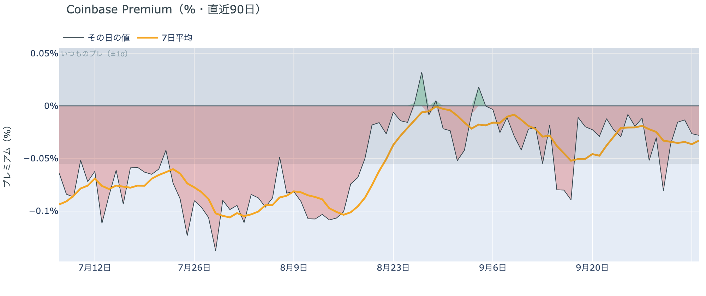

*図の見方: プラス＝アメリカで買いが強い。太線が1週間平均、細線がその日の値。薄い帯は「いつものブレの範囲」です。*

* 1週間平均は−0.03%で、前の週の−0.02%とほぼ同じ。
* その日の値は−0.03%で、いつものブレの範囲内。

アメリカの買い手は、この往復のどちら側にも加わっていません。Coinbase Premium（＝アメリカとそれ以外の価格差）は1週間平均で小さなマイナスのまま、前の週からほとんど動いていないからです。前日の朝は、その日の値がいつものブレを大きく超えて沈んでいましたが、日曜が終わった時点ではブレの内側に戻りました。アメリカの買い手が売りを強めた、という形にはなっていません。

**図①-2 ETFの日ごとの資金の出入り（直近90日）**

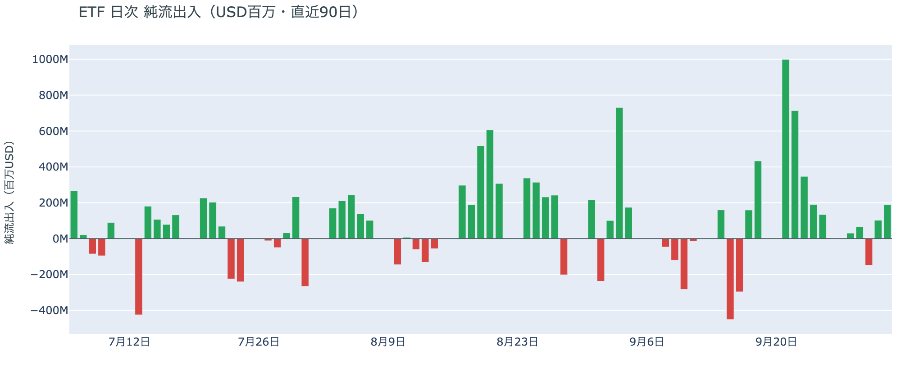

*図の見方: 入ったお金と出たお金の差。上に伸びれば入り超、下に伸びれば出超。*

| ETFの日ごとの出入り | 億ドル |
|---|---:|
| 9月29日 | +0.7 |
| 9月30日 | −1.5 |
| 10月1日 | +1.0 |
| 10月2日 | +1.9 |
| 直近7営業日の合計 | +5.7 |

* 10月2日分は、前日の号の+0.3億ドルから集計が進んで+1.9億ドルになった。

ETFの買い手は、少しずつ買い続けています。10月2日分までの数字で入り超が2営業日続いていて、逃げている形はありません。ただ、9月下旬に1日で数億ドルずつ入っていた頃と比べると額は小さく、買い進めるほどの勢いではありません。

**図①-3 Fear & Greed（市場心理の指数・直近90日）**

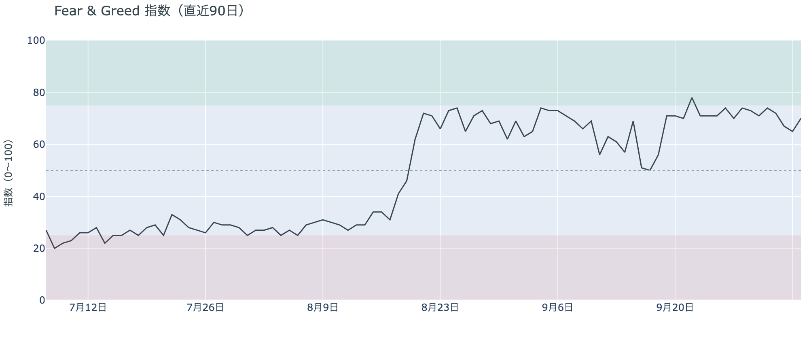

*図の見方: 0〜100で、50より上が「強欲」、下が「恐怖」。*

* 70の「強欲」。前日の65から5pt上がり、1週間前は74、1か月前は73。

市場の多数は強気の側にいて、過熱には向かっていません。Fear & Greed（＝市場心理の指数）は10月5日の確定値で、日曜の上げを受けて少し戻しましたが、この1か月の範囲の中にとどまっています。価格が$86,000台に乗っても、心理が一段と熱くなってはいないということです。

### ② 長期保有者は利益確定の売りを続けているが、減り方は前の週より小さい

**図②-1 長期保有者の保有量の30日変化とSOPR（直近90日）**

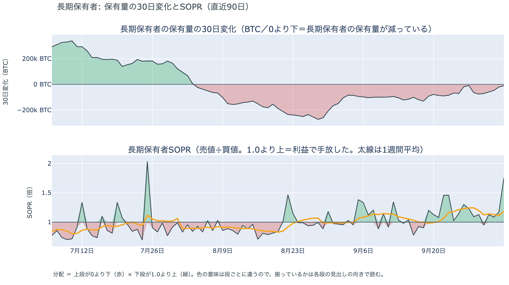

*図の見方: 上段は、長期保有者の保有量が30日でどれだけ増減したか。マイナス＝手放している。下段は長期保有者SOPRで、1より上なら利益で手放した。どちらも1週間平均で読みます。*

| 10月4日時点 | 1週間平均 | 前の週の平均 |
|---|---:|---:|
| 長期保有者SOPR（1より上＝利益で手放した） | 1.19 | 1.24 |
| 長期保有者の保有量の30日変化（万BTC） | −5.0 | −6.1 |

* その日の値は−1.0万BTCで、1か月前（9月4日）の−8.5万BTCの8分の1ほど。

長期保有者（＝155日以上保有者）は利益確定の売りを続けていますが、減り方は前の週より小さくなっています。保有量は30日で減り、動いたコインは平均して買値より高く動いています。価格が$86,000台へ上げても売りを急いではいないので、長期保有者の側から見たビットコイン自身の需給の土台は、前日と変わっていません。

長期保有者のほかに、売りに回りそうな持ち手も見当たりません。長く眠っていたコインが急に動いた記録はなく、マイナーの収入も平年をやや上回る程度（Puell Multiple（＝マイナー収入の平年比）が1週間平均で1.08）で、売りを急ぐ状況ではありません。

### ③ 先物：朝に積まれたロングは夜に降り、上げへの確信は戻っていない

**図③-1 資金調達率と建玉（直近30日）**

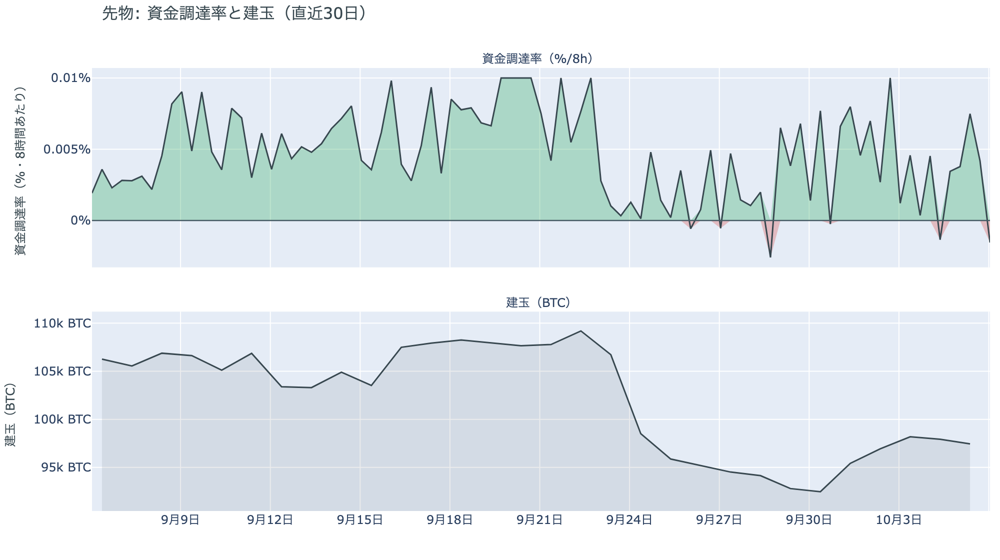

*図の見方: 上段は資金調達率（8時間ごと・日本時間）。プラスが続く＝ロングがショートより多い。下段は建玉。*

* 資金調達率は、直近の1回がマイナスになった。
* 短期金利を引いた上乗せの直近34日の平均は+1.23pt。

先物の参加者は、上げにも下げにも強い確信を持っていません。朝の上げを追って積まれた買い持ち（ロング）は夜の下げで手仕舞われたので、上げを追う賭けは1日もちませんでした。資金調達率（＝ロングが払う金利。プラス＝ロングがショートより多い）は1日をならした年率で+3.70%と、短期金利（＝ドルを米国の短期国債で持つだけで受け取れる金利。13週Tビル 4.02%）を0.32pt下回っています。ロングが払う金利が普通の資金のコストより安いままなので、余分に払ってでも上げに賭けたい人は戻っていません。一方で、ショートに大きく傾いたわけでもなく、下げに賭ける人が増えた形もありません。

### ④ オプション：コールの高さは1日で戻り、10月末の満期はまたプットのほうが高い

オプションには2種類あります。コール（＝決めた価格で買う権利）とプット（＝決めた価格で売る権利）で、価格が上がればコールの価値が上がり、価格が下がればプットの価値が上がります。プットは「価格が下がったときの保険」として買われます。オプションを買う人は、その権利と引き換えに権利料（＝オプションを買う人が払う金額）を払います。

**図④-1 満期ごとのIV（年率%）**

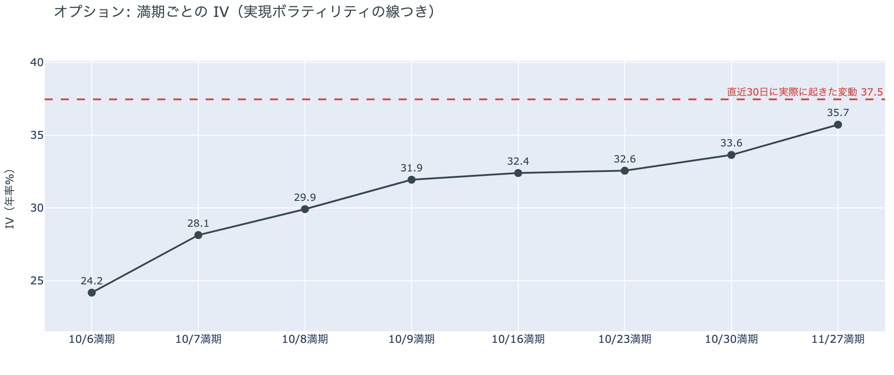

*図の見方: IVを満期ごとに並べたもの。点線は実現ボラティリティ。IVが点線より下なら、市場はこの先の値動きを過去の値動きより小さいと見ています。*

* IVは全体で36.5。実現ボラティリティ37.5より1.0pt低く、過去1年で下から13%。
* 満期ごとのIVは、10月6日の24.2から11月27日の35.7まで、途中に突出した満期が無い。

オプションの参加者は、この先しばらく大きく動くとは見ていません。IV（＝値動きの幅の予想）は実現ボラティリティ（＝過去の値動きの幅）より低く、この1年でも低い部類だからです。月曜に2%あまり往復しても、参加者が予想する値動きの幅は、最近実際に動いた幅を上回っていません。特定の満期（＝権利の期限）だけ権利料に上乗せが乗っていることもないので、値動きが特に大きくなると見ている日付はありません。

**図④-2 満期ごとのプットとコールの差**

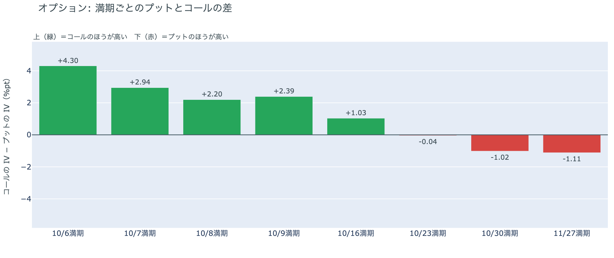

*図の見方: 満期ごとに、プットとコールのどちらが高く売れているか。ゼロより上ならコールのほうが高く、下ならプットのほうが高い。*

| 満期 | どちらが高いか |
|---|---|
| 10月6日 | コールが高い |
| 10月7日 | コールが高い |
| 10月8日 | コールが高い |
| 10月9日 | コールが高い |
| 10月16日 | コールが高い |
| 10月23日 | ほぼ差なし（前日はコールが高かった） |
| 10月30日 | プットが高い（前日はコールがわずかに高かった） |
| 11月27日 | プットが高い |

参加者は、今月の半ばまでは下げより上げに備え、10月末のFOMCから先には下げへの備えを残しています。プットのほうが高いのは、10月27〜28日のFOMCをまたぐ10月30日の満期から先だけだからです。前日は、全部の満期でコールのほうが高くなったのを「参加者は、FOMCの結果で大きく下げるとは見なくなった」と説明しました。しかし10月30日の満期のプットの高さは1日で戻ったので、この説明は取り下げます。持ち高（図④-3）は変わっておらず、あれは備えを外したのではなく、**日曜の上げの朝にだけ、コールが一時的に高く値付けされた**と説明し直します。

**図④-3 10月30日満期の持ち高（権利の価格ごと）**

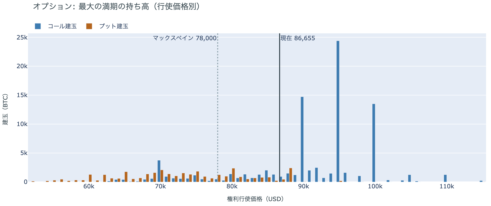

*図の見方: 青＝コール、橙＝プット。現値より上にコールが、下にプットが積まれるのが普通です。*

| 10月30日満期のオプション | 量（万BTC） | 意味 |
|---|---:|---|
| コール | 約8.9 | 「価格が上がる」に賭けた分 |
| プット | 約3.6 | 「価格が下がる」への保険 |
| うち、いまより15%以上高い価格のコール | 約1.7 | 大きな上げへの賭け |
| うち、いまより15%以上安い価格のプット | 約1.9 | 大きな下げへの保険 |

* 10月30日満期の持ち高は約12.5万BTCと全満期の35%で、コールがプットの2.5倍。
* コールが集まっている価格は$95,000に約2.4万BTC、$90,000に約1.5万BTC。

「価格が上がる」に賭けた人たちは降りておらず、10月末に向けた上げへの期待は残っています。10月30日満期の持ち高は前日とほぼ同じ形で、コールの大半はいまより高い$90,000と$95,000に積まれたままだからです。その賭けが報われるには、FOMCを越えて10月30日までに$90,000を超える必要があり、いまの価格からは5%弱の距離があります。

## 4. 価格に影響しうる直近のイベント

オプション市場が下げへの備えを置いているのは10月30日の満期から先で、10月27〜28日のFOMCをまたぐ区間に当たります。9月のFOMCの議事録をまたぐ10月8日・9日の満期と、米9月のCPIをまたぐ10月16日の満期は、コールのほうが高く値付けされています。

| 日付 | イベント | 何に効くか |
|---|---|---|
| 10/8（木）3:00 日本時間 | 9月のFOMCの議事録 | 金利。10月8日・9日の満期がまたぐ |
| 10/14（水）21:30 日本時間 | 米9月のCPI（＝米国の物価統計）。10月のFOMCの前に出る最後の物価統計 | 金利。10月16日の満期がまたぐ |
| 10/27（火）〜28（水） | FOMC。利上げの織り込みは約2割（1週間前は約7割）。結果は日本時間29日未明 | 金利。プットが高い10月30日の満期がまたぐ |
| 10/30（金）17:00 | オプションの最も大きな満期（約12.5万BTC、全満期の35%）。FOMCの2日後 | $90,000以上のコールの期限 |
| 11/1（日） | OPEC+の会合。7か国が12月の生産目標を決める | 原油 |

## まとめ：月曜日の動きは何だったか

月曜日は、朝に先物で積まれたロングが、夜に米国の金利が上がった時間に手仕舞われ、価格が$87,000の手前から約$86,000へ戻った日でした。動いたのは先物までで、アメリカの買い手はどちら側にも加わらず、長期保有者の利益確定の売りも減り方が小さいままなので、ビットコイン自身の需給の土台は変わっていません。参加者は10月末に向けた上げへの期待を捨ててはいませんが、上げを追って賭けを大きくするほどの確信は持てず、10月末のFOMCから先には下げへの備えを残しています。

---

<small>（数値は10月6日7時5分（日本時間）までのデータに基づきます。価格・先物・オプション・Coinbase Premiumはその時点の値、市場心理は10月5日の確定値、オンチェーン（＝ブロックチェーン上の記録）は10月4日時点、ETF資金フローは10月2日分までです。証券市場の終値は10月5日時点です。FOMCの織り込みは10月5日のFF金利先物の終値から計算したものです。オンチェーンの長期保有者の数値には、ETFや取引所が預かっている分も含まれます。オプションはDeribit（BTCオプションの大半を占める取引所）の全銘柄です。）</small>

*本稿は情報提供を目的としたものであり、投資助言ではありません。将来の価格動向を保証・示唆するものではなく、投資判断は各自の責任において行ってください。*
