# 株の最高値に付いていかず$86,000台で往復 ― 上げはショートの買い戻し、資金調達率はマイナスへ

**2026年10月7日**

ビットコインは火曜日、夜に$86,600台まで上げたあと日付が変わる頃に押し戻され、24時間前とほぼ同じ水準に戻りました。

* **価格**：24時間の値幅は1.9%と前日の2.4%より狭く、朝7時5分の時点で約$85,622。米国株が最高値を更新した夜でも、ビットコインは$86,000台を保てなかった
* **きっかけ**：はっきりしたきっかけは無かった。米国株（S&P500）は最高値、米10年債利回りは下がったのに、ビットコインは上げて戻しただけなので、株と共通のきっかけで動いた日ではない
* **先物**：夜の上げは売り持ち（ショート）の買い戻しと清算（＝証拠金不足で強制的に閉じられた取引）が運び、日付が変わる頃の下げは新しく積まれたショートが運んだ。資金調達率（＝ロングが払う金利。プラス＝ロングがショートより多い）は1日をならすとマイナスになり、上げを追う買い持ち（ロング）はいなくなった
* **需給の土台**：米国の買い手は上げにも下げにも加わっておらず、長期保有者の利益確定の売りは続いているが強まっていないので、前日から変わっていない
* **オプションの見方**：今月中は上げに備え、10月末のFOMC（＝米国の金利を決める会合）をまたぐ満期から先に下げへの備えを置く形は前日と同じ。ただし10月30日の満期でプット（＝決めた価格で売る権利）が高い幅はわずかで、FOMCの直後に大きく下げると身構えているわけではない

## 1. 何が起きたか

**図1-1 価格の推移（1時間足・直近7日）**

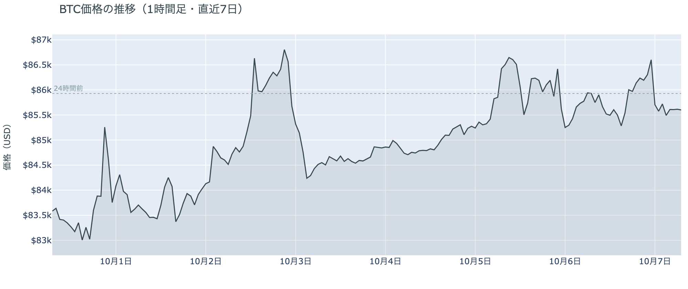

*図の見方: 1時間ごとの価格（日本時間）。点線は24時間前の水準。右端で線が点線の上へ出たあと、点線の近くまで戻っています。*

* 24時間の値幅は1.9%で、前日の2.4%から狭まった。
* Hyperliquidで見えた清算はすべてショートで、最大の1件が全体の47%。

火曜日は、夜に上げた分を日付が変わる頃に返しました。朝7時5分の時点で約$85,622と、24時間前をわずかに下回っています。昼は$85,300前後まで小さく下げ、夕方16時台から上げ始めて23時台に$86,600まで届き、0時台の1時間で$85,700まで速く下げて、そのまま朝を迎えました。清算は22時台から0時にかけての上げの最後に集まっていて、Hyperliquid（＝オンチェーンの先物取引所）で見えたのは大口1つではなく複数のショートです。上げは清算なしで始まり、最後の一押しを清算が加速させました。0時台の下げには清算が入っておらず、強制ではなく自分から売った人が下げを運びました。

**図1-2 価格と50日・200日移動平均**

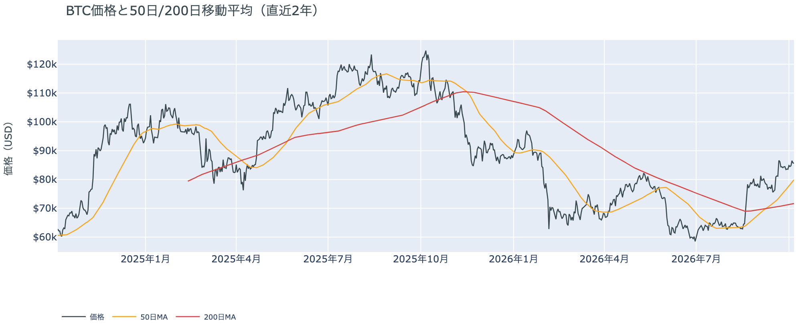

*図の見方: 2本の平均線の上下関係を見ます。50日線が200日線の上にあるのがゴールデンクロスです。*

* 50日線と200日線の差は約$8,250（11.5%）で、前日の約$7,907からさらに開いた。
* 価格は50日線の7.2%上。

長い目で見た流れの向きは、火曜の往復でも変わっていません。ゴールデンクロス（＝50日線が200日線を上抜けること）の状態が29日目で、2本の平均線の差は開き続けています。

10月6日の証券市場から、ビットコインへ売りの材料は持ち込まれていません。米国株（S&P500）は+0.58%で最高値を更新し、米10年債利回りも5.27%へ下がりました。ただ、株の上げはビットコインには届いておらず、同じ夜のビットコインは上げた分をそのまま返しています。

## 2. なぜ動いたか：きっかけと、需給のどこが動いたか

**図2-1 ビットコインと株・金・原油の相対推移（起点＝100）**

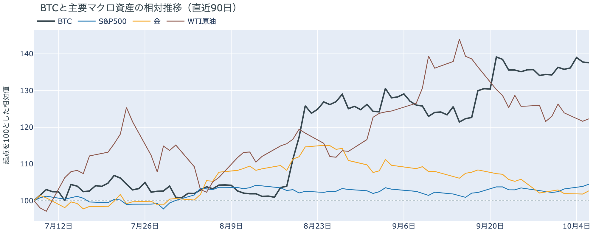

*図の見方: 同じ起点から何%動いたかで重ねたもの。線の向きが揃っているかを見ます。*

| この5営業日の動き（ビットコインは7日間） | 変化 |
|---|---:|
| ビットコイン | +2.4% |
| 金 | +0.3% |
| 米国株（S&P500） | +1.9% |
| 原油 | +0.6% |

* 建玉は95,319BTCで、前日の94,474BTCから0.9%増えた。
* 0時台は価格が1.0%下げながら建玉が0.7%増え、下げの最中に持ち高が積まれた。

火曜の往復は、はっきりしたきっかけが無いまま、夜にショートの買い戻しが価格を押し上げ、日付が変わる頃に新しく積まれたショートが押し戻して起きました。

1. きっかけ：見当たりません。米国株が最高値を更新し、米10年債利回りが下がった夜に、ビットコインは上げてから戻しています。株と金利は同じ向きに動いたのに、ビットコインだけが往復したので、株と共通のきっかけで動いた日ではありません。米10年債利回りは22時台に5.30%の手前まで上がって23時台に下がりましたが、ビットコインはその両方の時間で上げていて、金利と同じ時間に向きを変えていません。10月のFOMCで利上げする織り込みも約2割のまま動いていません。
2. 伝わり方：先物を通りました。夕方16時台から18時台は、価格が上げながら建玉（＝先物の未決済残高。証拠金で張っている人の量）が減っていて、ショートの買い戻しが上げを運びました。22時台と23時台は建玉が増え、ショートの清算も集まっていたので、最後の一押しは清算と少しのロングが加速させました。0時台は価格が下げながら建玉が増えていて、新しく積まれたショートが押し戻しています。現物の買い手は上げにも下げにも加わっていません（図①-1）。

前日は「上げを支える新しい買いが入っていない」と説明しました。火曜の夜の上げもショートの買い戻しで、新しいロングはわずかしか積まれず、朝までにショートに押し戻されたので、前日の説明は今日の数値とも合っています。

この5営業日では株も金も原油も上げていて、ビットコインも同じ向きです。しかし火曜の24時間だけを見ると、株が最高値を付けた夜にビットコインは付いていっておらず、株の買いがビットコインへ流れ込んだ形跡はありません。

## 3. 市場参加者はいまどう見ているか

### ① アメリカの買い手は、夜の上げにも戻りにも加わっていない

**図①-1 Coinbase Premium（アメリカとそれ以外の価格差・直近90日）**

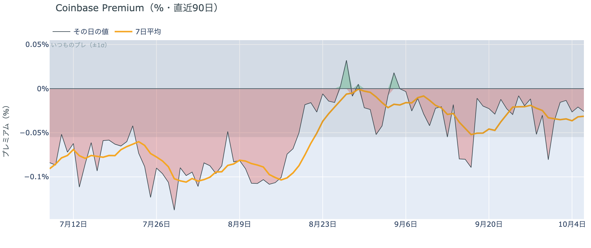

*図の見方: プラス＝アメリカで買いが強い。太線が1週間平均、細線がその日の値。薄い帯は「いつものブレの範囲」です。*

* 1週間平均は−0.03%で、前の週の−0.03%と同じ。
* その日の値は−0.03%で、いつものブレの範囲内。

アメリカの買い手は、この往復のどちら側にも加わっていません。Coinbase Premium（＝アメリカとそれ以外の価格差）は1週間平均で小さなマイナスのまま、前の週から動いていないからです。アメリカの買い手が手を止めている状態は続いていますが、売りを強めた形にもなっていません。

**図①-2 ETFの日ごとの資金の出入り（直近90日）**

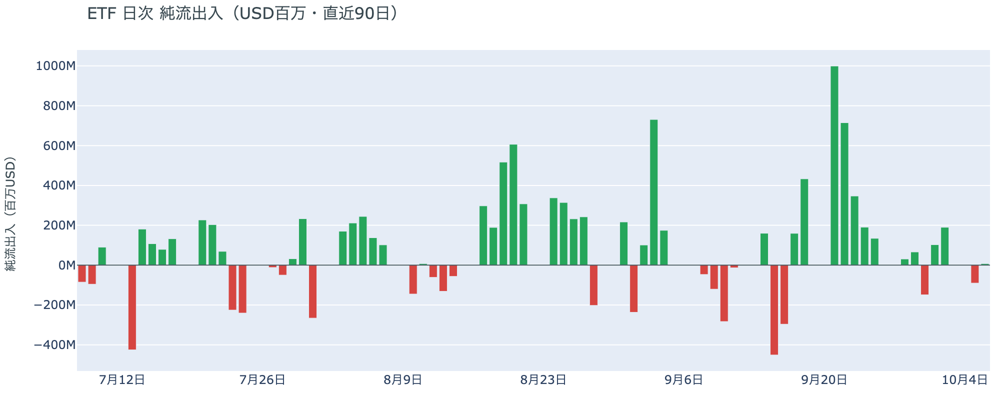

*図の見方: 入ったお金と出たお金の差。上に伸びれば入り超、下に伸びれば出超。*

| ETFの日ごとの出入り | 億ドル |
|---|---:|
| 10月1日 | +1.0 |
| 10月2日 | +1.9 |
| 10月5日 | −0.9 |
| 10月6日（集計途中） | +0.1 |
| 直近7営業日の合計 | +1.6 |

* 10月5日の流出は−0.9億ドルで、9月30日の−1.5億ドルより小さい。

ETFの買い手は手を止めつつありますが、逃げてはいません。10月5日に小さな流出が1営業日出たものの、直近7営業日の合計はまだ入り超だからです。ただ、9月下旬に1日で数億ドルずつ入っていた頃と比べると合計は大きく縮んでいて、買い進める勢いはありません。

**図①-3 Fear & Greed（市場心理の指数・直近90日）**

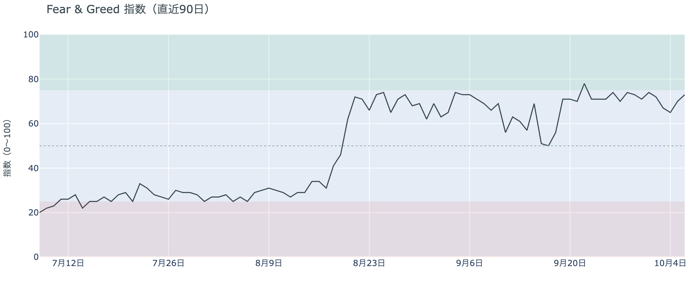

*図の見方: 0〜100で、50より上が「強欲」、下が「恐怖」。*

* 73の「強欲」。前日の70から3pt上がり、1週間前も1か月前も73。

市場の多数は強気の側にいて、この1か月でほとんど動いていません。Fear & Greed（＝市場心理の指数）は10月6日の確定値で、1週間前とも1か月前とも同じ水準だからです。価格が$83,000台から$86,000台まで上げても心理は熱くなっておらず、冷めてもいないということです。

### ② 長期保有者は利益確定の売りを続けているが、減り方は前の週より小さい

**図②-1 長期保有者の保有量の30日変化とSOPR（直近90日）**

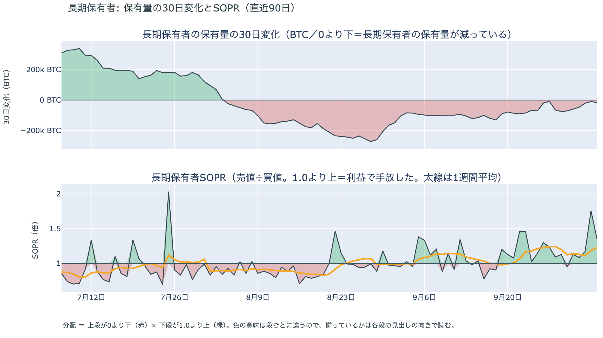

*図の見方: 上段は、長期保有者の保有量が30日でどれだけ増減したか。マイナス＝手放している。下段は長期保有者SOPRで、1より上なら利益で手放した。どちらも1週間平均で読みます。*

| 10月5日時点 | 1週間平均 | 前の週の平均 |
|---|---:|---:|
| 長期保有者SOPR（1より上＝利益で手放した） | 1.23 | 1.25 |
| 長期保有者の保有量の30日変化（万BTC） | −4.3 | −5.8 |

* その日の値は−1.6万BTCで、1か月前（9月5日）の−9.4万BTCの6分の1ほど。

長期保有者（＝155日以上保有者）は利益確定の売りを続けていますが、減り方は前の週より小さくなっています。保有量は30日で減り、動いたコインは平均して買値より高く動いています。価格が$86,000台を行き来しても売りを急いでいないので、長期保有者の側から見たビットコイン自身の需給の土台は、前日と変わっていません。

長期保有者のほかに、売りに回りそうな持ち手も見当たりません。長く眠っていたコインが急に動いた記録はなく、マイナーの収入も平年をやや上回る程度（Puell Multiple（＝マイナー収入の平年比）が1週間平均で1.10）で、売りを急ぐ状況ではありません。

### ③ 先物：上げを追うロングは消え、わずかにショート側へ傾いた

**図③-1 資金調達率と建玉（直近30日）**

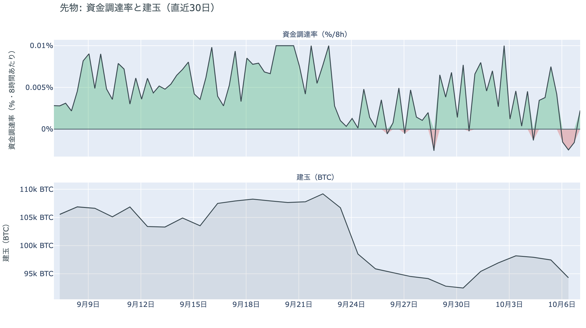

*図の見方: 上段は資金調達率（8時間ごと・日本時間）。プラスが続く＝ロングがショートより多い。下段は建玉。*

* 短期金利を引いた上乗せは直近34日でいちばん小さく、34日の平均は+1.12pt。
* 建玉の7日変化は+1.6%で、積み増しも手仕舞いも大きくない。

先物の参加者は、上げへの確信を失い、わずかに下げ側へ傾いています。資金調達率は1日をならした年率で−0.67%と、短期金利（＝ドルを米国の短期国債で持つだけで受け取れる金利。13週Tビル 4.04%）を引いた上乗せは−4.71ptです。資金調達率がマイナス＝ショートがロングへ払っている＝ショートがロングより多い、ということです。ロングへの傾きは、この1週間で縮み続けて火曜に消えました。ただし下げに強く賭けているわけでもありません。0時台に新しく積まれたショートは朝まで保たれましたが、そのあと追加されておらず、建玉は前日から1%弱しか増えていません。

### ④ オプション：今月は上げに備え、10月末から先の下げへの備えは薄い

オプションには2種類あります。コール（＝決めた価格で買う権利）とプット（＝決めた価格で売る権利）で、価格が上がればコールの価値が上がり、価格が下がればプットの価値が上がります。プットは「価格が下がったときの保険」として買われます。オプションを買う人は、その権利と引き換えに権利料（＝オプションを買う人が払う金額）を払います。

**図④-1 満期ごとのIV（年率%）**

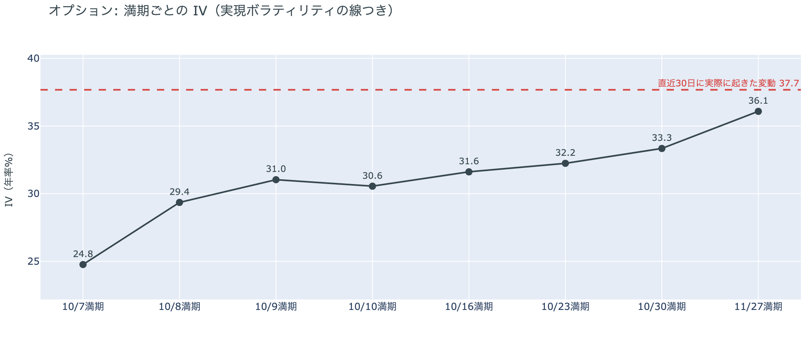

*図の見方: IVを満期ごとに並べたもの。点線は実現ボラティリティ。IVが点線より下なら、市場はこの先の値動きを過去の値動きより小さいと見ています。*

* IVは全体で36.1。実現ボラティリティ37.7より1.6pt低く、過去1年で下から13%。
* 満期ごとのIVは、10月7日の24.8から11月27日の36.1まで、途中に突出した満期が無い。

オプションの参加者は、この先しばらく大きく動くとは見ていません。IV（＝値動きの幅の予想）は実現ボラティリティ（＝過去の値動きの幅）より低く、この1年でも低い部類だからです。9月のFOMCの議事録が出る10月8日をまたぐ満期（＝権利の期限）にも、ほかの満期に対する上乗せは乗っておらず、議事録で大きく動くとは見られていません。

**図④-2 満期ごとのプットとコールの差**

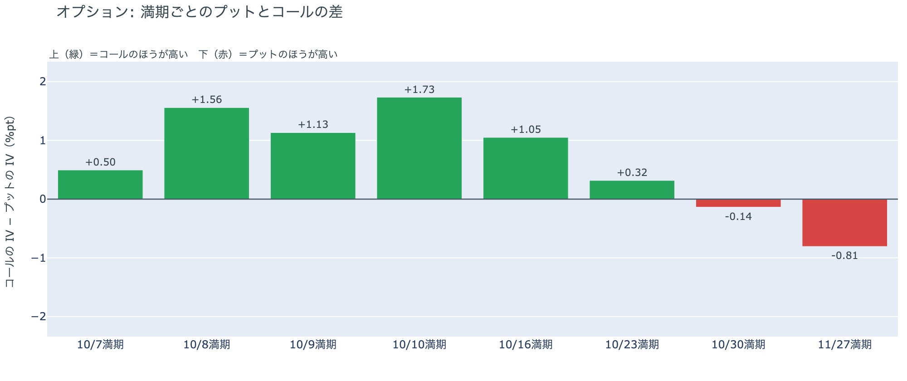

*図の見方: 満期ごとに、プットとコールのどちらが高く売れているか。ゼロより上ならコールのほうが高く、下ならプットのほうが高い。*

| 満期 | どちらが高いか |
|---|---|
| 10月7日 | コールが高い |
| 10月8日 | コールが高い |
| 10月9日 | コールが高い |
| 10月10日 | コールが高い |
| 10月16日 | コールが高い |
| 10月23日 | コールがわずかに高い（前日はほぼ差なし） |
| 10月30日 | プットがわずかに高い |
| 11月27日 | プットが高い |

参加者は、今月の半ばまでは下げより上げに備え、下げへの備えは10月末のFOMCから先に置いています。プットのほうが高いのは、10月27〜28日のFOMCをまたぐ10月30日の満期から先だけだからです。ただし10月30日の満期でプットが高い幅はわずかで、はっきり高いのはその先の11月27日の満期です。FOMCの直後に大きく下げると身構えているのではなく、年末へ向けた長い区間に備えを置いている、ということです。

**図④-3 10月30日満期の持ち高（権利の価格ごと）**

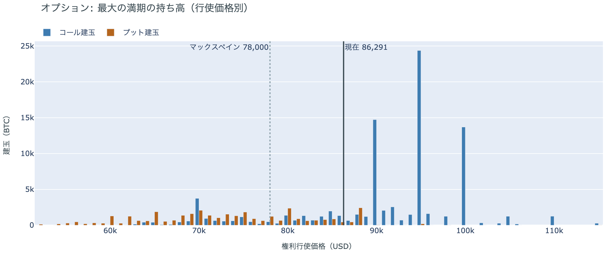

*図の見方: 青＝コール、橙＝プット。現値より上にコールが、下にプットが積まれるのが普通です。*

| 10月30日満期のオプション | 量（万BTC） | 意味 |
|---|---:|---|
| コール | 約9.0 | 「価格が上がる」に賭けた分 |
| プット | 約3.6 | 「価格が下がる」への保険 |
| うち、いまより15%以上高い価格のコール | 約1.7 | 大きな上げへの賭け |
| うち、いまより15%以上安い価格のプット | 約1.9 | 大きな下げへの保険 |

* 10月30日満期の持ち高は約12.5万BTCと全満期の35%で、コールがプットの2.5倍。
* コールが集まっている価格は$95,000に約2.4万BTC、$90,000に約1.5万BTC。

「価格が上がる」に賭けた人たちは降りておらず、10月末に向けた上げへの期待は残っています。10月30日満期の持ち高は前日とほぼ同じ形で、コールの大半はいまより高い$90,000と$95,000に積まれたままだからです。その賭けが報われるには、FOMCを越えて10月30日までに$90,000を超える必要があり、いまの価格からは5%強の距離があります。先物では上げを追う人が消えたのに、オプションでは上げへの賭けが残っているので、参加者は近いうちの上げは追わず、10月末までの上げには期待を残している、という構えです。

## 4. 価格に影響しうる直近のイベント

オプション市場が下げへの備えを置いているのは10月30日の満期から先で、10月27〜28日のFOMCをまたぐ区間に当たります。9月のFOMCの議事録をまたぐ10月8日・9日の満期と、米9月のCPIをまたぐ10月16日の満期は、コールのほうが高く値付けされています。

| 日付 | イベント | 何に効くか |
|---|---|---|
| 10/8（木）3:00 日本時間 | 9月のFOMCの議事録 | 金利。10月8日・9日の満期がまたぐ |
| 10/14（水）21:30 日本時間 | 米9月のCPI（＝米国の物価統計）。10月のFOMCの前に出る最後の物価統計 | 金利。10月16日の満期がまたぐ |
| 10/27（火）〜28（水） | FOMC。利上げの織り込みは約2割（1週間前は約5割）。結果は日本時間29日未明 | 金利。プットがわずかに高い10月30日の満期がまたぐ |
| 10/30（金）17:00 | オプションの最も大きな満期（約12.5万BTC、全満期の35%）。FOMCの2日後 | $90,000以上のコールの期限 |
| 11/1（日） | OPEC+の会合。7か国が12月の生産目標を決める | 原油 |

## まとめ：火曜日の動きは何だったか

火曜日は、はっきりしたきっかけが無いまま、夜にショートの買い戻しと清算が価格を$86,600まで押し上げ、日付が変わる頃に新しく積まれたショートが約$85,600へ押し戻した日でした。動いたのは先物までで、アメリカの買い手はどちら側にも加わらず、長期保有者の利益確定の売りも減り方が小さいままなので、ビットコイン自身の需給の土台は変わっていません。参加者は、近いうちに大きく動くとは見ておらず、上げを追って賭けを大きくする人はいなくなりましたが、10月末までの上げへの期待は捨てておらず、下げへの備えは10月末のFOMCから先の長い区間に薄く置いています。

---

<small>（数値は10月7日7時5分（日本時間）までのデータに基づきます。価格・先物・オプション・Coinbase Premiumはその時点の値、市場心理は10月6日の確定値、オンチェーン（＝ブロックチェーン上の記録）は10月5日時点、ETF資金フローは10月6日分までで、10月6日分は集計途中です。証券市場の終値は10月6日時点です。FOMCの織り込みは10月6日のFF金利先物の終値から計算したものです。オンチェーンの長期保有者の数値には、ETFや取引所が預かっている分も含まれます。オプションはDeribit（BTCオプションの大半を占める取引所）の全銘柄です。）</small>

*本稿は情報提供を目的としたものであり、投資助言ではありません。将来の価格動向を保証・示唆するものではなく、投資判断は各自の責任において行ってください。*
