# 水曜の朝に$83,000台へ、新しいショートと清算が下げを運ぶ ― 米国の買い手は沈み、IVは動かず

**2026年10月8日**

ビットコインは水曜日、朝10時台から11時台にかけて$85,500台から$83,800台へ下げ、その後も戻らないまま、朝7時5分の時点で約$83,169でした。

* **価格**：24時間で−2.8%下げ、値幅は3.4%と前日の1.9%から広がった。この1週間でいちばん大きく動いた日で、下げた分は朝までに戻っていない
* **きっかけ**：はっきりした出来事は無かった。下げはアジアの時間にドルが上がり金が下げた時間と重なるが、株はほぼ動かず、原油も小幅安で終わっている。未明に出た9月のFOMC（＝米国の金利を決める会合）の議事録は、ビットコインを動かしていない
* **先物**：下げを運んだ。朝の下げでは新しく積まれた売り持ち（ショート）が押し下げ、買い持ち（ロング）の清算（＝証拠金不足で強制的に閉じられた取引）が加速させた。夜はロングの手仕舞いがもう一段下げ、資金調達率（＝ロングが払う金利。プラス＝ロングがショートより多い）は1日をならすとマイナスのまま。上げへの確信は戻っておらず、参加者は下げ側へ乗り換えた
* **需給の土台**：米国の買い手は下げを買い支えに来ず、Coinbase Premium（＝アメリカとそれ以外の価格差）はいつものブレを超えて沈んだ。ただし1週間平均は変わらず、長期保有者の利益確定の売りも続いているが強まっていないので、土台は前日から変わっていない
* **オプションの見方**：3%近く下げても備えを買い足していない。値動きの幅の予想は前日と同じで、プット（＝決めた価格で売る権利）のほうが高い満期が今週と10月16日に増えたものの、どの満期も差はわずか。大きく崩れるとは見ていない

## 1. 何が起きたか

**図1-1 価格の推移（1時間足・直近7日）**

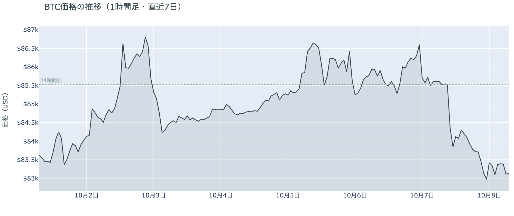

*図の見方: 1時間ごとの価格（日本時間）。点線は24時間前の水準。右端で線が点線の下へ段を付けて下り、そのまま戻っていません。*

* 24時間の値幅は3.4%で、前日の1.9%から広がった。
* Hyperliquidで見えた清算はすべてロングで、最大の1件が全体の45%。

水曜日は、朝のうちに下げた分を一日かけても戻せませんでした。朝7時5分の時点で約$83,169と、24時間前より2.8%低い水準です。10時台の終わりに$85,500台から下げ始め、11時すぎに$83,800台まで速く下げたあと、昼から夕方は$84,000前後で止まり、夜21時台から22時台にもう一段下げて$83,000前後で朝を迎えました。清算は11時台に集まっていて、Hyperliquid（＝オンチェーンの先物取引所）で見えたのは大口1つではなく複数のロングです。下げは清算なしで始まり、11時すぎに清算が加速させました。夜の下げに入った清算は少なく、ロングを自分から手仕舞った人が二段目の下げを運んでいます。

**図1-2 価格と50日・200日移動平均**

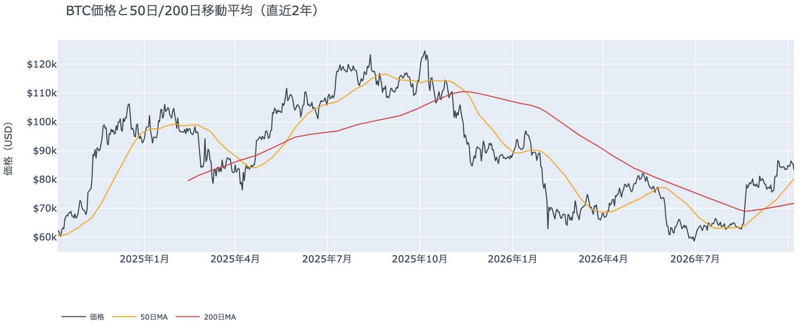

*図の見方: 2本の平均線の上下関係を見ます。50日線が200日線の上にあるのがゴールデンクロスです。*

* 50日線と200日線の差は約$8,548（11.9%）で、前日からさらに開いた。
* 価格は50日線の3.6%上で、前日の7.2%上から近づいた。

長い目で見た流れの向きは、水曜の下げでも変わっていません。ゴールデンクロス（＝50日線が200日線を上抜けること）の状態が30日目で、2本の平均線の差は開き続けています。ただし価格は50日線まで4%弱のところまで下げてきていて、この1か月でいちばん近い位置にいます。

**図1-3 実際に起きた清算（Hyperliquid・直近24時間）**

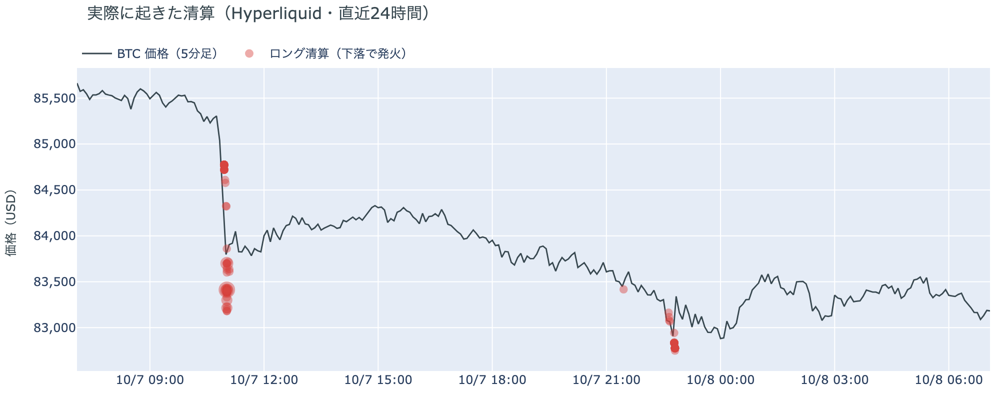

*図の見方: 価格の線に、清算が起きた時刻と価格を点で重ねたもの（日本時間）。緑はショートの清算で上昇のときに、赤はロングの清算で下落のときに起きます。*

* 値動きの速い5分足に、清算の全部が入っていた。

水曜の下げは多数のロングの清算を伴い、清算が動きを加速させました。Hyperliquidで見える範囲では、清算の8割が11時台の$83,000台に集まっていて、10時台の終わりに始まった下げが11時すぎに速くなったのは、この清算が重なったからです。ショートの清算は一つもなく、この24時間に強制で閉じられたのはロングだけでした。

10月7日の証券市場は、株がほぼ動かず、金が下げ、ドルが上がった日でした。米国株（S&P500）は−0.22%、金は−1.2%で、米10年債利回りは5.28%です。ビットコインは金と同じ向きに下げ、株より大きく下げています。証券市場からビットコインへ買いの支えが来た日ではなく、かといって売りの材料が持ち込まれた日でもありません。

## 2. なぜ動いたか：きっかけと、需給のどこが動いたか

**図2-1 ビットコインと株・金・原油の相対推移（起点＝100）**

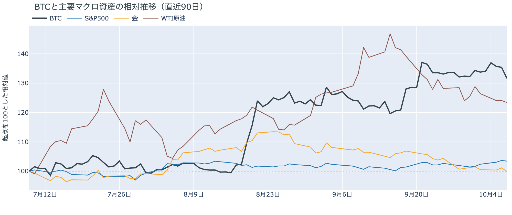

*図の見方: 同じ起点から何%動いたかで重ねたもの。線の向きが揃っているかを見ます。*

| この5営業日の動き（ビットコインは7日間） | 変化 |
|---|---:|
| ビットコイン | −0.5% |
| 金 | −1.2% |
| 米国株（S&P500） | +2.0% |
| 原油 | −1.6% |

* 建玉は96,220BTCで、前日の95,319BTCから0.9%増えた。
* 10時台と11時台は価格が2.0%下げながら建玉が0.9%増え、下げの最中にショートが積まれた。

水曜の下げは、はっきりしたきっかけが無いまま、朝に新しく積まれたショートと、それに押されたロングの清算を通って起きました。

1. きっかけ：見当たりません。下げが始まった10時台はアジアの時間で、同じ時間にドルが上がり、金が下げていました。ただし株はほぼ動かず、原油も−0.6%で終わっていて、証券市場に大きく動いたものはありません。ホルムズ海峡でイランによる船舶への攻撃が続いているという報道はありましたが、原油はそれで上げておらず、ビットコインだけが2.8%下げた形です。未明3時に出た9月のFOMCの議事録のあと、米10年債利回りは5.34%から5.28%へ下がり、ビットコインは動いていません。10月のFOMCで利上げする織り込みも約2割のままです。この5営業日では株が+2.0%、ビットコインが−0.5%と逆向きなので、この1週間のビットコインは株と共通のきっかけで動いていません。
2. 伝わり方：先物を通りました。10時台と11時台は価格が下げながら建玉（＝先物の未決済残高。証拠金で張っている人の量）が増えていて、新しく積まれたショートが押し下げ、途中からロングの清算が加速させました。夕方は建玉が増えたまま価格は$84,000前後で止まり、21時台から22時台は価格が下げながら建玉が減っていて、ロングの手仕舞いが二段目の下げを運びました。現物の買い手は下げを受け止めに来ておらず、Coinbase Premiumはこの日いつものブレを超えて沈んでいます（図①-1）。

前日は「上げを追うロングはいなくなり、わずかにショート側へ傾いた」と説明しました。水曜はそのショートが積み増され、残っていたロングが清算と手仕舞いで減ったので、前日の説明は今日の数値と合っています。傾きは、一晩でわずかな傾きからはっきりした傾きへ進みました。

規制では、米SEC（＝米国の証券の規制当局）が10月5日に値動きの3倍を狙うビットコインETFの上場を認め、米CFTC（＝米国の先物の規制当局）が暗号資産の取引所向けの規則案を公表しました。どちらも水曜の値動きに効いた形跡はありません。

## 3. 市場参加者はいまどう見ているか

### ① アメリカの買い手は下げを買い支えに来ず、手を止めたままが続く

**図①-1 Coinbase Premium（アメリカとそれ以外の価格差・直近90日）**

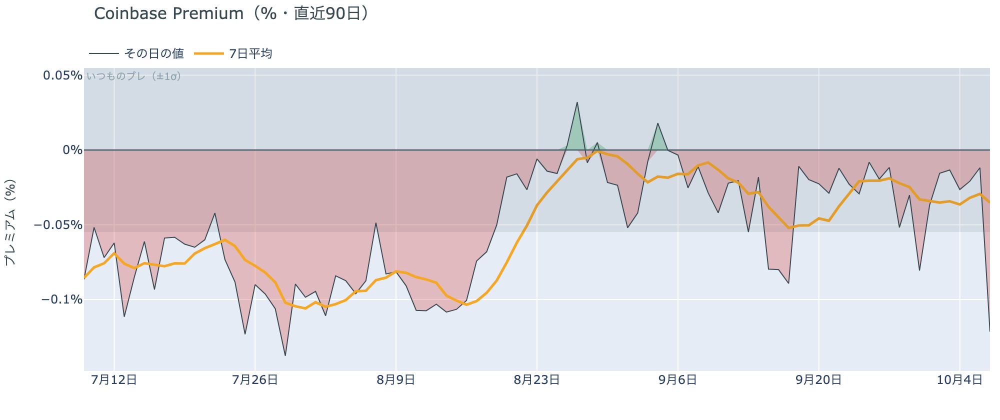

*図の見方: プラス＝アメリカで買いが強い。太線が1週間平均、細線がその日の値。薄い帯は「いつものブレの範囲」です。*

* 1週間平均は−0.04%で、前の週の−0.03%とほぼ同じ。
* その日の値は−0.12%で、いつものブレの2.2倍。

アメリカの買い手は、水曜の下げを買い支えに来ていません。Coinbase Premiumはその日の値でいつものブレを超えて沈んでいて、下げた日にアメリカでの売りがそれ以外の市場より強かったということです。ただし1週間平均は前の週から動いておらず、アメリカの買い手が逃げ始めたと言える形ではありません。手を止めている状態が、下げの日も続いています。

**図①-2 ETFの日ごとの資金の出入り（直近90日）**

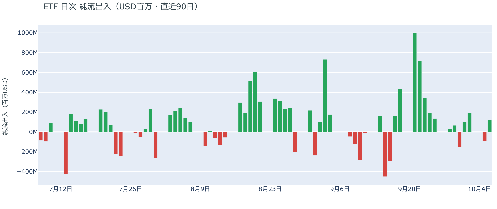

*図の見方: 入ったお金と出たお金の差。上に伸びれば入り超、下に伸びれば出超。*

| ETFの日ごとの出入り | 億ドル |
|---|---:|
| 10月1日 | +1.0 |
| 10月2日 | +1.9 |
| 10月5日 | −0.9 |
| 10月6日 | +1.2 |
| 直近7営業日の合計 | +2.7 |

ETFの買い手は細く買い続けていて、逃げてはいません。水曜の下げの前にあたる10月6日は流入に戻り、直近7営業日の合計も入り超だからです。ただ9月下旬に1日で数億ドルずつ入っていた頃の勢いは無く、下げを受け止めるほどの買いではありません。

**図①-3 Fear & Greed（市場心理の指数・直近90日）**

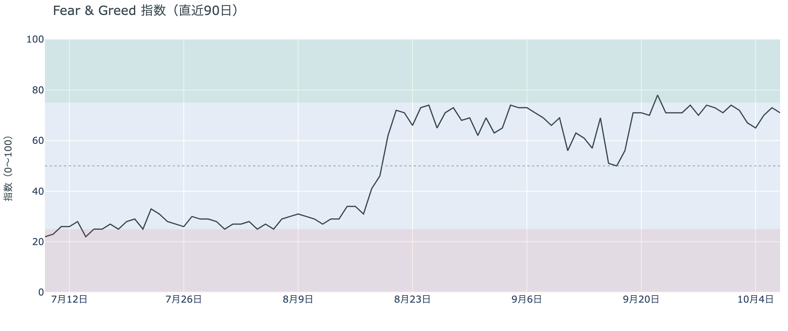

*図の見方: 0〜100で、50より上が「強欲」、下が「恐怖」。*

* 71の「強欲」。前日の73から2pt下げ、1週間前も1か月前も71。

市場心理は、下げの日でも冷めていません。Fear & Greed（＝市場心理の指数）は10月7日の確定値で「強欲」のまま、1週間前とも1か月前とも同じ水準だからです。価格が$83,000台へ下げても、多数はまだ強気の側にいるということです。

### ② 長期保有者は利益確定の売りを続けているが、減り方は前の週より小さい

**図②-1 長期保有者の保有量の30日変化とSOPR（直近90日）**

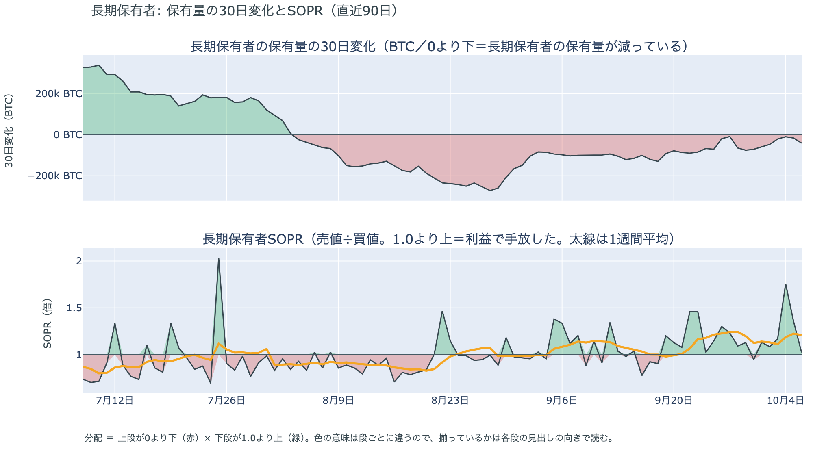

*図の見方: 上段は、長期保有者の保有量が30日でどれだけ増減したか。マイナス＝手放している。下段は長期保有者SOPRで、1より上なら利益で手放した。どちらも1週間平均で読みます。*

| 10月6日時点 | 1週間平均 | 前の週の平均 |
|---|---:|---:|
| 長期保有者SOPR（1より上＝利益で手放した） | 1.21 | 1.20 |
| 長期保有者の保有量の30日変化（万BTC） | −3.8 | −5.6 |

* その日の値は−4.1万BTCで、1か月前（9月6日）の−9.8万BTCの4割ほど。

長期保有者（＝155日以上保有者）は利益確定の売りを続けていますが、減り方は前の週より小さくなっています。保有量は30日で減り、動いたコインは平均して買値より高く動いています。10月6日時点の数値なので水曜の下げの前の姿ですが、$86,000台でも売りを急いでいなかったので、長期保有者の側から見たビットコイン自身の需給の土台は、前日と変わっていません。

長期保有者のほかに、売りに回りそうな持ち手も見当たりません。長く眠っていたコインが急に動いた記録はなく、マイナーの収入も平年をやや上回る程度（Puell Multiple（＝マイナー収入の平年比）が1週間平均で1.10）で、売りを急ぐ状況ではありません。

### ③ 先物：ロングは減り、参加者は下げ側へ乗り換えた

**図③-1 資金調達率と建玉（直近30日）**

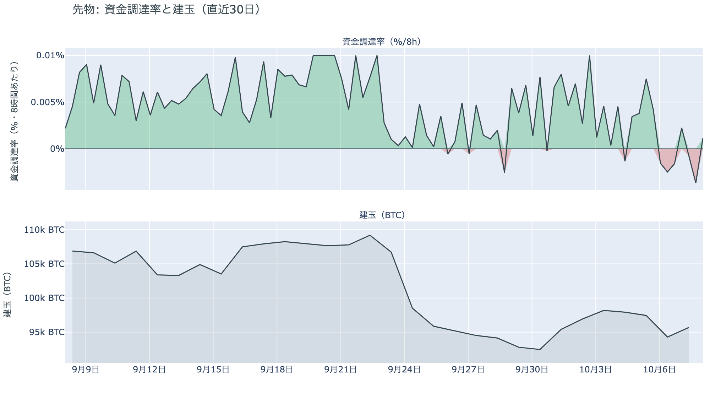

*図の見方: 上段は資金調達率（8時間ごと・日本時間）。プラスが続く＝ロングがショートより多い。下段は建玉。*

* 短期金利を引いた上乗せは直近34日でいちばん小さく、34日の平均は+0.73pt。
* 建玉の7日変化は+3.5%で、下げの日にも減っていない。

先物の参加者は、上げへの確信を失ったまま、下げに賭ける側へ一段傾きました。資金調達率は1日をならした年率で−1.19%と、短期金利（＝ドルを米国の短期国債で持つだけで受け取れる金利。13週Tビル 4.04%）を引いた上乗せは−5.22ptです。マイナス＝ショートがロングへ払っている＝ショートがロングより多い、ということです。朝の下げでショートが新しく積まれ、残っていたロングが清算と手仕舞いで減ったので、傾きは前日より深くなりました。ただし建玉は下げの日に減っておらず、むしろ増えています。参加者は市場から手を引いたのではなく、上げの賭けを下げの賭けに持ち替えた、ということです。

### ④ オプション：下げても備えは買い足さず、プットが高い満期が今週にも増えた

オプションには2種類あります。コール（＝決めた価格で買う権利）とプット（＝決めた価格で売る権利）で、価格が上がればコールの価値が上がり、価格が下がればプットの価値が上がります。プットは「価格が下がったときの保険」として買われます。オプションを買う人は、その権利と引き換えに権利料（＝オプションを買う人が払う金額）を払います。

**図④-1 満期ごとのIV（年率%）**

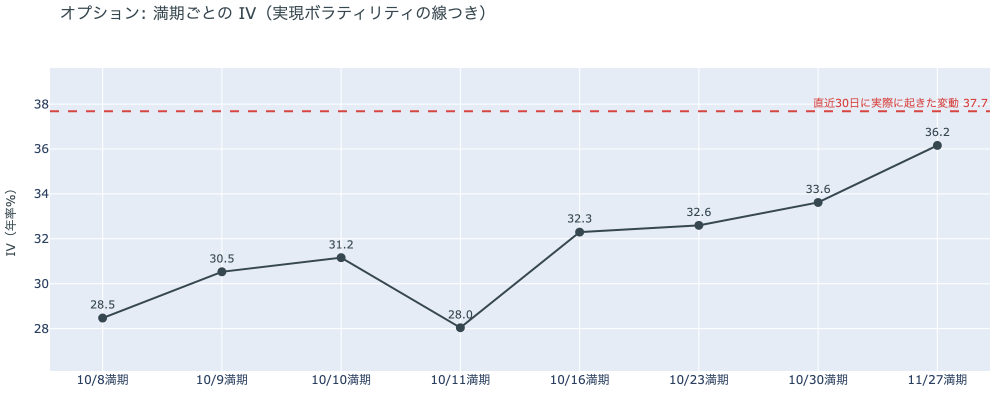

*図の見方: IVを満期ごとに並べたもの。点線は実現ボラティリティ。IVが点線より下なら、市場はこの先の値動きを過去の値動きより小さいと見ています。*

* IVは全体で36.1と前日と同じ。実現ボラティリティ37.7より1.6pt低く、過去1年で下から14%。
* 満期ごとのIVは、10月8日の28.5から11月27日の36.2まで、突出した満期が無い。

オプションの参加者は、水曜の下げを見ても備えを買い足していません。IV（＝値動きの幅の予想）は前日と同じで、実現ボラティリティ（＝過去の値動きの幅）より低いままなので、この下げで値動きの幅が広がるとは見ていないということです。10月14日の米CPI（＝米国の物価統計）をまたぐ10月16日の満期（＝権利の期限）にも、ほかの満期に対する上乗せは乗っていません。

**図④-2 満期ごとのプットとコールの差**

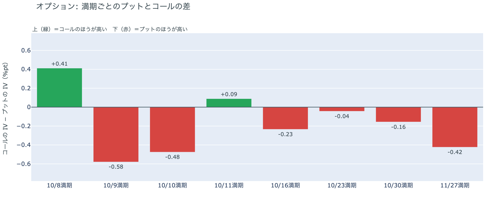

*図の見方: 満期ごとに、プットとコールのどちらが高く売れているか。ゼロより上ならコールのほうが高く、下ならプットのほうが高い。*

| 満期 | どちらが高いか |
|---|---|
| 10月8日 | コールが高い |
| 10月9日 | プットが高い（前日はコールが高かった） |
| 10月10日 | プットが高い（前日はコールが高かった） |
| 10月11日 | ほぼ差なし |
| 10月16日 | プットがわずかに高い（前日はコールが高かった） |
| 10月23日 | ほぼ差なし |
| 10月30日 | プットがわずかに高い |
| 11月27日 | プットが高い |

参加者は、下げへの備えを10月末から先だけでなく今週の満期にも置くようになりましたが、どの満期も差はわずかで、大きく崩れると身構えているわけではありません。前日まで今月半ばまでの満期はすべてコールのほうが高かったのが、水曜の下げで10月9日・10日と、米CPIをまたぐ10月16日の満期でプットのほうが高くなりました。上げに備える形は崩れ、向きは下げ側へ移ったということです。ただしはっきりプットが高いのは11月27日の満期だけで、10月末のFOMCをまたぐ10月30日の満期の差は前日と同じくわずかなままです。

**図④-3 10月30日満期の持ち高（権利の価格ごと）**

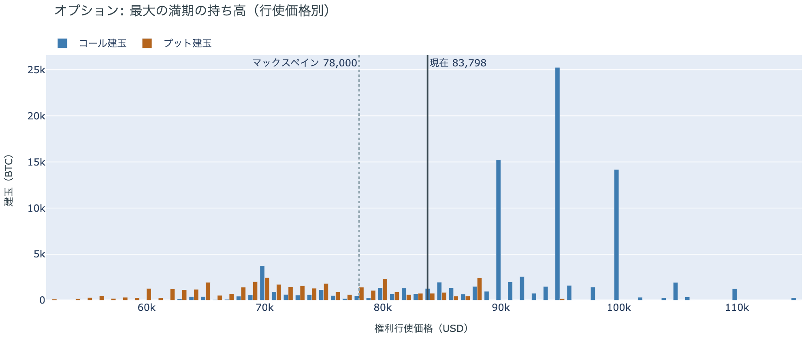

*図の見方: 青＝コール、橙＝プット。現値より上にコールが、下にプットが積まれるのが普通です。*

| 10月30日満期のオプション | 量（万BTC） | 意味 |
|---|---:|---|
| コール | 約9.2 | 「価格が上がる」に賭けた分 |
| プット | 約4.0 | 「価格が下がる」への保険 |
| うち、いまより15%以上高い価格のコール | 約2.0 | 大きな上げへの賭け |
| うち、いまより15%以上安い価格のプット | 約1.9 | 大きな下げへの保険 |

* 10月30日満期の持ち高は約13.2万BTCと全満期の36%で、前日の約12.5万BTCから増え、コールがプットの2.3倍。
* コールが集まっている価格は$95,000に約2.5万BTC、$90,000に約1.5万BTC。

「価格が上がる」に賭けた人たちは、水曜の下げでも降りていません。10月30日満期の持ち高は前日より増え、コールの大半はいまより高い$90,000と$95,000に積まれたままだからです。その賭けが報われるには、FOMCを越えて10月30日までに$90,000を超える必要があり、水曜の下げで距離は5%強から8%ほどに開きました。先物では下げ側へ乗り換えた一方で、オプションの上げへの賭けは残っているので、参加者は目先の下げを受け入れつつ、10月末までの上げには期待を残している構えです。

## 4. 価格に影響しうる直近のイベント

オプション市場が下げへの備えを置いているのは、今週の10月9日・10日の満期、米9月のCPIをまたぐ10月16日の満期、そして10月末のFOMCをまたぐ10月30日から先の満期です。いずれも差はわずかで、はっきりプットが高いのは11月27日の満期だけです。

| 日付 | イベント | 何に効くか |
|---|---|---|
| 10/14（水）21:30 日本時間 | 米9月のCPI。10月のFOMCの前に出る最後の物価統計 | 金利。プットがわずかに高い10月16日の満期がまたぐ |
| 10/15（木）21:30 日本時間 | 米9月の小売売上高と生産者物価指数 | 金利 |
| 10/27（火）〜28（水） | FOMC。利上げの織り込みは約2割（1週間前は約4割）。結果は日本時間29日未明 | 金利。プットがわずかに高い10月30日の満期がまたぐ |
| 10/29（木）〜30（金） | 日銀の会合。展望レポートも出る | 円 |
| 10/30（金）17:00 | オプションの最も大きな満期（約13.2万BTC、全満期の36%）。FOMCの2日後 | $90,000以上のコールの期限 |
| 11/1（日） | OPEC+の会合。12月の生産目標を決める | 原油 |

## まとめ：水曜日の動きは何だったか

水曜日は、はっきりしたきっかけが無いまま、朝に新しく積まれたショートとロングの清算が価格を$83,800台へ押し下げ、夜にロングの手仕舞いがもう一段下げて約$83,000で朝を迎えた日でした。動いたのは先物までで、アメリカの買い手は買い支えに来なかったもののこの1週間の姿勢は変わらず、長期保有者の利益確定の売りも減り方が小さいままなので、ビットコイン自身の需給の土台は変わっていません。参加者は、下げ側へ乗り換えながらも値動きの幅が広がるとは見ておらず、10月末までの上げへの期待は捨てずに、下げへの備えを今週と米CPI・FOMCをまたぐ満期に薄く置いています。

---

<small>（数値は10月8日7時5分（日本時間）までのデータに基づきます。価格・先物・オプション・Coinbase Premiumはその時点の値、市場心理は10月7日の確定値、オンチェーン（＝ブロックチェーン上の記録）は10月6日時点、ETF資金フローは10月6日分までです。証券市場の終値は10月7日時点です。FOMCの織り込みは10月7日のFF金利先物の終値から計算したものです。オンチェーンの長期保有者の数値には、ETFや取引所が預かっている分も含まれます。オプションはDeribit（BTCオプションの大半を占める取引所）の全銘柄です。）</small>

*本稿は情報提供を目的としたものであり、投資助言ではありません。将来の価格動向を保証・示唆するものではなく、投資判断は各自の責任において行ってください。*
