# 原油高と株安の夜に$80,000台へ ― ロングの手仕舞いと清算が下げを運び、ETFは6月以来の流出

**2026年10月9日**

ビットコインは木曜日、日中はじわじわと$82,000台前半まで下げたあと、日本時間の深夜0時台に$82,600台から$80,300台まで一気に下げ、明け方に少し戻して、朝7時5分の時点で約$81,640でした。

* **価格**：24時間で−1.9%下げ、値幅は3.9%と前日の3.4%からさらに広がった。2日続けて下げた日で、一時は50日移動平均を下回った
* **きっかけ**：下げた深夜0時台は米国の昼で、同じ時間に株（とくにAI関連の銘柄）が下げ、原油がホルムズ海峡でのタンカー攻撃とメキシコ湾のハリケーンで3%上げていた。証券市場と同じ向きに動いた夜で、ビットコインだけの出来事ではない。米政府の押収ビットコインの移動は時刻が合わず、きっかけではない
* **先物**：下げを運んだ。深夜0時台に買い持ち（ロング）の手仕舞いと清算（＝証拠金不足で強制的に閉じられた取引）が重なって価格を押し下げ、清算が動きを加速させた。前日に積まれた売り持ち（ショート）は明け方に買い戻され、資金調達率（＝ロングが払う金利。プラス＝ロングがショートより多い）はほぼゼロに戻った。参加者は上げにも下げにも確信を持っていない
* **需給の土台**：ETFから10月7日に今年6月以来の大きさの流出が出て、1週間の合計も出超に転じた。米国の買い手の一部が降りた形で、ここは前日から動いた。長期保有者の利益確定の売りは続いているが、減り方は前の週より小さいままで変わっていない
* **オプションの見方**：下げへの備えを全部の満期に広げた。前日までコールのほうが高かった満期も含めてプット（＝決めた価格で売る権利）のほうが高くなり、いちばん高いのは今日9日の満期。ただし値動きの幅の予想はほとんど上がっておらず、大きく崩れるとは見ていない

## 1. 何が起きたか

**図1-1 価格の推移（1時間足・直近7日）**

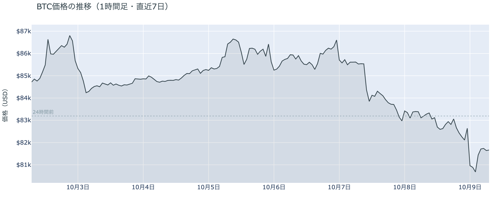

*図の見方: 1時間ごとの価格（日本時間）。点線は24時間前の水準。右端で線が点線の下へ崖のように落ち、少しだけ戻っています。*

* 24時間の値幅は3.9%で、前日の3.4%から広がった。
* Hyperliquidで見えた清算はほぼ全部がロングで、8割が深夜0時台に集まり、最大の1件は全体の33%。

木曜日は、日中に少しずつ下げていた価格が、深夜0時台に一気に$81,000を割った日でした。朝7時5分の時点で約$81,640と、24時間前より1.9%低く、1週間前と比べると3.8%低い水準です。10月8日の日中は$83,000台から$82,000台前半へじわじわと下げ、深夜0時台に$82,600台から一時$80,300台まで落ちました。明け方3時台に$81,400台まで戻しましたが、深夜の下げの前の$82,600台には戻っていません。清算はその0時台に集まっていて、Hyperliquid（＝オンチェーンの先物取引所）で見えたのは大口1つではなく多数のロングです。値動きがいちばん速かった0時25分の5分足にも清算が入っていて、清算が下げを加速させました。

**図1-2 価格と50日・200日移動平均**

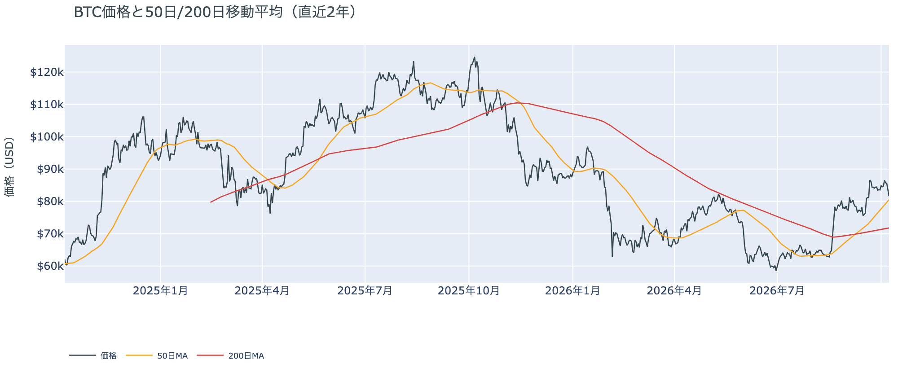

*図の見方: 2本の平均線の上下関係を見ます。50日線が200日線の上にあるのがゴールデンクロスです。*

* 50日線と200日線の差は約$8,727（12.2%）で、前日からさらに開いた。
* 価格は50日線の1.4%上。24時間の安値$80,315は50日線の$80,524を下回っていた。

長い目で見た流れの向きは変わっていませんが、価格は50日線まで下げてきました。ゴールデンクロス（＝50日線が200日線を上抜けること）の状態が31日目で、2本の平均線の差は開き続けています。ただし深夜の下げで価格は一時50日線を下回り、朝の時点でもその1.4%上にいるだけで、前日の3.6%上からさらに近づきました。

**図1-3 実際に起きた清算（Hyperliquid・直近24時間）**

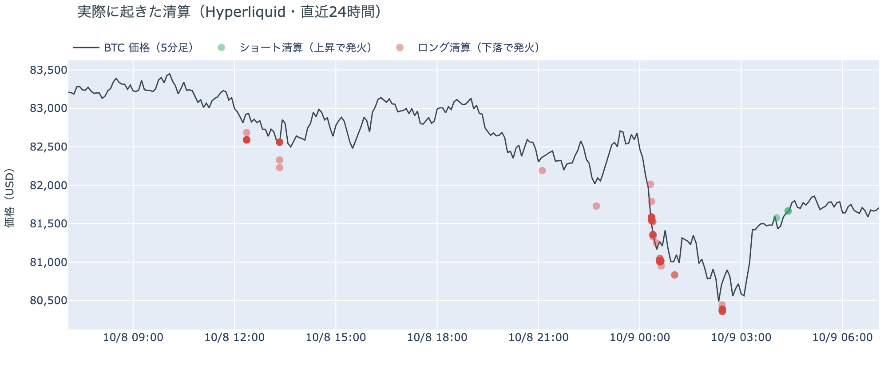

*図の見方: 価格の線に、清算が起きた時刻と価格を点で重ねたもの（日本時間）。緑はショートの清算で上昇のときに、赤はロングの清算で下落のときに起きます。*

* 清算の8割が深夜0時台の$81,000台に集まり、ショートの清算は明け方4時台のごくわずかだけ。

木曜深夜の下げは多数のロングの清算を伴い、清算が動きを加速させました。Hyperliquidで見える範囲では、ロングの清算は$81,000台に集中していて、0時台に価格が速く落ちたのは、この清算が重なったからです。明け方に価格が戻ったときに焼けたショートは、ほとんどありません。

10月8日の証券市場は、株が下げ、原油が大きく上げた日でした。米国株（S&P500）は−0.47%で、ハイテク中心のナスダックは1%以上下げ、原油は+3.3%で$91台に戻しています。ビットコインが下げた深夜0時台は米国の取引時間のまっただ中で、同じ時間に株が下げ原油が上げていました。ビットコインにとっては、証券市場と同じ向きに動いた夜で、原油の材料（ホルムズ海峡）は週末に向けて持ち越されています。

## 2. なぜ動いたか：きっかけと、需給のどこが動いたか

**図2-1 ビットコインと株・金・原油の相対推移（起点＝100）**

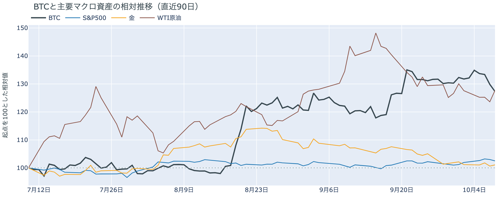

*図の見方: 同じ起点から何%動いたかで重ねたもの。線の向きが揃っているかを見ます。*

| この5営業日の動き（ビットコインは7日間） | 変化 |
|---|---:|
| ビットコイン | −3.8% |
| 金 | −1.1% |
| 米国株（S&P500） | +1.3% |
| 原油 | −1.8% |

* 建玉は92,721BTCで、前日の96,220BTCから3.6%減った。
* 深夜0時台は価格が2.0%下げながら建玉が2.3%減り、ロングの手仕舞いと清算が同じ時間に起きた。

木曜深夜の下げは、米国の昼に株が下げ原油が上げたのと同じ時間に、先物のロングの手仕舞いと清算を通って起きました。

1. きっかけ：ビットコインだけの出来事ではなく、証券市場と同じ向きに動いた夜でした。下げた深夜0時台は米国の午前11時にあたり、同じ時間に米国株はAI関連の銘柄を中心に下げ、原油はホルムズ海峡でイランによるタンカー攻撃が増えて通航が2か月ぶりの少なさになったことと、メキシコ湾のハリケーンで米国の生産が止まったことで3%上げていました。10月7日から8日にかけての証券市場は、金とVIXが上がり株が下げて、リスクオフ寄りでした。一方で、金利を通った形跡はありません。FRBのウォラー理事が10月8日の夕方（日本時間）に「追加の利上げが要る」と述べたとき、ビットコインは動いておらず、下げの最中も米10年債利回りは5.30%から5.25%へ下がり続け、10月のFOMC（＝米国の金利を決める会合）で利上げする織り込みも約2割で変わっていません。米政府の押収ビットコインは、10月8日の0時台に約1,156BTCがCoinbase Primeへ移っていますが、これは下げの24時間前で、その後6時間の価格は動いていません。報道では8日の22時半ごろにも約1.2万BTCが別のアドレスへ動いていますが、その直後の1時間に価格はむしろ上げていて、下げ始めはその1時間半後なので、どちらもきっかけではありません。この5営業日で見ると、株が+1.3%、ビットコインが−3.8%と逆向きなので、この1週間を通しては株と共通のきっかけで動いておらず、木曜の夜だけ同じ向きになりました。
2. 伝わり方：先物を通りました。深夜0時台は価格が下げながら建玉（＝先物の未決済残高。証拠金で張っている人の量）が減っていて、ロングの手仕舞いと清算が価格を押し下げ、清算が加速させました。2時台にも価格が下げながら建玉が減り、ロングの手仕舞いが続いています。3時台は価格が戻りながら建玉が減っていて、前日に積まれたショートの買い戻しが戻りを運びました。現物の買い手は下げを受け止めに来ておらず、ETFからは10月7日に今年6月以来の大きさの流出が出ています（図①-2）。

前日は「参加者は上げの賭けを下げの賭けに持ち替えた」と説明しました。木曜深夜に積み増しのショートが価格を押したなら建玉は増えるはずですが、実際には減り、資金調達率は1日をならすとマイナスからほぼゼロへ戻りました。下げの主役は新しいショートではなく、残っていたロングの手仕舞いと清算で、前日に乗り換えたショートは明け方に買い戻されています。下げに賭けた側も、利益を確定して降りたということです。

トランプ大統領は木曜に「中間選挙の前にイランを攻撃しない」と述べ、原油は高値からは戻しましたが、10月8日の終値では+3.3%です。木曜深夜のビットコインの下げは、この原油高と株安に時刻が重なっています。

## 3. 市場参加者はいまどう見ているか

### ① アメリカの買い手は手を止めたままで、ETFからは一部が降りた

**図①-1 Coinbase Premium（アメリカとそれ以外の価格差・直近90日）**

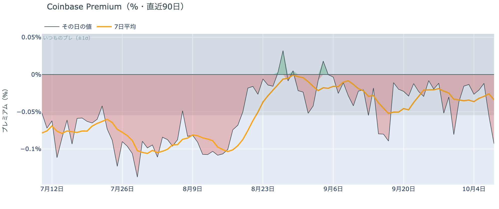

*図の見方: プラス＝アメリカで買いが強い。太線が1週間平均、細線がその日の値。薄い帯は「いつものブレの範囲」です。*

* 1週間平均は−0.03%で、前の週の−0.03%と同じ。
* その日の値は−0.09%で、いつものブレの1.7倍。

アメリカの買い手は、木曜の下げも買い支えに来ていません。Coinbase Premium（＝アメリカとそれ以外の価格差）はその日の値でいつものブレを超えて沈み、下げた日にアメリカでの売りがそれ以外の市場より強かったということです。ただし1週間平均は前の週とまったく同じで、アメリカの買い手が逃げ始めたと言える形ではありません。手を止めている状態が続いています。

**図①-2 ETFの日ごとの資金の出入り（直近90日）**

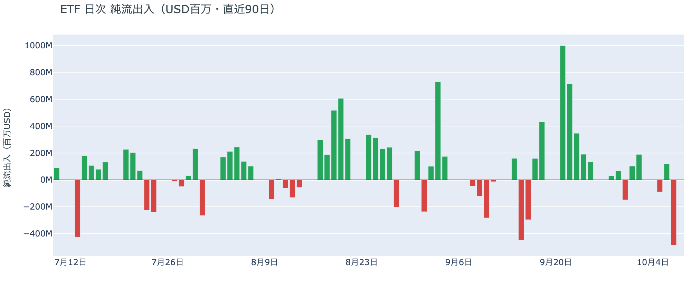

*図の見方: 入ったお金と出たお金の差。上に伸びれば入り超、下に伸びれば出超。*

| ETFの日ごとの出入り | 億ドル |
|---|---:|
| 10月2日 | +1.9 |
| 10月5日 | −0.9 |
| 10月6日 | +1.2 |
| 10月7日 | −4.8 |
| 直近7営業日の合計 | −3.1 |

ETFの買い手は、手を止めていた状態から、一部が降りる側へ動きました。10月7日の流出は今年6月25日以来の大きさで、直近7営業日の合計も出超に転じたからです。9月下旬に1日で数億ドルずつ入っていた買い手の一部が、$83,000台へ下げた日に手放したということです。ただし1日の流出であって、6月のように流出が何日も続いた形にはまだなっていません。

**図①-3 Fear & Greed（市場心理の指数・直近90日）**

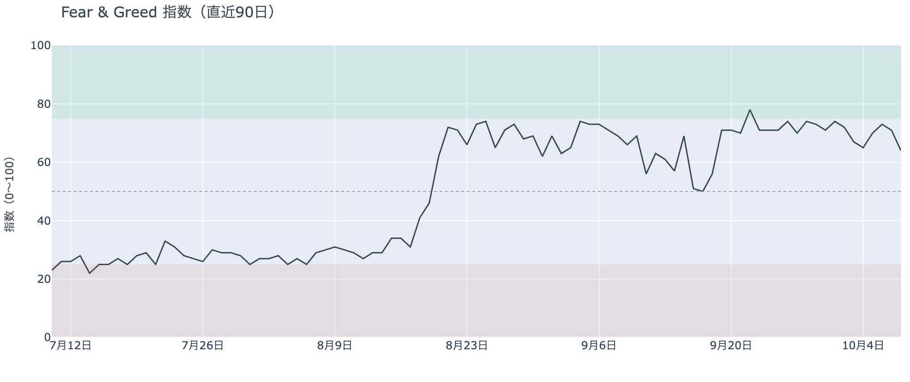

*図の見方: 0〜100で、50より上が「強欲」、下が「恐怖」。*

* 64の「強欲」。前日の71から7pt下げ、1週間前は74、1か月前は69。

市場心理は冷め始めましたが、まだ「強欲」の側にいます。Fear & Greed（＝市場心理の指数）は10月8日の確定値で1週間前から10pt下げたものの、「中立」の境目の55までは距離があるからです。2日続けて下げても、多数はまだ価格の下げを怖がっていないということです。

### ② 長期保有者は利益確定の売りを続けているが、減り方は前の週より小さい

**図②-1 長期保有者の保有量の30日変化とSOPR（直近90日）**

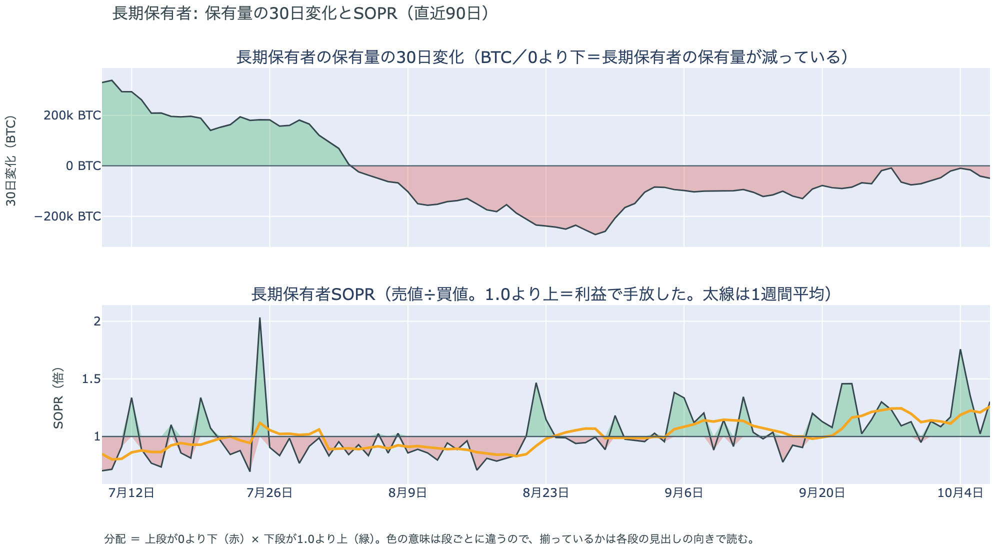

*図の見方: 上段は、長期保有者の保有量が30日でどれだけ増減したか。マイナス＝手放している。下段は長期保有者SOPRで、1より上なら利益で手放した。どちらも1週間平均で読みます。*

| 10月7日時点 | 1週間平均 | 前の週の平均 |
|---|---:|---:|
| 長期保有者SOPR（1より上＝利益で手放した） | 1.26 | 1.13 |
| 長期保有者の保有量の30日変化（万BTC） | −3.5 | −5.4 |

* その日の値は−4.9万BTCで、1か月前（9月7日）の−10.3万BTCの半分以下。

長期保有者（＝155日以上保有者）は利益確定の売りを続けていますが、減り方は前の週より小さくなっています。保有量は30日で減り、動いたコインは平均して買値より高く動いています。10月7日時点の数値なので木曜深夜の下げの前の姿ですが、$83,000台でも売りを急いでいなかったので、長期保有者の側から見たビットコイン自身の需給の土台は、前日と変わっていません。

長期保有者のほかに、売りに回りそうな持ち手も見当たりません。長く眠っていたコインがまとまって動いた記録はなく、マイナーの収入も平年をやや上回る程度（Puell Multiple（＝マイナー収入の平年比）が1週間平均で1.11）で、売りを急ぐ状況ではありません。

### ③ 先物：ロングもショートも降り、どちらにも傾かなくなった

**図③-1 資金調達率と建玉（直近30日）**

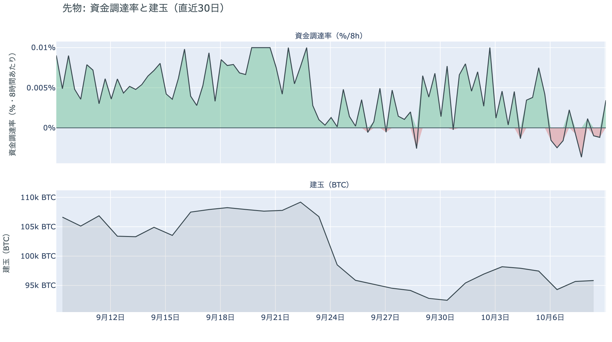

*図の見方: 上段は資金調達率（8時間ごと・日本時間）。プラスが続く＝ロングがショートより多い。下段は建玉。*

* 短期金利を引いた上乗せは直近34日の平均+0.62ptを大きく下回り、資金調達率はマイナスからプラスへ戻ったばかり。
* 建玉は1日で3.6%減り、7日変化は+0.4%で、この1週間に積まれた分がほぼ消えた。

先物の参加者は、上げにも下げにも確信を持てずにいます。資金調達率は1日をならした年率で+0.46%と、短期金利（＝ドルを米国の短期国債で持つだけで受け取れる金利。13週Tビル 4.04%）を引いた上乗せは−3.58ptです。ロングが払う金利は普通の資金のコストを大きく下回っていて、余分に払ってでも上げに賭けたい人はいません。一方で、前日にはっきりついていたショートへの傾きも一晩で消えました。深夜の下げでロングが手仕舞いと清算で減り、明け方にはショートが買い戻されたので、建玉は両側から減っています。参加者は市場から手を引いたのではなく、どちらの賭けも軽くして、次の材料を待っているということです。

### ④ オプション：備えを全部の満期に広げたが、値動きの幅の予想はほとんど上げていない

オプションには2種類あります。コール（＝決めた価格で買う権利）とプット（＝決めた価格で売る権利）で、価格が上がればコールの価値が上がり、価格が下がればプットの価値が上がります。プットは「価格が下がったときの保険」として買われます。オプションを買う人は、その権利と引き換えに権利料（＝オプションを買う人が払う金額）を払います。

**図④-1 満期ごとのIV（年率%）**

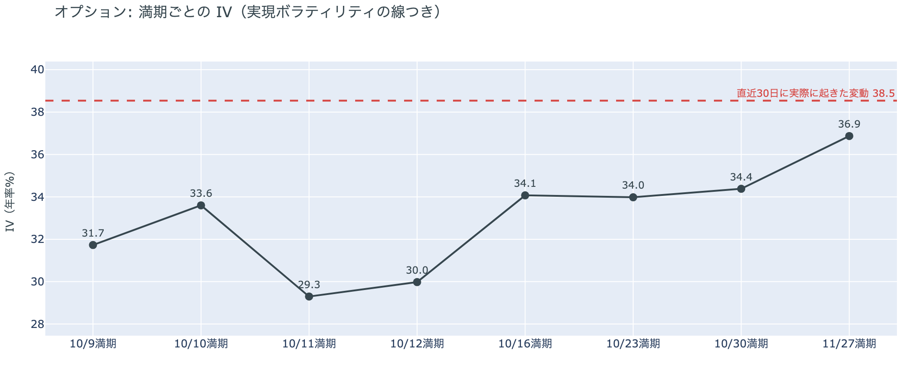

*図の見方: IVを満期ごとに並べたもの。点線は実現ボラティリティ。IVが点線より下なら、市場はこの先の値動きを過去の値動きより小さいと見ています。*

* IVは全体で36.8と、前日の36.1からわずかに上がった。実現ボラティリティ38.5より1.8pt低く、過去1年で下から23%。
* 満期ごとのIVは、10月11日の29.3から11月27日の36.9まで、突出した満期が無い。

オプションの参加者は、2日続けて下げても、この先の値動きが荒くなるとは見ていません。IV（＝値動きの幅の予想）はわずかに上がったものの、実現ボラティリティ（＝過去の値動きの幅）より低いままで、過去1年で見ても低いほうだからです。10月14日の米CPI（＝米国の物価統計）をまたぐ10月16日の満期（＝権利の期限）にも、10月末のFOMCをまたぐ10月30日の満期にも、ほかの満期に対する上乗せは乗っていません。

**図④-2 満期ごとのプットとコールの差**

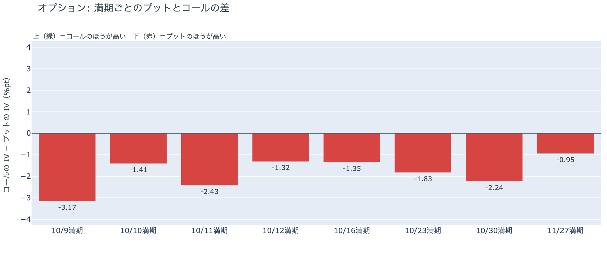

*図の見方: 満期ごとに、プットとコールのどちらが高く売れているか。ゼロより上ならコールのほうが高く、下ならプットのほうが高い。*

| 満期 | どちらが高いか |
|---|---|
| 10月9日 | プットがはっきり高い |
| 10月10日 | プットが高い |
| 10月11日 | プットが高い（前日はほぼ差なし） |
| 10月12日 | プットが高い |
| 10月16日 | プットが高い |
| 10月23日 | プットが高い（前日はほぼ差なし） |
| 10月30日 | プットが高い（前日はわずかだった） |
| 11月27日 | プットがわずかに高い |

参加者は、下げへの備えをこの先の全部の満期に広げました。前日までコールのほうが高かった満期は無くなり、いちばんプットが高いのは今日9日に期限が来る満期です。深夜に下げた直後の、目先の下げに対する備えが最も高く値付けされているということです。前日まで「ほぼ差なし」だった10月11日と23日の満期でもプットのほうが高くなりました。ただし差がはっきり大きいのは今日の満期だけで、10月末から先はプットが高いといってもわずかです。この先の下げに身構えてはいるが、大きく崩れると見ているわけではない、という構えです。

**図④-3 10月30日満期の持ち高（権利の価格ごと）**

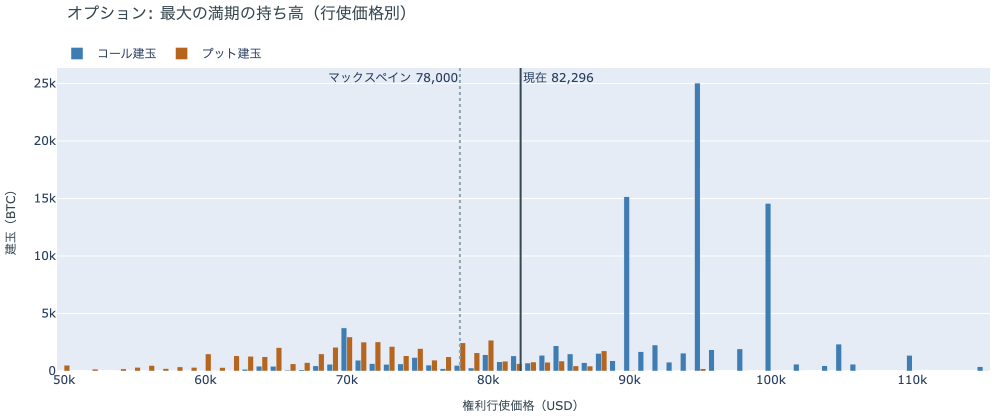

*図の見方: 青＝コール、橙＝プット。現値より上にコールが、下にプットが積まれるのが普通です。*

| 10月30日満期のオプション | 量（万BTC） | 意味 |
|---|---:|---|
| コール | 約9.4 | 「価格が上がる」に賭けた分 |
| プット | 約4.5 | 「価格が下がる」への保険 |
| うち、いまより15%以上高い価格のコール | 約4.9 | 大きな上げへの賭け |
| うち、いまより15%以上安い価格のプット | 約1.6 | 大きな下げへの保険 |

* 10月30日満期の持ち高は約13.9万BTCと全満期の36%で、前日の約13.2万BTCから増え、コールがプットの2.1倍。
* コールが集まっている価格は$95,000に約2.5万BTC、$90,000に約1.5万BTC、$100,000に約1.5万BTC。

「価格が上がる」に賭けた人たちは、2日続けて下げても降りていません。10月30日満期の持ち高は前日より増え、コールの大半はいまより高い$90,000から$100,000に積まれたままだからです。その賭けが報われるには、FOMCを越えて10月30日までに$90,000を超える必要があり、距離は木曜の下げで8%ほどから10%ほどに開きました。先物ではロングもショートも軽くなった一方で、オプションの上げへの賭けは残っているので、参加者は目先の下げには備えつつ、10月末までの上げへの期待は捨てていない構えです。

## 4. 価格に影響しうる直近のイベント

オプション市場が下げへの備えをいちばん厚く置いているのは今日9日の満期で、その先は米9月のCPIをまたぐ10月16日の満期も、10月末のFOMCをまたぐ10月30日の満期も、プットが高いといってもわずかです。特定のイベントに向けて権利料に上乗せが乗っている満期はありません。

| 日付 | イベント | 何に効くか |
|---|---|---|
| 10/12（月） | 米国はコロンブスデーで債券市場が休み。株は開く | 米10年債利回りの確定が1日遅れる |
| 10/14（水）21:30 日本時間 | 米9月のCPI。10月のFOMCの前に出る最後の物価統計 | 金利。プットが高い10月16日の満期がまたぐ |
| 10/15（木）21:30 日本時間 | 米9月の生産者物価指数と小売売上高 | 金利 |
| 10/27（火）〜28（水） | FOMC。利上げの織り込みは約2割で、1週間前から変わっていない。ウォラー理事は10月8日に「追加の利上げは要るが、FOMCごとに続けて上げなくてよい」と述べた。結果は日本時間29日未明 | 金利。プットが高い10月30日の満期がまたぐ |
| 10/29（木）〜30（金） | 日銀の会合。展望レポートも出る | 円 |
| 10/30（金）17:00 | オプションの最も大きな満期（約13.9万BTC、全満期の36%）。FOMCの2日後 | $90,000以上のコールの期限 |
| 11/1（日） | OPEC+の会合。12月の生産目標を決める | 原油 |
| 11/3（火） | 米国の中間選挙。トランプ大統領は「それまでイランを攻撃しない」と述べ、国防総省は作戦の再開に備えるよう指示したと報じられている | 原油 |

## まとめ：木曜日の動きは何だったか

木曜日は、米国の昼に株が下げ原油が上げたのと同じ時間に、先物のロングの手仕舞いと清算が価格を$80,300台まで押し下げ、明け方に少し戻して約$81,640で朝を迎えた日でした。動いたのは主に先物ですが、ETFからも今年6月以来の大きさの流出が出て、米国の買い手の一部が降りています。長期保有者の利益確定の売りは減り方が小さいままで、市場心理もまだ強欲の側にいます。参加者は、先物ではロングもショートも軽くして次の材料を待ち、オプションでは目先の下げに備えを厚くしながらも、10月末までの上げへの賭けは残したままです。近いうちに大きく崩れるとは見ていないが、上げへの確信は前の週より弱まった、という構えです。

---

<small>（数値は10月9日7時5分（日本時間）までのデータに基づきます。価格・先物・オプション・Coinbase Premiumはその時点の値、市場心理は10月8日の確定値、オンチェーン（＝ブロックチェーン上の記録）は10月7日時点、ETF資金フローは10月7日分まで確定で、10月8日分は集計途中です。証券市場の終値は10月8日時点です。FOMCの織り込みは10月8日のFF金利先物の終値から計算したものです。オンチェーンの長期保有者の数値には、ETFや取引所が預かっている分も含まれます。オプションはDeribit（BTCオプションの大半を占める取引所）の全銘柄です。）</small>

*本稿は情報提供を目的としたものであり、投資助言ではありません。将来の価格動向を保証・示唆するものではなく、投資判断は各自の責任において行ってください。*
