# 金曜の夜に$83,000台へ戻すも上げは小幅 ― ショートの買い戻しが運び、ETFの流出は2日続く

**2026年10月10日**

ビットコインは金曜日、日中に$82,000台をじわじわと戻し、日本時間の夜8時台に$83,000台へ上げたあと、夜から明け方にかけて$82,000台前半まで下がり、朝7時5分の時点で約$82,360でした。

* **価格**：24時間で+0.7%と小幅な上げで、値幅は2.3%と前日の3.9%から縮んだ。木曜深夜に割った$81,000は取り戻したが、1週間前より2.5%低く、週の下げを取り戻した形ではない
* **きっかけ**：はっきりしたきっかけは無い。上げた夜8時台は米国の朝7時で、経済指標も株の取引も始まっていなかった。金曜の証券市場は株と金が上げる穏やかな日で、ビットコインも同じ向きだったが、この5営業日では株と金が上げビットコインが下げていて、共通のきっかけで動いた週ではない
* **先物**：上げを運んだ。夜8時台に価格が上げながら建玉が減り、売り持ち（ショート）の買い戻しと清算（＝証拠金不足で強制的に閉じられた取引）が重なって、清算が上げを加速させた。新しい買い持ち（ロング）は積まれておらず、資金調達率（＝ロングが払う金利。プラス＝ロングがショートより多い）は短期金利を下回ったままなので、上げへの確信は戻っていない
* **需給の土台**：ETFからは10月8日も流出が出て2日続き、米国の買い手の一部が降りた形は前日から続いている。長期保有者の利益確定の売りは続いているが、減り方は前の週より小さいままで変わっていない
* **オプションの見方**：下げへの備えを全部の満期に残したまま。金曜に戻しても外しておらず、いちばん高いのは週末の11日の満期で、証券市場が閉まっている間の下げに備えている。値動きの幅の予想は上がっておらず、大きく崩れるとは見ていない

## 1. 何が起きたか

**図1-1 価格の推移（1時間足・直近7日）**

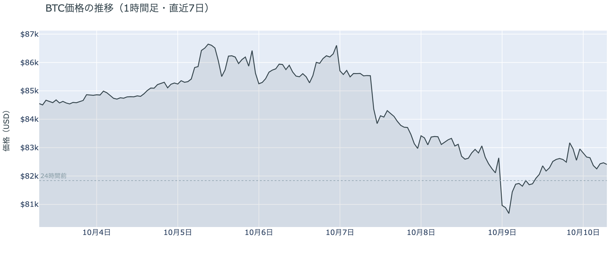

*図の見方: 1時間ごとの価格（日本時間）。点線は24時間前の水準。右端で線が点線の少し上に戻り、夜8時台に小さな山を作っています。*

* 24時間の値幅は2.3%で、前日の3.9%から縮んだ。
* Hyperliquidで見えた清算は全部がショートで、9割が夜8時台に集まり、最大の1件が全体の73%。

金曜日は、木曜深夜に割った$81,000を取り戻し、夜8時台に$83,000台まで戻した日でした。朝7時5分の時点で約$82,360と、24時間前より0.7%高い水準ですが、1週間前と比べると2.5%低く、月曜の$87,000手前からは5%あまり低いままです。日中は$81,700台から$82,600台へじわじわと戻し、夜8時台に$83,100台まで上げました。清算はこの8時台に集まっていて、Hyperliquid（＝オンチェーンの先物取引所）で見えたのは多数ではなく大口のショートが1つです。値動きがいちばん速かった8時35分と8時50分の5分足にも清算が入っていて、清算が上げを加速させました。夜11時台にもう一度$82,900台まで上げたあとは、明け方にかけて$82,200台まで下がり、朝まで小さな往復が続きました。

**図1-2 価格と50日・200日移動平均**

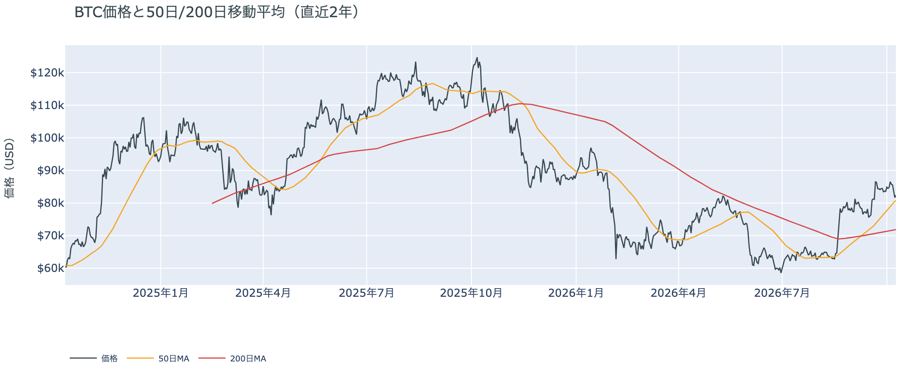

*図の見方: 2本の平均線の上下関係を見ます。50日線が200日線の上にあるのがゴールデンクロスです。*

* 50日線と200日線の差は約$8,857（12.3%）で、前日からさらに開いた。
* 価格は50日線の2.0%上で、前日の1.4%上から少し離れた。

長い目で見た流れの向きは変わらず、木曜に一時割った50日線の上に戻りました。ゴールデンクロス（＝50日線が200日線を上抜けること）の状態が32日目で、2本の平均線の差は開き続けています。価格は50日線のすぐ上に戻っただけで、1週間前のように9%上にいた形には戻っていません。

10月9日の証券市場は、株が上げ、金が1.5%上げ、原油は$91台で動かなかった日でした。米国株（S&P500）は+0.6%で、今週つけた最高値の近くで週を終えています。ビットコインにとっては、外部環境から週末へ持ち越された新しい売りの材料は無く、原油がホルムズ海峡の材料を抱えたまま$91台にいることだけが残った形です。

## 2. なぜ動いたか：きっかけと、需給のどこが動いたか

**図2-1 ビットコインと株・金・原油の相対推移（起点＝100）**

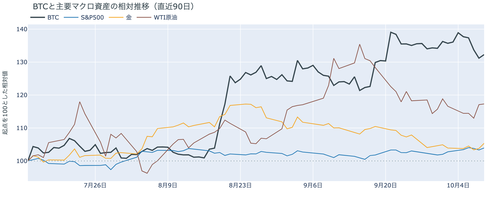

*図の見方: 同じ起点から何%動いたかで重ねたもの。線の向きが揃っているかを見ます。*

| この5営業日の動き（ビットコインは7日間） | 変化 |
|---|---:|
| ビットコイン | −2.5% |
| 金 | +1.4% |
| 米国株（S&P500） | +1.2% |
| 原油 | +0.6% |

* 建玉は92,332BTCで、前日の92,721BTCとほぼ同じ。7日では4.1%減った。
* 夜8時台は価格が0.8%上げながら建玉が0.8%減り、ショートの買い戻しと清算が同じ時間に起きた。

金曜の戻りは、はっきりしたきっかけが無いまま、先物のショートの買い戻しと清算を通って起きました。

1. きっかけ：外部環境にはっきりしたきっかけは見当たりません。上げた夜8時台は米国の朝7時にあたり、米国の経済指標は出ておらず、株の取引も始まっていませんでした。木曜にトランプ大統領が「中間選挙の前にイランを攻撃しない」と述べたあと原油は高値から戻していて、金曜の原油は$91台で動いていません。夜11時台には米国の10月の消費者態度指数が弱く出て、金が上げ米10年債利回りが5.28%から5.24%へ下がった時間にビットコインも0.5%上げましたが、戻りの大半はその前の8時台に出ていました。ベッセント財務長官が木曜に「今週中にイラン関連の暗号資産10億ドルを押収する」と述べていますが、対象は主にステーブルコインで、ビットコインの値動きに効いた形跡はありません。この5営業日では株が+1.2%、金が+1.4%なのにビットコインは−2.5%と逆向きなので、この1週間の下げは株・金と共通のきっかけではなく、金曜だけ同じ向きになりました。
2. 伝わり方：先物を通りました。夜8時台は価格が上げながら建玉（＝先物の未決済残高。証拠金で張っている人の量）が減っていて、残っていたショートの買い戻しと清算が価格を押し上げ、清算が加速させました。明け方にかけては価格が少し下げながら建玉が少し増えていて、戻った価格の上に新しいショートが積まれています。現物の買い手は戻りに加わっておらず、ETFからは10月8日も流出が出ています（図①-2）。

前日は「参加者はロングもショートも軽くして、次の材料を待っている」と説明しました。金曜も建玉は増えず、戻りを運んだのは新しいロングではなく残っていたショートの買い戻しだったので、前日の説明は今日の数値と合っています。

## 3. 市場参加者はいまどう見ているか

### ① アメリカの買い手は戻りに加わらず、ETFの流出は2日続いた

**図①-1 Coinbase Premium（アメリカとそれ以外の価格差・直近90日）**

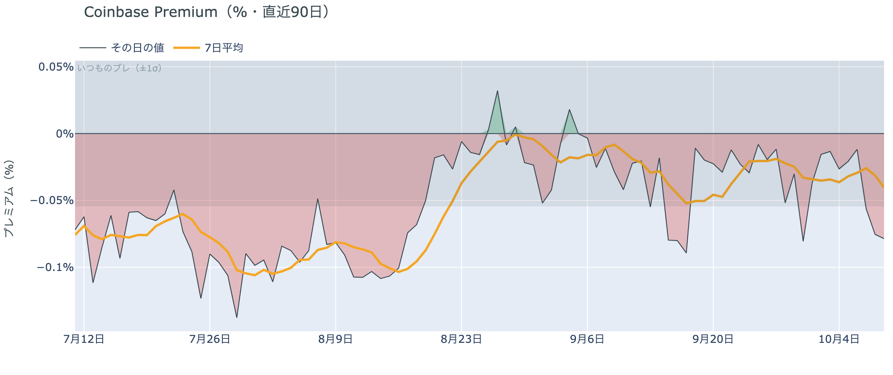

*図の見方: プラス＝アメリカで買いが強い。太線が1週間平均、細線がその日の値。薄い帯は「いつものブレの範囲」です。*

* 1週間平均は−0.04%で、前の週とほぼ同じ。
* その日の値は−0.08%で、いつものブレの1.4倍と範囲の内側。

アメリカの買い手は、金曜の戻りに加わっていません。Coinbase Premium（＝アメリカとそれ以外の価格差）は1週間平均で前の週と同じ水準に沈んだままで、戻した日にもアメリカでの買いがそれ以外の市場より強くなった形跡が無いからです。手を止めている状態が続いていて、逃げ始めたと言える形でもありません。

**図①-2 ETFの日ごとの資金の出入り（直近90日）**

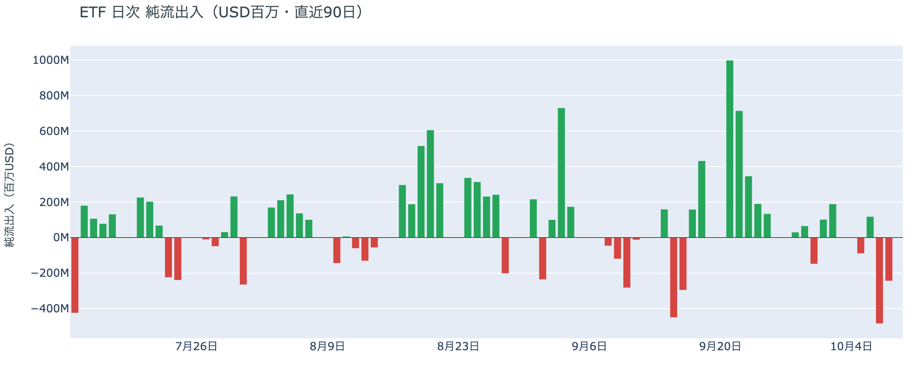

*図の見方: 入ったお金と出たお金の差。上に伸びれば入り超、下に伸びれば出超。*

| ETFの日ごとの出入り | 億ドル |
|---|---:|
| 10月2日 | +1.9 |
| 10月5日 | −0.9 |
| 10月6日 | +1.2 |
| 10月7日 | −4.8 |
| 10月8日 | −2.4 |
| 直近7営業日の合計 | −4.1 |

ETFの買い手は、一部が降りる側へ動いた状態が2日続きました。10月8日の流出は前日の半分に縮みましたが、2日で7億ドル余りが出て、直近7営業日の合計の出超も前日から広がったからです。$80,000台まで下げた日にも買い手が戻って来なかったということで、6月のように流出が何日も続いた形に一歩近づいています。

**図①-3 Fear & Greed（市場心理の指数・直近90日）**

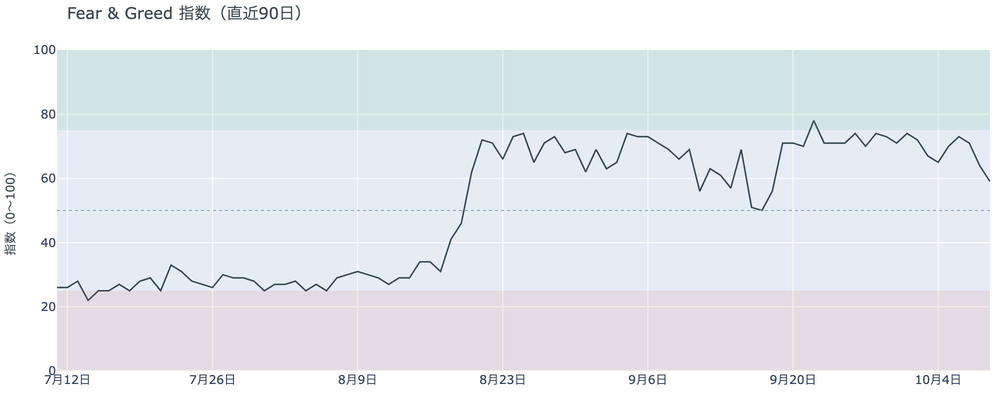

*図の見方: 0〜100で、50より上が「強欲」、下が「恐怖」。*

* 59の「強欲」。前日の64から5pt下げ、1週間前は72、1か月前は66。

市場心理は冷め続けていますが、まだ「強欲」の側にいます。Fear & Greed（＝市場心理の指数）は10月9日の確定値で1週間前から13pt下げ、「中立」の境目の55まであと4ptです。金曜に戻しても心理は戻っておらず、多数は上げへの確信を弱めながらも、まだ価格の下げを怖がってはいないということです。

### ② 長期保有者は利益確定の売りを続けているが、減り方は前の週より小さい

**図②-1 長期保有者の保有量の30日変化とSOPR（直近90日）**

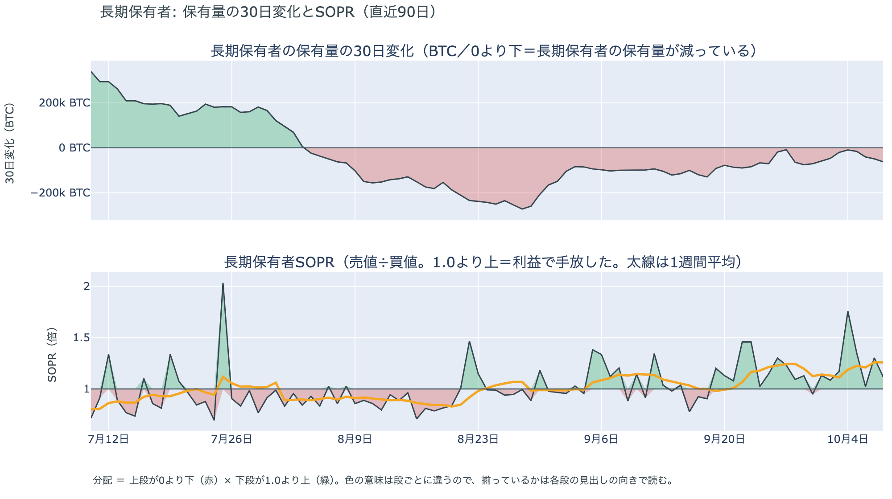

*図の見方: 上段は、長期保有者の保有量が30日でどれだけ増減したか。マイナス＝手放している。下段は長期保有者SOPRで、1より上なら利益で手放した。どちらも1週間平均で読みます。*

| 10月8日時点 | 1週間平均 | 前の週の平均 |
|---|---:|---:|
| 長期保有者SOPR（1より上＝利益で手放した） | 1.26 | 1.14 |
| 長期保有者の保有量の30日変化（万BTC） | −3.5 | −5.3 |

* その日の値は−6.2万BTCで、1か月前（9月8日）の−10.0万BTCの6割。

長期保有者（＝155日以上保有者）は利益確定の売りを続けていますが、減り方は前の週より小さくなっています。保有量は30日で減り、動いたコインは平均して買値より高く動いています。10月8日時点の数値は木曜深夜の下げをまたいだ日のものですが、$80,000台へ下げても売りを急いだ形にはなっておらず、長期保有者の側から見たビットコイン自身の需給の土台は、前日と変わっていません。

長期保有者のほかに、売りに回りそうな持ち手も見当たりません。長く眠っていたコインがまとまって動いた記録はなく、マイナーの収入も平年をやや上回る程度（Puell Multiple（＝マイナー収入の平年比）が1週間平均で1.11）で、売りを急ぐ状況ではありません。

### ③ 先物：戻りを運んだのはショートの買い戻しで、ロングは積み直されていない

**図③-1 資金調達率と建玉（直近30日）**

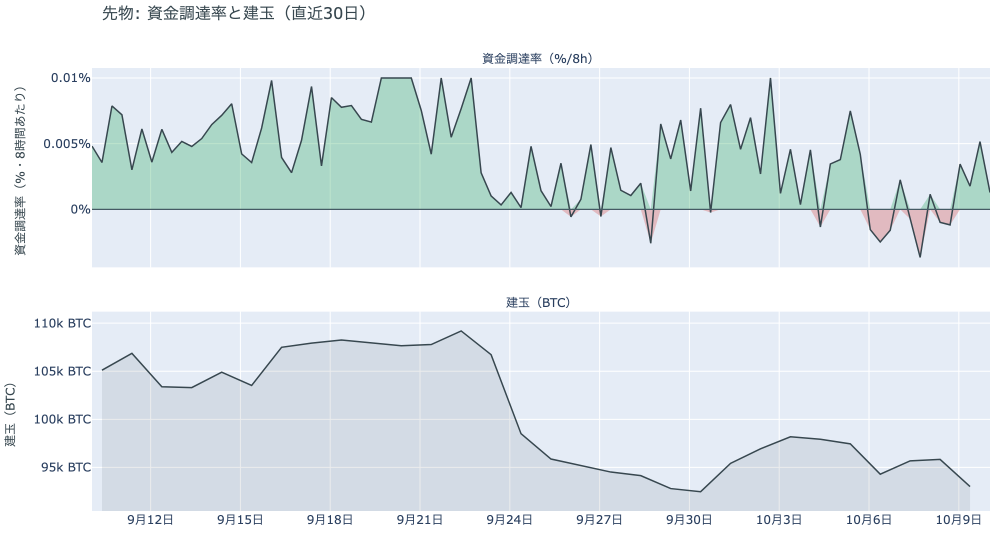

*図の見方: 上段は資金調達率（8時間ごと・日本時間）。プラスが続く＝ロングがショートより多い。下段は建玉。*

* 資金調達率はプラスが4回連続（約1.3日）で、短期金利を引いた上乗せは直近34日の平均+0.64ptを下回る。
* 建玉は前日とほぼ同じで、7日では4.1%減り、この1週間に積まれた分が消えたまま。

先物の参加者は、上げへの確信を取り戻していません。資金調達率は1日をならした年率で+3.00%と、短期金利（＝ドルを米国の短期国債で持つだけで受け取れる金利。13週Tビル 4.06%）を引いた上乗せは−1.06ptです。ロングが払う金利は普通の資金のコストを下回ったままなので、余分に払ってでも上げに賭けたい人は戻って来ていません。金曜の戻りを運んだのは残っていたショートの買い戻しで、建玉が増えていないことから、新しいロングは積まれていないと分かります。明け方には戻った価格の上に新しいショートが少し積まれていて、金曜の戻りを売り場と見た人もいるということです。参加者はロングもショートも軽いまま、上げにも下げにも賭けを大きくしていません。

### ④ オプション：下げへの備えを全部の満期に残したまま、週末の満期がいちばん高い

オプションには2種類あります。コール（＝決めた価格で買う権利）とプット（＝決めた価格で売る権利）で、価格が上がればコールの価値が上がり、価格が下がればプットの価値が上がります。プットは「価格が下がったときの保険」として買われます。オプションを買う人は、その権利と引き換えに権利料（＝オプションを買う人が払う金額）を払います。

**図④-1 満期ごとのIV（年率%）**

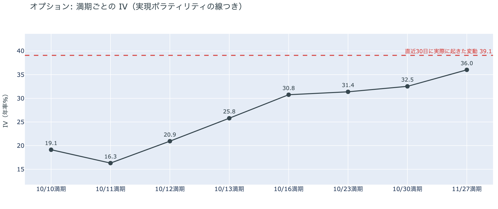

*図の見方: IVを満期ごとに並べたもの。点線は実現ボラティリティ。IVが点線より下なら、市場はこの先の値動きを過去の値動きより小さいと見ています。*

* IVは全体で37.7と、前日の36.8からわずかに上がった。実現ボラティリティ39.1より1.3pt低く、過去1年で下から14%。
* 満期ごとのIVは、10月16日の30.8から11月27日の36.0まで、突出した満期が無い。

オプションの参加者は、木曜の下げを経ても、この先の値動きが荒くなるとは見ていません。IV（＝値動きの幅の予想）は実現ボラティリティ（＝過去の値動きの幅）より低いままで、過去1年で見ても低いほうだからです。手前の満期ほどIVが低く、今日と明日に期限が来る満期は20前後で、週末の値動きは小さいと見ています。10月14日の米CPI（＝米国の物価統計）をまたぐ10月16日の満期（＝権利の期限）にも、10月末のFOMC（＝米国の金利を決める会合）をまたぐ10月30日の満期にも、ほかの満期に対する上乗せは乗っていません。

**図④-2 満期ごとのプットとコールの差**

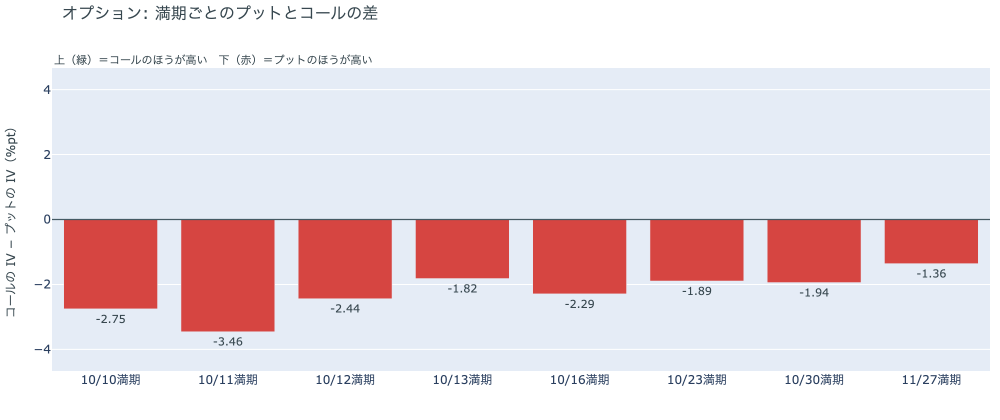

*図の見方: 満期ごとに、プットとコールのどちらが高く売れているか。ゼロより上ならコールのほうが高く、下ならプットのほうが高い。*

| 満期 | どちらが高いか |
|---|---|
| 10月10日 | プットが高い |
| 10月11日 | プットがはっきり高い |
| 10月12日 | プットが高い |
| 10月13日 | プットが高い |
| 10月16日 | プットが高い |
| 10月23日 | プットが高い |
| 10月30日 | プットが高い |
| 11月27日 | プットがわずかに高い |

参加者は、金曜に戻しても下げへの備えを外しておらず、全部の満期でプットのほうが高く値付けされたままです。いちばん高いのは明日11日に期限が来る満期で、証券市場が閉まっている週末のあいだの下げに備えているということです。前日にいちばん高かったのは当日9日の満期だったので、備えの置き場が「今日」から「週末」へ1日ずれただけで、形は変わっていません。10月末から先はプットが高いといっても差は小さく、この先の下げに身構えてはいるが、大きく崩れるとは見ていない、という構えが続いています。

**図④-3 10月30日満期の持ち高（権利の価格ごと）**

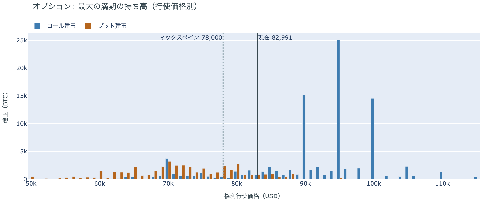

*図の見方: 青＝コール、橙＝プット。現値より上にコールが、下にプットが積まれるのが普通です。*

| 10月30日満期のオプション | 量（万BTC） | 意味 |
|---|---:|---|
| コール | 約9.5 | 「価格が上がる」に賭けた分 |
| プット | 約4.5 | 「価格が下がる」への保険 |
| うち、いまより15%以上高い価格のコール | 約2.4 | 大きな上げへの賭け |
| うち、いまより15%以上安い価格のプット | 約2.0 | 大きな下げへの保険 |

* 10月30日満期の持ち高は約14.1万BTCと全満期の37%で、前日の約13.9万BTCからわずかに増え、コールがプットの2.1倍。
* コールが集まっている価格は$95,000に約2.5万BTC、$90,000と$100,000に約1.5万BTCずつ。

「価格が上がる」に賭けた人たちは、木曜の下げでも金曜の戻りでも降りていません。10月30日満期の持ち高は前日からわずかに増え、コールの大半はいまより高い$90,000から$100,000に積まれたままだからです。その賭けが報われるには、FOMCを越えて10月30日までに$90,000を超える必要があり、距離はいまの価格から9%ほどです。先物ではロングを積み直していない一方で、オプションの上げへの賭けは残っているので、参加者は目先の下げには備えつつ、10月末までの上げへの期待は捨てていない構えです。

## 4. 価格に影響しうる直近のイベント

オプション市場が下げへの備えをいちばん厚く置いているのは明日11日の満期で、特定のイベントに向けて権利料に上乗せが乗っている満期はありません。米9月のCPIをまたぐ10月16日の満期も、10月末のFOMCをまたぐ10月30日の満期も、プットが高いといっても差は小さいままです。

| 日付 | イベント | 何に効くか |
|---|---|---|
| 10/12（月） | 米国はコロンブスデーで債券市場が休み。株は開く | 米10年債利回りの確定が1日遅れる |
| 10/14（水）21:30 日本時間 | 米9月のCPI。10月のFOMCの前に出る最後の物価統計 | 金利。プットが高い10月16日の満期がまたぐ |
| 10/15（木）21:30 日本時間 | 米9月の小売売上高と生産者物価指数 | 金利 |
| 10/27（火）〜28（水） | FOMC。利上げの織り込みは約2割で、1週間前とほぼ同じ。結果は日本時間29日未明 | 金利。プットが高い10月30日の満期がまたぐ |
| 10/29（木）〜30（金） | 日銀の会合。展望レポートも出る | 円 |
| 10/30（金）17:00 | オプションの最も大きな満期（約14.1万BTC、全満期の37%）。FOMCの2日後 | $90,000以上のコールの期限 |
| 11/1（日） | OPEC+の会合。12月の生産目標を決める | 原油 |
| 11/3（火） | 米国の中間選挙。トランプ大統領は「それまでイランを攻撃しない」と述べている | 原油 |

## まとめ：金曜日の動きは何だったか

金曜日は、はっきりしたきっかけが無いまま、先物のショートの買い戻しと清算が価格を$83,000台まで戻し、夜から明け方は小さく往復して約$82,360で朝を迎えた日でした。動いたのは先物だけで、現物の買い手は戻りに加わっておらず、ETFからは2日続けて流出が出ています。長期保有者の利益確定の売りは減り方が小さいままで、市場心理は冷めながらもまだ強欲の側にいます。参加者は、先物でロングを積み直さずオプションでは週末の満期に下げへの備えを残したまま、10月末までの上げへの賭けだけは残していて、近いうちに大きく崩れるとは見ていないが、木曜の下げが終わったとも見ていない、という構えです。

---

<small>（数値は10月10日7時5分（日本時間）までのデータに基づきます。価格・先物・オプション・Coinbase Premiumはその時点の値、市場心理は10月9日の確定値、オンチェーン（＝ブロックチェーン上の記録）は10月8日時点、ETF資金フローは10月8日分まで確定で、10月9日分は集計途中です。証券市場の終値は10月9日時点です。FOMCの織り込みは10月9日のFF金利先物の終値から計算したものです。オンチェーンの長期保有者の数値には、ETFや取引所が預かっている分も含まれます。オプションはDeribit（BTCオプションの大半を占める取引所）の全銘柄です。）</small>

*本稿は情報提供を目的としたものであり、投資助言ではありません。将来の価格動向を保証・示唆するものではなく、投資判断は各自の責任において行ってください。*
