# 値幅0.8%の土曜日、清算はゼロで建玉も動かず ― 週末のプットの高さは消え、ETFの流出は2日で止まる

**2026年10月11日**

ビットコインは土曜日、$82,400台から$83,000台のあいだで小さく上下しただけで、朝7時5分の時点で約$82,980でした。

* **価格**：24時間の値幅は0.8%と、この1週間でいちばん小さく、前日の2.3%から大きく縮んだ。月曜の$87,000手前からの下げは取り戻しておらず、1週間前より2%ほど低い水準で週末に入った
* **きっかけ**：新しいきっかけは来なかった。証券市場は週末で閉まっており、金曜にホルムズ海峡でタンカーへの攻撃が続いても原油は$91台で動かなかった。この5営業日では株と金が上げビットコインが下げていて、共通のきっかけで動いた週ではない
* **先物**：上げも下げも運んでいない。建玉（＝先物の未決済残高。証拠金で張っている人の量）は前日からほぼ変わらず、清算（＝証拠金不足で強制的に閉じられた取引）はゼロ。買い持ち（ロング）も売り持ち（ショート）も新しく積まれておらず、参加者は上げにも下げにも賭けを大きくしていない
* **需給の土台**：ETFの流出は2日で止まり、10月9日はわずかな流入に戻った。米国の買い手は手を止めたままで、長期保有者の利益確定の売りは続いているが減り方は前の週より小さいままなので、前日から変わっていない
* **オプションの見方**：週末の満期に置いていた下げへの備えは外れ、今日と明日の満期ではコールのほうが高くなった。週末は荒れないと見ていて、下げへの備えは13日から先、とくに米CPIをまたぐ16日の満期に置いている

## 1. 何が起きたか

**図1-1 価格の推移（1時間足・直近7日）**

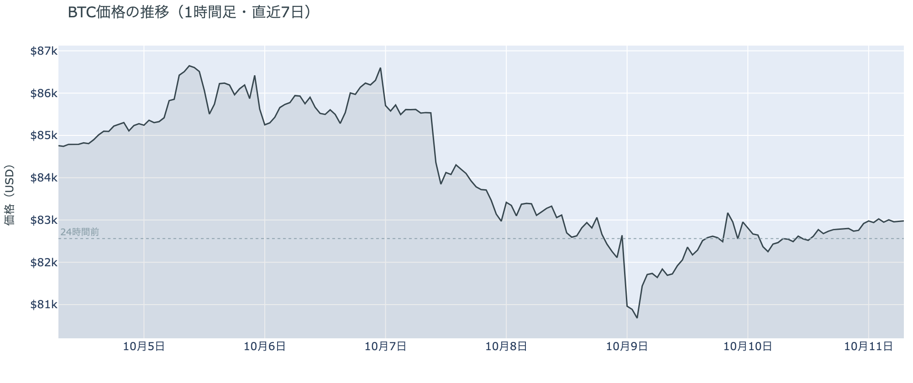

*図の見方: 1時間ごとの価格（日本時間）。点線は24時間前の水準。右端の線は点線のわずかに上で、ほぼ平らです。*

* 24時間の値幅は0.8%で、前日の2.3%の3分の1。1時間ごとの動きは全部が0.2%以内。
* Hyperliquidで見えた清算は、この24時間で0件。

土曜日は、この1週間でいちばん静かな24時間でした。朝7時5分の時点で約$82,980と、24時間前より0.5%高い水準ですが、1週間前と比べると2%ほど低く、月曜の$87,000手前からは5%近く低いままです。日中は$82,500台から$82,700台で横ばい、深夜から明け方にかけて$83,000をわずかに上回る時間があっただけで、山も谷も作っていません。金曜の夜8時台に集まっていた清算は、土曜日にはHyperliquid（＝オンチェーンの先物取引所）で1件も出ていません。

**図1-2 価格と50日・200日移動平均**

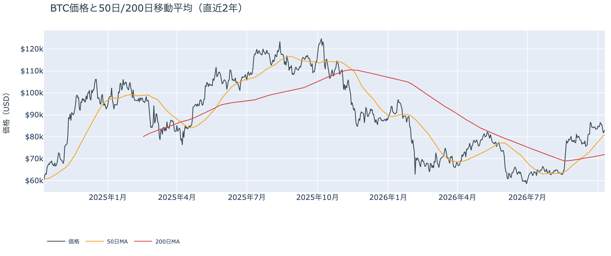

*図の見方: 2本の平均線の上下関係を見ます。50日線が200日線の上にあるのがゴールデンクロスです。*

* 50日線と200日線の差は約$8,891（12.4%）で、前日からさらに開いた。
* 価格は50日線の2.7%上で、前日の2.0%上から少し離れた。

長い目で見た流れの向きは変わっていません。ゴールデンクロス（＝50日線が200日線を上抜けること）の状態が33日目で、2本の平均線の差は開き続けています。価格は木曜に一時割った50日線の上に戻ったまま、土曜日はそのすぐ上で止まっていて、1週間前のように9%上にいた形には戻っていません。

10月9日の証券市場は、株と金がそろって上げ、原油は$91台で動かなかった日でした。米国株（S&P500）は+0.6%で今週つけた最高値の近くで週を終え、金は+1.4%です。ビットコインにとっては、外部環境から週末へ持ち越された売りの材料は無く、週末のあいだに新しい材料も来なかった、という状態です。

## 2. なぜ動いたか：きっかけと、需給のどこが動いたか

**図2-1 ビットコインと株・金・原油の相対推移（起点＝100）**

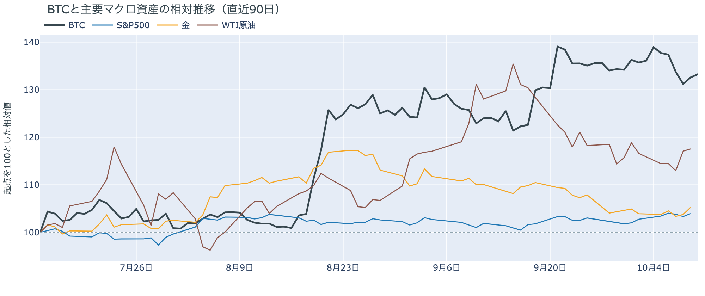

*図の見方: 同じ起点から何%動いたかで重ねたもの。線の向きが揃っているかを見ます。*

| この5営業日の動き（ビットコインは7日間） | 変化 |
|---|---:|
| ビットコイン | −2.1% |
| 金 | +1.3% |
| 米国株（S&P500） | +1.2% |
| 原油 | +0.8% |

* 建玉は92,674BTCで、前日の92,332BTCとほぼ同じ。7日では5.8%減ったまま。
* 証券市場が閉まっている24時間で、価格が0.5%上げるあいだに建玉は0.4%しか動かなかった。

土曜日に価格が動かなかったのは、新しいきっかけが来ず、先物のロングもショートも新しく積まれなかったからです。

1. きっかけ：外部環境に新しいきっかけはありません。証券市場は週末で閉まっていました。金曜にはイラン革命防衛隊がホルムズ海峡でタンカーを攻撃したと発表し、海峡の外でも船を追うと表明しましたが、同じ金曜の原油は+0.4%の$91台で動いておらず、土曜のビットコインに効いた形跡もありません。この5営業日では株が+1.2%、金が+1.3%なのにビットコインは−2.1%と逆向きなので、この1週間の下げは株・金と共通のきっかけではありません。木曜にトランプ大統領が「中間選挙の前にイランを攻撃しない」と述べて以来、原油は高値から戻した水準にとどまっています。
2. 伝わり方：どこも通っていません。価格が0.5%上げるあいだ建玉はほぼ変わらず、清算はゼロで、資金調達率（＝ロングが払う金利。プラス＝ロングがショートより多い）は0のすぐ近くで上下しているだけです。ロングもショートも新しく積まれておらず、手仕舞いも出ていません。現物の側も、ETFの10月9日の流入はわずかで（図①-2）、アメリカの買い手は手を止めたままです（図①-1）。

前日は「参加者はロングもショートも軽いまま、上げにも下げにも賭けを大きくしていない」と説明しました。土曜日は建玉が動かず清算もゼロだったので、前日の説明は今日の数値と合っています。市場の多数は、木曜の下げのあとの戻りを「流れが変わった」とも「下げが終わった」とも決めずに、次の材料を待っています。

## 3. 市場参加者はいまどう見ているか

### ① アメリカの買い手は手を止めたまま、ETFの流出は2日で止まった

**図①-1 Coinbase Premium（アメリカとそれ以外の価格差・直近90日）**

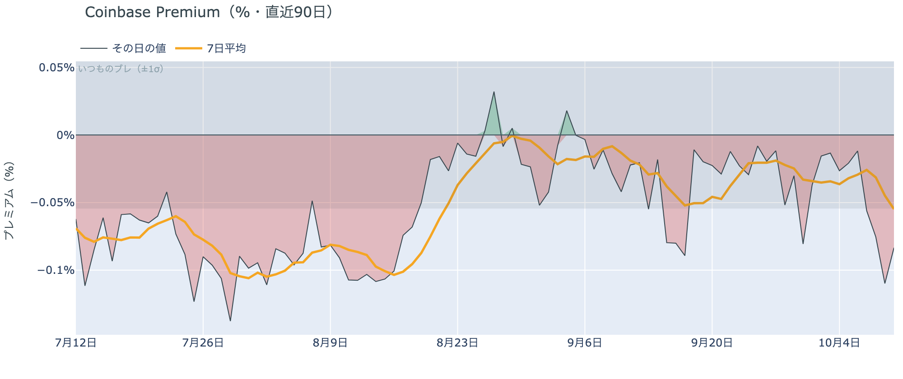

*図の見方: プラス＝アメリカで買いが強い。太線が1週間平均、細線がその日の値。薄い帯は「いつものブレの範囲」です。*

* 1週間平均は−0.06%で、前の週の−0.03%から沈んだ。
* その日の値は−0.08%で、いつものブレの1.5倍と範囲の外側。前日の−0.11%からは戻した。

アメリカの買い手は、週末に入っても戻って来ていません。Coinbase Premium（＝アメリカとそれ以外の価格差）は1週間平均で前の週より沈み、この2日はいつものブレの範囲を超えてマイナスに振れているので、$80,000台へ下げた今週、アメリカでの買いはそれ以外の市場より弱かったということです。手を止めている状態が一段深くなっていますが、逃げ始めたと言える形ではなく、土曜のその日の値は前日より戻しています。

**図①-2 ETFの日ごとの資金の出入り（直近90日）**

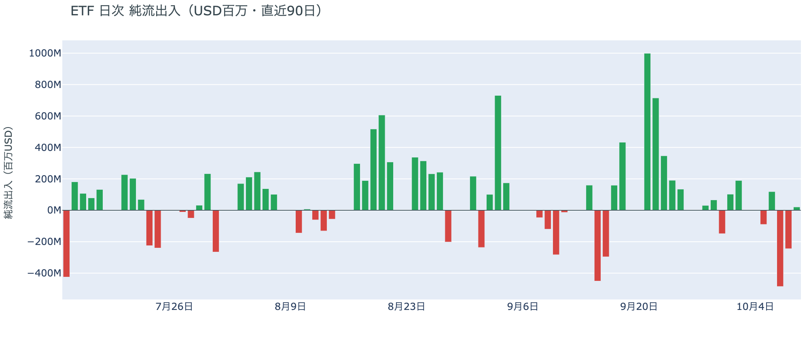

*図の見方: 入ったお金と出たお金の差。上に伸びれば入り超、下に伸びれば出超。*

| ETFの日ごとの出入り | 億ドル |
|---|---:|
| 10月2日 | +1.9 |
| 10月5日 | −0.9 |
| 10月6日 | +1.2 |
| 10月7日 | −4.8 |
| 10月8日 | −2.4 |
| 10月9日 | +0.2 |
| 直近7営業日の合計 | −3.9 |

ETFの買い手は、一部が降りた状態のまま、それ以上は降りませんでした。10月9日はわずかな流入に戻り、2日続いた流出が3日目に広がらなかったからです。前日に「6月のように流出が何日も続いた形に一歩近づいている」と書きましたが、その形には進んでいません。ただ戻って来たのもごくわずかで、直近7営業日の合計は出超のままなので、買い手が戻ったとも言えません。

**図①-3 Fear & Greed（市場心理の指数・直近90日）**

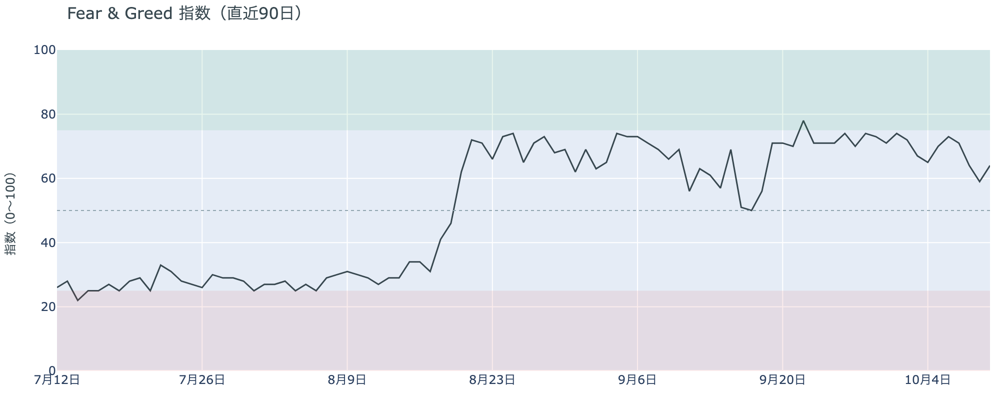

*図の見方: 0〜100で、50より上が「強欲」、下が「恐怖」。*

* 64の「強欲」。前日の59から5pt戻し、1週間前は67、1か月前は69。

市場心理は、木曜の下げで冷めた分の一部を取り戻しました。Fear & Greed（＝市場心理の指数）は10月10日の確定値で「中立」の境目から離れ、1週間前との差も3ptまで縮んでいます。多数は価格の下げを怖がっておらず、金曜の戻りと土曜の静けさを見て、上げへの確信を少し持ち直したということです。

### ② 長期保有者は利益確定の売りを続けているが、減り方は前の週より小さい

**図②-1 長期保有者の保有量の30日変化とSOPR（直近90日）**

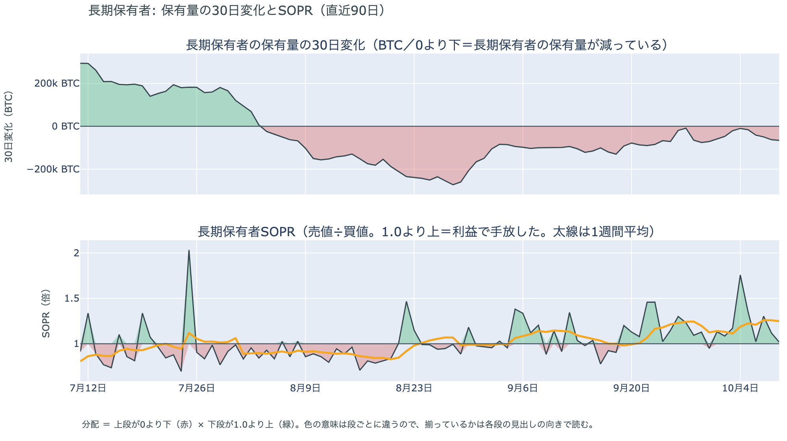

*図の見方: 上段は、長期保有者の保有量が30日でどれだけ増減したか。マイナス＝手放している。下段は長期保有者SOPRで、1より上なら利益で手放した。どちらも1週間平均で読みます。*

| 10月9日時点 | 1週間平均 | 前の週の平均 |
|---|---:|---:|
| 長期保有者SOPR（1より上＝利益で手放した） | 1.25 | 1.13 |
| 長期保有者の保有量の30日変化（万BTC） | −3.8 | −4.9 |

* 1週間平均の減り方は、1か月前（9月9日）の−10.0万BTCの4割弱。

長期保有者（＝155日以上保有者）は利益確定の売りを続けていますが、減り方は前の週より小さくなっています。保有量は30日で減り、動いたコインは平均して買値より高く動いています。10月9日時点の数値は木曜の$80,000台への下げをまたいだ日のものですが、売りを急いだ形にはなっておらず、長期保有者の側から見たビットコイン自身の需給の土台は、前日と変わっていません。

長期保有者のほかに、売りに回りそうな持ち手も見当たりません。長く眠っていたコインがまとまって動いた記録はなく、マイナーの収入も平年をやや上回る程度（Puell Multiple（＝マイナー収入の平年比）が1週間平均で1.11）で、売りを急ぐ状況ではありません。

### ③ 先物：ロングもショートも積まれず、上げに賭けたい人はいない

**図③-1 資金調達率と建玉（直近30日）**

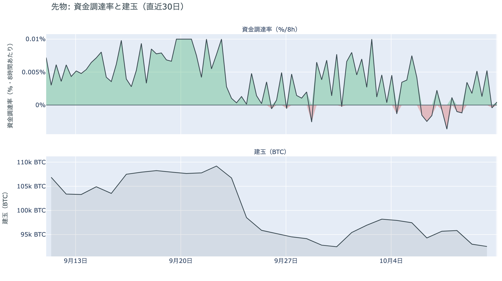

*図の見方: 上段は資金調達率（8時間ごと・日本時間）。プラスが続く＝ロングがショートより多い。下段は建玉。*

* 資金調達率は0のすぐ近くで上下していて、短期金利を引いた上乗せは直近34日の平均+0.58ptを下回る。
* 建玉は前日とほぼ同じで、7日では5.8%減り、この1週間に積まれた分が消えたまま。

先物の参加者は、上げにも下げにも確信を持たずに週末を過ごしています。資金調達率は1日をならした年率で+1.92%と、短期金利（＝ドルを米国の短期国債で持つだけで受け取れる金利。13週Tビル 4.06%）を引いた上乗せは−2.14ptです。ロングが払う金利は普通の資金のコストを大きく下回っているので、余分に払ってでも上げに賭けたい人はいなくなりました。一方で建玉が減っていないことから、残っているロングを投げてもおらず、新しいショートも積まれていません。金曜の戻りを運んだショートの買い戻しが一巡したあとは、どちらの側も動かず、次の材料を待っているということです。

### ④ オプション：週末の下げへの備えは外れ、備えは13日から先の満期に移った

オプションには2種類あります。コール（＝決めた価格で買う権利）とプット（＝決めた価格で売る権利）で、価格が上がればコールの価値が上がり、価格が下がればプットの価値が上がります。プットは「価格が下がったときの保険」として買われます。オプションを買う人は、その権利と引き換えに権利料（＝オプションを買う人が払う金額）を払います。

**図④-1 満期ごとのIV（年率%）**

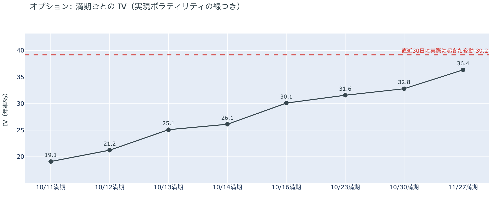

*図の見方: IVを満期ごとに並べたもの。点線は実現ボラティリティ。IVが点線より下なら、市場はこの先の値動きを過去の値動きより小さいと見ています。*

* IVは全体で36.4と、前日の37.7から下がった。実現ボラティリティ39.2より2.8pt低く、過去1年で下から16%。
* 満期ごとのIVは、今日11日の19.1から11月27日の36.4まで、手前ほど低く先ほど高い形で、突出した満期が無い。

オプションの参加者は、この先の値動きが荒くなるとは見ていません。IV（＝値動きの幅の予想）は実現ボラティリティ（＝過去の値動きの幅）より低く、その差は前日より広がりました。木曜の下げで上がった分の予想が、金曜の戻りと土曜の静けさでほどけたということです。今日と明日の満期（＝権利の期限）のIVは20前後で、日曜から週明けにかけての値動きは小さいと見ています。10月14日の米CPI（＝米国の物価統計）をまたぐ10月16日の満期にも、10月末のFOMC（＝米国の金利を決める会合）をまたぐ10月30日の満期にも、ほかの満期に対する上乗せは乗っていません。

**図④-2 満期ごとのプットとコールの差**

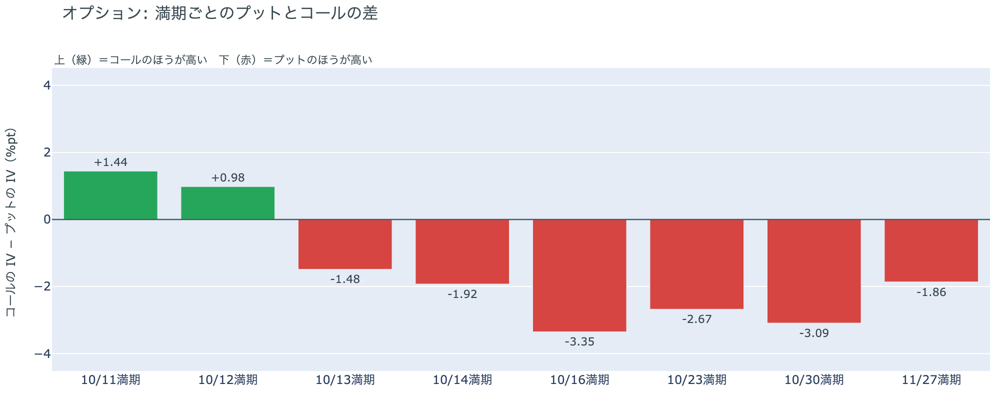

*図の見方: 満期ごとに、プットとコールのどちらが高く売れているか。ゼロより上ならコールのほうが高く、下ならプットのほうが高い。*

| 満期 | どちらが高いか |
|---|---|
| 10月11日 | コールが高い（前日はプットがはっきり高かった） |
| 10月12日 | コールが高い（前日はプットが高かった） |
| 10月13日 | プットが高い |
| 10月14日 | プットが高い |
| 10月16日 | プットがはっきり高い |
| 10月23日 | プットが高い |
| 10月30日 | プットがはっきり高い |
| 11月27日 | プットが高い |

参加者は、週末は荒れないと見ていて、下げへの備えを13日から先の満期に置いています。前日まで全部の満期でプットのほうが高く、いちばん高かったのは今日11日の満期でした。それが今日と明日の満期ではコールのほうが高く値付けされる形に変わったので、証券市場が閉まっている週末の下げに備えて買われていたプットは、土曜日に何も起きなかったことで外れたということです。13日から先はプットのほうが高いままで、いちばん高いのは米CPIをまたぐ10月16日と、FOMCをまたぐ10月30日の満期です。参加者が身構えているのは週末ではなく、来週の米CPIと10月末のFOMCだということです。

**図④-3 10月30日満期の持ち高（権利の価格ごと）**

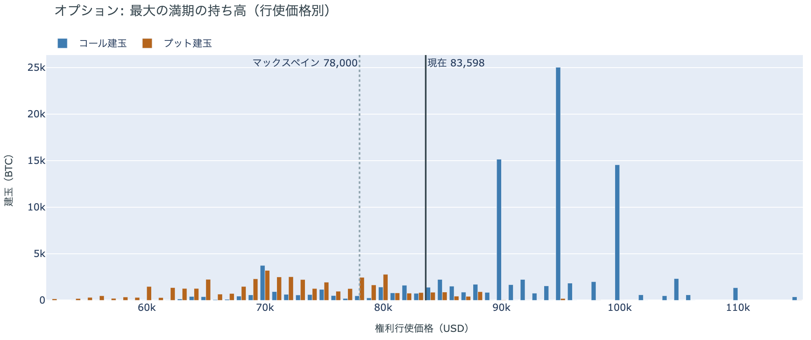

*図の見方: 青＝コール、橙＝プット。現値より上にコールが、下にプットが積まれるのが普通です。*

| 10月30日満期のオプション | 量（万BTC） | 意味 |
|---|---:|---|
| コール | 約9.5 | 「価格が上がる」に賭けた分 |
| プット | 約4.6 | 「価格が下がる」への保険 |
| うち、いまより15%以上高い価格のコール | 約2.2 | 大きな上げへの賭け |
| うち、いまより15%以上安い価格のプット | 約2.2 | 大きな下げへの保険 |

* 10月30日満期の持ち高は約14.1万BTCと全満期の37%で、前日と同じ。コールがプットの2.1倍。
* コールが集まっている価格は$95,000に約2.5万BTC、$90,000と$100,000に約1.5万BTCずつ。

「価格が上がる」に賭けた人たちは、週末に入っても降りていません。10月30日満期の持ち高は前日から動かず、コールの大半はいまより高い$90,000から$100,000に積まれたままだからです。その賭けが報われるには、FOMCを越えて10月30日までに$90,000を超える必要があり、距離はいまの価格から8%ほどです。先物ではロングを積まず、オプションでは週末の下げへの備えを外しながらも、10月末までの上げへの賭けだけは残しているので、参加者は近いうちに大きく崩れるとは見ていない一方、上げの材料が来るまでは動かない構えです。

## 4. 価格に影響しうる直近のイベント

オプション市場が下げへの備えをいちばん厚く置いているのは、米9月のCPIをまたぐ10月16日の満期と、FOMCをまたぐ10月30日の満期です。どちらもプットが高いだけで、ほかの満期に対して権利料に上乗せが乗っているわけではありません。週末の満期に置かれていた備えは外れ、週明けまでは荒れないと見られています。

| 日付 | イベント | 何に効くか |
|---|---|---|
| 10/12（月） | 米国はコロンブスデーで債券市場が休み。株は開く | 米10年債利回りの確定が1日遅れる |
| 10/14（水）21:30 日本時間 | 米9月のCPI。10月のFOMCの前に出る最後の物価統計 | 金利。プットが高い10月16日の満期がまたぐ |
| 10/15（木）21:30 日本時間 | 米9月の小売売上高と生産者物価指数 | 金利 |
| 10/16（金）17:00 | オプションの満期。米CPIをまたぐ満期で、プットがいちばん高い | 下げへの備えの期限 |
| 10/27（火）〜28（水） | FOMC。利上げの織り込みは約2割で、1週間前の約2割から変わっていない。結果は日本時間29日未明 | 金利。プットが高い10月30日の満期がまたぐ |
| 10/29（木）〜30（金） | 日銀の会合。展望レポートも出る | 円 |
| 10/30（金）17:00 | オプションの最も大きな満期（約14.1万BTC、全満期の37%）。FOMCの2日後 | $90,000以上のコールの期限 |
| 11/1（日） | OPEC+の会合。12月の生産目標を決める | 原油 |
| 11/3（火） | 米国の中間選挙。トランプ大統領は「それまでイランを攻撃しない」と述べている | 原油 |

## まとめ：土曜日の動きは何だったか

土曜日は、新しいきっかけが来ず、先物のロングもショートも動かなかったので、価格も$83,000の手前で動かなかった日でした。ビットコイン自身の需給の土台は変わっていません。ETFの流出は2日で止まりましたが、アメリカの買い手は手を止めたままで、長期保有者の利益確定の売りも減り方が小さいまま続いています。参加者は、週末の下げに備えて買っていたプットを外し、先物でもロングを積まないまま10月末までの上げへの賭けだけを残していて、近いうちに大きく崩れるとは見ていないが、来週の米CPIと10月末のFOMCまでは動く材料が無い、という構えです。

---

<small>（数値は10月11日7時5分（日本時間）までのデータに基づきます。価格・先物・オプション・Coinbase Premiumはその時点の値、市場心理は10月10日の確定値、オンチェーン（＝ブロックチェーン上の記録）は10月9日時点、ETF資金フローは10月9日分までです。証券市場の終値は10月9日時点で、週末のため更新がありません。FOMCの織り込みは10月9日のFF金利先物の終値から計算したものです。オンチェーンの長期保有者の数値には、ETFや取引所が預かっている分も含まれます。オプションはDeribit（BTCオプションの大半を占める取引所）の全銘柄です。）</small>

*本稿は情報提供を目的としたものであり、投資助言ではありません。将来の価格動向を保証・示唆するものではなく、投資判断は各自の責任において行ってください。*
